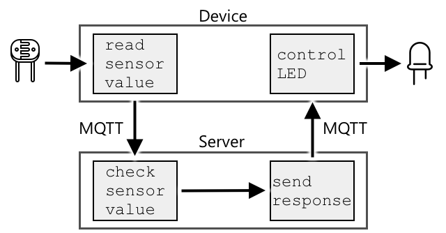

<!--
CO_OP_TRANSLATOR_METADATA:
{
  "original_hash": "71b5040e0b3472f1c0949c9b55f224c0",
  "translation_date": "2025-08-27T21:11:38+00:00",
  "source_file": "1-getting-started/lessons/4-connect-internet/README.md",
  "language_code": "th"
}
-->
# เชื่อมต่ออุปกรณ์ของคุณกับอินเทอร์เน็ต


> สเก็ตโน้ตโดย [Nitya Narasimhan](https://github.com/nitya) คลิกที่ภาพเพื่อดูเวอร์ชันขนาดใหญ่

บทเรียนนี้เป็นส่วนหนึ่งของ [ซีรีส์ Hello IoT](https://youtube.com/playlist?list=PLmsFUfdnGr3xRts0TIwyaHyQuHaNQcb6-) จาก [Microsoft Reactor](https://developer.microsoft.com/reactor/?WT.mc_id=academic-17441-jabenn) บทเรียนนี้ถูกสอนผ่านวิดีโอ 2 ตอน - บทเรียน 1 ชั่วโมง และช่วงตอบคำถาม 1 ชั่วโมงที่เจาะลึกในเนื้อหาและตอบคำถามเพิ่มเติม

[](https://youtu.be/O4dd172mZhs)

[](https://youtu.be/j-cVCzRDE2Q)

> 🎥 คลิกที่ภาพด้านบนเพื่อดูวิดีโอ

## แบบทดสอบก่อนเรียน

[แบบทดสอบก่อนเรียน](https://black-meadow-040d15503.1.azurestaticapps.net/quiz/7)

## บทนำ

ตัวอักษร **I** ใน IoT ย่อมาจาก **Internet** - การเชื่อมต่อกับคลาวด์และบริการต่าง ๆ ที่ช่วยให้ IoT อุปกรณ์สามารถทำงานได้หลากหลาย ตั้งแต่การรวบรวมข้อมูลจากเซ็นเซอร์ที่เชื่อมต่อกับอุปกรณ์ ไปจนถึงการส่งข้อความเพื่อควบคุมแอคชูเอเตอร์ อุปกรณ์ IoT มักจะเชื่อมต่อกับบริการ IoT บนคลาวด์เพียงหนึ่งเดียวผ่านโปรโตคอลการสื่อสารมาตรฐาน และบริการนั้นจะเชื่อมต่อกับส่วนอื่น ๆ ของแอปพลิเคชัน IoT ของคุณ เช่น บริการ AI เพื่อช่วยตัดสินใจอย่างชาญฉลาดเกี่ยวกับข้อมูล หรือแอปพลิเคชันเว็บสำหรับการควบคุมหรือรายงาน

> 🎓 ข้อมูลที่รวบรวมจากเซ็นเซอร์และส่งไปยังคลาวด์เรียกว่า เทเลเมทรี (telemetry)

อุปกรณ์ IoT สามารถรับข้อความจากคลาวด์ได้ โดยข้อความเหล่านี้มักจะมีคำสั่ง - ซึ่งเป็นคำแนะนำให้ดำเนินการบางอย่าง ไม่ว่าจะเป็นการทำงานภายใน (เช่น รีบูตหรืออัปเดตเฟิร์มแวร์) หรือการใช้แอคชูเอเตอร์ (เช่น เปิดไฟ)

บทเรียนนี้จะแนะนำโปรโตคอลการสื่อสารบางประเภทที่อุปกรณ์ IoT สามารถใช้เพื่อเชื่อมต่อกับคลาวด์ และประเภทของข้อมูลที่อาจส่งหรือรับ นอกจากนี้คุณยังจะได้ทดลองใช้งานจริง โดยเพิ่มการควบคุมผ่านอินเทอร์เน็ตให้กับไฟกลางคืนของคุณ และย้ายตรรกะการควบคุม LED ไปยังโค้ด 'เซิร์ฟเวอร์' ที่ทำงานในเครื่อง

ในบทเรียนนี้เราจะครอบคลุม:

* [โปรโตคอลการสื่อสาร](../../../../../1-getting-started/lessons/4-connect-internet)
* [Message Queueing Telemetry Transport (MQTT)](../../../../../1-getting-started/lessons/4-connect-internet)
* [เทเลเมทรี](../../../../../1-getting-started/lessons/4-connect-internet)
* [คำสั่ง](../../../../../1-getting-started/lessons/4-connect-internet)

## โปรโตคอลการสื่อสาร

มีโปรโตคอลการสื่อสารยอดนิยมหลายประเภทที่อุปกรณ์ IoT ใช้เพื่อสื่อสารกับอินเทอร์เน็ต โปรโตคอลที่ได้รับความนิยมมากที่สุดมักจะใช้การส่งข้อความแบบเผยแพร่/สมัครสมาชิกผ่านตัวกลางบางประเภท อุปกรณ์ IoT จะเชื่อมต่อกับตัวกลางและเผยแพร่เทเลเมทรี รวมถึงสมัครรับคำสั่ง บริการคลาวด์ก็เชื่อมต่อกับตัวกลางเช่นกัน และสมัครรับข้อความเทเลเมทรีทั้งหมด รวมถึงเผยแพร่คำสั่งไปยังอุปกรณ์เฉพาะหรือกลุ่มอุปกรณ์


MQTT เป็นโปรโตคอลการสื่อสารที่ได้รับความนิยมมากที่สุดสำหรับอุปกรณ์ IoT และจะถูกกล่าวถึงในบทเรียนนี้ โปรโตคอลอื่น ๆ ได้แก่ AMQP และ HTTP/HTTPS

## Message Queueing Telemetry Transport (MQTT)

[MQTT](http://mqtt.org) เป็นโปรโตคอลการส่งข้อความแบบเปิดที่มีน้ำหนักเบาและสามารถส่งข้อความระหว่างอุปกรณ์ได้ ถูกออกแบบในปี 1999 เพื่อใช้ตรวจสอบท่อส่งน้ำมัน ก่อนที่จะถูกปล่อยเป็นมาตรฐานเปิดโดย IBM หลังจากนั้น 15 ปี

MQTT มีตัวกลางเพียงตัวเดียวและมีลูกค้าหลายตัว ลูกค้าทั้งหมดเชื่อมต่อกับตัวกลาง และตัวกลางจะส่งข้อความไปยังลูกค้าที่เกี่ยวข้อง ข้อความจะถูกส่งผ่านหัวข้อที่มีชื่อเฉพาะ แทนที่จะส่งตรงไปยังลูกค้าแต่ละราย ลูกค้าสามารถเผยแพร่ไปยังหัวข้อ และลูกค้าทั้งหมดที่สมัครรับหัวข้อนั้นจะได้รับข้อความ


✅ ทำการค้นคว้า: หากคุณมีอุปกรณ์ IoT จำนวนมาก คุณจะมั่นใจได้อย่างไรว่าตัวกลาง MQTT ของคุณสามารถจัดการข้อความทั้งหมดได้?

### เชื่อมต่ออุปกรณ์ IoT ของคุณกับ MQTT

ขั้นตอนแรกของการเพิ่มการควบคุมผ่านอินเทอร์เน็ตให้กับไฟกลางคืนของคุณคือการเชื่อมต่อกับตัวกลาง MQTT

#### งาน

เชื่อมต่ออุปกรณ์ของคุณกับตัวกลาง MQTT

ในส่วนนี้ของบทเรียน คุณจะเชื่อมต่อไฟกลางคืน IoT ของคุณกับอินเทอร์เน็ตเพื่อให้สามารถควบคุมได้จากระยะไกล ต่อมาในบทเรียนนี้ อุปกรณ์ IoT ของคุณจะส่งข้อความเทเลเมทรีผ่าน MQTT ไปยังตัวกลาง MQTT สาธารณะพร้อมระดับแสง ซึ่งจะถูกดึงข้อมูลโดยโค้ดเซิร์ฟเวอร์ที่คุณจะเขียน โค้ดนี้จะตรวจสอบระดับแสงและส่งข้อความคำสั่งกลับไปยังอุปกรณ์เพื่อบอกให้เปิดหรือปิด LED

กรณีการใช้งานในโลกจริงสำหรับการตั้งค่าเช่นนี้อาจเป็นการรวบรวมข้อมูลจากเซ็นเซอร์แสงหลายตัวก่อนที่จะตัดสินใจเปิดไฟในสถานที่ที่มีไฟจำนวนมาก เช่น สนามกีฬา วิธีนี้จะช่วยป้องกันไม่ให้ไฟเปิดหากมีเพียงเซ็นเซอร์เดียวที่ถูกเมฆหรือนกบัง แต่เซ็นเซอร์อื่น ๆ ยังคงตรวจจับแสงได้เพียงพอ

✅ สถานการณ์อื่นใดที่ต้องการข้อมูลจากเซ็นเซอร์หลายตัวเพื่อประเมินก่อนส่งคำสั่ง?

แทนที่จะต้องจัดการกับความซับซ้อนของการตั้งค่าตัวกลาง MQTT เป็นส่วนหนึ่งของงานนี้ คุณสามารถใช้เซิร์ฟเวอร์ทดสอบสาธารณะที่รัน [Eclipse Mosquitto](https://www.mosquitto.org) ซึ่งเป็นตัวกลาง MQTT แบบโอเพ่นซอร์ส ตัวกลางทดสอบนี้สามารถเข้าถึงได้ที่ [test.mosquitto.org](https://test.mosquitto.org) และไม่ต้องการการตั้งค่าบัญชี ทำให้เป็นเครื่องมือที่ยอดเยี่ยมสำหรับการทดสอบไคลเอนต์และเซิร์ฟเวอร์ MQTT

> 💁 ตัวกลางทดสอบนี้เป็นสาธารณะและไม่ปลอดภัย ใครก็ตามสามารถฟังสิ่งที่คุณเผยแพร่ได้ ดังนั้นจึงไม่ควรใช้กับข้อมูลที่ต้องการความเป็นส่วนตัว



ทำตามขั้นตอนที่เกี่ยวข้องด้านล่างเพื่อเชื่อมต่ออุปกรณ์ของคุณกับตัวกลาง MQTT:

* [Arduino - Wio Terminal](wio-terminal-mqtt.md)
* [คอมพิวเตอร์บอร์ดเดี่ยว - Raspberry Pi/อุปกรณ์ IoT เสมือน](single-board-computer-mqtt.md)

### เจาะลึก MQTT

หัวข้อใน MQTT สามารถมีลำดับชั้น และลูกค้าสามารถสมัครรับระดับต่าง ๆ ของลำดับชั้นโดยใช้ไวลด์การ์ด ตัวอย่างเช่น คุณสามารถส่งข้อความเทเลเมทรีอุณหภูมิไปยังหัวข้อ `/telemetry/temperature` และข้อความความชื้นไปยังหัวข้อ `/telemetry/humidity` จากนั้นในแอปคลาวด์ของคุณสมัครรับหัวข้อ `/telemetry/*` เพื่อรับทั้งข้อความเทเลเมทรีอุณหภูมิและความชื้น

ข้อความสามารถถูกส่งด้วยคุณภาพของบริการ (QoS) ซึ่งกำหนดการรับประกันของการรับข้อความ

* ส่งเพียงครั้งเดียว - ข้อความจะถูกส่งเพียงครั้งเดียว และไคลเอนต์และตัวกลางจะไม่ดำเนินการเพิ่มเติมเพื่อยืนยันการส่ง (ส่งแล้วลืม)
* ส่งอย่างน้อยหนึ่งครั้ง - ข้อความจะถูกส่งซ้ำโดยผู้ส่งหลายครั้งจนกว่าจะได้รับการยืนยัน (การส่งที่ได้รับการยืนยัน)
* ส่งเพียงครั้งเดียว - ผู้ส่งและผู้รับจะทำการจับมือสองระดับเพื่อให้แน่ใจว่ามีเพียงสำเนาเดียวของข้อความที่ได้รับ (การส่งที่มั่นใจ)

✅ สถานการณ์ใดที่อาจต้องการข้อความที่มั่นใจว่าจะส่งถึงมากกว่าข้อความที่ส่งแล้วลืม?

แม้ว่าชื่อจะมีคำว่า Message Queueing (MQTT) แต่จริง ๆ แล้วมันไม่ได้รองรับคิวข้อความ ซึ่งหมายความว่าหากไคลเอนต์ตัดการเชื่อมต่อแล้วเชื่อมต่อใหม่ มันจะไม่ได้รับข้อความที่ส่งระหว่างการตัดการเชื่อมต่อ ยกเว้นข้อความที่มันเริ่มประมวลผลแล้วโดยใช้กระบวนการ QoS ข้อความสามารถมีธงที่ตั้งค่าไว้เพื่อให้ตัวกลาง MQTT เก็บข้อความล่าสุดที่ส่งในหัวข้อที่มีธงนี้ และส่งไปยังไคลเอนต์ใด ๆ ที่สมัครรับหัวข้อในภายหลัง วิธีนี้ทำให้ไคลเอนต์ได้รับข้อความล่าสุดเสมอ

MQTT ยังรองรับฟังก์ชันการตรวจสอบการเชื่อมต่อ (keep alive) ที่ตรวจสอบว่าการเชื่อมต่อยังคงใช้งานได้ในช่วงเวลาที่ไม่มีข้อความ

> 🦟 [Mosquitto จาก Eclipse Foundation](https://mosquitto.org) มีตัวกลาง MQTT ฟรีที่คุณสามารถรันเองเพื่อทดลองใช้ MQTT รวมถึงตัวกลาง MQTT สาธารณะที่คุณสามารถใช้ทดสอบโค้ดของคุณได้ ซึ่งโฮสต์อยู่ที่ [test.mosquitto.org](https://test.mosquitto.org)

การเชื่อมต่อ MQTT สามารถเป็นแบบสาธารณะและเปิด หรือเข้ารหัสและปลอดภัยโดยใช้ชื่อผู้ใช้และรหัสผ่าน หรือใบรับรอง

> 💁 MQTT สื่อสารผ่าน TCP/IP ซึ่งเป็นโปรโตคอลเครือข่ายพื้นฐานเดียวกับ HTTP แต่ใช้พอร์ตที่แตกต่างกัน คุณยังสามารถใช้ MQTT ผ่าน WebSockets เพื่อสื่อสารกับแอปเว็บที่ทำงานในเบราว์เซอร์ หรือในสถานการณ์ที่ไฟร์วอลล์หรือกฎเครือข่ายอื่น ๆ บล็อกการเชื่อมต่อ MQTT มาตรฐาน

## เทเลเมทรี

คำว่าเทเลเมทรีมาจากรากศัพท์ภาษากรีกที่หมายถึงการวัดจากระยะไกล เทเลเมทรีคือการรวบรวมข้อมูลจากเซ็นเซอร์และส่งไปยังคลาวด์

> 💁 หนึ่งในอุปกรณ์เทเลเมทรีที่เก่าแก่ที่สุดถูกประดิษฐ์ขึ้นในฝรั่งเศสในปี 1874 และส่งข้อมูลสภาพอากาศและความลึกของหิมะแบบเรียลไทม์จากมงบล็องไปยังปารีส โดยใช้สายไฟเนื่องจากเทคโนโลยีไร้สายยังไม่มีในขณะนั้น

ลองย้อนกลับไปดูตัวอย่างของเทอร์โมสแตทอัจฉริยะจากบทเรียนที่ 1


เทอร์โมสแตทมีเซ็นเซอร์อุณหภูมิเพื่อรวบรวมเทเลเมทรี โดยปกติจะมีเซ็นเซอร์อุณหภูมิในตัว และอาจเชื่อมต่อกับเซ็นเซอร์อุณหภูมิภายนอกหลายตัวผ่านโปรโตคอลไร้สาย เช่น [Bluetooth Low Energy](https://wikipedia.org/wiki/Bluetooth_Low_Energy) (BLE)

ตัวอย่างของข้อมูลเทเลเมทรีที่มันจะส่งอาจเป็น:

| ชื่อ | ค่า | คำอธิบาย |
| ---- | ----- | ----------- |
| `thermostat_temperature` | 18°C | อุณหภูมิที่วัดได้โดยเซ็นเซอร์อุณหภูมิในตัวของเทอร์โมสแตท |
| `livingroom_temperature` | 19°C | อุณหภูมิที่วัดได้โดยเซ็นเซอร์อุณหภูมิระยะไกลที่ถูกตั้งชื่อว่า `livingroom` เพื่อระบุห้องที่มันอยู่ |
| `bedroom_temperature` | 21°C | อุณหภูมิที่วัดได้โดยเซ็นเซอร์อุณหภูมิระยะไกลที่ถูกตั้งชื่อว่า `bedroom` เพื่อระบุห้องที่มันอยู่ |

บริการคลาวด์สามารถใช้ข้อมูลเทเลเมทรีนี้เพื่อตัดสินใจเกี่ยวกับคำสั่งที่จะส่งเพื่อควบคุมการทำงานของเครื่องทำความร้อน

### ส่งเทเลเมทรีจากอุปกรณ์ IoT ของคุณ

ขั้นตอนถัดไปในการเพิ่มการควบคุมผ่านอินเทอร์เน็ตให้กับไฟกลางคืนของคุณคือการส่งข้อมูลระดับแสงเป็นเทเลเมทรีไปยังตัวกลาง MQTT ในหัวข้อเทเลเมทรี

#### งาน - ส่งเทเลเมทรีจากอุปกรณ์ IoT ของคุณ

ส่งข้อมูลระดับแสงเป็นเทเลเมทรีไปยังตัวกลาง MQTT

ข้อมูลจะถูกส่งในรูปแบบ JSON - ย่อมาจาก JavaScript Object Notation ซึ่งเป็นมาตรฐานสำหรับการเข้ารหัสข้อมูลในรูปแบบข้อความโดยใช้คู่คีย์/ค่า

✅ หากคุณไม่เคยเจอ JSON มาก่อน คุณสามารถเรียนรู้เพิ่มเติมได้ที่ [เอกสาร JSON.org](https://www.json.org/)

ทำตามขั้นตอนที่เกี่ยวข้องด้านล่างเพื่อส่งเทเลเมทรีจากอุปกรณ์ของคุณไปยังตัวกลาง MQTT:

* [Arduino - Wio Terminal](wio-terminal-telemetry.md)
* [คอมพิวเตอร์บอร์ดเดี่ยว - Raspberry Pi/อุปกรณ์ IoT เสมือน](single-board-computer-telemetry.md)

### รับเทเลเมทรีจากตัวกลาง MQTT

การส่งเทเลเมทรีจะไม่มีประโยชน์หากไม่มีสิ่งใดฟังข้อมูลนั้น ข้อมูลระดับแสงที่ส่งเป็นเทเลเมทรีต้องมีบางสิ่งที่ฟังเพื่อประมวลผลข้อมูล โค้ด 'เซิร์ฟเวอร์' นี้เป็นประเภทของโค้ดที่คุณจะปรับใช้ในบริการคลาวด์ในฐานะส่วนหนึ่งของแอปพลิเคชัน IoT ขนาดใหญ่ แต่ที่นี่คุณจะรันโค้ดนี้ในเครื่องบนคอมพิวเตอร์ของคุณ (หรือบน Pi ของคุณหากคุณเขียนโค้ดโดยตรงที่นั่น) โค้ดเซิร์ฟเวอร์ประกอบด้วยแอป Python ที่ฟังข้อความเทเลเมทรีผ่าน MQTT พร้อมระดับแสง ต่อมาในบทเรียนนี้คุณจะทำให้มันตอบกลับด้วยข้อความคำสั่งที่มีคำแนะนำให้เปิดหรือปิด LED

✅ ทำการค้นคว้า: จะเกิดอะไรขึ้นกับข้อความ MQTT หากไม่มีผู้ฟัง?

#### ติดตั้ง Python และ VS Code

หากคุณยังไม่มี Python และ VS Code ติดตั้งในเครื่อง คุณจะต้องติดตั้งทั้งสองโปรแกรมเพื่อเขียนโค้ดเซิร์ฟเวอร์ หากคุณใช้อุปกรณ์ IoT เสมือน หรือทำงานบน Raspberry Pi คุณสามารถข้ามขั้นตอนนี้ได้เนื่องจากคุณควรมีโปรแกรมเหล่านี้ติดตั้งและกำหนดค่าไว้แล้ว

##### งาน - ติดตั้ง Python และ VS Code

ติดตั้ง Python และ VS Code

1. ติดตั้ง Python ดูคำแนะนำการติดตั้ง Python เวอร์ชันล่าสุดได้ที่ [หน้า Python downloads](https://www.python.org/downloads/)

1. ติดตั้ง Visual Studio Code (VS Code) ซึ่งเป็นโปรแกรมแก้ไขที่คุณจะใช้เขียนโค้ดอุปกรณ์เสมือนใน Python ดูคำแนะนำการติดตั้ง VS Code ได้ที่ [เอกสาร VS Code](https://code.visualstudio.com?WT.mc_id=academic-17441-jabenn)
💁 คุณสามารถใช้ Python IDE หรือโปรแกรมแก้ไขที่คุณชอบสำหรับบทเรียนเหล่านี้ได้ตามสะดวก แต่บทเรียนจะให้คำแนะนำโดยอ้างอิงจากการใช้ VS Code
1. ติดตั้งส่วนขยาย Pylance สำหรับ VS Code ซึ่งเป็นส่วนขยายที่ให้การสนับสนุนภาษา Python สำหรับ VS Code ดูคำแนะนำในการติดตั้งส่วนขยายนี้ในเอกสาร [Pylance extension documentation](https://marketplace.visualstudio.com/items?WT.mc_id=academic-17441-jabenn&itemName=ms-python.vscode-pylance)

#### ตั้งค่าพื้นที่ทำงานเสมือนของ Python

หนึ่งในคุณสมบัติที่ทรงพลังของ Python คือความสามารถในการติดตั้ง [pip packages](https://pypi.org) ซึ่งเป็นแพ็กเกจของโค้ดที่เขียนโดยผู้อื่นและเผยแพร่บนอินเทอร์เน็ต คุณสามารถติดตั้งแพ็กเกจ pip ลงในคอมพิวเตอร์ของคุณด้วยคำสั่งเดียว และใช้แพ็กเกจนั้นในโค้ดของคุณ คุณจะใช้ pip เพื่อติดตั้งแพ็กเกจสำหรับการสื่อสารผ่าน MQTT

โดยค่าเริ่มต้น เมื่อคุณติดตั้งแพ็กเกจ มันจะสามารถใช้งานได้ทุกที่ในคอมพิวเตอร์ของคุณ ซึ่งอาจนำไปสู่ปัญหาเกี่ยวกับเวอร์ชันของแพ็กเกจ เช่น แอปพลิเคชันหนึ่งต้องการใช้เวอร์ชันหนึ่งของแพ็กเกจ แต่เกิดปัญหาเมื่อคุณติดตั้งเวอร์ชันใหม่สำหรับแอปพลิเคชันอื่น เพื่อแก้ปัญหานี้ คุณสามารถใช้ [Python virtual environment](https://docs.python.org/3/library/venv.html) ซึ่งเป็นสำเนาของ Python ในโฟลเดอร์เฉพาะ และเมื่อคุณติดตั้งแพ็กเกจ pip มันจะถูกติดตั้งเฉพาะในโฟลเดอร์นั้น

##### งาน - ตั้งค่าพื้นที่ทำงานเสมือนของ Python

ตั้งค่าพื้นที่ทำงานเสมือนของ Python และติดตั้งแพ็กเกจ MQTT pip

1. จาก terminal หรือ command line ของคุณ รันคำสั่งต่อไปนี้ในตำแหน่งที่คุณเลือกเพื่อสร้างและนำทางไปยังไดเรกทอรีใหม่:

    ```sh
    mkdir nightlight-server
    cd nightlight-server
    ```

1. รันคำสั่งต่อไปนี้เพื่อสร้างพื้นที่ทำงานเสมือนในโฟลเดอร์ `.venv`:

    ```sh
    python3 -m venv .venv
    ```

    > 💁 คุณต้องเรียก `python3` อย่างชัดเจนเพื่อสร้างพื้นที่ทำงานเสมือนในกรณีที่คุณมี Python 2 ติดตั้งอยู่ด้วย หากคุณมี Python 2 ติดตั้งอยู่ การเรียก `python` จะใช้ Python 2 แทน Python 3

1. เปิดใช้งานพื้นที่ทำงานเสมือน:

    * บน Windows:
        * หากคุณใช้ Command Prompt หรือ Command Prompt ผ่าน Windows Terminal ให้รัน:

            ```cmd
            .venv\Scripts\activate.bat
            ```

        * หากคุณใช้ PowerShell ให้รัน:

            ```powershell
            .\.venv\Scripts\Activate.ps1
            ```

    * บน macOS หรือ Linux ให้รัน:

        ```cmd
        source ./.venv/bin/activate
        ```

    > 💁 คำสั่งเหล่านี้ควรรันจากตำแหน่งเดียวกับที่คุณรันคำสั่งเพื่อสร้างพื้นที่ทำงานเสมือน คุณไม่จำเป็นต้องนำทางเข้าไปในโฟลเดอร์ `.venv` คุณควรรันคำสั่ง activate และคำสั่งใดๆ เพื่อติดตั้งแพ็กเกจหรือรันโค้ดจากโฟลเดอร์ที่คุณอยู่เมื่อคุณสร้างพื้นที่ทำงานเสมือน

1. เมื่อพื้นที่ทำงานเสมือนถูกเปิดใช้งาน คำสั่ง `python` โดยค่าเริ่มต้นจะรันเวอร์ชันของ Python ที่ใช้สร้างพื้นที่ทำงานเสมือน รันคำสั่งต่อไปนี้เพื่อดูเวอร์ชัน:

    ```sh
    python --version
    ```

    ผลลัพธ์จะคล้ายกับต่อไปนี้:

    ```output
    (.venv) ➜  nightlight-server python --version
    Python 3.9.1
    ```

    > 💁 เวอร์ชัน Python ของคุณอาจแตกต่างกัน - ตราบใดที่เป็นเวอร์ชัน 3.6 หรือสูงกว่าก็ถือว่าใช้ได้ หากไม่ใช่ ให้ลบโฟลเดอร์นี้ ติดตั้งเวอร์ชันใหม่ของ Python และลองอีกครั้ง

1. รันคำสั่งต่อไปนี้เพื่อติดตั้งแพ็กเกจ pip สำหรับ [Paho-MQTT](https://pypi.org/project/paho-mqtt/) ซึ่งเป็นไลบรารี MQTT ยอดนิยม:

    ```sh
    pip install paho-mqtt
    ```

    แพ็กเกจ pip นี้จะถูกติดตั้งเฉพาะในพื้นที่ทำงานเสมือน และจะไม่สามารถใช้งานได้ภายนอกพื้นที่นี้

#### เขียนโค้ดเซิร์ฟเวอร์

ตอนนี้คุณสามารถเขียนโค้ดเซิร์ฟเวอร์ใน Python ได้แล้ว

##### งาน - เขียนโค้ดเซิร์ฟเวอร์

เขียนโค้ดเซิร์ฟเวอร์

1. จาก terminal หรือ command line ของคุณ รันคำสั่งต่อไปนี้ภายในพื้นที่ทำงานเสมือนเพื่อสร้างไฟล์ Python ชื่อ `app.py`:

    * บน Windows รัน:

        ```cmd
        type nul > app.py
        ```

    * บน macOS หรือ Linux รัน:

        ```cmd
        touch app.py
        ```

1. เปิดโฟลเดอร์ปัจจุบันใน VS Code:

    ```sh
    code .
    ```

1. เมื่อ VS Code เปิดตัว มันจะเปิดใช้งานพื้นที่ทำงานเสมือน Python ซึ่งจะแสดงในแถบสถานะด้านล่าง:

    

1. หาก Terminal ของ VS Code กำลังทำงานอยู่เมื่อ VS Code เริ่มต้นขึ้น มันจะไม่เปิดใช้งานพื้นที่ทำงานเสมือนในนั้น วิธีที่ง่ายที่สุดคือปิด Terminal โดยใช้ปุ่ม **Kill the active terminal instance**:

    

1. เปิด Terminal ใหม่ใน VS Code โดยเลือก *Terminal -> New Terminal* หรือกด `` CTRL+` `` Terminal ใหม่จะโหลดพื้นที่ทำงานเสมือน โดยคำสั่ง activate จะปรากฏใน Terminal และชื่อของพื้นที่ทำงานเสมือน (`.venv`) จะอยู่ใน prompt:

    ```output
    ➜  nightlight-server source .venv/bin/activate
    (.venv) ➜  nightlight 
    ```

1. เปิดไฟล์ `app.py` จากตัวสำรวจของ VS Code และเพิ่มโค้ดต่อไปนี้:

    ```python
    import json
    import time
    
    import paho.mqtt.client as mqtt
    
    id = '<ID>'
    
    client_telemetry_topic = id + '/telemetry'
    client_name = id + 'nightlight_server'
    
    mqtt_client = mqtt.Client(client_name)
    mqtt_client.connect('test.mosquitto.org')
    
    mqtt_client.loop_start()
    
    def handle_telemetry(client, userdata, message):
        payload = json.loads(message.payload.decode())
        print("Message received:", payload)
    
    mqtt_client.subscribe(client_telemetry_topic)
    mqtt_client.on_message = handle_telemetry
    
    while True:
        time.sleep(2)
    ```

    แทนที่ `<ID>` ในบรรทัดที่ 6 ด้วย ID ที่คุณใช้เมื่อสร้างโค้ดอุปกรณ์ของคุณ

    ⚠️ ID นี้ **ต้อง** เป็น ID เดียวกันกับที่คุณใช้ในอุปกรณ์ของคุณ มิฉะนั้นโค้ดเซิร์ฟเวอร์จะไม่สามารถสมัครสมาชิกหรือส่งข้อความไปยังหัวข้อที่ถูกต้องได้

    โค้ดนี้สร้าง MQTT client ด้วยชื่อที่ไม่ซ้ำกัน และเชื่อมต่อกับ broker *test.mosquitto.org* จากนั้นเริ่ม loop การประมวลผลที่ทำงานใน thread พื้นหลังเพื่อฟังข้อความในหัวข้อที่สมัครสมาชิก

    client จะสมัครสมาชิกข้อความในหัวข้อ telemetry และกำหนดฟังก์ชันที่จะถูกเรียกเมื่อมีข้อความเข้ามา เมื่อมีข้อความ telemetry เข้ามา ฟังก์ชัน `handle_telemetry` จะถูกเรียกและพิมพ์ข้อความที่ได้รับลงใน console

    สุดท้าย loop แบบไม่มีที่สิ้นสุดจะทำให้แอปพลิเคชันทำงานต่อไป โดย MQTT client จะฟังข้อความใน thread พื้นหลังและทำงานตลอดเวลาที่แอปพลิเคชันหลักกำลังทำงาน

1. จาก Terminal ของ VS Code รันคำสั่งต่อไปนี้เพื่อรันแอป Python ของคุณ:

    ```sh
    python app.py
    ```

    แอปจะเริ่มฟังข้อความจากอุปกรณ์ IoT

1. ตรวจสอบให้อุปกรณ์ของคุณกำลังทำงานและส่งข้อความ telemetry ปรับระดับแสงที่ตรวจจับได้โดยอุปกรณ์จริงหรือเสมือน ข้อความที่ได้รับจะถูกพิมพ์ลงใน Terminal:

    ```output
    (.venv) ➜  nightlight-server python app.py
    Message received: {'light': 0}
    Message received: {'light': 400}
    ```

    ไฟล์ `app.py` ในพื้นที่ทำงานเสมือน nightlight ต้องทำงานเพื่อให้ไฟล์ `app.py` ในพื้นที่ทำงานเสมือน nightlight-server รับข้อความที่ถูกส่งมา

> 💁 คุณสามารถค้นหาโค้ดนี้ได้ในโฟลเดอร์ [code-server/server](../../../../../1-getting-started/lessons/4-connect-internet/code-server/server)

### ควรส่งข้อความ telemetry บ่อยแค่ไหน?

สิ่งสำคัญที่ต้องพิจารณาเกี่ยวกับ telemetry คือควรวัดและส่งข้อมูลบ่อยแค่ไหน? คำตอบคือ - ขึ้นอยู่กับสถานการณ์ หากคุณวัดบ่อย คุณสามารถตอบสนองต่อการเปลี่ยนแปลงได้เร็วขึ้น แต่คุณจะใช้พลังงานมากขึ้น ใช้แบนด์วิดท์มากขึ้น สร้างข้อมูลมากขึ้น และต้องการทรัพยากรคลาวด์มากขึ้นในการประมวลผล

สำหรับเทอร์โมสตัท การวัดทุกๆ สองสามนาทีอาจเพียงพอแล้ว เนื่องจากอุณหภูมิไม่ได้เปลี่ยนแปลงบ่อยนัก หากคุณวัดเพียงวันละครั้ง คุณอาจจะเปิดเครื่องทำความร้อนสำหรับอุณหภูมิกลางคืนในช่วงกลางวันแดดจัด ในขณะที่หากคุณวัดทุกวินาที คุณจะมีข้อมูลอุณหภูมิที่ซ้ำซ้อนจำนวนมากที่ไม่จำเป็น ซึ่งจะลดความเร็วและแบนด์วิดท์อินเทอร์เน็ตของผู้ใช้ (ปัญหาสำหรับผู้ที่มีแผนแบนด์วิดท์จำกัด) ใช้พลังงานมากขึ้น ซึ่งอาจเป็นปัญหาสำหรับอุปกรณ์ที่ใช้แบตเตอรี่ เช่น เซ็นเซอร์ระยะไกล และเพิ่มค่าใช้จ่ายของทรัพยากรคลาวด์ที่ใช้ในการประมวลผลและจัดเก็บข้อมูล

หากคุณกำลังตรวจสอบข้อมูลเกี่ยวกับเครื่องจักรในโรงงานที่หากมันล้มเหลวอาจทำให้เกิดความเสียหายร้ายแรงและสูญเสียรายได้หลายล้านดอลลาร์ การวัดหลายครั้งต่อวินาทีอาจจำเป็น มันดีกว่าที่จะเสียแบนด์วิดท์มากกว่าพลาดข้อมูล telemetry ที่บ่งบอกว่าเครื่องจักรต้องหยุดและซ่อมแซมก่อนที่มันจะพัง

> 💁 ในสถานการณ์นี้ คุณอาจพิจารณาใช้อุปกรณ์ edge เพื่อประมวลผลข้อมูล telemetry ก่อนเพื่อลดการพึ่งพาอินเทอร์เน็ต

### การสูญเสียการเชื่อมต่อ

การเชื่อมต่ออินเทอร์เน็ตอาจไม่เสถียร โดยมีการหยุดชะงักเกิดขึ้นบ่อยครั้ง อุปกรณ์ IoT ควรทำอย่างไรในสถานการณ์เหล่านี้ - ควรสูญเสียข้อมูล หรือควรเก็บข้อมูลไว้จนกว่าการเชื่อมต่อจะกลับมาอีกครั้ง? อีกครั้ง คำตอบคือขึ้นอยู่กับสถานการณ์

สำหรับเทอร์โมสตัท ข้อมูลอาจสูญเสียได้ทันทีที่มีการวัดอุณหภูมิใหม่ ระบบทำความร้อนไม่สนใจว่า 20 นาทีที่แล้วอุณหภูมิอยู่ที่ 20.5°C หากอุณหภูมิในตอนนี้คือ 19°C อุณหภูมิในตอนนี้เป็นตัวกำหนดว่าควรเปิดหรือปิดเครื่องทำความร้อน

สำหรับเครื่องจักร คุณอาจต้องการเก็บข้อมูลไว้ โดยเฉพาะอย่างยิ่งหากมันถูกใช้เพื่อค้นหาแนวโน้ม มีโมเดลการเรียนรู้ของเครื่องที่สามารถตรวจจับความผิดปกติในกระแสข้อมูลโดยดูข้อมูลจากช่วงเวลาที่กำหนด (เช่น ชั่วโมงที่ผ่านมา) และค้นหาข้อมูลที่ผิดปกติ สิ่งนี้มักถูกใช้สำหรับการบำรุงรักษาเชิงคาดการณ์ โดยมองหาสัญญาณที่บ่งบอกว่าอาจมีบางอย่างเสียหายเร็วๆ นี้ เพื่อให้คุณสามารถซ่อมแซมหรือเปลี่ยนก่อนที่มันจะเกิดขึ้น คุณอาจต้องการให้ข้อมูล telemetry ทุกชิ้นของเครื่องจักรถูกส่งไปเพื่อให้สามารถประมวลผลเพื่อการตรวจจับความผิดปกติได้ ดังนั้นเมื่ออุปกรณ์ IoT สามารถเชื่อมต่อใหม่ได้ มันจะส่งข้อมูล telemetry ทั้งหมดที่สร้างขึ้นในระหว่างการหยุดชะงักของอินเทอร์เน็ต

นักออกแบบอุปกรณ์ IoT ควรพิจารณาด้วยว่าอุปกรณ์ IoT สามารถใช้งานได้ในระหว่างการหยุดชะงักของอินเทอร์เน็ตหรือการสูญเสียสัญญาณที่เกิดจากตำแหน่งหรือไม่ เทอร์โมสตัทอัจฉริยะควรสามารถตัดสินใจบางอย่างเพื่อควบคุมการทำความร้อนได้ หากมันไม่สามารถส่งข้อมูล telemetry ไปยังคลาวด์ได้เนื่องจากการหยุดชะงัก

[](https://twitter.com/internetofshit/status/1315736960082808832)

สำหรับ MQTT ในการจัดการการสูญเสียการเชื่อมต่อ โค้ดของอุปกรณ์และเซิร์ฟเวอร์จะต้องรับผิดชอบในการรับรองการส่งข้อความหากจำเป็น เช่น โดยการกำหนดให้ข้อความทั้งหมดที่ส่งต้องได้รับการตอบกลับโดยข้อความเพิ่มเติมในหัวข้อ reply และหากไม่เป็นเช่นนั้น ข้อความจะถูกจัดคิวด้วยตนเองเพื่อส่งซ้ำในภายหลัง

## คำสั่ง

คำสั่งคือข้อความที่ส่งจากคลาวด์ไปยังอุปกรณ์ โดยสั่งให้อุปกรณ์ทำบางอย่าง ส่วนใหญ่เกี่ยวข้องกับการให้ผลลัพธ์บางอย่างผ่าน actuator แต่ก็สามารถเป็นคำสั่งสำหรับตัวอุปกรณ์เอง เช่น การรีบูต หรือรวบรวมข้อมูล telemetry เพิ่มเติมและส่งกลับเป็นการตอบสนองต่อคำสั่ง


เทอร์โมสตัทสามารถรับคำสั่งจากคลาวด์เพื่อเปิดเครื่องทำความร้อน โดยอิงจากข้อมูล telemetry จากเซ็นเซอร์ทั้งหมด หากบริการคลาวด์ตัดสินใจว่าเครื่องทำความร้อนควรเปิด มันจะส่งคำสั่งที่เกี่ยวข้อง

### ส่งคำสั่งไปยัง MQTT broker

ขั้นตอนต่อไปสำหรับไฟกลางคืนที่ควบคุมผ่านอินเทอร์เน็ตของเราคือการให้โค้ดเซิร์ฟเวอร์ส่งคำสั่งกลับไปยังอุปกรณ์ IoT เพื่อควบคุมไฟตามระดับแสงที่ตรวจจับได้

1. เปิดโค้ดเซิร์ฟเวอร์ใน VS Code

1. เพิ่มบรรทัดต่อไปนี้หลังการประกาศ `client_telemetry_topic` เพื่อกำหนดหัวข้อที่จะส่งคำสั่งไป:

    ```python
    server_command_topic = id + '/commands'
    ```

1. เพิ่มโค้ดต่อไปนี้ที่ท้ายฟังก์ชัน `handle_telemetry`:

    ```python
    command = { 'led_on' : payload['light'] < 300 }
    print("Sending message:", command)
    
    client.publish(server_command_topic, json.dumps(command))
    ```

    โค้ดนี้ส่งข้อความ JSON ไปยังหัวข้อคำสั่ง โดยมีค่าของ `led_on` ตั้งเป็น true หรือ false ขึ้นอยู่กับว่าแสงน้อยกว่า 300 หรือไม่ หากแสงน้อยกว่า 300 จะส่ง true เพื่อสั่งให้อุปกรณ์เปิด LED

1. รันโค้ดเหมือนเดิม

1. ปรับระดับแสงที่ตรวจจับได้โดยอุปกรณ์จริงหรือเสมือน ข้อความที่ได้รับและคำสั่งที่ถูกส่งจะถูกเขียนลงใน Terminal:

    ```output
    (.venv) ➜  nightlight-server python app.py
    Message received: {'light': 0}
    Sending message: {'led_on': True}
    Message received: {'light': 400}
    Sending message: {'led_on': False}
    ```

> 💁 ข้อความ telemetry และคำสั่งถูกส่งในหัวข้อเดียวกันแต่ละหัวข้อ ซึ่งหมายความว่า telemetry จากหลายอุปกรณ์จะปรากฏในหัวข้อ telemetry เดียวกัน และคำสั่งไปยังหลายอุปกรณ์จะปรากฏในหัวข้อคำสั่งเดียวกัน หากคุณต้องการส่งคำสั่งไปยังอุปกรณ์เฉพาะ คุณสามารถใช้หลายหัวข้อที่ตั้งชื่อด้วย ID อุปกรณ์เฉพาะ เช่น `/commands/device1`, `/commands/device2` วิธีนี้อุปกรณ์สามารถฟังข้อความที่ส่งถึงอุปกรณ์นั้นเท่านั้น

> 💁 คุณสามารถค้นหาโค้ดนี้ได้ในโฟลเดอร์ [code-commands/server](../../../../../1-getting-started/lessons/4-connect-internet/code-commands/server)

### จัดการคำสั่งบนอุปกรณ์ IoT

ตอนนี้คำสั่งถูกส่งจากเซิร์ฟเวอร์แล้ว คุณสามารถเพิ่มโค้ดในอุปกรณ์ IoT เพื่อจัดการคำสั่งเหล่านี้และควบคุม LED ได้

ทำตามขั้นตอนที่เกี่ยวข้องด้านล่างเพื่อฟังคำสั่งจาก MQTT broker:

* [Arduino - Wio Terminal](wio-terminal-commands.md)
* [Single-board computer - Raspberry Pi/Virtual IoT device](single-board-computer-commands.md)

เมื่อโค้ดนี้ถูกเขียนและทำงาน ลองเปลี่ยนระดับแสง ดูผลลัพธ์จากเซิร์ฟเวอร์และอุปกรณ์ และดู LED เมื่อคุณเปลี่ยนระดับแสง

### การสูญเสียการเชื่อมต่อ

บริการคลาวด์ควรทำอย่างไรหากต้องส่งคำสั่งไปยังอุปกรณ์ IoT ที่ออฟไลน์? อีกครั้ง คำตอบคือขึ้นอยู่กับสถานการณ์

หากคำสั่งล่าสุดแทนที่คำสั่งก่อนหน้า คำสั่งก่อนหน้าสามารถถูกละเลยได้ หากบริการคลาวด์ส่งคำสั่งให้เปิดเครื่องทำความร้อน แล้วส่งคำสั่งให้ปิดเครื่องทำความร้อน คำสั่งเปิดสามารถถูกละเลยและไม่ต้องส่งซ้ำ

หากคำสั่งต้องถูกประมวลผลตามลำดับ เช่น ยกแขนหุ่นยนต์ขึ้น แล้วปิดตัวจับ คำสั่งเหล่านี้ต้องถูกส่งตามลำดับเมื่อการเชื่อมต่อกลับมาอีกครั้ง

✅ อุปกรณ์หรือโค้ดเซิร์ฟเวอร์สามารถรับรองได้อย่างไรว่าคำสั่งจะถูกส่งและจัดการตามลำดับเสมอผ่าน MQTT หากจำเป็น?

---

## 🚀 ความท้าทาย

ความท้าทายในบทเรียนสามบทสุดท้ายคือการลิสต์อุปกรณ์ IoT ให้มากที่สุดเท่าที่คุณจะทำได้ที่อยู่ในบ้าน โรงเรียน หรือที่ทำงานของคุณ และตัด
สำหรับอุปกรณ์เหล่านี้ ลองคิดดูว่าพวกมันอาจจะส่งหรือรับข้อความอะไรบ้าง พวกมันส่งข้อมูลเทเลเมตริกอะไร? พวกมันอาจจะได้รับข้อความหรือคำสั่งอะไร? คุณคิดว่าพวกมันปลอดภัยหรือไม่?

## แบบทดสอบหลังการบรรยาย

[แบบทดสอบหลังการบรรยาย](https://black-meadow-040d15503.1.azurestaticapps.net/quiz/8)

## ทบทวนและศึกษาด้วยตนเอง

อ่านเพิ่มเติมเกี่ยวกับ MQTT ได้ที่ [หน้าวิกิพีเดียของ MQTT](https://wikipedia.org/wiki/MQTT)

ลองใช้งาน MQTT broker ด้วยตัวเองโดยใช้ [Mosquitto](https://www.mosquitto.org) และเชื่อมต่อกับมันจากอุปกรณ์ IoT และโค้ดเซิร์ฟเวอร์ของคุณ

> 💁 เคล็ดลับ - โดยค่าเริ่มต้น Mosquitto ไม่อนุญาตการเชื่อมต่อแบบไม่ระบุตัวตน (เช่น การเชื่อมต่อโดยไม่มีชื่อผู้ใช้และรหัสผ่าน) และไม่อนุญาตการเชื่อมต่อจากภายนอกคอมพิวเตอร์ที่มันกำลังทำงานอยู่  
> คุณสามารถแก้ไขได้ด้วย [`mosquitto.conf` config file](https://www.mosquitto.org/man/mosquitto-conf-5.html) โดยใช้การตั้งค่าดังนี้:
>
> ```sh
> listener 1883 0.0.0.0
> allow_anonymous true
> ```

## งานที่ได้รับมอบหมาย

[เปรียบเทียบและเปรียบต่าง MQTT กับโปรโตคอลการสื่อสารอื่น ๆ](assignment.md)

---

**ข้อจำกัดความรับผิดชอบ**:  
เอกสารนี้ได้รับการแปลโดยใช้บริการแปลภาษา AI [Co-op Translator](https://github.com/Azure/co-op-translator) แม้ว่าเราจะพยายามอย่างเต็มที่เพื่อให้การแปลมีความถูกต้อง แต่โปรดทราบว่าการแปลอัตโนมัติอาจมีข้อผิดพลาดหรือความไม่แม่นยำ เอกสารต้นฉบับในภาษาต้นทางควรถือเป็นแหล่งข้อมูลที่เชื่อถือได้ สำหรับข้อมูลที่มีความสำคัญ แนะนำให้ใช้บริการแปลภาษามนุษย์ที่เป็นมืออาชีพ เราไม่รับผิดชอบต่อความเข้าใจผิดหรือการตีความที่ผิดพลาดซึ่งเกิดจากการใช้การแปลนี้