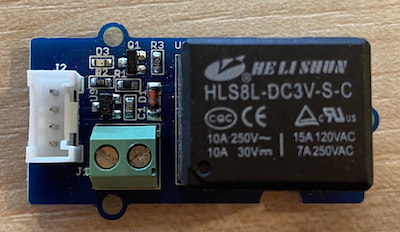

<!--
CO_OP_TRANSLATOR_METADATA:
{
  "original_hash": "f3c5d8afa2ef6a0b425ef8ff20615cb4",
  "translation_date": "2025-08-27T22:14:13+00:00",
  "source_file": "2-farm/lessons/3-automated-plant-watering/wio-terminal-relay.md",
  "language_code": "th"
}
-->
# ควบคุมรีเลย์ - Wio Terminal

ในส่วนนี้ของบทเรียน คุณจะเพิ่มรีเลย์เข้าไปใน Wio Terminal ของคุณนอกเหนือจากเซ็นเซอร์วัดความชื้นในดิน และควบคุมรีเลย์ตามระดับความชื้นในดิน

## ฮาร์ดแวร์

Wio Terminal ต้องการรีเลย์

รีเลย์ที่คุณจะใช้คือ [Grove relay](https://www.seeedstudio.com/Grove-Relay.html) ซึ่งเป็นรีเลย์แบบเปิดปกติ (หมายความว่าวงจรเอาต์พุตจะเปิดหรือถูกตัดการเชื่อมต่อเมื่อไม่มีสัญญาณส่งไปยังรีเลย์) และสามารถรองรับวงจรเอาต์พุตได้สูงสุด 250V และ 10A

นี่เป็นตัวกระตุ้นแบบดิจิทัล ดังนั้นจึงเชื่อมต่อกับขาพอร์ตดิจิทัลบน Wio Terminal พอร์ตแบบรวมอนาล็อก/ดิจิทัลถูกใช้งานอยู่แล้วกับเซ็นเซอร์วัดความชื้นในดิน ดังนั้นรีเลย์นี้จะเชื่อมต่อกับพอร์ตอื่น ซึ่งเป็นพอร์ตแบบรวม I2C และดิจิทัล

### เชื่อมต่อรีเลย์

รีเลย์ Grove สามารถเชื่อมต่อกับพอร์ตดิจิทัลของ Wio Terminal ได้

#### งานที่ต้องทำ

เชื่อมต่อรีเลย์



1. เสียบปลายด้านหนึ่งของสาย Grove เข้ากับซ็อกเก็ตบนรีเลย์ สายจะเสียบได้เพียงด้านเดียว

2. เมื่อ Wio Terminal ถูกตัดการเชื่อมต่อจากคอมพิวเตอร์หรือแหล่งจ่ายไฟอื่น ให้เชื่อมต่อปลายอีกด้านของสาย Grove เข้ากับซ็อกเก็ต Grove ด้านซ้ายบน Wio Terminal (เมื่อมองที่หน้าจอ) โดยปล่อยให้เซ็นเซอร์วัดความชื้นในดินยังคงเชื่อมต่ออยู่กับซ็อกเก็ตด้านขวา


3. เสียบเซ็นเซอร์วัดความชื้นในดินลงในดิน หากยังไม่ได้เสียบจากบทเรียนก่อนหน้า

## เขียนโปรแกรมควบคุมรีเลย์

ตอนนี้ Wio Terminal สามารถเขียนโปรแกรมเพื่อใช้งานรีเลย์ที่เชื่อมต่ออยู่ได้

### งานที่ต้องทำ

เขียนโปรแกรมให้กับอุปกรณ์

1. เปิดโปรเจกต์ `soil-moisture-sensor` จากบทเรียนก่อนหน้าใน VS Code หากยังไม่ได้เปิด คุณจะเพิ่มโค้ดในโปรเจกต์นี้

2. ไม่มีไลบรารีสำหรับตัวกระตุ้นนี้ - มันเป็นตัวกระตุ้นแบบดิจิทัลที่ควบคุมด้วยสัญญาณสูงหรือต่ำ การเปิดใช้งานทำได้โดยการส่งสัญญาณสูงไปยังขา (3.3V) และการปิดใช้งานทำได้โดยการส่งสัญญาณต่ำ (0V) คุณสามารถทำได้โดยใช้ฟังก์ชัน [`digitalWrite`](https://www.arduino.cc/reference/en/language/functions/digital-io/digitalwrite/) ที่มีอยู่ใน Arduino เริ่มต้นโดยเพิ่มโค้ดต่อไปนี้ที่ด้านล่างของฟังก์ชัน `setup` เพื่อกำหนดพอร์ต I2C/ดิจิทัลให้เป็นขาเอาต์พุตเพื่อส่งแรงดันไฟฟ้าไปยังรีเลย์:

    ```cpp
    pinMode(PIN_WIRE_SCL, OUTPUT);
    ```

    `PIN_WIRE_SCL` คือหมายเลขพอร์ตสำหรับพอร์ต I2C/ดิจิทัล

3. เพื่อทดสอบว่ารีเลย์ทำงานหรือไม่ ให้เพิ่มโค้ดต่อไปนี้ในฟังก์ชัน `loop` ด้านล่าง `delay` สุดท้าย:

    ```cpp
    digitalWrite(PIN_WIRE_SCL, HIGH);
    delay(500);
    digitalWrite(PIN_WIRE_SCL, LOW);
    ```

    โค้ดนี้จะส่งสัญญาณสูงไปยังขาที่รีเลย์เชื่อมต่อเพื่อเปิดใช้งานรีเลย์ รอ 500 มิลลิวินาที (ครึ่งวินาที) จากนั้นส่งสัญญาณต่ำเพื่อปิดรีเลย์

4. สร้างและอัปโหลดโค้ดไปยัง Wio Terminal

5. เมื่ออัปโหลดเสร็จ รีเลย์จะเปิดและปิดทุกๆ 10 วินาที โดยมีความล่าช้าครึ่งวินาทีระหว่างการเปิดและปิด คุณจะได้ยินเสียงคลิกเมื่อรีเลย์เปิดและปิด และไฟ LED บนบอร์ด Grove จะสว่างเมื่อรีเลย์เปิด และดับเมื่อรีเลย์ปิด

    

## ควบคุมรีเลย์ด้วยความชื้นในดิน

เมื่อรีเลย์ทำงานแล้ว คุณสามารถควบคุมมันตามค่าความชื้นในดินได้

### งานที่ต้องทำ

ควบคุมรีเลย์

1. ลบ 3 บรรทัดของโค้ดที่คุณเพิ่มเพื่อทดสอบรีเลย์ จากนั้นแทนที่ด้วยโค้ดต่อไปนี้:

    ```cpp
    if (soil_moisture > 450)
    {
        Serial.println("Soil Moisture is too low, turning relay on.");
        digitalWrite(PIN_WIRE_SCL, HIGH);
    }
    else
    {
        Serial.println("Soil Moisture is ok, turning relay off.");
        digitalWrite(PIN_WIRE_SCL, LOW);
    }
    ```

    โค้ดนี้จะตรวจสอบค่าความชื้นในดินจากเซ็นเซอร์วัดความชื้นในดิน หากค่ามากกว่า 450 จะเปิดรีเลย์ และปิดรีเลย์เมื่อค่าต่ำกว่า 450

    > 💁 จำไว้ว่าเซ็นเซอร์วัดความชื้นในดินแบบ capacitive จะอ่านค่าความชื้นในดินที่ต่ำกว่าเมื่อดินมีความชื้นมาก และในทางกลับกัน

2. สร้างและอัปโหลดโค้ดไปยัง Wio Terminal

3. ตรวจสอบอุปกรณ์ผ่าน serial monitor คุณจะเห็นรีเลย์เปิดหรือปิดตามค่าความชื้นในดิน ลองในดินแห้ง จากนั้นเติมน้ำ

    ```output
    Soil Moisture: 638
    Soil Moisture is too low, turning relay on.
    Soil Moisture: 452
    Soil Moisture is too low, turning relay on.
    Soil Moisture: 347
    Soil Moisture is ok, turning relay off.
    ```

> 💁 คุณสามารถหาโค้ดนี้ได้ในโฟลเดอร์ [code-relay/wio-terminal](../../../../../2-farm/lessons/3-automated-plant-watering/code-relay/wio-terminal)

😀 โปรแกรมควบคุมรีเลย์ด้วยเซ็นเซอร์วัดความชื้นในดินของคุณสำเร็จแล้ว!

---

**ข้อจำกัดความรับผิดชอบ**:  
เอกสารนี้ได้รับการแปลโดยใช้บริการแปลภาษา AI [Co-op Translator](https://github.com/Azure/co-op-translator) แม้ว่าเราจะพยายามให้การแปลมีความถูกต้องมากที่สุด แต่โปรดทราบว่าการแปลอัตโนมัติอาจมีข้อผิดพลาดหรือความไม่ถูกต้อง เอกสารต้นฉบับในภาษาดั้งเดิมควรถือเป็นแหล่งข้อมูลที่เชื่อถือได้ สำหรับข้อมูลที่สำคัญ ขอแนะนำให้ใช้บริการแปลภาษามืออาชีพ เราไม่รับผิดชอบต่อความเข้าใจผิดหรือการตีความผิดที่เกิดจากการใช้การแปลนี้