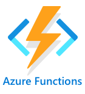

<!--
CO_OP_TRANSLATOR_METADATA:
{
  "original_hash": "5f2d2f4a5a023c93ab34a0cc5b47c0c4",
  "translation_date": "2025-08-27T21:50:58+00:00",
  "source_file": "2-farm/lessons/5-migrate-application-to-the-cloud/README.md",
  "language_code": "th"
}
-->
# ย้ายตรรกะของแอปพลิเคชันของคุณไปยังคลาวด์


> สเก็ตโน้ตโดย [Nitya Narasimhan](https://github.com/nitya) คลิกที่ภาพเพื่อดูเวอร์ชันขนาดใหญ่ขึ้น

บทเรียนนี้เป็นส่วนหนึ่งของ [IoT for Beginners Project 2 - Digital Agriculture series](https://youtube.com/playlist?list=PLmsFUfdnGr3yCutmcVg6eAUEfsGiFXgcx) จาก [Microsoft Reactor](https://developer.microsoft.com/reactor/?WT.mc_id=academic-17441-jabenn)

[](https://youtu.be/VVZDcs5u1_I)

## แบบทดสอบก่อนเรียน

[แบบทดสอบก่อนเรียน](https://black-meadow-040d15503.1.azurestaticapps.net/quiz/17)

## บทนำ

ในบทเรียนที่ผ่านมา คุณได้เรียนรู้วิธีเชื่อมต่อระบบตรวจสอบความชื้นในดินของพืชและการควบคุมรีเลย์กับบริการ IoT บนคลาวด์ ขั้นตอนถัดไปคือการย้ายโค้ดฝั่งเซิร์ฟเวอร์ที่ควบคุมการตั้งเวลารีเลย์ไปยังคลาวด์ ในบทเรียนนี้ คุณจะได้เรียนรู้วิธีทำสิ่งนี้โดยใช้ฟังก์ชันแบบไร้เซิร์ฟเวอร์

ในบทเรียนนี้เราจะครอบคลุม:

* [Serverless คืออะไร?](../../../../../2-farm/lessons/5-migrate-application-to-the-cloud)
* [สร้างแอปพลิเคชันแบบไร้เซิร์ฟเวอร์](../../../../../2-farm/lessons/5-migrate-application-to-the-cloud)
* [สร้างตัวกระตุ้นเหตุการณ์ IoT Hub](../../../../../2-farm/lessons/5-migrate-application-to-the-cloud)
* [ส่งคำขอแบบ Direct Method จากโค้ดแบบไร้เซิร์ฟเวอร์](../../../../../2-farm/lessons/5-migrate-application-to-the-cloud)
* [ปรับใช้โค้ดแบบไร้เซิร์ฟเวอร์ของคุณไปยังคลาวด์](../../../../../2-farm/lessons/5-migrate-application-to-the-cloud)

## Serverless คืออะไร?

Serverless หรือการประมวลผลแบบไร้เซิร์ฟเวอร์ คือการสร้างโค้ดขนาดเล็กที่ทำงานในคลาวด์เพื่อตอบสนองต่อเหตุการณ์ต่างๆ เมื่อเหตุการณ์เกิดขึ้น โค้ดของคุณจะถูกเรียกใช้งานและได้รับข้อมูลเกี่ยวกับเหตุการณ์นั้น เหตุการณ์เหล่านี้อาจมาจากหลายแหล่ง เช่น คำขอเว็บ ข้อความในคิว การเปลี่ยนแปลงข้อมูลในฐานข้อมูล หรือข้อความที่ส่งไปยังบริการ IoT โดยอุปกรณ์ IoT


> 💁 หากคุณเคยใช้ตัวกระตุ้นในฐานข้อมูลมาก่อน คุณสามารถคิดว่าสิ่งนี้คล้ายกัน คือโค้ดที่ถูกเรียกใช้งานโดยเหตุการณ์ เช่น การเพิ่มแถวใหม่


โค้ดของคุณจะทำงานเฉพาะเมื่อเหตุการณ์เกิดขึ้นเท่านั้น ไม่มีการทำให้โค้ดของคุณทำงานอยู่ตลอดเวลา เหตุการณ์เกิดขึ้น โค้ดของคุณจะถูกโหลดและทำงาน สิ่งนี้ทำให้ Serverless มีความสามารถในการขยายตัวได้สูงมาก หากมีเหตุการณ์จำนวนมากเกิดขึ้นพร้อมกัน ผู้ให้บริการคลาวด์สามารถเรียกใช้ฟังก์ชันของคุณได้หลายครั้งพร้อมกันบนเซิร์ฟเวอร์ที่มีอยู่ ข้อเสียคือหากคุณต้องการแชร์ข้อมูลระหว่างเหตุการณ์ คุณจำเป็นต้องบันทึกข้อมูลไว้ในที่อื่น เช่น ฐานข้อมูล แทนที่จะเก็บไว้ในหน่วยความจำ

โค้ดของคุณจะถูกเขียนเป็นฟังก์ชันที่รับรายละเอียดเกี่ยวกับเหตุการณ์เป็นพารามิเตอร์ คุณสามารถใช้ภาษาการเขียนโปรแกรมที่หลากหลายในการเขียนฟังก์ชันแบบไร้เซิร์ฟเวอร์เหล่านี้

> 🎓 Serverless ยังถูกเรียกว่า Functions as a Service (FaaS) เนื่องจากตัวกระตุ้นเหตุการณ์แต่ละตัวจะถูกนำมาใช้เป็นฟังก์ชันในโค้ด

แม้ชื่อจะบอกว่า "ไร้เซิร์ฟเวอร์" แต่จริงๆ แล้ว Serverless ใช้เซิร์ฟเวอร์ ชื่อนี้มาจากการที่นักพัฒนาไม่ต้องสนใจเกี่ยวกับเซิร์ฟเวอร์ที่จำเป็นในการรันโค้ด สิ่งที่คุณสนใจคือโค้ดของคุณจะถูกรันเพื่อตอบสนองต่อเหตุการณ์ ผู้ให้บริการคลาวด์มี *runtime* แบบไร้เซิร์ฟเวอร์ที่จัดการการจัดสรรเซิร์ฟเวอร์ เครือข่าย การจัดเก็บข้อมูล CPU หน่วยความจำ และสิ่งอื่นๆ ที่จำเป็นในการรันโค้ดของคุณ โมเดลนี้หมายความว่าคุณจะไม่จ่ายเงินตามจำนวนเซิร์ฟเวอร์ แต่จะจ่ายตามเวลาที่โค้ดของคุณทำงานและปริมาณหน่วยความจำที่ใช้

> 💰 Serverless เป็นหนึ่งในวิธีที่ถูกที่สุดในการรันโค้ดในคลาวด์ ตัวอย่างเช่น ในขณะที่เขียนนี้ ผู้ให้บริการคลาวด์รายหนึ่งอนุญาตให้ฟังก์ชันแบบไร้เซิร์ฟเวอร์ทั้งหมดของคุณทำงานรวมกันได้ 1,000,000 ครั้งต่อเดือนก่อนที่จะเริ่มคิดค่าใช้จ่าย และหลังจากนั้นจะคิดค่าใช้จ่าย $0.20 ต่อ 1,000,000 ครั้ง เมื่อโค้ดของคุณไม่ได้ทำงาน คุณจะไม่ต้องจ่ายเงิน

สำหรับนักพัฒนา IoT โมเดลแบบไร้เซิร์ฟเวอร์เหมาะสมอย่างยิ่ง คุณสามารถเขียนฟังก์ชันที่ถูกเรียกใช้งานเพื่อตอบสนองต่อข้อความที่ส่งมาจากอุปกรณ์ IoT ใดๆ ที่เชื่อมต่อกับบริการ IoT บนคลาวด์ของคุณ โค้ดของคุณจะจัดการข้อความทั้งหมดที่ส่งมา แต่จะทำงานเฉพาะเมื่อจำเป็น

✅ ลองย้อนกลับไปดูโค้ดที่คุณเขียนเป็นโค้ดฝั่งเซิร์ฟเวอร์ที่ฟังข้อความผ่าน MQTT คุณคิดว่าโค้ดนี้จะทำงานในคลาวด์โดยใช้ Serverless ได้อย่างไร? และโค้ดอาจต้องเปลี่ยนแปลงอย่างไรเพื่อรองรับการประมวลผลแบบไร้เซิร์ฟเวอร์?

> 💁 โมเดลแบบไร้เซิร์ฟเวอร์กำลังขยายไปยังบริการคลาวด์อื่นๆ นอกเหนือจากการรันโค้ด ตัวอย่างเช่น ฐานข้อมูลแบบไร้เซิร์ฟเวอร์ในคลาวด์ที่ใช้โมเดลการคิดค่าใช้จ่ายแบบไร้เซิร์ฟเวอร์ โดยคุณจ่ายเงินตามคำขอที่ทำกับฐานข้อมูล เช่น การสืบค้นหรือการแทรกข้อมูล โดยปกติจะคิดค่าใช้จ่ายตามปริมาณงานที่ต้องใช้ในการให้บริการคำขอ ตัวอย่างเช่น การเลือกแถวเดียวโดยใช้คีย์หลักจะมีค่าใช้จ่ายน้อยกว่าการดำเนินการที่ซับซ้อนที่รวมหลายตารางและส่งคืนหลายพันแถว

## สร้างแอปพลิเคชันแบบไร้เซิร์ฟเวอร์

บริการการประมวลผลแบบไร้เซิร์ฟเวอร์จาก Microsoft คือ Azure Functions



วิดีโอสั้นๆ ด้านล่างนี้มีภาพรวมของ Azure Functions

[](https://www.youtube.com/watch?v=8-jz5f_JyEQ)

> 🎥 คลิกที่ภาพด้านบนเพื่อดูวิดีโอ

✅ ใช้เวลาสักครู่เพื่อค้นคว้าและอ่านภาพรวมของ Azure Functions ใน [เอกสาร Microsoft Azure Functions](https://docs.microsoft.com/azure/azure-functions/functions-overview?WT.mc_id=academic-17441-jabenn)

ในการเขียน Azure Functions คุณเริ่มต้นด้วยแอป Azure Functions ในภาษาที่คุณเลือก Azure Functions รองรับ Python, JavaScript, TypeScript, C#, F#, Java และ Powershell โดยค่าเริ่มต้น ในบทเรียนนี้คุณจะได้เรียนรู้วิธีเขียนแอป Azure Functions ใน Python

> 💁 Azure Functions ยังรองรับตัวจัดการแบบกำหนดเอง ดังนั้นคุณสามารถเขียนฟังก์ชันในภาษาใดๆ ที่รองรับคำขอ HTTP รวมถึงภาษาเก่าๆ เช่น COBOL

แอปฟังก์ชันประกอบด้วย *ตัวกระตุ้น* หนึ่งตัวหรือมากกว่า ซึ่งเป็นฟังก์ชันที่ตอบสนองต่อเหตุการณ์ คุณสามารถมีตัวกระตุ้นหลายตัวในแอปฟังก์ชันเดียวกัน โดยใช้การกำหนดค่าร่วมกัน ตัวอย่างเช่น ในไฟล์การกำหนดค่าของแอปฟังก์ชันของคุณ คุณสามารถมีรายละเอียดการเชื่อมต่อของ IoT Hub ของคุณ และฟังก์ชันทั้งหมดในแอปสามารถใช้สิ่งนี้เพื่อเชื่อมต่อและฟังเหตุการณ์

### งาน - ติดตั้งเครื่องมือ Azure Functions

> ณ เวลาที่เขียนนี้ เครื่องมือโค้ด Azure Functions ยังไม่ทำงานเต็มรูปแบบบน Apple Silicon กับโปรเจกต์ Python คุณจะต้องใช้ Mac ที่ใช้ Intel, Windows PC หรือ Linux PC แทน

หนึ่งในคุณสมบัติที่ยอดเยี่ยมของ Azure Functions คือคุณสามารถรันมันได้ในเครื่อง Runtime เดียวกันที่ใช้ในคลาวด์สามารถรันบนคอมพิวเตอร์ของคุณได้ ทำให้คุณสามารถเขียนโค้ดที่ตอบสนองต่อข้อความ IoT และรันในเครื่องได้ คุณยังสามารถดีบักโค้ดของคุณขณะที่เหตุการณ์ถูกจัดการได้ เมื่อคุณพอใจกับโค้ดของคุณแล้ว คุณสามารถปรับใช้ไปยังคลาวด์ได้

เครื่องมือ Azure Functions มีให้ใช้งานในรูปแบบ CLI ที่เรียกว่า Azure Functions Core Tools

1. ติดตั้ง Azure Functions Core Tools โดยทำตามคำแนะนำใน [เอกสาร Azure Functions Core Tools](https://docs.microsoft.com/azure/azure-functions/functions-run-local?WT.mc_id=academic-17441-jabenn)

1. ติดตั้งส่วนขยาย Azure Functions สำหรับ VS Code ส่วนขยายนี้ให้การสนับสนุนสำหรับการสร้าง การดีบัก และการปรับใช้ Azure Functions ดูคำแนะนำในการติดตั้งส่วนขยายนี้ใน [เอกสาร Azure Functions Extension](https://marketplace.visualstudio.com/items?WT.mc_id=academic-17441-jabenn&itemName=ms-azuretools.vscode-azurefunctions)

เมื่อคุณปรับใช้แอป Azure Functions ของคุณไปยังคลาวด์ มันจะต้องใช้พื้นที่เก็บข้อมูลบนคลาวด์เล็กน้อยเพื่อจัดเก็บไฟล์แอปพลิเคชันและไฟล์บันทึก เมื่อคุณรันแอป Functions ในเครื่อง คุณยังคงต้องเชื่อมต่อกับพื้นที่เก็บข้อมูลบนคลาวด์ แต่แทนที่จะใช้พื้นที่เก็บข้อมูลจริง คุณสามารถใช้ตัวจำลองพื้นที่เก็บข้อมูลที่เรียกว่า [Azurite](https://github.com/Azure/Azurite) ซึ่งทำงานในเครื่องแต่ทำหน้าที่เหมือนพื้นที่เก็บข้อมูลบนคลาวด์

> 🎓 ใน Azure พื้นที่เก็บข้อมูลที่ Azure Functions ใช้คือ Azure Storage Account บัญชีเหล่านี้สามารถจัดเก็บไฟล์ บล็อบ ข้อมูลในตาราง หรือข้อมูลในคิว คุณสามารถแชร์บัญชีพื้นที่เก็บข้อมูลหนึ่งบัญชีระหว่างแอปหลายตัว เช่น แอป Functions และเว็บแอป

1. Azurite เป็นแอป Node.js ดังนั้นคุณจะต้องติดตั้ง Node.js คุณสามารถค้นหาคำแนะนำในการดาวน์โหลดและติดตั้งได้ที่ [เว็บไซต์ Node.js](https://nodejs.org/) หากคุณใช้ Mac คุณสามารถติดตั้งจาก [Homebrew](https://formulae.brew.sh/formula/node) ได้เช่นกัน

1. ติดตั้ง Azurite โดยใช้คำสั่งต่อไปนี้ (`npm` เป็นเครื่องมือที่ติดตั้งมาพร้อมกับ Node.js):

    ```sh
    npm install -g azurite
    ```

1. สร้างโฟลเดอร์ชื่อ `azurite` สำหรับ Azurite เพื่อใช้จัดเก็บข้อมูล:

    ```sh
    mkdir azurite
    ```

1. รัน Azurite โดยส่งโฟลเดอร์ใหม่นี้:

    ```sh
    azurite --location azurite
    ```

    ตัวจำลองพื้นที่เก็บข้อมูล Azurite จะเริ่มทำงานและพร้อมสำหรับการเชื่อมต่อกับ Runtime Functions ในเครื่อง

    ```output
    ➜  ~ azurite --location azurite  
    Azurite Blob service is starting at http://127.0.0.1:10000
    Azurite Blob service is successfully listening at http://127.0.0.1:10000
    Azurite Queue service is starting at http://127.0.0.1:10001
    Azurite Queue service is successfully listening at http://127.0.0.1:10001
    Azurite Table service is starting at http://127.0.0.1:10002
    Azurite Table service is successfully listening at http://127.0.0.1:10002
    ```

### งาน - สร้างโปรเจกต์ Azure Functions

CLI ของ Azure Functions สามารถใช้สร้างแอป Functions ใหม่ได้

1. สร้างโฟลเดอร์สำหรับแอป Functions ของคุณและไปยังโฟลเดอร์นั้น ตั้งชื่อว่า `soil-moisture-trigger`

    ```sh
    mkdir soil-moisture-trigger
    cd soil-moisture-trigger
    ```

1. สร้างสภาพแวดล้อมเสมือน Python ภายในโฟลเดอร์นี้:

    ```sh
    python3 -m venv .venv
    ```

1. เปิดใช้งานสภาพแวดล้อมเสมือน:

    * บน Windows:
        * หากคุณใช้ Command Prompt หรือ Command Prompt ผ่าน Windows Terminal ให้รัน:

            ```cmd
            .venv\Scripts\activate.bat
            ```

        * หากคุณใช้ PowerShell ให้รัน:

            ```powershell
            .\.venv\Scripts\Activate.ps1
            ```

    * บน macOS หรือ Linux ให้รัน:

        ```cmd
        source ./.venv/bin/activate
        ```

    > 💁 คำสั่งเหล่านี้ควรถูกเรียกใช้จากตำแหน่งเดียวกับที่คุณรันคำสั่งเพื่อสร้างสภาพแวดล้อมเสมือน คุณไม่จำเป็นต้องเข้าไปในโฟลเดอร์ `.venv` คุณควรรันคำสั่ง activate และคำสั่งอื่นๆ จากโฟลเดอร์ที่คุณอยู่เมื่อสร้างสภาพแวดล้อมเสมือน

1. รันคำสั่งต่อไปนี้เพื่อสร้างแอป Functions ในโฟลเดอร์นี้:

    ```sh
    func init --worker-runtime python soil-moisture-trigger
    ```

    สิ่งนี้จะสร้างไฟล์สามไฟล์ในโฟลเดอร์ปัจจุบัน:

    * `host.json` - เอกสาร JSON นี้มีการตั้งค่าสำหรับแอป Functions ของคุณ คุณไม่จำเป็นต้องแก้ไขการตั้งค่าเหล่านี้
    * `local.settings.json` - เอกสาร JSON นี้มีการตั้งค่าที่แอปของคุณจะใช้เมื่อรันในเครื่อง เช่น สตริงการเชื่อมต่อสำหรับ IoT Hub การตั้งค่าเหล่านี้เป็นการตั้งค่าเฉพาะในเครื่องและไม่ควรถูกเพิ่มในระบบควบคุมซอร์สโค้ด เมื่อคุณปรับใช้แอปไปยังคลาวด์ การตั้งค่าเหล่านี้จะไม่ถูกปรับใช้ แต่จะโหลดจากการตั้งค่าแอปพลิเคชันแทน ซึ่งจะครอบคลุมในบทเรียนนี้
    * `requirements.txt` - นี่คือ [ไฟล์ Pip requirements](https://pip.pypa.io/en/stable/user_guide/#requirements-files) ที่มีแพ็กเกจ Pip ที่จำเป็นสำหรับการรันแอป Functions ของคุณ

1. ไฟล์ `local.settings.json` มีการตั้งค่าสำหรับบัญชีพื้นที่เก็บข้อมูลที่แอป Functions จะใช้ ค่าเริ่มต้นเป็นค่าว่าง ดังนั้นจึงต้องตั้งค่าใหม่ เพื่อเชื่อมต่อกับตัวจำลองพื้นที่เก็บข้อมูล Azurite ให้ตั้งค่านี้เป็น:

    ```json
    "AzureWebJobsStorage": "UseDevelopmentStorage=true",
    ```

1. ติดตั้งแพ็กเกจ Pip ที่จำเป็นโดยใช้ไฟล์ requirements:

    ```sh
    pip install -r requirements.txt
    ```

    > 💁 แพ็กเกจ Pip ที่จำเป็นต้องอยู่ในไฟล์นี้ เพื่อให้เมื่อแอป Functions ถูกปรับใช้ไปยังคลาวด์ Runtime จะสามารถติดตั้งแพ็กเกจที่ถูกต้องได้

1. เพื่อตรวจสอบว่าทุกอย่างทำงานถูกต้อง คุณสามารถเริ่ม Runtime Functions ได้ รันคำสั่งต่อไปนี้เพื่อทำสิ่งนี้:

    ```sh
    func start
    ```

    คุณจะเห็น Runtime เริ่มต้นและรายงานว่าไม่พบฟังก์ชันงานใดๆ (ตัวกระตุ้น)

    ```output
    (.venv) ➜  soil-moisture-trigger func start
    Found Python version 3.9.1 (python3).
    
    Azure Functions Core Tools
    Core Tools Version:       3.0.3442 Commit hash: 6bfab24b2743f8421475d996402c398d2fe4a9e0  (64-bit)
    Function Runtime Version: 3.0.15417.0
    
    [2021-05-05T01:24:46.795Z] No job functions found.
    ```
> ⚠️ หากคุณได้รับการแจ้งเตือนจากไฟร์วอลล์ ให้อนุญาตการเข้าถึง เนื่องจากแอปพลิเคชัน `func` จำเป็นต้องสามารถอ่านและเขียนข้อมูลบนเครือข่ายของคุณ
> ⚠️ หากคุณใช้ macOS อาจมีคำเตือนในผลลัพธ์:
>
> ```output
    > (.venv) ➜  soil-moisture-trigger func start
    > Found Python version 3.9.1 (python3).
    >
    > Azure Functions Core Tools
    > Core Tools Version:       3.0.3442 Commit hash: 6bfab24b2743f8421475d996402c398d2fe4a9e0  (64-bit)
    > Function Runtime Version: 3.0.15417.0
    >
    > [2021-06-16T08:18:28.315Z] Cannot create directory for shared memory usage: /dev/shm/AzureFunctions
    > [2021-06-16T08:18:28.316Z] System.IO.FileSystem: Access to the path '/dev/shm/AzureFunctions' is denied. Operation not permitted.
    > [2021-06-16T08:18:30.361Z] No job functions found.
    > ```
>
> คุณสามารถละเว้นคำเตือนเหล่านี้ได้ตราบใดที่แอป Functions เริ่มต้นทำงานได้อย่างถูกต้องและแสดงฟังก์ชันที่กำลังทำงานอยู่ ดังที่กล่าวไว้ใน [คำถามนี้ใน Microsoft Docs Q&A](https://docs.microsoft.com/answers/questions/396617/azure-functions-core-tools-error-osx-devshmazurefu.html?WT.mc_id=academic-17441-jabenn) คุณสามารถละเว้นได้

1. หยุดแอป Functions โดยกด `ctrl+c`

1. เปิดโฟลเดอร์ปัจจุบันใน VS Code โดยเปิด VS Code แล้วเปิดโฟลเดอร์นี้ หรือรันคำสั่งต่อไปนี้:

    ```sh
    code .
    ```

    VS Code จะตรวจจับโปรเจกต์ Functions ของคุณและแสดงการแจ้งเตือนดังนี้:

    ```output
    Detected an Azure Functions Project in folder "soil-moisture-trigger" that may have been created outside of
    VS Code. Initialize for optimal use with VS Code?
    ```

    

    เลือก **Yes** จากการแจ้งเตือนนี้

1. ตรวจสอบให้แน่ใจว่า Python virtual environment กำลังทำงานในเทอร์มินัลของ VS Code หากจำเป็นให้หยุดและเริ่มต้นใหม่

## สร้าง IoT Hub event trigger

แอป Functions เป็นโครงสร้างของโค้ด serverless ของคุณ เพื่อให้ตอบสนองต่อเหตุการณ์ใน IoT Hub คุณสามารถเพิ่ม IoT Hub trigger ลงในแอปนี้ Trigger นี้ต้องเชื่อมต่อกับสตรีมของข้อความที่ส่งไปยัง IoT Hub และตอบสนองต่อข้อความเหล่านั้น เพื่อรับสตรีมของข้อความนี้ Trigger ของคุณต้องเชื่อมต่อกับ *event hub compatible endpoint* ของ IoT Hub

IoT Hub สร้างขึ้นบนบริการ Azure อีกตัวหนึ่งที่เรียกว่า Azure Event Hubs Event Hubs เป็นบริการที่ช่วยให้คุณสามารถส่งและรับข้อความได้ IoT Hub ขยายความสามารถนี้เพื่อเพิ่มฟีเจอร์สำหรับอุปกรณ์ IoT วิธีการเชื่อมต่อเพื่ออ่านข้อความจาก IoT Hub จะเหมือนกับการใช้ Event Hubs

✅ ทำการค้นคว้า: อ่านภาพรวมของ Event Hubs ใน [เอกสาร Azure Event Hubs](https://docs.microsoft.com/azure/event-hubs/event-hubs-about?WT.mc_id=academic-17441-jabenn) เปรียบเทียบฟีเจอร์พื้นฐานกับ IoT Hub

สำหรับอุปกรณ์ IoT ที่จะเชื่อมต่อกับ IoT Hub จะต้องใช้ secret key เพื่อให้แน่ใจว่าเฉพาะอุปกรณ์ที่ได้รับอนุญาตเท่านั้นที่สามารถเชื่อมต่อได้ หลักการเดียวกันนี้ใช้เมื่อเชื่อมต่อเพื่ออ่านข้อความ โค้ดของคุณจะต้องมี connection string ที่มี secret key พร้อมกับรายละเอียดของ IoT Hub

> 💁 Connection string เริ่มต้นที่คุณได้รับมีสิทธิ์ **iothubowner** ซึ่งให้สิทธิ์เต็มรูปแบบแก่โค้ดใดๆ ที่ใช้ Connection string นี้ใน IoT Hub โดยทั่วไปคุณควรเชื่อมต่อด้วยระดับสิทธิ์ต่ำสุดที่จำเป็น ซึ่งจะครอบคลุมในบทเรียนถัดไป

เมื่อ Trigger ของคุณเชื่อมต่อแล้ว โค้ดภายในฟังก์ชันจะถูกเรียกใช้สำหรับทุกข้อความที่ส่งไปยัง IoT Hub โดยไม่คำนึงว่าอุปกรณ์ใดเป็นผู้ส่ง Trigger จะได้รับข้อความเป็นพารามิเตอร์

### งาน - รับ Event Hub compatible endpoint connection string

1. จากเทอร์มินัลของ VS Code รันคำสั่งต่อไปนี้เพื่อรับ connection string สำหรับ Event Hub compatible endpoint ของ IoT Hub:

    ```sh
    az iot hub connection-string show --default-eventhub \
                                      --output table \
                                      --hub-name <hub_name>
    ```

    แทนที่ `<hub_name>` ด้วยชื่อที่คุณใช้สำหรับ IoT Hub

1. ใน VS Code เปิดไฟล์ `local.settings.json` เพิ่มค่าต่อไปนี้ในส่วน `Values`:

    ```json
    "IOT_HUB_CONNECTION_STRING": "<connection string>"
    ```

    แทนที่ `<connection string>` ด้วยค่าจากขั้นตอนก่อนหน้า คุณจะต้องเพิ่มเครื่องหมายจุลภาคหลังบรรทัดด้านบนเพื่อให้ JSON ถูกต้อง

### งาน - สร้าง event trigger

คุณพร้อมที่จะสร้าง event trigger แล้ว

1. จากเทอร์มินัลของ VS Code รันคำสั่งต่อไปนี้จากภายในโฟลเดอร์ `soil-moisture-trigger`:

    ```sh
    func new --name iot-hub-trigger --template "Azure Event Hub trigger"
    ```

    คำสั่งนี้จะสร้างฟังก์ชันใหม่ชื่อ `iot-hub-trigger` Trigger จะเชื่อมต่อกับ Event Hub compatible endpoint บน IoT Hub ดังนั้นคุณสามารถใช้ event hub trigger ได้ ไม่มี Trigger เฉพาะสำหรับ IoT Hub

โฟลเดอร์ `iot-hub-trigger` จะถูกสร้างขึ้นภายในโฟลเดอร์ `soil-moisture-trigger` ซึ่งมีไฟล์ดังต่อไปนี้:

* `__init__.py` - ไฟล์โค้ด Python ที่มี Trigger โดยใช้ชื่อไฟล์มาตรฐานของ Python เพื่อเปลี่ยนโฟลเดอร์นี้เป็นโมดูล Python

    ไฟล์นี้จะมีโค้ดดังนี้:

    ```python
    import logging

    import azure.functions as func


    def main(event: func.EventHubEvent):
        logging.info('Python EventHub trigger processed an event: %s',
                    event.get_body().decode('utf-8'))
    ```

    แกนหลักของ Trigger คือฟังก์ชัน `main` ฟังก์ชันนี้จะถูกเรียกใช้พร้อมกับเหตุการณ์จาก IoT Hub ฟังก์ชันนี้มีพารามิเตอร์ชื่อ `event` ที่มี `EventHubEvent` ทุกครั้งที่มีข้อความส่งไปยัง IoT Hub ฟังก์ชันนี้จะถูกเรียกใช้โดยส่งข้อความนั้นเป็น `event` พร้อมกับคุณสมบัติที่เหมือนกับคำอธิบายประกอบที่คุณเห็นในบทเรียนก่อนหน้า

    แกนหลักของฟังก์ชันนี้คือการบันทึกเหตุการณ์

* `function.json` - ไฟล์นี้มีการตั้งค่าสำหรับ Trigger การตั้งค่าหลักอยู่ในส่วนที่เรียกว่า `bindings` Binding คือคำที่ใช้เรียกการเชื่อมต่อระหว่าง Azure Functions และบริการ Azure อื่นๆ ฟังก์ชันนี้มี input binding กับ event hub - มันเชื่อมต่อกับ event hub และรับข้อมูล

    > 💁 คุณสามารถมี output bindings ได้เช่นกัน เพื่อให้ผลลัพธ์ของฟังก์ชันถูกส่งไปยังบริการอื่น ตัวอย่างเช่น คุณสามารถเพิ่ม output binding ไปยังฐานข้อมูลและส่งคืนเหตุการณ์ IoT Hub จากฟังก์ชัน และมันจะถูกแทรกลงในฐานข้อมูลโดยอัตโนมัติ

    ✅ ทำการค้นคว้า: อ่านเกี่ยวกับ bindings ใน [เอกสาร Azure Functions triggers and bindings concepts](https://docs.microsoft.com/azure/azure-functions/functions-triggers-bindings?WT.mc_id=academic-17441-jabenn&tabs=python)

    ส่วน `bindings` รวมถึงการตั้งค่าสำหรับ binding ค่าที่น่าสนใจคือ:

  * `"type": "eventHubTrigger"` - บอกฟังก์ชันว่าต้องฟังเหตุการณ์จาก Event Hub
  * `"name": "events"` - ชื่อพารามิเตอร์สำหรับ Event Hub events ซึ่งตรงกับชื่อพารามิเตอร์ในฟังก์ชัน `main` ในโค้ด Python
  * `"direction": "in"` - เป็น input binding ข้อมูลจาก event hub เข้ามาในฟังก์ชัน
  * `"connection": ""` - กำหนดชื่อการตั้งค่าที่จะอ่าน connection string เมื่อรันในเครื่อง การตั้งค่านี้จะถูกอ่านจากไฟล์ `local.settings.json`

    > 💁 Connection string ไม่สามารถเก็บไว้ในไฟล์ `function.json` ได้ ต้องอ่านจากการตั้งค่าเพื่อป้องกันการเปิดเผย connection string โดยไม่ตั้งใจ

1. เนื่องจาก [ข้อบกพร่องใน Azure Functions template](https://github.com/Azure/azure-functions-templates/issues/1250) ค่า `cardinality` ในไฟล์ `function.json` ไม่ถูกต้อง อัปเดตค่านี้จาก `many` เป็น `one`:

    ```json
    "cardinality": "one",
    ```

1. อัปเดตค่าของ `"connection"` ในไฟล์ `function.json` ให้ชี้ไปยังค่าที่คุณเพิ่มในไฟล์ `local.settings.json`:

    ```json
    "connection": "IOT_HUB_CONNECTION_STRING",
    ```

    > 💁 จำไว้ว่า - ค่านี้ต้องชี้ไปยังการตั้งค่า ไม่ใช่มี connection string จริง

1. Connection string มีค่าของ `eventHubName` ดังนั้นค่าของ `eventHubName` ในไฟล์ `function.json` ต้องถูกล้าง อัปเดตค่านี้เป็นสตริงว่าง:

    ```json
    "eventHubName": "",
    ```

### งาน - รัน event trigger

1. ตรวจสอบให้แน่ใจว่าคุณไม่ได้รัน IoT Hub event monitor หากมันกำลังทำงานพร้อมกับแอป Functions แอป Functions จะไม่สามารถเชื่อมต่อและรับเหตุการณ์ได้

    > 💁 แอปหลายตัวสามารถเชื่อมต่อกับ IoT Hub endpoints โดยใช้ *consumer groups* ที่แตกต่างกัน ซึ่งจะครอบคลุมในบทเรียนถัดไป

1. เพื่อรันแอป Functions ให้รันคำสั่งต่อไปนี้จากเทอร์มินัลของ VS Code:

    ```sh
    func start
    ```

    แอป Functions จะเริ่มต้นและค้นพบฟังก์ชัน `iot-hub-trigger` จากนั้นจะประมวลผลเหตุการณ์ใดๆ ที่ถูกส่งไปยัง IoT Hub ในวันก่อนหน้า

    ```output
    (.venv) ➜  soil-moisture-trigger func start
    Found Python version 3.9.1 (python3).
    
    Azure Functions Core Tools
    Core Tools Version:       3.0.3442 Commit hash: 6bfab24b2743f8421475d996402c398d2fe4a9e0  (64-bit)
    Function Runtime Version: 3.0.15417.0
    
    Functions:
    
            iot-hub-trigger: eventHubTrigger
    
    For detailed output, run func with --verbose flag.
    [2021-05-05T02:44:07.517Z] Worker process started and initialized.
    [2021-05-05T02:44:09.202Z] Executing 'Functions.iot-hub-trigger' (Reason='(null)', Id=802803a5-eae9-4401-a1f4-176631456ce4)
    [2021-05-05T02:44:09.205Z] Trigger Details: PartitionId: 0, Offset: 1011240-1011632, EnqueueTimeUtc: 2021-05-04T19:04:04.2030000Z-2021-05-04T19:04:04.3900000Z, SequenceNumber: 2546-2547, Count: 2
    [2021-05-05T02:44:09.352Z] Python EventHub trigger processed an event: {"soil_moisture":628}
    [2021-05-05T02:44:09.354Z] Python EventHub trigger processed an event: {"soil_moisture":624}
    [2021-05-05T02:44:09.395Z] Executed 'Functions.iot-hub-trigger' (Succeeded, Id=802803a5-eae9-4401-a1f4-176631456ce4, Duration=245ms)
    ```

    การเรียกใช้แต่ละครั้งของฟังก์ชันจะถูกล้อมรอบด้วยบล็อก `Executing 'Functions.iot-hub-trigger'`/`Executed 'Functions.iot-hub-trigger'` ในผลลัพธ์ คุณจะเห็นจำนวนข้อความที่ถูกประมวลผลในแต่ละการเรียกใช้ฟังก์ชัน

1. ตรวจสอบให้แน่ใจว่าอุปกรณ์ IoT ของคุณกำลังทำงาน คุณจะเห็นข้อความความชื้นในดินใหม่ปรากฏในแอป Functions

1. หยุดและเริ่มต้นแอป Functions ใหม่ คุณจะเห็นว่ามันจะไม่ประมวลผลข้อความก่อนหน้าอีกครั้ง แต่จะประมวลผลเฉพาะข้อความใหม่

> 💁 VS Code ยังรองรับการดีบัก Functions คุณสามารถตั้งค่า breakpoints โดยคลิกที่ขอบของแต่ละบรรทัดโค้ด หรือวางเคอร์เซอร์บนบรรทัดโค้ดและเลือก *Run -> Toggle breakpoint* หรือกด `F9` คุณสามารถเปิดตัวดีบักเกอร์โดยเลือก *Run -> Start debugging* กด `F5` หรือเลือก *Run and debug* pane และเลือกปุ่ม **Start debugging** โดยการทำเช่นนี้คุณสามารถดูรายละเอียดของเหตุการณ์ที่กำลังถูกประมวลผล

#### การแก้ไขปัญหา

* หากคุณได้รับข้อผิดพลาดต่อไปนี้:

    ```output
    The listener for function 'Functions.iot-hub-trigger' was unable to start. Microsoft.WindowsAzure.Storage: Connection refused. System.Net.Http: Connection refused. System.Private.CoreLib: Connection refused.
    ```

    ตรวจสอบว่า Azurite กำลังทำงานและคุณได้ตั้งค่า `AzureWebJobsStorage` ในไฟล์ `local.settings.json` เป็น `UseDevelopmentStorage=true`

* หากคุณได้รับข้อผิดพลาดต่อไปนี้:

    ```output
    System.Private.CoreLib: Exception while executing function: Functions.iot-hub-trigger. System.Private.CoreLib: Result: Failure Exception: AttributeError: 'list' object has no attribute 'get_body'
    ```

    ตรวจสอบว่าคุณได้ตั้งค่า `cardinality` ในไฟล์ `function.json` เป็น `one`

* หากคุณได้รับข้อผิดพลาดต่อไปนี้:

    ```output
    Azure.Messaging.EventHubs: The path to an Event Hub may be specified as part of the connection string or as a separate value, but not both.  Please verify that your connection string does not have the `EntityPath` token if you are passing an explicit Event Hub name. (Parameter 'connectionString').
    ```

    ตรวจสอบว่าคุณได้ตั้งค่า `eventHubName` ในไฟล์ `function.json` เป็นสตริงว่าง

## ส่งคำขอ direct method จากโค้ด serverless

จนถึงตอนนี้แอป Functions ของคุณกำลังฟังข้อความจาก IoT Hub โดยใช้ Event Hub compatible endpoint ตอนนี้คุณต้องส่งคำสั่งไปยังอุปกรณ์ IoT ซึ่งทำได้โดยใช้การเชื่อมต่อที่แตกต่างไปยัง IoT Hub ผ่าน *Registry Manager* Registry Manager เป็นเครื่องมือที่ช่วยให้คุณเห็นว่าอุปกรณ์ใดที่ลงทะเบียนกับ IoT Hub และสื่อสารกับอุปกรณ์เหล่านั้นโดยการส่งข้อความ cloud-to-device คำขอ direct method หรืออัปเดต device twin คุณยังสามารถใช้มันเพื่อลงทะเบียน อัปเดต หรือลบอุปกรณ์ IoT จาก IoT Hub

เพื่อเชื่อมต่อกับ Registry Manager คุณต้องมี connection string

### งาน - รับ Registry Manager connection string

1. เพื่อรับ connection string ให้รันคำสั่งต่อไปนี้:

    ```sh
    az iot hub connection-string show --policy-name service \
                                      --output table \
                                      --hub-name <hub_name>
    ```

    แทนที่ `<hub_name>` ด้วยชื่อที่คุณใช้สำหรับ IoT Hub

    Connection string ถูกขอสำหรับ *ServiceConnect* policy โดยใช้พารามิเตอร์ `--policy-name service` เมื่อคุณขอ connection string คุณสามารถระบุสิทธิ์ที่ connection string นั้นจะอนุญาตได้ ServiceConnect policy อนุญาตให้โค้ดของคุณเชื่อมต่อและส่งข้อความไปยังอุปกรณ์ IoT

    ✅ ทำการค้นคว้า: อ่านเกี่ยวกับนโยบายต่างๆ ใน [เอกสาร IoT Hub permissions](https://docs.microsoft.com/azure/iot-hub/iot-hub-devguide-security#iot-hub-permissions?WT.mc_id=academic-17441-jabenn)

1. ใน VS Code เปิดไฟล์ `local.settings.json` เพิ่มค่าต่อไปนี้ในส่วน `Values`:

    ```json
    "REGISTRY_MANAGER_CONNECTION_STRING": "<connection string>"
    ```

    แทนที่ `<connection string>` ด้วยค่าจากขั้นตอนก่อนหน้า คุณจะต้องเพิ่มเครื่องหมายจุลภาคหลังบรรทัดด้านบนเพื่อให้ JSON ถูกต้อง

### งาน - ส่งคำขอ direct method ไปยังอุปกรณ์

1. SDK สำหรับ Registry Manager มีให้ใช้งานผ่านแพ็กเกจ Pip เพิ่มบรรทัดต่อไปนี้ในไฟล์ `requirements.txt` เพื่อเพิ่มการพึ่งพาแพ็กเกจนี้:

    ```sh
    azure-iot-hub
    ```

1. ตรวจสอบให้แน่ใจว่าเทอร์มินัลของ VS Code มี virtual environment เปิดใช้งานอยู่ และรันคำสั่งต่อไปนี้เพื่อติดตั้งแพ็กเกจ Pip:

    ```sh
    pip install -r requirements.txt
    ```

1. เพิ่ม imports ต่อไปนี้ในไฟล์ `__init__.py`:

    ```python
    import json
    import os
    from azure.iot.hub import IoTHubRegistryManager
    from azure.iot.hub.models import CloudToDeviceMethod
    ```

    สิ่งนี้จะนำเข้าบางไลบรารีระบบ รวมถึงไลบรารีสำหรับการโต้ตอบกับ Registry Manager และส่งคำขอ direct method

1. ลบโค้ดภายในเมธอด `main` แต่คงเมธอดไว้

1. ในเมธอด `main` เพิ่มโค้ดต่อไปนี้:

    ```python
    body = json.loads(event.get_body().decode('utf-8'))
    device_id = event.iothub_metadata['connection-device-id']

    logging.info(f'Received message: {body} from {device_id}')
    ```

    โค้ดนี้ดึงข้อมูล body ของ event ซึ่งมีข้อความ JSON ที่ส่งโดยอุปกรณ์ IoT

    จากนั้นจะรับ device ID จาก annotations ที่ส่งมาพร้อมกับข้อความ body ของ event มีข้อความที่ส่งเป็น telemetry ส่วน `iothub_metadata` dictionary มีคุณสมบัติที่ตั้งค่าโดย IoT Hub เช่น device ID ของผู้ส่ง และเวลาที่ข้อความถูกส่ง

    ข้อมูลนี้จะถูกบันทึก คุณจะเห็นการบันทึกนี้ในเทอร์มินัลเมื่อคุณรันแอป Functions ในเครื่อง

1. ด้านล่างนี้เพิ่มโค้ดต่อไปนี้:

    ```python
    soil_moisture = body['soil_moisture']

    if soil_moisture > 450:
        direct_method = CloudToDeviceMethod(method_name='relay_on', payload='{}')
    else:
        direct_method = CloudToDeviceMethod(method_name='relay_off', payload='{}')
    ```

    โค้ดนี้รับค่าความชื้นในดินจากข้อความ จากนั้นตรวจสอบค่าความชื้นในดิน และขึ้นอยู่กับค่า จะสร้างคลาสช่วยเหลือสำหรับคำขอ direct method สำหรับ `relay_on` หรือ `relay_off` direct method คำขอ method ไม่จำเป็นต้องมี payload ดังนั้น JSON ว่างเปล่าจะถูกส่ง

1. ด้านล่างนี้เพิ่มโค้ดต่อไปนี้:

    ```python
    logging.info(f'Sending direct method request for {direct_method.method_name} for device {device_id}')

    registry_manager_connection_string = os.environ['REGISTRY_MANAGER_CONNECTION_STRING']
    registry_manager = IoTHubRegistryManager(registry_manager_connection_string)
    ```
โค้ดนี้โหลด `REGISTRY_MANAGER_CONNECTION_STRING` จากไฟล์ `local.settings.json` ค่าที่อยู่ในไฟล์นี้จะถูกตั้งค่าเป็นตัวแปรสภาพแวดล้อม (environment variables) และสามารถอ่านค่าได้โดยใช้ฟังก์ชัน `os.environ` ซึ่งเป็นฟังก์ชันที่คืนค่าพจนานุกรมของตัวแปรสภาพแวดล้อมทั้งหมด

> 💁 เมื่อโค้ดนี้ถูกปรับใช้ในคลาวด์ ค่าที่อยู่ในไฟล์ `local.settings.json` จะถูกตั้งค่าเป็น *Application Settings* และสามารถอ่านค่าได้จากตัวแปรสภาพแวดล้อม

จากนั้นโค้ดจะสร้างอินสแตนซ์ของคลาสช่วยเหลือ Registry Manager โดยใช้ connection string

1. เพิ่มโค้ดต่อไปนี้ด้านล่าง:

    ```python
    registry_manager.invoke_device_method(device_id, direct_method)

    logging.info('Direct method request sent!')
    ```

    โค้ดนี้บอกให้ registry manager ส่งคำขอ direct method ไปยังอุปกรณ์ที่ส่งข้อมูล telemetry

    > 💁 ในเวอร์ชันก่อนหน้าของแอปที่คุณสร้างในบทเรียนก่อนโดยใช้ MQTT คำสั่งควบคุมรีเลย์ถูกส่งไปยังอุปกรณ์ทั้งหมด โค้ดสมมติว่าคุณมีอุปกรณ์เพียงตัวเดียว แต่ในเวอร์ชันนี้ คำขอ method จะถูกส่งไปยังอุปกรณ์เพียงตัวเดียว ซึ่งจะทำงานได้หากคุณมีการตั้งค่าหลายชุดของเซ็นเซอร์ความชื้นและรีเลย์ โดยส่งคำขอ direct method ที่ถูกต้องไปยังอุปกรณ์ที่ถูกต้อง

1. รันแอป Functions และตรวจสอบให้อุปกรณ์ IoT ของคุณส่งข้อมูล คุณจะเห็นข้อความที่ถูกประมวลผลและคำขอ direct method ที่ถูกส่ง ลองย้ายเซ็นเซอร์วัดความชื้นในดินเข้าและออกจากดินเพื่อดูค่าที่เปลี่ยนแปลงและการเปิด-ปิดของรีเลย์

> 💁 คุณสามารถหาโค้ดนี้ได้ในโฟลเดอร์ [code/functions](../../../../../2-farm/lessons/5-migrate-application-to-the-cloud/code/functions)

## ปรับใช้โค้ด serverless ของคุณไปยังคลาวด์

ตอนนี้โค้ดของคุณทำงานในเครื่องได้แล้ว ขั้นตอนถัดไปคือการปรับใช้ Functions App ไปยังคลาวด์

### งาน - สร้างทรัพยากรในคลาวด์

Functions App ของคุณจำเป็นต้องถูกปรับใช้ไปยังทรัพยากร Functions App ใน Azure ซึ่งอยู่ภายใน Resource Group ที่คุณสร้างไว้สำหรับ IoT Hub คุณยังต้องสร้าง Storage Account ใน Azure เพื่อแทนที่ตัวจำลองที่คุณใช้งานในเครื่อง

1. รันคำสั่งต่อไปนี้เพื่อสร้าง storage account:

    ```sh
    az storage account create --resource-group soil-moisture-sensor \
                              --sku Standard_LRS \
                              --name <storage_name> 
    ```

    แทนที่ `<storage_name>` ด้วยชื่อสำหรับ storage account ของคุณ ชื่อนี้ต้องไม่ซ้ำกันทั่วโลกเพราะมันจะเป็นส่วนหนึ่งของ URL ที่ใช้เข้าถึง storage account คุณสามารถใช้ได้เฉพาะตัวอักษรตัวพิมพ์เล็กและตัวเลขเท่านั้น ไม่มีอักขระอื่น และจำกัดความยาวไม่เกิน 24 ตัวอักษร ใช้ชื่อเช่น `sms` และเพิ่มตัวระบุที่ไม่ซ้ำกัน เช่น คำสุ่มหรือชื่อของคุณ

    ตัวเลือก `--sku Standard_LRS` เลือกระดับราคาที่ต่ำที่สุดสำหรับบัญชีทั่วไป ไม่มีระดับฟรีสำหรับ storage และคุณจะจ่ายตามการใช้งาน ค่าใช้จ่ายค่อนข้างต่ำ โดย storage ที่แพงที่สุดมีค่าใช้จ่ายน้อยกว่า 0.05 ดอลลาร์สหรัฐต่อเดือนต่อกิกะไบต์ที่จัดเก็บ

    ✅ อ่านเพิ่มเติมเกี่ยวกับราคาที่ [Azure Storage Account pricing page](https://azure.microsoft.com/pricing/details/storage/?WT.mc_id=academic-17441-jabenn)

1. รันคำสั่งต่อไปนี้เพื่อสร้าง Function App:

    ```sh
    az functionapp create --resource-group soil-moisture-sensor \
                          --runtime python \
                          --functions-version 3 \
                          --os-type Linux \
                          --consumption-plan-location <location> \
                          --storage-account <storage_name> \
                          --name <functions_app_name>
    ```

    แทนที่ `<location>` ด้วยตำแหน่งที่คุณใช้เมื่อสร้าง Resource Group ในบทเรียนก่อนหน้า

    แทนที่ `<storage_name>` ด้วยชื่อของ storage account ที่คุณสร้างในขั้นตอนก่อนหน้า

    แทนที่ `<functions_app_name>` ด้วยชื่อที่ไม่ซ้ำกันสำหรับ Functions App ของคุณ ชื่อนี้ต้องไม่ซ้ำกันทั่วโลกเพราะมันจะเป็นส่วนหนึ่งของ URL ที่ใช้เข้าถึง Functions App ใช้ชื่อเช่น `soil-moisture-sensor-` และเพิ่มตัวระบุที่ไม่ซ้ำกัน เช่น คำสุ่มหรือชื่อของคุณ

    ตัวเลือก `--functions-version 3` กำหนดเวอร์ชันของ Azure Functions ที่จะใช้ โดยเวอร์ชัน 3 เป็นเวอร์ชันล่าสุด

    ตัวเลือก `--os-type Linux` บอกให้ Functions runtime ใช้ Linux เป็นระบบปฏิบัติการสำหรับโฮสต์ฟังก์ชันเหล่านี้ ฟังก์ชันสามารถโฮสต์บน Linux หรือ Windows ขึ้นอยู่กับภาษาการเขียนโปรแกรมที่ใช้ แอป Python รองรับเฉพาะบน Linux

### งาน - อัปโหลดการตั้งค่าแอปพลิเคชันของคุณ

เมื่อคุณพัฒนา Functions App คุณได้จัดเก็บการตั้งค่าบางอย่างในไฟล์ `local.settings.json` สำหรับ connection strings ของ IoT Hub การตั้งค่าเหล่านี้จำเป็นต้องถูกเขียนไปยัง Application Settings ใน Function App ของคุณใน Azure เพื่อให้สามารถใช้งานได้ในโค้ดของคุณ

> 🎓 ไฟล์ `local.settings.json` ใช้สำหรับการตั้งค่าการพัฒนาในเครื่องเท่านั้น และไม่ควรถูกเช็คอินในระบบควบคุมซอร์สโค้ด เช่น GitHub เมื่อปรับใช้ในคลาวด์ จะใช้ Application Settings แทน Application Settings เป็นคู่คีย์/ค่า ที่โฮสต์ในคลาวด์และอ่านได้จากตัวแปรสภาพแวดล้อมในโค้ดของคุณหรือโดย runtime เมื่อเชื่อมต่อโค้ดของคุณกับ IoT Hub

1. รันคำสั่งต่อไปนี้เพื่อตั้งค่าการตั้งค่า `IOT_HUB_CONNECTION_STRING` ใน Application Settings ของ Functions App:

    ```sh
    az functionapp config appsettings set --resource-group soil-moisture-sensor \
                                          --name <functions_app_name> \
                                          --settings "IOT_HUB_CONNECTION_STRING=<connection string>"
    ```

    แทนที่ `<functions_app_name>` ด้วยชื่อที่คุณใช้สำหรับ Functions App ของคุณ

    แทนที่ `<connection string>` ด้วยค่าของ `IOT_HUB_CONNECTION_STRING` จากไฟล์ `local.settings.json` ของคุณ

1. ทำซ้ำขั้นตอนข้างต้น แต่ตั้งค่าค่า `REGISTRY_MANAGER_CONNECTION_STRING` ให้ตรงกับค่าที่สอดคล้องกันจากไฟล์ `local.settings.json` ของคุณ

เมื่อคุณรันคำสั่งเหล่านี้ มันจะส่งออกรายการ Application Settings ทั้งหมดสำหรับ Functions App คุณสามารถใช้สิ่งนี้เพื่อตรวจสอบว่าค่าของคุณถูกตั้งค่าอย่างถูกต้อง

> 💁 คุณจะเห็นค่าที่ตั้งไว้แล้วสำหรับ `AzureWebJobsStorage` ในไฟล์ `local.settings.json` ของคุณ ค่านี้ถูกตั้งค่าให้ใช้ตัวจำลอง storage ในเครื่อง เมื่อคุณสร้าง Functions App คุณส่ง storage account เป็นพารามิเตอร์ และค่าจะถูกตั้งค่าโดยอัตโนมัติในการตั้งค่านี้

### งาน - ปรับใช้ Functions App ของคุณไปยังคลาวด์

ตอนนี้ Functions App พร้อมแล้ว โค้ดของคุณสามารถถูกปรับใช้ได้

1. รันคำสั่งต่อไปนี้จากเทอร์มินัล VS Code เพื่อเผยแพร่ Functions App ของคุณ:

    ```sh
    func azure functionapp publish <functions_app_name>
    ```

    แทนที่ `<functions_app_name>` ด้วยชื่อที่คุณใช้สำหรับ Functions App ของคุณ

โค้ดจะถูกบรรจุและส่งไปยัง Functions App ซึ่งจะถูกปรับใช้และเริ่มต้น จะมีการแสดงผลคอนโซลจำนวนมาก โดยสิ้นสุดด้วยการยืนยันการปรับใช้และรายการฟังก์ชันที่ปรับใช้ ในกรณีนี้รายการจะมีเพียง trigger เท่านั้น

```output
Deployment successful.
Remote build succeeded!
Syncing triggers...
Functions in soil-moisture-sensor:
    iot-hub-trigger - [eventHubTrigger]
```

ตรวจสอบให้อุปกรณ์ IoT ของคุณทำงานอยู่ เปลี่ยนระดับความชื้นโดยปรับความชื้นในดิน หรือย้ายเซ็นเซอร์เข้าและออกจากดิน คุณจะเห็นรีเลย์เปิดและปิดตามการเปลี่ยนแปลงของความชื้นในดิน

---

## 🚀 ความท้าทาย

ในบทเรียนก่อน คุณจัดการเวลารีเลย์โดยยกเลิกการสมัครรับข้อความ MQTT ในขณะที่รีเลย์เปิดอยู่ และในช่วงเวลาสั้น ๆ หลังจากที่มันปิด คุณไม่สามารถใช้วิธีนี้ที่นี่ได้ - คุณไม่สามารถยกเลิก trigger ของ IoT Hub ได้

ลองคิดถึงวิธีต่าง ๆ ที่คุณสามารถจัดการสิ่งนี้ใน Functions App ของคุณ

## แบบทดสอบหลังบทเรียน

[แบบทดสอบหลังบทเรียน](https://black-meadow-040d15503.1.azurestaticapps.net/quiz/18)

## ทบทวน & ศึกษาด้วยตนเอง

* อ่านเพิ่มเติมเกี่ยวกับ serverless computing ได้ที่ [Serverless Computing page บน Wikipedia](https://wikipedia.org/wiki/Serverless_computing)
* อ่านเกี่ยวกับการใช้ serverless ใน Azure รวมถึงตัวอย่างเพิ่มเติมได้ที่ [Go serverless for your IoT needs Azure blog post](https://azure.microsoft.com/blog/go-serverless-for-your-iot-needs/?WT.mc_id=academic-17441-jabenn)
* เรียนรู้เพิ่มเติมเกี่ยวกับ Azure Functions ได้ที่ [Azure Functions YouTube channel](https://www.youtube.com/c/AzureFunctions)

## งานที่ได้รับมอบหมาย

[เพิ่มการควบคุมรีเลย์แบบแมนนวล](assignment.md)

---

**ข้อจำกัดความรับผิดชอบ**:  
เอกสารนี้ได้รับการแปลโดยใช้บริการแปลภาษา AI [Co-op Translator](https://github.com/Azure/co-op-translator) แม้ว่าเราจะพยายามให้การแปลมีความถูกต้องมากที่สุด แต่โปรดทราบว่าการแปลอัตโนมัติอาจมีข้อผิดพลาดหรือความไม่ถูกต้อง เอกสารต้นฉบับในภาษาดั้งเดิมควรถือเป็นแหล่งข้อมูลที่เชื่อถือได้ สำหรับข้อมูลที่สำคัญ ขอแนะนำให้ใช้บริการแปลภาษามืออาชีพ เราไม่รับผิดชอบต่อความเข้าใจผิดหรือการตีความผิดที่เกิดจากการใช้การแปลนี้