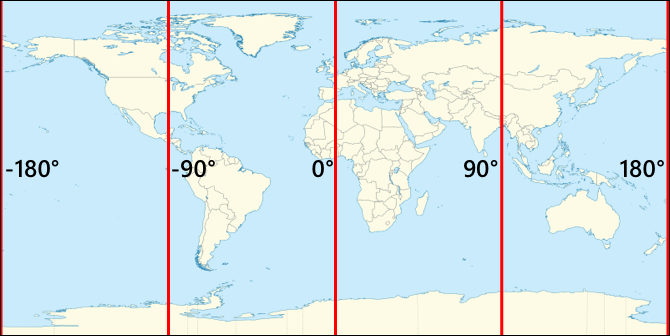

<!--
CO_OP_TRANSLATOR_METADATA:
{
  "original_hash": "52ed2bd997d08040f79a1a6ef2bac958",
  "translation_date": "2025-08-27T20:47:55+00:00",
  "source_file": "3-transport/lessons/1-location-tracking/README.md",
  "language_code": "th"
}
-->
# การติดตามตำแหน่ง

> สเก็ตโน้ตโดย [Nitya Narasimhan](https://github.com/nitya) คลิกที่ภาพเพื่อดูเวอร์ชันขนาดใหญ่

## แบบทดสอบก่อนการบรรยาย

[แบบทดสอบก่อนการบรรยาย](https://black-meadow-040d15503.1.azurestaticapps.net/quiz/21)

## บทนำ

กระบวนการหลักในการนำอาหารจากเกษตรกรไปยังผู้บริโภคเกี่ยวข้องกับการบรรจุกล่องผลผลิตลงในรถบรรทุก เรือ เครื่องบิน หรือยานพาหนะขนส่งเชิงพาณิชย์อื่น ๆ และส่งอาหารไปยังที่หมาย - ไม่ว่าจะเป็นลูกค้าโดยตรง หรือศูนย์กลางหรือคลังสินค้าเพื่อการแปรรูป กระบวนการทั้งหมดตั้งแต่ฟาร์มถึงผู้บริโภคเป็นส่วนหนึ่งของกระบวนการที่เรียกว่า *ห่วงโซ่อุปทาน* วิดีโอด้านล่างจาก W. P. Carey School of Business ของมหาวิทยาลัยรัฐแอริโซนาอธิบายแนวคิดของห่วงโซ่อุปทานและวิธีการจัดการในรายละเอียดเพิ่มเติม

> 🎥 คลิกที่ภาพด้านบนเพื่อดูวิดีโอ

การเพิ่มอุปกรณ์ IoT สามารถปรับปรุงห่วงโซ่อุปทานของคุณได้อย่างมาก ช่วยให้คุณจัดการตำแหน่งของสินค้า วางแผนการขนส่งและการจัดการสินค้าได้ดีขึ้น และตอบสนองต่อปัญหาได้รวดเร็วขึ้น

เมื่อจัดการยานพาหนะ เช่น รถบรรทุก การทราบตำแหน่งของยานพาหนะในเวลาที่กำหนดเป็นสิ่งที่มีประโยชน์ ยานพาหนะสามารถติดตั้งเซ็นเซอร์ GPS ที่ส่งตำแหน่งไปยังระบบ IoT ช่วยให้เจ้าของสามารถระบุตำแหน่ง ดูเส้นทางที่ยานพาหนะเดินทาง และทราบเวลาที่จะถึงจุดหมายปลายทาง ยานพาหนะส่วนใหญ่ทำงานนอกพื้นที่ครอบคลุม WiFi ดังนั้นจึงใช้เครือข่ายเซลลูลาร์ในการส่งข้อมูลประเภทนี้ บางครั้งเซ็นเซอร์ GPS จะถูกรวมเข้ากับอุปกรณ์ IoT ที่ซับซ้อนมากขึ้น เช่น สมุดบันทึกอิเล็กทรอนิกส์ อุปกรณ์เหล่านี้ติดตามระยะเวลาที่รถบรรทุกอยู่ในระหว่างการเดินทางเพื่อให้แน่ใจว่าผู้ขับขี่ปฏิบัติตามกฎหมายท้องถิ่นเกี่ยวกับชั่วโมงการทำงาน

ในบทเรียนนี้ คุณจะได้เรียนรู้วิธีติดตามตำแหน่งของยานพาหนะโดยใช้เซ็นเซอร์ระบบกำหนดตำแหน่งบนโลก (GPS)

ในบทเรียนนี้เราจะครอบคลุม:

* [ยานพาหนะที่เชื่อมต่อ](../../../../../3-transport/lessons/1-location-tracking)
* [พิกัดภูมิศาสตร์](../../../../../3-transport/lessons/1-location-tracking)
* [ระบบกำหนดตำแหน่งบนโลก (GPS)](../../../../../3-transport/lessons/1-location-tracking)
* [อ่านข้อมูลเซ็นเซอร์ GPS](../../../../../3-transport/lessons/1-location-tracking)
* [ข้อมูล GPS แบบ NMEA](../../../../../3-transport/lessons/1-location-tracking)
* [ถอดรหัสข้อมูลเซ็นเซอร์ GPS](../../../../../3-transport/lessons/1-location-tracking)

## ยานพาหนะที่เชื่อมต่อ

IoT กำลังเปลี่ยนแปลงวิธีการขนส่งสินค้าโดยการสร้างกลุ่ม *ยานพาหนะที่เชื่อมต่อ* ยานพาหนะเหล่านี้เชื่อมต่อกับระบบ IT ส่วนกลางเพื่อรายงานข้อมูลเกี่ยวกับตำแหน่งและข้อมูลเซ็นเซอร์อื่น ๆ การมีกลุ่มยานพาหนะที่เชื่อมต่อมีประโยชน์หลากหลาย:

* การติดตามตำแหน่ง - คุณสามารถระบุตำแหน่งของยานพาหนะได้ทุกเวลา ทำให้คุณสามารถ:

  * รับการแจ้งเตือนเมื่อยานพาหนะกำลังจะถึงจุดหมายปลายทางเพื่อเตรียมทีมสำหรับการขนถ่าย
  * ค้นหายานพาหนะที่ถูกขโมย
  * รวมข้อมูลตำแหน่งและเส้นทางกับปัญหาการจราจรเพื่อให้คุณสามารถเปลี่ยนเส้นทางยานพาหนะระหว่างการเดินทาง
  * ปฏิบัติตามกฎหมายภาษี บางประเทศเรียกเก็บภาษีจากยานพาหนะตามระยะทางที่ขับบนถนนสาธารณะ (เช่น [RUC ของนิวซีแลนด์](https://www.nzta.govt.nz/vehicles/licensing-rego/road-user-charges/)) ดังนั้นการทราบเมื่อยานพาหนะอยู่บนถนนสาธารณะเทียบกับถนนส่วนตัวทำให้ง่ายต่อการคำนวณภาษีที่ต้องชำระ
  * ทราบตำแหน่งที่จะส่งทีมซ่อมบำรุงในกรณีที่เกิดการเสีย

* ข้อมูลการขับขี่ - สามารถตรวจสอบให้แน่ใจว่าผู้ขับขี่ปฏิบัติตามข้อจำกัดความเร็ว เลี้ยวด้วยความเร็วที่เหมาะสม เบรกอย่างมีประสิทธิภาพ และขับขี่อย่างปลอดภัย ยานพาหนะที่เชื่อมต่อยังสามารถติดตั้งกล้องเพื่อบันทึกเหตุการณ์ ซึ่งสามารถเชื่อมโยงกับประกันภัยเพื่อให้ได้รับอัตราค่าประกันที่ลดลงสำหรับผู้ขับขี่ที่ดี

* การปฏิบัติตามชั่วโมงการขับขี่ - ตรวจสอบให้แน่ใจว่าผู้ขับขี่ขับรถเฉพาะในชั่วโมงที่กฎหมายอนุญาตโดยอิงจากเวลาที่เปิดและปิดเครื่องยนต์

ประโยชน์เหล่านี้สามารถรวมกันได้ - ตัวอย่างเช่น การรวมการปฏิบัติตามชั่วโมงการขับขี่กับการติดตามตำแหน่งเพื่อเปลี่ยนเส้นทางผู้ขับขี่หากพวกเขาไม่สามารถไปถึงจุดหมายปลายทางภายในชั่วโมงการขับขี่ที่อนุญาต สิ่งเหล่านี้ยังสามารถรวมกับข้อมูลเซ็นเซอร์เฉพาะยานพาหนะอื่น ๆ เช่น ข้อมูลอุณหภูมิจากรถบรรทุกควบคุมอุณหภูมิ เพื่อให้สามารถเปลี่ยนเส้นทางยานพาหนะได้หากเส้นทางปัจจุบันหมายความว่าสินค้าไม่สามารถรักษาอุณหภูมิได้

> 🎓 โลจิสติกส์คือกระบวนการขนส่งสินค้าจากที่หนึ่งไปยังอีกที่หนึ่ง เช่น จากฟาร์มไปยังซูเปอร์มาร์เก็ตผ่านคลังสินค้าหนึ่งแห่งหรือมากกว่า เกษตรกรบรรจุกล่องมะเขือเทศที่ถูกโหลดลงในรถบรรทุก ส่งไปยังคลังสินค้ากลาง และถูกโหลดลงในรถบรรทุกคันที่สองที่อาจมีสินค้าหลากหลายประเภทซึ่งจะถูกส่งไปยังซูเปอร์มาร์เก็ต

องค์ประกอบหลักของการติดตามยานพาหนะคือ GPS - เซ็นเซอร์ที่สามารถระบุตำแหน่งของพวกเขาได้ทุกที่บนโลก ในบทเรียนนี้คุณจะได้เรียนรู้วิธีใช้เซ็นเซอร์ GPS โดยเริ่มจากการเรียนรู้วิธีการกำหนดตำแหน่งบนโลก

## พิกัดภูมิศาสตร์

พิกัดภูมิศาสตร์ใช้เพื่อกำหนดจุดบนพื้นผิวโลก คล้ายกับวิธีที่พิกัดสามารถใช้เพื่อวาดพิกเซลบนหน้าจอคอมพิวเตอร์หรือกำหนดตำแหน่งในงานปักครอสติช สำหรับจุดเดียว คุณจะมีคู่ของพิกัด ตัวอย่างเช่น Microsoft Campus ใน Redmond, Washington, USA ตั้งอยู่ที่ 47.6423109, -122.1390293

### ละติจูดและลองจิจูด

โลกเป็นทรงกลม - วงกลมสามมิติ ดังนั้นจุดต่าง ๆ จึงถูกกำหนดโดยการแบ่งออกเป็น 360 องศา เช่นเดียวกับเรขาคณิตของวงกลม ละติจูดวัดจำนวนองศาจากเหนือไปใต้ ลองจิจูดวัดจำนวนองศาจากตะวันออกไปตะวันตก

> 💁 ไม่มีใครทราบเหตุผลดั้งเดิมว่าทำไมวงกลมจึงถูกแบ่งออกเป็น 360 องศา หน้า [degree (angle) บน Wikipedia](https://wikipedia.org/wiki/Degree_(angle)) ครอบคลุมเหตุผลที่เป็นไปได้บางประการ

ละติจูดวัดโดยใช้เส้นที่ล้อมรอบโลกและขนานกับเส้นศูนย์สูตร แบ่งซีกโลกเหนือและใต้เป็น 90° แต่ละซีก เส้นศูนย์สูตรอยู่ที่ 0° ขั้วโลกเหนืออยู่ที่ 90° หรือที่เรียกว่า 90° เหนือ และขั้วโลกใต้อยู่ที่ -90° หรือ 90° ใต้

ลองจิจูดวัดเป็นจำนวนองศาที่วัดจากตะวันออกและตะวันตก จุดเริ่มต้น 0° ของลองจิจูดเรียกว่า *เส้นเมริเดียนแรก* และถูกกำหนดในปี 1884 ให้เป็นเส้นจากขั้วโลกเหนือไปยังขั้วโลกใต้ที่ผ่าน [British Royal Observatory ใน Greenwich, England](https://wikipedia.org/wiki/Royal_Observatory,_Greenwich)

> 🎓 เมริเดียนคือเส้นตรงสมมติที่ไปจากขั้วโลกเหนือไปยังขั้วโลกใต้ ก่อให้เกิดครึ่งวงกลม

ในการวัดลองจิจูดของจุด คุณวัดจำนวนองศารอบเส้นศูนย์สูตรจากเส้นเมริเดียนแรกไปยังเมริเดียนที่ผ่านจุดนั้น ลองจิจูดไปจาก -180° หรือ 180° ตะวันตก ผ่าน 0° ที่เส้นเมริเดียนแรก ไปยัง 180° หรือ 180° ตะวันออก 180° และ -180° หมายถึงจุดเดียวกัน คือเส้นเมริเดียนตรงข้ามหรือเส้นเมริเดียนที่ 180 ซึ่งเป็นเส้นเมริเดียนที่อยู่ฝั่งตรงข้ามของโลกจากเส้นเมริเดียนแรก

> 💁 เส้นเมริเดียนตรงข้ามไม่ควรสับสนกับเส้นแบ่งวันสากล ซึ่งอยู่ในตำแหน่งที่ใกล้เคียงกัน แต่ไม่ใช่เส้นตรงและมีการเปลี่ยนแปลงเพื่อให้เหมาะกับเขตแดนทางภูมิศาสตร์และการเมือง

✅ ทำการค้นคว้า: ลองค้นหาละติจูดและลองจิจูดของตำแหน่งปัจจุบันของคุณ

### องศา นาที และวินาที เทียบกับองศาทศนิยม

โดยปกติ การวัดองศาของละติจูดและลองจิจูดจะทำโดยใช้ระบบเลขฐาน 60 หรือ sexagesimal ซึ่งเป็นระบบเลขที่ใช้โดยชาวบาบิโลนโบราณที่ทำการวัดและบันทึกเวลาและระยะทางครั้งแรก คุณอาจใช้ sexagesimal ทุกวันโดยไม่รู้ตัว - การแบ่งชั่วโมงออกเป็น 60 นาที และนาทีออกเป็น 60 วินาที

ลองจิจูดและละติจูดวัดเป็นองศา นาที และวินาที โดยหนึ่งนาทีเท่ากับ 1/60 ขององศา และ 1 วินาทีเท่ากับ 1/60 นาที

ตัวอย่างเช่น ที่เส้นศูนย์สูตร:

* 1° ของละติจูดคือ **111.3 กิโลเมตร**
* 1 นาทีของละติจูดคือ 111.3/60 = **1.855 กิโลเมตร**
* 1 วินาทีของละติจูดคือ 1.855/60 = **0.031 กิโลเมตร**

สัญลักษณ์สำหรับนาทีคือเครื่องหมายคำพูดเดี่ยว สำหรับวินาทีคือเครื่องหมายคำพูดคู่ ตัวอย่างเช่น 2 องศา 17 นาที และ 43 วินาที จะเขียนเป็น 2°17'43" ส่วนของวินาทีจะให้เป็นทศนิยม เช่น ครึ่งวินาทีคือ 0°0'0.5"

คอมพิวเตอร์ไม่ทำงานในฐาน 60 ดังนั้นพิกัดเหล่านี้จึงถูกให้เป็นองศาทศนิยมเมื่อใช้ข้อมูล GPS ในระบบคอมพิวเตอร์ส่วนใหญ่ ตัวอย่างเช่น 2°17'43" คือ 2.295277 โดยปกติจะละเว้นสัญลักษณ์องศา

พิกัดสำหรับจุดจะถูกให้เป็น `ละติจูด, ลองจิจูด` เสมอ ดังนั้นตัวอย่างก่อนหน้านี้ของ Microsoft Campus ที่ 47.6423109,-122.117198 มี:

* ละติจูด 47.6423109 (47.6423109 องศาเหนือเส้นศูนย์สูตร)
* ลองจิจูด -122.1390293 (122.1390293 องศาตะวันตกของเส้นเมริเดียนแรก)

## ระบบกำหนดตำแหน่งบนโลก (GPS)

ระบบ GPS ใช้ดาวเทียมหลายดวงที่โคจรรอบโลกเพื่อระบุตำแหน่งของคุณ คุณอาจเคยใช้ระบบ GPS โดยไม่รู้ตัว - เพื่อค้นหาตำแหน่งของคุณในแอปแผนที่บนโทรศัพท์ เช่น Apple Maps หรือ Google Maps หรือเพื่อดูว่ารถของคุณอยู่ที่ไหนในแอปเรียกรถ เช่น Uber หรือ Lyft หรือเมื่อใช้ระบบนำทางผ่านดาวเทียม (sat-nav) ในรถของคุณ

> 🎓 ดาวเทียมใน 'ระบบนำทางผ่านดาวเทียม' คือดาวเทียม GPS!

ระบบ GPS ทำงานโดยมีดาวเทียมจำนวนหนึ่งที่ส่งสัญญาณพร้อมตำแหน่งปัจจุบันของดาวเทียมแต่ละดวง และเวลาที่แม่นยำ สัญญาณเหล่านี้ถูกส่งผ่านคลื่นวิทยุและถูกตรวจจับโดยเสาอากาศในเซ็นเซอร์ GPS เซ็นเซอร์ GPS จะตรวจจับสัญญาณเหล่านี้ และใช้เวลาปัจจุบันวัดระยะเวลาที่สัญญาณใช้ในการเดินทางจากดาวเทียมไปยังเซ็นเซอร์ เนื่องจากความเร็วของคลื่นวิทยุคงที่ เซ็นเซอร์ GPS สามารถใช้เวลาที่ส่งมาเพื่อคำนวณระยะทางระหว่างเซ็นเซอร์กับดาวเทียม โดยการรวมข้อมูลจากดาวเทียมอย่างน้อย 3 ดวงกับตำแหน่งที่ส่งมา เซ็นเซอร์ GPS สามารถระบุตำแหน่งของตัวเองบนโลกได้

> 💁 เซ็นเซอร์ GPS ต้องการเสาอากาศเพื่อรับคลื่นวิทยุ เสาอากาศที่ติดตั้งในรถบรรทุกและรถยนต์ที่มี GPS ในตัวจะถูกวางตำแหน่งเพื่อรับสัญญาณที่ดี โดยปกติจะอยู่บนกระจกหน้ารถหรือหลังคา หากคุณใช้ระบบ GPS แยกต่างหาก เช่น สมาร์ทโฟนหรืออุปกรณ์ IoT คุณต้องตรวจสอบให้แน่ใจว่าเสาอากาศที่ติดตั้งในระบบ GPS หรือโทรศัพท์มีมุมมองที่ชัดเจนของท้องฟ้า เช่น การติดตั้งบนกระจกหน้ารถ

ดาวเทียม GPS กำลังโคจรรอบโลก ไม่ได้อยู่ในจุดคงที่เหนือเซ็นเซอร์ ดังนั้นข้อมูลตำแหน่งจึงรวมถึงระดับความสูงเหนือระดับน้ำทะเล รวมถึงละติจูดและลองจิจูด

GPS เคยมีข้อจำกัดด้านความแม่นยำที่บังคับใช้โดยกองทัพสหรัฐฯ จำกัดความแม่นยำไว้ที่ประมาณ 5 เมตร ข้อจำกัดนี้ถูกยกเลิกในปี 2000 ทำให้มีความแม่นยำถึง 30 เซนติเมตร การได้รับความแม่นยำนี้ไม่สามารถทำได้เสมอไปเนื่องจากการรบกวนสัญญาณ

✅ หากคุณมีสมาร์ทโฟน ลองเปิดแอปแผนที่และดูว่าตำแหน่งของคุณแม่นยำแค่ไหน อาจใช้เวลาสักครู่สำหรับโทรศัพท์ของคุณในการตรวจจับดาวเทียมหลายดวงเพื่อให้ได้ตำแหน่งที่แม่นยำมากขึ้น
> 💁 ดาวเทียมมีนาฬิกาอะตอมที่มีความแม่นยำสูงมาก แต่มีการคลาดเคลื่อนประมาณ 38 ไมโครวินาที (0.0000038 วินาที) ต่อวันเมื่อเทียบกับนาฬิกาอะตอมบนโลก เนื่องจากเวลาช้าลงเมื่อความเร็วเพิ่มขึ้นตามที่ทฤษฎีสัมพัทธภาพพิเศษและทั่วไปของไอน์สไตน์ได้ทำนายไว้ - ดาวเทียมเคลื่อนที่เร็วกว่าการหมุนของโลก การคลาดเคลื่อนนี้ถูกนำมาใช้เพื่อพิสูจน์คำทำนายของทฤษฎีสัมพัทธภาพพิเศษและทั่วไป และต้องมีการปรับแก้ในขั้นตอนการออกแบบระบบ GPS พูดง่ายๆ ก็คือ เวลาบนดาวเทียม GPS เดินช้ากว่า
ระบบ GPS ได้รับการพัฒนาและใช้งานโดยหลายประเทศและสหภาพทางการเมือง เช่น สหรัฐอเมริกา รัสเซีย ญี่ปุ่น อินเดีย สหภาพยุโรป และจีน เซ็นเซอร์ GPS สมัยใหม่สามารถเชื่อมต่อกับระบบเหล่านี้ส่วนใหญ่เพื่อให้ได้ตำแหน่งที่รวดเร็วและแม่นยำยิ่งขึ้น

> 🎓 กลุ่มดาวเทียมในแต่ละระบบเรียกว่า "Constellations"

## อ่านข้อมูลจากเซ็นเซอร์ GPS

เซ็นเซอร์ GPS ส่วนใหญ่ส่งข้อมูล GPS ผ่าน UART

> ⚠️ UART ได้ถูกกล่าวถึงใน [โปรเจกต์ 2 บทเรียน 2](../../../2-farm/lessons/2-detect-soil-moisture/README.md#universal-asynchronous-receiver-transmitter-uart) หากจำเป็นสามารถย้อนกลับไปดูบทเรียนนั้นได้

คุณสามารถใช้เซ็นเซอร์ GPS บนอุปกรณ์ IoT ของคุณเพื่อรับข้อมูล GPS

### งาน - เชื่อมต่อเซ็นเซอร์ GPS และอ่านข้อมูล GPS

ทำตามคู่มือที่เกี่ยวข้องเพื่ออ่านข้อมูล GPS โดยใช้อุปกรณ์ IoT ของคุณ:

* [Arduino - Wio Terminal](wio-terminal-gps-sensor.md)
* [คอมพิวเตอร์บอร์ดเดี่ยว - Raspberry Pi](pi-gps-sensor.md)
* [คอมพิวเตอร์บอร์ดเดี่ยว - อุปกรณ์เสมือน](virtual-device-gps-sensor.md)

## ข้อมูล GPS แบบ NMEA

เมื่อคุณรันโค้ด คุณอาจเห็นสิ่งที่ดูเหมือนข้อความที่ไม่มีความหมายในผลลัพธ์ นี่คือข้อมูล GPS มาตรฐาน และมันมีความหมายทั้งหมด

เซ็นเซอร์ GPS ส่งออกข้อมูลโดยใช้ข้อความ NMEA ตามมาตรฐาน NMEA 0183 NMEA เป็นคำย่อของ [National Marine Electronics Association](https://www.nmea.org) ซึ่งเป็นองค์กรการค้าของสหรัฐฯ ที่กำหนดมาตรฐานการสื่อสารระหว่างอุปกรณ์อิเล็กทรอนิกส์ทางทะเล

> 💁 มาตรฐานนี้เป็นทรัพย์สินทางปัญญาและมีราคาขายอย่างน้อย 2,000 ดอลลาร์สหรัฐ แต่มีข้อมูลเพียงพอในโดเมนสาธารณะที่ทำให้มาตรฐานส่วนใหญ่ถูกวิศวกรรมย้อนกลับและสามารถใช้งานในโค้ดโอเพ่นซอร์สและโค้ดที่ไม่ใช่เชิงพาณิชย์ได้

ข้อความเหล่านี้เป็นข้อความที่ใช้ตัวอักษร แต่ละข้อความประกอบด้วย *ประโยค* ที่เริ่มต้นด้วยตัวอักษร `$` ตามด้วยตัวอักษร 2 ตัวเพื่อระบุแหล่งที่มาของข้อความ (เช่น GP สำหรับระบบ GPS ของสหรัฐฯ GN สำหรับ GLONASS ระบบ GPS ของรัสเซีย) และตัวอักษร 3 ตัวเพื่อระบุประเภทของข้อความ ส่วนที่เหลือของข้อความคือฟิลด์ที่คั่นด้วยเครื่องหมายจุลภาค และสิ้นสุดด้วยตัวอักษรขึ้นบรรทัดใหม่

ประเภทของข้อความที่สามารถรับได้มีดังนี้:

| ประเภท | คำอธิบาย |
| ---- | ----------- |
| GGA | ข้อมูลการแก้ไข GPS รวมถึงละติจูด ลองจิจูด และความสูงของเซ็นเซอร์ GPS พร้อมจำนวนดาวเทียมที่มองเห็นเพื่อคำนวณตำแหน่งนี้ |
| ZDA | วันที่และเวลาปัจจุบัน รวมถึงเขตเวลาท้องถิ่น |
| GSV | รายละเอียดของดาวเทียมที่มองเห็น - หมายถึงดาวเทียมที่เซ็นเซอร์ GPS สามารถตรวจจับสัญญาณได้ |

> 💁 ข้อมูล GPS รวมถึงการประทับเวลา ดังนั้นอุปกรณ์ IoT ของคุณสามารถรับเวลาได้จากเซ็นเซอร์ GPS แทนที่จะพึ่งพาเซิร์ฟเวอร์ NTP หรือนาฬิกาเรียลไทม์ภายใน

ข้อความ GGA รวมตำแหน่งปัจจุบันโดยใช้รูปแบบ `(dd)dmm.mmmm` พร้อมตัวอักษรหนึ่งตัวเพื่อระบุทิศทาง ตัวอักษร `d` ในรูปแบบคือองศา ตัวอักษร `m` คือค่าในนาที และวินาทีเป็นทศนิยมของนาที ตัวอย่างเช่น 2°17'43" จะเท่ากับ 217.716666667 - 2 องศา 17.716666667 นาที

ตัวอักษรทิศทางสามารถเป็น `N` หรือ `S` สำหรับละติจูดเพื่อระบุทิศเหนือหรือใต้ และ `E` หรือ `W` สำหรับลองจิจูดเพื่อระบุทิศตะวันออกหรือทิศตะวันตก ตัวอย่างเช่น ละติจูด 2°17'43" จะมีตัวอักษรทิศทางเป็น `N` -2°17'43" จะมีตัวอักษรทิศทางเป็น `S`

ตัวอย่าง - ประโยค NMEA `$GNGGA,020604.001,4738.538654,N,12208.341758,W,1,3,,164.7,M,-17.1,M,,*67`

* ส่วนละติจูดคือ `4738.538654,N` ซึ่งแปลงเป็น 47.6423109 ในองศาทศนิยม `4738.538654` คือ 47.6423109 และทิศทางคือ `N` (เหนือ) ดังนั้นจึงเป็นละติจูดบวก

* ส่วนลองจิจูดคือ `12208.341758,W` ซึ่งแปลงเป็น -122.1390293 ในองศาทศนิยม `12208.341758` คือ 122.1390293° และทิศทางคือ `W` (ตะวันตก) ดังนั้นจึงเป็นลองจิจูดลบ

## ถอดรหัสข้อมูลเซ็นเซอร์ GPS

แทนที่จะใช้ข้อมูล NMEA ดิบ ควรถอดรหัสข้อมูลให้อยู่ในรูปแบบที่มีประโยชน์มากขึ้น มีไลบรารีโอเพ่นซอร์สหลายตัวที่คุณสามารถใช้เพื่อช่วยดึงข้อมูลที่มีประโยชน์จากข้อความ NMEA ดิบ

### งาน - ถอดรหัสข้อมูลเซ็นเซอร์ GPS

ทำตามคู่มือที่เกี่ยวข้องเพื่อถอดรหัสข้อมูลเซ็นเซอร์ GPS โดยใช้อุปกรณ์ IoT ของคุณ:

* [Arduino - Wio Terminal](wio-terminal-gps-decode.md)
* [คอมพิวเตอร์บอร์ดเดี่ยว - Raspberry Pi/อุปกรณ์ IoT เสมือน](single-board-computer-gps-decode.md)

---

## 🚀 ความท้าทาย

เขียนตัวถอดรหัส NMEA ของคุณเอง! แทนที่จะพึ่งพาไลบรารีของบุคคลที่สามในการถอดรหัสประโยค NMEA คุณสามารถเขียนตัวถอดรหัสของคุณเองเพื่อดึงละติจูดและลองจิจูดจากประโยค NMEA ได้หรือไม่?

## แบบทดสอบหลังการบรรยาย

[แบบทดสอบหลังการบรรยาย](https://black-meadow-040d15503.1.azurestaticapps.net/quiz/22)

## ทบทวนและศึกษาด้วยตนเอง

* อ่านเพิ่มเติมเกี่ยวกับพิกัดภูมิศาสตร์ใน [หน้าระบบพิกัดภูมิศาสตร์บน Wikipedia](https://wikipedia.org/wiki/Geographic_coordinate_system)
* อ่านเกี่ยวกับเส้นเมริเดียนหลักบนวัตถุท้องฟ้าอื่น ๆ นอกเหนือจากโลกใน [หน้าหลักเมริเดียนบน Wikipedia](https://wikipedia.org/wiki/Prime_meridian#Prime_meridian_on_other_planetary_bodies)
* ศึกษาระบบ GPS ต่าง ๆ จากรัฐบาลและสหภาพทางการเมืองทั่วโลก เช่น สหภาพยุโรป ญี่ปุ่น รัสเซีย อินเดีย และสหรัฐอเมริกา

## งานที่ได้รับมอบหมาย

[สำรวจข้อมูล GPS อื่น ๆ](assignment.md)

---

**ข้อจำกัดความรับผิดชอบ**:  
เอกสารนี้ได้รับการแปลโดยใช้บริการแปลภาษา AI [Co-op Translator](https://github.com/Azure/co-op-translator) แม้ว่าเราจะพยายามให้การแปลมีความถูกต้อง แต่โปรดทราบว่าการแปลโดยอัตโนมัติอาจมีข้อผิดพลาดหรือความไม่ถูกต้อง เอกสารต้นฉบับในภาษาดั้งเดิมควรถือเป็นแหล่งข้อมูลที่เชื่อถือได้ สำหรับข้อมูลที่สำคัญ ขอแนะนำให้ใช้บริการแปลภาษาจากผู้เชี่ยวชาญ เราไม่รับผิดชอบต่อความเข้าใจผิดหรือการตีความที่ผิดพลาดซึ่งเกิดจากการใช้การแปลนี้