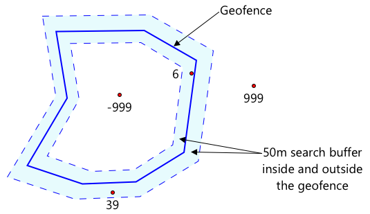

<!--
CO_OP_TRANSLATOR_METADATA:
{
  "original_hash": "078ae664c7b686bf069545e9a5fc95b2",
  "translation_date": "2025-08-27T20:54:03+00:00",
  "source_file": "3-transport/lessons/4-geofences/README.md",
  "language_code": "th"
}
-->
# รั้วภูมิศาสตร์ (Geofences)


> สเก็ตโน้ตโดย [Nitya Narasimhan](https://github.com/nitya) คลิกที่ภาพเพื่อดูเวอร์ชันขนาดใหญ่

วิดีโอนี้ให้ภาพรวมเกี่ยวกับรั้วภูมิศาสตร์และวิธีการใช้งานใน Azure Maps ซึ่งเป็นหัวข้อที่จะครอบคลุมในบทเรียนนี้:

[](https://www.youtube.com/watch?v=nsrgYhaYNVY)

> 🎥 คลิกที่ภาพด้านบนเพื่อดูวิดีโอ

## แบบทดสอบก่อนเรียน

[แบบทดสอบก่อนเรียน](https://black-meadow-040d15503.1.azurestaticapps.net/quiz/27)

## บทนำ

ใน 3 บทเรียนที่ผ่านมา คุณได้ใช้ IoT เพื่อติดตามตำแหน่งของรถบรรทุกที่ขนส่งผลผลิตจากฟาร์มของคุณไปยังศูนย์แปรรูป คุณได้เก็บข้อมูล GPS ส่งไปยังคลาวด์เพื่อจัดเก็บ และแสดงผลบนแผนที่ ขั้นตอนถัดไปในการเพิ่มประสิทธิภาพของห่วงโซ่อุปทานของคุณคือการรับการแจ้งเตือนเมื่อรถบรรทุกกำลังจะมาถึงศูนย์แปรรูป เพื่อให้ทีมงานที่ต้องการสำหรับการขนถ่ายสามารถเตรียมพร้อมด้วยรถยกและอุปกรณ์อื่น ๆ ได้ทันทีที่รถมาถึง วิธีนี้จะช่วยให้การขนถ่ายเป็นไปอย่างรวดเร็ว และคุณไม่ต้องเสียค่าใช้จ่ายสำหรับรถบรรทุกและคนขับที่ต้องรอ

ในบทเรียนนี้ คุณจะได้เรียนรู้เกี่ยวกับรั้วภูมิศาสตร์ - พื้นที่ทางภูมิศาสตร์ที่กำหนดไว้ เช่น พื้นที่ภายในระยะขับรถ 2 กิโลเมตรจากศูนย์แปรรูป และวิธีการทดสอบว่าพิกัด GPS อยู่ภายในหรือภายนอกรั้วภูมิศาสตร์ เพื่อดูว่าตัวเซ็นเซอร์ GPS ของคุณมาถึงหรือออกจากพื้นที่หรือไม่

ในบทเรียนนี้เราจะครอบคลุม:

* [รั้วภูมิศาสตร์คืออะไร](../../../../../3-transport/lessons/4-geofences)
* [การกำหนดรั้วภูมิศาสตร์](../../../../../3-transport/lessons/4-geofences)
* [การทดสอบจุดกับรั้วภูมิศาสตร์](../../../../../3-transport/lessons/4-geofences)
* [การใช้รั้วภูมิศาสตร์จากโค้ดแบบไร้เซิร์ฟเวอร์](../../../../../3-transport/lessons/4-geofences)

> 🗑 นี่เป็นบทเรียนสุดท้ายในโครงการนี้ ดังนั้นหลังจากที่คุณทำบทเรียนนี้และงานที่ได้รับมอบหมายเสร็จแล้ว อย่าลืมล้างบริการคลาวด์ของคุณ คุณจะต้องใช้บริการเหล่านี้เพื่อทำงานที่ได้รับมอบหมายให้เสร็จ ดังนั้นโปรดทำงานให้เสร็จก่อน
>
> หากจำเป็น ให้ดู [คู่มือการล้างโครงการของคุณ](../../../clean-up.md) สำหรับคำแนะนำเกี่ยวกับวิธีการทำเช่นนี้

## รั้วภูมิศาสตร์คืออะไร

รั้วภูมิศาสตร์คือขอบเขตเสมือนสำหรับพื้นที่ทางภูมิศาสตร์ในโลกจริง รั้วภูมิศาสตร์สามารถเป็นวงกลมที่กำหนดเป็นจุดและรัศมี (เช่น วงกลมกว้าง 100 เมตรรอบอาคาร) หรือเป็นรูปหลายเหลี่ยมที่ครอบคลุมพื้นที่ เช่น เขตโรงเรียน ขอบเขตเมือง หรือวิทยาเขตมหาวิทยาลัยหรือสำนักงาน


> 💁 คุณอาจเคยใช้รั้วภูมิศาสตร์โดยไม่รู้ตัว หากคุณเคยตั้งค่าการเตือนความจำโดยใช้แอปเตือนความจำของ iOS หรือ Google Keep ตามตำแหน่งที่ตั้ง คุณได้ใช้รั้วภูมิศาสตร์แล้ว แอปเหล่านี้จะตั้งค่ารั้วภูมิศาสตร์ตามตำแหน่งที่ตั้งที่กำหนดและแจ้งเตือนคุณเมื่อโทรศัพท์ของคุณเข้าสู่รั้วภูมิศาสตร์

มีหลายเหตุผลที่คุณอาจต้องการทราบว่ารถยนต์อยู่ภายในหรือภายนอกรั้วภูมิศาสตร์:

* การเตรียมการขนถ่าย - การได้รับการแจ้งเตือนว่ารถมาถึงสถานที่แล้วช่วยให้ทีมงานเตรียมพร้อมสำหรับการขนถ่ายรถ ลดเวลารอของรถบรรทุก วิธีนี้ช่วยให้คนขับสามารถส่งของได้มากขึ้นในหนึ่งวันโดยใช้เวลารอน้อยลง
* การปฏิบัติตามภาษี - บางประเทศ เช่น นิวซีแลนด์ เรียกเก็บภาษีถนนสำหรับรถยนต์ดีเซลตามน้ำหนักของรถเมื่อขับบนถนนสาธารณะเท่านั้น การใช้รั้วภูมิศาสตร์ช่วยให้คุณติดตามระยะทางที่ขับบนถนนสาธารณะเทียบกับถนนส่วนตัวในสถานที่ เช่น ฟาร์มหรือพื้นที่ตัดไม้
* การตรวจสอบการโจรกรรม - หากรถควรอยู่ในพื้นที่ที่กำหนด เช่น ในฟาร์ม และออกจากรั้วภูมิศาสตร์ อาจหมายความว่ารถถูกขโมย
* การปฏิบัติตามข้อกำหนดของสถานที่ - บางส่วนของสถานที่ทำงาน ฟาร์ม หรือโรงงานอาจเป็นพื้นที่ห้ามเข้า เช่น การป้องกันไม่ให้รถที่บรรทุกปุ๋ยเคมีและยาฆ่าแมลงเข้าใกล้พื้นที่ที่ปลูกพืชอินทรีย์ หากมีการเข้าสู่รั้วภูมิศาสตร์ แสดงว่ารถอยู่นอกข้อกำหนด และสามารถแจ้งเตือนคนขับได้

✅ คุณคิดถึงการใช้งานอื่น ๆ ของรั้วภูมิศาสตร์ได้หรือไม่?

Azure Maps ซึ่งเป็นบริการที่คุณใช้ในบทเรียนที่แล้วเพื่อแสดงข้อมูล GPS ช่วยให้คุณสามารถกำหนดรั้วภูมิศาสตร์และทดสอบว่าจุดอยู่ภายในหรือภายนอกรั้วภูมิศาสตร์ได้

## การกำหนดรั้วภูมิศาสตร์

รั้วภูมิศาสตร์ถูกกำหนดโดยใช้ GeoJSON เช่นเดียวกับจุดที่ถูกเพิ่มลงในแผนที่ในบทเรียนก่อนหน้า ในกรณีนี้ แทนที่จะเป็น `FeatureCollection` ของค่า `Point` จะเป็น `FeatureCollection` ที่มี `Polygon`

```json
{
   "type": "FeatureCollection",
   "features": [
     {
       "type": "Feature",
       "geometry": {
         "type": "Polygon",
         "coordinates": [
           [
             [
               -122.13393688201903,
               47.63829579223815
             ],
             [
               -122.13389128446579,
               47.63782047131512
             ],
             [
               -122.13240802288054,
               47.63783312249837
             ],
             [
               -122.13238388299942,
               47.63829037035086
             ],
             [
               -122.13393688201903,
               47.63829579223815
             ]
           ]
         ]
       },
       "properties": {
         "geometryId": "1"
       }
     }
   ]
}
```

แต่ละจุดบนรูปหลายเหลี่ยมถูกกำหนดเป็นคู่ของลองจิจูดและละติจูดในอาร์เรย์ และจุดเหล่านี้อยู่ในอาร์เรย์ที่ตั้งค่าเป็น `coordinates` ใน `Point` ในบทเรียนก่อนหน้า `coordinates` เป็นอาร์เรย์ที่มีค่า 2 ค่า ได้แก่ ละติจูดและลองจิจูด สำหรับ `Polygon` จะเป็นอาร์เรย์ของอาร์เรย์ที่มีค่า 2 ค่า ได้แก่ ลองจิจูดและละติจูด

> 💁 จำไว้ว่า GeoJSON ใช้ `ลองจิจูด, ละติจูด` สำหรับจุด ไม่ใช่ `ละติจูด, ลองจิจูด`

อาร์เรย์พิกัดของรูปหลายเหลี่ยมจะมี 1 รายการมากกว่าจำนวนจุดบนรูปหลายเหลี่ยมเสมอ โดยรายการสุดท้ายจะเหมือนกับรายการแรกเพื่อปิดรูปหลายเหลี่ยม ตัวอย่างเช่น สำหรับสี่เหลี่ยมผืนผ้าจะมี 5 จุด


ในภาพด้านบน มีสี่เหลี่ยมผืนผ้า พิกัดของรูปหลายเหลี่ยมเริ่มต้นที่มุมซ้ายบนที่ 47,-122 จากนั้นเลื่อนไปทางขวาที่ 47,-121 จากนั้นลงไปที่ 46,-121 จากนั้นไปทางซ้ายที่ 46,-122 และกลับขึ้นไปยังจุดเริ่มต้นที่ 47,-122 ซึ่งทำให้รูปหลายเหลี่ยมมี 5 จุด - มุมซ้ายบน มุมขวาบน มุมขวาล่าง มุมซ้ายล่าง และมุมซ้ายบนเพื่อปิดรูป

✅ ลองสร้างรูปหลายเหลี่ยม GeoJSON รอบบ้านหรือโรงเรียนของคุณ ใช้เครื่องมืออย่าง [GeoJSON.io](https://geojson.io/)

### งาน - การกำหนดรั้วภูมิศาสตร์

ในการใช้รั้วภูมิศาสตร์ใน Azure Maps ก่อนอื่นต้องอัปโหลดไปยังบัญชี Azure Maps ของคุณ เมื่ออัปโหลดแล้ว คุณจะได้รับ ID เฉพาะที่คุณสามารถใช้ทดสอบจุดกับรั้วภูมิศาสตร์ได้ ในการอัปโหลดรั้วภูมิศาสตร์ไปยัง Azure Maps คุณต้องใช้ API เว็บของ Maps คุณสามารถเรียก API เว็บของ Azure Maps โดยใช้เครื่องมือที่เรียกว่า [curl](https://curl.se)

> 🎓 Curl เป็นเครื่องมือบรรทัดคำสั่งสำหรับทำคำขอไปยังเว็บเอนด์พอยต์

1. หากคุณใช้ Linux, macOS หรือ Windows 10 เวอร์ชันล่าสุด คุณอาจมี curl ติดตั้งอยู่แล้ว รันคำสั่งต่อไปนี้จากเทอร์มินัลหรือบรรทัดคำสั่งของคุณเพื่อตรวจสอบ:

    ```sh
    curl --version
    ```

    หากคุณไม่เห็นข้อมูลเวอร์ชันสำหรับ curl คุณจะต้องติดตั้งจาก [หน้าดาวน์โหลด curl](https://curl.se/download.html)

    > 💁 หากคุณมีประสบการณ์กับ Postman คุณสามารถใช้แทนได้หากต้องการ

1. สร้างไฟล์ GeoJSON ที่มีรูปหลายเหลี่ยม คุณจะทดสอบสิ่งนี้โดยใช้เซ็นเซอร์ GPS ของคุณ ดังนั้นให้สร้างรูปหลายเหลี่ยมรอบตำแหน่งปัจจุบันของคุณ คุณสามารถสร้างด้วยตนเองโดยแก้ไขตัวอย่าง GeoJSON ที่ให้ไว้ด้านบน หรือใช้เครื่องมืออย่าง [GeoJSON.io](https://geojson.io/)

    GeoJSON จะต้องมี `FeatureCollection` ที่มี `Feature` พร้อม `geometry` ประเภท `Polygon`

    คุณ **ต้อง** เพิ่มองค์ประกอบ `properties` ในระดับเดียวกับองค์ประกอบ `geometry` และต้องมี `geometryId`:

    ```json
    "properties": {
        "geometryId": "1"
    }
    ```

    หากคุณใช้ [GeoJSON.io](https://geojson.io/) คุณจะต้องเพิ่มรายการนี้ด้วยตนเองในองค์ประกอบ `properties` ที่ว่างเปล่า ไม่ว่าจะหลังจากดาวน์โหลดไฟล์ JSON หรือในตัวแก้ไข JSON ในแอป

    `geometryId` นี้ต้องไม่ซ้ำกันในไฟล์นี้ คุณสามารถอัปโหลดรั้วภูมิศาสตร์หลายรายการเป็น `Features` หลายรายการใน `FeatureCollection` เดียวกันในไฟล์ GeoJSON ได้ ตราบใดที่แต่ละรายการมี `geometryId` ที่แตกต่างกัน รูปหลายเหลี่ยมสามารถมี `geometryId` เดียวกันได้หากอัปโหลดจากไฟล์ที่แตกต่างกันในเวลาที่ต่างกัน

1. บันทึกไฟล์นี้เป็น `geofence.json` และไปยังตำแหน่งที่บันทึกในเทอร์มินัลหรือคอนโซลของคุณ

1. รันคำสั่ง curl ต่อไปนี้เพื่อสร้าง GeoFence:

    ```sh
    curl --request POST 'https://atlas.microsoft.com/mapData/upload?api-version=1.0&dataFormat=geojson&subscription-key=<subscription_key>' \
         --header 'Content-Type: application/json' \
         --include \
         --data @geofence.json
    ```

    แทนที่ `<subscription_key>` ใน URL ด้วยคีย์ API สำหรับบัญชี Azure Maps ของคุณ

    URL นี้ใช้สำหรับอัปโหลดข้อมูลแผนที่ผ่าน API `https://atlas.microsoft.com/mapData/upload` การเรียกรวมถึงพารามิเตอร์ `api-version` เพื่อระบุว่าใช้ API ของ Azure Maps เวอร์ชันใด ซึ่งช่วยให้ API เปลี่ยนแปลงได้ตามเวลาแต่ยังคงความเข้ากันได้ย้อนหลัง รูปแบบข้อมูลที่อัปโหลดถูกตั้งค่าเป็น `geojson`

    คำสั่งนี้จะรันคำขอ POST ไปยัง API การอัปโหลดและส่งคืนรายการส่วนหัวของการตอบกลับซึ่งรวมถึงส่วนหัวที่เรียกว่า `location`

    ```output
    content-type: application/json
    location: https://us.atlas.microsoft.com/mapData/operations/1560ced6-3a80-46f2-84b2-5b1531820eab?api-version=1.0
    x-ms-azuremaps-region: West US 2
    x-content-type-options: nosniff
    strict-transport-security: max-age=31536000; includeSubDomains
    x-cache: CONFIG_NOCACHE
    date: Sat, 22 May 2021 21:34:57 GMT
    content-length: 0
    ```

    > 🎓 เมื่อเรียกเว็บเอนด์พอยต์ คุณสามารถส่งพารามิเตอร์ไปยังการเรียกโดยเพิ่ม `?` ตามด้วยคู่คีย์-ค่าในรูปแบบ `key=value` โดยแยกคู่คีย์-ค่าด้วย `&`

1. Azure Maps ไม่ได้ประมวลผลสิ่งนี้ทันที ดังนั้นคุณจะต้องตรวจสอบเพื่อดูว่าคำขออัปโหลดเสร็จสิ้นหรือไม่โดยใช้ URL ที่ให้ไว้ในส่วนหัว `location` ทำคำขอ GET ไปยังตำแหน่งนี้เพื่อตรวจสอบสถานะ คุณจะต้องเพิ่มคีย์การสมัครสมาชิกของคุณไปยังท้าย URL `location` โดยเพิ่ม `&subscription-key=<subscription_key>` ไปยังท้าย URL โดยแทนที่ `<subscription_key>` ด้วยคีย์ API สำหรับบัญชี Azure Maps ของคุณ รันคำสั่งต่อไปนี้:

    ```sh
    curl --request GET '<location>&subscription-key=<subscription_key>'
    ```

    แทนที่ `<location>` ด้วยค่าของส่วนหัว `location` และ `<subscription_key>` ด้วยคีย์ API สำหรับบัญชี Azure Maps ของคุณ

1. ตรวจสอบค่าของ `status` ในการตอบกลับ หากไม่ใช่ `Succeeded` ให้รอสักครู่แล้วลองอีกครั้ง

1. เมื่อสถานะกลับมาเป็น `Succeeded` ให้ดูที่ `resourceLocation` จากการตอบกลับ ซึ่งมีรายละเอียดเกี่ยวกับ ID เฉพาะ (เรียกว่า UDID) สำหรับวัตถุ GeoJSON UDID คือค่าหลัง `metadata/` และไม่รวม `api-version` ตัวอย่างเช่น หาก `resourceLocation` เป็น:

    ```json
    {
      "resourceLocation": "https://us.atlas.microsoft.com/mapData/metadata/7c3776eb-da87-4c52-ae83-caadf980323a?api-version=1.0"
    }
    ```

    UDID จะเป็น `7c3776eb-da87-4c52-ae83-caadf980323a`

    เก็บสำเนา UDID นี้ไว้ เพราะคุณจะต้องใช้มันเพื่อตรวจสอบรั้วภูมิศาสตร์

## การทดสอบจุดกับรั้วภูมิศาสตร์

เมื่ออัปโหลดรูปหลายเหลี่ยมไปยัง Azure Maps แล้ว คุณสามารถทดสอบจุดเพื่อดูว่ามันอยู่ภายในหรือภายนอกรั้วภูมิศาสตร์ได้ คุณทำได้โดยการทำคำขอ API เว็บ โดยส่ง UDID ของรั้วภูมิศาสตร์ และละติจูดและลองจิจูดของจุดที่ต้องการทดสอบ

เมื่อคุณทำคำขอนี้ คุณยังสามารถส่งค่าที่เรียกว่า `searchBuffer` ได้ ค่านี้บอก API ของ Maps ว่าควรมีความแม่นยำเพียงใดเมื่อส่งคืนผลลัพธ์ เหตุผลคือ GPS ไม่ได้แม่นยำสมบูรณ์แบบ และบางครั้งตำแหน่งอาจคลาดเคลื่อนได้หลายเมตรหรือมากกว่านั้น ค่าเริ่มต้นของ search buffer คือ 50 เมตร แต่คุณสามารถตั้งค่าได้ตั้งแต่ 0 เมตรถึง 500 เมตร

เมื่อผลลัพธ์ถูกส่งคืนจากการเรียก API หนึ่งในส่วนของผลลัพธ์คือ `distance` ซึ่งวัดจากจุดที่ใกล้ที่สุดบนขอบของรั้วภูมิศาสตร์ โดยมีค่าบวกหากจุดอยู่นอกรั้วภูมิศาสตร์ และค่าลบหากจุดอยู่ภายในรั้วภูมิศาสตร์ หากระยะทางนี้น้อยกว่า search buffer จะส่งคืนระยะทางจริงในหน่วยเมตร มิฉะนั้นค่าจะเป็น 999 หรือ -999 999 หมายความว่าจุดอยู่นอกรั้วภูมิศาสตร์เกิน search buffer -999 หมายความว่าจุดอยู่ภายในรั้วภูมิศาสตร์เกิน search buffer



ในภาพด้านบน รั้วภูมิศาสตร์มี search buffer 50 เมตร

* จุดในศูนย์กลางของรั้วภูมิศาสตร์ ซึ่งอยู่ภายใน search buffer มีระยะทาง **-999**
* จุดที่อยู่นอก search buffer มีระยะทาง **999**
* จุดที่อยู่ภายในรั้วภูมิศาสตร์และภายใน search buffer ห่างจากรั้วภูมิศาสตร์ 6 เมตร มีระยะทาง **6 เมตร**
* จุดที่อยู่นอกรั้วภูมิศาสตร์และภายใน search buffer ห่างจากรั้วภูมิศาสตร์ 39 เมตร มีระยะทาง **39 เมตร**

การทราบระยะทางถึงขอบของรั้วภูมิศาสตร์เป็นสิ่งสำคัญ และควรรวมข้อมูลนี้กับข้อมูลอื่น ๆ เช่น การอ่าน GPS อื่น ๆ ความเร็ว และข้อมูลถนนเมื่อทำการตัดสินใจตามตำแหน่งของยานพาหนะ

ตัวอย่างเช่น ลองจินตนาการถึงการอ่าน GPS ที่แสดงให้เห็นว่ายานพาหนะกำลังขับไปตามถนนที่อยู่ติดกับรั้วภูมิศาสตร์ หากค่าพิกัด GPS เดียวไม่แม่นยำและแสดงตำแหน่งยานพาหนะภายในรั้วภูมิศาสตร์ แม้ว่าจะไม่มีทางเข้าถึงยานพาหนะได้ ก็สามารถละเว้นได้


ในภาพด้านบน มีการกำหนดพื้นที่ geofence ครอบคลุมบางส่วนของ Microsoft campus เส้นสีแดงแสดงเส้นทางการขับรถของรถบรรทุกบนทางหลวง 520 โดยมีวงกลมแสดงค่าการอ่าน GPS ส่วนใหญ่มีความแม่นยำและอยู่บนทางหลวง 520 แต่มีค่าการอ่านที่ไม่ถูกต้องหนึ่งค่าภายในพื้นที่ geofence ซึ่งไม่สามารถเป็นค่าที่ถูกต้องได้ เนื่องจากไม่มีถนนที่รถบรรทุกจะเบี่ยงออกจากทางหลวง 520 เข้าสู่ campus แล้วกลับมาบนทางหลวง 520 โค้ดที่ตรวจสอบ geofence นี้จำเป็นต้องพิจารณาค่าการอ่านก่อนหน้า ก่อนที่จะดำเนินการตามผลการทดสอบ geofence

✅ ข้อมูลเพิ่มเติมใดที่คุณต้องการตรวจสอบเพื่อดูว่าค่าการอ่าน GPS สามารถถือว่าถูกต้องได้หรือไม่?

### งาน - ทดสอบจุดกับ geofence

1. เริ่มต้นด้วยการสร้าง URL สำหรับการ query API เว็บ รูปแบบคือ:

    ```output
    https://atlas.microsoft.com/spatial/geofence/json?api-version=1.0&deviceId=gps-sensor&subscription-key=<subscription-key>&udid=<UDID>&lat=<lat>&lon=<lon>
    ```

    แทนที่ `<subscription_key>` ด้วย API key สำหรับบัญชี Azure Maps ของคุณ

    แทนที่ `<UDID>` ด้วย UDID ของ geofence จากงานก่อนหน้า

    แทนที่ `<lat>` และ `<lon>` ด้วยค่าละติจูดและลองจิจูดที่คุณต้องการทดสอบ

    URL นี้ใช้ API `https://atlas.microsoft.com/spatial/geofence/json` เพื่อ query geofence ที่กำหนดโดย GeoJSON โดยใช้ API เวอร์ชัน `1.0` พารามิเตอร์ `deviceId` เป็นสิ่งจำเป็นและควรเป็นชื่อของอุปกรณ์ที่ค่าละติจูดและลองจิจูดมาจาก

    ค่า search buffer เริ่มต้นคือ 50 เมตร และคุณสามารถเปลี่ยนแปลงได้โดยการส่งพารามิเตอร์เพิ่มเติม `searchBuffer=<distance>` โดยตั้งค่า `<distance>` เป็นระยะ search buffer ในหน่วยเมตร ตั้งแต่ 0 ถึง 500

1. ใช้ curl เพื่อทำการ GET request ไปยัง URL นี้:

    ```sh
    curl --request GET '<URL>'
    ```

    > 💁 หากคุณได้รับ response code `BadRequest` พร้อมข้อผิดพลาด:
    >
    > ```output
    > Invalid GeoJSON: All feature properties should contain a geometryId, which is used for identifying the geofence.
    > ```
    >
    > นั่นหมายความว่า GeoJSON ของคุณขาดส่วน `properties` ที่มี `geometryId` คุณจะต้องแก้ไข GeoJSON แล้วทำซ้ำขั้นตอนข้างต้นเพื่ออัปโหลดใหม่และรับ UDID ใหม่

1. Response จะมีรายการ `geometries` หนึ่งรายการสำหรับแต่ละ polygon ที่กำหนดใน GeoJSON ที่ใช้สร้าง geofence แต่ละ geometry มี 3 ฟิลด์ที่น่าสนใจ `distance`, `nearestLat` และ `nearestLon`

    ```output
    {
        "geometries": [
            {
                "deviceId": "gps-sensor",
                "udId": "7c3776eb-da87-4c52-ae83-caadf980323a",
                "geometryId": "1",
                "distance": 999.0,
                "nearestLat": 47.645875,
                "nearestLon": -122.142713
            }
        ],
        "expiredGeofenceGeometryId": [],
        "invalidPeriodGeofenceGeometryId": []
    }
    ```

    * `nearestLat` และ `nearestLon` คือค่าละติจูดและลองจิจูดของจุดบนขอบ geofence ที่ใกล้ที่สุดกับตำแหน่งที่กำลังทดสอบ
    * `distance` คือระยะทางจากตำแหน่งที่กำลังทดสอบไปยังจุดที่ใกล้ที่สุดบนขอบ geofence ค่าติดลบหมายถึงอยู่ภายใน geofence ค่าบวกหมายถึงอยู่นอก geofence ค่านี้จะน้อยกว่า 50 (search buffer เริ่มต้น) หรือ 999

1. ทำซ้ำขั้นตอนนี้หลายครั้งกับตำแหน่งที่อยู่ภายในและภายนอก geofence

## ใช้ geofence จากโค้ด serverless

คุณสามารถเพิ่ม trigger ใหม่ใน Functions app ของคุณเพื่อทดสอบข้อมูลเหตุการณ์ GPS จาก IoT Hub กับ geofence

### กลุ่มผู้บริโภค (Consumer groups)

ตามที่คุณจำได้จากบทเรียนก่อนหน้า IoT Hub จะอนุญาตให้คุณ replay เหตุการณ์ที่ได้รับจาก hub แต่ยังไม่ได้ประมวลผล แต่จะเกิดอะไรขึ้นหากมี trigger หลายตัวเชื่อมต่อ? มันจะรู้ได้อย่างไรว่า trigger ใดได้ประมวลผลเหตุการณ์ใดแล้ว

คำตอบคือมันไม่สามารถรู้ได้! ดังนั้นคุณสามารถกำหนดการเชื่อมต่อแยกต่างหากหลายรายการเพื่ออ่านเหตุการณ์ และแต่ละรายการสามารถจัดการ replay ของข้อความที่ยังไม่ได้อ่านได้ สิ่งเหล่านี้เรียกว่า *consumer groups* เมื่อคุณเชื่อมต่อกับ endpoint คุณสามารถระบุ consumer group ที่คุณต้องการเชื่อมต่อได้ แต่ละส่วนประกอบของแอปพลิเคชันของคุณจะเชื่อมต่อกับ consumer group ที่แตกต่างกัน


ในทางทฤษฎี แอปพลิเคชันสูงสุด 5 ตัวสามารถเชื่อมต่อกับแต่ละ consumer group และพวกมันจะได้รับข้อความเมื่อข้อความมาถึง การปฏิบัติที่ดีที่สุดคือให้มีแอปพลิเคชันเพียงตัวเดียวเข้าถึงแต่ละ consumer group เพื่อหลีกเลี่ยงการประมวลผลข้อความซ้ำ และเพื่อให้แน่ใจว่าเมื่อรีสตาร์ท ข้อความที่ค้างอยู่ทั้งหมดจะถูกประมวลผลอย่างถูกต้อง ตัวอย่างเช่น หากคุณเปิด Functions app ของคุณในเครื่องพร้อมกับรันใน cloud พวกมันจะประมวลผลข้อความทั้งคู่ ซึ่งนำไปสู่การจัดเก็บ blobs ซ้ำในบัญชี storage

หากคุณตรวจสอบไฟล์ `function.json` สำหรับ IoT Hub trigger ที่คุณสร้างในบทเรียนก่อนหน้า คุณจะเห็น consumer group ในส่วน event hub trigger binding:

```json
"consumerGroup": "$Default"
```

เมื่อคุณสร้าง IoT Hub คุณจะได้รับ consumer group `$Default` ที่สร้างขึ้นโดยอัตโนมัติ หากคุณต้องการเพิ่ม trigger เพิ่มเติม คุณสามารถเพิ่มได้โดยใช้ consumer group ใหม่

> 💁 ในบทเรียนนี้ คุณจะใช้ฟังก์ชันที่แตกต่างกันในการทดสอบ geofence กับฟังก์ชันที่ใช้จัดเก็บข้อมูล GPS นี่เป็นการแสดงวิธีใช้ consumer groups และแยกโค้ดเพื่อให้อ่านและเข้าใจได้ง่ายขึ้น ในแอปพลิเคชัน production มีหลายวิธีที่คุณอาจออกแบบสิ่งนี้ - รวมทั้งสองฟังก์ชันในฟังก์ชันเดียว ใช้ trigger บนบัญชี storage เพื่อรันฟังก์ชันเพื่อตรวจสอบ geofence หรือใช้ฟังก์ชันหลายตัว ไม่มีวิธีที่ 'ถูกต้อง' ขึ้นอยู่กับแอปพลิเคชันของคุณและความต้องการของคุณ

### งาน - สร้าง consumer group ใหม่

1. รันคำสั่งต่อไปนี้เพื่อสร้าง consumer group ใหม่ชื่อ `geofence` สำหรับ IoT Hub ของคุณ:

    ```sh
    az iot hub consumer-group create --name geofence \
                                     --hub-name <hub_name>
    ```

    แทนที่ `<hub_name>` ด้วยชื่อที่คุณใช้สำหรับ IoT Hub ของคุณ

1. หากคุณต้องการดู consumer groups ทั้งหมดสำหรับ IoT Hub ให้รันคำสั่งต่อไปนี้:

    ```sh
    az iot hub consumer-group list --output table \
                                   --hub-name <hub_name>
    ```

    แทนที่ `<hub_name>` ด้วยชื่อที่คุณใช้สำหรับ IoT Hub ของคุณ คำสั่งนี้จะแสดง consumer groups ทั้งหมด

    ```output
    Name      ResourceGroup
    --------  ---------------
    $Default  gps-sensor
    geofence  gps-sensor
    ```

> 💁 เมื่อคุณรัน IoT Hub event monitor ในบทเรียนก่อนหน้า มันเชื่อมต่อกับ consumer group `$Default` นี่คือเหตุผลที่คุณไม่สามารถรัน event monitor และ event trigger ได้ หากคุณต้องการรันทั้งสอง คุณสามารถใช้ consumer groups อื่นสำหรับ function apps ทั้งหมดของคุณ และเก็บ `$Default` ไว้สำหรับ event monitor

### งาน - สร้าง IoT Hub trigger ใหม่

1. เพิ่ม IoT Hub event trigger ใหม่ใน `gps-trigger` function app ที่คุณสร้างในบทเรียนก่อนหน้า ตั้งชื่อฟังก์ชันนี้ว่า `geofence-trigger`

    > ⚠️ คุณสามารถอ้างอิง [คำแนะนำสำหรับการสร้าง IoT Hub event trigger จากโปรเจกต์ 2 บทเรียน 5 หากจำเป็น](../../../2-farm/lessons/5-migrate-application-to-the-cloud/README.md#create-an-iot-hub-event-trigger)

1. กำหนดค่า IoT Hub connection string ในไฟล์ `function.json` ไฟล์ `local.settings.json` ถูกแชร์ระหว่าง triggers ทั้งหมดใน Function App

1. อัปเดตค่าของ `consumerGroup` ในไฟล์ `function.json` เพื่ออ้างอิง consumer group ใหม่ `geofence`:

    ```json
    "consumerGroup": "geofence"
    ```

1. คุณจะต้องใช้ subscription key สำหรับบัญชี Azure Maps ของคุณใน trigger นี้ ดังนั้นเพิ่ม entry ใหม่ในไฟล์ `local.settings.json` ชื่อ `MAPS_KEY`

1. รัน Functions App เพื่อให้แน่ใจว่ามันกำลังเชื่อมต่อและประมวลผลข้อความ trigger `iot-hub-trigger` จากบทเรียนก่อนหน้าจะรันและอัปโหลด blobs ไปยัง storage

    > เพื่อหลีกเลี่ยงการอ่าน GPS ซ้ำใน blob storage คุณสามารถหยุด Functions App ที่คุณกำลังรันใน cloud ได้ โดยใช้คำสั่งต่อไปนี้:
    >
    > ```sh
    > az functionapp stop --resource-group gps-sensor \
    >                     --name <functions_app_name>
    > ```
    >
    > แทนที่ `<functions_app_name>` ด้วยชื่อที่คุณใช้สำหรับ Functions App ของคุณ
    >
    > คุณสามารถรีสตาร์ทมันได้ในภายหลังด้วยคำสั่งต่อไปนี้:
    >
    > ```sh
    > az functionapp start --resource-group gps-sensor \
    >                     --name <functions_app_name>
    > ```
    >
    > แทนที่ `<functions_app_name>` ด้วยชื่อที่คุณใช้สำหรับ Functions App ของคุณ

### งาน - ทดสอบ geofence จาก trigger

ก่อนหน้านี้ในบทเรียนนี้ คุณใช้ curl เพื่อ query geofence เพื่อดูว่าจุดอยู่ภายในหรือภายนอก คุณสามารถทำ web request ที่คล้ายกันจาก trigger ของคุณ

1. เพื่อ query geofence คุณต้องใช้ UDID ของมัน เพิ่ม entry ใหม่ในไฟล์ `local.settings.json` ชื่อ `GEOFENCE_UDID` พร้อมค่าของมัน

1. เปิดไฟล์ `__init__.py` จาก trigger ใหม่ `geofence-trigger`

1. เพิ่ม import ต่อไปนี้ที่ด้านบนของไฟล์:

    ```python
    import json
    import os
    import requests
    ```

    แพ็กเกจ `requests` ช่วยให้คุณสามารถทำ web API calls ได้ Azure Maps ไม่มี Python SDK คุณต้องทำ web API calls เพื่อใช้งานจากโค้ด Python

1. เพิ่ม 2 บรรทัดต่อไปนี้ในส่วนเริ่มต้นของเมธอด `main` เพื่อรับ Maps subscription key:

    ```python
    maps_key = os.environ['MAPS_KEY']
    geofence_udid = os.environ['GEOFENCE_UDID']    
    ```

1. ภายใน loop `for event in events` เพิ่มโค้ดต่อไปนี้เพื่อรับค่าละติจูดและลองจิจูดจากแต่ละ event:

    ```python
    event_body = json.loads(event.get_body().decode('utf-8'))
    lat = event_body['gps']['lat']
    lon = event_body['gps']['lon']
    ```

    โค้ดนี้แปลง JSON จาก event body เป็น dictionary แล้วดึง `lat` และ `lon` จากฟิลด์ `gps`

1. เมื่อใช้ `requests` แทนที่จะสร้าง URL ยาวเหมือนที่คุณทำกับ curl คุณสามารถใช้เพียงส่วน URL และส่งพารามิเตอร์เป็น dictionary เพิ่มโค้ดต่อไปนี้เพื่อกำหนด URL ที่จะเรียกและกำหนดค่าพารามิเตอร์:

    ```python
    url = 'https://atlas.microsoft.com/spatial/geofence/json'

    params = {
        'api-version': 1.0,
        'deviceId': 'gps-sensor',
        'subscription-key': maps_key,
        'udid' : geofence_udid,
        'lat' : lat,
        'lon' : lon
    }
    ```

    รายการใน dictionary `params` จะตรงกับ key-value pairs ที่คุณใช้เมื่อเรียก web API ผ่าน curl

1. เพิ่มบรรทัดโค้ดต่อไปนี้เพื่อเรียก web API:

    ```python
    response = requests.get(url, params=params)
    response_body = json.loads(response.text)
    ```

    โค้ดนี้เรียก URL พร้อมพารามิเตอร์ และรับ response object กลับมา

1. เพิ่มโค้ดต่อไปนี้ด้านล่าง:

    ```python
    distance = response_body['geometries'][0]['distance']

    if distance == 999:
        logging.info('Point is outside geofence')
    elif distance > 0:
        logging.info(f'Point is just outside geofence by a distance of {distance}m')
    elif distance == -999:
        logging.info(f'Point is inside geofence')
    else:
        logging.info(f'Point is just inside geofence by a distance of {distance}m')
    ```

    โค้ดนี้สมมติว่ามี geometry หนึ่งรายการ และดึงค่า distance จาก geometry เดียว จากนั้น log ข้อความต่าง ๆ ตามค่า distance

1. รันโค้ดนี้ คุณจะเห็นใน output log ว่าค่าพิกัด GPS อยู่ภายในหรือภายนอก geofence พร้อมระยะทางหากจุดอยู่ภายใน 50 เมตร ลองใช้โค้ดนี้กับ geofence ต่าง ๆ ตามตำแหน่งของเซ็นเซอร์ GPS ของคุณ ลองย้ายเซ็นเซอร์ (เช่น tethered กับ WiFi จากโทรศัพท์มือถือ หรือใช้ค่าพิกัดที่แตกต่างกันในอุปกรณ์ IoT เสมือน) เพื่อดูการเปลี่ยนแปลงนี้

1. เมื่อคุณพร้อม ให้ deploy โค้ดนี้ไปยัง Functions app ของคุณใน cloud อย่าลืม deploy Application Settings ใหม่

    > ⚠️ คุณสามารถอ้างอิง [คำแนะนำสำหรับการอัปโหลด Application Settings จากโปรเจกต์ 2 บทเรียน 5 หากจำเป็น](../../../2-farm/lessons/5-migrate-application-to-the-cloud/README.md#task---upload-your-application-settings)

    > ⚠️ คุณสามารถอ้างอิง [คำแนะนำสำหรับการ deploy Functions app ของคุณจากโปรเจกต์ 2 บทเรียน 5 หากจำเป็น](../../../2-farm/lessons/5-migrate-application-to-the-cloud/README.md#task---deploy-your-functions-app-to-the-cloud)

> 💁 คุณสามารถค้นหาโค้ดนี้ได้ใน [code/functions](../../../../../3-transport/lessons/4-geofences/code/functions) folder

---

## 🚀 ความท้าทาย

ในบทเรียนนี้คุณเพิ่ม geofence หนึ่งรายการโดยใช้ไฟล์ GeoJSON ที่มี polygon เดียว คุณสามารถอัปโหลด polygons หลายรายการพร้อมกันได้ ตราบใดที่พวกมันมีค่า `geometryId` ที่แตกต่างกันในส่วน `properties`

ลองอัปโหลดไฟล์ GeoJSON ที่มี polygons หลายรายการและปรับโค้ดของคุณเพื่อค้นหาว่าพิกัด GPS ใกล้กับหรืออยู่ใน polygon ใด

## แบบทดสอบหลังบทเรียน

[แบบทดสอบหลังบทเรียน](https://black-meadow-040d15503.1.azurestaticapps.net/quiz/28)

## ทบทวนและศึกษาด้วยตนเอง

* อ่านเพิ่มเติมเกี่ยวกับ geofence และกรณีการใช้งานบางส่วนใน [หน้าของ Geofencing บน Wikipedia](https://en.wikipedia.org/wiki/Geo-fence)
* อ่านเพิ่มเติมเกี่ยวกับ Azure Maps geofencing API ใน [เอกสาร Microsoft Azure Maps Spatial - Get Geofence](https://docs.microsoft.com/rest/api/maps/spatial/getgeofence?WT.mc_id=academic-17441-jabenn)
* อ่านเพิ่มเติมเกี่ยวกับ consumer groups ใน [Features and terminology in Azure Event Hubs - Event consumers documentation บน Microsoft docs](https://docs.microsoft.com/azure/event-hubs/event-hubs-features?WT.mc_id=academic-17441-jabenn#event-consumers)

## งานที่ได้รับมอบหมาย

[ส่งการแจ้งเตือนโดยใช้ Twilio](assignment.md)

---

**ข้อจำกัดความรับผิดชอบ**:  
เอกสารนี้ได้รับการแปลโดยใช้บริการแปลภาษา AI [Co-op Translator](https://github.com/Azure/co-op-translator) แม้ว่าเราจะพยายามให้การแปลมีความถูกต้อง แต่โปรดทราบว่าการแปลอัตโนมัติอาจมีข้อผิดพลาดหรือความไม่ถูกต้อง เอกสารต้นฉบับในภาษาดั้งเดิมควรถือเป็นแหล่งข้อมูลที่เชื่อถือได้ สำหรับข้อมูลที่สำคัญ ขอแนะนำให้ใช้บริการแปลภาษามืออาชีพ เราไม่รับผิดชอบต่อความเข้าใจผิดหรือการตีความผิดที่เกิดจากการใช้การแปลนี้