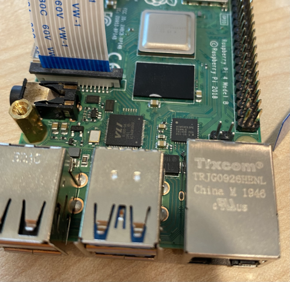

<!--
CO_OP_TRANSLATOR_METADATA:
{
  "original_hash": "c677667095f6133eee418c7e53615d05",
  "translation_date": "2025-08-27T20:13:13+00:00",
  "source_file": "4-manufacturing/lessons/2-check-fruit-from-device/pi-camera.md",
  "language_code": "th"
}
-->
# ถ่ายภาพ - Raspberry Pi

ในส่วนนี้ของบทเรียน คุณจะเพิ่มเซ็นเซอร์กล้องให้กับ Raspberry Pi และอ่านภาพจากกล้อง

## ฮาร์ดแวร์

Raspberry Pi ต้องการกล้อง

กล้องที่คุณจะใช้คือ [Raspberry Pi Camera Module](https://www.raspberrypi.org/products/camera-module-v2/) กล้องนี้ถูกออกแบบมาให้ใช้งานร่วมกับ Raspberry Pi และเชื่อมต่อผ่านตัวเชื่อมต่อเฉพาะบน Pi

> 💁 กล้องนี้ใช้ [Camera Serial Interface, โปรโตคอลจาก Mobile Industry Processor Interface Alliance](https://wikipedia.org/wiki/Camera_Serial_Interface) หรือที่รู้จักในชื่อ MIPI-CSI ซึ่งเป็นโปรโตคอลเฉพาะสำหรับการส่งภาพ

## เชื่อมต่อกล้อง

กล้องสามารถเชื่อมต่อกับ Raspberry Pi ได้โดยใช้สายริบบิ้น

### งาน - เชื่อมต่อกล้อง


1. ปิดการทำงานของ Pi

1. เชื่อมต่อสายริบบิ้นที่มาพร้อมกับกล้องเข้ากับตัวกล้อง โดยดึงคลิปพลาสติกสีดำในตัวจับออกเล็กน้อย จากนั้นเลื่อนสายเข้าไปในช่องเสียบ โดยให้ด้านสีน้ำเงินหันออกจากเลนส์ และด้านที่เป็นแถบโลหะหันเข้าหาเลนส์ เมื่อสายเข้าไปจนสุดแล้ว ให้ดันคลิปพลาสติกสีดำกลับเข้าที่

    คุณสามารถดูภาพเคลื่อนไหวที่แสดงวิธีเปิดคลิปและใส่สายได้ใน [เอกสารการเริ่มต้นใช้งาน Raspberry Pi Camera module](https://projects.raspberrypi.org/en/projects/getting-started-with-picamera/2)

    

1. ถอด Grove Base Hat ออกจาก Pi

1. สอดสายริบบิ้นผ่านช่องสำหรับกล้องใน Grove Base Hat โดยให้ด้านสีน้ำเงินของสายหันไปทางพอร์ตอนาล็อกที่มีป้ายกำกับ **A0**, **A1** เป็นต้น

    

1. ใส่สายริบบิ้นเข้ากับพอร์ตกล้องบน Pi อีกครั้ง โดยดึงคลิปพลาสติกสีดำขึ้น ใส่สายเข้าไป แล้วดันคลิปกลับเข้าที่ ด้านสีน้ำเงินของสายควรหันไปทางพอร์ต USB และ Ethernet

    

1. ติดตั้ง Grove Base Hat กลับเข้าที่

## เขียนโปรแกรมสำหรับกล้อง

ตอนนี้ Raspberry Pi สามารถเขียนโปรแกรมเพื่อใช้งานกล้องได้โดยใช้ไลบรารี Python [PiCamera](https://pypi.org/project/picamera/)

### งาน - เปิดใช้งานโหมดกล้องแบบเก่า

น่าเสียดายที่เมื่อมีการปล่อย Raspberry Pi OS Bullseye ซอฟต์แวร์กล้องที่มาพร้อมกับ OS ได้เปลี่ยนไป ทำให้ PiCamera ไม่สามารถใช้งานได้โดยค่าเริ่มต้น ขณะนี้มีการพัฒนาไลบรารีใหม่ชื่อ PiCamera2 แต่ยังไม่พร้อมใช้งาน

ในตอนนี้ คุณสามารถตั้งค่า Pi ให้เข้าสู่โหมดกล้องแบบเก่าเพื่อให้ PiCamera ใช้งานได้ พอร์ตกล้องยังถูกปิดใช้งานโดยค่าเริ่มต้น แต่การเปิดใช้งานซอฟต์แวร์กล้องแบบเก่าจะเปิดพอร์ตกล้องโดยอัตโนมัติ

1. เปิด Pi และรอให้บูตเสร็จ

1. เปิด VS Code โดยตรงบน Pi หรือเชื่อมต่อผ่าน Remote SSH extension

1. รันคำสั่งต่อไปนี้ในเทอร์มินัล:

    ```sh
    sudo raspi-config nonint do_legacy 0
    sudo reboot
    ```

    คำสั่งนี้จะเปิดการตั้งค่าเพื่อเปิดใช้งานซอฟต์แวร์กล้องแบบเก่า จากนั้นรีบูต Pi เพื่อให้การตั้งค่ามีผล

1. รอให้ Pi รีบูต จากนั้นเปิด VS Code อีกครั้ง

### งาน - เขียนโปรแกรมสำหรับกล้อง

เขียนโปรแกรมสำหรับอุปกรณ์

1. จากเทอร์มินัล สร้างโฟลเดอร์ใหม่ในไดเรกทอรีบ้านของผู้ใช้ `pi` ชื่อ `fruit-quality-detector` และสร้างไฟล์ในโฟลเดอร์นี้ชื่อ `app.py`

1. เปิดโฟลเดอร์นี้ใน VS Code

1. เพื่อโต้ตอบกับกล้อง คุณสามารถใช้ไลบรารี Python PiCamera ติดตั้งแพ็กเกจ Pip สำหรับไลบรารีนี้ด้วยคำสั่งต่อไปนี้:

    ```sh
    pip3 install picamera
    ```

1. เพิ่มโค้ดต่อไปนี้ในไฟล์ `app.py` ของคุณ:

    ```python
    import io
    import time
    from picamera import PiCamera
    ```

    โค้ดนี้นำเข้าไลบรารีที่จำเป็น รวมถึงไลบรารี `PiCamera`

1. เพิ่มโค้ดต่อไปนี้ด้านล่างเพื่อเริ่มต้นกล้อง:

    ```python
    camera = PiCamera()
    camera.resolution = (640, 480)
    camera.rotation = 0
    
    time.sleep(2)
    ```

    โค้ดนี้สร้างออบเจ็กต์ PiCamera และตั้งค่าความละเอียดเป็น 640x480 แม้ว่าจะรองรับความละเอียดที่สูงกว่า (สูงสุด 3280x2464) แต่ตัวจำแนกภาพทำงานกับภาพที่มีขนาดเล็กกว่ามาก (227x227) ดังนั้นจึงไม่จำเป็นต้องถ่ายภาพที่มีขนาดใหญ่กว่า

    บรรทัด `camera.rotation = 0` ตั้งค่าการหมุนของภาพ สายริบบิ้นจะเข้ามาที่ด้านล่างของกล้อง แต่หากกล้องของคุณถูกหมุนเพื่อให้ชี้ไปยังวัตถุที่คุณต้องการจำแนกได้ง่ายขึ้น คุณสามารถเปลี่ยนบรรทัดนี้เป็นจำนวนองศาที่ต้องการหมุน

    

    ตัวอย่างเช่น หากคุณแขวนสายริบบิ้นไว้ด้านบนของกล้อง ให้ตั้งค่าการหมุนเป็น 180:

    ```python
    camera.rotation = 180
    ```

    กล้องต้องใช้เวลาสองสามวินาทีในการเริ่มทำงาน ดังนั้นจึงมี `time.sleep(2)`

1. เพิ่มโค้ดต่อไปนี้ด้านล่างเพื่อถ่ายภาพในรูปแบบข้อมูลไบนารี:

    ```python
    image = io.BytesIO()
    camera.capture(image, 'jpeg')
    image.seek(0)
    ```

    โค้ดนี้สร้างออบเจ็กต์ `BytesIO` เพื่อเก็บข้อมูลไบนารี ภาพจะถูกอ่านจากกล้องในรูปแบบไฟล์ JPEG และเก็บไว้ในออบเจ็กต์นี้ ออบเจ็กต์นี้มีตัวชี้ตำแหน่งเพื่อบอกว่าขณะนี้อยู่ที่ตำแหน่งใดในข้อมูล ดังนั้นบรรทัด `image.seek(0)` จะย้ายตำแหน่งนี้กลับไปที่จุดเริ่มต้นเพื่อให้สามารถอ่านข้อมูลทั้งหมดได้ในภายหลัง

1. ด้านล่างนี้ เพิ่มโค้ดต่อไปนี้เพื่อบันทึกภาพลงในไฟล์:

    ```python
    with open('image.jpg', 'wb') as image_file:
        image_file.write(image.read())
    ```

    โค้ดนี้เปิดไฟล์ชื่อ `image.jpg` เพื่อเขียน จากนั้นอ่านข้อมูลทั้งหมดจากออบเจ็กต์ `BytesIO` และเขียนลงในไฟล์

    > 💁 คุณสามารถถ่ายภาพโดยตรงไปยังไฟล์แทนออบเจ็กต์ `BytesIO` ได้โดยการส่งชื่อไฟล์ไปยังคำสั่ง `camera.capture` เหตุผลที่ใช้ `BytesIO` คือในบทเรียนถัดไป คุณจะสามารถส่งภาพไปยังตัวจำแนกภาพได้

1. ชี้กล้องไปที่บางสิ่งและรันโค้ดนี้

1. ภาพจะถูกถ่ายและบันทึกเป็น `image.jpg` ในโฟลเดอร์ปัจจุบัน คุณจะเห็นไฟล์นี้ในตัวสำรวจของ VS Code เลือกไฟล์เพื่อดูภาพ หากภาพต้องการการหมุน ให้ปรับบรรทัด `camera.rotation = 0` ตามความเหมาะสมและถ่ายภาพใหม่

> 💁 คุณสามารถหาโค้ดนี้ได้ในโฟลเดอร์ [code-camera/pi](../../../../../4-manufacturing/lessons/2-check-fruit-from-device/code-camera/pi)

😀 โปรแกรมกล้องของคุณสำเร็จแล้ว!

---

**ข้อจำกัดความรับผิดชอบ**:  
เอกสารนี้ได้รับการแปลโดยใช้บริการแปลภาษา AI [Co-op Translator](https://github.com/Azure/co-op-translator) แม้ว่าเราจะพยายามให้การแปลมีความถูกต้องมากที่สุด แต่โปรดทราบว่าการแปลอัตโนมัติอาจมีข้อผิดพลาดหรือความไม่ถูกต้อง เอกสารต้นฉบับในภาษาดั้งเดิมควรถือเป็นแหล่งข้อมูลที่เชื่อถือได้ สำหรับข้อมูลที่สำคัญ ขอแนะนำให้ใช้บริการแปลภาษามืออาชีพ เราไม่รับผิดชอบต่อความเข้าใจผิดหรือการตีความผิดที่เกิดจากการใช้การแปลนี้