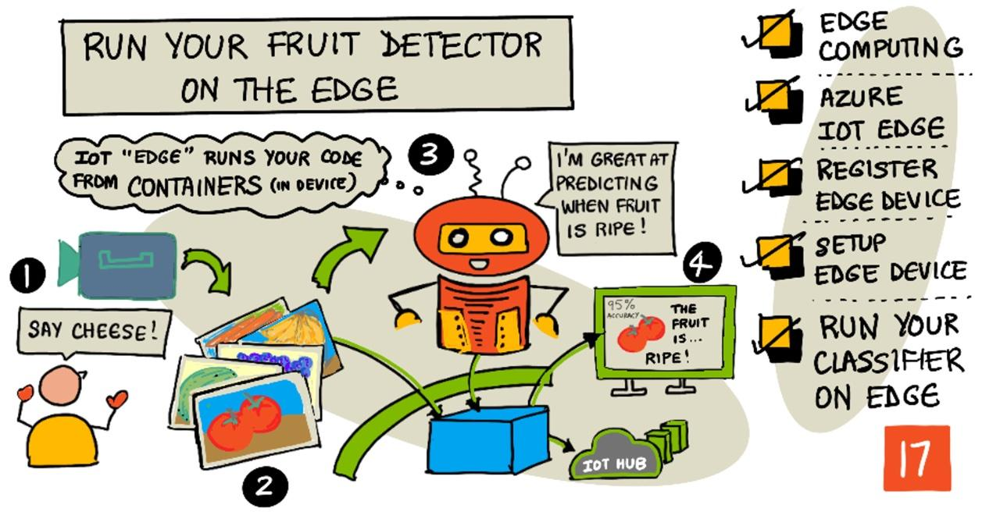

<!--
CO_OP_TRANSLATOR_METADATA:
{
  "original_hash": "2625af24587465c5547ae33d6cc000a5",
  "translation_date": "2025-08-27T20:08:24+00:00",
  "source_file": "4-manufacturing/lessons/3-run-fruit-detector-edge/README.md",
  "language_code": "th"
}
-->
## เรียกใช้ตัวตรวจจับผลไม้ของคุณบนอุปกรณ์ Edge



> สเก็ตโน้ตโดย [Nitya Narasimhan](https://github.com/nitya) คลิกที่ภาพเพื่อดูเวอร์ชันขนาดใหญ่ขึ้น

วิดีโอนี้ให้ภาพรวมเกี่ยวกับการเรียกใช้ตัวจำแนกรูปภาพบนอุปกรณ์ IoT ซึ่งเป็นหัวข้อที่ครอบคลุมในบทเรียนนี้

[](https://www.youtube.com/watch?v=_K5fqGLO8us)

## แบบทดสอบก่อนเรียน

[แบบทดสอบก่อนเรียน](https://black-meadow-040d15503.1.azurestaticapps.net/quiz/33)

## บทนำ

ในบทเรียนที่ผ่านมา คุณได้ใช้ตัวจำแนกรูปภาพของคุณเพื่อจำแนกผลไม้สุกและไม่สุก โดยส่งภาพที่ถ่ายจากกล้องบนอุปกรณ์ IoT ของคุณผ่านอินเทอร์เน็ตไปยังบริการคลาวด์ การดำเนินการนี้ใช้เวลา มีค่าใช้จ่าย และขึ้นอยู่กับประเภทของข้อมูลรูปภาพที่คุณใช้ อาจมีผลกระทบต่อความเป็นส่วนตัว

ในบทเรียนนี้ คุณจะได้เรียนรู้วิธีการเรียกใช้โมเดลการเรียนรู้ของเครื่อง (ML) บนอุปกรณ์ Edge ซึ่งเป็นอุปกรณ์ IoT ที่ทำงานบนเครือข่ายของคุณเองแทนที่จะอยู่บนคลาวด์ คุณจะได้เรียนรู้ถึงข้อดีและข้อเสียของการประมวลผลบน Edge เทียบกับการประมวลผลบนคลาวด์ วิธีการปรับใช้โมเดล AI ของคุณบน Edge และวิธีการเข้าถึงโมเดลจากอุปกรณ์ IoT ของคุณ

ในบทเรียนนี้เราจะครอบคลุม:

* [การประมวลผลบน Edge](../../../../../4-manufacturing/lessons/3-run-fruit-detector-edge)
* [Azure IoT Edge](../../../../../4-manufacturing/lessons/3-run-fruit-detector-edge)
* [การลงทะเบียนอุปกรณ์ IoT Edge](../../../../../4-manufacturing/lessons/3-run-fruit-detector-edge)
* [การตั้งค่าอุปกรณ์ IoT Edge](../../../../../4-manufacturing/lessons/3-run-fruit-detector-edge)
* [การส่งออกโมเดลของคุณ](../../../../../4-manufacturing/lessons/3-run-fruit-detector-edge)
* [การเตรียมคอนเทนเนอร์สำหรับการปรับใช้](../../../../../4-manufacturing/lessons/3-run-fruit-detector-edge)
* [การปรับใช้คอนเทนเนอร์ของคุณ](../../../../../4-manufacturing/lessons/3-run-fruit-detector-edge)
* [การใช้งานอุปกรณ์ IoT Edge ของคุณ](../../../../../4-manufacturing/lessons/3-run-fruit-detector-edge)

## การประมวลผลบน Edge

การประมวลผลบน Edge หมายถึงการมีคอมพิวเตอร์ที่ประมวลผลข้อมูล IoT ใกล้กับจุดที่ข้อมูลถูกสร้างขึ้นมากที่สุด แทนที่จะประมวลผลในคลาวด์ การประมวลผลจะถูกย้ายไปยัง Edge ของคลาวด์ ซึ่งก็คือเครือข่ายภายในของคุณ


ในบทเรียนที่ผ่านมา คุณมีอุปกรณ์ที่รวบรวมข้อมูลและส่งข้อมูลไปยังคลาวด์เพื่อวิเคราะห์ โดยใช้ฟังก์ชันแบบไร้เซิร์ฟเวอร์หรือโมเดล AI ในคลาวด์


การประมวลผลบน Edge เกี่ยวข้องกับการย้ายบริการบางส่วนออกจากคลาวด์และไปยังคอมพิวเตอร์ที่ทำงานบนเครือข่ายเดียวกับอุปกรณ์ IoT โดยจะสื่อสารกับคลาวด์เฉพาะเมื่อจำเป็น ตัวอย่างเช่น คุณสามารถเรียกใช้โมเดล AI บนอุปกรณ์ Edge เพื่อวิเคราะห์ความสุกของผลไม้ และส่งเฉพาะข้อมูลวิเคราะห์กลับไปยังคลาวด์ เช่น จำนวนผลไม้สุกเทียบกับผลไม้ที่ยังไม่สุก

✅ ลองคิดดูเกี่ยวกับแอปพลิเคชัน IoT ที่คุณสร้างมาจนถึงตอนนี้ ส่วนใดบ้างที่สามารถย้ายไปยัง Edge ได้

### ข้อดี

ข้อดีของการประมวลผลบน Edge ได้แก่:

1. **ความเร็ว** - การประมวลผลบน Edge เหมาะสำหรับข้อมูลที่ต้องการการตอบสนองอย่างรวดเร็ว เนื่องจากการดำเนินการเกิดขึ้นบนเครือข่ายเดียวกับอุปกรณ์ แทนที่จะต้องเรียกใช้งานผ่านอินเทอร์เน็ต สิ่งนี้ช่วยเพิ่มความเร็วได้มากขึ้น เนื่องจากเครือข่ายภายในสามารถทำงานได้เร็วกว่าอินเทอร์เน็ตอย่างมาก และข้อมูลเดินทางในระยะทางที่สั้นกว่า

    > 💁 แม้ว่าสายเคเบิลใยแก้วนำแสงจะถูกใช้สำหรับการเชื่อมต่ออินเทอร์เน็ตที่ช่วยให้ข้อมูลเดินทางด้วยความเร็วแสง แต่ข้อมูลยังคงใช้เวลาในการเดินทางรอบโลกไปยังผู้ให้บริการคลาวด์ ตัวอย่างเช่น หากคุณส่งข้อมูลจากยุโรปไปยังบริการคลาวด์ในสหรัฐอเมริกา ข้อมูลจะใช้เวลาอย่างน้อย 28 มิลลิวินาทีในการข้ามมหาสมุทรแอตแลนติกในสายเคเบิลใยแก้วนำแสง และยังไม่รวมเวลาที่ใช้ในการส่งข้อมูลไปยังสายเคเบิลแอตแลนติก การแปลงสัญญาณไฟฟ้าเป็นแสงและกลับมาอีกครั้ง รวมถึงการส่งข้อมูลจากสายเคเบิลไปยังผู้ให้บริการคลาวด์

    การประมวลผลบน Edge ยังลดความต้องการการใช้งานเครือข่าย ลดความเสี่ยงที่ข้อมูลของคุณจะช้าลงเนื่องจากความแออัดของแบนด์วิดท์อินเทอร์เน็ตที่มีจำกัด

1. **การเข้าถึงในพื้นที่ห่างไกล** - การประมวลผลบน Edge ทำงานได้แม้ในกรณีที่การเชื่อมต่อมีจำกัดหรือไม่มีเลย หรือเมื่อการเชื่อมต่อมีค่าใช้จ่ายสูงเกินไปที่จะใช้งานอย่างต่อเนื่อง ตัวอย่างเช่น ในพื้นที่ที่เกิดภัยพิบัติทางมนุษยธรรมที่โครงสร้างพื้นฐานมีจำกัด หรือในประเทศกำลังพัฒนา

1. **ลดค่าใช้จ่าย** - การรวบรวมข้อมูล การจัดเก็บ การวิเคราะห์ และการกระตุ้นการดำเนินการบนอุปกรณ์ Edge ช่วยลดการใช้งานบริการคลาวด์ ซึ่งสามารถลดค่าใช้จ่ายโดยรวมของแอปพลิเคชัน IoT ของคุณได้ มีการเพิ่มขึ้นของอุปกรณ์ที่ออกแบบมาสำหรับการประมวลผลบน Edge เช่น บอร์ดเร่งความเร็ว AI อย่าง [Jetson Nano จาก NVIDIA](https://developer.nvidia.com/embedded/jetson-nano-developer-kit) ซึ่งสามารถเรียกใช้การประมวลผล AI โดยใช้ฮาร์ดแวร์ GPU บนอุปกรณ์ที่มีราคาต่ำกว่า 100 ดอลลาร์สหรัฐ

1. **ความเป็นส่วนตัวและความปลอดภัย** - ด้วยการประมวลผลบน Edge ข้อมูลจะยังคงอยู่ในเครือข่ายของคุณและไม่ถูกอัปโหลดไปยังคลาวด์ สิ่งนี้มักเป็นที่ต้องการสำหรับข้อมูลที่ละเอียดอ่อนและข้อมูลที่สามารถระบุตัวบุคคลได้ โดยเฉพาะอย่างยิ่งเพราะข้อมูลไม่จำเป็นต้องถูกจัดเก็บหลังจากที่ได้รับการวิเคราะห์แล้ว ซึ่งช่วยลดความเสี่ยงของการรั่วไหลของข้อมูลอย่างมาก ตัวอย่างเช่น ข้อมูลทางการแพทย์และภาพจากกล้องวงจรปิด

1. **การจัดการอุปกรณ์ที่ไม่ปลอดภัย** - หากคุณมีอุปกรณ์ที่มีช่องโหว่ด้านความปลอดภัยที่คุณไม่ต้องการเชื่อมต่อโดยตรงกับเครือข่ายหรืออินเทอร์เน็ต คุณสามารถเชื่อมต่ออุปกรณ์เหล่านี้กับเครือข่ายแยกต่างหากที่เชื่อมต่อกับอุปกรณ์ IoT Edge Gateway อุปกรณ์ Edge นี้สามารถเชื่อมต่อกับเครือข่ายที่กว้างขึ้นหรืออินเทอร์เน็ต และจัดการการไหลของข้อมูลไปมา

1. **การสนับสนุนอุปกรณ์ที่ไม่เข้ากัน** - หากคุณมีอุปกรณ์ที่ไม่สามารถเชื่อมต่อกับ IoT Hub ได้ เช่น อุปกรณ์ที่สามารถเชื่อมต่อได้เฉพาะผ่าน HTTP หรืออุปกรณ์ที่มีเพียง Bluetooth คุณสามารถใช้อุปกรณ์ IoT Edge เป็น Gateway เพื่อส่งต่อข้อความไปยัง IoT Hub

✅ ทำการค้นคว้า: มีข้อดีอื่น ๆ อะไรบ้างที่อาจเกิดขึ้นจากการประมวลผลบน Edge?

### ข้อเสีย

ข้อเสียของการประมวลผลบน Edge ซึ่งอาจทำให้การประมวลผลบนคลาวด์เป็นตัวเลือกที่ดีกว่า:

1. **การปรับขนาดและความยืดหยุ่น** - การประมวลผลบนคลาวด์สามารถปรับเปลี่ยนตามความต้องการของเครือข่ายและข้อมูลได้แบบเรียลไทม์โดยการเพิ่มหรือลดเซิร์ฟเวอร์และทรัพยากรอื่น ๆ การเพิ่มคอมพิวเตอร์ Edge ต้องเพิ่มอุปกรณ์ด้วยตนเอง

1. **ความน่าเชื่อถือและความยืดหยุ่น** - การประมวลผลบนคลาวด์มีเซิร์ฟเวอร์หลายตัวในหลายตำแหน่งเพื่อความซ้ำซ้อนและการกู้คืนจากภัยพิบัติ การมีระดับความซ้ำซ้อนเดียวกันบน Edge ต้องใช้การลงทุนจำนวนมากและการกำหนดค่าที่ซับซ้อน

1. **การบำรุงรักษา** - ผู้ให้บริการคลาวด์ให้บริการบำรุงรักษาระบบและการอัปเดต

✅ ทำการค้นคว้า: มีข้อเสียอื่น ๆ อะไรบ้างที่อาจเกิดขึ้นจากการประมวลผลบน Edge?

ข้อเสียเหล่านี้เป็นสิ่งที่ตรงข้ามกับข้อดีของการใช้คลาวด์ - คุณต้องสร้างและจัดการอุปกรณ์เหล่านี้ด้วยตัวเอง แทนที่จะพึ่งพาความเชี่ยวชาญและขนาดของผู้ให้บริการคลาวด์

ความเสี่ยงบางอย่างสามารถลดลงได้ด้วยธรรมชาติของการประมวลผลบน Edge ตัวอย่างเช่น หากคุณมีอุปกรณ์ Edge ที่ทำงานในโรงงานเพื่อรวบรวมข้อมูลจากเครื่องจักร คุณไม่จำเป็นต้องคิดถึงสถานการณ์การกู้คืนจากภัยพิบัติบางอย่าง หากไฟฟ้าในโรงงานดับ คุณไม่จำเป็นต้องมีอุปกรณ์ Edge สำรอง เนื่องจากเครื่องจักรที่สร้างข้อมูลที่อุปกรณ์ Edge ประมวลผลก็จะไม่มีพลังงานเช่นกัน

สำหรับระบบ IoT คุณมักจะต้องการผสมผสานระหว่างการประมวลผลบนคลาวด์และ Edge โดยใช้บริการแต่ละประเภทตามความต้องการของระบบ ลูกค้า และผู้ดูแลระบบ

## Azure IoT Edge


Azure IoT Edge เป็นบริการที่ช่วยให้คุณย้ายงานจากคลาวด์ไปยัง Edge คุณสามารถตั้งค่าอุปกรณ์ให้เป็นอุปกรณ์ Edge และปรับใช้โค้ดไปยังอุปกรณ์ Edge นั้นจากคลาวด์ได้ สิ่งนี้ช่วยให้คุณผสมผสานความสามารถของคลาวด์และ Edge

> 🎓 *Workloads* หมายถึงบริการใด ๆ ที่ทำงานบางอย่าง เช่น โมเดล AI แอปพลิเคชัน หรือฟังก์ชันแบบไร้เซิร์ฟเวอร์

ตัวอย่างเช่น คุณสามารถฝึกตัวจำแนกรูปภาพในคลาวด์ จากนั้นปรับใช้ไปยังอุปกรณ์ Edge จากคลาวด์ อุปกรณ์ IoT ของคุณจะส่งรูปภาพไปยังอุปกรณ์ Edge เพื่อการจำแนก แทนที่จะส่งรูปภาพผ่านอินเทอร์เน็ต หากคุณต้องการปรับใช้เวอร์ชันใหม่ของโมเดล คุณสามารถฝึกในคลาวด์และใช้ IoT Edge เพื่ออัปเดตโมเดลบนอุปกรณ์ Edge เป็นเวอร์ชันใหม่

> 🎓 ซอฟต์แวร์ที่ปรับใช้กับ IoT Edge เรียกว่า *โมดูล* โดยค่าเริ่มต้น IoT Edge จะเรียกใช้โมดูลที่สื่อสารกับ IoT Hub เช่น โมดูล `edgeAgent` และ `edgeHub` เมื่อคุณปรับใช้ตัวจำแนกรูปภาพ สิ่งนี้จะถูกปรับใช้เป็นโมดูลเพิ่มเติม

IoT Edge ถูกรวมเข้ากับ IoT Hub ดังนั้นคุณสามารถจัดการอุปกรณ์ Edge โดยใช้บริการเดียวกับที่คุณใช้จัดการอุปกรณ์ IoT ด้วยระดับความปลอดภัยเดียวกัน

IoT Edge เรียกใช้โค้ดจาก *คอนเทนเนอร์* - แอปพลิเคชันที่บรรจุในตัวเองซึ่งทำงานแยกจากแอปพลิเคชันอื่น ๆ บนคอมพิวเตอร์ของคุณ เมื่อคุณเรียกใช้คอนเทนเนอร์ มันจะทำงานเหมือนคอมพิวเตอร์แยกต่างหากที่ทำงานภายในคอมพิวเตอร์ของคุณ โดยมีซอฟต์แวร์ บริการ และแอปพลิเคชันของตัวเอง คอนเทนเนอร์ส่วนใหญ่ไม่สามารถเข้าถึงสิ่งใดบนคอมพิวเตอร์ของคุณได้ เว้นแต่คุณจะเลือกแชร์สิ่งต่าง ๆ เช่น โฟลเดอร์กับคอนเทนเนอร์ คอนเทนเนอร์จะเปิดเผยบริการผ่านพอร์ตที่เปิดให้คุณเชื่อมต่อหรือเปิดเผยไปยังเครือข่ายของคุณ


ตัวอย่างเช่น คุณสามารถมีคอนเทนเนอร์ที่มีเว็บไซต์ที่ทำงานบนพอร์ต 80 ซึ่งเป็นพอร์ต HTTP เริ่มต้น และคุณสามารถเปิดเผยจากคอมพิวเตอร์ของคุณบนพอร์ต 80 ได้เช่นกัน

✅ ทำการค้นคว้า: อ่านเพิ่มเติมเกี่ยวกับคอนเทนเนอร์และบริการ เช่น Docker หรือ Moby

คุณสามารถใช้ Custom Vision เพื่อดาวน์โหลดตัวจำแนกรูปภาพและปรับใช้เป็นคอนเทนเนอร์ โดยสามารถเรียกใช้โดยตรงบนอุปกรณ์หรือปรับใช้ผ่าน IoT Edge เมื่อคอนเทนเนอร์ทำงานแล้ว คุณสามารถเข้าถึงได้โดยใช้ REST API เดียวกับเวอร์ชันคลาวด์ แต่เปลี่ยนจุดสิ้นสุดไปยังอุปกรณ์ Edge ที่เรียกใช้คอนเทนเนอร์

## การลงทะเบียนอุปกรณ์ IoT Edge

ในการใช้อุปกรณ์ IoT Edge จำเป็นต้องลงทะเบียนใน IoT Hub

### งาน - ลงทะเบียนอุปกรณ์ IoT Edge

1. สร้าง IoT Hub ในกลุ่มทรัพยากร `fruit-quality-detector` ตั้งชื่อให้มีความเฉพาะเจาะจงโดยใช้ชื่อที่เกี่ยวข้องกับ `fruit-quality-detector`

1. ลงทะเบียนอุปกรณ์ IoT Edge ชื่อ `fruit-quality-detector-edge` ใน IoT Hub ของคุณ คำสั่งในการทำเช่นนี้คล้ายกับคำสั่งที่ใช้ในการลงทะเบียนอุปกรณ์ที่ไม่ใช่ Edge ยกเว้นว่าคุณต้องเพิ่มแฟล็ก `--edge-enabled`

    ```sh
    az iot hub device-identity create --edge-enabled \
                                      --device-id fruit-quality-detector-edge \
                                      --hub-name <hub_name>
    ```

    แทนที่ `<hub_name>` ด้วยชื่อ IoT Hub ของคุณ

1. รับสตริงการเชื่อมต่อสำหรับอุปกรณ์ของคุณโดยใช้คำสั่งต่อไปนี้:

    ```sh
    az iot hub device-identity connection-string show --device-id fruit-quality-detector-edge \
                                                      --output table \
                                                      --hub-name <hub_name>
    ```

    แทนที่ `<hub_name>` ด้วยชื่อ IoT Hub ของคุณ

    คัดลอกสตริงการเชื่อมต่อที่แสดงในผลลัพธ์

## การตั้งค่าอุปกรณ์ IoT Edge

เมื่อคุณสร้างการลงทะเบียนอุปกรณ์ Edge ใน IoT Hub แล้ว คุณสามารถตั้งค่าอุปกรณ์ Edge ได้

### งาน - ติดตั้งและเริ่มต้น IoT Edge Runtime

**IoT Edge runtime รองรับเฉพาะคอนเทนเนอร์ Linux เท่านั้น** สามารถทำงานบน Linux หรือบน Windows โดยใช้ Virtual Machines ของ Linux

* หากคุณใช้งาน Raspberry Pi เป็นอุปกรณ์ IoT ของคุณ อุปกรณ์นี้จะใช้ Linux เวอร์ชันที่รองรับและสามารถโฮสต์ IoT Edge runtime ได้ ทำตาม [คู่มือการติดตั้ง Azure IoT Edge สำหรับ Linux บน Microsoft Docs](https://docs.microsoft.com/azure/iot-edge/how-to-install-iot-edge?WT.mc_id=academic-17441-jabenn) เพื่อทำการติดตั้ง IoT Edge และตั้งค่าสตริงการเชื่อมต่อ

    > 💁 จำไว้ว่า Raspberry Pi OS เป็นเวอร์ชันหนึ่งของ Debian Linux

* หากคุณไม่ได้ใช้ Raspberry Pi แต่มีคอมพิวเตอร์ Linux คุณสามารถเรียกใช้ IoT Edge runtime ได้ ทำตาม [คู่มือการติดตั้ง Azure IoT Edge สำหรับ Linux บน Microsoft Docs](https://docs.microsoft.com/azure/iot-edge/how-to-install-iot-edge?WT.mc_id=academic-17441-jabenn) เพื่อทำการติดตั้ง IoT Edge และตั้งค่าสตริงการเชื่อมต่อ

* หากคุณใช้ Windows คุณสามารถติดตั้ง IoT Edge runtime ใน Linux Virtual Machine โดยทำตาม [ส่วนการติดตั้งและเริ่มต้น IoT Edge runtime ใน Quickstart การปรับใช้โมดูล IoT Edge ครั้งแรกบนอุปกรณ์ Windows บน Microsoft Docs](https://docs.microsoft.com/azure/iot-edge/quickstart?WT.mc_id=academic-17441-jabenn#install-and-start-the-iot-edge-runtime) คุณสามารถหยุดเมื่อถึงส่วน *Deploy a module*

* หากคุณใช้ macOS คุณสามารถสร้าง Virtual Machine (VM) ในคลาวด์เพื่อใช้งานเป็นอุปกรณ์ IoT Edge ของคุณได้ นี่คือคอมพิวเตอร์ที่คุณ
1. เปิดพอร์ทัล Custom Vision ที่ [CustomVision.ai](https://customvision.ai) และลงชื่อเข้าใช้หากยังไม่ได้เปิดใช้งาน จากนั้นเปิดโปรเจกต์ `fruit-quality-detector` ของคุณ

1. เลือกปุ่ม **Settings** (ไอคอน ⚙)

1. ในรายการ *Domains* ให้เลือก *Food (compact)*

1. ในส่วน *Export Capabilities* ตรวจสอบให้แน่ใจว่าได้เลือก *Basic platforms (Tensorflow, CoreML, ONNX, ...)*

1. ที่ด้านล่างของหน้าการตั้งค่า ให้เลือก **Save Changes**

1. ฝึกฝนโมเดลใหม่ด้วยปุ่ม **Train** โดยเลือก *Quick training*

### งาน - ส่งออกโมเดลของคุณ

เมื่อโมเดลได้รับการฝึกฝนแล้ว จะต้องส่งออกเป็นคอนเทนเนอร์

1. เลือกแท็บ **Performance** และค้นหา iteration ล่าสุดที่ได้รับการฝึกฝนโดยใช้ compact domain

1. เลือกปุ่ม **Export** ที่ด้านบน

1. เลือก **DockerFile** จากนั้นเลือกเวอร์ชันที่ตรงกับอุปกรณ์ edge ของคุณ:

    * หากคุณใช้งาน IoT Edge บนคอมพิวเตอร์ Linux, คอมพิวเตอร์ Windows หรือ Virtual Machine ให้เลือกเวอร์ชัน *Linux*
    * หากคุณใช้งาน IoT Edge บน Raspberry Pi ให้เลือกเวอร์ชัน *ARM (Raspberry Pi 3)*

    
> 🎓 Docker เป็นหนึ่งในเครื่องมือยอดนิยมสำหรับการจัดการคอนเทนเนอร์ และ DockerFile คือชุดคำสั่งสำหรับการตั้งค่าคอนเทนเนอร์

1. เลือก **Export** เพื่อให้ Custom Vision สร้างไฟล์ที่เกี่ยวข้อง จากนั้นเลือก **Download** เพื่อดาวน์โหลดไฟล์ในรูปแบบ zip

1. บันทึกไฟล์ลงในคอมพิวเตอร์ของคุณ จากนั้นแตกไฟล์ในโฟลเดอร์

## เตรียมคอนเทนเนอร์ของคุณสำหรับการใช้งาน


เมื่อคุณดาวน์โหลดโมเดลของคุณแล้ว จะต้องสร้างเป็นคอนเทนเนอร์และส่งไปยัง container registry - สถานที่ออนไลน์ที่คุณสามารถจัดเก็บคอนเทนเนอร์ได้ IoT Edge สามารถดาวน์โหลดคอนเทนเนอร์จาก registry และส่งไปยังอุปกรณ์ของคุณ


container registry ที่คุณจะใช้สำหรับบทเรียนนี้คือ Azure Container Registry ซึ่งไม่ใช่บริการฟรี ดังนั้นเพื่อประหยัดเงินให้แน่ใจว่าคุณ [ล้างโปรเจกต์ของคุณ](../../../clean-up.md) เมื่อคุณทำเสร็จแล้ว

> 💁 คุณสามารถดูค่าใช้จ่ายในการใช้ Azure Container Registry ได้ที่ [หน้าราคาของ Azure Container Registry](https://azure.microsoft.com/pricing/details/container-registry/?WT.mc_id=academic-17441-jabenn)

### งาน - ติดตั้ง Docker

ในการสร้างและใช้งานตัวจำแนกภาพ คุณอาจต้องติดตั้ง [Docker](https://www.docker.com/)

คุณจะต้องทำเช่นนี้ก็ต่อเมื่อคุณวางแผนที่จะสร้างคอนเทนเนอร์จากอุปกรณ์ที่แตกต่างจากอุปกรณ์ที่คุณติดตั้ง IoT Edge - เนื่องจากการติดตั้ง IoT Edge จะติดตั้ง Docker ให้คุณโดยอัตโนมัติ

1. หากคุณกำลังสร้างคอนเทนเนอร์ Docker บนอุปกรณ์ที่แตกต่างจากอุปกรณ์ IoT Edge ของคุณ ให้ทำตามคำแนะนำการติดตั้ง Docker บน [หน้าติดตั้ง Docker](https://www.docker.com/products/docker-desktop) เพื่อติดตั้ง Docker Desktop หรือ Docker engine และตรวจสอบให้แน่ใจว่า Docker ทำงานหลังการติดตั้ง

### งาน - สร้างทรัพยากร container registry

1. รันคำสั่งต่อไปนี้จาก Terminal หรือ command prompt ของคุณเพื่อสร้างทรัพยากร Azure Container Registry:

    ```sh
    az acr create --resource-group fruit-quality-detector \
                  --sku Basic \
                  --name <Container registry name>
    ```

    แทนที่ `<Container registry name>` ด้วยชื่อที่ไม่ซ้ำสำหรับ container registry ของคุณ โดยใช้เฉพาะตัวอักษรและตัวเลข ตั้งชื่อโดยอิงจาก `fruitqualitydetector` ชื่อนี้จะกลายเป็นส่วนหนึ่งของ URL ในการเข้าถึง container registry ดังนั้นต้องไม่ซ้ำกันทั่วโลก

1. ลงชื่อเข้าใช้ Azure Container Registry ด้วยคำสั่งต่อไปนี้:

    ```sh
    az acr login --name <Container registry name>
    ```

    แทนที่ `<Container registry name>` ด้วยชื่อที่คุณใช้สำหรับ container registry ของคุณ

1. ตั้งค่า container registry เป็นโหมดผู้ดูแลระบบเพื่อให้คุณสามารถสร้างรหัสผ่านด้วยคำสั่งต่อไปนี้:

    ```sh
    az acr update --admin-enabled true \
                 --name <Container registry name>
    ```

    แทนที่ `<Container registry name>` ด้วยชื่อที่คุณใช้สำหรับ container registry ของคุณ

1. สร้างรหัสผ่านสำหรับ container registry ของคุณด้วยคำสั่งต่อไปนี้:

    ```sh
     az acr credential renew --password-name password \
                             --output table \
                             --name <Container registry name>
    ```

    แทนที่ `<Container registry name>` ด้วยชื่อที่คุณใช้สำหรับ container registry ของคุณ

    คัดลอกค่าของ `PASSWORD` เนื่องจากคุณจะต้องใช้ในภายหลัง

### งาน - สร้างคอนเทนเนอร์ของคุณ

สิ่งที่คุณดาวน์โหลดจาก Custom Vision คือ DockerFile ที่มีคำสั่งเกี่ยวกับวิธีการสร้างคอนเทนเนอร์ พร้อมกับโค้ดแอปพลิเคชันที่จะทำงานภายในคอนเทนเนอร์เพื่อโฮสต์โมเดล Custom Vision ของคุณ พร้อมกับ REST API เพื่อเรียกใช้งาน คุณสามารถใช้ Docker เพื่อสร้างคอนเทนเนอร์ที่มีแท็กจาก DockerFile และส่งไปยัง container registry ของคุณ

> 🎓 คอนเทนเนอร์จะได้รับแท็กที่กำหนดชื่อและเวอร์ชันสำหรับคอนเทนเนอร์ เมื่อคุณต้องการอัปเดตคอนเทนเนอร์ คุณสามารถสร้างด้วยแท็กเดียวกันแต่ใช้เวอร์ชันใหม่กว่า

1. เปิด terminal หรือ command prompt ของคุณและไปยังโมเดลที่แตกไฟล์ที่คุณดาวน์โหลดจาก Custom Vision

1. รันคำสั่งต่อไปนี้เพื่อสร้างและแท็กภาพ:

    ```sh
    docker build --platform <platform> -t <Container registry name>.azurecr.io/classifier:v1 .
    ```

    แทนที่ `<platform>` ด้วยแพลตฟอร์มที่คอนเทนเนอร์นี้จะทำงาน หากคุณใช้งาน IoT Edge บน Raspberry Pi ให้ตั้งค่านี้เป็น `linux/armhf` หากไม่ใช่ให้ตั้งเป็น `linux/amd64`

    > 💁 หากคุณรันคำสั่งนี้จากอุปกรณ์ที่คุณใช้งาน IoT Edge เช่น รันจาก Raspberry Pi คุณสามารถละ `--platform <platform>` ได้เนื่องจากค่าเริ่มต้นจะเป็นแพลตฟอร์มปัจจุบัน

    แทนที่ `<Container registry name>` ด้วยชื่อที่คุณใช้สำหรับ container registry ของคุณ

    > 💁 หากคุณใช้งาน Linux หรือ Raspberry Pi OS คุณอาจต้องใช้ `sudo` เพื่อรันคำสั่งนี้

    Docker จะสร้างภาพโดยกำหนดค่าซอฟต์แวร์ที่จำเป็นทั้งหมด ภาพจะถูกแท็กเป็น `classifier:v1`

    ```output
    ➜  d4ccc45da0bb478bad287128e1274c3c.DockerFile.Linux docker build --platform linux/amd64 -t  fruitqualitydetectorjimb.azurecr.io/classifier:v1 .
    [+] Building 102.4s (11/11) FINISHED
     => [internal] load build definition from Dockerfile
     => => transferring dockerfile: 131B
     => [internal] load .dockerignore
     => => transferring context: 2B
     => [internal] load metadata for docker.io/library/python:3.7-slim
     => [internal] load build context
     => => transferring context: 905B
     => [1/6] FROM docker.io/library/python:3.7-slim@sha256:b21b91c9618e951a8cbca5b696424fa5e820800a88b7e7afd66bba0441a764d6
     => => resolve docker.io/library/python:3.7-slim@sha256:b21b91c9618e951a8cbca5b696424fa5e820800a88b7e7afd66bba0441a764d6
     => => sha256:b4d181a07f8025e00e0cb28f1cc14613da2ce26450b80c54aea537fa93cf3bda 27.15MB / 27.15MB
     => => sha256:de8ecf497b753094723ccf9cea8a46076e7cb845f333df99a6f4f397c93c6ea9 2.77MB / 2.77MB
     => => sha256:707b80804672b7c5d8f21e37c8396f319151e1298d976186b4f3b76ead9f10c8 10.06MB / 10.06MB
     => => sha256:b21b91c9618e951a8cbca5b696424fa5e820800a88b7e7afd66bba0441a764d6 1.86kB / 1.86kB
     => => sha256:44073386687709c437586676b572ff45128ff1f1570153c2f727140d4a9accad 1.37kB / 1.37kB
     => => sha256:3d94f0f2ca798607808b771a7766f47ae62a26f820e871dd488baeccc69838d1 8.31kB / 8.31kB
     => => sha256:283715715396fd56d0e90355125fd4ec57b4f0773f306fcd5fa353b998beeb41 233B / 233B
     => => sha256:8353afd48f6b84c3603ea49d204bdcf2a1daada15f5d6cad9cc916e186610a9f 2.64MB / 2.64MB
     => => extracting sha256:b4d181a07f8025e00e0cb28f1cc14613da2ce26450b80c54aea537fa93cf3bda
     => => extracting sha256:de8ecf497b753094723ccf9cea8a46076e7cb845f333df99a6f4f397c93c6ea9
     => => extracting sha256:707b80804672b7c5d8f21e37c8396f319151e1298d976186b4f3b76ead9f10c8
     => => extracting sha256:283715715396fd56d0e90355125fd4ec57b4f0773f306fcd5fa353b998beeb41
     => => extracting sha256:8353afd48f6b84c3603ea49d204bdcf2a1daada15f5d6cad9cc916e186610a9f
     => [2/6] RUN pip install -U pip
     => [3/6] RUN pip install --no-cache-dir numpy~=1.17.5 tensorflow~=2.0.2 flask~=1.1.2 pillow~=7.2.0
     => [4/6] RUN pip install --no-cache-dir mscviplib==2.200731.16
     => [5/6] COPY app /app
     => [6/6] WORKDIR /app
     => exporting to image
     => => exporting layers
     => => writing image sha256:1846b6f134431f78507ba7c079358ed66d944c0e185ab53428276bd822400386
     => => naming to fruitqualitydetectorjimb.azurecr.io/classifier:v1
    ```

### งาน - ส่งคอนเทนเนอร์ของคุณไปยัง container registry

1. ใช้คำสั่งต่อไปนี้เพื่อส่งคอนเทนเนอร์ของคุณไปยัง container registry:

    ```sh
    docker push <Container registry name>.azurecr.io/classifier:v1
    ```

    แทนที่ `<Container registry name>` ด้วยชื่อที่คุณใช้สำหรับ container registry ของคุณ

    > 💁 หากคุณใช้งาน Linux คุณอาจต้องใช้ `sudo` เพื่อรันคำสั่งนี้

    คอนเทนเนอร์จะถูกส่งไปยัง container registry

    ```output
    ➜  d4ccc45da0bb478bad287128e1274c3c.DockerFile.Linux docker push fruitqualitydetectorjimb.azurecr.io/classifier:v1
    The push refers to repository [fruitqualitydetectorjimb.azurecr.io/classifier]
    5f70bf18a086: Pushed 
    8a1ba9294a22: Pushed 
    56cf27184a76: Pushed 
    b32154f3f5dd: Pushed 
    36103e9a3104: Pushed 
    e2abb3cacca0: Pushed 
    4213fd357bbe: Pushed 
    7ea163ba4dce: Pushed 
    537313a13d90: Pushed 
    764055ebc9a7: Pushed 
    v1: digest: sha256:ea7894652e610de83a5a9e429618e763b8904284253f4fa0c9f65f0df3a5ded8 size: 2423
    ```

1. เพื่อยืนยันการส่ง คุณสามารถแสดงรายการคอนเทนเนอร์ใน registry ของคุณด้วยคำสั่งต่อไปนี้:

    ```sh
    az acr repository list --output table \
                           --name <Container registry name> 
    ```

    แทนที่ `<Container registry name>` ด้วยชื่อที่คุณใช้สำหรับ container registry ของคุณ

    ```output
    ➜  d4ccc45da0bb478bad287128e1274c3c.DockerFile.Linux az acr repository list --name fruitqualitydetectorjimb --output table
    Result
    ----------
    classifier
    ```

    คุณจะเห็น classifier ของคุณในผลลัพธ์

## ใช้งานคอนเทนเนอร์ของคุณ

คอนเทนเนอร์ของคุณสามารถใช้งานบนอุปกรณ์ IoT Edge ได้แล้ว ในการใช้งานคุณต้องกำหนด deployment manifest - เอกสาร JSON ที่แสดงรายการโมดูลที่จะใช้งานบนอุปกรณ์ edge

### งาน - สร้าง deployment manifest

1. สร้างไฟล์ใหม่ชื่อ `deployment.json` ที่ใดก็ได้ในคอมพิวเตอร์ของคุณ

1. เพิ่มสิ่งต่อไปนี้ในไฟล์นี้:

    ```json
    {
        "content": {
            "modulesContent": {
                "$edgeAgent": {
                    "properties.desired": {
                        "schemaVersion": "1.1",
                        "runtime": {
                            "type": "docker",
                            "settings": {
                                "minDockerVersion": "v1.25",
                                "loggingOptions": "",
                                "registryCredentials": {
                                    "ClassifierRegistry": {
                                        "username": "<Container registry name>",
                                        "password": "<Container registry password>",
                                        "address": "<Container registry name>.azurecr.io"
                                      }
                                }
                            }
                        },
                        "systemModules": {
                            "edgeAgent": {
                                "type": "docker",
                                "settings": {
                                    "image": "mcr.microsoft.com/azureiotedge-agent:1.1",
                                    "createOptions": "{}"
                                }
                            },
                            "edgeHub": {
                                "type": "docker",
                                "status": "running",
                                "restartPolicy": "always",
                                "settings": {
                                    "image": "mcr.microsoft.com/azureiotedge-hub:1.1",
                                    "createOptions": "{\"HostConfig\":{\"PortBindings\":{\"5671/tcp\":[{\"HostPort\":\"5671\"}],\"8883/tcp\":[{\"HostPort\":\"8883\"}],\"443/tcp\":[{\"HostPort\":\"443\"}]}}}"
                                }
                            }
                        },
                        "modules": {
                            "ImageClassifier": {
                                "version": "1.0",
                                "type": "docker",
                                "status": "running",
                                "restartPolicy": "always",
                                "settings": {
                                    "image": "<Container registry name>.azurecr.io/classifier:v1",
                                    "createOptions": "{\"ExposedPorts\": {\"80/tcp\": {}},\"HostConfig\": {\"PortBindings\": {\"80/tcp\": [{\"HostPort\": \"80\"}]}}}"
                                }
                            }
                        }
                    }
                },
                "$edgeHub": {
                    "properties.desired": {
                        "schemaVersion": "1.1",
                        "routes": {
                            "upstream": "FROM /messages/* INTO $upstream"
                        },
                        "storeAndForwardConfiguration": {
                            "timeToLiveSecs": 7200
                        }
                    }
                }
            }
        }
    }
    ```

    > 💁 คุณสามารถหาไฟล์นี้ได้ในโฟลเดอร์ [code-deployment/deployment](../../../../../4-manufacturing/lessons/3-run-fruit-detector-edge/code-deployment/deployment)

    แทนที่ `<Container registry name>` ทั้งสามครั้งด้วยชื่อที่คุณใช้สำหรับ container registry ของคุณ หนึ่งในส่วน `ImageClassifier` และอีกสองในส่วน `registryCredentials`

    แทนที่ `<Container registry password>` ในส่วน `registryCredentials` ด้วยรหัสผ่าน container registry ของคุณ

1. จากโฟลเดอร์ที่มี deployment manifest ของคุณ รันคำสั่งต่อไปนี้:

    ```sh
    az iot edge set-modules --device-id fruit-quality-detector-edge \
                            --content deployment.json \
                            --hub-name <hub_name>
    ```

    แทนที่ `<hub_name>` ด้วยชื่อ IoT Hub ของคุณ

    โมดูล image classifier จะถูกใช้งานบนอุปกรณ์ edge ของคุณ

### งาน - ตรวจสอบว่า classifier กำลังทำงาน

1. เชื่อมต่อกับอุปกรณ์ IoT edge:

    * หากคุณใช้งาน Raspberry Pi เพื่อรัน IoT Edge ให้เชื่อมต่อผ่าน ssh จาก terminal ของคุณ หรือผ่าน session SSH ระยะไกลใน VS Code
    * หากคุณใช้งาน IoT Edge ในคอนเทนเนอร์ Linux บน Windows ให้ทำตามขั้นตอนใน [คู่มือการตรวจสอบการตั้งค่าที่สำเร็จ](https://docs.microsoft.com/azure/iot-edge/how-to-install-iot-edge-on-windows?WT.mc_id=academic-17441-jabenn&view=iotedge-2018-06&tabs=powershell#verify-successful-configuration) เพื่อเชื่อมต่อกับอุปกรณ์ IoT Edge
    * หากคุณใช้งาน IoT Edge บน virtual machine คุณสามารถ SSH เข้าไปในเครื่องโดยใช้ `adminUsername` และ `password` ที่คุณตั้งค่าเมื่อสร้าง VM และใช้ IP address หรือ DNS name:

        ```sh
        ssh <adminUsername>@<IP address>
        ```

        หรือ:

        ```sh
        ssh <adminUsername>@<DNS Name>
        ```

        ป้อนรหัสผ่านของคุณเมื่อได้รับการแจ้ง

1. เมื่อคุณเชื่อมต่อแล้ว ให้รันคำสั่งต่อไปนี้เพื่อดูรายการโมดูล IoT Edge:

    ```sh
    iotedge list
    ```

    > 💁 คุณอาจต้องรันคำสั่งนี้ด้วย `sudo`

    คุณจะเห็นโมดูลที่กำลังทำงาน:

    ```output
    jim@fruit-quality-detector-jimb:~$ iotedge list
    NAME             STATUS           DESCRIPTION      CONFIG
    ImageClassifier  running          Up 42 minutes    fruitqualitydetectorjimb.azurecr.io/classifier:v1
    edgeAgent        running          Up 42 minutes    mcr.microsoft.com/azureiotedge-agent:1.1
    edgeHub          running          Up 42 minutes    mcr.microsoft.com/azureiotedge-hub:1.1
    ```

1. ตรวจสอบ log ของโมดูล Image classifier ด้วยคำสั่งต่อไปนี้:

    ```sh
    iotedge logs ImageClassifier
    ```

    > 💁 คุณอาจต้องรันคำสั่งนี้ด้วย `sudo`

    ```output
    jim@fruit-quality-detector-jimb:~$ iotedge logs ImageClassifier
    2021-07-05 20:30:15.387144: I tensorflow/core/platform/cpu_feature_guard.cc:142] Your CPU supports instructions that this TensorFlow binary was not compiled to use: AVX2 FMA
    2021-07-05 20:30:15.392185: I tensorflow/core/platform/profile_utils/cpu_utils.cc:94] CPU Frequency: 2394450000 Hz
    2021-07-05 20:30:15.392712: I tensorflow/compiler/xla/service/service.cc:168] XLA service 0x55ed9ac83470 executing computations on platform Host. Devices:
    2021-07-05 20:30:15.392806: I tensorflow/compiler/xla/service/service.cc:175]   StreamExecutor device (0): Host, Default Version
    Loading model...Success!
    Loading labels...2 found. Success!
     * Serving Flask app "app" (lazy loading)
     * Environment: production
       WARNING: This is a development server. Do not use it in a production deployment.
       Use a production WSGI server instead.
     * Debug mode: off
     * Running on http://0.0.0.0:80/ (Press CTRL+C to quit)
    ```

### งาน - ทดสอบ image classifier

1. คุณสามารถใช้ CURL เพื่อทดสอบ image classifier โดยใช้ IP address หรือ host name ของคอมพิวเตอร์ที่กำลังรัน IoT Edge agent ค้นหา IP address:

    * หากคุณอยู่บนเครื่องเดียวกับที่ IoT Edge กำลังทำงาน คุณสามารถใช้ `localhost` เป็น host name
    * หากคุณใช้งาน VM คุณสามารถใช้ IP address หรือ DNS name ของ VM
    * มิฉะนั้นคุณสามารถหา IP address ของเครื่องที่กำลังรัน IoT Edge:
      * บน Windows 10 ให้ทำตาม [คู่มือการหา IP address](https://support.microsoft.com/windows/find-your-ip-address-f21a9bbc-c582-55cd-35e0-73431160a1b9?WT.mc_id=academic-17441-jabenn)
      * บน macOS ให้ทำตาม [วิธีการหา IP address บน Mac](https://www.hellotech.com/guide/for/how-to-find-ip-address-on-mac)
      * บน Linux ให้ทำตามส่วนการหา private IP address ใน [วิธีการหา IP address บน Linux](https://opensource.com/article/18/5/how-find-ip-address-linux)

1. คุณสามารถทดสอบคอนเทนเนอร์ด้วยไฟล์ในเครื่องโดยรันคำสั่ง curl ต่อไปนี้:

    ```sh
    curl --location \
         --request POST 'http://<IP address or name>/image' \
         --header 'Content-Type: image/png' \
         --data-binary '@<file_Name>' 
    ```

    แทนที่ `<IP address or name>` ด้วย IP address หรือ host name ของคอมพิวเตอร์ที่กำลังรัน IoT Edge แทนที่ `<file_Name>` ด้วยชื่อไฟล์ที่ต้องการทดสอบ

    คุณจะเห็นผลลัพธ์การทำนายใน output:

    ```output
    {
        "created": "2021-07-05T21:44:39.573181",
        "id": "",
        "iteration": "",
        "predictions": [
            {
                "boundingBox": null,
                "probability": 0.9995615482330322,
                "tagId": "",
                "tagName": "ripe"
            },
            {
                "boundingBox": null,
                "probability": 0.0004384400090202689,
                "tagId": "",
                "tagName": "unripe"
            }
        ],
        "project": ""
    }
    ```

    > 💁 ไม่จำเป็นต้องให้ prediction key ที่นี่ เนื่องจากไม่ได้ใช้ทรัพยากร Azure แต่ความปลอดภัยจะถูกกำหนดบนเครือข่ายภายในตามความต้องการด้านความปลอดภัยภายใน แทนที่จะพึ่งพา public endpoint และ API key

## ใช้อุปกรณ์ IoT Edge ของคุณ

ตอนนี้ Image Classifier ของคุณได้ถูกใช้งานบนอุปกรณ์ IoT Edge แล้ว คุณสามารถใช้งานจากอุปกรณ์ IoT ของคุณได้

### งาน - ใช้อุปกรณ์ IoT Edge ของคุณ

ทำตามคู่มือที่เกี่ยวข้องเพื่อจำแนกภาพโดยใช้ IoT Edge classifier:

* [Arduino - Wio Terminal](wio-terminal.md)
* [Single-board computer - Raspberry Pi/Virtual IoT device](single-board-computer.md)

### การฝึกโมเดลใหม่

หนึ่งในข้อเสียของการใช้งาน image classifiers บน IoT Edge คือมันไม่ได้เชื่อมต่อกับโปรเจกต์ Custom Vision ของคุณ หากคุณดูที่แท็บ **Predictions** ใน Custom Vision คุณจะไม่เห็นภาพที่ถูกจำแนกโดยใช้ classifier บน Edge

นี่เป็นพฤติกรรมที่คาดหวัง - ภาพไม่ได้ถูกส่งไปยัง cloud เพื่อการจำแนก ดังนั้นมันจะไม่ปรากฏใน cloud หนึ่งในข้อดีของการใช้งาน IoT Edge คือความเป็นส่วนตัว โดยมั่นใจว่าภาพจะไม่ออกจากเครือข่ายของคุณ อีกข้อดีคือการทำงานแบบออฟไลน์ โดยไม่ต้องพึ่งพาการอัปโหลดภาพเมื่ออุปกรณ์ไม่มีการเชื่อมต่ออินเทอร์เน็ต ข้อเสียคือการปรับปรุงโมเดลของคุณ - คุณจะต้องสร้างวิธีการจัดเก็บภาพที่สามารถจำแนกใหม่ด้วยตนเองเพื่อปรับปรุงและฝึกฝน image classifier ใหม่

✅ ลองคิดถึงวิธีการอัปโหลดภาพเพื่อฝึกฝน classifier ใหม่

---

## 🚀 ความท้าทาย

การรันโมเดล AI บนอุปกรณ์ edge อาจเร็วกว่าใน cloud - การส่งข้อมูลผ่านเครือข่ายสั้นกว่า แต่ก็อาจช้ากว่าเนื่องจากฮาร์ดแวร์ที่รันโมเดลอาจไม่ทรงพลังเท่ากับ cloud

ลองจับเวลาและเปรียบเทียบว่าการเรียกใช้งานอุปกรณ์ edge ของคุณเร็วหรือช้ากว่าการเรียกใช้งาน cloud? ลองคิดถึงเหตุผลที่อธิบายความแตกต่าง หรือไม่มีความแตกต่าง และค้นคว้าวิธีการรันโมเดล AI ให้เร็วขึ้นบน edge โดยใช้ฮาร์ดแวร์เฉพาะทาง

## แบบทดสอบหลังการบรรยาย

[แบบทดสอบหลังการบรรยาย](https://black-meadow-040d15503.1.azurestaticapps.net/quiz/34)

## ทบทวนและศึกษาด้วยตนเอง

* อ่านเพิ่มเติมเกี่ยวกับคอนเทนเนอร์ใน [หน้าการจำลองเสมือนระดับ OS บน Wikipedia](https://wikipedia.org/wiki/OS-level_virtualization)
* อ่านเพิ่มเติมเกี่ยวกับการประมวลผลที่ขอบเครือข่าย โดยเน้นว่าการใช้ 5G สามารถช่วยขยายการประมวลผลที่ขอบเครือข่ายได้อย่างไรใน [บทความ "การประมวลผลที่ขอบเครือข่ายคืออะไรและทำไมมันถึงสำคัญ?" บน NetworkWorld](https://www.networkworld.com/article/3224893/what-is-edge-computing-and-how-its-changing-the-network.html)
* เรียนรู้เพิ่มเติมเกี่ยวกับการใช้งานบริการ AI ใน IoT Edge โดยการรับชม [ตอน "เรียนรู้วิธีใช้ Azure IoT Edge บนบริการ AI ที่สร้างไว้ล่วงหน้าบน Edge เพื่อทำการตรวจจับภาษา" ใน Learn Live บน Microsoft Channel9](https://channel9.msdn.com/Shows/Learn-Live/Sharpen-Your-AI-Edge-Skills-Episode-4-Learn-How-to-Use-Azure-IoT-Edge-on-a-Pre-Built-AI-Service-on-t?WT.mc_id=academic-17441-jabenn)

## งานที่ได้รับมอบหมาย

[เรียกใช้บริการอื่น ๆ บน Edge](assignment.md)

---

**ข้อจำกัดความรับผิดชอบ**:  
เอกสารนี้ได้รับการแปลโดยใช้บริการแปลภาษา AI [Co-op Translator](https://github.com/Azure/co-op-translator) แม้ว่าเราจะพยายามให้การแปลมีความถูกต้อง แต่โปรดทราบว่าการแปลอัตโนมัติอาจมีข้อผิดพลาดหรือความไม่ถูกต้อง เอกสารต้นฉบับในภาษาดั้งเดิมควรถือเป็นแหล่งข้อมูลที่เชื่อถือได้ สำหรับข้อมูลที่สำคัญ ขอแนะนำให้ใช้บริการแปลภาษามืออาชีพ เราไม่รับผิดชอบต่อความเข้าใจผิดหรือการตีความผิดที่เกิดจากการใช้การแปลนี้