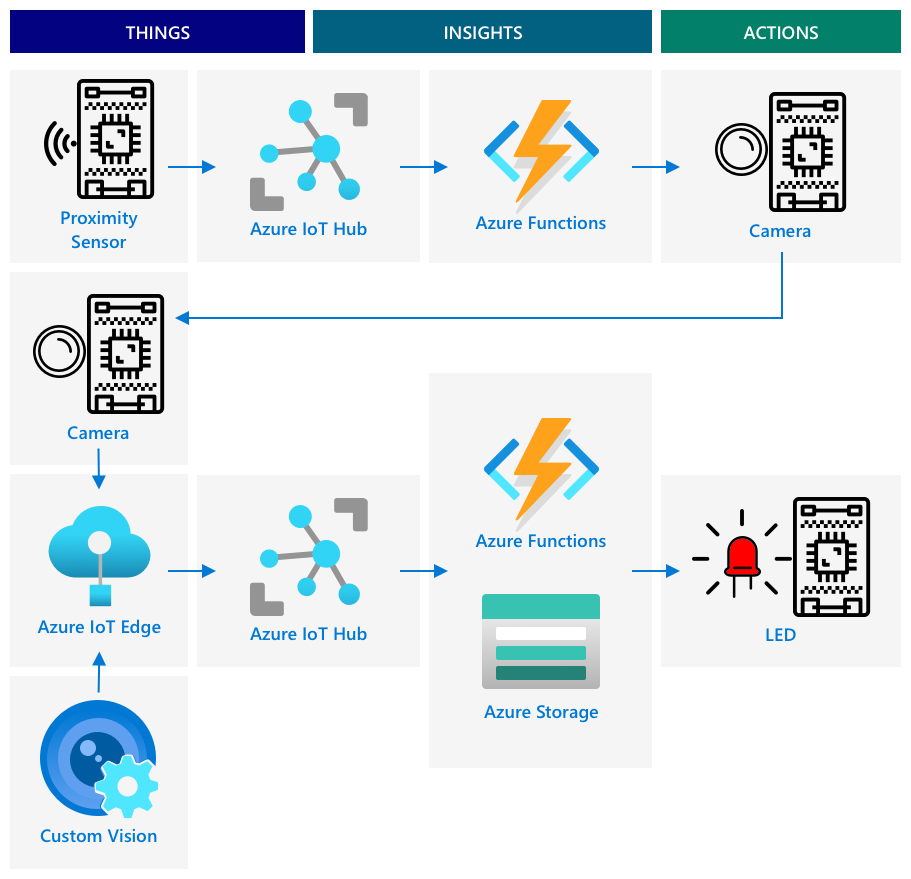

<!--
CO_OP_TRANSLATOR_METADATA:
{
  "original_hash": "f74f4ccb61f00e5f7e9f49c3ed416e36",
  "translation_date": "2025-08-27T20:01:52+00:00",
  "source_file": "4-manufacturing/lessons/4-trigger-fruit-detector/README.md",
  "language_code": "th"
}
-->
# เริ่มต้นการตรวจสอบคุณภาพผลไม้จากเซ็นเซอร์


> สเก็ตโน้ตโดย [Nitya Narasimhan](https://github.com/nitya) คลิกที่ภาพเพื่อดูเวอร์ชันขนาดใหญ่

## แบบทดสอบก่อนเริ่มบทเรียน

[แบบทดสอบก่อนเริ่มบทเรียน](https://black-meadow-040d15503.1.azurestaticapps.net/quiz/35)

## บทนำ

แอปพลิเคชัน IoT ไม่ได้เป็นเพียงอุปกรณ์เดียวที่จับข้อมูลและส่งไปยังคลาวด์ แต่บ่อยครั้งจะเป็นระบบที่มีหลายอุปกรณ์ทำงานร่วมกันเพื่อจับข้อมูลจากโลกจริงผ่านเซ็นเซอร์ ตัดสินใจจากข้อมูลนั้น และโต้ตอบกลับไปยังโลกจริงผ่านแอคทูเอเตอร์หรือการแสดงผล

ในบทเรียนนี้ คุณจะได้เรียนรู้เกี่ยวกับการออกแบบแอปพลิเคชัน IoT ที่ซับซ้อน รวมถึงการรวมเซ็นเซอร์หลายตัว บริการคลาวด์หลายตัวเพื่อวิเคราะห์และจัดเก็บข้อมูล และการแสดงผลตอบสนองผ่านแอคทูเอเตอร์ คุณจะได้เรียนรู้วิธีการออกแบบต้นแบบระบบควบคุมคุณภาพผลไม้ รวมถึงการใช้เซ็นเซอร์วัดระยะทางเพื่อเริ่มต้นแอปพลิเคชัน IoT และสถาปัตยกรรมของต้นแบบนี้

ในบทเรียนนี้เราจะครอบคลุม:

* [ออกแบบแอปพลิเคชัน IoT ที่ซับซ้อน](../../../../../4-manufacturing/lessons/4-trigger-fruit-detector)
* [ออกแบบระบบควบคุมคุณภาพผลไม้](../../../../../4-manufacturing/lessons/4-trigger-fruit-detector)
* [เริ่มต้นการตรวจสอบคุณภาพผลไม้จากเซ็นเซอร์](../../../../../4-manufacturing/lessons/4-trigger-fruit-detector)
* [ข้อมูลที่ใช้สำหรับตัวตรวจสอบคุณภาพผลไม้](../../../../../4-manufacturing/lessons/4-trigger-fruit-detector)
* [ใช้ชุดพัฒนาเพื่อจำลองอุปกรณ์ IoT หลายตัว](../../../../../4-manufacturing/lessons/4-trigger-fruit-detector)
* [การย้ายไปสู่การผลิต](../../../../../4-manufacturing/lessons/4-trigger-fruit-detector)

> 🗑 นี่คือบทเรียนสุดท้ายในโปรเจกต์นี้ ดังนั้นหลังจากที่คุณทำบทเรียนและงานมอบหมายเสร็จแล้ว อย่าลืมล้างบริการคลาวด์ของคุณ คุณจะต้องใช้บริการเหล่านี้เพื่อทำงานมอบหมายให้เสร็จ ดังนั้นอย่าลืมทำงานนั้นก่อน
>
> ดูคำแนะนำ [การล้างโปรเจกต์ของคุณ](../../../clean-up.md) หากจำเป็นสำหรับคำแนะนำวิธีการทำ

## ออกแบบแอปพลิเคชัน IoT ที่ซับซ้อน

แอปพลิเคชัน IoT ประกอบด้วยหลายองค์ประกอบ ซึ่งรวมถึงอุปกรณ์หลากหลายชนิดและบริการอินเทอร์เน็ตหลากหลายรูปแบบ

แอปพลิเคชัน IoT สามารถอธิบายได้ว่าเป็น *สิ่งต่างๆ* (อุปกรณ์) ที่ส่งข้อมูลซึ่งสร้าง *ข้อมูลเชิงลึก* ข้อมูลเชิงลึกเหล่านี้สร้าง *การกระทำ* เพื่อปรับปรุงธุรกิจหรือกระบวนการ ตัวอย่างเช่น เครื่องยนต์ (สิ่งต่างๆ) ส่งข้อมูลอุณหภูมิ ข้อมูลนี้ถูกใช้เพื่อประเมินว่าเครื่องยนต์ทำงานตามที่คาดหวังหรือไม่ (ข้อมูลเชิงลึก) ข้อมูลเชิงลึกนี้ถูกใช้เพื่อจัดลำดับความสำคัญของการบำรุงรักษาเครื่องยนต์ (การกระทำ)

* สิ่งต่างๆ ต่างกันจะรวบรวมข้อมูลที่แตกต่างกัน
* บริการ IoT ให้ข้อมูลเชิงลึกจากข้อมูลนั้น บางครั้งเพิ่มข้อมูลจากแหล่งอื่น
* ข้อมูลเชิงลึกเหล่านี้นำไปสู่การกระทำ เช่น การควบคุมแอคทูเอเตอร์ในอุปกรณ์ หรือการแสดงผลข้อมูล

### สถาปัตยกรรม IoT อ้างอิง


ภาพด้านบนแสดงสถาปัตยกรรม IoT อ้างอิง

> 🎓 *สถาปัตยกรรมอ้างอิง* คือสถาปัตยกรรมตัวอย่างที่คุณสามารถใช้เป็นแนวทางเมื่อออกแบบระบบใหม่ ในกรณีนี้ หากคุณกำลังสร้างระบบ IoT ใหม่ คุณสามารถใช้สถาปัตยกรรมอ้างอิงนี้ โดยแทนที่อุปกรณ์และบริการของคุณเองตามความเหมาะสม

* **สิ่งต่างๆ** คืออุปกรณ์ที่รวบรวมข้อมูลจากเซ็นเซอร์ อาจโต้ตอบกับบริการที่ขอบเพื่อแปลความหมายข้อมูล เช่น ตัวจำแนกภาพเพื่อแปลข้อมูลภาพ ข้อมูลจากอุปกรณ์ถูกส่งไปยังบริการ IoT
* **ข้อมูลเชิงลึก** มาจากแอปพลิเคชันแบบไร้เซิร์ฟเวอร์ หรือจากการวิเคราะห์ข้อมูลที่จัดเก็บไว้
* **การกระทำ** อาจเป็นคำสั่งที่ส่งไปยังอุปกรณ์ หรือการแสดงผลข้อมูลที่ช่วยให้มนุษย์ตัดสินใจ


ภาพด้านบนแสดงองค์ประกอบและบริการบางส่วนที่ครอบคลุมในบทเรียนนี้ และวิธีการเชื่อมโยงกันในสถาปัตยกรรม IoT อ้างอิง

* **สิ่งต่างๆ** - คุณได้เขียนโค้ดอุปกรณ์เพื่อจับข้อมูลจากเซ็นเซอร์ และวิเคราะห์ภาพโดยใช้ Custom Vision ทั้งในคลาวด์และบนอุปกรณ์ที่ขอบ ข้อมูลนี้ถูกส่งไปยัง IoT Hub
* **ข้อมูลเชิงลึก** - คุณได้ใช้ Azure Functions เพื่อตอบสนองต่อข้อความที่ส่งไปยัง IoT Hub และจัดเก็บข้อมูลเพื่อการวิเคราะห์ในภายหลังใน Azure Storage
* **การกระทำ** - คุณได้ควบคุมแอคทูเอเตอร์ตามการตัดสินใจที่ทำในคลาวด์และคำสั่งที่ส่งไปยังอุปกรณ์ และคุณได้แสดงผลข้อมูลโดยใช้ Azure Maps

✅ ลองคิดถึงอุปกรณ์ IoT อื่นๆ ที่คุณเคยใช้ เช่น เครื่องใช้ไฟฟ้าในบ้านอัจฉริยะ สิ่งต่างๆ ข้อมูลเชิงลึก และการกระทำที่เกี่ยวข้องกับอุปกรณ์และซอฟต์แวร์นั้นคืออะไร?

รูปแบบนี้สามารถขยายได้ตามขนาดที่คุณต้องการ เพิ่มอุปกรณ์และบริการมากขึ้น

### ข้อมูลและความปลอดภัย

เมื่อคุณกำหนดสถาปัตยกรรมของระบบ คุณต้องพิจารณาเรื่องข้อมูลและความปลอดภัยอย่างต่อเนื่อง

* อุปกรณ์ของคุณส่งและรับข้อมูลอะไรบ้าง?
* ข้อมูลนั้นควรได้รับการปกป้องและรักษาความปลอดภัยอย่างไร?
* การเข้าถึงอุปกรณ์และบริการคลาวด์ควรควบคุมอย่างไร?

✅ ลองคิดถึงความปลอดภัยของข้อมูลในอุปกรณ์ IoT ที่คุณเป็นเจ้าของ ข้อมูลใดที่เป็นข้อมูลส่วนตัวและควรเก็บเป็นความลับ ทั้งในระหว่างการส่งหรือเมื่อจัดเก็บ? ข้อมูลใดที่ไม่ควรจัดเก็บ?

## ออกแบบระบบควบคุมคุณภาพผลไม้

ตอนนี้เรามาใช้แนวคิดของสิ่งต่างๆ ข้อมูลเชิงลึก และการกระทำกับตัวตรวจสอบคุณภาพผลไม้เพื่อออกแบบแอปพลิเคชันแบบครบวงจร

ลองจินตนาการว่าคุณได้รับมอบหมายให้สร้างตัวตรวจสอบคุณภาพผลไม้เพื่อใช้ในโรงงานแปรรูป ผลไม้เดินทางบนสายพานลำเลียงที่ปัจจุบันพนักงานใช้เวลาตรวจสอบผลไม้ด้วยมือและนำผลไม้ที่ยังไม่สุกออกเมื่อมาถึง เพื่อลดต้นทุน เจ้าของโรงงานต้องการระบบอัตโนมัติ

✅ หนึ่งในแนวโน้มที่เกิดขึ้นจากการเพิ่มขึ้นของ IoT (และเทคโนโลยีโดยทั่วไป) คือการที่งานที่ทำด้วยมือถูกแทนที่ด้วยเครื่องจักร ลองค้นคว้า: มีการประมาณการว่างานจำนวนเท่าใดที่จะสูญเสียไปกับ IoT? และงานใหม่จำนวนเท่าใดที่จะถูกสร้างขึ้นจากการสร้างอุปกรณ์ IoT?

คุณต้องสร้างระบบที่สามารถตรวจจับผลไม้เมื่อมาถึงสายพานลำเลียง ถ่ายภาพและตรวจสอบด้วยโมเดล AI ที่ทำงานบนอุปกรณ์ที่ขอบ ผลลัพธ์จะถูกส่งไปยังคลาวด์เพื่อจัดเก็บ และหากผลไม้ยังไม่สุก จะมีการแจ้งเตือนเพื่อให้สามารถนำผลไม้ที่ยังไม่สุกออกได้

|   |   |
| - | - |
| **สิ่งต่างๆ** | ตัวตรวจจับผลไม้ที่มาถึงสายพานลำเลียง<br>กล้องเพื่อถ่ายภาพและจำแนกผลไม้<br>อุปกรณ์ที่ขอบที่ทำงานตัวจำแนก<br>อุปกรณ์แจ้งเตือนผลไม้ที่ยังไม่สุก |
| **ข้อมูลเชิงลึก** | ตัดสินใจตรวจสอบความสุกของผลไม้<br>จัดเก็บผลลัพธ์ของการจำแนกความสุก<br>กำหนดว่าจำเป็นต้องแจ้งเตือนเกี่ยวกับผลไม้ที่ยังไม่สุกหรือไม่ |
| **การกระทำ** | ส่งคำสั่งไปยังอุปกรณ์เพื่อถ่ายภาพผลไม้และตรวจสอบด้วยตัวจำแนกภาพ<br>ส่งคำสั่งไปยังอุปกรณ์เพื่อแจ้งเตือนว่าผลไม้ยังไม่สุก |

### การสร้างต้นแบบแอปพลิเคชันของคุณ



ภาพด้านบนแสดงสถาปัตยกรรมอ้างอิงสำหรับแอปพลิเคชันต้นแบบนี้

* อุปกรณ์ IoT ที่มีเซ็นเซอร์วัดระยะทางตรวจจับการมาถึงของผลไม้ และส่งข้อความไปยังคลาวด์เพื่อแจ้งว่ามีผลไม้ถูกตรวจจับ
* แอปพลิเคชันแบบไร้เซิร์ฟเวอร์ในคลาวด์ส่งคำสั่งไปยังอุปกรณ์อื่นเพื่อถ่ายภาพและจำแนกภาพ
* อุปกรณ์ IoT ที่มีกล้องถ่ายภาพและส่งไปยังตัวจำแนกภาพที่ทำงานบนอุปกรณ์ที่ขอบ ผลลัพธ์จะถูกส่งไปยังคลาวด์
* แอปพลิเคชันแบบไร้เซิร์ฟเวอร์ในคลาวด์จัดเก็บข้อมูลนี้เพื่อวิเคราะห์ในภายหลังเพื่อดูเปอร์เซ็นต์ของผลไม้ที่ยังไม่สุก หากผลไม้ยังไม่สุก จะส่งคำสั่งไปยังอุปกรณ์ IoT อื่นเพื่อแจ้งเตือนพนักงานในโรงงานผ่าน LED

> 💁 แอปพลิเคชัน IoT ทั้งหมดนี้สามารถนำไปใช้เป็นอุปกรณ์เดียว โดยมีตรรกะทั้งหมดในการเริ่มต้นการจำแนกภาพและควบคุม LED ในตัว มันสามารถใช้ IoT Hub เพื่อติดตามจำนวนผลไม้ที่ยังไม่สุกที่ตรวจพบและกำหนดค่าอุปกรณ์ ในบทเรียนนี้มันถูกขยายเพื่อแสดงแนวคิดสำหรับแอปพลิเคชัน IoT ขนาดใหญ่

สำหรับต้นแบบ คุณจะนำไปใช้ทั้งหมดนี้บนอุปกรณ์เดียว หากคุณใช้ไมโครคอนโทรลเลอร์ คุณจะใช้แยกอุปกรณ์ที่ขอบเพื่อทำงานตัวจำแนกภาพ คุณได้เรียนรู้สิ่งที่จำเป็นส่วนใหญ่เพื่อสร้างสิ่งนี้แล้ว

## เริ่มต้นการตรวจสอบคุณภาพผลไม้จากเซ็นเซอร์

อุปกรณ์ IoT ต้องมีตัวกระตุ้นบางอย่างเพื่อบ่งบอกว่าเมื่อใดที่ผลไม้พร้อมที่จะถูกจำแนก ตัวกระตุ้นหนึ่งสำหรับสิ่งนี้คือการวัดเมื่อผลไม้อยู่ในตำแหน่งที่เหมาะสมบนสายพานลำเลียงโดยการวัดระยะทางไปยังเซ็นเซอร์


เซ็นเซอร์วัดระยะทางสามารถใช้วัดระยะทางจากเซ็นเซอร์ไปยังวัตถุ โดยปกติจะส่งลำแสงรังสีแม่เหล็กไฟฟ้า เช่น ลำแสงเลเซอร์หรือแสงอินฟราเรด จากนั้นตรวจจับรังสีที่สะท้อนกลับจากวัตถุ เวลาระหว่างลำแสงเลเซอร์ที่ถูกส่งและสัญญาณที่สะท้อนกลับสามารถใช้คำนวณระยะทางไปยังเซ็นเซอร์

> 💁 คุณอาจเคยใช้เซ็นเซอร์วัดระยะทางโดยไม่รู้ตัว สมาร์ทโฟนส่วนใหญ่จะปิดหน้าจอเมื่อคุณถือไว้ใกล้หูเพื่อป้องกันการกดปุ่มโดยไม่ได้ตั้งใจด้วยใบหู และสิ่งนี้ทำงานโดยใช้เซ็นเซอร์วัดระยะทางที่ตรวจจับวัตถุใกล้หน้าจอระหว่างการโทรและปิดการใช้งานการสัมผัสจนกว่าโทรศัพท์จะอยู่ห่างออกไปในระยะที่กำหนด

### งาน - เริ่มต้นการตรวจสอบคุณภาพผลไม้จากเซ็นเซอร์วัดระยะทาง

ทำตามคำแนะนำที่เกี่ยวข้องเพื่อใช้เซ็นเซอร์วัดระยะทางในการตรวจจับวัตถุโดยใช้อุปกรณ์ IoT ของคุณ:

* [Arduino - Wio Terminal](wio-terminal-proximity.md)
* [คอมพิวเตอร์บอร์ดเดี่ยว - Raspberry Pi](pi-proximity.md)
* [คอมพิวเตอร์บอร์ดเดี่ยว - อุปกรณ์เสมือน](virtual-device-proximity.md)

## ข้อมูลที่ใช้สำหรับตัวตรวจสอบคุณภาพผลไม้

ตัวตรวจสอบผลไม้ต้นแบบมีองค์ประกอบหลายตัวที่สื่อสารกัน


* เซ็นเซอร์วัดระยะทางที่วัดระยะทางไปยังผลไม้และส่งข้อมูลนี้ไปยัง IoT Hub
* คำสั่งควบคุมกล้องที่มาจาก IoT Hub ไปยังอุปกรณ์กล้อง
* ผลลัพธ์ของการจำแนกภาพที่ถูกส่งไปยัง IoT Hub
* คำสั่งควบคุม LED เพื่อแจ้งเตือนเมื่อผลไม้ยังไม่สุกที่ถูกส่งจาก IoT Hub ไปยังอุปกรณ์ที่มี LED

การกำหนดโครงสร้างของข้อความเหล่านี้ล่วงหน้าเป็นสิ่งที่ดี ก่อนที่คุณจะสร้างแอปพลิเคชัน

> 💁 นักพัฒนาที่มีประสบการณ์เกือบทุกคนเคยใช้เวลาหลายชั่วโมง หลายวัน หรือแม้แต่หลายสัปดาห์ในการแก้ไขข้อผิดพลาดที่เกิดจากความแตกต่างในข้อมูลที่ส่งเมื่อเทียบกับข้อมูลที่คาดหวัง

ตัวอย่างเช่น - หากคุณกำลังส่งข้อมูลอุณหภูมิ คุณจะกำหนด JSON อย่างไร? คุณอาจมีฟิลด์ที่เรียกว่า `temperature` หรือคุณอาจใช้คำย่อที่พบได้ทั่วไป `temp`

```json
{
    "temperature": 20.7
}
```

เมื่อเปรียบเทียบกับ:

```json
{
    "temp": 20.7
}
```

คุณยังต้องพิจารณาหน่วย - อุณหภูมิอยู่ใน °C หรือ °F? หากคุณกำลังวัดอุณหภูมิด้วยอุปกรณ์สำหรับผู้บริโภคและพวกเขาเปลี่ยนหน่วยแสดงผล คุณต้องแน่ใจว่าหน่วยที่ส่งไปยังคลาวด์ยังคงสอดคล้องกัน

✅ ลองค้นคว้า: ปัญหาเกี่ยวกับหน่วยทำให้ Mars Climate Orbiter มูลค่า 125 ล้านดอลลาร์ตกลงมาได้อย่างไร?

ลองคิดถึงข้อมูลที่ถูกส่งสำหรับตัวตรวจสอบคุณภาพผลไม้ คุณจะกำหนดข้อความแต่ละข้อความอย่างไร? คุณจะวิเคราะห์ข้อมูลและตัดสินใจเกี่ยวกับข้อมูลที่จะส่งที่ไหน?

ตัวอย่างเช่น - การเริ่มต้นการจำแนกภาพโดยใช้เซ็นเซอร์วัดระยะทาง อุปกรณ์ IoT วัดระยะทาง แต่การตัดสินใจเกิดขึ้นที่ไหน? อุปกรณ์ตัดสินใจว่าผลไม้อยู่ใกล้พอและส่งข้อความไปยัง IoT Hub เพื่อเริ่มการจำแนกภาพ หรือมันส่งการวัดระยะทางและให้ IoT Hub ตัดสินใจ?

คำตอบสำหรับคำถามเหล่านี้คือ - ขึ้นอยู่กับ แต่ละกรณีการใช้งานแตกต่างกัน ซึ่งเป็นเหตุผลว่าทำไมในฐานะนักพัฒนา IoT คุณต้องเข้าใจระบบที่คุณกำลังสร้าง วิธีการใช้งาน และข้อมูลที่ถูกตรวจจับ

* หากการตัดสินใจเกิดขึ้นโดย IoT Hub คุณต้องส่งการวัดระยะทางหลายครั้ง
* หากคุณส่งข้อความมากเกินไป จะเพิ่มต้นทุนของ IoT Hub และปริมาณแบนด์วิดท์ที่อุปกรณ์ IoT ของคุณต้องการ (โดยเฉพาะในโรงงานที่มีอุปกรณ์นับล้าน) นอกจากนี้ยังอาจทำให้อุปกรณ์ของคุณช้าลง
* หากคุณตัดสินใจบนอุปกรณ์ คุณจะต้องมีวิธีการกำหนดค่าอุปกรณ์เพื่อปรับแต่งเครื่องจักร

## ใช้ชุดพัฒนาเพื่อจำลองอุปกรณ์ IoT หลายตัว

เพื่อสร้างต้นแบบของคุณ คุณจะต้องใช้ชุดพัฒนา IoT ของคุณเพื่อทำหน้าที่เหมือนอุปกรณ์หลายตัว ส่งข้อมูลและตอบสนองต่อคำสั่ง

### จำลองอุปกรณ์ IoT หลายตัวบน Raspberry Pi หรือฮาร์ดแวร์ IoT เสมือน

เมื่อใช้คอมพิวเตอร์บอร์ดเดี่ยว เช่น Raspberry Pi คุณสามารถ
> 💁 โปรดทราบว่าอุปกรณ์บางอย่างอาจไม่ทำงานเมื่อถูกใช้งานโดยหลายแอปพลิเคชันพร้อมกัน
### การจำลองอุปกรณ์หลายตัวบนไมโครคอนโทรลเลอร์

ไมโครคอนโทรลเลอร์มีความซับซ้อนมากขึ้นเมื่อจำลองอุปกรณ์หลายตัว ไม่เหมือนกับคอมพิวเตอร์บอร์ดเดี่ยวที่สามารถรันแอปพลิเคชันหลายตัวพร้อมกันได้ คุณต้องรวมตรรกะทั้งหมดของอุปกรณ์ IoT แต่ละตัวไว้ในแอปพลิเคชันเดียว

คำแนะนำบางประการเพื่อทำให้กระบวนการนี้ง่ายขึ้น:

* สร้างคลาสหนึ่งหรือมากกว่าสำหรับอุปกรณ์ IoT แต่ละตัว เช่น คลาสที่ชื่อว่า `DistanceSensor`, `ClassifierCamera`, `LEDController` แต่ละคลาสสามารถมีเมธอด `setup` และ `loop` ของตัวเองที่ถูกเรียกใช้โดยฟังก์ชัน `setup` และ `loop` หลัก
* จัดการคำสั่งในที่เดียว และส่งต่อไปยังคลาสอุปกรณ์ที่เกี่ยวข้องตามความจำเป็น
* ในฟังก์ชัน `loop` หลัก คุณจะต้องพิจารณาเรื่องเวลาในการทำงานของอุปกรณ์แต่ละตัว ตัวอย่างเช่น หากคุณมีคลาสอุปกรณ์หนึ่งที่ต้องประมวลผลทุก 10 วินาที และอีกคลาสหนึ่งที่ต้องประมวลผลทุก 1 วินาที ในฟังก์ชัน `loop` หลักของคุณให้ใช้ดีเลย์ 1 วินาที ทุกครั้งที่เรียก `loop` จะเรียกใช้โค้ดที่เกี่ยวข้องกับอุปกรณ์ที่ต้องประมวลผลทุกวินาที และใช้ตัวนับเพื่อนับจำนวนรอบ เมื่อถึงรอบที่ 10 ให้ประมวลผลอุปกรณ์อีกตัวหนึ่ง (และรีเซ็ตตัวนับหลังจากนั้น)

## การย้ายไปสู่การผลิต

ต้นแบบจะเป็นพื้นฐานของระบบการผลิตขั้นสุดท้าย ความแตกต่างบางประการเมื่อคุณย้ายไปสู่การผลิตคือ:

* ส่วนประกอบที่ทนทาน - ใช้ฮาร์ดแวร์ที่ออกแบบมาเพื่อทนต่อเสียงรบกวน ความร้อน การสั่นสะเทือน และความเครียดในโรงงาน
* การสื่อสารภายใน - ส่วนประกอบบางตัวจะสื่อสารกันโดยตรงเพื่อหลีกเลี่ยงการส่งข้อมูลไปยังคลาวด์ โดยจะส่งข้อมูลไปยังคลาวด์เพื่อจัดเก็บเท่านั้น วิธีการนี้ขึ้นอยู่กับการตั้งค่าโรงงาน อาจใช้การสื่อสารโดยตรง หรือรันส่วนหนึ่งของบริการ IoT บน edge โดยใช้ gateway device
* ตัวเลือกการกำหนดค่า - โรงงานและกรณีการใช้งานแต่ละแห่งมีความแตกต่างกัน ดังนั้นฮาร์ดแวร์จะต้องสามารถกำหนดค่าได้ ตัวอย่างเช่น เซ็นเซอร์ตรวจจับระยะใกล้อาจต้องตรวจจับผลไม้ต่างชนิดในระยะที่ต่างกัน แทนที่จะกำหนดระยะทางเพื่อเรียกใช้การจำแนกผลไม้แบบตายตัว คุณควรทำให้สามารถกำหนดค่าได้ผ่านคลาวด์ เช่น การใช้ device twin
* การกำจัดผลไม้อัตโนมัติ - แทนที่จะใช้ LED เพื่อแจ้งเตือนว่าผลไม้ยังไม่สุก อุปกรณ์อัตโนมัติจะทำการกำจัดผลไม้นั้นออกไป

✅ ลองค้นคว้าเพิ่มเติม: มีวิธีอื่นใดอีกบ้างที่อุปกรณ์สำหรับการผลิตจะแตกต่างจากชุดพัฒนาสำหรับนักพัฒนา?

---

## 🚀 ความท้าทาย

ในบทเรียนนี้ คุณได้เรียนรู้แนวคิดบางประการที่จำเป็นต้องรู้เกี่ยวกับการออกแบบระบบ IoT ลองย้อนกลับไปดูโครงการก่อนหน้านี้ พิจารณาว่าโครงการเหล่านั้นเข้ากับสถาปัตยกรรมอ้างอิงที่แสดงไว้ข้างต้นอย่างไร

เลือกหนึ่งในโครงการที่ผ่านมา และลองออกแบบโซลูชันที่ซับซ้อนมากขึ้น โดยรวมความสามารถหลายอย่างที่เกินกว่าที่ครอบคลุมในโครงการ วาดสถาปัตยกรรมและพิจารณาอุปกรณ์และบริการทั้งหมดที่คุณต้องการ

ตัวอย่าง - อุปกรณ์ติดตามยานพาหนะที่รวม GPS กับเซ็นเซอร์เพื่อตรวจสอบสิ่งต่าง ๆ เช่น อุณหภูมิในรถบรรทุกที่มีระบบทำความเย็น เวลาเปิดและปิดเครื่องยนต์ และตัวตนของคนขับ อุปกรณ์ที่เกี่ยวข้องคืออะไร บริการที่เกี่ยวข้องคืออะไร ข้อมูลที่ถูกส่งคืออะไร และข้อควรพิจารณาเกี่ยวกับความปลอดภัยและความเป็นส่วนตัวมีอะไรบ้าง?

## แบบทดสอบหลังการบรรยาย

[แบบทดสอบหลังการบรรยาย](https://black-meadow-040d15503.1.azurestaticapps.net/quiz/36)

## ทบทวนและศึกษาด้วยตนเอง

* อ่านเพิ่มเติมเกี่ยวกับสถาปัตยกรรม IoT ใน [เอกสารอ้างอิงสถาปัตยกรรม IoT ของ Azure บน Microsoft docs](https://docs.microsoft.com/azure/architecture/reference-architectures/iot?WT.mc_id=academic-17441-jabenn)
* อ่านเพิ่มเติมเกี่ยวกับ device twins ใน [เอกสารการทำความเข้าใจและการใช้งาน device twins ใน IoT Hub บน Microsoft docs](https://docs.microsoft.com/azure/iot-hub/iot-hub-devguide-device-twins?WT.mc_id=academic-17441-jabenn)
* อ่านเกี่ยวกับ OPC-UA ซึ่งเป็นโปรโตคอลการสื่อสารระหว่างเครื่องจักรที่ใช้ในระบบอัตโนมัติอุตสาหกรรมใน [หน้าข้อมูล OPC-UA บน Wikipedia](https://wikipedia.org/wiki/OPC_Unified_Architecture)

## งานที่ได้รับมอบหมาย

[สร้างเครื่องตรวจสอบคุณภาพผลไม้](assignment.md)

---

**ข้อจำกัดความรับผิดชอบ**:  
เอกสารนี้ได้รับการแปลโดยใช้บริการแปลภาษา AI [Co-op Translator](https://github.com/Azure/co-op-translator) แม้ว่าเราจะพยายามให้การแปลมีความถูกต้องมากที่สุด แต่โปรดทราบว่าการแปลโดยอัตโนมัติอาจมีข้อผิดพลาดหรือความไม่ถูกต้อง เอกสารต้นฉบับในภาษาที่เป็นต้นฉบับควรถือว่าเป็นแหล่งข้อมูลที่เชื่อถือได้ สำหรับข้อมูลที่สำคัญ ขอแนะนำให้ใช้บริการแปลภาษามืออาชีพ เราไม่รับผิดชอบต่อความเข้าใจผิดหรือการตีความผิดที่เกิดจากการใช้การแปลนี้