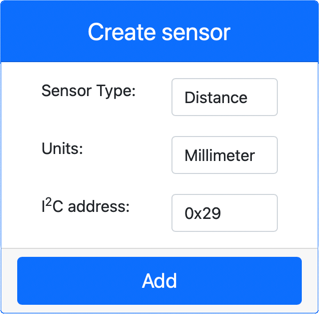

<!--
CO_OP_TRANSLATOR_METADATA:
{
  "original_hash": "7e9f05bdc50a40fd924b1d66934471bf",
  "translation_date": "2025-08-27T20:05:01+00:00",
  "source_file": "4-manufacturing/lessons/4-trigger-fruit-detector/virtual-device-proximity.md",
  "language_code": "th"
}
-->
# ตรวจจับความใกล้ - ฮาร์ดแวร์ IoT เสมือนจริง

ในส่วนนี้ของบทเรียน คุณจะเพิ่มเซ็นเซอร์ตรวจจับความใกล้ให้กับอุปกรณ์ IoT เสมือนจริง และอ่านค่าระยะทางจากเซ็นเซอร์นั้น

## ฮาร์ดแวร์

อุปกรณ์ IoT เสมือนจริงจะใช้เซ็นเซอร์ตรวจจับระยะทางจำลอง

ในอุปกรณ์ IoT จริง คุณจะใช้เซ็นเซอร์ที่มีโมดูลเลเซอร์สำหรับวัดระยะทางเพื่อตรวจจับระยะทาง

### เพิ่มเซ็นเซอร์ตรวจจับระยะทางใน CounterFit

เพื่อใช้เซ็นเซอร์ตรวจจับระยะทางเสมือนจริง คุณต้องเพิ่มเซ็นเซอร์นี้ในแอป CounterFit

#### งาน - เพิ่มเซ็นเซอร์ตรวจจับระยะทางใน CounterFit

เพิ่มเซ็นเซอร์ตรวจจับระยะทางในแอป CounterFit

1. เปิดโค้ด `fruit-quality-detector` ใน VS Code และตรวจสอบให้แน่ใจว่าสภาพแวดล้อมเสมือนจริงถูกเปิดใช้งาน

1. ติดตั้งแพ็กเกจ Pip เพิ่มเติมเพื่อเพิ่ม CounterFit shim ที่สามารถสื่อสารกับเซ็นเซอร์ตรวจจับระยะทางโดยการจำลอง [แพ็กเกจ rpi-vl53l0x Pip](https://pypi.org/project/rpi-vl53l0x/) ซึ่งเป็นแพ็กเกจ Python ที่ใช้กับ [เซ็นเซอร์ตรวจจับระยะทาง VL53L0X](https://wiki.seeedstudio.com/Grove-Time_of_Flight_Distance_Sensor-VL53L0X/) ตรวจสอบให้แน่ใจว่าคุณติดตั้งจากเทอร์มินัลที่เปิดใช้งานสภาพแวดล้อมเสมือนจริง

    ```sh
    pip install counterfit-shims-rpi-vl53l0x
    ```

1. ตรวจสอบให้แน่ใจว่าแอปเว็บ CounterFit กำลังทำงานอยู่

1. สร้างเซ็นเซอร์ตรวจจับระยะทาง:

    1. ในกล่อง *Create sensor* ในแถบ *Sensors* ให้คลิกที่กล่อง *Sensor type* และเลือก *Distance*

    1. ปล่อยให้ *Units* เป็น `Millimeter`

    1. เซ็นเซอร์นี้เป็นเซ็นเซอร์ I2C ดังนั้นให้ตั้งค่าที่อยู่เป็น `0x29` หากคุณใช้เซ็นเซอร์ VL53L0X จริง ที่อยู่นี้จะถูกตั้งค่าไว้แล้ว

    1. เลือกปุ่ม **Add** เพื่อสร้างเซ็นเซอร์ตรวจจับระยะทาง

    

    เซ็นเซอร์ตรวจจับระยะทางจะถูกสร้างและปรากฏในรายการเซ็นเซอร์

    

## เขียนโปรแกรมเซ็นเซอร์ตรวจจับระยะทาง

อุปกรณ์ IoT เสมือนจริงสามารถเขียนโปรแกรมเพื่อใช้เซ็นเซอร์ตรวจจับระยะทางจำลองได้แล้ว

### งาน - เขียนโปรแกรมเซ็นเซอร์ตรวจจับระยะทาง

1. สร้างไฟล์ใหม่ในโปรเจกต์ `fruit-quality-detector` ชื่อ `distance-sensor.py`

    > 💁 วิธีง่ายๆ ในการจำลองอุปกรณ์ IoT หลายตัวคือการเขียนแต่ละตัวในไฟล์ Python แยกกัน แล้วรันไฟล์เหล่านั้นพร้อมกัน

1. เริ่มการเชื่อมต่อกับ CounterFit ด้วยโค้ดต่อไปนี้:

    ```python
    from counterfit_connection import CounterFitConnection
    CounterFitConnection.init('127.0.0.1', 5000)
    ```

1. เพิ่มโค้ดต่อไปนี้ด้านล่าง:

    ```python
    import time
    
    from counterfit_shims_rpi_vl53l0x.vl53l0x import VL53L0X
    ```

    โค้ดนี้นำเข้าไลบรารีเซ็นเซอร์ shim สำหรับเซ็นเซอร์ VL53L0X

1. ด้านล่างนี้ ให้เพิ่มโค้ดเพื่อเข้าถึงเซ็นเซอร์:

    ```python
    distance_sensor = VL53L0X()
    distance_sensor.begin()
    ```

    โค้ดนี้ประกาศเซ็นเซอร์ตรวจจับระยะทาง แล้วเริ่มเซ็นเซอร์

1. สุดท้าย เพิ่มลูปแบบไม่สิ้นสุดเพื่ออ่านค่าระยะทาง:

    ```python
    while True:
        distance_sensor.wait_ready()
        print(f'Distance = {distance_sensor.get_distance()} mm')
        time.sleep(1)
    ```

    โค้ดนี้รอค่าที่พร้อมอ่านจากเซ็นเซอร์ แล้วพิมพ์ค่าลงในคอนโซล

1. รันโค้ดนี้

    > 💁 อย่าลืมว่าไฟล์นี้ชื่อ `distance-sensor.py`! ตรวจสอบให้แน่ใจว่าคุณรันไฟล์นี้ผ่าน Python ไม่ใช่ `app.py`

1. คุณจะเห็นค่าระยะทางปรากฏในคอนโซล เปลี่ยนค่าใน CounterFit เพื่อดูค่าที่เปลี่ยนแปลง หรือใช้ค่าที่สุ่ม

    ```output
    (.venv) ➜  fruit-quality-detector python distance-sensor.py 
    Distance = 37 mm
    Distance = 42 mm
    Distance = 29 mm
    ```

> 💁 คุณสามารถค้นหาโค้ดนี้ได้ในโฟลเดอร์ [code-proximity/virtual-iot-device](../../../../../4-manufacturing/lessons/4-trigger-fruit-detector/code-proximity/virtual-iot-device)

😀 โปรแกรมเซ็นเซอร์ตรวจจับความใกล้ของคุณสำเร็จแล้ว!

---

**ข้อจำกัดความรับผิดชอบ**:  
เอกสารนี้ได้รับการแปลโดยใช้บริการแปลภาษา AI [Co-op Translator](https://github.com/Azure/co-op-translator) แม้ว่าเราจะพยายามให้การแปลมีความถูกต้องมากที่สุด แต่โปรดทราบว่าการแปลโดยอัตโนมัติอาจมีข้อผิดพลาดหรือความไม่ถูกต้อง เอกสารต้นฉบับในภาษาดั้งเดิมควรถือเป็นแหล่งข้อมูลที่เชื่อถือได้ สำหรับข้อมูลที่สำคัญ ขอแนะนำให้ใช้บริการแปลภาษามืออาชีพ เราไม่รับผิดชอบต่อความเข้าใจผิดหรือการตีความผิดที่เกิดจากการใช้การแปลนี้