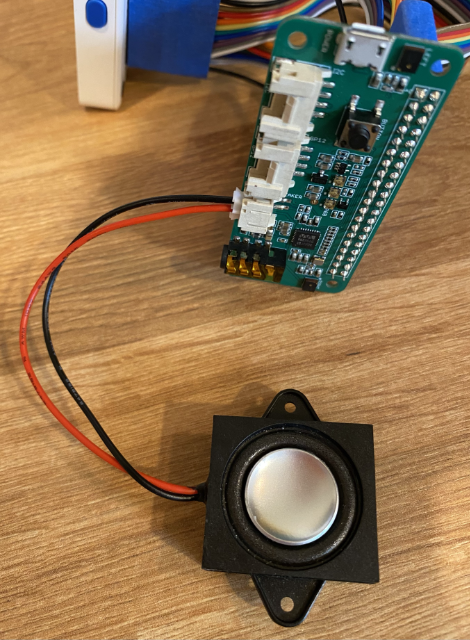

<!--
CO_OP_TRANSLATOR_METADATA:
{
  "original_hash": "93d352de36526b8990e41dd538100324",
  "translation_date": "2025-08-27T20:35:10+00:00",
  "source_file": "6-consumer/lessons/1-speech-recognition/wio-terminal-microphone.md",
  "language_code": "th"
}
-->
# ตั้งค่ามไมโครโฟนและลำโพง - Wio Terminal

ในส่วนนี้ของบทเรียน คุณจะเพิ่มลำโพงให้กับ Wio Terminal ของคุณ โดย Wio Terminal มีไมโครโฟนในตัวอยู่แล้ว ซึ่งสามารถใช้ในการบันทึกเสียงพูดได้

## ฮาร์ดแวร์

Wio Terminal มีไมโครโฟนในตัวอยู่แล้ว และสามารถใช้ในการบันทึกเสียงเพื่อการรู้จำเสียงพูดได้

ในการเพิ่มลำโพง คุณสามารถใช้ [ReSpeaker 2-Mics Pi Hat](https://www.seeedstudio.com/ReSpeaker-2-Mics-Pi-HAT.html) ซึ่งเป็นบอร์ดภายนอกที่มีไมโครโฟน MEMS 2 ตัว รวมถึงช่องเชื่อมต่อลำโพงและช่องเสียบหูฟัง

คุณจะต้องเพิ่มหูฟัง ลำโพงที่มีแจ็ค 3.5 มม. หรือ ลำโพงที่มีการเชื่อมต่อแบบ JST เช่น [Mono Enclosed Speaker - 2W 6 Ohm](https://www.seeedstudio.com/Mono-Enclosed-Speaker-2W-6-Ohm-p-2832.html)

ในการเชื่อมต่อ ReSpeaker 2-Mics Pi Hat คุณจะต้องใช้สายจัมเปอร์แบบ 40 pin-to-pin (หรือที่เรียกว่า male-to-male)

> 💁 หากคุณสะดวกในการบัดกรี คุณสามารถใช้ [40 Pin Raspberry Pi Hat Adapter Board For Wio Terminal](https://www.seeedstudio.com/40-Pin-Raspberry-Pi-Hat-Adapter-Board-For-Wio-Terminal-p-4730.html) เพื่อเชื่อมต่อ ReSpeaker

คุณจะต้องมี SD Card เพื่อใช้ในการดาวน์โหลดและเล่นเสียง โดย Wio Terminal รองรับ SD Card ขนาดสูงสุด 16GB และต้องฟอร์แมตเป็น FAT32 หรือ exFAT

### งาน - เชื่อมต่อ ReSpeaker Pi Hat

1. เมื่อ Wio Terminal ปิดอยู่ ให้เชื่อมต่อ ReSpeaker 2-Mics Pi Hat กับ Wio Terminal โดยใช้สายจัมเปอร์และช่อง GPIO ด้านหลังของ Wio Terminal:

    ขาต้องเชื่อมต่อในลักษณะนี้:

    

1. วางตำแหน่ง ReSpeaker และ Wio Terminal โดยให้ช่อง GPIO หันขึ้น และอยู่ทางด้านซ้ายมือ

1. เริ่มจากช่องบนซ้ายสุดของ GPIO บน ReSpeaker เชื่อมต่อสายจัมเปอร์จากช่องบนซ้ายสุดของ ReSpeaker ไปยังช่องบนซ้ายสุดของ Wio Terminal

1. ทำซ้ำขั้นตอนนี้จนถึงช่อง GPIO ด้านซ้ายทั้งหมด ตรวจสอบให้แน่ใจว่าสายเสียบแน่น

    

    

    > 💁 หากสายจัมเปอร์ของคุณเชื่อมต่อกันเป็นริบบิ้น ให้เก็บสายไว้ด้วยกันทั้งหมด - จะช่วยให้คุณมั่นใจได้ว่าคุณเชื่อมต่อสายทั้งหมดตามลำดับ

1. ทำซ้ำขั้นตอนนี้โดยใช้ช่อง GPIO ด้านขวาบน ReSpeaker และ Wio Terminal สายเหล่านี้ต้องผ่านรอบสายที่เชื่อมต่ออยู่แล้ว

    

    

    > 💁 หากสายจัมเปอร์ของคุณเชื่อมต่อกันเป็นริบบิ้น ให้แยกออกเป็นสองริบบิ้น และผ่านแต่ละด้านของสายที่มีอยู่แล้ว

    > 💁 คุณสามารถใช้เทปกาวเพื่อยึดขาให้เป็นบล็อกเพื่อช่วยป้องกันไม่ให้หลุดออกขณะเชื่อมต่อทั้งหมด
    >
    > 

1. คุณจะต้องเพิ่มลำโพง

    * หากคุณใช้ลำโพงที่มีสาย JST ให้เชื่อมต่อกับพอร์ต JST บน ReSpeaker

      

    * หากคุณใช้ลำโพงที่มีแจ็ค 3.5 มม. หรือหูฟัง ให้เสียบเข้ากับช่องแจ็ค 3.5 มม.

      

### งาน - ตั้งค่า SD Card

1. เชื่อมต่อ SD Card กับคอมพิวเตอร์ของคุณ โดยใช้เครื่องอ่านภายนอกหากคอมพิวเตอร์ของคุณไม่มีช่อง SD Card

1. ฟอร์แมต SD Card โดยใช้เครื่องมือที่เหมาะสมบนคอมพิวเตอร์ของคุณ และตรวจสอบให้แน่ใจว่าใช้ระบบไฟล์ FAT32 หรือ exFAT

1. ใส่ SD Card ลงในช่อง SD Card ด้านซ้ายของ Wio Terminal ใต้ปุ่มเปิดปิด ตรวจสอบให้แน่ใจว่า SD Card เข้าไปจนสุดและคลิกล็อก คุณอาจต้องใช้เครื่องมือบางอย่างหรือ SD Card อื่นเพื่อช่วยดันเข้าไปจนสุด

    

    > 💁 ในการนำ SD Card ออก คุณต้องกดเข้าไปเล็กน้อยและมันจะเด้งออก คุณอาจต้องใช้เครื่องมือบางอย่าง เช่น ไขควงหัวแบนหรือ SD Card อื่น

---

**ข้อจำกัดความรับผิดชอบ**:  
เอกสารนี้ได้รับการแปลโดยใช้บริการแปลภาษา AI [Co-op Translator](https://github.com/Azure/co-op-translator) แม้ว่าเราจะพยายามให้การแปลมีความถูกต้องมากที่สุด แต่โปรดทราบว่าการแปลอัตโนมัติอาจมีข้อผิดพลาดหรือความไม่ถูกต้อง เอกสารต้นฉบับในภาษาดั้งเดิมควรถือเป็นแหล่งข้อมูลที่เชื่อถือได้ สำหรับข้อมูลที่สำคัญ ขอแนะนำให้ใช้บริการแปลภาษามืออาชีพ เราไม่รับผิดชอบต่อความเข้าใจผิดหรือการตีความผิดที่เกิดจากการใช้การแปลนี้