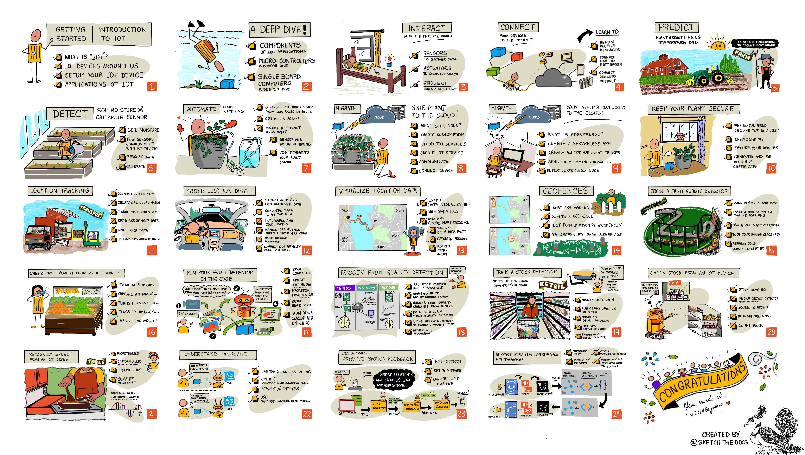

<!--
CO_OP_TRANSLATOR_METADATA:
{
  "original_hash": "72ea6b6dc04ec5e98a8a34a45cbe5042",
  "translation_date": "2025-11-18T17:42:54+00:00",
  "source_file": "README.md",
  "language_code": "th"
}
-->
[](https://github.com/microsoft/IoT-For-Beginners/blob/master/LICENSE)  
[](https://GitHub.com/microsoft/IoT-For-Beginners/graphs/contributors/)  
[](https://GitHub.com/microsoft/IoT-For-Beginners/issues/)  
[](https://GitHub.com/microsoft/IoT-For-Beginners/pulls/)  
[](http://makeapullrequest.com)  

[](https://GitHub.com/microsoft/IoT-For-Beginners/watchers/)  
[](https://GitHub.com/microsoft/IoT-For-Beginners/network/)  
[](https://GitHub.com/microsoft/IoT-For-Beginners/stargazers/)  

### เข้าร่วมชุมชน Azure AI Foundry  

หากคุณติดปัญหาหรือมีคำถามเกี่ยวกับการสร้างแอป AI เข้าร่วมพูดคุยกับผู้เรียนและนักพัฒนาที่มีประสบการณ์ในชุมชน MCP ที่นี่เป็นชุมชนที่สนับสนุนซึ่งยินดีต้อนรับคำถามและแบ่งปันความรู้กันอย่างอิสระ  

[](https://discord.gg/nTYy5BXMWG)  

หากคุณมีข้อเสนอแนะเกี่ยวกับผลิตภัณฑ์หรือพบข้อผิดพลาดขณะสร้าง โปรดเยี่ยมชม:  

[](https://aka.ms/foundry/forum)  

ทำตามขั้นตอนเหล่านี้เพื่อเริ่มต้นใช้งานทรัพยากรเหล่านี้:  
1. **Fork Repository**: คลิก [](https://GitHub.com/microsoft/IoT-For-Beginners/fork)  
2. **Clone Repository**:   `git clone https://github.com/microsoft/IoT-For-Beginners.git`  
3. [**เข้าร่วม Microsoft Foundry Discord และพบกับผู้เชี่ยวชาญและนักพัฒนาคนอื่นๆ**](https://discord.com/invite/ByRwuEEgH4)  

### 🌐 รองรับหลายภาษา  

#### รองรับผ่าน GitHub Action (อัตโนมัติและอัปเดตเสมอ)  

[Arabic](../ar/README.md) | [Bengali](../bn/README.md) | [Bulgarian](../bg/README.md) | [Burmese (Myanmar)](../my/README.md) | [Chinese (Simplified)](../zh/README.md) | [Chinese (Traditional, Hong Kong)](../hk/README.md) | [Chinese (Traditional, Macau)](../mo/README.md) | [Chinese (Traditional, Taiwan)](../tw/README.md) | [Croatian](../hr/README.md) | [Czech](../cs/README.md) | [Danish](../da/README.md) | [Dutch](../nl/README.md) | [Estonian](../et/README.md) | [Finnish](../fi/README.md) | [French](../fr/README.md) | [German](../de/README.md) | [Greek](../el/README.md) | [Hebrew](../he/README.md) | [Hindi](../hi/README.md) | [Hungarian](../hu/README.md) | [Indonesian](../id/README.md) | [Italian](../it/README.md) | [Japanese](../ja/README.md) | [Korean](../ko/README.md) | [Lithuanian](../lt/README.md) | [Malay](../ms/README.md) | [Marathi](../mr/README.md) | [Nepali](../ne/README.md) | [Nigerian Pidgin](../pcm/README.md) | [Norwegian](../no/README.md) | [Persian (Farsi)](../fa/README.md) | [Polish](../pl/README.md) | [Portuguese (Brazil)](../br/README.md) | [Portuguese (Portugal)](../pt/README.md) | [Punjabi (Gurmukhi)](../pa/README.md) | [Romanian](../ro/README.md) | [Russian](../ru/README.md) | [Serbian (Cyrillic)](../sr/README.md) | [Slovak](../sk/README.md) | [Slovenian](../sl/README.md) | [Spanish](../es/README.md) | [Swahili](../sw/README.md) | [Swedish](../sv/README.md) | [Tagalog (Filipino)](../tl/README.md) | [Tamil](../ta/README.md) | [Thai](./README.md) | [Turkish](../tr/README.md) | [Ukrainian](../uk/README.md) | [Urdu](../ur/README.md) | [Vietnamese](../vi/README.md)  

# IoT สำหรับผู้เริ่มต้น - หลักสูตร  

ทีม Azure Cloud Advocates ที่ Microsoft ยินดีนำเสนอหลักสูตร 12 สัปดาห์ 24 บทเรียนเกี่ยวกับพื้นฐาน IoT แต่ละบทเรียนประกอบด้วยแบบทดสอบก่อนและหลังบทเรียน คำแนะนำการทำบทเรียน โซลูชัน การบ้าน และอื่นๆ การเรียนรู้แบบโครงการช่วยให้คุณเรียนรู้ไปพร้อมกับการสร้าง ซึ่งเป็นวิธีที่พิสูจน์แล้วว่าทำให้ทักษะใหม่ๆ ติดตัวได้ดี  

โครงการครอบคลุมเส้นทางของอาหารตั้งแต่ฟาร์มถึงโต๊ะอาหาร ซึ่งรวมถึงการเกษตร การขนส่ง การผลิต การค้าปลีก และผู้บริโภค - ทุกอย่างเป็นพื้นที่อุตสาหกรรมยอดนิยมสำหรับอุปกรณ์ IoT  

  

> ภาพสเก็ตช์โดย [Nitya Narasimhan](https://github.com/nitya) คลิกที่ภาพเพื่อดูเวอร์ชันขนาดใหญ่  

**ขอขอบคุณผู้เขียนของเรา [Jen Fox](https://github.com/jenfoxbot), [Jen Looper](https://github.com/jlooper), [Jim Bennett](https://github.com/jimbobbennett) และศิลปินภาพสเก็ตช์ของเรา [Nitya Narasimhan](https://github.com/nitya)**  

**ขอบคุณทีม [Microsoft Learn Student Ambassadors](https://studentambassadors.microsoft.com?WT.mc_id=academic-17441-jabenn) ที่ช่วยตรวจสอบและแปลหลักสูตรนี้ - [Aditya Garg](https://github.com/AdityaGarg00), [Anurag Sharma](https://github.com/Anurag-0-1-A), [Arpita Das](https://github.com/Arpiiitaaa), [Aryan Jain](https://www.linkedin.com/in/aryan-jain-47a4a1145/), [Bhavesh Suneja](https://github.com/EliteWarrior315), [Faith Hunja](https://faithhunja.github.io/), [Lateefah Bello](https://www.linkedin.com/in/lateefah-bello/), [Manvi Jha](https://github.com/Severus-Matthew), [Mireille Tan](https://www.linkedin.com/in/mireille-tan-a4834819a/), [Mohammad Iftekher (Iftu) Ebne Jalal](https://github.com/Iftu119), [Mohammad Zulfikar](https://github.com/mohzulfikar), [Priyanshu Srivastav](https://www.linkedin.com/in/priyanshu-srivastav-b067241ba), [Thanmai Gowducheruvu](https://github.com/innovation-platform), และ [Zina Kamel](https://www.linkedin.com/in/zina-kamel/)**  

พบกับทีมของเรา!  

[](https://youtu.be/-wippUJRi5k)  

**Gif โดย** [Mohit Jaisal](https://linkedin.com/in/mohitjaisal)  

> 🎥 คลิกที่ภาพด้านบนเพื่อดูวิดีโอเกี่ยวกับโครงการ!  

> **ครู**, เราได้ [รวมคำแนะนำบางส่วน](for-teachers.md) เกี่ยวกับวิธีการใช้หลักสูตรนี้ หากคุณต้องการสร้างบทเรียนของคุณเอง เราได้รวม [เทมเพลตบทเรียน](lesson-template/README.md) ไว้ด้วย  

> **[นักเรียน](https://aka.ms/student-page)**, หากต้องการใช้หลักสูตรนี้ด้วยตัวเอง ให้ fork repo ทั้งหมดและทำแบบฝึกหัดด้วยตัวเอง เริ่มต้นด้วยแบบทดสอบก่อนบทเรียน จากนั้นอ่านบทเรียนและทำกิจกรรมที่เหลือ พยายามสร้างโครงการโดยทำความเข้าใจบทเรียนแทนที่จะคัดลอกรหัสโซลูชัน อย่างไรก็ตาม รหัสโซลูชันนั้นมีอยู่ในโฟลเดอร์ /solutions ในแต่ละบทเรียนที่เน้นโครงการ อีกแนวคิดหนึ่งคือการสร้างกลุ่มเรียนกับเพื่อนๆ และเรียนรู้เนื้อหาด้วยกัน สำหรับการศึกษาต่อ เราขอแนะนำ [Microsoft Learn](https://docs.microsoft.com/users/jimbobbennett/collections/ke2ehd351jopwr?WT.mc_id=academic-17441-jabenn)  

สำหรับวิดีโอภาพรวมของหลักสูตรนี้ ดูวิดีโอนี้:  

[](https://youtube.com/watch?v=bccEMm8gRuc "วิดีโอโปรโมต")  

> 🎥 คลิกที่ภาพด้านบนเพื่อดูวิดีโอเกี่ยวกับโครงการ!  

## วิธีการสอน  

เราเลือกใช้หลักการสอนสองข้อในการสร้างหลักสูตรนี้: การทำให้เป็นโครงการและการรวมแบบทดสอบบ่อยๆ เมื่อจบซีรีส์นี้ นักเรียนจะได้สร้างระบบตรวจสอบและรดน้ำต้นไม้ ตัวติดตามยานพาหนะ การตั้งค่าการผลิตอัจฉริยะเพื่อตรวจสอบและตรวจสอบอาหาร และตัวจับเวลาทำอาหารที่ควบคุมด้วยเสียง และจะได้เรียนรู้พื้นฐานของ Internet of Things รวมถึงการเขียนโค้ดอุปกรณ์ การเชื่อมต่อกับคลาวด์ การวิเคราะห์ข้อมูล และการใช้งาน AI บนอุปกรณ์  

การทำให้เนื้อหาสอดคล้องกับโครงการช่วยให้นักเรียนมีส่วนร่วมมากขึ้นและเพิ่มการจดจำแนวคิด  

นอกจากนี้ แบบทดสอบที่มีความเสี่ยงต่ำก่อนชั้นเรียนจะช่วยให้นักเรียนตั้งใจเรียนรู้หัวข้อ ในขณะที่แบบทดสอบที่สองหลังชั้นเรียนช่วยเพิ่มการจดจำ หลักสูตรนี้ออกแบบมาให้ยืดหยุ่นและสนุกสนาน และสามารถเรียนได้ทั้งหมดหรือบางส่วน โครงการเริ่มต้นจากขนาดเล็กและซับซ้อนขึ้นเรื่อยๆ ในช่วง 12 สัปดาห์  

แต่ละโครงการใช้ฮาร์ดแวร์ IoT ที่มีอยู่จริงสำหรับนักเรียนและผู้ที่ชื่นชอบ แต่ละโครงการจะเจาะลึกในโดเมนของโครงการนั้นๆ โดยให้ความรู้พื้นฐานที่เกี่ยวข้อง การเป็นนักพัฒนาที่ประสบความสำเร็จนั้นจำเป็นต้องเข้าใจโดเมนที่คุณกำลังแก้ปัญหา การให้ความรู้พื้นฐานนี้ช่วยให้นักเรียนคิดเกี่ยวกับโซลูชัน IoT และการเรียนรู้ในบริบทของปัญหาในโลกจริงที่พวกเขาอาจต้องแก้ในฐานะนักพัฒนา IoT นักเรียนจะได้เรียนรู้ 'เหตุผล' ของโซลูชันที่พวกเขากำลังสร้าง และเข้าใจถึงผู้ใช้งานปลายทาง  

## ฮาร์ดแวร์  

เรามีตัวเลือกฮาร์ดแวร์ IoT สองแบบสำหรับใช้ในโครงการ ขึ้นอยู่กับความชอบส่วนตัว ความรู้ด้านภาษาโปรแกรม หรือเป้าหมายการเรียนรู้ และความพร้อมใช้งาน นอกจากนี้ เรายังมีเวอร์ชัน 'ฮาร์ดแวร์เสมือน' สำหรับผู้ที่ไม่มีฮาร์ดแวร์ หรืออยากเรียนรู้เพิ่มเติมก่อนตัดสินใจซื้อ คุณสามารถอ่านเพิ่มเติมและค้นหา 'รายการช้อปปิ้ง' ได้ที่ [หน้าฮาร์ดแวร์](./hardware.md) รวมถึงลิงก์สำหรับซื้อชุดอุปกรณ์ครบชุดจากเพื่อนของเราที่ Seeed Studio  

> 💁 ค้นหา [Code of Conduct](CODE_OF_CONDUCT.md), [Contributing](CONTRIBUTING.md), และ [Translation](TRANSLATIONS.md) เรายินดีรับข้อเสนอแนะที่สร้างสรรค์ของคุณ!  

## แต่ละบทเรียนประกอบด้วย:  

- ภาพสเก็ตช์  
- วิดีโอเสริม (ถ้ามี)  
- แบบทดสอบอุ่นเครื่องก่อนบทเรียน  
- บทเรียนที่เขียนไว้  
- สำหรับบทเรียนที่เน้นโครงการ มีคำแนะนำทีละขั้นตอนเกี่ยวกับวิธีสร้างโครงการ  
- การตรวจสอบความรู้  
- ความท้าทาย  
- การอ่านเสริม  
- การบ้าน  
- [แบบทดสอบหลังบทเรียน](https://ff-quizzes.netlify.app/en/)  
> **หมายเหตุเกี่ยวกับแบบทดสอบ**: แบบทดสอบทั้งหมดอยู่ในโฟลเดอร์ quiz-app ซึ่งมีทั้งหมด 48 แบบทดสอบ โดยแต่ละแบบทดสอบมี 3 คำถาม แบบทดสอบเหล่านี้ถูกลิงก์จากบทเรียน แต่แอปแบบทดสอบสามารถรันได้ในเครื่องหรือปรับใช้บน Azure ให้ทำตามคำแนะนำในโฟลเดอร์ `quiz-app` แบบทดสอบกำลังถูกแปลเป็นภาษาท้องถิ่นอย่างต่อเนื่อง

## บทเรียน

|       |              ชื่อโปรเจกต์              |                       แนวคิดที่สอน                       | วัตถุประสงค์การเรียนรู้                                                                                                                                                 |                                                        บทเรียนที่ลิงก์                                                         |
| :---: | :------------------------------------: | :-----------------------------------------------------: | ------------------------------------------------------------------------------------------------------------------------------------------------------------------- | :--------------------------------------------------------------------------------------------------------------------------: |
|  01   | [เริ่มต้นใช้งาน](./1-getting-started/README.md) |                     แนะนำเกี่ยวกับ IoT                     | เรียนรู้หลักการพื้นฐานของ IoT และองค์ประกอบพื้นฐานของโซลูชัน IoT เช่น เซ็นเซอร์และบริการคลาวด์ ในขณะที่คุณตั้งค่าอุปกรณ์ IoT เครื่องแรกของคุณ |                      [แนะนำเกี่ยวกับ IoT](./1-getting-started/lessons/1-introduction-to-iot/README.md)                      |
|  02   | [เริ่มต้นใช้งาน](./1-getting-started/README.md) |                   เจาะลึกเกี่ยวกับ IoT                    | เรียนรู้เพิ่มเติมเกี่ยวกับองค์ประกอบของระบบ IoT รวมถึงไมโครคอนโทรลเลอร์และคอมพิวเตอร์บอร์ดเดี่ยว                                                            |                        [เจาะลึกเกี่ยวกับ IoT](./1-getting-started/lessons/2-deeper-dive/README.md)                         |
|  03   | [เริ่มต้นใช้งาน](./1-getting-started/README.md) | โต้ตอบกับโลกทางกายภาพด้วยเซ็นเซอร์และแอคชูเอเตอร์ | เรียนรู้เกี่ยวกับเซ็นเซอร์เพื่อรวบรวมข้อมูลจากโลกทางกายภาพ และแอคชูเอเตอร์เพื่อส่งข้อมูลตอบกลับ ในขณะที่คุณสร้างไฟกลางคืน                                           | [โต้ตอบกับโลกทางกายภาพด้วยเซ็นเซอร์และแอคชูเอเตอร์](./1-getting-started/lessons/3-sensors-and-actuators/README.md) |
|  04   | [เริ่มต้นใช้งาน](./1-getting-started/README.md) |             เชื่อมต่ออุปกรณ์ของคุณกับอินเทอร์เน็ต             | เรียนรู้เกี่ยวกับวิธีการเชื่อมต่ออุปกรณ์ IoT กับอินเทอร์เน็ตเพื่อส่งและรับข้อความโดยการเชื่อมต่อไฟกลางคืนของคุณกับ MQTT broker                               |               [เชื่อมต่ออุปกรณ์ของคุณกับอินเทอร์เน็ต](./1-getting-started/lessons/4-connect-internet/README.md)                |
|  05   |            [ฟาร์ม](./2-farm/README.md)            |                    ทำนายการเติบโตของพืช                     | เรียนรู้วิธีการทำนายการเติบโตของพืชโดยใช้ข้อมูลอุณหภูมิที่จับได้จากอุปกรณ์ IoT                                                                                  |                          [ทำนายการเติบโตของพืช](./2-farm/lessons/1-predict-plant-growth/README.md)                           |
|  06   |            [ฟาร์ม](./2-farm/README.md)            |                    ตรวจจับความชื้นในดิน                     | เรียนรู้วิธีการตรวจจับความชื้นในดินและปรับเทียบเซ็นเซอร์ความชื้นในดิน                                                                                              |                          [ตรวจจับความชื้นในดิน](./2-farm/lessons/2-detect-soil-moisture/README.md)                           |
|  07   |            [ฟาร์ม](./2-farm/README.md)            |                  การรดน้ำพืชอัตโนมัติ                   | เรียนรู้วิธีการรดน้ำอัตโนมัติและตั้งเวลาโดยใช้รีเลย์และ MQTT                                                                                                      |                      [การรดน้ำพืชอัตโนมัติ](./2-farm/lessons/3-automated-plant-watering/README.md)                       |
|  08   |            [ฟาร์ม](./2-farm/README.md)            |               ย้ายพืชของคุณไปยังคลาวด์               | เรียนรู้เกี่ยวกับคลาวด์และบริการ IoT ที่โฮสต์บนคลาวด์ และวิธีการเชื่อมต่อพืชของคุณกับบริการเหล่านี้แทนที่จะใช้ MQTT broker สาธารณะ                                   |               [ย้ายพืชของคุณไปยังคลาวด์](./2-farm/lessons/4-migrate-your-plant-to-the-cloud/README.md)                |
|  09   |            [ฟาร์ม](./2-farm/README.md)            |         ย้ายตรรกะของแอปพลิเคชันของคุณไปยังคลาวด์         | เรียนรู้เกี่ยวกับวิธีการเขียนตรรกะของแอปพลิเคชันในคลาวด์ที่ตอบสนองต่อข้อความ IoT                                                                          |         [ย้ายตรรกะของแอปพลิเคชันของคุณไปยังคลาวด์](./2-farm/lessons/5-migrate-application-to-the-cloud/README.md)         |
|  10   |            [ฟาร์ม](./2-farm/README.md)            |                   รักษาความปลอดภัยให้พืชของคุณ                    | เรียนรู้เกี่ยวกับความปลอดภัยใน IoT และวิธีการรักษาความปลอดภัยให้พืชของคุณด้วยคีย์และใบรับรอง                                                                          |                        [รักษาความปลอดภัยให้พืชของคุณ](./2-farm/lessons/6-keep-your-plant-secure/README.md)                         |
|  11   |       [การขนส่ง](./3-transport/README.md)       |                      การติดตามตำแหน่ง                      | เรียนรู้เกี่ยวกับการติดตามตำแหน่ง GPS สำหรับอุปกรณ์ IoT                                                                                                                   |                           [การติดตามตำแหน่ง](./3-transport/lessons/1-location-tracking/README.md)                           |
|  12   |       [การขนส่ง](./3-transport/README.md)       |                     การจัดเก็บข้อมูลตำแหน่ง                     | เรียนรู้วิธีการจัดเก็บข้อมูล IoT เพื่อการแสดงผลหรือวิเคราะห์ในภายหลัง                                                                                                      |                         [การจัดเก็บข้อมูลตำแหน่ง](./3-transport/lessons/2-store-location-data/README.md)                         |
|  13   |       [การขนส่ง](./3-transport/README.md)       |                   การแสดงผลข้อมูลตำแหน่ง                   | เรียนรู้เกี่ยวกับการแสดงผลข้อมูลตำแหน่งบนแผนที่ และวิธีที่แผนที่แสดงโลก 3 มิติในรูปแบบ 2 มิติ                                                            |                     [การแสดงผลข้อมูลตำแหน่ง](./3-transport/lessons/3-visualize-location-data/README.md)                     |
|  14   |       [การขนส่ง](./3-transport/README.md)       |                          Geofences                          | เรียนรู้เกี่ยวกับ Geofences และวิธีการใช้งานเพื่อแจ้งเตือนเมื่อยานพาหนะในห่วงโซ่อุปทานใกล้ถึงจุดหมายปลายทาง                                           |                                   [Geofences](./3-transport/lessons/4-geofences/README.md)                                   |
|  15   |   [การผลิต](./4-manufacturing/README.md)   |               ฝึกตัวตรวจจับคุณภาพผลไม้                | เรียนรู้เกี่ยวกับการฝึกตัวจำแนกภาพในคลาวด์เพื่อตรวจจับคุณภาพผลไม้                                                                                       |                 [ฝึกตัวตรวจจับคุณภาพผลไม้](./4-manufacturing/lessons/1-train-fruit-detector/README.md)                 |
|  16   |   [การผลิต](./4-manufacturing/README.md)   |           ตรวจสอบคุณภาพผลไม้จากอุปกรณ์ IoT            | เรียนรู้เกี่ยวกับการใช้ตัวตรวจจับคุณภาพผลไม้จากอุปกรณ์ IoT                                                                                                    |           [ตรวจสอบคุณภาพผลไม้จากอุปกรณ์ IoT](./4-manufacturing/lessons/2-check-fruit-from-device/README.md)            |
|  17   |   [การผลิต](./4-manufacturing/README.md)   |             รันตัวตรวจจับผลไม้ที่ขอบเครือข่าย             | เรียนรู้เกี่ยวกับการรันตัวตรวจจับผลไม้บนอุปกรณ์ IoT ที่ขอบเครือข่าย                                                                                                |             [รันตัวตรวจจับผลไม้ที่ขอบเครือข่าย](./4-manufacturing/lessons/3-run-fruit-detector-edge/README.md)             |
|  18   |   [การผลิต](./4-manufacturing/README.md)   |        เรียกใช้การตรวจจับคุณภาพผลไม้จากเซ็นเซอร์        | เรียนรู้เกี่ยวกับการเรียกใช้การตรวจจับคุณภาพผลไม้จากเซ็นเซอร์                                                                                                        |        [เรียกใช้การตรวจจับคุณภาพผลไม้จากเซ็นเซอร์](./4-manufacturing/lessons/4-trigger-fruit-detector/README.md)         |
|  19   |          [ค้าปลีก](./5-retail/README.md)          |                   ฝึกตัวตรวจจับสินค้า                    | เรียนรู้วิธีการใช้การตรวจจับวัตถุเพื่อฝึกตัวตรวจจับสินค้าเพื่อการนับสินค้าในร้าน                                                                                |                        [ฝึกตัวตรวจจับสินค้า](./5-retail/lessons/1-train-stock-detector/README.md)                         |
|  20   |          [ค้าปลีก](./5-retail/README.md)          |               ตรวจสอบสินค้าจากอุปกรณ์ IoT                | เรียนรู้วิธีการตรวจสอบสินค้าจากอุปกรณ์ IoT โดยใช้โมเดลการตรวจจับวัตถุ                                                                                         |                     [ตรวจสอบสินค้าจากอุปกรณ์ IoT](./5-retail/lessons/2-check-stock-device/README.md)                      |
|  21   |        [ผู้บริโภค](./6-consumer/README.md)        |             การจดจำเสียงด้วยอุปกรณ์ IoT             | เรียนรู้วิธีการจดจำเสียงจากอุปกรณ์ IoT เพื่อสร้างตัวจับเวลาอัจฉริยะ                                                                                             |                  [การจดจำเสียงด้วยอุปกรณ์ IoT](./6-consumer/lessons/1-speech-recognition/README.md)                  |
|  22   |        [ผู้บริโภค](./6-consumer/README.md)        |                     เข้าใจภาษา                     | เรียนรู้วิธีการเข้าใจประโยคที่พูดกับอุปกรณ์ IoT                                                                                                           |                        [เข้าใจภาษา](./6-consumer/lessons/2-language-understanding/README.md)                        |
|  23   |        [ผู้บริโภค](./6-consumer/README.md)        |           ตั้งค่าตัวจับเวลาและให้ข้อมูลตอบกลับด้วยเสียง           | เรียนรู้วิธีการตั้งค่าตัวจับเวลาบนอุปกรณ์ IoT และให้ข้อมูลตอบกลับด้วยเสียงเมื่อมีการตั้งค่าตัวจับเวลาและเมื่อมันสิ้นสุด                                                    |                 [ตั้งค่าตัวจับเวลาและให้ข้อมูลตอบกลับด้วยเสียง](./6-consumer/lessons/3-spoken-feedback/README.md)                  |
|  24   |        [ผู้บริโภค](./6-consumer/README.md)        |                 รองรับหลายภาษา                  | เรียนรู้วิธีการรองรับหลายภาษา ทั้งการพูดกับอุปกรณ์และการตอบกลับจากตัวจับเวลาอัจฉริยะ                                                               |                   [รองรับหลายภาษา](./6-consumer/lessons/4-multiple-language-support/README.md)                   |

## การเข้าถึงแบบออฟไลน์

คุณสามารถรันเอกสารนี้แบบออฟไลน์ได้โดยใช้ [Docsify](https://docsify.js.org/#/). Fork repo นี้, [ติดตั้ง Docsify](https://docsify.js.org/#/quickstart) บนเครื่องของคุณ และในโฟลเดอร์ root ของ repo นี้ ให้พิมพ์ `docsify serve`. เว็บไซต์จะถูกให้บริการบนพอร์ต 3000 บน localhost ของคุณ: `localhost:3000`.

## แบบทดสอบ

ขอบคุณชุมชนที่จัดแบบทดสอบแบบโต้ตอบเพื่อทดสอบความรู้ของคุณในแต่ละบท คุณสามารถทดสอบความรู้ของคุณ [ที่นี่](https://ff-quizzes.netlify.app/en/) 

### PDF

คุณสามารถสร้าง PDF ของเนื้อหานี้เพื่อการเข้าถึงแบบออฟไลน์หากจำเป็น ในการทำเช่นนี้ ให้แน่ใจว่าคุณมี [npm ติดตั้งแล้ว](https://docs.npmjs.com/downloading-and-installing-node-js-and-npm) และรันคำสั่งต่อไปนี้ในโฟลเดอร์ root ของ repo นี้:

```sh
npm i
npm run convert
```

### สไลด์

มีเด็คสไลด์สำหรับบางบทเรียนในโฟลเดอร์ [slides](../../slides).


## หลักสูตรอื่น ๆ

ทีมของเราผลิตหลักสูตรอื่น ๆ! ลองดู:

### Azure / Edge / MCP / Agents
[](https://github.com/microsoft/AZD-for-beginners?WT.mc_id=academic-105485-koreyst)
[](https://github.com/microsoft/edgeai-for-beginners?WT.mc_id=academic-105485-koreyst)
[](https://github.com/microsoft/mcp-for-beginners?WT.mc_id=academic-105485-koreyst)
[](https://github.com/microsoft/ai-agents-for-beginners?WT.mc_id=academic-105485-koreyst)

---

### Generative AI Series
[](https://github.com/microsoft/generative-ai-for-beginners?WT.mc_id=academic-105485-koreyst)
[-9333EA?style=for-the-badge&labelColor=E5E7EB&color=9333EA)](https://github.com/microsoft/Generative-AI-for-beginners-dotnet?WT.mc_id=academic-105485-koreyst)
[-C084FC?style=for-the-badge&labelColor=E5E7EB&color=C084FC)](https://github.com/microsoft/generative-ai-for-beginners-java?WT.mc_id=academic-105485-koreyst)
[-E879F9?style=for-the-badge&labelColor=E5E7EB&color=E879F9)](https://github.com/microsoft/generative-ai-with-javascript?WT.mc_id=academic-105485-koreyst)

---

### การเรียนรู้หลัก
[](https://aka.ms/ml-beginners?WT.mc_id=academic-105485-koreyst)
[](https://aka.ms/datascience-beginners?WT.mc_id=academic-105485-koreyst)
[](https://aka.ms/ai-beginners?WT.mc_id=academic-105485-koreyst)
[](https://github.com/microsoft/Security-101?WT.mc_id=academic-96948-sayoung)
[](https://aka.ms/webdev-beginners?WT.mc_id=academic-105485-koreyst)
[](https://aka.ms/iot-beginners?WT.mc_id=academic-105485-koreyst)
[](https://github.com/microsoft/xr-development-for-beginners?WT.mc_id=academic-105485-koreyst)

---

### ซีรีส์ Copilot
[](https://aka.ms/GitHubCopilotAI?WT.mc_id=academic-105485-koreyst)
[](https://github.com/microsoft/mastering-github-copilot-for-dotnet-csharp-developers?WT.mc_id=academic-105485-koreyst)
[](https://github.com/microsoft/CopilotAdventures?WT.mc_id=academic-105485-koreyst)
<!-- CO-OP TRANSLATOR OTHER COURSES END -->

## การให้เครดิตภาพ

คุณสามารถดูเครดิตสำหรับภาพทั้งหมดที่ใช้ในหลักสูตรนี้ได้ใน [Attributions](./attributions.md)

---

<!-- CO-OP TRANSLATOR DISCLAIMER START -->
**ข้อจำกัดความรับผิดชอบ**:  
เอกสารนี้ได้รับการแปลโดยใช้บริการแปลภาษา AI [Co-op Translator](https://github.com/Azure/co-op-translator) แม้ว่าเราจะพยายามให้การแปลมีความถูกต้อง แต่โปรดทราบว่าการแปลอัตโนมัติอาจมีข้อผิดพลาดหรือความไม่ถูกต้อง เอกสารต้นฉบับในภาษาต้นทางควรถือเป็นแหล่งข้อมูลที่เชื่อถือได้ สำหรับข้อมูลที่สำคัญ แนะนำให้ใช้บริการแปลภาษามนุษย์ที่เป็นมืออาชีพ เราไม่รับผิดชอบต่อความเข้าใจผิดหรือการตีความผิดที่เกิดจากการใช้การแปลนี้
<!-- CO-OP TRANSLATOR DISCLAIMER END -->