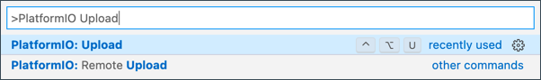

<!--
CO_OP_TRANSLATOR_METADATA:
{
  "original_hash": "a4f0c166010e31fd7b6ca20bc88dec6d",
  "translation_date": "2025-08-27T22:47:41+00:00",
  "source_file": "1-getting-started/lessons/1-introduction-to-iot/wio-terminal.md",
  "language_code": "tl"
}
-->
# Wio Terminal

Ang [Wio Terminal mula sa Seeed Studios](https://www.seeedstudio.com/Wio-Terminal-p-4509.html) ay isang Arduino-compatible na microcontroller na may WiFi at ilang mga built-in na sensor at actuator. Mayroon din itong mga port para magdagdag ng karagdagang mga sensor at actuator gamit ang isang hardware ecosystem na tinatawag na [Grove](https://www.seeedstudio.com/category/Grove-c-1003.html).


## Setup

Upang magamit ang iyong Wio Terminal, kailangan mong mag-install ng ilang libreng software sa iyong computer. Kailangan mo ring i-update ang firmware ng Wio Terminal bago ito maikonekta sa WiFi.

### Gawain - setup

I-install ang kinakailangang software at i-update ang firmware.

1. I-install ang Visual Studio Code (VS Code). Ito ang editor na gagamitin mo upang magsulat ng code para sa iyong device gamit ang C/C++. Tingnan ang [VS Code documentation](https://code.visualstudio.com?WT.mc_id=academic-17441-jabenn) para sa mga tagubilin sa pag-install ng VS Code.

    > 💁 Ang isa pang sikat na IDE para sa Arduino development ay ang [Arduino IDE](https://www.arduino.cc/en/software). Kung pamilyar ka na sa tool na ito, maaari mo itong gamitin sa halip na VS Code at PlatformIO, ngunit ang mga aralin ay magbibigay ng mga tagubilin batay sa paggamit ng VS Code.

1. I-install ang VS Code PlatformIO extension. Ito ay isang extension para sa VS Code na sumusuporta sa pag-program ng mga microcontroller gamit ang C/C++. Tingnan ang [PlatformIO extension documentation](https://marketplace.visualstudio.com/items?WT.mc_id=academic-17441-jabenn&itemName=platformio.platformio-ide) para sa mga tagubilin sa pag-install ng extension na ito sa VS Code. Ang extension na ito ay nangangailangan ng Microsoft C/C++ extension upang gumana sa C at C++ code, at ang C/C++ extension ay awtomatikong mai-install kapag in-install mo ang PlatformIO.

1. Ikonekta ang iyong Wio Terminal sa iyong computer. Ang Wio Terminal ay may USB-C port sa ibaba, at kailangang ikonekta ito sa isang USB port sa iyong computer. Ang Wio Terminal ay may kasamang USB-C to USB-A cable, ngunit kung ang iyong computer ay may USB-C ports lamang, kakailanganin mo ng USB-C cable o isang USB-A to USB-C adapter.

1. Sundin ang mga tagubilin sa [Wio Terminal Wiki WiFi Overview documentation](https://wiki.seeedstudio.com/Wio-Terminal-Network-Overview/) upang i-setup ang iyong Wio Terminal at i-update ang firmware.

## Hello world

Karaniwan kapag nagsisimula sa isang bagong programming language o teknolohiya, gumagawa ng isang 'Hello World' na application - isang maliit na application na nagpapakita ng teksto tulad ng `"Hello World"` upang ipakita na ang lahat ng mga tool ay maayos na naka-configure.

Ang Hello World app para sa Wio Terminal ay titiyakin na ang Visual Studio Code ay maayos na na-install gamit ang PlatformIO at naka-setup para sa microcontroller development.

### Gumawa ng PlatformIO project

Ang unang hakbang ay gumawa ng bagong proyekto gamit ang PlatformIO na naka-configure para sa Wio Terminal.

#### Gawain - gumawa ng PlatformIO project

Gumawa ng PlatformIO project.

1. Ikonekta ang Wio Terminal sa iyong computer

1. Buksan ang VS Code

1. Ang PlatformIO icon ay nasa side menu bar:

    

    Piliin ang menu item na ito, pagkatapos ay piliin ang *PIO Home -> Open*

    

1. Mula sa welcome screen, piliin ang **+ New Project** button

    

1. I-configure ang proyekto sa *Project Wizard*:

    1. Pangalanan ang iyong proyekto `nightlight`

    1. Mula sa *Board* dropdown, i-type ang `WIO` upang i-filter ang mga board, at piliin ang *Seeeduino Wio Terminal*

    1. Iwanang naka-set ang *Framework* sa *Arduino*

    1. Piliin kung iiwan ang *Use default location* checkbox na naka-check, o i-uncheck ito at pumili ng lokasyon para sa iyong proyekto

    1. Piliin ang **Finish** button

    

    Ang PlatformIO ay magda-download ng mga component na kailangan upang i-compile ang code para sa Wio Terminal at lumikha ng iyong proyekto. Maaaring tumagal ito ng ilang minuto.

### Suriin ang PlatformIO project

Ang VS Code explorer ay magpapakita ng ilang mga file at folder na nilikha ng PlatformIO wizard.

#### Mga Folder

* `.pio` - ang folder na ito ay naglalaman ng pansamantalang data na kailangan ng PlatformIO tulad ng mga library o compiled code. Awtomatikong nire-recreate ito kung mabubura, at hindi mo kailangang idagdag ito sa source code control kung ibabahagi mo ang iyong proyekto sa mga site tulad ng GitHub.
* `.vscode` - ang folder na ito ay naglalaman ng configuration na ginagamit ng PlatformIO at VS Code. Awtomatikong nire-recreate ito kung mabubura, at hindi mo kailangang idagdag ito sa source code control kung ibabahagi mo ang iyong proyekto sa mga site tulad ng GitHub.
* `include` - ang folder na ito ay para sa mga external header file na kailangan kapag nagdadagdag ng karagdagang library sa iyong code. Hindi mo gagamitin ang folder na ito sa alinman sa mga araling ito.
* `lib` - ang folder na ito ay para sa mga external library na nais mong tawagin mula sa iyong code. Hindi mo gagamitin ang folder na ito sa alinman sa mga araling ito.
* `src` - ang folder na ito ay naglalaman ng pangunahing source code para sa iyong application. Sa simula, maglalaman ito ng isang file - `main.cpp`.
* `test` - ang folder na ito ay kung saan mo ilalagay ang anumang unit tests para sa iyong code.

#### Mga File

* `main.cpp` - ang file na ito sa `src` folder ay naglalaman ng entry point para sa iyong application. Buksan ang file na ito, at maglalaman ito ng sumusunod na code:

    ```cpp
    #include <Arduino.h>
    
    void setup() {
      // put your setup code here, to run once:
    }
    
    void loop() {
      // put your main code here, to run repeatedly:
    }
    ```

    Kapag ang device ay nag-start up, ang Arduino framework ay tatakbo sa `setup` function nang isang beses, pagkatapos ay tatakbo ang `loop` function nang paulit-ulit hanggang sa ang device ay ma-off.

* `.gitignore` - ang file na ito ay naglilista ng mga file at direktoryo na dapat balewalain kapag idinadagdag ang iyong code sa git source code control, tulad ng pag-upload sa isang repository sa GitHub.

* `platformio.ini` - ang file na ito ay naglalaman ng configuration para sa iyong device at app. Buksan ang file na ito, at maglalaman ito ng sumusunod na code:

    ```ini
    [env:seeed_wio_terminal]
    platform = atmelsam
    board = seeed_wio_terminal
    framework = arduino
    ```

    Ang `[env:seeed_wio_terminal]` na seksyon ay may configuration para sa Wio Terminal. Maaari kang magkaroon ng maraming `env` na seksyon upang ang iyong code ay ma-compile para sa maraming board.

    Ang iba pang mga halaga ay tumutugma sa configuration mula sa project wizard:

  * `platform = atmelsam` ay tumutukoy sa hardware na ginagamit ng Wio Terminal (isang ATSAMD51-based microcontroller)
  * `board = seeed_wio_terminal` ay tumutukoy sa uri ng microcontroller board (ang Wio Terminal)
  * `framework = arduino` ay tumutukoy na ang proyektong ito ay gumagamit ng Arduino framework.

### Isulat ang Hello World app

Handa ka nang isulat ang Hello World app.

#### Gawain - isulat ang Hello World app

Isulat ang Hello World app.

1. Buksan ang `main.cpp` file sa VS Code

1. Palitan ang code upang tumugma sa sumusunod:

    ```cpp
    #include <Arduino.h>

    void setup()
    {
        Serial.begin(9600);

        while (!Serial)
            ; // Wait for Serial to be ready
    
        delay(1000);
    }
    
    void loop()
    {
        Serial.println("Hello World");
        delay(5000);
    }
    ```

    Ang `setup` function ay nag-i-initialize ng koneksyon sa serial port - sa kasong ito, ang USB port na ginagamit upang ikonekta ang Wio Terminal sa iyong computer. Ang parameter na `9600` ay ang [baud rate](https://wikipedia.org/wiki/Symbol_rate) (kilala rin bilang Symbol rate), o bilis kung saan ang data ay ipapadala sa serial port sa bits per second. Ang setting na ito ay nangangahulugang 9,600 bits (0s at 1s) ng data ang ipinapadala bawat segundo. Pagkatapos nito, naghihintay ito para sa serial port na maging handa.

    Ang `loop` function ay nagpapadala ng linya na `Hello World!` sa serial port, kaya ang mga karakter ng `Hello World!` kasama ang isang bagong linya na karakter. Pagkatapos nito, natutulog ito ng 5,000 milliseconds o 5 segundo. Kapag natapos ang `loop`, ito ay tatakbo muli, at muli, at patuloy habang ang microcontroller ay naka-on.

1. Ilagay ang iyong Wio Terminal sa upload mode. Kailangan mong gawin ito sa tuwing mag-u-upload ka ng bagong code sa device:

    1. Hilahin pababa nang dalawang beses nang mabilis ang power switch - babalik ito sa on position sa bawat pagkakataon.

    1. Tingnan ang asul na status LED sa kanang bahagi ng USB port. Dapat itong pumipintig.
    
    [](https://youtu.be/LeKU_7zLRrQ)
    
    I-click ang imahe sa itaas para sa isang video na nagpapakita kung paano ito gawin.

1. I-build at i-upload ang code sa Wio Terminal

    1. Buksan ang VS Code command palette

    1. I-type ang `PlatformIO Upload` upang hanapin ang upload option, at piliin ang *PlatformIO: Upload*

        

        Awtomatikong i-build ng PlatformIO ang code kung kinakailangan bago i-upload.

    1. Ang code ay i-compile at i-upload sa Wio Terminal

        > 💁 Kung gumagamit ka ng macOS, maaaring lumabas ang isang notification tungkol sa *DISK NOT EJECTED PROPERLY*. Ito ay dahil ang Wio Terminal ay na-mount bilang isang drive bilang bahagi ng flashing process, at ito ay nadidiskonekta kapag ang compiled code ay naisusulat sa device. Maaari mong balewalain ang notification na ito.

    ⚠️ Kung makakakuha ka ng mga error tungkol sa upload port na hindi available, siguraduhin munang nakakonekta ang Wio Terminal sa iyong computer, naka-on gamit ang switch sa kaliwang bahagi ng screen, at naka-set sa upload mode. Ang berdeng ilaw sa ibaba ay dapat naka-on, at ang asul na ilaw ay dapat pumipintig. Kung patuloy kang makakakuha ng error, hilahin pababa nang dalawang beses nang mabilis ang on/off switch upang pilitin ang Wio Terminal sa upload mode at subukang muli ang upload.

Ang PlatformIO ay may Serial Monitor na maaaring mag-monitor ng data na ipinapadala sa USB cable mula sa Wio Terminal. Pinapayagan ka nitong i-monitor ang data na ipinapadala ng `Serial.println("Hello World");` na command.

1. Buksan ang VS Code command palette

1. I-type ang `PlatformIO Serial` upang hanapin ang Serial Monitor option, at piliin ang *PlatformIO: Serial Monitor*

    

    Magbubukas ang isang bagong terminal, at ang data na ipinapadala sa serial port ay i-stream sa terminal na ito:

    ```output
    > Executing task: platformio device monitor <
    
    --- Available filters and text transformations: colorize, debug, default, direct, hexlify, log2file, nocontrol, printable, send_on_enter, time
    --- More details at http://bit.ly/pio-monitor-filters
    --- Miniterm on /dev/cu.usbmodem101  9600,8,N,1 ---
    --- Quit: Ctrl+C | Menu: Ctrl+T | Help: Ctrl+T followed by Ctrl+H ---
    Hello World
    Hello World
    ```

    Ang `Hello World` ay magpi-print sa serial monitor tuwing 5 segundo.

> 💁 Maaari mong mahanap ang code na ito sa [code/wio-terminal](../../../../../1-getting-started/lessons/1-introduction-to-iot/code/wio-terminal) folder.

😀 Tagumpay ang iyong 'Hello World' program!

---

**Paunawa**:  
Ang dokumentong ito ay isinalin gamit ang AI translation service na [Co-op Translator](https://github.com/Azure/co-op-translator). Bagama't sinisikap naming maging tumpak, tandaan na ang mga awtomatikong pagsasalin ay maaaring maglaman ng mga pagkakamali o hindi pagkakatugma. Ang orihinal na dokumento sa kanyang katutubong wika ang dapat ituring na opisyal na sanggunian. Para sa mahalagang impormasyon, inirerekomenda ang propesyonal na pagsasalin ng tao. Hindi kami mananagot sa anumang hindi pagkakaunawaan o maling interpretasyon na maaaring magmula sa paggamit ng pagsasaling ito.