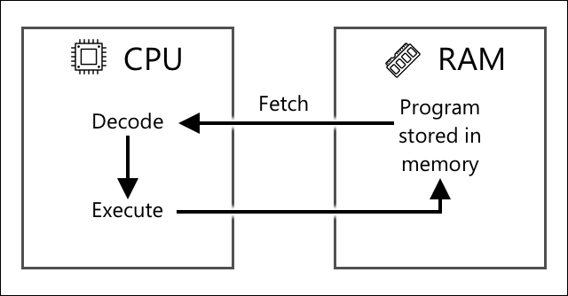

<!--
CO_OP_TRANSLATOR_METADATA:
{
  "original_hash": "9dd7f645ad1c6f20b72fee512987f772",
  "translation_date": "2025-08-27T22:52:38+00:00",
  "source_file": "1-getting-started/lessons/2-deeper-dive/README.md",
  "language_code": "tl"
}
-->
# Mas Malalim na Pagsisid sa IoT

> Sketchnote ni [Nitya Narasimhan](https://github.com/nitya). I-click ang imahe para sa mas malaking bersyon.

Ang araling ito ay itinuro bilang bahagi ng [Hello IoT series](https://youtube.com/playlist?list=PLmsFUfdnGr3xRts0TIwyaHyQuHaNQcb6-) mula sa [Microsoft Reactor](https://developer.microsoft.com/reactor/?WT.mc_id=academic-17441-jabenn). Ang aralin ay itinuro sa 2 video - isang 1 oras na leksyon, at isang 1 oras na office hour na mas malalim na tinalakay ang mga bahagi ng aralin at sinagot ang mga tanong.

> 🎥 I-click ang mga imahe sa itaas upang mapanood ang mga video

## Pre-lecture Quiz

[Pre-lecture quiz](https://black-meadow-040d15503.1.azurestaticapps.net/quiz/3)

## Panimula

Ang araling ito ay mas malalim na tatalakayin ang ilang mga konsepto na natalakay sa nakaraang aralin.

Sa araling ito, tatalakayin natin ang:

* [Mga Bahagi ng isang IoT Application](../../../../../1-getting-started/lessons/2-deeper-dive)
* [Mas Malalim na Pagsisid sa Microcontrollers](../../../../../1-getting-started/lessons/2-deeper-dive)
* [Mas Malalim na Pagsisid sa Single-board Computers](../../../../../1-getting-started/lessons/2-deeper-dive)

## Mga Bahagi ng isang IoT Application

Ang dalawang pangunahing bahagi ng isang IoT application ay ang *Internet* at ang *thing* (bagay). Tingnan natin ang dalawang bahaging ito nang mas detalyado.

### Ang Bagay (The Thing)

Ang **Bagay** sa IoT ay tumutukoy sa isang device na maaaring makipag-ugnayan sa pisikal na mundo. Ang mga device na ito ay karaniwang maliliit, murang mga computer na tumatakbo sa mababang bilis at gumagamit ng mababang enerhiya - halimbawa, simpleng microcontrollers na may kilobytes ng RAM (kumpara sa gigabytes sa isang PC) na tumatakbo sa ilang daang megahertz (kumpara sa gigahertz sa isang PC), ngunit minsan ay gumagamit ng napakaliit na enerhiya na maaari silang tumakbo nang ilang linggo, buwan, o kahit taon gamit lamang ang mga baterya.

Ang mga device na ito ay nakikipag-ugnayan sa pisikal na mundo, alinman sa pamamagitan ng paggamit ng mga sensor upang mangolekta ng data mula sa kanilang paligid o sa pamamagitan ng pagkontrol sa mga output o actuators upang gumawa ng mga pisikal na pagbabago. Ang karaniwang halimbawa nito ay isang smart thermostat - isang device na may temperature sensor, isang paraan upang itakda ang nais na temperatura tulad ng dial o touchscreen, at isang koneksyon sa heating o cooling system na maaaring i-on kapag ang natukoy na temperatura ay wala sa nais na saklaw. Ang temperature sensor ay natutukoy na masyadong malamig ang silid at ang actuator ay nagbubukas ng heating.

Mayroong napakaraming iba't ibang bagay na maaaring kumilos bilang IoT devices, mula sa dedikadong hardware na nakakaramdam ng isang bagay, hanggang sa mga general-purpose na device, kahit ang iyong smartphone! Ang isang smartphone ay maaaring gumamit ng mga sensor upang matukoy ang mundo sa paligid nito, at mga actuators upang makipag-ugnayan sa mundo - halimbawa, gamit ang GPS sensor upang matukoy ang iyong lokasyon at isang speaker upang magbigay ng mga direksyon sa isang destinasyon.

✅ Mag-isip ng iba pang mga sistema sa paligid mo na nagbabasa ng data mula sa isang sensor at ginagamit ito upang gumawa ng mga desisyon. Ang isang halimbawa ay ang thermostat sa isang oven. Makakahanap ka pa ba ng iba?

### Ang Internet

Ang **Internet** na bahagi ng isang IoT application ay binubuo ng mga application na maaaring konektahan ng IoT device upang magpadala at tumanggap ng data, pati na rin ang iba pang mga application na maaaring magproseso ng data mula sa IoT device at tumulong sa paggawa ng mga desisyon kung anong mga kahilingan ang ipapadala sa mga actuator ng IoT device.

Ang isang tipikal na setup ay maaaring mayroong isang uri ng cloud service na kinokonektahan ng IoT device, at ang cloud service na ito ang humahawak ng mga bagay tulad ng seguridad, pati na rin ang pagtanggap ng mga mensahe mula sa IoT device, at pagpapadala ng mga mensahe pabalik sa device. Ang cloud service na ito ay maaaring konektado rin sa iba pang mga application na maaaring magproseso o mag-imbak ng sensor data, o gumamit ng sensor data kasama ng data mula sa ibang mga sistema upang gumawa ng mga desisyon.

Ang mga device ay hindi rin palaging direktang kumokonekta sa Internet sa pamamagitan ng WiFi o wired connections. Ang ilang mga device ay gumagamit ng mesh networking upang makipag-usap sa isa't isa gamit ang mga teknolohiya tulad ng Bluetooth, na kumokonekta sa pamamagitan ng isang hub device na may koneksyon sa Internet.

Sa halimbawa ng isang smart thermostat, ang thermostat ay kokonekta gamit ang home WiFi sa isang cloud service na tumatakbo sa ulap. Ipapaabot nito ang temperature data sa cloud service na ito, at mula doon ay isusulat ito sa isang database na nagbibigay-daan sa may-ari ng bahay na suriin ang kasalukuyan at nakaraang temperatura gamit ang isang phone app. Ang isa pang serbisyo sa ulap ay malalaman kung anong temperatura ang nais ng may-ari ng bahay, at magpapadala ng mga mensahe pabalik sa IoT device sa pamamagitan ng cloud service upang sabihan ang heating system na mag-on o mag-off.

Ang mas matalinong bersyon nito ay maaaring gumamit ng AI sa ulap gamit ang data mula sa iba pang mga sensor na konektado sa iba pang IoT devices tulad ng occupancy sensors na natutukoy kung aling mga silid ang ginagamit, pati na rin ang data tulad ng panahon at kahit ang iyong kalendaryo, upang gumawa ng mga desisyon kung paano itatakda ang temperatura sa isang matalinong paraan. Halimbawa, maaari nitong patayin ang heating kung mababasa mula sa iyong kalendaryo na ikaw ay nasa bakasyon, o patayin ang heating sa bawat silid depende sa kung aling mga silid ang ginagamit mo, natututo mula sa data upang maging mas tumpak sa paglipas ng panahon.

✅ Anong iba pang data ang maaaring makatulong upang gawing mas matalino ang isang Internet-connected thermostat?

### IoT sa Edge

Bagaman ang I sa IoT ay nangangahulugang Internet, ang mga device na ito ay hindi kailangang kumonekta sa Internet. Sa ilang mga kaso, ang mga device ay maaaring kumonekta sa 'edge' devices - mga gateway device na tumatakbo sa iyong lokal na network na nangangahulugang maaari mong iproseso ang data nang hindi kinakailangang magpadala ng tawag sa Internet. Maaari itong maging mas mabilis kapag mayroon kang maraming data o mabagal na koneksyon sa Internet, pinapayagan kang tumakbo offline kung saan hindi posible ang koneksyon sa Internet tulad ng sa isang barko o sa isang lugar ng sakuna kapag tumutugon sa isang krisis pang-humanitarian, at pinapayagan kang panatilihing pribado ang data. Ang ilang mga device ay naglalaman ng processing code na nilikha gamit ang mga cloud tools at pinapatakbo ito nang lokal upang mangolekta at tumugon sa data nang hindi gumagamit ng koneksyon sa Internet upang gumawa ng desisyon.

Ang isang halimbawa nito ay isang smart home device tulad ng Apple HomePod, Amazon Alexa, o Google Home, na makikinig sa iyong boses gamit ang mga AI model na sinanay sa ulap, ngunit tumatakbo nang lokal sa device. Ang mga device na ito ay 'nagigising' kapag ang isang tiyak na salita o parirala ay binigkas, at pagkatapos lamang ay ipapadala ang iyong sinasabi sa Internet para sa pagproseso. Ang device ay titigil sa pagpapadala ng boses sa isang naaangkop na punto tulad ng kapag natukoy nito ang isang pause sa iyong pagsasalita. Lahat ng iyong sinasabi bago gisingin ang device gamit ang wake word, at lahat ng iyong sinasabi pagkatapos tumigil ang device sa pakikinig ay hindi ipapadala sa Internet sa provider ng device, at samakatuwid ay mananatiling pribado.

✅ Mag-isip ng iba pang mga sitwasyon kung saan mahalaga ang privacy kaya mas mainam na gawin ang pagproseso ng data sa edge kaysa sa cloud. Bilang pahiwatig - mag-isip tungkol sa mga IoT device na may mga camera o iba pang imaging device sa kanila.

### Seguridad ng IoT

Sa anumang koneksyon sa Internet, mahalaga ang seguridad. May isang lumang biro na 'ang S sa IoT ay nangangahulugang Security' - walang 'S' sa IoT, na nagpapahiwatig na ito ay hindi ligtas.

Ang mga IoT device ay kumokonekta sa isang cloud service, at samakatuwid ay kasing ligtas lamang ng cloud service na iyon - kung ang iyong cloud service ay nagpapahintulot sa anumang device na kumonekta, maaaring maipadala ang malisyosong data, o maaaring maganap ang mga virus attack. Maaari itong magkaroon ng napaka-totoong epekto sa mundo dahil ang mga IoT device ay nakikipag-ugnayan at kumokontrol sa iba pang mga device. Halimbawa, ang [Stuxnet worm](https://wikipedia.org/wiki/Stuxnet) ay nagmanipula ng mga balbula sa mga centrifuge upang sirain ang mga ito. Ang mga hacker ay nakinabang din sa [mahinang seguridad upang ma-access ang mga baby monitor](https://www.npr.org/sections/thetwo-way/2018/06/05/617196788/s-c-mom-says-baby-monitor-was-hacked-experts-say-many-devices-are-vulnerable) at iba pang mga home surveillance device.

> 💁 Minsan ang mga IoT device at edge device ay tumatakbo sa isang network na ganap na hiwalay mula sa Internet upang mapanatili ang data na pribado at ligtas. Ito ay kilala bilang [air-gapping](https://wikipedia.org/wiki/Air_gap_(networking)).

## Mas Malalim na Pagsisid sa Microcontrollers

Sa nakaraang aralin, ipinakilala natin ang microcontrollers. Ngayon, tingnan natin ito nang mas malalim.

### CPU

Ang CPU ang 'utak' ng microcontroller. Ito ang processor na nagpapatakbo ng iyong code at maaaring magpadala ng data sa at tumanggap ng data mula sa anumang nakakonektang device. Ang mga CPU ay maaaring maglaman ng isa o higit pang mga core - mahalagang isa o higit pang mga CPU na maaaring magtulungan upang patakbuhin ang iyong code.

Ang mga CPU ay umaasa sa isang orasan na tumitiktik ng maraming milyon o bilyong beses bawat segundo. Ang bawat tiktik, o cycle, ay nagsi-synchronize sa mga aksyon na maaaring gawin ng CPU. Sa bawat tiktik, maaaring magpatupad ang CPU ng isang utos mula sa isang programa, tulad ng pagkuha ng data mula sa isang panlabas na device o pagsasagawa ng isang mathematical calculation. Ang regular na cycle na ito ay nagbibigay-daan para sa lahat ng mga aksyon na makumpleto bago iproseso ang susunod na utos.

Ang mas mabilis na clock cycle, mas maraming utos ang maaaring iproseso bawat segundo, at samakatuwid mas mabilis ang CPU. Ang bilis ng CPU ay sinusukat sa [Hertz (Hz)](https://wikipedia.org/wiki/Hertz), isang standard na unit kung saan ang 1 Hz ay nangangahulugang isang cycle o clock tick bawat segundo.

> 🎓 Ang bilis ng CPU ay madalas na ibinibigay sa MHz o GHz. Ang 1MHz ay 1 milyong Hz, ang 1GHz ay 1 bilyong Hz.

> 💁 Ang mga CPU ay nagpapatupad ng mga programa gamit ang [fetch-decode-execute cycle](https://wikipedia.org/wiki/Instruction_cycle). Sa bawat clock tick, kukunin ng CPU ang susunod na utos mula sa memorya, ide-decode ito, pagkatapos ay ipapatupad ito tulad ng paggamit ng arithmetic logic unit (ALU) upang magdagdag ng 2 numero. Ang ilang mga pagpapatupad ay nangangailangan ng maraming tiktik upang tumakbo, kaya ang susunod na cycle ay tatakbo sa susunod na tiktik pagkatapos makumpleto ang utos.

Ang mga microcontroller ay may mas mababang clock speed kaysa sa mga desktop o laptop computer, o kahit sa karamihan ng mga smartphone. Halimbawa, ang Wio Terminal ay may CPU na tumatakbo sa 120MHz o 120,000,000 cycles bawat segundo.

✅ Ang isang karaniwang PC o Mac ay may CPU na may maraming core na tumatakbo sa maraming GigaHertz, ibig sabihin ang clock ay tumitiktik ng bilyun-bilyong beses bawat segundo. Saliksikin ang clock speed ng iyong computer at ihambing kung gaano karaming beses itong mas mabilis kaysa sa Wio Terminal.

Ang bawat clock cycle ay kumokonsumo ng enerhiya at bumubuo ng init. Ang mas mabilis na tiktik, mas maraming enerhiya ang nakokonsumo at mas maraming init ang nabubuo. Ang mga PC ay may heat sinks at fans upang alisin ang init, kung wala ito ay mag-o-overheat at mag-shut down sa loob ng ilang segundo. Ang mga microcontroller ay kadalasang walang ganito dahil mas malamig ang kanilang takbo at samakatuwid mas mabagal. Ang mga PC ay tumatakbo gamit ang mains power o malalaking baterya sa loob ng ilang oras, ang mga microcontroller ay maaaring tumakbo nang ilang araw, buwan, o kahit taon gamit ang maliliit na baterya. Ang mga microcontroller ay maaari ring magkaroon ng mga core na tumatakbo sa iba't ibang bilis, lumilipat sa mas mabagal na low-power cores kapag mababa ang demand sa CPU upang mabawasan ang konsumo ng enerhiya.

> 💁 Ang ilang mga PC at Mac ay gumagamit na rin ng parehong halo ng mabilis na high-power cores at mas mabagal na low-power cores, lumilipat upang makatipid ng baterya. Halimbawa, ang M1 chip sa pinakabagong mga laptop ng Apple ay maaaring lumipat sa pagitan ng 4 na performance cores at 4 na efficiency cores upang i-optimize ang buhay ng baterya o bilis depende sa task na pinapatakbo.

✅ Mag-research ng kaunti: Basahin ang tungkol sa CPUs sa [Wikipedia CPU article](https://wikipedia.org/wiki/Central_processing_unit)

#### Gawain

Siyasatin ang Wio Terminal.

Kung gumagamit ka ng Wio Terminal para sa mga araling ito, subukang hanapin ang CPU. Hanapin ang *Hardware Overview* na seksyon ng [Wio Terminal product page](https://www.seeedstudio.com/Wio-Terminal-p-4509.html) para sa larawan ng mga internal nito, at subukang hanapin ang CPU sa pamamagitan ng malinaw na plastic window sa likod.

### Memorya

Ang mga microcontroller ay karaniwang may dalawang uri ng memorya - program memory at random-access memory (RAM).

Ang program memory ay non-volatile, ibig sabihin kung ano man ang nakasulat dito ay nananatili kahit walang kuryente sa device. Ito ang memorya na nag-iimbak ng iyong program code.

Ang RAM ay ang memorya na ginagamit ng programa upang tumakbo, naglalaman ng mga variable na inilalaan ng iyong programa at data na nakolekta mula sa mga peripherals. Ang RAM ay volatile, kapag nawala ang kuryente ang nilalaman nito ay nawawala, na epektibong nagre-reset sa iyong programa.
🎓 Ang memorya ng programa ay nag-iimbak ng iyong code at nananatili kahit walang kuryente.
🎓 Ang RAM ay ginagamit upang patakbuhin ang iyong programa at nare-reset kapag nawalan ng kuryente.

Tulad ng CPU, ang memorya sa isang microcontroller ay mas maliit nang maraming beses kumpara sa isang PC o Mac. Ang karaniwang PC ay maaaring may 8 Gigabytes (GB) ng RAM, o 8,000,000,000 bytes, kung saan ang bawat byte ay may sapat na espasyo upang mag-imbak ng isang letra o isang numero mula 0-255. Ang isang microcontroller ay karaniwang may Kilobytes (KB) ng RAM, kung saan ang isang kilobyte ay 1,000 bytes. Ang Wio terminal na nabanggit sa itaas ay may 192KB ng RAM, o 192,000 bytes - higit sa 40,000 beses na mas maliit kaysa sa karaniwang PC!

Ang diagram sa ibaba ay nagpapakita ng pagkakaiba sa laki sa pagitan ng 192KB at 8GB - ang maliit na tuldok sa gitna ay kumakatawan sa 192KB.

Ang imbakan ng programa ay mas maliit din kumpara sa isang PC. Ang karaniwang PC ay maaaring may 500GB na hard drive para sa imbakan ng programa, samantalang ang isang microcontroller ay maaaring may kilobytes o ilang megabytes (MB) lamang ng imbakan (1MB ay 1,000KB, o 1,000,000 bytes). Ang Wio terminal ay may 4MB ng imbakan ng programa.

✅ Mag-research ng kaunti: Gaano karaming RAM at imbakan ang mayroon ang computer na ginagamit mo upang basahin ito? Paano ito ikinukumpara sa isang microcontroller?

### Input/Output

Kailangan ng mga microcontroller ng input at output (I/O) na koneksyon upang magbasa ng data mula sa mga sensor at magpadala ng mga signal sa mga actuator. Karaniwan silang may ilang general-purpose input/output (GPIO) pins. Ang mga pin na ito ay maaaring i-configure sa software bilang input (tumatanggap ng signal) o output (nagpapadala ng signal).

🧠⬅️ Ang mga input pin ay ginagamit upang magbasa ng mga halaga mula sa mga sensor.

🧠➡️ Ang mga output pin ay nagpapadala ng mga utos sa mga actuator.

✅ Matututuhan mo pa ito sa susunod na aralin.

#### Gawain

Suriin ang Wio Terminal.

Kung gumagamit ka ng Wio Terminal para sa mga araling ito, hanapin ang GPIO pins. Hanapin ang seksyong *Pinout diagram* sa [Wio Terminal product page](https://www.seeedstudio.com/Wio-Terminal-p-4509.html) upang malaman kung aling mga pin ang alin. Ang Wio Terminal ay may kasamang sticker na maaari mong idikit sa likod na may mga numero ng pin, kaya idagdag ito ngayon kung hindi mo pa nagagawa.

### Pisikal na Laki

Karaniwang maliit ang mga microcontroller, at ang pinakamaliit, ang [Freescale Kinetis KL03 MCU ay kasya sa dimple ng isang golf ball](https://www.edn.com/tiny-arm-cortex-m0-based-mcu-shrinks-package/). Ang CPU lamang sa isang PC ay maaaring sukatin ng 40mm x 40mm, at hindi pa kasama ang mga heat sink at fan na kailangan upang matiyak na ang CPU ay tatakbo nang higit sa ilang segundo nang hindi nag-o-overheat, na mas malaki kaysa sa isang buong microcontroller. Ang Wio terminal developer kit na may microcontroller, case, screen, at iba't ibang koneksyon at mga bahagi ay hindi mas malaki kaysa sa isang Intel i9 CPU, at mas maliit pa kaysa sa CPU na may heat sink at fan!

| Device                          | Laki                  |
| ------------------------------- | --------------------- |
| Freescale Kinetis KL03          | 1.6mm x 2mm x 1mm     |
| Wio terminal                    | 72mm x 57mm x 12mm    |
| Intel i9 CPU, Heat sink at fan  | 136mm x 145mm x 103mm |

### Frameworks at Operating Systems

Dahil sa mababang bilis at laki ng memorya, ang mga microcontroller ay hindi nagpapatakbo ng operating system (OS) sa tradisyunal na kahulugan tulad ng desktop OS. Ang operating system na nagpapatakbo ng iyong computer (Windows, Linux, o macOS) ay nangangailangan ng maraming memorya at processing power upang patakbuhin ang mga gawain na hindi naman kailangan ng isang microcontroller. Tandaan na ang mga microcontroller ay karaniwang naka-program upang magsagawa ng isa o higit pang napaka-espesipikong gawain, hindi tulad ng isang general-purpose computer tulad ng PC o Mac na kailangang suportahan ang user interface, magpatugtog ng musika o pelikula, magbigay ng mga tool para sa pagsusulat ng dokumento o code, maglaro ng mga laro, o mag-browse sa Internet.

Upang mag-program ng microcontroller nang walang OS, kailangan mo ng mga tool upang mabuo ang iyong code sa paraang maaaring patakbuhin ng microcontroller, gamit ang mga API na maaaring makipag-usap sa anumang peripherals. Ang bawat microcontroller ay iba-iba, kaya karaniwang sinusuportahan ng mga tagagawa ang mga standard frameworks na nagbibigay-daan sa iyong sundin ang isang standard na 'recipe' upang mabuo ang iyong code at patakbuhin ito sa anumang microcontroller na sumusuporta sa framework na iyon.

Maaari kang mag-program ng mga microcontroller gamit ang isang OS - karaniwang tinatawag na real-time operating system (RTOS), dahil ang mga ito ay idinisenyo upang pangasiwaan ang pagpapadala ng data sa at mula sa mga peripherals sa real time. Ang mga operating system na ito ay napakagaan at nagbibigay ng mga tampok tulad ng:

* Multi-threading, na nagpapahintulot sa iyong code na magpatakbo ng higit sa isang bloke ng code nang sabay-sabay, alinman sa maraming core o sa pamamagitan ng pagpapalitan sa isang core.
* Networking upang makipag-ugnayan sa Internet nang ligtas.
* Mga graphical user interface (GUI) na bahagi para sa paggawa ng mga user interface (UI) sa mga device na may mga screen.

✅ Magbasa tungkol sa iba't ibang RTOS: [Azure RTOS](https://azure.microsoft.com/services/rtos/?WT.mc_id=academic-17441-jabenn), [FreeRTOS](https://www.freertos.org), [Zephyr](https://www.zephyrproject.org)

#### Arduino

[Arduino](https://www.arduino.cc) marahil ang pinakasikat na microcontroller framework, lalo na sa mga estudyante, hobbyist, at mga maker. Ang Arduino ay isang open source electronics platform na pinagsasama ang software at hardware. Maaari kang bumili ng mga Arduino compatible boards mula sa Arduino mismo o mula sa ibang mga tagagawa, pagkatapos ay mag-code gamit ang Arduino framework.

Ang mga Arduino board ay kino-code gamit ang C o C++. Ang paggamit ng C/C++ ay nagpapahintulot sa iyong code na ma-compile nang napakaliit at tumakbo nang mabilis, isang bagay na kinakailangan sa isang device na may limitadong resources tulad ng microcontroller. Ang core ng isang Arduino application ay tinatawag na sketch at ito ay C/C++ code na may 2 function - `setup` at `loop`. Kapag nag-start ang board, ang Arduino framework code ay tatakbo sa `setup` function nang isang beses, pagkatapos ay tatakbo ito sa `loop` function nang paulit-ulit hanggang sa mawalan ng kuryente.

Ang iyong setup code ay isusulat sa `setup` function, tulad ng pagkonekta sa WiFi at cloud services o pag-initialize ng mga pin para sa input at output. Ang iyong loop code naman ay maglalaman ng processing code, tulad ng pagbabasa mula sa isang sensor at pagpapadala ng halaga sa cloud. Karaniwan kang maglalagay ng delay sa bawat loop, halimbawa, kung gusto mo lamang magpadala ng sensor data tuwing 10 segundo, magdadagdag ka ng delay na 10 segundo sa dulo ng loop upang makatulog ang microcontroller, makatipid ng kuryente, at muling patakbuhin ang loop kapag kailangan.

✅ Ang program architecture na ito ay kilala bilang isang *event loop* o *message loop*. Maraming mga application ang gumagamit nito sa ilalim ng hood at ito ang standard para sa karamihan ng desktop applications na tumatakbo sa OSes tulad ng Windows, macOS, o Linux. Ang `loop` ay nakikinig para sa mga mensahe mula sa mga user interface components tulad ng mga button, o mga device tulad ng keyboard, at tumutugon sa mga ito. Maaari kang magbasa pa sa [artikulo tungkol sa event loop](https://wikipedia.org/wiki/Event_loop).

Ang Arduino ay nagbibigay ng mga standard libraries para sa pakikipag-ugnayan sa mga microcontroller at mga I/O pins, na may iba't ibang implementasyon sa ilalim ng hood upang tumakbo sa iba't ibang microcontroller. Halimbawa, ang [`delay` function](https://www.arduino.cc/reference/en/language/functions/time/delay/) ay magpapahinto sa programa sa loob ng isang tiyak na panahon, ang [`digitalRead` function](https://www.arduino.cc/reference/en/language/functions/digital-io/digitalread/) ay magbabasa ng halaga ng `HIGH` o `LOW` mula sa ibinigay na pin, anuman ang board kung saan tumatakbo ang code. Ang mga standard libraries na ito ay nangangahulugan na ang Arduino code na isinulat para sa isang board ay maaaring ma-recompile para sa anumang ibang Arduino board at tatakbo, basta't ang mga pin ay pareho at ang mga board ay sumusuporta sa parehong mga tampok.

Mayroong malaking ecosystem ng third-party Arduino libraries na nagpapahintulot sa iyo na magdagdag ng mga karagdagang tampok sa iyong Arduino projects, tulad ng paggamit ng mga sensor at actuator o pagkonekta sa cloud IoT services.

##### Gawain

Suriin ang Wio Terminal.

Kung gumagamit ka ng Wio Terminal para sa mga araling ito, balikan ang code na isinulat mo sa nakaraang aralin. Hanapin ang `setup` at `loop` function. I-monitor ang serial output para sa `loop` function na tinatawag nang paulit-ulit. Subukang magdagdag ng code sa `setup` function upang magsulat sa serial port at obserbahan na ang code na ito ay tinatawag lamang nang isang beses sa tuwing ire-reboot mo ang device. Subukang i-reboot ang iyong device gamit ang power switch sa gilid upang ipakita na ito ay tinatawag sa tuwing ire-reboot ang device.

## Mas Malalim na Pagsisiyasat sa Single-Board Computers

Sa nakaraang aralin, ipinakilala ang single-board computers. Ngayon, tingnan natin ito nang mas malalim.

### Raspberry Pi

Ang [Raspberry Pi Foundation](https://www.raspberrypi.org) ay isang charity mula sa UK na itinatag noong 2009 upang itaguyod ang pag-aaral ng computer science, lalo na sa antas ng paaralan. Bilang bahagi ng misyong ito, nag-develop sila ng isang single-board computer na tinatawag na Raspberry Pi. Ang mga Raspberry Pi ay kasalukuyang available sa 3 variant - isang full-size na bersyon, ang mas maliit na Pi Zero, at isang compute module na maaaring isama sa iyong panghuling IoT device.

Ang pinakabagong bersyon ng full-size Raspberry Pi ay ang Raspberry Pi 4B. Mayroon itong quad-core (4 core) CPU na tumatakbo sa 1.5GHz, 2, 4, o 8GB ng RAM, gigabit ethernet, WiFi, 2 HDMI ports na sumusuporta sa 4k screens, isang audio at composite video output port, USB ports (2 USB 2.0, 2 USB 3.0), 40 GPIO pins, isang camera connector para sa Raspberry Pi camera module, at isang SD card slot. Ang lahat ng ito ay nasa isang board na 88mm x 58mm x 19.5mm at pinapagana ng 3A USB-C power supply. Ang mga ito ay nagsisimula sa US$35, mas mura kaysa sa isang PC o Mac.

> 💁 Mayroon ding Pi400 all-in-one computer na may Pi4 na naka-built-in sa isang keyboard.

Ang Pi Zero ay mas maliit, na may mas mababang power. Mayroon itong single-core 1GHz CPU, 512MB ng RAM, WiFi (sa Zero W model), isang HDMI port, isang micro-USB port, 40 GPIO pins, isang camera connector para sa Raspberry Pi camera module, at isang SD card slot. Ito ay may sukat na 65mm x 30mm x 5mm, at napakaliit ng power consumption. Ang Zero ay US$5, habang ang W version na may WiFi ay US$10.

> 🎓 Ang mga CPU sa parehong ito ay ARM processors, hindi tulad ng Intel/AMD x86 o x64 processors na makikita sa karamihan ng mga PC at Mac. Ang mga ito ay katulad ng mga CPU na makikita sa ilang microcontroller, pati na rin sa halos lahat ng mobile phones, ang Microsoft Surface X, at ang bagong Apple Silicon-based Apple Macs.

Ang lahat ng variant ng Raspberry Pi ay nagpapatakbo ng bersyon ng Debian Linux na tinatawag na Raspberry Pi OS. Available ito bilang lite version na walang desktop, na perpekto para sa 'headless' na mga proyekto kung saan hindi mo kailangan ng screen, o isang full version na may full desktop environment, na may web browser, office applications, coding tools, at mga laro. Dahil ang OS ay isang bersyon ng Debian Linux, maaari kang mag-install ng anumang application o tool na tumatakbo sa Debian at ginawa para sa ARM processor sa loob ng Pi.

#### Gawain

Suriin ang Raspberry Pi.

Kung gumagamit ka ng Raspberry Pi para sa mga araling ito, magbasa tungkol sa iba't ibang hardware components sa board.

* Maaari mong makita ang mga detalye sa mga processors na ginamit sa [Raspberry Pi hardware documentation page](https://www.raspberrypi.org/documentation/hardware/raspberrypi/). Magbasa tungkol sa processor na ginamit sa Pi na ginagamit mo.
* Hanapin ang GPIO pins. Magbasa pa tungkol sa mga ito sa [Raspberry Pi GPIO documentation](https://www.raspberrypi.org/documentation/hardware/raspberrypi/gpio/README.md). Gamitin ang [GPIO Pin Usage guide](https://www.raspberrypi.org/documentation/usage/gpio/README.md) upang tukuyin ang iba't ibang pins sa iyong Pi.

### Pag-program ng Single-Board Computers

Ang single-board computers ay mga full computers na nagpapatakbo ng full OS. Nangangahulugan ito na may malawak na hanay ng mga programming languages, frameworks, at tools na maaari mong gamitin upang i-code ang mga ito, hindi tulad ng mga microcontroller na umaasa sa suporta para sa board sa mga framework tulad ng Arduino. Karamihan sa mga programming languages ay may libraries na maaaring mag-access sa GPIO pins upang magpadala at tumanggap ng data mula sa mga sensor at actuator.

✅ Anong mga programming languages ang pamilyar ka? Sinusuportahan ba ang mga ito sa Linux?

Ang pinakakaraniwang programming language para sa paggawa ng IoT applications sa isang Raspberry Pi ay Python. Mayroong malaking ecosystem ng hardware na idinisenyo para sa Pi, at halos lahat ng mga ito ay may kasamang kaukulang code na kinakailangan upang magamit ang mga ito bilang Python libraries. Ang ilan sa mga ecosystem na ito ay batay sa 'hats' - tinawag na ganoon dahil sila ay nakapatong sa ibabaw ng Pi tulad ng isang sumbrero at kumokonekta gamit ang isang malaking socket sa 40 GPIO pins. Ang mga hats na ito ay nagbibigay ng karagdagang kakayahan, tulad ng mga screen, sensor, remote-controlled cars, o mga adapter upang payagan kang mag-plug in ng mga sensor na may standardized cables.
### Paggamit ng single-board computers sa mga propesyonal na IoT deployment

Ang mga single-board computer ay ginagamit sa mga propesyonal na IoT deployment, hindi lamang bilang mga developer kit. Maaari itong magbigay ng makapangyarihang paraan upang kontrolin ang hardware at magpatakbo ng mga kumplikadong gawain tulad ng pagpapatakbo ng mga machine learning model. Halimbawa, mayroong [Raspberry Pi 4 compute module](https://www.raspberrypi.org/blog/raspberry-pi-compute-module-4/) na nagbibigay ng lahat ng kapangyarihan ng isang Raspberry Pi 4 ngunit nasa mas compact at mas murang anyo, na walang karamihan sa mga port, at idinisenyo upang mai-install sa custom na hardware.

---

## 🚀 Hamon

Ang hamon sa nakaraang aralin ay ilista ang pinakamaraming IoT device na makikita mo sa iyong bahay, paaralan, o lugar ng trabaho. Para sa bawat device sa listahang ito, sa tingin mo ba ay nakabatay ang mga ito sa microcontrollers, single-board computers, o kumbinasyon ng dalawa?

## Post-lecture quiz

[Post-lecture quiz](https://black-meadow-040d15503.1.azurestaticapps.net/quiz/4)

## Review at Pag-aaral sa Sarili

* Basahin ang [Arduino getting started guide](https://www.arduino.cc/en/Guide/Introduction) upang mas maunawaan ang Arduino platform.
* Basahin ang [introduction to the Raspberry Pi 4](https://www.raspberrypi.org/products/raspberry-pi-4-model-b/) upang matuto pa tungkol sa Raspberry Pi.
* Alamin pa ang tungkol sa ilang mga konsepto at akronim sa [What the FAQ are CPUs, MPUs, MCUs, and GPUs article in the Electrical Engineering Journal](https://www.eejournal.com/article/what-the-faq-are-cpus-mpus-mcus-and-gpus/).

✅ Gamitin ang mga gabay na ito, kasama ang mga gastos na ipinapakita sa pamamagitan ng pagsunod sa mga link sa [hardware guide](../../../hardware.md) upang magdesisyon kung anong hardware platform ang nais mong gamitin, o kung mas gusto mong gumamit ng virtual na device.

## Takdang Aralin

[Pagkumpara at pagkontrast ng microcontrollers at single-board computers](assignment.md)

---

**Paunawa**:  
Ang dokumentong ito ay isinalin gamit ang AI translation service na [Co-op Translator](https://github.com/Azure/co-op-translator). Bagama't sinisikap naming maging tumpak, tandaan na ang mga awtomatikong pagsasalin ay maaaring maglaman ng mga pagkakamali o hindi pagkakatugma. Ang orihinal na dokumento sa kanyang katutubong wika ang dapat ituring na opisyal na pinagmulan. Para sa mahalagang impormasyon, inirerekomenda ang propesyonal na pagsasalin ng tao. Hindi kami mananagot sa anumang hindi pagkakaunawaan o maling interpretasyon na maaaring magmula sa paggamit ng pagsasaling ito.