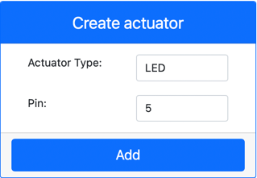

<!--
CO_OP_TRANSLATOR_METADATA:
{
  "original_hash": "9c640f93263fd9adbfda920739e09feb",
  "translation_date": "2025-08-27T22:33:48+00:00",
  "source_file": "1-getting-started/lessons/3-sensors-and-actuators/virtual-device-actuator.md",
  "language_code": "tl"
}
-->
# Gumawa ng nightlight - Virtual na IoT Hardware

Sa bahaging ito ng aralin, magdadagdag ka ng LED sa iyong virtual na IoT device at gagamitin ito upang lumikha ng isang nightlight.

## Virtual na Hardware

Ang nightlight ay nangangailangan ng isang actuator na gagawin gamit ang CounterFit app.

Ang actuator ay isang **LED**. Sa isang pisikal na IoT device, ito ay isang [light-emitting diode](https://wikipedia.org/wiki/Light-emitting_diode) na naglalabas ng liwanag kapag dumadaloy ang kuryente dito. Ito ay isang digital actuator na may dalawang estado: naka-on at naka-off. Ang pagpapadala ng halagang 1 ay magpapailaw sa LED, at ang 0 ay magpapapatay dito.

Ang lohika ng nightlight sa pseudo-code ay:

```output
Check the light level.
If the light is less than 300
    Turn the LED on
Otherwise
    Turn the LED off
```

### Idagdag ang actuator sa CounterFit

Upang gumamit ng virtual na LED, kailangan mo itong idagdag sa CounterFit app.

#### Gawain - idagdag ang actuator sa CounterFit

Idagdag ang LED sa CounterFit app.

1. Siguraduhing tumatakbo ang CounterFit web app mula sa nakaraang bahagi ng gawaing ito. Kung hindi, simulan ito at muling idagdag ang light sensor.

1. Gumawa ng LED:

    1. Sa *Create actuator* na kahon sa *Actuator* pane, i-drop down ang *Actuator type* na kahon at piliin ang *LED*.

    1. Itakda ang *Pin* sa *5*.

    1. Piliin ang **Add** na button upang lumikha ng LED sa Pin 5.

    

    Ang LED ay malilikha at lilitaw sa listahan ng mga actuator.

    

    Kapag nalikha na ang LED, maaari mong baguhin ang kulay nito gamit ang *Color* picker. Piliin ang **Set** na button upang baguhin ang kulay pagkatapos mong pumili.

### Iprograma ang nightlight

Ngayon ay maaari nang iprograma ang nightlight gamit ang CounterFit light sensor at LED.

#### Gawain - iprograma ang nightlight

Iprograma ang nightlight.

1. Buksan ang nightlight project sa VS Code na ginawa mo sa nakaraang bahagi ng gawaing ito. Patayin at muling likhain ang terminal upang masigurong tumatakbo ito gamit ang virtual environment kung kinakailangan.

1. Buksan ang `app.py` na file.

1. Idagdag ang sumusunod na code sa `app.py` na file upang mag-import ng kinakailangang library. Dapat itong idagdag sa itaas, sa ibaba ng iba pang `import` na linya.

    ```python
    from counterfit_shims_grove.grove_led import GroveLed
    ```

    Ang `from counterfit_shims_grove.grove_led import GroveLed` na pahayag ay nag-iimport ng `GroveLed` mula sa CounterFit Grove shim Python libraries. Ang library na ito ay may code upang makipag-ugnayan sa isang LED na nilikha sa CounterFit app.

1. Idagdag ang sumusunod na code pagkatapos ng deklarasyon ng `light_sensor` upang lumikha ng isang instance ng klase na namamahala sa LED:

    ```python
    led = GroveLed(5)
    ```

    Ang linyang `led = GroveLed(5)` ay lumilikha ng isang instance ng `GroveLed` na klase na nakakonekta sa pin **5** - ang CounterFit Grove pin kung saan nakakonekta ang LED.

1. Magdagdag ng tseke sa loob ng `while` loop, at bago ang `time.sleep` upang suriin ang antas ng liwanag at i-on o i-off ang LED:

    ```python
    if light < 300:
        led.on()
    else:
        led.off()
    ```

    Sinusuri ng code na ito ang halaga ng `light`. Kung ito ay mas mababa sa 300, tinatawag nito ang `on` na method ng `GroveLed` na klase na nagpapadala ng digital na halaga ng 1 sa LED, na nagpapailaw dito. Kung ang halaga ng liwanag ay mas mataas o katumbas ng 300, tinatawag nito ang `off` na method, na nagpapadala ng digital na halaga ng 0 sa LED, na nagpapapatay dito.

    > 💁 Ang code na ito ay dapat naka-indent sa parehong antas ng linyang `print('Light level:', light)` upang mapabilang sa loob ng while loop!

1. Mula sa VS Code Terminal, patakbuhin ang sumusunod upang patakbuhin ang iyong Python app:

    ```sh
    python3 app.py
    ```

    Ang mga halaga ng liwanag ay ipapakita sa console.

    ```output
    (.venv) ➜  GroveTest python3 app.py 
    Light level: 143
    Light level: 244
    Light level: 246
    Light level: 253
    ```

1. Baguhin ang *Value* o ang *Random* na mga setting upang baguhin ang antas ng liwanag sa itaas at ibaba ng 300. Ang LED ay mag-o-on at mag-o-off.


> 💁 Maaari mong mahanap ang code na ito sa [code-actuator/virtual-device](../../../../../1-getting-started/lessons/3-sensors-and-actuators/code-actuator/virtual-device) na folder.

😀 Tagumpay ang iyong nightlight program!

---

**Paunawa**:  
Ang dokumentong ito ay isinalin gamit ang AI translation service na [Co-op Translator](https://github.com/Azure/co-op-translator). Bagama't sinisikap naming maging tumpak, tandaan na ang mga awtomatikong pagsasalin ay maaaring maglaman ng mga pagkakamali o hindi pagkakatugma. Ang orihinal na dokumento sa kanyang katutubong wika ang dapat ituring na opisyal na pinagmulan. Para sa mahalagang impormasyon, inirerekomenda ang propesyonal na pagsasalin ng tao. Hindi kami mananagot sa anumang hindi pagkakaunawaan o maling interpretasyon na dulot ng paggamit ng pagsasaling ito.