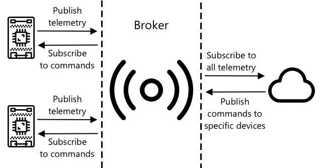

<!--
CO_OP_TRANSLATOR_METADATA:
{
  "original_hash": "71b5040e0b3472f1c0949c9b55f224c0",
  "translation_date": "2025-08-28T00:21:36+00:00",
  "source_file": "1-getting-started/lessons/4-connect-internet/README.md",
  "language_code": "tl"
}
-->
# Ikonekta ang Iyong Device sa Internet


> Sketchnote ni [Nitya Narasimhan](https://github.com/nitya). I-click ang imahe para sa mas malaking bersyon.

Ang araling ito ay itinuro bilang bahagi ng [Hello IoT series](https://youtube.com/playlist?list=PLmsFUfdnGr3xRts0TIwyaHyQuHaNQcb6-) mula sa [Microsoft Reactor](https://developer.microsoft.com/reactor/?WT.mc_id=academic-17441-jabenn). Ang aralin ay itinuro sa 2 video - isang 1 oras na leksyon, at isang 1 oras na office hour na mas malalim na tinalakay ang mga bahagi ng aralin at sinagot ang mga tanong.

[](https://youtu.be/O4dd172mZhs)

[](https://youtu.be/j-cVCzRDE2Q)

> 🎥 I-click ang mga imahe sa itaas upang panoorin ang mga video

## Pre-lecture Quiz

[Pre-lecture quiz](https://black-meadow-040d15503.1.azurestaticapps.net/quiz/7)

## Panimula

Ang **I** sa IoT ay nangangahulugang **Internet** - ang cloud connectivity at mga serbisyo na nagbibigay-daan sa maraming tampok ng mga IoT device, mula sa pagkolekta ng mga sukat mula sa mga sensor na nakakonekta sa device, hanggang sa pagpapadala ng mga mensahe upang kontrolin ang mga actuator. Karaniwang kumokonekta ang mga IoT device sa isang cloud IoT service gamit ang isang standard na communication protocol, at ang serbisyong ito ay konektado sa iba pang bahagi ng iyong IoT application, mula sa mga AI service para sa matalinong desisyon sa iyong data, hanggang sa mga web app para sa kontrol o pag-uulat.

> 🎓 Ang data na nakokolekta mula sa mga sensor at ipinapadala sa cloud ay tinatawag na telemetry.

Ang mga IoT device ay maaaring tumanggap ng mga mensahe mula sa cloud. Kadalasan, ang mga mensaheng ito ay naglalaman ng mga utos - mga tagubilin upang magsagawa ng isang aksyon alinman sa loob (tulad ng pag-reboot o pag-update ng firmware), o gamit ang isang actuator (tulad ng pag-on ng ilaw).

Ang araling ito ay nagpapakilala ng ilang communication protocol na maaaring gamitin ng mga IoT device upang kumonekta sa cloud, at ang mga uri ng data na maaari nilang ipadala o matanggap. Magkakaroon ka rin ng hands-on na karanasan sa mga ito, idadagdag ang internet control sa iyong nightlight, at ililipat ang LED control logic sa 'server' code na tumatakbo nang lokal.

Sa araling ito, tatalakayin natin ang:

* [Mga Communication Protocol](../../../../../1-getting-started/lessons/4-connect-internet)
* [Message Queueing Telemetry Transport (MQTT)](../../../../../1-getting-started/lessons/4-connect-internet)
* [Telemetry](../../../../../1-getting-started/lessons/4-connect-internet)
* [Mga Utos](../../../../../1-getting-started/lessons/4-connect-internet)

## Mga Communication Protocol

Mayroong ilang mga popular na communication protocol na ginagamit ng mga IoT device upang makipag-ugnayan sa Internet. Ang pinakapopular ay nakabatay sa publish/subscribe messaging sa pamamagitan ng isang uri ng broker. Ang mga IoT device ay kumokonekta sa broker at nagpa-publish ng telemetry at nag-subscribe sa mga utos. Ang mga cloud service ay kumokonekta rin sa broker at nag-subscribe sa lahat ng telemetry messages at nagpa-publish ng mga utos alinman sa mga partikular na device, o sa mga grupo ng device.



Ang MQTT ang pinakapopular na communication protocol para sa mga IoT device at tatalakayin ito sa araling ito. Ang iba pang mga protocol ay kinabibilangan ng AMQP at HTTP/HTTPS.

## Message Queueing Telemetry Transport (MQTT)

Ang [MQTT](http://mqtt.org) ay isang magaan, open standard messaging protocol na maaaring magpadala ng mga mensahe sa pagitan ng mga device. Ito ay dinisenyo noong 1999 upang subaybayan ang mga oil pipeline, bago ito inilabas bilang isang open standard 15 taon ang nakalipas ng IBM.

Ang MQTT ay may isang broker at maraming kliyente. Ang lahat ng kliyente ay kumokonekta sa broker, at ang broker ang nagre-route ng mga mensahe sa mga kaukulang kliyente. Ang mga mensahe ay niruruta gamit ang mga tinatawag na topic, sa halip na direktang ipadala sa isang indibidwal na kliyente. Ang isang kliyente ay maaaring mag-publish sa isang topic, at ang anumang kliyente na nag-subscribe sa topic na iyon ay makakatanggap ng mensahe.


✅ Mag-research. Kung marami kang IoT device, paano mo masisiguro na ang iyong MQTT broker ay kayang hawakan ang lahat ng mensahe?

### Ikonekta ang Iyong IoT Device sa MQTT

Ang unang bahagi ng pagdaragdag ng Internet control sa iyong nightlight ay ang pagkonekta nito sa isang MQTT broker.

#### Gawain

Ikonekta ang iyong device sa isang MQTT broker.

Sa bahaging ito ng aralin, ikokonekta mo ang iyong IoT nightlight sa internet upang ito ay makontrol nang malayuan. Sa susunod na bahagi ng araling ito, ang iyong IoT device ay magpapadala ng telemetry message sa pamamagitan ng MQTT sa isang public MQTT broker na may light level, kung saan ito ay kukunin ng ilang server code na iyong isusulat. Ang code na ito ay susuriin ang light level at magpapadala ng command message pabalik sa device na nagsasabi dito na i-on o i-off ang LED.

Ang totoong gamit ng ganitong setup ay maaaring mangolekta ng data mula sa maraming light sensor bago magdesisyon na i-on ang mga ilaw, sa isang lugar na may maraming ilaw, tulad ng isang stadium. Maaari nitong pigilan ang mga ilaw na ma-on kung ang isang sensor lamang ang natakpan ng ulap o ibon, ngunit ang iba pang mga sensor ay nakakakita pa rin ng sapat na liwanag.

✅ Anong iba pang mga sitwasyon ang mangangailangan ng data mula sa maraming sensor bago magpadala ng mga utos?

Sa halip na harapin ang mga komplikasyon ng pag-set up ng isang MQTT broker bilang bahagi ng gawaing ito, maaari kang gumamit ng isang public test server na nagpapatakbo ng [Eclipse Mosquitto](https://www.mosquitto.org), isang open-source MQTT broker. Ang test broker na ito ay pampublikong magagamit sa [test.mosquitto.org](https://test.mosquitto.org), at hindi nangangailangan ng account upang ma-set up, kaya't ito ay isang mahusay na tool para sa pag-test ng mga MQTT client at server.

> 💁 Ang test broker na ito ay pampubliko at hindi secure. Maaaring may ibang nakikinig sa iyong mga ipinapublish, kaya't hindi ito dapat gamitin sa anumang data na kailangang panatilihing pribado.


Sundin ang kaukulang hakbang sa ibaba upang ikonekta ang iyong device sa MQTT broker:

* [Arduino - Wio Terminal](wio-terminal-mqtt.md)
* [Single-board computer - Raspberry Pi/Virtual IoT device](single-board-computer-mqtt.md)

### Mas Malalim na Pagsusuri sa MQTT

Ang mga topic ay maaaring magkaroon ng hierarchy, at ang mga kliyente ay maaaring mag-subscribe sa iba't ibang antas ng hierarchy gamit ang wildcards. Halimbawa, maaari kang magpadala ng temperature telemetry messages sa `/telemetry/temperature` topic at humidity messages sa `/telemetry/humidity` topic, pagkatapos sa iyong cloud app mag-subscribe sa `/telemetry/*` topic upang matanggap ang parehong temperature at humidity telemetry messages.

Ang mga mensahe ay maaaring ipadala na may quality of service (QoS), na tumutukoy sa garantiya ng pagtanggap ng mensahe.

* At most once - ang mensahe ay ipinapadala nang isang beses lamang at ang kliyente at broker ay hindi gumagawa ng karagdagang hakbang upang kilalanin ang paghahatid (fire and forget).
* At least once - ang mensahe ay inuulit ng sender nang maraming beses hanggang sa matanggap ang pagkilala (acknowledged delivery).
* Exactly once - ang sender at receiver ay nagsasagawa ng dalawang antas ng handshake upang matiyak na isang kopya lamang ng mensahe ang matatanggap (assured delivery).

✅ Anong mga sitwasyon ang mangangailangan ng assured delivery message kaysa sa fire and forget message?

Bagama't ang pangalan ay Message Queueing (initials sa MQTT), hindi talaga ito sumusuporta sa message queues. Nangangahulugan ito na kung ang isang kliyente ay nag-disconnect, pagkatapos ay nag-reconnect, hindi nito matatanggap ang mga mensaheng ipinadala habang ito ay naka-disconnect, maliban sa mga mensaheng sinimulan na nitong iproseso gamit ang QoS process. Ang mga mensahe ay maaaring magkaroon ng retained flag na nakatakda sa kanila. Kung ito ay nakatakda, ang MQTT broker ay mag-iimbak ng huling mensaheng ipinadala sa isang topic na may flag na ito, at ipadala ito sa anumang kliyente na mag-subscribe sa topic sa hinaharap. Sa ganitong paraan, palaging makakakuha ang mga kliyente ng pinakabagong mensahe.

Sinusuportahan din ng MQTT ang keep alive function na nagche-check kung ang koneksyon ay buhay pa rin sa mahabang pagitan ng mga mensahe.

> 🦟 [Mosquitto mula sa Eclipse Foundation](https://mosquitto.org) ay may libreng MQTT broker na maaari mong patakbuhin upang mag-eksperimento sa MQTT, kasama ang isang public MQTT broker na maaari mong gamitin upang i-test ang iyong code, na naka-host sa [test.mosquitto.org](https://test.mosquitto.org).

Ang mga MQTT connection ay maaaring pampubliko at bukas, o naka-encrypt at secured gamit ang mga username at password, o mga certificate.

> 💁 Ang MQTT ay nakikipag-ugnayan sa TCP/IP, ang parehong underlying network protocol tulad ng HTTP, ngunit sa ibang port. Maaari mo ring gamitin ang MQTT sa websockets upang makipag-ugnayan sa mga web app na tumatakbo sa browser, o sa mga sitwasyon kung saan ang mga firewall o iba pang networking rules ay nagbabawal sa standard MQTT connections.

## Telemetry

Ang salitang telemetry ay nagmula sa mga salitang Griyego na nangangahulugang sukatin nang malayuan. Ang telemetry ay ang pagkilos ng pagkolekta ng data mula sa mga sensor at pagpapadala nito sa cloud.

> 💁 Ang isa sa mga pinakaunang telemetry device ay naimbento sa France noong 1874 at nagpadala ng real-time na ulat ng panahon at lalim ng niyebe mula sa Mont Blanc patungong Paris. Gumamit ito ng mga pisikal na wire dahil wala pang wireless technologies noong panahong iyon.

Balikan natin ang halimbawa ng smart thermostat mula sa Aralin 1.


Ang thermostat ay may mga temperature sensor upang mangolekta ng telemetry. Malamang na mayroon itong isang built-in na temperature sensor, at maaaring kumonekta sa maraming external temperature sensor gamit ang isang wireless protocol tulad ng [Bluetooth Low Energy](https://wikipedia.org/wiki/Bluetooth_Low_Energy) (BLE).

Halimbawa ng telemetry data na maaaring ipadala nito:

| Pangalan | Halaga | Paglalarawan |
| -------- | ------ | ------------ |
| `thermostat_temperature` | 18°C | Ang temperatura na nasukat ng built-in na temperature sensor ng thermostat |
| `livingroom_temperature` | 19°C | Ang temperatura na nasukat ng isang remote temperature sensor na pinangalanang `livingroom` upang tukuyin ang silid kung saan ito naroroon |
| `bedroom_temperature` | 21°C | Ang temperatura na nasukat ng isang remote temperature sensor na pinangalanang `bedroom` upang tukuyin ang silid kung saan ito naroroon |

Ang cloud service ay maaaring gumamit ng telemetry data na ito upang gumawa ng mga desisyon tungkol sa kung anong mga utos ang ipapadala upang kontrolin ang heating.

### Magpadala ng Telemetry mula sa Iyong IoT Device

Ang susunod na bahagi sa pagdaragdag ng Internet control sa iyong nightlight ay ang pagpapadala ng light level telemetry sa MQTT broker sa isang telemetry topic.

#### Gawain - magpadala ng telemetry mula sa iyong IoT device

Magpadala ng light level telemetry sa MQTT broker.

Ang data ay ipinapadala na naka-encode bilang JSON - pinaikli para sa JavaScript Object Notation, isang standard para sa pag-encode ng data sa text gamit ang key/value pairs.

✅ Kung hindi ka pa nakatagpo ng JSON dati, maaari kang matuto pa tungkol dito sa [JSON.org documentation](https://www.json.org/).

Sundin ang kaukulang hakbang sa ibaba upang magpadala ng telemetry mula sa iyong device papunta sa MQTT broker:

* [Arduino - Wio Terminal](wio-terminal-telemetry.md)
* [Single-board computer - Raspberry Pi/Virtual IoT device](single-board-computer-telemetry.md)

### Tumanggap ng Telemetry mula sa MQTT Broker

Walang saysay ang pagpapadala ng telemetry kung walang nakikinig dito. Ang light level telemetry ay nangangailangan ng isang bagay na nakikinig dito upang iproseso ang data. Ang 'server' code na ito ay ang uri ng code na ide-deploy mo sa isang cloud service bilang bahagi ng mas malaking IoT application, ngunit dito ay patatakbuhin mo ang code na ito nang lokal sa iyong computer (o sa iyong Pi kung doon ka mismo nagko-code). Ang server code ay binubuo ng isang Python app na nakikinig sa telemetry messages sa pamamagitan ng MQTT na may light levels. Sa susunod na bahagi ng araling ito, gagawin mo itong mag-reply gamit ang isang command message na may mga tagubilin upang i-on o i-off ang LED.

✅ Mag-research: Ano ang mangyayari sa mga MQTT message kung walang listener?

#### I-install ang Python at VS Code

Kung wala kang Python at VS Code na naka-install nang lokal, kakailanganin mong i-install ang mga ito upang ma-code ang server. Kung gumagamit ka ng virtual IoT device, o nagtatrabaho sa iyong Raspberry Pi, maaari mong laktawan ang hakbang na ito dahil dapat naka-install at naka-configure na ito.

##### Gawain - i-install ang Python at VS Code

I-install ang Python at VS Code.

1. I-install ang Python. Sumangguni sa [Python downloads page](https://www.python.org/downloads/) para sa mga tagubilin sa pag-install ng pinakabagong bersyon ng Python.

1. I-install ang Visual Studio Code (VS Code). Ito ang editor na gagamitin mo upang isulat ang iyong virtual device code sa Python. Sumangguni sa [VS Code documentation](https://code.visualstudio.com?WT.mc_id=academic-17441-jabenn) para sa mga tagubilin sa pag-install ng VS Code.
💁 Malaya kang gumamit ng anumang Python IDE o editor para sa mga araling ito kung mayroon kang paboritong tool, ngunit ang mga aralin ay magbibigay ng mga tagubilin batay sa paggamit ng VS Code.
1. I-install ang VS Code Pylance extension. Ito ay isang extension para sa VS Code na nagbibigay ng suporta sa Python language. Tingnan ang [Pylance extension documentation](https://marketplace.visualstudio.com/items?WT.mc_id=academic-17441-jabenn&itemName=ms-python.vscode-pylance) para sa mga tagubilin kung paano i-install ang extension na ito sa VS Code.

#### I-configure ang Python virtual environment

Isa sa mga makapangyarihang tampok ng Python ay ang kakayahang mag-install ng [pip packages](https://pypi.org) - mga package ng code na isinulat ng ibang tao at inilathala sa Internet. Maaari kang mag-install ng pip package sa iyong computer gamit ang isang command, at pagkatapos ay gamitin ang package na iyon sa iyong code. Gagamitin mo ang pip upang mag-install ng package para makipag-ugnayan gamit ang MQTT.

Sa default, kapag nag-install ka ng package, ito ay magiging available kahit saan sa iyong computer, at maaaring magdulot ito ng mga problema sa mga bersyon ng package - tulad ng isang application na umaasa sa isang bersyon ng package na maaaring masira kapag nag-install ka ng bagong bersyon para sa ibang application. Upang maiwasan ang problemang ito, maaari kang gumamit ng [Python virtual environment](https://docs.python.org/3/library/venv.html), na karaniwang isang kopya ng Python sa isang dedikadong folder, at kapag nag-install ka ng pip packages, ang mga ito ay mai-install lamang sa folder na iyon.

##### Gawain - i-configure ang Python virtual environment

I-configure ang Python virtual environment at i-install ang MQTT pip packages.

1. Mula sa iyong terminal o command line, patakbuhin ang sumusunod sa isang lokasyon na iyong napili upang lumikha at mag-navigate sa isang bagong direktoryo:

    ```sh
    mkdir nightlight-server
    cd nightlight-server
    ```

1. Ngayon, patakbuhin ang sumusunod upang lumikha ng virtual environment sa `.venv` folder:

    ```sh
    python3 -m venv .venv
    ```

    > 💁 Kailangan mong tahasang tawagin ang `python3` upang lumikha ng virtual environment sakaling mayroon kang naka-install na Python 2 bukod sa Python 3 (ang pinakabagong bersyon). Kung mayroon kang naka-install na Python 2, ang pagtawag sa `python` ay gagamit ng Python 2 sa halip na Python 3.

1. I-activate ang virtual environment:

    * Sa Windows:
        * Kung gumagamit ka ng Command Prompt, o Command Prompt sa pamamagitan ng Windows Terminal, patakbuhin:

            ```cmd
            .venv\Scripts\activate.bat
            ```

        * Kung gumagamit ka ng PowerShell, patakbuhin:

            ```powershell
            .\.venv\Scripts\Activate.ps1
            ```

    * Sa macOS o Linux, patakbuhin:

        ```cmd
        source ./.venv/bin/activate
        ```

    > 💁 Ang mga command na ito ay dapat patakbuhin mula sa parehong lokasyon kung saan mo pinatakbo ang command upang lumikha ng virtual environment. Hindi mo kailangang mag-navigate sa `.venv` folder, dapat mong palaging patakbuhin ang activate command at anumang mga command upang mag-install ng mga package o magpatakbo ng code mula sa folder kung saan ka naroroon noong nilikha mo ang virtual environment.

1. Kapag na-activate na ang virtual environment, ang default na `python` command ay tatakbo gamit ang bersyon ng Python na ginamit upang lumikha ng virtual environment. Patakbuhin ang sumusunod upang makuha ang bersyon:

    ```sh
    python --version
    ```

    Ang output ay magiging katulad ng sumusunod:

    ```output
    (.venv) ➜  nightlight-server python --version
    Python 3.9.1
    ```

    > 💁 Maaaring iba ang bersyon ng iyong Python - basta't ito ay bersyon 3.6 o mas mataas, ayos na. Kung hindi, burahin ang folder na ito, mag-install ng mas bagong bersyon ng Python, at subukang muli.

1. Patakbuhin ang sumusunod na mga command upang i-install ang pip package para sa [Paho-MQTT](https://pypi.org/project/paho-mqtt/), isang sikat na MQTT library.

    ```sh
    pip install paho-mqtt
    ```

    Ang pip package na ito ay mai-install lamang sa virtual environment, at hindi magiging available sa labas nito.

#### Isulat ang server code

Ngayon ay maaari nang isulat ang server code sa Python.

##### Gawain - isulat ang server code

Isulat ang server code.

1. Mula sa iyong terminal o command line, patakbuhin ang sumusunod sa loob ng virtual environment upang lumikha ng isang Python file na tinatawag na `app.py`:

    * Sa Windows, patakbuhin:

        ```cmd
        type nul > app.py
        ```

    * Sa macOS o Linux, patakbuhin:

        ```cmd
        touch app.py
        ```

1. Buksan ang kasalukuyang folder sa VS Code:

    ```sh
    code .
    ```

1. Kapag nag-launch ang VS Code, i-aactivate nito ang Python virtual environment. Makikita ito sa ibabang status bar:

    

1. Kung ang VS Code Terminal ay tumatakbo na kapag nagbukas ang VS Code, hindi nito maa-activate ang virtual environment sa terminal. Ang pinakamadaling gawin ay patayin ang terminal gamit ang **Kill the active terminal instance** button:

    

1. Mag-launch ng bagong VS Code Terminal sa pamamagitan ng pagpili sa *Terminal -> New Terminal*, o sa pagpindot ng `` CTRL+` ``. Ang bagong terminal ay maglo-load ng virtual environment, na may tawag upang i-activate ito na lalabas sa terminal. Ang pangalan ng virtual environment (`.venv`) ay makikita rin sa prompt:

    ```output
    ➜  nightlight-server source .venv/bin/activate
    (.venv) ➜  nightlight 
    ```

1. Buksan ang `app.py` file mula sa VS Code explorer at idagdag ang sumusunod na code:

    ```python
    import json
    import time
    
    import paho.mqtt.client as mqtt
    
    id = '<ID>'
    
    client_telemetry_topic = id + '/telemetry'
    client_name = id + 'nightlight_server'
    
    mqtt_client = mqtt.Client(client_name)
    mqtt_client.connect('test.mosquitto.org')
    
    mqtt_client.loop_start()
    
    def handle_telemetry(client, userdata, message):
        payload = json.loads(message.payload.decode())
        print("Message received:", payload)
    
    mqtt_client.subscribe(client_telemetry_topic)
    mqtt_client.on_message = handle_telemetry
    
    while True:
        time.sleep(2)
    ```

    Palitan ang `<ID>` sa linya 6 ng natatanging ID na ginamit mo noong nilikha ang iyong device code.

    ⚠️ Dapat itong **pareho** sa ID na ginamit mo sa iyong device, kung hindi, ang server code ay hindi mag-subscribe o mag-publish sa tamang topic.

    Ang code na ito ay lumilikha ng isang MQTT client na may natatanging pangalan, at kumokonekta sa *test.mosquitto.org* broker. Pagkatapos ay nagsisimula ito ng isang processing loop na tumatakbo sa isang background thread na nakikinig para sa mga mensahe sa anumang subscribed topics.

    Ang client ay nag-subscribe sa mga mensahe sa telemetry topic, at nagde-define ng isang function na tinatawag kapag may natanggap na mensahe. Kapag may natanggap na telemetry message, ang `handle_telemetry` function ay tinatawag, na nagpi-print ng natanggap na mensahe sa console.

    Sa wakas, isang infinite loop ang nagpapanatili sa application na tumatakbo. Ang MQTT client ay nakikinig sa mga mensahe sa isang background thread at tumatakbo habang ang pangunahing application ay tumatakbo.

1. Mula sa VS Code terminal, patakbuhin ang sumusunod upang patakbuhin ang iyong Python app:

    ```sh
    python app.py
    ```

    Ang app ay magsisimulang makinig sa mga mensahe mula sa IoT device.

1. Siguraduhing tumatakbo ang iyong device at nagpapadala ng telemetry messages. Ayusin ang light levels na nadedetect ng iyong pisikal o virtual na device. Ang mga natatanggap na mensahe ay ipapakita sa terminal.

    ```output
    (.venv) ➜  nightlight-server python app.py
    Message received: {'light': 0}
    Message received: {'light': 400}
    ```

    Ang `app.py` file sa nightlight virtual environment ay kailangang tumatakbo para sa `app.py` file sa nightlight-server virtual environment upang matanggap ang mga mensaheng ipinapadala.

> 💁 Maaari mong makita ang code na ito sa [code-server/server](../../../../../1-getting-started/lessons/4-connect-internet/code-server/server) folder.

### Gaano kadalas dapat magpadala ng telemetry?

Isang mahalagang konsiderasyon sa telemetry ay kung gaano kadalas dapat sukatin at ipadala ang data? Ang sagot ay - depende. Kung madalas kang magsukat, mas mabilis kang makakatugon sa mga pagbabago, ngunit mas malaki ang magagamit mong power, bandwidth, at cloud resources.

Halimbawa, para sa isang thermostat, ang pagsukat tuwing ilang minuto ay maaaring sapat na dahil hindi madalas magbago ang temperatura. Ngunit kung susukatin mo ito bawat segundo, magkakaroon ka ng libu-libong hindi kinakailangang ulit-ulit na sukat na maaaring magdulot ng problema sa bandwidth at dagdag na gastos sa cloud computing resources.

Sa kabilang banda, kung nagmo-monitor ka ng data mula sa isang makina sa pabrika na maaaring magdulot ng malaking pinsala kung masira, maaaring kailanganin ang pagsukat ng maraming beses kada segundo. Mas mabuting mag-aksaya ng bandwidth kaysa makaligtaan ang telemetry na nagpapahiwatig ng problema.

> 💁 Sa ganitong sitwasyon, maaaring isaalang-alang ang paggamit ng edge device upang iproseso muna ang telemetry bago ito ipadala sa Internet.

### Pagkawala ng koneksyon

Ang mga koneksyon sa Internet ay maaaring hindi maaasahan. Ano ang dapat gawin ng isang IoT device sa ganitong sitwasyon - dapat bang mawala ang data, o dapat ba itong itago hanggang maibalik ang koneksyon? Muli, ang sagot ay depende.

Halimbawa, para sa isang thermostat, maaaring hindi na mahalaga ang lumang data kapag may bagong sukat na. Ngunit para sa mga makinarya, maaaring kailangang itago ang data para sa pagsusuri ng mga trend o anomaly detection.

Ang mga IoT device designer ay dapat ding isaalang-alang kung ang device ay maaaring magamit kahit walang koneksyon sa Internet, tulad ng paggawa ng limitadong desisyon para sa isang smart thermostat.

[](https://twitter.com/internetofshit/status/1315736960082808832)

Para sa MQTT, ang device at server code ang kailangang magtiyak ng tamang paghahatid ng mga mensahe, tulad ng pag-require ng reply sa bawat mensahe o pag-queue ng mga mensahe para ipadala muli kapag naibalik ang koneksyon.

## Mga Command

Ang mga command ay mga mensaheng ipinapadala mula sa cloud papunta sa device upang magbigay ng utos. Halimbawa, maaaring utusan ng cloud ang isang thermostat na buksan ang heating base sa telemetry data.


### Magpadala ng mga command sa MQTT broker

Ang susunod na hakbang para sa Internet-controlled nightlight ay ang pagpapadala ng command mula sa server papunta sa IoT device upang kontrolin ang ilaw base sa light levels.

1. Buksan ang server code sa VS Code.

1. Idagdag ang sumusunod na linya pagkatapos ng deklarasyon ng `client_telemetry_topic` upang tukuyin ang topic kung saan magpapadala ng mga command:

    ```python
    server_command_topic = id + '/commands'
    ```

1. Idagdag ang sumusunod na code sa dulo ng `handle_telemetry` function:

    ```python
    command = { 'led_on' : payload['light'] < 300 }
    print("Sending message:", command)
    
    client.publish(server_command_topic, json.dumps(command))
    ```

    Ang code na ito ay nagpapadala ng JSON message sa command topic na may value ng `led_on` na true o false depende kung ang light level ay mas mababa sa 300 o hindi. Kapag mas mababa sa 300, true ang ipapadala upang buksan ang LED.

1. Patakbuhin ang code tulad ng dati.

1. Ayusin ang light levels na nadedetect ng iyong device. Ang mga natatanggap na mensahe at ipinapadalang command ay makikita sa terminal:

    ```output
    (.venv) ➜  nightlight-server python app.py
    Message received: {'light': 0}
    Sending message: {'led_on': True}
    Message received: {'light': 400}
    Sending message: {'led_on': False}
    ```

> 💁 Ang telemetry at commands ay ipinapadala sa isang topic bawat isa. Kung nais magpadala ng command sa isang partikular na device, maaaring gumamit ng maraming topics na may unique device ID, tulad ng `/commands/device1`, `/commands/device2`.

> 💁 Maaari mong makita ang code na ito sa [code-commands/server](../../../../../1-getting-started/lessons/4-connect-internet/code-commands/server) folder.

### I-handle ang mga command sa IoT device

Ngayon na nagpapadala na ng mga command mula sa server, maaari nang magdagdag ng code sa IoT device upang i-handle ang mga ito at kontrolin ang LED.

Sundin ang kaukulang hakbang upang makinig sa mga command mula sa MQTT broker:

* [Arduino - Wio Terminal](wio-terminal-commands.md)
* [Single-board computer - Raspberry Pi/Virtual IoT device](single-board-computer-commands.md)

Kapag naisulat at tumatakbo na ang code na ito, subukan ang pagbabago ng light levels. Tingnan ang output mula sa server at device, at panoorin ang LED habang binabago ang light levels.

### Pagkawala ng koneksyon

Ano ang dapat gawin ng cloud service kung kailangan nitong magpadala ng command sa IoT device na offline? Muli, ang sagot ay depende.

Kung ang pinakabagong command ay pumapalit sa nauna, maaaring hindi na kailangang ipadala muli ang naunang command. Ngunit kung kailangang iproseso ang mga command nang sunod-sunod, kailangang tiyakin na maipapadala ang mga ito sa tamang pagkakasunod-sunod kapag naibalik ang koneksyon.

✅ Paano masisiguro ng device o server code na ang mga command ay laging naipapadala at naihahandle nang tama sa tamang pagkakasunod-sunod gamit ang MQTT?

---

## 🚀 Hamon

Ang hamon sa huling tatlong aralin ay ilista ang pinakamaraming IoT devices na makikita mo sa iyong bahay, paaralan, o lugar ng trabaho. Tukuyin kung ang mga ito ay nakabatay sa microcontrollers o single-board computers, o kumbinasyon ng dalawa, at isipin kung anong mga sensors at actuators ang ginagamit ng mga ito.
Para sa mga device na ito, isipin kung anong mga mensahe ang maaaring ipinapadala o natatanggap nila. Anong telemetry ang kanilang ipinapadala? Anong mga mensahe o utos ang maaaring natatanggap nila? Sa tingin mo ba ay ligtas sila?

## Quiz pagkatapos ng lektura

[Quiz pagkatapos ng lektura](https://black-meadow-040d15503.1.azurestaticapps.net/quiz/8)

## Review at Pag-aaral ng Sarili

Magbasa pa tungkol sa MQTT sa [MQTT Wikipedia page](https://wikipedia.org/wiki/MQTT).

Subukang magpatakbo ng MQTT broker gamit ang [Mosquitto](https://www.mosquitto.org) at kumonekta dito mula sa iyong IoT device at server code.

> 💁 Tip - sa default na setting, hindi pinapayagan ng Mosquitto ang anonymous connections (iyon ay ang pagkonekta nang walang username at password), at hindi rin pinapayagan ang mga koneksyon mula sa labas ng computer kung saan ito tumatakbo.
> Maaari mo itong ayusin gamit ang isang [`mosquitto.conf` config file](https://www.mosquitto.org/man/mosquitto-conf-5.html) na may ganitong nilalaman:
>
> ```sh
> listener 1883 0.0.0.0
> allow_anonymous true
> ```

## Takdang Aralin

[Ikumpara at i-kontrast ang MQTT sa iba pang mga communication protocol](assignment.md)

---

**Paunawa**:  
Ang dokumentong ito ay isinalin gamit ang AI translation service na [Co-op Translator](https://github.com/Azure/co-op-translator). Bagama't sinisikap naming maging tumpak, tandaan na ang mga awtomatikong pagsasalin ay maaaring maglaman ng mga pagkakamali o hindi pagkakatugma. Ang orihinal na dokumento sa kanyang katutubong wika ang dapat ituring na opisyal na pinagmulan. Para sa mahalagang impormasyon, inirerekomenda ang propesyonal na pagsasalin ng tao. Hindi kami mananagot sa anumang hindi pagkakaunawaan o maling interpretasyon na dulot ng paggamit ng pagsasaling ito.