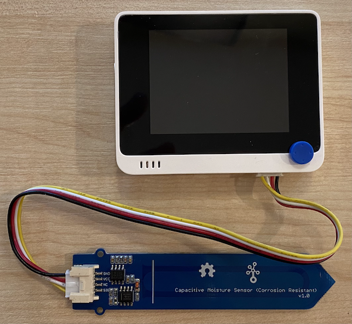

<!--
CO_OP_TRANSLATOR_METADATA:
{
  "original_hash": "0d55caa8c23d73635b7559102cd17b8a",
  "translation_date": "2025-08-28T01:17:53+00:00",
  "source_file": "2-farm/lessons/2-detect-soil-moisture/wio-terminal-soil-moisture.md",
  "language_code": "tl"
}
-->
# Sukatin ang Halumigmig ng Lupa - Wio Terminal

Sa bahaging ito ng aralin, magdadagdag ka ng capacitive soil moisture sensor sa iyong Wio Terminal, at babasahin ang mga halaga mula dito.

## Kagamitan

Kailangan ng Wio Terminal ng capacitive soil moisture sensor.

Ang sensor na gagamitin mo ay isang [Capacitive Soil Moisture Sensor](https://www.seeedstudio.com/Grove-Capacitive-Moisture-Sensor-Corrosion-Resistant.html), na sumusukat sa halumigmig ng lupa sa pamamagitan ng pag-detect ng capacitance ng lupa, isang katangian na nagbabago habang nagbabago ang halumigmig ng lupa. Kapag tumataas ang halumigmig ng lupa, bumababa ang boltahe.

Ito ay isang analog sensor, kaya't ikinakabit ito sa analog pins ng Wio Terminal, gamit ang onboard ADC upang lumikha ng halaga mula 0-1,023.

### Ikabit ang soil moisture sensor

Ang Grove soil moisture sensor ay maaaring ikabit sa configurable analog/digital port ng Wio Terminal.

#### Gawain - ikabit ang soil moisture sensor

Ikabit ang soil moisture sensor.


1. Ipasok ang isang dulo ng Grove cable sa socket ng soil moisture sensor. Isa lang ang tamang paraan ng pagpasok nito.

1. Kapag ang Wio Terminal ay hindi nakakonekta sa iyong computer o ibang power supply, ikabit ang kabilang dulo ng Grove cable sa Grove socket sa kanang bahagi ng Wio Terminal habang nakatingin ka sa screen. Ito ang socket na pinakamalayo sa power button.



1. Ipasok ang soil moisture sensor sa lupa. Mayroon itong 'highest position line' - isang puting linya sa sensor. Ipasok ang sensor hanggang sa linya ngunit huwag lalampas dito.


1. Maaari mo nang ikonekta ang Wio Terminal sa iyong computer.

## Iprograma ang soil moisture sensor

Ang Wio Terminal ay maaari nang iprograma upang magamit ang nakakabit na soil moisture sensor.

### Gawain - iprograma ang soil moisture sensor

Iprograma ang device.

1. Gumawa ng bagong Wio Terminal project gamit ang PlatformIO. Tawagin ang proyektong ito na `soil-moisture-sensor`. Magdagdag ng code sa `setup` function upang i-configure ang serial port.

    > ⚠️ Maaari kang sumangguni sa [mga tagubilin para sa paggawa ng PlatformIO project sa project 1, lesson 1 kung kinakailangan](../../../1-getting-started/lessons/1-introduction-to-iot/wio-terminal.md#create-a-platformio-project).

1. Walang library para sa sensor na ito, sa halip maaari kang magbasa mula sa analog pin gamit ang built-in na Arduino [`analogRead`](https://www.arduino.cc/reference/en/language/functions/analog-io/analogread/) function. Simulan sa pag-configure ng analog pin para sa input upang mabasa ang mga halaga mula dito sa pamamagitan ng pagdaragdag ng sumusunod sa `setup` function.

    ```cpp
    pinMode(A0, INPUT);
    ```

    Sinet nito ang `A0` pin, ang pinagsamang analog/digital pin, bilang input pin na maaaring basahan ng boltahe.

1. Magdagdag ng sumusunod sa `loop` function upang basahin ang boltahe mula sa pin na ito:

    ```cpp
    int soil_moisture = analogRead(A0);
    ```

1. Sa ibaba ng code na ito, magdagdag ng sumusunod na code upang i-print ang halaga sa serial port:

    ```cpp
    Serial.print("Soil Moisture: ");
    Serial.println(soil_moisture);
    ```

1. Sa wakas, magdagdag ng delay sa dulo ng 10 segundo:

    ```cpp
    delay(10000);
    ```

1. I-build at i-upload ang code sa Wio Terminal.

    > ⚠️ Maaari kang sumangguni sa [mga tagubilin para sa paggawa ng PlatformIO project sa project 1, lesson 1 kung kinakailangan](../../../1-getting-started/lessons/1-introduction-to-iot/wio-terminal.md#write-the-hello-world-app).

1. Kapag na-upload na, maaari mong i-monitor ang halumigmig ng lupa gamit ang serial monitor. Magdagdag ng tubig sa lupa, o alisin ang sensor mula sa lupa, at tingnan ang pagbabago ng halaga.

    ```output
    > Executing task: platformio device monitor <
    
    --- Available filters and text transformations: colorize, debug, default, direct, hexlify, log2file, nocontrol, printable, send_on_enter, time
    --- More details at http://bit.ly/pio-monitor-filters
    --- Miniterm on /dev/cu.usbmodem1201  9600,8,N,1 ---
    --- Quit: Ctrl+C | Menu: Ctrl+T | Help: Ctrl+T followed by Ctrl+H ---
    Soil Moisture: 526
    Soil Moisture: 529
    Soil Moisture: 521
    Soil Moisture: 494
    Soil Moisture: 454
    Soil Moisture: 456
    Soil Moisture: 395
    Soil Moisture: 388
    Soil Moisture: 394
    Soil Moisture: 391
    ```

    Sa halimbawa ng output sa itaas, makikita mo ang pagbaba ng boltahe habang dinadagdagan ang tubig.

> 💁 Maaari mong makita ang code na ito sa [code/wio-terminal](../../../../../2-farm/lessons/2-detect-soil-moisture/code/wio-terminal) folder.

😀 Tagumpay ang iyong programa para sa soil moisture sensor!

---

**Paunawa**:  
Ang dokumentong ito ay isinalin gamit ang AI translation service na [Co-op Translator](https://github.com/Azure/co-op-translator). Bagama't sinisikap naming maging tumpak, tandaan na ang mga awtomatikong pagsasalin ay maaaring maglaman ng mga pagkakamali o hindi pagkakatugma. Ang orihinal na dokumento sa kanyang katutubong wika ang dapat ituring na opisyal na sanggunian. Para sa mahalagang impormasyon, inirerekomenda ang propesyonal na pagsasalin ng tao. Hindi kami mananagot sa anumang hindi pagkakaunawaan o maling interpretasyon na dulot ng paggamit ng pagsasaling ito.