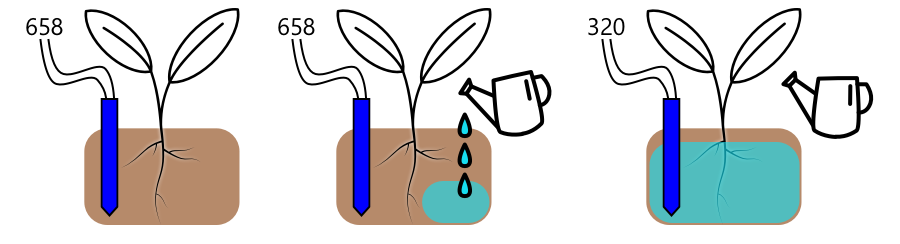

<!--
CO_OP_TRANSLATOR_METADATA:
{
  "original_hash": "f7bb24ba53fb627ddb38a8b24a05e594",
  "translation_date": "2025-08-27T21:34:41+00:00",
  "source_file": "2-farm/lessons/3-automated-plant-watering/README.md",
  "language_code": "tl"
}
-->
# Awtomatikong Pagdidilig ng Halaman


> Sketchnote ni [Nitya Narasimhan](https://github.com/nitya). I-click ang imahe para sa mas malaking bersyon.

Ang aralin na ito ay itinuro bilang bahagi ng [IoT for Beginners Project 2 - Digital Agriculture series](https://youtube.com/playlist?list=PLmsFUfdnGr3yCutmcVg6eAUEfsGiFXgcx) mula sa [Microsoft Reactor](https://developer.microsoft.com/reactor/?WT.mc_id=academic-17441-jabenn).

[](https://youtu.be/g9FfZwv9R58)

## Pre-lecture quiz

[Pre-lecture quiz](https://black-meadow-040d15503.1.azurestaticapps.net/quiz/13)

## Panimula

Sa nakaraang aralin, natutunan mo kung paano i-monitor ang moisture ng lupa. Sa aralin na ito, matututunan mo kung paano bumuo ng mga pangunahing bahagi ng isang awtomatikong sistema ng pagdidilig na tumutugon sa moisture ng lupa. Malalaman mo rin ang tungkol sa timing - kung paano ang mga sensor ay maaaring magtagal bago tumugon sa mga pagbabago, at kung paano ang mga actuator ay maaaring magtagal bago baguhin ang mga katangiang sinusukat ng mga sensor.

Sa aralin na ito, tatalakayin natin:

* [Kontrolin ang mga high power device mula sa isang low power IoT device](../../../../../2-farm/lessons/3-automated-plant-watering)
* [Kontrolin ang isang relay](../../../../../2-farm/lessons/3-automated-plant-watering)
* [Kontrolin ang iyong halaman gamit ang MQTT](../../../../../2-farm/lessons/3-automated-plant-watering)
* [Timing ng sensor at actuator](../../../../../2-farm/lessons/3-automated-plant-watering)
* [Magdagdag ng timing sa iyong plant control server](../../../../../2-farm/lessons/3-automated-plant-watering)

## Kontrolin ang mga high power device mula sa isang low power IoT device

Ang mga IoT device ay gumagamit ng mababang boltahe. Bagama't sapat ito para sa mga sensor at low-power actuator tulad ng LEDs, masyadong mababa ito para kontrolin ang mas malalaking hardware, tulad ng water pump na ginagamit para sa irigasyon. Kahit ang maliliit na pump na maaaring gamitin para sa mga houseplant ay kumukuha ng masyadong maraming kuryente para sa isang IoT dev kit at maaaring masira ang board.

> 🎓 Ang kasalukuyang sinusukat sa Amps (A) ay ang dami ng kuryenteng dumadaloy sa isang circuit. Ang boltahe ang nagbibigay ng tulak, ang kasalukuyang ang dami ng itinutulak. Maaari kang magbasa pa tungkol sa kasalukuyang sa [electric current page sa Wikipedia](https://wikipedia.org/wiki/Electric_current).

Ang solusyon dito ay ang pagkonekta ng pump sa isang panlabas na power supply, at paggamit ng actuator upang i-switch ang pump, katulad ng kung paano mo i-switch ang ilaw. Kailangan lamang ng kaunting kuryente (sa anyo ng enerhiya sa iyong katawan) para sa iyong daliri upang i-flip ang switch, at ito ay nagkokonekta sa ilaw sa mains electricity na tumatakbo sa 110v/240v.


> 🎓 [Mains electricity](https://wikipedia.org/wiki/Mains_electricity) ay tumutukoy sa kuryenteng dinadala sa mga tahanan at negosyo sa pamamagitan ng pambansang imprastraktura sa maraming bahagi ng mundo.

✅ Ang mga IoT device ay karaniwang nagbibigay ng 3.3V o 5V, na mas mababa sa 1 amp (1A) ng kasalukuyang. Ihambing ito sa mains electricity na kadalasang nasa 230V (120V sa North America at 100V sa Japan), at maaaring magbigay ng kuryente para sa mga device na kumukuha ng 30A.

Mayroong ilang mga actuator na maaaring gawin ito, kabilang ang mga mekanikal na device na maaari mong ikabit sa mga umiiral na switch na ginagaya ang daliri na binubuksan ang mga ito. Ang pinakasikat ay ang relay.

### Relays

Ang relay ay isang electromechanical switch na nagko-convert ng electrical signal sa mekanikal na galaw na nagbubukas ng switch. Ang core ng relay ay isang electromagnet.

> 🎓 [Electromagnets](https://wikipedia.org/wiki/Electromagnet) ay mga magnet na nilikha sa pamamagitan ng pagpapadaan ng kuryente sa isang coil ng wire. Kapag ang kuryente ay nakabukas, ang coil ay nagiging magnetized. Kapag ang kuryente ay naka-off, ang coil ay nawawala ang magnetismo nito.


Sa isang relay, ang control circuit ay nagpapagana sa electromagnet. Kapag ang electromagnet ay naka-on, hinahatak nito ang isang lever na gumagalaw sa isang switch, isinasara ang isang pares ng mga contact at kinukumpleto ang output circuit.


Kapag ang control circuit ay naka-off, ang electromagnet ay naka-off, pinakakawalan ang lever at binubuksan ang mga contact, pinapatay ang output circuit. Ang mga relay ay digital actuators - ang mataas na signal sa relay ay binubuksan ito, ang mababang signal ay pinapatay ito.

Ang output circuit ay maaaring gamitin upang magbigay ng kuryente sa karagdagang hardware, tulad ng isang sistema ng irigasyon. Ang IoT device ay maaaring i-on ang relay, kumpletuhin ang output circuit na nagbibigay ng kuryente sa sistema ng irigasyon, at nadidiligan ang mga halaman. Ang IoT device ay maaaring i-off ang relay, putulin ang kuryente sa sistema ng irigasyon, pinapatay ang tubig.


Sa video sa itaas, ang relay ay binubuksan. Ang LED sa relay ay nag-iilaw upang ipakita na ito ay naka-on (ang ilang relay boards ay may LEDs upang ipakita kung ang relay ay naka-on o naka-off), at ang kuryente ay ipinapadala sa pump, binubuksan ito at nagbubomba ng tubig sa halaman.

> 💁 Ang mga relay ay maaari ding gamitin upang lumipat sa pagitan ng dalawang output circuit sa halip na i-on at i-off ang isa. Habang gumagalaw ang lever, ito ay gumagalaw ng switch mula sa pagkumpleto ng isang output circuit patungo sa pagkumpleto ng ibang output circuit, kadalasang nagbabahagi ng karaniwang koneksyon sa kuryente, o karaniwang koneksyon sa ground.

✅ Mag-research: Mayroong maraming uri ng relay, na may mga pagkakaiba tulad ng kung ang control circuit ay binubuksan o pinapatay ang relay kapag ang kuryente ay inilapat, o maraming output circuit. Alamin ang tungkol sa mga iba't ibang uri na ito.

Kapag gumagalaw ang lever, kadalasan ay maririnig mo itong kumokonekta sa electromagnet na may malinaw na tunog ng pag-click.

> 💁 Ang relay ay maaaring i-wire upang ang paggawa ng koneksyon ay talagang nagpuputol ng kuryente sa relay, pinapatay ang relay, na pagkatapos ay nagpapadala ng kuryente sa relay na binubuksan itong muli, at iba pa. Nangangahulugan ito na ang relay ay magki-click nang napakabilis na gumagawa ng tunog ng buzzing. Ganito gumagana ang ilan sa mga unang buzzers na ginamit sa mga electric doorbells.

### Relay power

Ang electromagnet ay hindi nangangailangan ng maraming kuryente upang ma-activate at mahila ang lever, maaari itong kontrolin gamit ang 3.3V o 5V output mula sa isang IoT dev kit. Ang output circuit ay maaaring magdala ng mas maraming kuryente, depende sa relay, kabilang ang mains voltage o kahit na mas mataas na antas ng kuryente para sa pang-industriya na paggamit. Sa ganitong paraan, ang isang IoT dev kit ay maaaring kontrolin ang isang sistema ng irigasyon, mula sa isang maliit na pump para sa isang halaman, hanggang sa isang malaking pang-industriya na sistema para sa isang buong komersyal na sakahan.


Ang imahe sa itaas ay nagpapakita ng isang Grove relay. Ang control circuit ay kumokonekta sa isang IoT device at binubuksan o pinapatay ang relay gamit ang 3.3V o 5V. Ang output circuit ay may dalawang terminal, alinman sa isa ay maaaring power o ground. Ang output circuit ay maaaring humawak ng hanggang 250V sa 10A, sapat para sa iba't ibang mains-powered na device. Maaari kang makakuha ng mga relay na maaaring humawak ng mas mataas pang antas ng kuryente.


Sa imahe sa itaas, ang kuryente ay ibinibigay sa isang pump sa pamamagitan ng relay. Mayroong isang pulang wire na kumokonekta sa +5V terminal ng isang USB power supply sa isang terminal ng output circuit ng relay, at isa pang pulang wire na kumokonekta sa ibang terminal ng output circuit sa pump. Ang isang itim na wire ay kumokonekta sa pump sa ground sa USB power supply. Kapag ang relay ay binubuksan, ito ay kumukumpleto sa circuit, nagpapadala ng 5V sa pump, binubuksan ang pump.

## Kontrolin ang isang relay

Maaari mong kontrolin ang isang relay mula sa iyong IoT dev kit.

### Gawain - kontrolin ang isang relay

Sundin ang kaukulang gabay upang kontrolin ang isang relay gamit ang iyong IoT device:

* [Arduino - Wio Terminal](wio-terminal-relay.md)
* [Single-board computer - Raspberry Pi](pi-relay.md)
* [Single-board computer - Virtual device](virtual-device-relay.md)

## Kontrolin ang iyong halaman gamit ang MQTT

Sa ngayon ang iyong relay ay direktang kinokontrol ng IoT device batay sa isang solong soil moisture reading. Sa isang komersyal na sistema ng irigasyon, ang control logic ay magiging sentralisado, na nagpapahintulot dito na gumawa ng mga desisyon sa pagdidilig gamit ang data mula sa maraming sensor, at nagpapahintulot sa anumang configuration na mabago sa isang lugar lamang. Upang gayahin ito, maaari mong kontrolin ang relay gamit ang MQTT.

### Gawain - kontrolin ang relay gamit ang MQTT

1. Idagdag ang kaukulang MQTT libraries/pip packages at code sa iyong `soil-moisture-sensor` project upang kumonekta sa MQTT. Pangalanan ang client ID bilang `soilmoisturesensor_client` na may prefix na iyong ID.

    > ⚠️ Maaari kang sumangguni sa [mga tagubilin para sa pagkonekta sa MQTT sa project 1, lesson 4 kung kinakailangan](../../../1-getting-started/lessons/4-connect-internet/README.md#connect-your-iot-device-to-mqtt).

1. Idagdag ang kaukulang device code upang magpadala ng telemetry gamit ang soil moisture settings. Para sa telemetry message, pangalanan ang property na `soil_moisture`.

    > ⚠️ Maaari kang sumangguni sa [mga tagubilin para sa pagpapadala ng telemetry sa MQTT sa project 1, lesson 4 kung kinakailangan](../../../1-getting-started/lessons/4-connect-internet/README.md#send-telemetry-from-your-iot-device).

1. Gumawa ng lokal na server code upang mag-subscribe sa telemetry at magpadala ng command upang kontrolin ang relay sa isang folder na tinatawag na `soil-moisture-sensor-server`. Pangalanan ang property sa command message na `relay_on`, at itakda ang client ID bilang `soilmoisturesensor_server` na may prefix na iyong ID. Panatilihin ang parehong istruktura tulad ng server code na isinulat mo para sa project 1, lesson 4 dahil idaragdag mo ang code na ito sa ibang bahagi ng aralin.

    > ⚠️ Maaari kang sumangguni sa [mga tagubilin para sa pagpapadala ng telemetry sa MQTT](../../../1-getting-started/lessons/4-connect-internet/README.md#write-the-server-code) at [pagpapadala ng mga command sa MQTT](../../../1-getting-started/lessons/4-connect-internet/README.md#send-commands-to-the-mqtt-broker) sa project 1, lesson 4 kung kinakailangan.

1. Idagdag ang kaukulang device code upang kontrolin ang relay mula sa natanggap na mga command, gamit ang property na `relay_on` mula sa message. Magpadala ng true para sa `relay_on` kung ang `soil_moisture` ay mas mataas sa 450, kung hindi ay magpadala ng false, katulad ng logic na idinagdag mo para sa IoT device kanina.

    > ⚠️ Maaari kang sumangguni sa [mga tagubilin para sa pagtugon sa mga command mula sa MQTT sa project 1, lesson 4 kung kinakailangan](../../../1-getting-started/lessons/4-connect-internet/README.md#handle-commands-on-the-iot-device).

> 💁 Maaari mong makita ang code na ito sa [code-mqtt](../../../../../2-farm/lessons/3-automated-plant-watering/code-mqtt) folder.

Siguraduhing tumatakbo ang code sa iyong device at lokal na server, at subukan ito sa pamamagitan ng pagbabago ng mga antas ng soil moisture, alinman sa pamamagitan ng pagbabago ng mga value na ipinapadala ng virtual sensor, o sa pamamagitan ng pagbabago ng mga antas ng moisture ng lupa sa pamamagitan ng pagdaragdag ng tubig o pag-aalis ng sensor mula sa lupa.

## Timing ng sensor at actuator

Sa lesson 3, gumawa ka ng nightlight - isang LED na nagbubukas kapag mababang antas ng liwanag ang nakita ng light sensor. Ang light sensor ay agad na nakakita ng pagbabago sa antas ng liwanag, at ang device ay mabilis na tumugon, limitado lamang ng haba ng delay sa `loop` function o `while True:` loop. Bilang isang IoT developer, hindi mo palaging maaasahan ang ganitong kabilis na feedback loop.

### Timing para sa soil moisture

Kung ginawa mo ang nakaraang aralin sa soil moisture gamit ang isang physical sensor, mapapansin mo na tumagal ng ilang segundo bago bumaba ang soil moisture reading pagkatapos mong diligan ang iyong halaman. Hindi ito dahil mabagal ang sensor, kundi dahil tumatagal ang tubig upang sumipsip sa lupa.
💁 Kung nagdilig ka nang masyadong malapit sa sensor, maaaring napansin mong bumaba agad ang pagbabasa, tapos bumalik ulit - ito ay sanhi ng tubig na malapit sa sensor na kumakalat sa iba pang bahagi ng lupa, na nagbabawas ng kahalumigmigan ng lupa sa paligid ng sensor.


Sa diagram sa itaas, ang sukat ng soil moisture ay nagpapakita ng 658. Diniligan ang halaman, ngunit hindi agad nagbabago ang sukat na ito dahil hindi pa naaabot ng tubig ang sensor. Maaaring matapos ang pagdidilig bago pa maabot ng tubig ang sensor, at saka pa lamang bababa ang halaga upang ipakita ang bagong antas ng moisture.

Kung nagsusulat ka ng code para kontrolin ang isang irrigation system gamit ang relay batay sa antas ng soil moisture, kailangan mong isaalang-alang ang delay na ito at magdagdag ng mas matalinong timing sa iyong IoT device.

✅ Maglaan ng oras upang pag-isipan kung paano mo ito magagawa.

### Kontrolin ang timing ng sensor at actuator

Isipin na ikaw ay inatasang bumuo ng isang irrigation system para sa isang sakahan. Batay sa uri ng lupa, natukoy na ang ideal na antas ng soil moisture para sa mga tanim ay tumutugma sa analog voltage reading na 400-450.

Maaari mong i-program ang device sa parehong paraan tulad ng nightlight - sa tuwing ang sensor ay magbabasa ng higit sa 450, i-on ang relay upang i-on ang pump. Ang problema ay ang tubig ay nangangailangan ng oras upang makarating mula sa pump, sa lupa, hanggang sa sensor. Hihinto ang sensor sa pagdidilig kapag na-detect nito ang antas na 450, ngunit patuloy na bababa ang antas ng tubig habang ang tubig na pinumpa ay sumusuot sa lupa. Ang resulta ay nasayang na tubig at panganib ng pinsala sa ugat.

✅ Tandaan - ang sobrang tubig ay maaaring kasing sama ng kulang na tubig para sa mga halaman, at nasasayang ang mahalagang yaman.

Ang mas magandang solusyon ay ang pag-unawa na may delay sa pagitan ng pag-on ng actuator at pagbabago ng property na binabasa ng sensor. Nangangahulugan ito na hindi lamang dapat maghintay ang sensor bago muling sukatin ang halaga, ngunit ang actuator ay kailangang mag-off nang ilang sandali bago ang susunod na sukat ng sensor.

Gaano katagal dapat naka-on ang relay sa bawat pagkakataon? Mas mabuting mag-ingat at i-on lamang ang relay nang maikling panahon, pagkatapos ay maghintay para sa tubig na sumuot, at saka muling sukatin ang antas ng moisture. Sa huli, maaari mong palaging i-on muli ang pump upang magdagdag ng tubig, ngunit hindi mo maaalis ang tubig mula sa lupa.

> 💁 Ang ganitong uri ng kontrol sa timing ay napaka-espesipiko sa IoT device na iyong binubuo, sa property na iyong sinusukat, at sa mga sensor at actuator na ginagamit.


Halimbawa, mayroon akong tanim na strawberry na may soil moisture sensor at pump na kontrolado ng relay. Napansin ko na kapag nagdagdag ako ng tubig, tumatagal ng humigit-kumulang 20 segundo bago maging stable ang sukat ng soil moisture. Nangangahulugan ito na kailangan kong i-off ang relay at maghintay ng 20 segundo bago sukatin ang antas ng moisture. Mas gugustuhin kong kulang ang tubig kaysa sobra - maaari kong palaging i-on muli ang pump, ngunit hindi ko maaalis ang tubig mula sa tanim.


Nangangahulugan ito na ang pinakamahusay na proseso ay isang cycle ng pagdidilig na ganito:

* I-on ang pump sa loob ng 5 segundo
* Maghintay ng 20 segundo
* Suriin ang soil moisture
* Kung ang antas ay mas mataas pa sa kinakailangan, ulitin ang mga hakbang sa itaas

Ang 5 segundo ay maaaring masyadong mahaba para sa pump, lalo na kung ang antas ng moisture ay bahagyang mas mataas lamang sa kinakailangang antas. Ang pinakamahusay na paraan upang malaman kung anong timing ang gagamitin ay subukan ito, pagkatapos ay ayusin kapag mayroon ka nang data mula sa sensor, gamit ang tuloy-tuloy na feedback loop. Maaari pa itong humantong sa mas detalyadong timing, tulad ng pag-on ng pump sa loob ng 1 segundo para sa bawat 100 na higit sa kinakailangang soil moisture, sa halip na nakatakdang 5 segundo.

✅ Mag-research: Mayroon bang iba pang mga konsiderasyon sa timing? Maaari bang diligan ang halaman anumang oras na mababa ang soil moisture, o may mga partikular na oras ng araw na mas maganda o masama para sa pagdidilig ng mga halaman?

> 💁 Ang mga prediksyon ng panahon ay maaari ring isaalang-alang kapag kinokontrol ang mga automated watering system para sa mga pananim sa labas. Kung inaasahan ang ulan, maaaring ipagpaliban ang pagdidilig hanggang matapos ang ulan. Sa puntong iyon, maaaring sapat na ang moisture ng lupa na hindi na ito kailangang diligan, mas epektibo kaysa sa nasayang na tubig sa pagdidilig bago pa umulan.

## Magdagdag ng timing sa iyong plant control server

Ang server code ay maaaring baguhin upang magdagdag ng kontrol sa timing ng cycle ng pagdidilig, at maghintay para sa pagbabago ng antas ng soil moisture. Ang lohika ng server para sa pagkontrol sa timing ng relay ay:

1. Natanggap ang telemetry message
1. Suriin ang antas ng soil moisture
1. Kung ok ito, walang gagawin. Kung masyadong mataas ang sukat (ibig sabihin mababa ang soil moisture), gawin ang sumusunod:
    1. Magpadala ng command upang i-on ang relay
    1. Maghintay ng 5 segundo
    1. Magpadala ng command upang i-off ang relay
    1. Maghintay ng 20 segundo para maging stable ang antas ng soil moisture

Ang cycle ng pagdidilig, ang proseso mula sa pagtanggap ng telemetry message hanggang sa pagiging handa na muling suriin ang antas ng soil moisture, ay tumatagal ng humigit-kumulang 25 segundo. Nagpapadala tayo ng antas ng soil moisture tuwing 10 segundo, kaya may overlap kung saan natatanggap ang isang message habang naghihintay ang server para maging stable ang antas ng soil moisture, na maaaring magsimula ng isa pang cycle ng pagdidilig.

May dalawang opsyon upang maiwasan ito:

* Baguhin ang IoT device code upang magpadala lamang ng telemetry bawat minuto, sa ganitong paraan matatapos ang cycle ng pagdidilig bago magpadala ng susunod na message
* Mag-unsubscribe mula sa telemetry habang nasa cycle ng pagdidilig

Ang unang opsyon ay hindi palaging magandang solusyon para sa malalaking sakahan. Maaaring gustuhin ng magsasaka na makuha ang antas ng soil moisture habang dinidiligan ang lupa para sa pagsusuri sa hinaharap, halimbawa upang malaman ang daloy ng tubig sa iba't ibang bahagi ng sakahan para sa mas target na pagdidilig. Ang pangalawang opsyon ay mas maganda - ang code ay hindi lamang pinapansin ang telemetry kapag hindi ito magagamit, ngunit ang telemetry ay naroon pa rin para sa ibang serbisyo na maaaring mag-subscribe dito.

> 💁 Ang IoT data ay hindi ipinapadala mula sa isang device patungo sa isang serbisyo lamang, sa halip maraming device ang maaaring magpadala ng data sa isang broker, at maraming serbisyo ang maaaring makinig sa data mula sa broker. Halimbawa, isang serbisyo ang maaaring makinig sa soil moisture data at i-store ito sa isang database para sa pagsusuri sa hinaharap. Isa pang serbisyo ang maaaring makinig sa parehong telemetry upang kontrolin ang isang irrigation system.

### Gawain - magdagdag ng timing sa iyong plant control server

I-update ang iyong server code upang patakbuhin ang relay sa loob ng 5 segundo, pagkatapos ay maghintay ng 20 segundo.

1. Buksan ang folder na `soil-moisture-sensor-server` sa VS Code kung hindi pa ito bukas. Siguraduhing naka-activate ang virtual environment.

1. Buksan ang file na `app.py`

1. Idagdag ang sumusunod na code sa file na `app.py` sa ibaba ng mga umiiral na imports:

    ```python
    import threading
    ```

    Ang statement na ito ay nag-i-import ng `threading` mula sa mga Python libraries, ang threading ay nagpapahintulot sa Python na magpatupad ng ibang code habang naghihintay.

1. Idagdag ang sumusunod na code bago ang function na `handle_telemetry` na humahawak sa mga telemetry message na natatanggap ng server code:

    ```python
    water_time = 5
    wait_time = 20
    ```

    Tinutukoy nito kung gaano katagal patatakbuhin ang relay (`water_time`), at kung gaano katagal maghihintay pagkatapos upang suriin ang soil moisture (`wait_time`).

1. Sa ibaba ng code na ito, idagdag ang sumusunod:

    ```python
    def send_relay_command(client, state):
        command = { 'relay_on' : state }
        print("Sending message:", command)
        client.publish(server_command_topic, json.dumps(command))
    ```

    Ang code na ito ay nagtatakda ng function na tinatawag na `send_relay_command` na nagpapadala ng command sa pamamagitan ng MQTT upang kontrolin ang relay. Ang telemetry ay nilikha bilang isang dictionary, pagkatapos ay na-convert sa JSON string. Ang value na ipinasa sa `state` ang nagtatakda kung ang relay ay dapat naka-on o naka-off.

1. Pagkatapos ng function na `send_relay_code`, idagdag ang sumusunod na code:

    ```python
    def control_relay(client):
        print("Unsubscribing from telemetry")
        mqtt_client.unsubscribe(client_telemetry_topic)
    
        send_relay_command(client, True)
        time.sleep(water_time)
        send_relay_command(client, False)
    
        time.sleep(wait_time)
    
        print("Subscribing to telemetry")
        mqtt_client.subscribe(client_telemetry_topic)
    ```

    Tinutukoy nito ang isang function upang kontrolin ang relay batay sa kinakailangang timing. Nagsisimula ito sa pag-unsubscribe mula sa telemetry upang hindi ma-proseso ang mga soil moisture message habang nangyayari ang pagdidilig. Susunod, nagpapadala ito ng command upang i-on ang relay. Pagkatapos ay maghihintay ito ng `water_time` bago magpadala ng command upang i-off ang relay. Sa huli, maghihintay ito para maging stable ang antas ng soil moisture sa loob ng `wait_time` na segundo. Pagkatapos ay muling mag-subscribe sa telemetry.

1. Palitan ang function na `handle_telemetry` ng sumusunod:

    ```python
    def handle_telemetry(client, userdata, message):
        payload = json.loads(message.payload.decode())
        print("Message received:", payload)
    
        if payload['soil_moisture'] > 450:
            threading.Thread(target=control_relay, args=(client,)).start()
    ```

    Ang code na ito ay sumusuri sa antas ng soil moisture. Kung ito ay higit sa 450, nangangailangan ng pagdidilig ang lupa, kaya tinatawag nito ang function na `control_relay`. Ang function na ito ay tumatakbo sa isang hiwalay na thread, na tumatakbo sa background.

1. Siguraduhing tumatakbo ang iyong IoT device, pagkatapos ay patakbuhin ang code na ito. Baguhin ang antas ng soil moisture at obserbahan kung ano ang nangyayari sa relay - dapat itong mag-on sa loob ng 5 segundo pagkatapos ay manatiling naka-off nang hindi bababa sa 20 segundo, at mag-o-on lamang kung hindi sapat ang antas ng soil moisture.

    ```output
    (.venv) ➜  soil-moisture-sensor-server ✗ python app.py
    Message received: {'soil_moisture': 457}
    Unsubscribing from telemetry
    Sending message: {'relay_on': True}
    Sending message: {'relay_on': False}
    Subscribing to telemetry
    Message received: {'soil_moisture': 302}
    ```

    Isang magandang paraan upang subukan ito sa isang simulated irrigation system ay gumamit ng tuyong lupa, pagkatapos ay magbuhos ng tubig nang manu-mano habang naka-on ang relay, at itigil ang pagbuhos kapag naka-off ang relay.

> 💁 Maaari mong makita ang code na ito sa folder na [code-timing](../../../../../2-farm/lessons/3-automated-plant-watering/code-timing).

> 💁 Kung nais mong gumamit ng pump upang bumuo ng isang tunay na irrigation system, maaari kang gumamit ng [6V water pump](https://www.seeedstudio.com/6V-Mini-Water-Pump-p-1945.html) na may [USB terminal power supply](https://www.adafruit.com/product/3628). Siguraduhing ang power papunta o mula sa pump ay konektado sa pamamagitan ng relay.

---

## 🚀 Hamon

Makakaisip ka ba ng iba pang IoT o iba pang electrical devices na may katulad na problema kung saan tumatagal bago maabot ng resulta ng actuator ang sensor? Marahil mayroon kang ilan sa iyong bahay o paaralan.

* Anong mga property ang sinusukat nila?
* Gaano katagal bago magbago ang property pagkatapos gamitin ang actuator?
* Ok lang ba na lumampas ang pagbabago ng property sa kinakailangang halaga?
* Paano ito maibabalik sa kinakailangang halaga kung kinakailangan?

## Post-lecture quiz

[Post-lecture quiz](https://black-meadow-040d15503.1.azurestaticapps.net/quiz/14)

## Review & Self Study

* Magbasa pa tungkol sa relays kabilang ang kanilang makasaysayang paggamit sa mga telephone exchanges sa [relay Wikipedia page](https://wikipedia.org/wiki/Relay).

## Assignment

[Magbuo ng mas epektibong cycle ng pagdidilig](assignment.md)

---

**Paunawa**:  
Ang dokumentong ito ay isinalin gamit ang AI translation service na [Co-op Translator](https://github.com/Azure/co-op-translator). Bagama't sinisikap naming maging tumpak, tandaan na ang mga awtomatikong pagsasalin ay maaaring maglaman ng mga pagkakamali o hindi pagkakatugma. Ang orihinal na dokumento sa kanyang katutubong wika ang dapat ituring na opisyal na sanggunian. Para sa mahalagang impormasyon, inirerekomenda ang propesyonal na pagsasalin ng tao. Hindi kami mananagot sa anumang hindi pagkakaunawaan o maling interpretasyon na maaaring magmula sa paggamit ng pagsasaling ito.