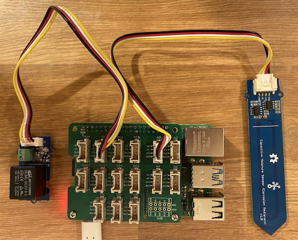

<!--
CO_OP_TRANSLATOR_METADATA:
{
  "original_hash": "66b81165e60f8f169bd52a401b6a0f8b",
  "translation_date": "2025-08-27T21:38:33+00:00",
  "source_file": "2-farm/lessons/3-automated-plant-watering/pi-relay.md",
  "language_code": "tl"
}
-->
# Kontrolin ang isang relay - Raspberry Pi

Sa bahaging ito ng aralin, magdadagdag ka ng relay sa iyong Raspberry Pi bukod sa soil moisture sensor, at kokontrolin ito batay sa antas ng soil moisture.

## Kagamitan

Kailangan ng Raspberry Pi ng relay.

Ang relay na gagamitin mo ay isang [Grove relay](https://www.seeedstudio.com/Grove-Relay.html), isang normally-open relay (ibig sabihin, ang output circuit ay bukas o hindi konektado kapag walang signal na ipinapadala sa relay) na kayang mag-handle ng output circuits hanggang 250V at 10A.

Ito ay isang digital actuator, kaya't ikokonekta ito sa isang digital pin sa Grove Base Hat.

### Ikonekta ang relay

Ang Grove relay ay maaaring ikonekta sa Raspberry Pi.

#### Gawain

Ikonekta ang relay.


1. Ipasok ang isang dulo ng Grove cable sa socket ng relay. Isang paraan lang ito maaaring ipasok.

1. Kapag naka-off ang Raspberry Pi, ikonekta ang kabilang dulo ng Grove cable sa digital socket na may markang **D5** sa Grove Base Hat na nakakabit sa Pi. Ang socket na ito ay ang pangalawa mula sa kaliwa, sa hanay ng mga socket na malapit sa GPIO pins. Iwanang nakakonekta ang soil moisture sensor sa **A0** socket.



1. Ipasok ang soil moisture sensor sa lupa, kung hindi pa ito nakakabit mula sa nakaraang aralin.

## Iprograma ang relay

Ngayon ay maaaring i-program ang Raspberry Pi upang magamit ang nakakabit na relay.

### Gawain

Iprograma ang device.

1. I-on ang Pi at hintaying mag-boot ito.

1. Buksan ang proyekto na `soil-moisture-sensor` mula sa nakaraang aralin sa VS Code kung hindi pa ito nakabukas. Magdadagdag ka sa proyektong ito.

1. Idagdag ang sumusunod na code sa file na `app.py` sa ibaba ng mga umiiral na imports:

    ```python
    from grove.grove_relay import GroveRelay
    ```

    Ang statement na ito ay nag-i-import ng `GroveRelay` mula sa Grove Python libraries upang makipag-ugnayan sa Grove relay.

1. Idagdag ang sumusunod na code sa ibaba ng deklarasyon ng klase na `ADC` upang lumikha ng isang `GroveRelay` instance:

    ```python
    relay = GroveRelay(5)
    ```

    Ito ay lumilikha ng relay gamit ang pin **D5**, ang digital pin na kinonekta mo sa relay.

1. Upang masubukan kung gumagana ang relay, idagdag ang sumusunod sa loob ng `while True:` loop:

    ```python
    relay.on()
    time.sleep(.5)
    relay.off()
    ```

    Ang code na ito ay binubuksan ang relay, naghihintay ng 0.5 segundo, pagkatapos ay isinasara ang relay.

1. Patakbuhin ang Python app. Ang relay ay mag-o-on at mag-o-off tuwing 10 segundo, na may kalahating segundong delay sa pagitan ng pag-on at pag-off. Maririnig mo ang relay na mag-click kapag nag-on at mag-click muli kapag nag-off. Ang LED sa Grove board ay iilaw kapag naka-on ang relay, at mamamatay kapag naka-off.

    

## Kontrolin ang relay gamit ang soil moisture

Ngayon na gumagana na ang relay, maaari na itong kontrolin batay sa mga pagbabasa ng soil moisture.

### Gawain

Kontrolin ang relay.

1. Burahin ang 3 linya ng code na idinagdag mo upang subukan ang relay. Palitan ang mga ito ng sumusunod na code:

    ```python
    if soil_moisture > 450:
        print("Soil Moisture is too low, turning relay on.")
        relay.on()
    else:
        print("Soil Moisture is ok, turning relay off.")
        relay.off()
    ```

    Ang code na ito ay sinusuri ang antas ng soil moisture mula sa soil moisture sensor. Kapag ito ay higit sa 450, binubuksan nito ang relay, at isinasara ito kapag bumaba ito sa 450.

    > 💁 Tandaan na ang capacitive soil moisture sensor ay nagbabasa ng mas mababang antas ng soil moisture kapag mas maraming moisture ang nasa lupa, at kabaligtaran.

1. Patakbuhin ang Python app. Makikita mo ang relay na mag-o-on o mag-o-off depende sa antas ng soil moisture. Subukan ito sa tuyong lupa, pagkatapos ay magdagdag ng tubig.

    ```output
    Soil Moisture: 638
    Soil Moisture is too low, turning relay on.
    Soil Moisture: 452
    Soil Moisture is too low, turning relay on.
    Soil Moisture: 347
    Soil Moisture is ok, turning relay off.
    ```

> 💁 Makikita mo ang code na ito sa [code-relay/pi](../../../../../2-farm/lessons/3-automated-plant-watering/code-relay/pi) folder.

😀 Tagumpay ang iyong programang nagkokontrol ng relay gamit ang soil moisture sensor!

---

**Paunawa**:  
Ang dokumentong ito ay isinalin gamit ang AI translation service na [Co-op Translator](https://github.com/Azure/co-op-translator). Bagama't sinisikap naming maging tumpak, tandaan na ang mga awtomatikong pagsasalin ay maaaring maglaman ng mga pagkakamali o hindi pagkakatugma. Ang orihinal na dokumento sa kanyang katutubong wika ang dapat ituring na opisyal na sanggunian. Para sa mahalagang impormasyon, inirerekomenda ang propesyonal na pagsasalin ng tao. Hindi kami mananagot sa anumang hindi pagkakaunawaan o maling interpretasyon na dulot ng paggamit ng pagsasaling ito.