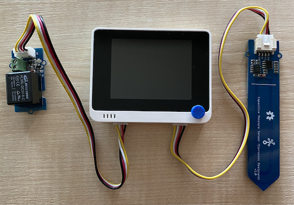

<!--
CO_OP_TRANSLATOR_METADATA:
{
  "original_hash": "f3c5d8afa2ef6a0b425ef8ff20615cb4",
  "translation_date": "2025-08-27T21:37:33+00:00",
  "source_file": "2-farm/lessons/3-automated-plant-watering/wio-terminal-relay.md",
  "language_code": "tl"
}
-->
# Kontrolin ang isang relay - Wio Terminal

Sa bahaging ito ng aralin, magdadagdag ka ng relay sa iyong Wio Terminal bukod sa soil moisture sensor, at kokontrolin ito batay sa antas ng soil moisture.

## Kagamitan

Kailangan ng Wio Terminal ng isang relay.

Ang relay na gagamitin mo ay isang [Grove relay](https://www.seeedstudio.com/Grove-Relay.html), isang normally-open relay (ibig sabihin, ang output circuit ay bukas o hindi konektado kapag walang signal na ipinapadala sa relay) na kayang mag-handle ng output circuits hanggang 250V at 10A.

Isa itong digital actuator, kaya ikokonekta ito sa mga digital pins ng Wio Terminal. Ang pinagsamang analog/digital port ay ginagamit na ng soil moisture sensor, kaya ikokonekta ito sa isa pang port, na isang pinagsamang I

### Ikonekta ang relay

Ang Grove relay ay maaaring ikonekta sa digital port ng Wio Terminal.

#### Gawain

Ikonekta ang relay.


1. Ipasok ang isang dulo ng Grove cable sa socket ng relay. Isang paraan lang ito maaaring ipasok.

1. Kapag ang Wio Terminal ay hindi nakakonekta sa iyong computer o ibang power supply, ikonekta ang kabilang dulo ng Grove cable sa kaliwang Grove socket ng Wio Terminal habang nakaharap ka sa screen. Iwanang nakakonekta ang soil moisture sensor sa kanang socket.



1. Ipasok ang soil moisture sensor sa lupa, kung hindi pa ito nakakabit mula sa nakaraang aralin.

## I-program ang relay

Ngayon ay maaaring i-program ang Wio Terminal upang magamit ang nakakabit na relay.

### Gawain

I-program ang device.

1. Buksan ang proyekto na `soil-moisture-sensor` mula sa nakaraang aralin sa VS Code kung hindi pa ito nakabukas. Magdadagdag ka sa proyektong ito.

2. Walang library para sa actuator na ito - isa itong digital actuator na kinokontrol gamit ang high o low signal. Upang i-on ito, magpapadala ka ng high signal sa pin (3.3V), at upang i-off ito, magpapadala ka ng low signal (0V). Magagawa ito gamit ang built-in na Arduino [`digitalWrite`](https://www.arduino.cc/reference/en/language/functions/digital-io/digitalwrite/) function. Simulan sa pamamagitan ng pagdaragdag ng sumusunod sa ibaba ng `setup` function upang i-setup ang pinagsamang I

C/digital port bilang isang output pin upang magpadala ng boltahe sa relay:

    ```cpp
    pinMode(PIN_WIRE_SCL, OUTPUT);
    ```

    Ang `PIN_WIRE_SCL` ay ang port number para sa pinagsamang I

1. Upang masubukan kung gumagana ang relay, idagdag ang sumusunod sa `loop` function, sa ibaba ng huling `delay`:

    ```cpp
    digitalWrite(PIN_WIRE_SCL, HIGH);
    delay(500);
    digitalWrite(PIN_WIRE_SCL, LOW);
    ```

    Ang code ay nagsusulat ng high signal sa pin kung saan nakakonekta ang relay upang i-on ito, naghihintay ng 500ms (kalahating segundo), pagkatapos ay nagsusulat ng low signal upang i-off ang relay.

1. I-build at i-upload ang code sa Wio Terminal.

1. Kapag na-upload na, ang relay ay mag-o-on at mag-o-off bawat 10 segundo, na may kalahating segundong delay sa pagitan ng pag-on at pag-off. Maririnig mo ang relay na mag-click kapag nag-o-on at mag-click muli kapag nag-o-off. Ang isang LED sa Grove board ay iilaw kapag naka-on ang relay, at mamamatay kapag naka-off.

    

## Kontrolin ang relay gamit ang soil moisture

Ngayon na gumagana na ang relay, maaari na itong kontrolin batay sa mga pagbabasa ng soil moisture sensor.

### Gawain

Kontrolin ang relay.

1. Burahin ang 3 linya ng code na idinagdag mo upang subukan ang relay. Palitan ang mga ito ng sumusunod na code:

    ```cpp
    if (soil_moisture > 450)
    {
        Serial.println("Soil Moisture is too low, turning relay on.");
        digitalWrite(PIN_WIRE_SCL, HIGH);
    }
    else
    {
        Serial.println("Soil Moisture is ok, turning relay off.");
        digitalWrite(PIN_WIRE_SCL, LOW);
    }
    ```

    Ang code na ito ay sinusuri ang antas ng soil moisture mula sa soil moisture sensor. Kapag ito ay higit sa 450, ini-on nito ang relay, at ini-off ito kapag bumaba sa 450.

    > 💁 Tandaan na ang capacitive soil moisture sensor ay nagbabasa ng mas mababang antas ng soil moisture kapag mas maraming moisture ang nasa lupa, at kabaligtaran.

1. I-build at i-upload ang code sa Wio Terminal.

1. I-monitor ang device gamit ang serial monitor. Makikita mo ang relay na nag-o-on o nag-o-off depende sa antas ng soil moisture. Subukan ito sa tuyong lupa, pagkatapos ay magdagdag ng tubig.

    ```output
    Soil Moisture: 638
    Soil Moisture is too low, turning relay on.
    Soil Moisture: 452
    Soil Moisture is too low, turning relay on.
    Soil Moisture: 347
    Soil Moisture is ok, turning relay off.
    ```

> 💁 Maaari mong mahanap ang code na ito sa [code-relay/wio-terminal](../../../../../2-farm/lessons/3-automated-plant-watering/code-relay/wio-terminal) folder.

😀 Tagumpay ang iyong soil moisture sensor na kumokontrol sa relay program!

---

**Paunawa**:  
Ang dokumentong ito ay isinalin gamit ang AI translation service na [Co-op Translator](https://github.com/Azure/co-op-translator). Bagama't sinisikap naming maging tumpak, tandaan na ang mga awtomatikong pagsasalin ay maaaring maglaman ng mga pagkakamali o hindi pagkakatugma. Ang orihinal na dokumento sa kanyang katutubong wika ang dapat ituring na opisyal na sanggunian. Para sa mahalagang impormasyon, inirerekomenda ang propesyonal na pagsasalin ng tao. Hindi kami mananagot sa anumang hindi pagkakaunawaan o maling interpretasyon na dulot ng paggamit ng pagsasaling ito.