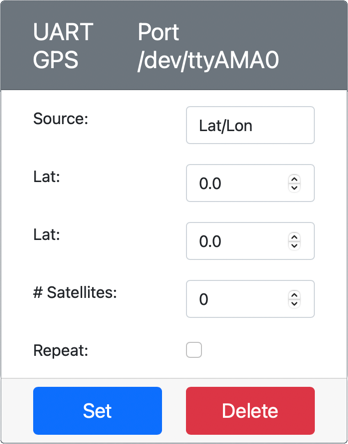
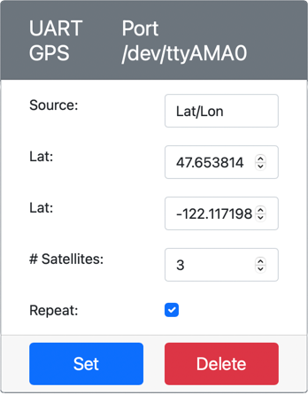

<!--
CO_OP_TRANSLATOR_METADATA:
{
  "original_hash": "64f18a8f8aaa1fef5e7320e0992d8b3a",
  "translation_date": "2025-08-27T23:41:11+00:00",
  "source_file": "3-transport/lessons/1-location-tracking/virtual-device-gps-sensor.md",
  "language_code": "tl"
}
-->
# Basahin ang GPS data - Virtual IoT Hardware

Sa bahaging ito ng aralin, magdadagdag ka ng GPS sensor sa iyong virtual na IoT device, at babasahin ang mga halaga mula rito.

## Virtual Hardware

Ang virtual na IoT device ay gagamit ng simulated GPS sensor na naa-access sa UART sa pamamagitan ng serial port.

Ang pisikal na GPS sensor ay may antena upang makuha ang mga radio wave mula sa mga GPS satellite, at i-convert ang mga GPS signal sa GPS data. Ang virtual na bersyon ay ginagaya ito sa pamamagitan ng pagpapahintulot sa iyo na mag-set ng latitude at longitude, magpadala ng raw NMEA sentences, o mag-upload ng GPX file na may maraming lokasyon na maaaring ibalik nang sunud-sunod.

> 🎓 Ang NMEA sentences ay tatalakayin sa susunod na bahagi ng aralin

### Idagdag ang sensor sa CounterFit

Upang magamit ang virtual na GPS sensor, kailangan mong magdagdag ng isa sa CounterFit app.

#### Gawain - idagdag ang sensor sa CounterFit

Idagdag ang GPS sensor sa CounterFit app.

1. Gumawa ng bagong Python app sa iyong computer sa isang folder na tinatawag na `gps-sensor` na may isang file na tinatawag na `app.py` at isang Python virtual environment, at idagdag ang CounterFit pip packages.

    > ⚠️ Maaari mong tingnan ang [mga tagubilin para sa paglikha at pag-set up ng CounterFit Python project sa aralin 1 kung kinakailangan](../../../1-getting-started/lessons/1-introduction-to-iot/virtual-device.md).

1. Mag-install ng karagdagang Pip package upang mag-install ng CounterFit shim na maaaring makipag-usap sa mga UART-based sensors sa pamamagitan ng serial connection. Siguraduhing ini-install mo ito mula sa terminal na may activated na virtual environment.

    ```sh
    pip install counterfit-shims-serial
    ```

1. Siguraduhing tumatakbo ang CounterFit web app.

1. Gumawa ng GPS sensor:

    1. Sa *Create sensor* box sa *Sensors* pane, i-drop down ang *Sensor type* box at piliin ang *UART GPS*.

    1. Iwanang nakatakda ang *Port* sa */dev/ttyAMA0*.

    1. Piliin ang **Add** button upang gumawa ng GPS sensor sa port `/dev/ttyAMA0`.

    

    Ang GPS sensor ay gagawin at lilitaw sa listahan ng mga sensor.

    

## I-program ang GPS sensor

Ang Virtual IoT device ay maaari nang i-program upang magamit ang virtual na GPS sensor.

### Gawain - i-program ang GPS sensor

I-program ang GPS sensor app.

1. Siguraduhing bukas ang `gps-sensor` app sa VS Code.

1. Buksan ang file na `app.py`.

1. Idagdag ang sumusunod na code sa itaas ng `app.py` upang ikonekta ang app sa CounterFit:

    ```python
    from counterfit_connection import CounterFitConnection
    CounterFitConnection.init('127.0.0.1', 5000)
    ```

1. Idagdag ang sumusunod na code sa ibaba nito upang mag-import ng ilang kinakailangang libraries, kabilang ang library para sa CounterFit serial port:

    ```python
    import time
    import counterfit_shims_serial
    
    serial = counterfit_shims_serial.Serial('/dev/ttyAMA0')
    ```

    Ang code na ito ay nag-i-import ng `serial` module mula sa `counterfit_shims_serial` Pip package. Pagkatapos ay kumokonekta ito sa `/dev/ttyAMA0` serial port - ito ang address ng serial port na ginagamit ng virtual na GPS sensor para sa kanyang UART port.

1. Idagdag ang sumusunod na code sa ibaba nito upang basahin mula sa serial port at i-print ang mga halaga sa console:

    ```python
    def print_gps_data(line):
        print(line.rstrip())
    
    while True:
        line = serial.readline().decode('utf-8')
    
        while len(line) > 0:
            print_gps_data(line)
            line = serial.readline().decode('utf-8')
    
        time.sleep(1)
    ```

    Ang isang function na tinatawag na `print_gps_data` ay tinukoy na nagpi-print ng linya na ipinasa rito sa console.

    Susunod, ang code ay nag-loop nang walang katapusan, binabasa ang maraming linya ng teksto hangga't maaari mula sa serial port sa bawat loop. Tinatawag nito ang `print_gps_data` function para sa bawat linya.

    Pagkatapos mabasa ang lahat ng data, ang loop ay magpapahinga ng 1 segundo, pagkatapos ay susubukan muli.

1. Patakbuhin ang code na ito, siguraduhing gumagamit ka ng ibang terminal kaysa sa terminal kung saan tumatakbo ang CounterFit app, upang manatiling tumatakbo ang CounterFit app.

1. Mula sa CounterFit app, baguhin ang halaga ng GPS sensor. Maaari mo itong gawin sa isa sa mga sumusunod na paraan:

    * Itakda ang **Source** sa `Lat/Lon`, at mag-set ng tiyak na latitude, longitude, at bilang ng mga satellite na ginamit upang makuha ang GPS fix. Ang halagang ito ay ipapadala nang isang beses lamang, kaya i-check ang **Repeat** box upang ang data ay maulit bawat segundo.

      

    * Itakda ang **Source** sa `NMEA` at magdagdag ng ilang NMEA sentences sa text box. Ang lahat ng mga halagang ito ay ipapadala, na may delay na 1 segundo bago mabasa ang bawat bagong GGA (position fix) sentence.

      

      Maaari kang gumamit ng tool tulad ng [nmeagen.org](https://www.nmeagen.org) upang bumuo ng mga sentences sa pamamagitan ng pagguhit sa mapa. Ang mga halagang ito ay ipapadala nang isang beses lamang, kaya i-check ang **Repeat** box upang ang data ay maulit isang segundo pagkatapos maipadala ang lahat.

    * Itakda ang **Source** sa GPX file, at mag-upload ng GPX file na may mga track locations. Maaari kang mag-download ng GPX files mula sa iba't ibang sikat na mapping at hiking sites, tulad ng [AllTrails](https://www.alltrails.com/). Ang mga file na ito ay naglalaman ng maraming GPS locations bilang isang trail, at ang GPS sensor ay magbabalik ng bawat bagong lokasyon sa 1 segundo na pagitan.

      

      Ang mga halagang ito ay ipapadala nang isang beses lamang, kaya i-check ang **Repeat** box upang ang data ay maulit isang segundo pagkatapos maipadala ang lahat.

    Kapag na-configure mo na ang mga setting ng GPS, piliin ang **Set** button upang i-commit ang mga halagang ito sa sensor.

1. Makikita mo ang raw output mula sa GPS sensor, na maaaring ganito:

    ```output
    $GNGGA,020604.001,4738.538654,N,12208.341758,W,1,3,,164.7,M,-17.1,M,,*67
    $GNGGA,020604.001,4738.538654,N,12208.341758,W,1,3,,164.7,M,-17.1,M,,*67
    ```

> 💁 Maaari mong makita ang code na ito sa [code-gps/virtual-device](../../../../../3-transport/lessons/1-location-tracking/code-gps/virtual-device) folder.

😀 Tagumpay ang iyong GPS sensor program!

---

**Paunawa**:  
Ang dokumentong ito ay isinalin gamit ang AI translation service na [Co-op Translator](https://github.com/Azure/co-op-translator). Bagama't sinisikap naming maging tumpak, tandaan na ang mga awtomatikong pagsasalin ay maaaring maglaman ng mga pagkakamali o hindi pagkakatugma. Ang orihinal na dokumento sa kanyang katutubong wika ang dapat ituring na opisyal na pinagmulan. Para sa mahalagang impormasyon, inirerekomenda ang propesyonal na pagsasalin ng tao. Hindi kami mananagot sa anumang hindi pagkakaunawaan o maling interpretasyon na dulot ng paggamit ng pagsasaling ito.