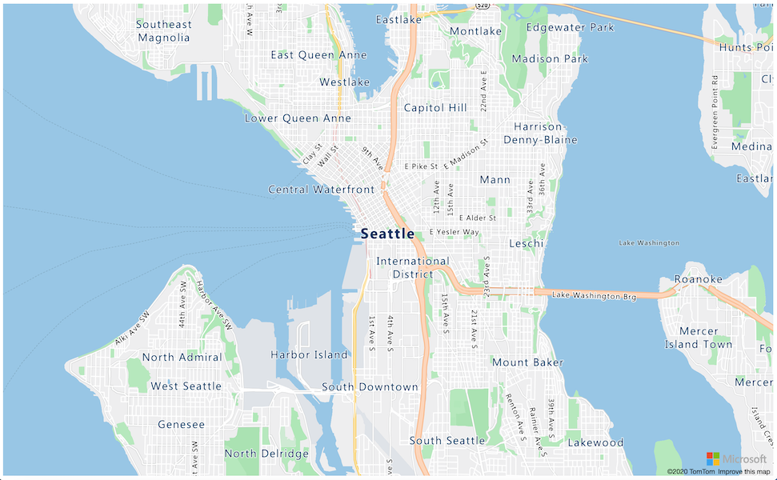

<!--
CO_OP_TRANSLATOR_METADATA:
{
  "original_hash": "9095c61445c2bca7245ef9b59a186a11",
  "translation_date": "2025-08-27T23:50:36+00:00",
  "source_file": "3-transport/lessons/3-visualize-location-data/README.md",
  "language_code": "tl"
}
-->
# Ipakita ang data ng lokasyon


> Sketchnote ni [Nitya Narasimhan](https://github.com/nitya). I-click ang imahe para sa mas malaking bersyon.

Ang video na ito ay nagbibigay ng overview ng Azure Maps gamit ang IoT, isang serbisyo na tatalakayin sa araling ito.

[](https://www.youtube.com/watch?v=P5i2GFTtb2s)

> 🎥 I-click ang imahe sa itaas para panoorin ang video

## Pre-lecture quiz

[Pre-lecture quiz](https://black-meadow-040d15503.1.azurestaticapps.net/quiz/25)

## Panimula

Sa nakaraang aralin, natutunan mo kung paano makuha ang GPS data mula sa iyong mga sensor upang mai-save sa cloud sa isang storage container gamit ang serverless code. Ngayon, matutuklasan mo kung paano i-visualize ang mga puntong iyon sa isang Azure map. Matutunan mo kung paano gumawa ng mapa sa isang web page, alamin ang format ng GeoJSON data, at kung paano ito gamitin upang i-plot ang lahat ng nakuhang GPS points sa iyong mapa.

Sa araling ito, tatalakayin natin:

* [Ano ang data visualization](../../../../../3-transport/lessons/3-visualize-location-data)
* [Mga serbisyo ng mapa](../../../../../3-transport/lessons/3-visualize-location-data)
* [Gumawa ng Azure Maps resource](../../../../../3-transport/lessons/3-visualize-location-data)
* [Ipakita ang mapa sa isang web page](../../../../../3-transport/lessons/3-visualize-location-data)
* [Ang GeoJSON format](../../../../../3-transport/lessons/3-visualize-location-data)
* [I-plot ang GPS data sa isang mapa gamit ang GeoJSON](../../../../../3-transport/lessons/3-visualize-location-data)

> 💁 Ang araling ito ay mangangailangan ng kaunting HTML at JavaScript. Kung nais mong matuto pa tungkol sa web development gamit ang HTML at JavaScript, tingnan ang [Web development for beginners](https://github.com/microsoft/Web-Dev-For-Beginners).

## Ano ang data visualization

Ang data visualization, gaya ng ipinahihiwatig ng pangalan, ay tungkol sa pag-visualize ng data sa mga paraan na mas madaling maunawaan ng tao. Karaniwan itong nauugnay sa mga chart at graph, ngunit anumang paraan ng pictorial na representasyon ng data upang matulungan ang tao na mas maunawaan ang data at makagawa ng mga desisyon.

Halimbawa - sa farm project, nakakuha ka ng mga soil moisture settings. Ang isang table ng soil moisture data na nakuhang bawat oras para sa ika-1 ng Hunyo 2021 ay maaaring ganito:

| Petsa            | Pagbasa |
| ---------------- | ------: |
| 01/06/2021 00:00 |     257 |
| 01/06/2021 01:00 |     268 |
| 01/06/2021 02:00 |     295 |
| 01/06/2021 03:00 |     305 |
| 01/06/2021 04:00 |     325 |
| 01/06/2021 05:00 |     359 |
| 01/06/2021 06:00 |     398 |
| 01/06/2021 07:00 |     410 |
| 01/06/2021 08:00 |     429 |
| 01/06/2021 09:00 |     451 |
| 01/06/2021 10:00 |     460 |
| 01/06/2021 11:00 |     452 |
| 01/06/2021 12:00 |     420 |
| 01/06/2021 13:00 |     408 |
| 01/06/2021 14:00 |     431 |
| 01/06/2021 15:00 |     462 |
| 01/06/2021 16:00 |     432 |
| 01/06/2021 17:00 |     402 |
| 01/06/2021 18:00 |     387 |
| 01/06/2021 19:00 |     360 |
| 01/06/2021 20:00 |     358 |
| 01/06/2021 21:00 |     354 |
| 01/06/2021 22:00 |     356 |
| 01/06/2021 23:00 |     362 |

Bilang tao, mahirap unawain ang data na iyon. Isa itong pader ng mga numero na walang kahulugan. Bilang unang hakbang sa pag-visualize ng data na ito, maaari itong i-plot sa isang line chart:


Maaaring mapahusay pa ito sa pamamagitan ng pagdaragdag ng linya upang ipakita kung kailan naka-on ang automated watering system sa isang soil moisture reading na 450:


Ang chart na ito ay mabilis na nagpapakita hindi lamang kung ano ang mga antas ng soil moisture, kundi pati na rin ang mga punto kung saan naka-on ang watering system.

Ang mga chart ay hindi lamang ang tool para sa pag-visualize ng data. Ang mga IoT device na sumusubaybay sa panahon ay maaaring magkaroon ng mga web app o mobile app na nag-visualize ng mga kondisyon ng panahon gamit ang mga simbolo, tulad ng simbolo ng ulap para sa maulap na araw, ulap na may ulan para sa maulan na araw, at iba pa. Maraming paraan upang i-visualize ang data, marami ang seryoso, ang ilan ay masaya.

✅ Mag-isip tungkol sa mga paraan kung paano mo nakita ang data na na-visualize. Aling mga pamamaraan ang pinakamalinaw at nakatulong sa iyo na makagawa ng mga desisyon nang mas mabilis?

Ang pinakamahusay na mga visualization ay nagbibigay-daan sa tao na makagawa ng mga desisyon nang mabilis. Halimbawa, ang pagkakaroon ng pader ng mga gauge na nagpapakita ng lahat ng uri ng mga pagbasa mula sa mga industrial machine ay mahirap iproseso, ngunit ang isang kumikislap na pulang ilaw kapag may mali ay nagbibigay-daan sa tao na makagawa ng desisyon. Minsan ang pinakamahusay na visualization ay isang kumikislap na ilaw!

Kapag nagtatrabaho sa GPS data, ang pinakamalinaw na visualization ay maaaring i-plot ang data sa isang mapa. Ang isang mapa na nagpapakita ng mga delivery truck, halimbawa, ay maaaring makatulong sa mga manggagawa sa isang processing plant na makita kung kailan darating ang mga truck. Kung ang mapa na ito ay nagpapakita ng higit pa sa mga larawan ng mga truck sa kanilang kasalukuyang lokasyon, ngunit nagbibigay ng ideya ng nilalaman ng isang truck, kung gayon ang mga manggagawa sa planta ay maaaring magplano nang naaayon - kung makakita sila ng refrigerated truck na malapit, alam nila na maghanda ng espasyo sa isang refrigerator.

## Mga serbisyo ng mapa

Ang pagtatrabaho sa mga mapa ay isang kawili-wiling gawain, at maraming pagpipilian tulad ng Bing Maps, Leaflet, Open Street Maps, at Google Maps. Sa araling ito, matututo ka tungkol sa [Azure Maps](https://azure.microsoft.com/services/azure-maps/?WT.mc_id=academic-17441-jabenn) at kung paano nila maipapakita ang iyong GPS data.


Ang Azure Maps ay "isang koleksyon ng mga geospatial services at SDKs na gumagamit ng sariwang mapping data upang magbigay ng geographic context sa mga web at mobile application." Ang mga developer ay binibigyan ng mga tool upang lumikha ng magaganda, interactive na mga mapa na maaaring gumawa ng mga bagay tulad ng magbigay ng mga inirerekomendang ruta ng trapiko, magbigay ng impormasyon tungkol sa mga insidente ng trapiko, indoor navigation, search capabilities, impormasyon sa elevation, mga serbisyo ng panahon, at marami pa.

✅ Subukan ang ilang [mga sample ng code para sa mapa](https://docs.microsoft.com/samples/browse?WT.mc_id=academic-17441-jabenn&products=azure-maps)

Maaari mong ipakita ang mga mapa bilang isang blangkong canvas, tiles, satellite images, satellite images na may mga kalsada na superimposed, iba't ibang uri ng grayscale maps, mga mapa na may shaded relief upang ipakita ang elevation, night view maps, at isang high contrast map. Maaari kang makakuha ng real-time na mga update sa iyong mga mapa sa pamamagitan ng pagsasama ng mga ito sa [Azure Event Grid](https://azure.microsoft.com/services/event-grid/?WT.mc_id=academic-17441-jabenn). Maaari mong kontrolin ang pag-uugali at hitsura ng iyong mga mapa sa pamamagitan ng pag-enable ng iba't ibang mga kontrol upang payagan ang mapa na tumugon sa mga event tulad ng pinch, drag, at click. Upang kontrolin ang hitsura ng iyong mapa, maaari kang magdagdag ng mga layer na kinabibilangan ng mga bubbles, linya, polygons, heat maps, at marami pa. Ang estilo ng mapa na iyong ipapatupad ay depende sa iyong napiling SDK.

Maaari mong ma-access ang Azure Maps APIs sa pamamagitan ng paggamit ng [REST API](https://docs.microsoft.com/javascript/api/azure-maps-rest/?WT.mc_id=academic-17441-jabenn&view=azure-maps-typescript-latest), ang [Web SDK](https://docs.microsoft.com/azure/azure-maps/how-to-use-map-control?WT.mc_id=academic-17441-jabenn), o, kung ikaw ay gumagawa ng mobile app, ang [Android SDK](https://docs.microsoft.com/azure/azure-maps/how-to-use-android-map-control-library?WT.mc_id=academic-17441-jabenn&pivots=programming-language-java-android).

Sa araling ito, gagamitin mo ang web SDK upang gumuhit ng mapa at ipakita ang path ng GPS location ng iyong sensor.

## Gumawa ng Azure Maps resource

Ang iyong unang hakbang ay gumawa ng Azure Maps account.

### Gawain - gumawa ng Azure Maps resource

1. Patakbuhin ang sumusunod na command mula sa iyong Terminal o Command Prompt upang gumawa ng Azure Maps resource sa iyong `gps-sensor` resource group:

    ```sh
    az maps account create --name gps-sensor \
                           --resource-group gps-sensor \
                           --accept-tos \
                           --sku S1
    ```

    Ito ay gagawa ng Azure Maps resource na tinatawag na `gps-sensor`. Ang tier na ginagamit ay `S1`, na isang paid tier na may kasamang iba't ibang mga feature, ngunit may mapagbigay na dami ng libreng tawag.

    > 💁 Upang makita ang gastos ng paggamit ng Azure Maps, tingnan ang [Azure Maps pricing page](https://azure.microsoft.com/pricing/details/azure-maps/?WT.mc_id=academic-17441-jabenn).

1. Kakailanganin mo ng API key para sa maps resource. Gamitin ang sumusunod na command upang makuha ang key na ito:

    ```sh
    az maps account keys list --name gps-sensor \
                              --resource-group gps-sensor \
                              --output table
    ```

    Kopyahin ang `PrimaryKey` value.

## Ipakita ang mapa sa isang web page

Ngayon maaari mong gawin ang susunod na hakbang, na ipakita ang iyong mapa sa isang web page. Gagamit tayo ng isang `html` file para sa iyong maliit na web app; tandaan na sa isang production o team environment, ang iyong web app ay malamang na may mas maraming bahagi!

### Gawain - ipakita ang mapa sa isang web page

1. Gumawa ng file na tinatawag na index.html sa isang folder sa iyong lokal na computer. Magdagdag ng HTML markup upang maglagay ng mapa:

    ```html
    <html>
    <head>
        <style>
            #myMap {
                width:100%;
                height:100%;
            }
        </style>
    </head>
    
    <body onload="init()">
        <div id="myMap"></div>
    </body>
    </html>
    ```

    Ang mapa ay maglo-load sa `myMap` `div`. Ang ilang mga style ay nagpapahintulot dito na sakupin ang lapad at taas ng pahina.

    > 🎓 Ang `div` ay isang seksyon ng web page na maaaring pangalanan at i-style.

1. Sa ilalim ng opening `<head>` tag, magdagdag ng external style sheet upang kontrolin ang display ng mapa, at isang external script mula sa Web SDK upang pamahalaan ang pag-uugali nito:

    ```html
    <link rel="stylesheet" href="https://atlas.microsoft.com/sdk/javascript/mapcontrol/2/atlas.min.css" type="text/css" />
    <script src="https://atlas.microsoft.com/sdk/javascript/mapcontrol/2/atlas.min.js"></script>
    ```

    Ang style sheet na ito ay naglalaman ng mga setting para sa kung paano ang hitsura ng mapa, at ang script file ay naglalaman ng code upang i-load ang mapa. Ang pagdaragdag ng code na ito ay katulad ng pag-include ng C++ header files o pag-import ng Python modules.

1. Sa ilalim ng script na iyon, magdagdag ng script block upang ilunsad ang mapa.

    ```javascript
    <script type='text/javascript'>
        function init() {
            var map = new atlas.Map('myMap', {
                center: [-122.26473, 47.73444],
                zoom: 12,
                authOptions: {
                    authType: "subscriptionKey",
                    subscriptionKey: "<subscription_key>",

                }
            });
        }
    </script>
    ```

    Palitan ang `<subscription_key>` ng API key para sa iyong Azure Maps account.

    Kung bubuksan mo ang iyong `index.html` page sa isang web browser, dapat mong makita ang isang mapa na naka-load, at nakatuon sa Seattle area.

    

    ✅ Subukan ang zoom at center parameters upang baguhin ang display ng iyong mapa. Maaari kang magdagdag ng iba't ibang coordinates na tumutugma sa latitude at longitude ng iyong data upang muling i-center ang mapa.

> 💁 Ang mas mahusay na paraan upang magtrabaho sa mga web app nang lokal ay mag-install ng [http-server](https://www.npmjs.com/package/http-server). Kakailanganin mo ng [node.js](https://nodejs.org/) at [npm](https://www.npmjs.com/) na naka-install bago gamitin ang tool na ito. Kapag na-install na ang mga tool na iyon, maaari kang mag-navigate sa lokasyon ng iyong `index.html` file at i-type ang `http-server`. Ang web app ay magbubukas sa isang lokal na webserver [http://127.0.0.1:8080/](http://127.0.0.1:8080/).

## Ang GeoJSON format

Ngayon na mayroon ka nang web app na may mapa na naka-display, kailangan mong kunin ang GPS data mula sa iyong storage account at ipakita ito sa isang layer ng mga marker sa ibabaw ng mapa. Bago natin gawin iyon, tingnan natin ang [GeoJSON](https://wikipedia.org/wiki/GeoJSON) format na kinakailangan ng Azure Maps.

Ang [GeoJSON](https://geojson.org/) ay isang open standard JSON specification na may espesyal na formatting na idinisenyo upang hawakan ang geographic-specific data. Maaari kang matuto tungkol dito sa pamamagitan ng pag-test ng sample data gamit ang [geojson.io](https://geojson.io), na isang kapaki-pakinabang na tool din upang i-debug ang mga GeoJSON file.

Ang sample GeoJSON data ay ganito ang hitsura:

```json
{
  "type": "FeatureCollection",
  "features": [
    {
      "type": "Feature",
      "geometry": {
        "type": "Point",
        "coordinates": [
          -2.10237979888916,
          57.164918677004714
        ]
      }
    }
  ]
}
```

Ang partikular na mahalaga ay ang paraan ng pag-nest ng data bilang isang `Feature` sa loob ng isang `FeatureCollection`. Sa loob ng object na iyon ay makikita ang `geometry` na may `coordinates` na nagpapahiwatig ng latitude at longitude.

✅ Kapag gumagawa ng iyong geoJSON, bigyang-pansin ang pagkakasunod ng `latitude` at `longitude` sa object, o ang iyong mga puntos ay hindi lilitaw kung saan dapat! Ang GeoJSON ay inaasahan ang data sa pagkakasunod na `lon,lat` para sa mga puntos, hindi `lat,lon`.

Ang `Geometry` ay maaaring magkaroon ng iba't ibang uri, tulad ng isang solong punto o isang polygon. Sa halimbawang ito, ito ay isang punto na may dalawang coordinates na tinukoy, ang longitude, at ang latitude.
✅ Sinusuportahan ng Azure Maps ang standard na GeoJSON kasama ang ilang [pinahusay na mga tampok](https://docs.microsoft.com/azure/azure-maps/extend-geojson?WT.mc_id=academic-17441-jabenn) kabilang ang kakayahang gumuhit ng mga bilog at iba pang mga geometries.

## I-plot ang GPS data sa isang Mapa gamit ang GeoJSON

Ngayon ay handa ka nang gamitin ang data mula sa storage na ginawa mo sa nakaraang aralin. Bilang paalala, ito ay nakaimbak bilang ilang mga file sa blob storage kaya kailangan mong kunin ang mga file at i-parse ang mga ito upang magamit ng Azure Maps ang data.

### Gawain - i-configure ang storage upang ma-access mula sa isang web page

Kapag gumawa ka ng tawag sa iyong storage upang kunin ang data, maaaring magulat ka na makakita ng mga error sa console ng iyong browser. Ito ay dahil kailangan mong mag-set ng mga pahintulot para sa [CORS](https://developer.mozilla.org/docs/Web/HTTP/CORS) sa storage na ito upang payagan ang mga external na web app na basahin ang data nito.

> 🎓 Ang CORS ay nangangahulugang "Cross-Origin Resource Sharing" at karaniwang kailangang i-set nang tahasan sa Azure para sa mga kadahilanang pangseguridad. Pinipigilan nito ang mga site na hindi mo inaasahan na ma-access ang iyong data.

1. Patakbuhin ang sumusunod na command upang i-enable ang CORS:

    ```sh
    az storage cors add --methods GET \
                        --origins "*" \
                        --services b \
                        --account-name <storage_name> \
                        --account-key <key1>
    ```

    Palitan ang `<storage_name>` ng pangalan ng iyong storage account. Palitan ang `<key1>` ng account key para sa iyong storage account.

    Ang command na ito ay nagpapahintulot sa anumang website (ang wildcard `*` ay nangangahulugang kahit ano) na gumawa ng *GET* request, ibig sabihin ay kunin ang data, mula sa iyong storage account. Ang `--services b` ay nangangahulugang i-apply lamang ang setting na ito para sa blobs.

### Gawain - i-load ang GPS data mula sa storage

1. Palitan ang buong nilalaman ng `init` function ng sumusunod na code:

    ```javascript
    fetch("https://<storage_name>.blob.core.windows.net/gps-data/?restype=container&comp=list")
        .then(response => response.text())
        .then(str => new window.DOMParser().parseFromString(str, "text/xml"))
        .then(xml => {
            let blobList = Array.from(xml.querySelectorAll("Url"));
                blobList.forEach(async blobUrl => {
                    loadJSON(blobUrl.innerHTML)                
        });
    })
    .then( response => {
        map = new atlas.Map('myMap', {
            center: [-122.26473, 47.73444],
            zoom: 14,
            authOptions: {
                authType: "subscriptionKey",
                subscriptionKey: "<subscription_key>",
    
            }
        });
        map.events.add('ready', function () {
            var source = new atlas.source.DataSource();
            map.sources.add(source);
            map.layers.add(new atlas.layer.BubbleLayer(source));
            source.add(features);
        })
    })
    ```

    Palitan ang `<storage_name>` ng pangalan ng iyong storage account. Palitan ang `<subscription_key>` ng API key para sa iyong Azure Maps account.

    Maraming bagay ang nangyayari dito. Una, kinukuha ng code ang iyong GPS data mula sa iyong blob container gamit ang isang URL endpoint na binuo gamit ang pangalan ng iyong storage account. Ang URL na ito ay kumukuha mula sa `gps-data`, na nagpapahiwatig na ang uri ng resource ay isang container (`restype=container`), at naglilista ng impormasyon tungkol sa lahat ng blobs. Ang listahan na ito ay hindi ibabalik ang mismong blobs, ngunit magbabalik ng URL para sa bawat blob na maaaring gamitin upang i-load ang data ng blob.

    > 💁 Maaari mong ilagay ang URL na ito sa iyong browser upang makita ang mga detalye ng lahat ng blobs sa iyong container. Ang bawat item ay magkakaroon ng `Url` property na maaari mo ring i-load sa iyong browser upang makita ang nilalaman ng blob.

    Pagkatapos ay i-load ng code ang bawat blob, tinatawag ang isang `loadJSON` function, na gagawin sa susunod. Pagkatapos ay nililikha nito ang map control, at nagdadagdag ng code sa `ready` event. Ang event na ito ay tinatawag kapag ang mapa ay ipinapakita sa web page.

    Ang ready event ay lumilikha ng isang Azure Maps data source - isang container na naglalaman ng GeoJSON data na pupunuin sa ibang pagkakataon. Ang data source na ito ay ginagamit upang lumikha ng isang bubble layer - isang set ng mga bilog sa mapa na nakasentro sa bawat punto sa GeoJSON.

1. Idagdag ang `loadJSON` function sa iyong script block, sa ibaba ng `init` function:

    ```javascript
    var map, features;

    function loadJSON(file) {
        var xhr = new XMLHttpRequest();
        features = [];
        xhr.onreadystatechange = function () {
            if (xhr.readyState === XMLHttpRequest.DONE) {
                if (xhr.status === 200) {
                    gps = JSON.parse(xhr.responseText)
                    features.push(
                        new atlas.data.Feature(new atlas.data.Point([parseFloat(gps.gps.lon), parseFloat(gps.gps.lat)]))
                    )
                }
            }
        };
        xhr.open("GET", file, true);
        xhr.send();
    }    
    ```

    Ang function na ito ay tinatawag ng fetch routine upang i-parse ang JSON data at i-convert ito upang mabasa bilang longitude at latitude coordinates bilang geoJSON.  
    Kapag na-parse na, ang data ay itinatakda bilang bahagi ng isang geoJSON `Feature`. Ang mapa ay mai-initialize at lilitaw ang maliliit na bilog sa paligid ng path na pinapakita ng iyong data:

1. I-load ang HTML page sa iyong browser. I-load nito ang mapa, pagkatapos ay i-load ang lahat ng GPS data mula sa storage at i-plot ito sa mapa.

    

> 💁 Maaari mong makita ang code na ito sa [code](../../../../../3-transport/lessons/3-visualize-location-data/code) folder.

---

## 🚀 Hamon

Maganda na maipakita ang static na data sa isang mapa bilang mga marker. Kaya mo bang pahusayin ang web app na ito upang magdagdag ng animation at ipakita ang path ng mga marker sa paglipas ng panahon, gamit ang timestamped json files? Narito ang [ilang mga halimbawa](https://azuremapscodesamples.azurewebsites.net/) ng paggamit ng animation sa loob ng mga mapa.

## Post-lecture quiz

[Post-lecture quiz](https://black-meadow-040d15503.1.azurestaticapps.net/quiz/26)

## Review & Self Study

Ang Azure Maps ay partikular na kapaki-pakinabang para sa pagtatrabaho sa mga IoT device.

* Mag-research ng ilang mga gamit sa [Azure Maps documentation sa Microsoft docs](https://docs.microsoft.com/azure/azure-maps/tutorial-iot-hub-maps?WT.mc_id=academic-17441-jabenn).
* Palalimin ang iyong kaalaman sa paggawa ng mapa at waypoints gamit ang [create your first route finding app with Azure Maps self-guided learning module sa Microsoft Learn](https://docs.microsoft.com/learn/modules/create-your-first-app-with-azure-maps/?WT.mc_id=academic-17441-jabenn).

## Takdang Aralin

[I-deploy ang iyong app](assignment.md)

---

**Paunawa**:  
Ang dokumentong ito ay isinalin gamit ang AI translation service na [Co-op Translator](https://github.com/Azure/co-op-translator). Bagama't sinisikap naming maging tumpak, pakitandaan na ang mga awtomatikong pagsasalin ay maaaring maglaman ng mga pagkakamali o hindi pagkakatugma. Ang orihinal na dokumento sa orihinal nitong wika ang dapat ituring na opisyal na sanggunian. Para sa mahalagang impormasyon, inirerekomenda ang propesyonal na pagsasalin ng tao. Hindi kami mananagot sa anumang hindi pagkakaunawaan o maling interpretasyon na dulot ng paggamit ng pagsasaling ito.