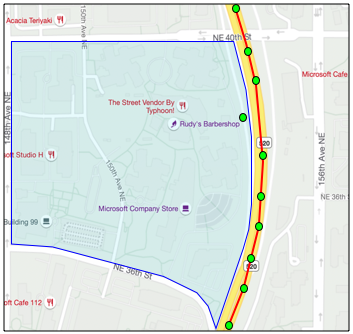

<!--
CO_OP_TRANSLATOR_METADATA:
{
  "original_hash": "078ae664c7b686bf069545e9a5fc95b2",
  "translation_date": "2025-08-27T23:58:04+00:00",
  "source_file": "3-transport/lessons/4-geofences/README.md",
  "language_code": "tl"
}
-->
# Geofences


> Sketchnote ni [Nitya Narasimhan](https://github.com/nitya). I-click ang imahe para sa mas malaking bersyon.

Ang video na ito ay nagbibigay ng overview ng geofences at kung paano ito gamitin sa Azure Maps, mga paksa na tatalakayin sa araling ito:

[](https://www.youtube.com/watch?v=nsrgYhaYNVY)

> 🎥 I-click ang imahe sa itaas para panoorin ang video

## Pre-lecture quiz

[Pre-lecture quiz](https://black-meadow-040d15503.1.azurestaticapps.net/quiz/27)

## Panimula

Sa huling 3 aralin, ginamit mo ang IoT upang mahanap ang mga trak na nagdadala ng iyong produkto mula sa iyong sakahan patungo sa processing hub. Nakakuha ka ng GPS data, ipinadala ito sa cloud para maimbak, at na-visualize ito sa mapa. Ang susunod na hakbang para mapataas ang kahusayan ng iyong supply chain ay ang makatanggap ng alerto kapag ang trak ay malapit nang dumating sa processing hub, upang ang crew na mag-a-unload ay handa na gamit ang forklifts at iba pang kagamitan sa oras ng pagdating ng sasakyan. Sa ganitong paraan, mabilis nilang ma-unload ang trak, at hindi ka magbabayad para sa oras ng paghihintay ng trak at driver.

Sa araling ito, matututunan mo ang tungkol sa geofences - mga tinukoy na geospatial na rehiyon tulad ng lugar sa loob ng 2km minuto na biyahe mula sa processing hub, at kung paano subukan kung ang GPS coordinates ay nasa loob o labas ng geofence, upang makita kung ang iyong GPS sensor ay dumating o umalis sa isang lugar.

Sa araling ito, tatalakayin natin:

* [Ano ang geofences](../../../../../3-transport/lessons/4-geofences)
* [Pagde-define ng geofence](../../../../../3-transport/lessons/4-geofences)
* [Pagsubok ng mga puntos laban sa geofence](../../../../../3-transport/lessons/4-geofences)
* [Paggamit ng geofences mula sa serverless code](../../../../../3-transport/lessons/4-geofences)

> 🗑 Ito ang huling aralin sa proyektong ito, kaya pagkatapos makumpleto ang araling ito at ang assignment, huwag kalimutang linisin ang iyong cloud services. Kakailanganin mo ang mga serbisyo upang makumpleto ang assignment, kaya tiyaking tapusin muna ito.
>
> Sumangguni sa [ang gabay sa paglilinis ng iyong proyekto](../../../clean-up.md) kung kinakailangan para sa mga tagubilin kung paano ito gawin.

## Ano ang Geofences

Ang geofence ay isang virtual na perimeter para sa isang tunay na geographic na rehiyon. Ang mga geofence ay maaaring mga bilog na tinukoy bilang isang punto at radius (halimbawa, isang bilog na 100m ang lapad sa paligid ng isang gusali), o isang polygon na sumasaklaw sa isang lugar tulad ng school zone, city limits, o campus ng unibersidad o opisina.


> 💁 Maaaring nagamit mo na ang geofences nang hindi mo namamalayan. Kung nag-set ka ng reminder gamit ang iOS reminders app o Google Keep batay sa lokasyon, nagamit mo na ang geofence. Ang mga app na ito ay magse-set up ng geofence batay sa ibinigay na lokasyon at mag-aalerto sa iyo kapag pumasok ang iyong telepono sa geofence.

Maraming dahilan kung bakit nais mong malaman kung ang isang sasakyan ay nasa loob o labas ng geofence:

* **Paghahanda para sa pag-unload** - Ang pagkuha ng notification na ang sasakyan ay dumating na sa site ay nagbibigay-daan sa crew na maghanda para sa pag-unload ng sasakyan, na nagpapababa ng oras ng paghihintay ng sasakyan. Maaari nitong pahintulutan ang driver na makapaghatid ng mas maraming kargamento sa isang araw na may mas kaunting oras ng paghihintay.
* **Pagsunod sa buwis** - Ang ilang bansa, tulad ng New Zealand, ay naniningil ng road taxes para sa mga diesel na sasakyan batay sa bigat ng sasakyan kapag nagmamaneho sa pampublikong kalsada lamang. Ang paggamit ng geofences ay nagbibigay-daan sa iyo na subaybayan ang mileage na nagamit sa pampublikong kalsada kumpara sa pribadong kalsada sa mga lugar tulad ng sakahan o logging areas.
* **Pagsubaybay sa pagnanakaw** - Kung ang isang sasakyan ay dapat manatili lamang sa isang tiyak na lugar tulad ng sakahan, at ito ay umalis sa geofence, maaaring ito ay ninakaw.
* **Pagsunod sa lokasyon** - Ang ilang bahagi ng isang work site, sakahan, o pabrika ay maaaring hindi pinapayagan para sa ilang sasakyan, tulad ng pag-iwas sa mga sasakyang nagdadala ng artipisyal na fertilizers at pesticides mula sa mga bukirin na nagtatanim ng organic na produkto. Kung ang isang geofence ay pasukin, ang sasakyan ay nasa labas ng compliance at maaaring ma-notify ang driver.

✅ Makakaisip ka ba ng iba pang gamit para sa geofences?

Ang Azure Maps, ang serbisyong ginamit mo sa nakaraang aralin upang i-visualize ang GPS data, ay nagbibigay-daan sa iyo na mag-define ng geofences, pagkatapos ay subukan kung ang isang punto ay nasa loob o labas ng geofence.

## Pagde-define ng geofence

Ang mga geofence ay tinutukoy gamit ang GeoJSON, katulad ng mga puntos na idinagdag sa mapa sa nakaraang aralin. Sa kasong ito, sa halip na isang `FeatureCollection` ng mga `Point` values, ito ay isang `FeatureCollection` na naglalaman ng isang `Polygon`.

```json
{
   "type": "FeatureCollection",
   "features": [
     {
       "type": "Feature",
       "geometry": {
         "type": "Polygon",
         "coordinates": [
           [
             [
               -122.13393688201903,
               47.63829579223815
             ],
             [
               -122.13389128446579,
               47.63782047131512
             ],
             [
               -122.13240802288054,
               47.63783312249837
             ],
             [
               -122.13238388299942,
               47.63829037035086
             ],
             [
               -122.13393688201903,
               47.63829579223815
             ]
           ]
         ]
       },
       "properties": {
         "geometryId": "1"
       }
     }
   ]
}
```

Ang bawat punto sa polygon ay tinutukoy bilang isang longitude, latitude pair sa isang array, at ang mga puntong ito ay nasa isang array na itinakda bilang `coordinates`. Sa isang `Point` sa nakaraang aralin, ang `coordinates` ay isang array na naglalaman ng 2 values, latitude at longitude, para sa isang `Polygon` ito ay isang array ng arrays na naglalaman ng 2 values, longitude, latitude.

> 💁 Tandaan, ang GeoJSON ay gumagamit ng `longitude, latitude` para sa mga puntos, hindi `latitude, longitude`

Ang polygon coordinates array ay palaging may 1 higit pang entry kaysa sa bilang ng mga puntos sa polygon, na ang huling entry ay kapareho ng una, na nagsasara sa polygon. Halimbawa, para sa isang rectangle magkakaroon ng 5 puntos.


Sa imahe sa itaas, mayroong isang rectangle. Ang polygon coordinates ay nagsisimula sa top-left sa 47,-122, pagkatapos ay gumagalaw pakanan sa 47,-121, pagkatapos pababa sa 46,-121, pagkatapos pakanan sa 46, -122, pagkatapos pabalik sa start point sa 47, -122. Ito ay nagbibigay sa polygon ng 5 puntos - top-left, top-right, bottom-right, bottom-left, pagkatapos top-left upang isara ito.

✅ Subukang gumawa ng GeoJSON polygon sa paligid ng iyong bahay o paaralan. Gumamit ng tool tulad ng [GeoJSON.io](https://geojson.io/).

### Gawain - pagde-define ng geofence

Upang magamit ang geofence sa Azure Maps, kailangan muna itong i-upload sa iyong Azure Maps account. Kapag na-upload, makakakuha ka ng unique ID na magagamit mo upang subukan ang isang punto laban sa geofence. Upang mag-upload ng geofences sa Azure Maps, kailangan mong gamitin ang maps web API. Maaari mong tawagan ang Azure Maps web API gamit ang tool na tinatawag na [curl](https://curl.se).

> 🎓 Ang Curl ay isang command line tool upang gumawa ng mga request laban sa web endpoints

1. Kung gumagamit ka ng Linux, macOS, o isang kamakailang bersyon ng Windows 10, malamang na naka-install na ang curl. Patakbuhin ang sumusunod mula sa iyong terminal o command line upang suriin:

    ```sh
    curl --version
    ```

    Kung hindi mo nakikita ang impormasyon ng bersyon para sa curl, kakailanganin mong i-install ito mula sa [curl downloads page](https://curl.se/download.html).

    > 💁 Kung bihasa ka sa Postman, maaari mo itong gamitin bilang alternatibo kung mas gusto mo.

1. Gumawa ng GeoJSON file na naglalaman ng polygon. Susubukan mo ito gamit ang iyong GPS sensor, kaya gumawa ng polygon sa paligid ng iyong kasalukuyang lokasyon. Maaari kang gumawa nito nang manu-mano sa pamamagitan ng pag-edit ng GeoJSON example na ibinigay sa itaas, o gumamit ng tool tulad ng [GeoJSON.io](https://geojson.io/).

    Ang GeoJSON ay kailangang maglaman ng `FeatureCollection`, na naglalaman ng isang `Feature` na may `geometry` na uri `Polygon`.

    Dapat mo ring idagdag ang isang `properties` element sa parehong antas ng `geometry` element, at ito ay kailangang maglaman ng `geometryId`:

    ```json
    "properties": {
        "geometryId": "1"
    }
    ```

    Kung gagamit ka ng [GeoJSON.io](https://geojson.io/), manu-mano mong kailangang idagdag ang item na ito sa empty `properties` element, alinman pagkatapos i-download ang JSON file, o sa JSON editor sa app.

    Ang `geometryId` na ito ay dapat na unique sa file na ito. Maaari kang mag-upload ng maraming geofences bilang maraming `Features` sa `FeatureCollection` sa parehong GeoJSON file, basta't ang bawat isa ay may iba't ibang `geometryId`. Ang mga polygons ay maaaring magkaroon ng parehong `geometryId` kung sila ay na-upload mula sa ibang file sa ibang oras.

1. I-save ang file na ito bilang `geofence.json`, at mag-navigate sa kung saan ito naka-save sa iyong terminal o console.

1. Patakbuhin ang sumusunod na curl command upang gumawa ng GeoFence:

    ```sh
    curl --request POST 'https://atlas.microsoft.com/mapData/upload?api-version=1.0&dataFormat=geojson&subscription-key=<subscription_key>' \
         --header 'Content-Type: application/json' \
         --include \
         --data @geofence.json
    ```

    Palitan ang `<subscription_key>` sa URL ng API key para sa iyong Azure Maps account.

    Ang URL ay ginagamit upang mag-upload ng map data sa pamamagitan ng `https://atlas.microsoft.com/mapData/upload` API. Ang tawag ay naglalaman ng `api-version` parameter upang tukuyin kung aling Azure Maps API ang gagamitin, ito ay upang pahintulutan ang API na magbago sa paglipas ng panahon ngunit mapanatili ang backwards compatibility. Ang data format na na-upload ay itinakda sa `geojson`.

    Ito ay magpapatakbo ng POST request sa upload API at magbabalik ng listahan ng response headers na kinabibilangan ng header na tinatawag na `location`.

    ```output
    content-type: application/json
    location: https://us.atlas.microsoft.com/mapData/operations/1560ced6-3a80-46f2-84b2-5b1531820eab?api-version=1.0
    x-ms-azuremaps-region: West US 2
    x-content-type-options: nosniff
    strict-transport-security: max-age=31536000; includeSubDomains
    x-cache: CONFIG_NOCACHE
    date: Sat, 22 May 2021 21:34:57 GMT
    content-length: 0
    ```

    > 🎓 Kapag tumatawag sa isang web endpoint, maaari kang magpasa ng mga parameter sa tawag sa pamamagitan ng pagdaragdag ng `?` na sinusundan ng key value pairs bilang `key=value`, na pinaghihiwalay ang key value pairs ng `&`.

1. Ang Azure Maps ay hindi agad pinoproseso ito, kaya kailangan mong suriin upang makita kung natapos na ang upload request sa pamamagitan ng paggamit ng URL na ibinigay sa `location` header. Gumawa ng GET request sa lokasyong ito upang makita ang status. Kakailanganin mong idagdag ang iyong subscription key sa dulo ng `location` URL sa pamamagitan ng pagdaragdag ng `&subscription-key=<subscription_key>` sa dulo, pinapalitan ang `<subscription_key>` ng API key para sa iyong Azure Maps account. Patakbuhin ang sumusunod na command:

    ```sh
    curl --request GET '<location>&subscription-key=<subscription_key>'
    ```

    Palitan ang `<location>` ng halaga ng `location` header, at `<subscription_key>` ng API key para sa iyong Azure Maps account.

1. Suriin ang halaga ng `status` sa response. Kung hindi ito `Succeeded`, maghintay ng isang minuto at subukang muli.

1. Kapag ang status ay bumalik bilang `Succeeded`, tingnan ang `resourceLocation` mula sa response. Ito ay naglalaman ng mga detalye sa unique ID (kilala bilang UDID) para sa GeoJSON object. Ang UDID ay ang halaga pagkatapos ng `metadata/`, at hindi kasama ang `api-version`. Halimbawa, kung ang `resourceLocation` ay:

    ```json
    {
      "resourceLocation": "https://us.atlas.microsoft.com/mapData/metadata/7c3776eb-da87-4c52-ae83-caadf980323a?api-version=1.0"
    }
    ```

    Kung gayon ang UDID ay `7c3776eb-da87-4c52-ae83-caadf980323a`.

    Panatilihin ang kopya ng UDID na ito dahil kakailanganin mo ito upang subukan ang geofence.

## Pagsubok ng mga puntos laban sa geofence

Kapag na-upload na ang polygon sa Azure Maps, maaari mong subukan ang isang punto upang makita kung ito ay nasa loob o labas ng geofence. Ginagawa mo ito sa pamamagitan ng paggawa ng web API request, na ipinapasa ang UDID ng geofence, at ang latitude at longitude ng punto na susubukan.

Kapag ginawa mo ang request na ito, maaari ka ring magpasa ng halaga na tinatawag na `searchBuffer`. Sinasabi nito sa Maps API kung gaano katumpak ang dapat ibalik na resulta. Ang dahilan para dito ay ang GPS ay hindi perpektong tumpak, at minsan ang mga lokasyon ay maaaring magkamali ng ilang metro o higit pa. Ang default para sa search buffer ay 50m, ngunit maaari kang mag-set ng mga halaga mula 0m hanggang 500m.

Kapag ang mga resulta ay ibinalik mula sa API call, isa sa mga bahagi ng resulta ay isang `distance` na sinusukat sa pinakamalapit na punto sa gilid ng geofence, na may positibong halaga kung ang punto ay nasa labas ng geofence, negatibo kung ito ay nasa loob ng geofence. Kung ang distansya na ito ay mas mababa sa search buffer, ang aktwal na distansya ay ibinabalik sa metro, kung hindi, ang halaga ay 999 o -999. Ang 999 ay nangangahulugang ang punto ay nasa labas ng geofence ng higit sa search buffer, -999 ay nangangahulugang ito ay nasa loob ng geofence ng higit sa search buffer.


Sa imahe sa itaas, ang geofence ay may 50m search buffer.

* Ang isang punto sa gitna ng geofence, malayo sa search buffer ay may distansya na **-999**
* Ang isang punto na malayo sa search buffer ay may distansya na **999**
* Ang isang punto sa loob ng geofence at sa loob ng search buffer, 6m mula sa geofence, ay may distansya na **6m**
* Ang isang punto sa labas ng geofence at sa loob ng search buffer, 39m mula sa geofence, ay may distansya na **39m**

Mahalagang malaman ang distansya sa gilid ng geofence, at pagsamahin ito sa iba pang impormasyon tulad ng iba pang GPS readings, bilis, at data ng kalsada kapag gumagawa ng mga desisyon batay sa lokasyon ng sasakyan.

Halimbawa, isipin ang GPS readings na nagpapakita ng sasakyan na nagmamaneho sa kalsada na tumatakbo malapit sa geofence. Kung ang isang GPS value ay hindi tumpak at inilalagay ang sasakyan sa loob ng geofence, sa kabila ng walang access para sa sasakyan, maaari itong balewalain.


Sa larawan sa itaas, may geofence sa bahagi ng Microsoft campus. Ang pulang linya ay nagpapakita ng ruta ng isang trak na dumadaan sa 520, na may mga bilog na nagpapakita ng mga GPS readings. Karamihan sa mga ito ay tama at nasa kahabaan ng 520, ngunit may isang maling reading sa loob ng geofence. Walang paraan para maging tama ang reading na iyon - walang mga kalsada para biglang lumihis ang trak mula sa 520 papunta sa campus, at bumalik sa 520. Ang code na nagche-check sa geofence na ito ay kailangang isaalang-alang ang mga naunang readings bago kumilos batay sa resulta ng geofence test.

✅ Anong karagdagang datos ang kailangan mo upang masuri kung ang isang GPS reading ay maaaring ituring na tama?

### Gawain - subukan ang mga puntos laban sa isang geofence

1. Magsimula sa paggawa ng URL para sa web API query. Ang format ay:

    ```output
    https://atlas.microsoft.com/spatial/geofence/json?api-version=1.0&deviceId=gps-sensor&subscription-key=<subscription-key>&udid=<UDID>&lat=<lat>&lon=<lon>
    ```

    Palitan ang `<subscription_key>` ng API key para sa iyong Azure Maps account.

    Palitan ang `<UDID>` ng UDID ng geofence mula sa nakaraang gawain.

    Palitan ang `<lat>` at `<lon>` ng latitude at longitude na nais mong subukan.

    Ang URL na ito ay gumagamit ng `https://atlas.microsoft.com/spatial/geofence/json` API upang mag-query ng isang geofence na tinukoy gamit ang GeoJSON. Target nito ang `1.0` na bersyon ng API. Ang `deviceId` na parameter ay kinakailangan at dapat ang pangalan ng device kung saan nagmula ang latitude at longitude.

    Ang default na search buffer ay 50m, at maaari mo itong baguhin sa pamamagitan ng pagdaragdag ng karagdagang parameter na `searchBuffer=<distance>`, na itinatakda ang `<distance>` sa search buffer distance sa metro, mula 0 hanggang 500.

1. Gumamit ng curl upang gumawa ng GET request sa URL na ito:

    ```sh
    curl --request GET '<URL>'
    ```

    > 💁 Kung makakakuha ka ng response code na `BadRequest`, na may error na:
    >
    > ```output
    > Invalid GeoJSON: All feature properties should contain a geometryId, which is used for identifying the geofence.
    > ```
    >
    > ibig sabihin ang iyong GeoJSON ay kulang sa `properties` section na may `geometryId`. Kailangan mong ayusin ang iyong GeoJSON, pagkatapos ulitin ang mga hakbang sa itaas upang muling i-upload at makakuha ng bagong UDID.

1. Ang response ay maglalaman ng listahan ng `geometries`, isa para sa bawat polygon na tinukoy sa GeoJSON na ginamit upang lumikha ng geofence. Ang bawat geometry ay may 3 field na mahalaga, `distance`, `nearestLat` at `nearestLon`.

    ```output
    {
        "geometries": [
            {
                "deviceId": "gps-sensor",
                "udId": "7c3776eb-da87-4c52-ae83-caadf980323a",
                "geometryId": "1",
                "distance": 999.0,
                "nearestLat": 47.645875,
                "nearestLon": -122.142713
            }
        ],
        "expiredGeofenceGeometryId": [],
        "invalidPeriodGeofenceGeometryId": []
    }
    ```

    * Ang `nearestLat` at `nearestLon` ay ang latitude at longitude ng isang punto sa gilid ng geofence na pinakamalapit sa lokasyong sinusubukan.

    * Ang `distance` ay ang distansya mula sa lokasyong sinusubukan patungo sa pinakamalapit na punto sa gilid ng geofence. Ang mga negatibong numero ay nangangahulugang nasa loob ng geofence, positibo sa labas. Ang halagang ito ay mas mababa sa 50 (ang default na search buffer), o 999.

1. Ulitin ito nang maraming beses gamit ang mga lokasyon sa loob at labas ng geofence.

## Gumamit ng geofences mula sa serverless code

Maaari ka na ngayong magdagdag ng bagong trigger sa iyong Functions app upang subukan ang IoT Hub GPS event data laban sa geofence.

### Consumer groups

Tulad ng natutunan mo sa mga nakaraang aralin, ang IoT Hub ay nagbibigay-daan sa iyo na i-replay ang mga event na natanggap ng hub ngunit hindi naproseso. Ngunit ano ang mangyayari kung maraming trigger ang nakakonekta? Paano nito malalaman kung alin ang naproseso na?

Ang sagot ay hindi nito kaya! Sa halip, maaari kang magtakda ng maraming hiwalay na koneksyon upang basahin ang mga event, at bawat isa ay maaaring pamahalaan ang pag-replay ng mga hindi pa nababasang mensahe. Ang mga ito ay tinatawag na *consumer groups*. Kapag kumonekta ka sa endpoint, maaari mong tukuyin kung aling consumer group ang nais mong konektahan. Ang bawat bahagi ng iyong application ay kokonekta sa ibang consumer group.


Sa teorya, hanggang 5 application ang maaaring kumonekta sa bawat consumer group, at lahat sila ay makakatanggap ng mga mensahe kapag dumating ang mga ito. Ang pinakamainam na kasanayan ay magkaroon lamang ng isang application na kumokonekta sa bawat consumer group upang maiwasan ang duplicate na pagproseso ng mensahe, at tiyakin na kapag nag-restart, lahat ng nakapila na mga mensahe ay naproseso nang tama. Halimbawa, kung inilunsad mo ang iyong Functions app nang lokal pati na rin ang pagpapatakbo nito sa cloud, pareho silang magpoproseso ng mga mensahe, na magreresulta sa duplicate na blobs na nakaimbak sa storage account.

Kung susuriin mo ang `function.json` file para sa IoT Hub trigger na ginawa mo sa isang mas maagang aralin, makikita mo ang consumer group sa event hub trigger binding section:

```json
"consumerGroup": "$Default"
```

Kapag gumawa ka ng IoT Hub, awtomatikong nililikha ang `$Default` consumer group. Kung nais mong magdagdag ng karagdagang trigger, maaari mo itong idagdag gamit ang bagong consumer group.

> 💁 Sa araling ito, gagamit ka ng ibang function upang subukan ang geofence kaysa sa ginamit upang mag-imbak ng GPS data. Ito ay upang ipakita kung paano gamitin ang consumer groups at paghiwalayin ang code upang gawing mas madali itong basahin at maintindihan. Sa isang production application, maraming paraan kung paano mo ito ia-architect - pagsamahin ang dalawa sa isang function, gumamit ng trigger sa storage account upang patakbuhin ang isang function para suriin ang geofence, o gumamit ng maraming functions. Walang 'tamang paraan', nakadepende ito sa natitirang bahagi ng iyong application at mga pangangailangan.

### Gawain - gumawa ng bagong consumer group

1. Patakbuhin ang sumusunod na command upang gumawa ng bagong consumer group na tinatawag na `geofence` para sa iyong IoT Hub:

    ```sh
    az iot hub consumer-group create --name geofence \
                                     --hub-name <hub_name>
    ```

    Palitan ang `<hub_name>` ng pangalan na ginamit mo para sa iyong IoT Hub.

1. Kung nais mong makita ang lahat ng consumer groups para sa isang IoT Hub, patakbuhin ang sumusunod na command:

    ```sh
    az iot hub consumer-group list --output table \
                                   --hub-name <hub_name>
    ```

    Palitan ang `<hub_name>` ng pangalan na ginamit mo para sa iyong IoT Hub. Ipapakita nito ang lahat ng consumer groups.

    ```output
    Name      ResourceGroup
    --------  ---------------
    $Default  gps-sensor
    geofence  gps-sensor
    ```

> 💁 Kapag pinatakbo mo ang IoT Hub event monitor sa isang mas maagang aralin, kumonekta ito sa `$Default` consumer group. Ito ang dahilan kung bakit hindi mo maaaring patakbuhin ang event monitor at isang event trigger nang sabay. Kung nais mong patakbuhin ang pareho, maaari mong gamitin ang ibang consumer groups para sa lahat ng iyong function apps, at panatilihin ang `$Default` para sa event monitor.

### Gawain - gumawa ng bagong IoT Hub trigger

1. Magdagdag ng bagong IoT Hub event trigger sa iyong `gps-trigger` function app na ginawa mo sa isang mas maagang aralin. Tawagin ang function na ito na `geofence-trigger`.

    > ⚠️ Maaari kang sumangguni sa [mga tagubilin para sa paggawa ng IoT Hub event trigger mula sa project 2, lesson 5 kung kinakailangan](../../../2-farm/lessons/5-migrate-application-to-the-cloud/README.md#create-an-iot-hub-event-trigger).

1. I-configure ang IoT Hub connection string sa `function.json` file. Ang `local.settings.json` ay ibinabahagi sa lahat ng triggers sa Function App.

1. I-update ang halaga ng `consumerGroup` sa `function.json` file upang i-refer ang bagong `geofence` consumer group:

    ```json
    "consumerGroup": "geofence"
    ```

1. Kakailanganin mo ang subscription key para sa iyong Azure Maps account sa trigger na ito, kaya magdagdag ng bagong entry sa `local.settings.json` file na tinatawag na `MAPS_KEY`.

1. Patakbuhin ang Functions App upang tiyakin na ito ay kumokonekta at nagpoproseso ng mga mensahe. Ang `iot-hub-trigger` mula sa mas maagang aralin ay tatakbo rin at mag-upload ng blobs sa storage.

    > Upang maiwasan ang duplicate na GPS readings sa blob storage, maaari mong ihinto ang Functions App na tumatakbo sa cloud. Upang gawin ito, gamitin ang sumusunod na command:
    >
    > ```sh
    > az functionapp stop --resource-group gps-sensor \
    >                     --name <functions_app_name>
    > ```
    >
    > Palitan ang `<functions_app_name>` ng pangalan na ginamit mo para sa iyong Functions App.
    >
    > Maaari mo itong i-restart mamaya gamit ang sumusunod na command:
    >
    > ```sh
    > az functionapp start --resource-group gps-sensor \
    >                     --name <functions_app_name>
    > ```
    >
    > Palitan ang `<functions_app_name>` ng pangalan na ginamit mo para sa iyong Functions App.

### Gawain - subukan ang geofence mula sa trigger

Sa mas maagang bahagi ng araling ito, gumamit ka ng curl upang mag-query ng geofence upang makita kung ang isang punto ay nasa loob o labas. Maaari kang gumawa ng katulad na web request mula sa loob ng iyong trigger.

1. Upang mag-query ng geofence, kailangan mo ang UDID nito. Magdagdag ng bagong entry sa `local.settings.json` file na tinatawag na `GEOFENCE_UDID` gamit ang halagang ito.

1. Buksan ang `__init__.py` file mula sa bagong `geofence-trigger` trigger.

1. Magdagdag ng sumusunod na import sa itaas ng file:

    ```python
    import json
    import os
    import requests
    ```

    Ang `requests` package ay nagbibigay-daan sa iyo na gumawa ng web API calls. Walang Python SDK ang Azure Maps, kaya kailangan mong gumawa ng web API calls upang magamit ito mula sa Python code.

1. Magdagdag ng sumusunod na 2 linya sa simula ng `main` method upang makuha ang Maps subscription key:

    ```python
    maps_key = os.environ['MAPS_KEY']
    geofence_udid = os.environ['GEOFENCE_UDID']    
    ```

1. Sa loob ng `for event in events` loop, magdagdag ng sumusunod upang makuha ang latitude at longitude mula sa bawat event:

    ```python
    event_body = json.loads(event.get_body().decode('utf-8'))
    lat = event_body['gps']['lat']
    lon = event_body['gps']['lon']
    ```

    Ang code na ito ay nagko-convert ng JSON mula sa event body sa isang dictionary, pagkatapos ay kinukuha ang `lat` at `lon` mula sa `gps` field.

1. Kapag gumagamit ng `requests`, sa halip na bumuo ng mahabang URL tulad ng ginawa mo gamit ang curl, maaari mong gamitin ang URL na bahagi lamang at ipasa ang mga parameter bilang isang dictionary. Magdagdag ng sumusunod na code upang tukuyin ang URL na tatawagan at i-configure ang mga parameter:

    ```python
    url = 'https://atlas.microsoft.com/spatial/geofence/json'

    params = {
        'api-version': 1.0,
        'deviceId': 'gps-sensor',
        'subscription-key': maps_key,
        'udid' : geofence_udid,
        'lat' : lat,
        'lon' : lon
    }
    ```

    Ang mga item sa `params` dictionary ay tumutugma sa key-value pairs na ginamit mo kapag tumatawag sa web API gamit ang curl.

1. Magdagdag ng sumusunod na linya ng code upang tawagan ang web API:

    ```python
    response = requests.get(url, params=params)
    response_body = json.loads(response.text)
    ```

    Ito ay tumatawag sa URL gamit ang mga parameter, at nakakakuha ng response object.

1. Magdagdag ng sumusunod na code sa ibaba nito:

    ```python
    distance = response_body['geometries'][0]['distance']

    if distance == 999:
        logging.info('Point is outside geofence')
    elif distance > 0:
        logging.info(f'Point is just outside geofence by a distance of {distance}m')
    elif distance == -999:
        logging.info(f'Point is inside geofence')
    else:
        logging.info(f'Point is just inside geofence by a distance of {distance}m')
    ```

    Ang code na ito ay inaasahan ang 1 geometry, at kinukuha ang distance mula sa geometry na iyon. Pagkatapos ay naglo-log ng iba't ibang mensahe batay sa distance.

1. Patakbuhin ang code na ito. Makikita mo sa logging output kung ang GPS coordinates ay nasa loob o labas ng geofence, na may distance kung ang punto ay nasa loob ng 50m. Subukan ang code na ito gamit ang iba't ibang geofences batay sa lokasyon ng iyong GPS sensor, subukang ilipat ang sensor (halimbawa, gamit ang WiFi mula sa mobile phone, o may iba't ibang coordinates sa virtual IoT device) upang makita ang pagbabago.

1. Kapag handa ka na, i-deploy ang code na ito sa iyong Functions app sa cloud. Huwag kalimutang i-deploy ang bagong Application Settings.

    > ⚠️ Maaari kang sumangguni sa [mga tagubilin para sa pag-upload ng Application Settings mula sa project 2, lesson 5 kung kinakailangan](../../../2-farm/lessons/5-migrate-application-to-the-cloud/README.md#task---upload-your-application-settings).

    > ⚠️ Maaari kang sumangguni sa [mga tagubilin para sa pag-deploy ng iyong Functions app mula sa project 2, lesson 5 kung kinakailangan](../../../2-farm/lessons/5-migrate-application-to-the-cloud/README.md#task---deploy-your-functions-app-to-the-cloud).

> 💁 Makikita mo ang code na ito sa [code/functions](../../../../../3-transport/lessons/4-geofences/code/functions) folder.

---

## 🚀 Hamon

Sa araling ito, nagdagdag ka ng isang geofence gamit ang GeoJSON file na may isang polygon. Maaari kang mag-upload ng maraming polygons nang sabay-sabay, basta't may iba't ibang `geometryId` values sa `properties` section.

Subukang mag-upload ng GeoJSON file na may maraming polygons at ayusin ang iyong code upang hanapin kung aling polygon ang pinakamalapit o nasa loob ang GPS coordinates.

## Post-lecture quiz

[Post-lecture quiz](https://black-meadow-040d15503.1.azurestaticapps.net/quiz/28)

## Review at Pag-aaral sa Sarili

* Basahin ang higit pa tungkol sa geofences at ang ilan sa kanilang mga gamit sa [Geofencing page sa Wikipedia](https://en.wikipedia.org/wiki/Geo-fence).
* Basahin ang higit pa tungkol sa Azure Maps geofencing API sa [Microsoft Azure Maps Spatial - Get Geofence documentation](https://docs.microsoft.com/rest/api/maps/spatial/getgeofence?WT.mc_id=academic-17441-jabenn).
* Basahin ang higit pa tungkol sa consumer groups sa [Features and terminology in Azure Event Hubs - Event consumers documentation sa Microsoft docs](https://docs.microsoft.com/azure/event-hubs/event-hubs-features?WT.mc_id=academic-17441-jabenn#event-consumers)

## Takdang Aralin

[Magpadala ng notifications gamit ang Twilio](assignment.md)

---

**Paunawa**:  
Ang dokumentong ito ay isinalin gamit ang AI translation service na [Co-op Translator](https://github.com/Azure/co-op-translator). Bagama't sinisikap naming maging tumpak, tandaan na ang mga awtomatikong pagsasalin ay maaaring maglaman ng mga pagkakamali o hindi pagkakatugma. Ang orihinal na dokumento sa kanyang katutubong wika ang dapat ituring na opisyal na sanggunian. Para sa mahalagang impormasyon, inirerekomenda ang propesyonal na pagsasalin ng tao. Hindi kami mananagot sa anumang hindi pagkakaunawaan o maling interpretasyon na maaaring magmula sa paggamit ng pagsasaling ito.