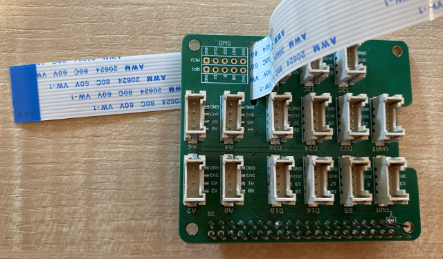

<!--
CO_OP_TRANSLATOR_METADATA:
{
  "original_hash": "c677667095f6133eee418c7e53615d05",
  "translation_date": "2025-08-27T20:59:48+00:00",
  "source_file": "4-manufacturing/lessons/2-check-fruit-from-device/pi-camera.md",
  "language_code": "tl"
}
-->
# Kumuha ng larawan - Raspberry Pi

Sa bahaging ito ng aralin, magdadagdag ka ng sensor ng kamera sa iyong Raspberry Pi, at magbabasa ng mga larawan mula rito.

## Kagamitan

Kailangan ng Raspberry Pi ng kamera.

Ang kamera na gagamitin mo ay ang [Raspberry Pi Camera Module](https://www.raspberrypi.org/products/camera-module-v2/). Ang kamera na ito ay dinisenyo upang gumana sa Raspberry Pi at kumokonekta sa pamamagitan ng dedikadong konektor sa Pi.

> 💁 Ang kamera na ito ay gumagamit ng [Camera Serial Interface, isang protocol mula sa Mobile Industry Processor Interface Alliance](https://wikipedia.org/wiki/Camera_Serial_Interface), na kilala bilang MIPI-CSI. Ito ay isang dedikadong protocol para sa pagpapadala ng mga larawan.

## Ikonekta ang kamera

Ang kamera ay maaaring ikonekta sa Raspberry Pi gamit ang ribbon cable.

### Gawain - ikonekta ang kamera


1. Patayin ang Pi.

1. Ikonekta ang ribbon cable na kasama ng kamera sa kamera. Upang gawin ito, hilahin nang marahan ang itim na plastik na clip sa holder upang ito ay umangat nang kaunti, pagkatapos ay ipasok ang cable sa socket, na ang asul na bahagi ay nakaharap palayo sa lens, at ang metal pin strips ay nakaharap sa lens. Kapag ito ay naipasok nang buo, itulak ang itim na plastik na clip pabalik sa lugar.

    Makakakita ka ng animation na nagpapakita kung paano buksan ang clip at ipasok ang cable sa [Raspberry Pi Getting Started with the Camera module documentation](https://projects.raspberrypi.org/en/projects/getting-started-with-picamera/2).

    

1. Alisin ang Grove Base Hat mula sa Pi.

1. Ipasok ang ribbon cable sa camera slot sa Grove Base Hat. Siguraduhin na ang asul na bahagi ng cable ay nakaharap sa analog ports na may label na **A0**, **A1**, at iba pa.

    

1. Ipasok ang ribbon cable sa camera port sa Pi. Muli, hilahin ang itim na plastik na clip pataas, ipasok ang cable, pagkatapos ay itulak ang clip pabalik. Ang asul na bahagi ng cable ay dapat nakaharap sa USB at ethernet ports.

    

1. Ibalik ang Grove Base Hat.

## Iprograma ang kamera

Ang Raspberry Pi ay maaari nang iprograma upang gamitin ang kamera gamit ang [PiCamera](https://pypi.org/project/picamera/) Python library.

### Gawain - i-enable ang legacy camera mode

Sa kasamaang-palad, sa paglabas ng Raspberry Pi OS Bullseye, nagbago ang software ng kamera na kasama sa OS, ibig sabihin, sa default, hindi na gumagana ang PiCamera. Mayroong kapalit na ginagawa, na tinatawag na PiCamera2, ngunit hindi pa ito handang gamitin.

Sa ngayon, maaari mong itakda ang iyong Pi sa legacy camera mode upang gumana ang PiCamera. Ang camera socket ay naka-disable din sa default, ngunit ang pag-enable ng legacy camera software ay awtomatikong mag-e-enable sa socket.

1. I-on ang Pi at hintayin itong mag-boot.

1. I-launch ang VS Code, alinman direkta sa Pi, o kumonekta gamit ang Remote SSH extension.

1. Patakbuhin ang mga sumusunod na command mula sa iyong terminal:

    ```sh
    sudo raspi-config nonint do_legacy 0
    sudo reboot
    ```

    Ito ay magbabago ng setting upang i-enable ang legacy camera software, pagkatapos ay i-reboot ang Pi upang magkabisa ang setting.

1. Hintayin ang Pi na mag-reboot, pagkatapos ay i-relaunch ang VS Code.

### Gawain - iprograma ang kamera

Iprograma ang device.

1. Mula sa terminal, gumawa ng bagong folder sa home directory ng `pi` user na tinatawag na `fruit-quality-detector`. Gumawa ng file sa folder na ito na tinatawag na `app.py`.

1. Buksan ang folder na ito sa VS Code.

1. Upang makipag-ugnayan sa kamera, maaari mong gamitin ang PiCamera Python library. I-install ang Pip package para dito gamit ang sumusunod na command:

    ```sh
    pip3 install picamera
    ```

1. Idagdag ang sumusunod na code sa iyong `app.py` file:

    ```python
    import io
    import time
    from picamera import PiCamera
    ```

    Ang code na ito ay nag-i-import ng ilang kinakailangang library, kabilang ang `PiCamera` library.

1. Idagdag ang sumusunod na code sa ibaba nito upang i-initialize ang kamera:

    ```python
    camera = PiCamera()
    camera.resolution = (640, 480)
    camera.rotation = 0
    
    time.sleep(2)
    ```

    Ang code na ito ay lumilikha ng PiCamera object, itinatakda ang resolution sa 640x480. Bagama't mas mataas na resolution ang sinusuportahan (hanggang 3280x2464), ang image classifier ay gumagana sa mas maliliit na larawan (227x227) kaya hindi na kailangang kumuha at magpadala ng mas malalaking larawan.

    Ang linya na `camera.rotation = 0` ay nagtatakda ng rotation ng larawan. Ang ribbon cable ay pumapasok sa ilalim ng kamera, ngunit kung ang iyong kamera ay iniikot upang mas madali itong itutok sa bagay na nais mong i-classify, maaari mong baguhin ang linyang ito sa bilang ng degrees ng rotation.

    

    Halimbawa, kung isinuspinde mo ang ribbon cable sa ibabaw ng isang bagay upang ito ay nasa itaas ng kamera, itakda ang rotation sa 180:

    ```python
    camera.rotation = 180
    ```

    Ang kamera ay nangangailangan ng ilang segundo upang mag-start up, kaya ang `time.sleep(2)`.

1. Idagdag ang sumusunod na code sa ibaba nito upang makuha ang larawan bilang binary data:

    ```python
    image = io.BytesIO()
    camera.capture(image, 'jpeg')
    image.seek(0)
    ```

    Ang code na ito ay lumilikha ng `BytesIO` object upang mag-imbak ng binary data. Ang larawan ay binabasa mula sa kamera bilang JPEG file at iniimbak sa object na ito. Ang object na ito ay may position indicator upang malaman kung nasaan ito sa data upang ang karagdagang data ay maaaring isulat sa dulo kung kinakailangan, kaya ang linya na `image.seek(0)` ay inililipat ang posisyon pabalik sa simula upang ang lahat ng data ay mabasa mamaya.

1. Sa ibaba nito, idagdag ang sumusunod upang i-save ang larawan sa isang file:

    ```python
    with open('image.jpg', 'wb') as image_file:
        image_file.write(image.read())
    ```

    Ang code na ito ay nagbubukas ng file na tinatawag na `image.jpg` para sa pagsusulat, pagkatapos ay binabasa ang lahat ng data mula sa `BytesIO` object at isinusulat ito sa file.

    > 💁 Maaari mong kunin ang larawan nang direkta sa isang file sa halip na sa `BytesIO` object sa pamamagitan ng pagpasa ng pangalan ng file sa `camera.capture` call. Ang dahilan ng paggamit ng `BytesIO` object ay upang sa susunod na bahagi ng aralin, maaari mong ipadala ang larawan sa iyong image classifier.

1. Itutok ang kamera sa isang bagay at patakbuhin ang code na ito.

1. Ang isang larawan ay makukuha at mase-save bilang `image.jpg` sa kasalukuyang folder. Makikita mo ang file na ito sa VS Code explorer. Piliin ang file upang makita ang larawan. Kung kailangan ng rotation, i-update ang linya na `camera.rotation = 0` kung kinakailangan at kumuha ng isa pang larawan.

> 💁 Makikita mo ang code na ito sa [code-camera/pi](../../../../../4-manufacturing/lessons/2-check-fruit-from-device/code-camera/pi) folder.

😀 Tagumpay ang iyong programa para sa kamera!

---

**Paunawa**:  
Ang dokumentong ito ay isinalin gamit ang AI translation service na [Co-op Translator](https://github.com/Azure/co-op-translator). Bagama't sinisikap naming maging tumpak, tandaan na ang mga awtomatikong pagsasalin ay maaaring maglaman ng mga pagkakamali o hindi pagkakatugma. Ang orihinal na dokumento sa kanyang katutubong wika ang dapat ituring na opisyal na pinagmulan. Para sa mahalagang impormasyon, inirerekomenda ang propesyonal na pagsasalin ng tao. Hindi kami mananagot sa anumang hindi pagkakaunawaan o maling interpretasyon na dulot ng paggamit ng pagsasaling ito.