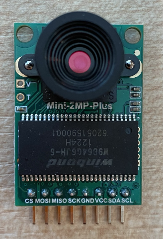

<!--
CO_OP_TRANSLATOR_METADATA:
{
  "original_hash": "160be8c0f558687f6686dca64f10f739",
  "translation_date": "2025-08-27T23:04:00+00:00",
  "source_file": "4-manufacturing/lessons/2-check-fruit-from-device/wio-terminal-camera.md",
  "language_code": "tl"
}
-->
# Kumuha ng Larawan - Wio Terminal

Sa bahaging ito ng aralin, magdadagdag ka ng camera sa iyong Wio Terminal at kukuha ng mga larawan mula rito.

## Kagamitan

Kailangan ng Wio Terminal ng camera.

Ang camera na gagamitin mo ay isang [ArduCam Mini 2MP Plus](https://www.arducam.com/product/arducam-2mp-spi-camera-b0067-arduino/). Ito ay isang 2 megapixel na camera na nakabase sa OV2640 image sensor. Nakikipag-ugnayan ito gamit ang SPI interface upang kumuha ng mga larawan, at gumagamit ng I2C upang i-configure ang sensor.

## Ikonekta ang Camera

Ang ArduCam ay walang Grove socket, sa halip ito ay kumokonekta sa parehong SPI at I2C buses sa pamamagitan ng GPIO pins ng Wio Terminal.

### Gawain - Ikonekta ang Camera

Ikonekta ang camera.



1. Ang mga pin sa ilalim ng ArduCam ay kailangang ikonekta sa GPIO pins ng Wio Terminal. Upang mas madaling mahanap ang tamang mga pin, ilagay ang GPIO pin sticker na kasama ng Wio Terminal sa paligid ng mga pin:

    

1. Gamit ang jumper wires, gawin ang mga sumusunod na koneksyon:

    | ArduCAM pin | Wio Terminal pin | Paglalarawan                              |
    | ----------- | ---------------- | ----------------------------------------- |
    | CS          | 24 (SPI_CS)      | SPI Chip Select                          |
    | MOSI        | 19 (SPI_MOSI)    | SPI Controller Output, Peripheral Input  |
    | MISO        | 21 (SPI_MISO)    | SPI Controller Input, Peripheral Output  |
    | SCK         | 23 (SPI_SCLK)    | SPI Serial Clock                         |
    | GND         | 6 (GND)          | Ground - 0V                              |
    | VCC         | 4 (5V)           | 5V power supply                          |
    | SDA         | 3 (I2C1_SDA)     | I2C Serial Data                          |
    | SCL         | 5 (I2C1_SCL)     | I2C Serial Clock                         |

    

    Ang GND at VCC na koneksyon ay nagbibigay ng 5V power supply sa ArduCam. Tumakbo ito sa 5V, hindi tulad ng Grove sensors na tumatakbo sa 3V. Ang power na ito ay direktang nanggagaling mula sa USB-C connection na nagpapagana sa device.

    > 💁 Para sa SPI connection, ang mga label ng pin sa ArduCam at ang mga pangalan ng Wio Terminal pin na ginagamit sa code ay gumagamit pa rin ng lumang naming convention. Ang mga tagubilin sa araling ito ay gagamit ng bagong naming convention, maliban kung ang mga pangalan ng pin ay ginagamit sa code.

1. Maaari mo nang ikonekta ang Wio Terminal sa iyong computer.

## I-program ang Device upang Kumonekta sa Camera

Ang Wio Terminal ay maaari nang i-program upang magamit ang nakakabit na ArduCAM camera.

### Gawain - I-program ang Device upang Kumonekta sa Camera

1. Gumawa ng bagong Wio Terminal project gamit ang PlatformIO. Tawagin ang proyektong ito na `fruit-quality-detector`. Magdagdag ng code sa `setup` function upang i-configure ang serial port.

1. Magdagdag ng code upang kumonekta sa WiFi, gamit ang iyong WiFi credentials sa isang file na tinatawag na `config.h`. Huwag kalimutang idagdag ang kinakailangang mga library sa `platformio.ini` file.

1. Ang ArduCam library ay hindi available bilang isang Arduino library na maaaring i-install mula sa `platformio.ini` file. Sa halip, kailangang i-install ito mula sa source sa kanilang GitHub page. Maaari mo itong makuha sa pamamagitan ng:

    * Pag-clone ng repo mula sa [https://github.com/ArduCAM/Arduino.git](https://github.com/ArduCAM/Arduino.git)
    * Pagpunta sa repo sa GitHub sa [github.com/ArduCAM/Arduino](https://github.com/ArduCAM/Arduino) at pag-download ng code bilang zip mula sa **Code** button

1. Kailangan mo lamang ang `ArduCAM` folder mula sa code na ito. Kopyahin ang buong folder sa `lib` folder ng iyong proyekto.

    > ⚠️ Kailangang kopyahin ang buong folder, kaya ang code ay nasa `lib/ArduCam`. Huwag lamang kopyahin ang nilalaman ng `ArduCam` folder sa `lib` folder, kopyahin ang buong folder.

1. Ang ArduCam library code ay gumagana para sa maraming uri ng camera. Ang uri ng camera na nais mong gamitin ay naka-configure gamit ang compiler flags - pinapanatili nitong maliit ang built library sa pamamagitan ng pagtanggal ng code para sa mga camera na hindi mo ginagamit. Upang i-configure ang library para sa OV2640 camera, idagdag ang sumusunod sa dulo ng `platformio.ini` file:

    ```ini
    build_flags =
        -DARDUCAM_SHIELD_V2
        -DOV2640_CAM
    ```

    Ito ay nagse-set ng 2 compiler flags:

      * `ARDUCAM_SHIELD_V2` upang sabihin sa library na ang camera ay nasa isang Arduino board, na kilala bilang shield.
      * `OV2640_CAM` upang sabihin sa library na isama lamang ang code para sa OV2640 camera.

1. Magdagdag ng header file sa `src` folder na tinatawag na `camera.h`. Ang file na ito ay maglalaman ng code upang makipag-ugnayan sa camera. Idagdag ang sumusunod na code sa file na ito:

    ```cpp
    #pragma once
    
    #include <ArduCAM.h>
    #include <Wire.h>
    
    class Camera
    {
    public:
        Camera(int format, int image_size) : _arducam(OV2640, PIN_SPI_SS)
        {
            _format = format;
            _image_size = image_size;
        }
    
        bool init()
        {
            // Reset the CPLD
            _arducam.write_reg(0x07, 0x80);
            delay(100);
    
            _arducam.write_reg(0x07, 0x00);
            delay(100);
    
            // Check if the ArduCAM SPI bus is OK
            _arducam.write_reg(ARDUCHIP_TEST1, 0x55);
            if (_arducam.read_reg(ARDUCHIP_TEST1) != 0x55)
            {
                return false;
            }
                
            // Change MCU mode
            _arducam.set_mode(MCU2LCD_MODE);
    
            uint8_t vid, pid;
    
            // Check if the camera module type is OV2640
            _arducam.wrSensorReg8_8(0xff, 0x01);
            _arducam.rdSensorReg8_8(OV2640_CHIPID_HIGH, &vid);
            _arducam.rdSensorReg8_8(OV2640_CHIPID_LOW, &pid);
            if ((vid != 0x26) && ((pid != 0x41) || (pid != 0x42)))
            {
                return false;
            }
            
            _arducam.set_format(_format);
            _arducam.InitCAM();
            _arducam.OV2640_set_JPEG_size(_image_size);
            _arducam.OV2640_set_Light_Mode(Auto);
            _arducam.OV2640_set_Special_effects(Normal);
            delay(1000);
    
            return true;
        }
    
        void startCapture()
        {
            _arducam.flush_fifo();
            _arducam.clear_fifo_flag();
            _arducam.start_capture();
        }
    
        bool captureReady()
        {
            return _arducam.get_bit(ARDUCHIP_TRIG, CAP_DONE_MASK);
        }
    
        bool readImageToBuffer(byte **buffer, uint32_t &buffer_length)
        {
            if (!captureReady()) return false;
    
            // Get the image file length
            uint32_t length = _arducam.read_fifo_length();
            buffer_length = length;
    
            if (length >= MAX_FIFO_SIZE)
            {
                return false;
            }
            if (length == 0)
            {
                return false;
            }
    
            // create the buffer
            byte *buf = new byte[length];
    
            uint8_t temp = 0, temp_last = 0;
            int i = 0;
            uint32_t buffer_pos = 0;
            bool is_header = false;
    
            _arducam.CS_LOW();
            _arducam.set_fifo_burst();
            
            while (length--)
            {
                temp_last = temp;
                temp = SPI.transfer(0x00);
                //Read JPEG data from FIFO
                if ((temp == 0xD9) && (temp_last == 0xFF)) //If find the end ,break while,
                {
                    buf[buffer_pos] = temp;
    
                    buffer_pos++;
                    i++;
                    
                    _arducam.CS_HIGH();
                }
                if (is_header == true)
                {
                    //Write image data to buffer if not full
                    if (i < 256)
                    {
                        buf[buffer_pos] = temp;
                        buffer_pos++;
                        i++;
                    }
                    else
                    {
                        _arducam.CS_HIGH();
    
                        i = 0;
                        buf[buffer_pos] = temp;
    
                        buffer_pos++;
                        i++;
    
                        _arducam.CS_LOW();
                        _arducam.set_fifo_burst();
                    }
                }
                else if ((temp == 0xD8) & (temp_last == 0xFF))
                {
                    is_header = true;
    
                    buf[buffer_pos] = temp_last;
                    buffer_pos++;
                    i++;
    
                    buf[buffer_pos] = temp;
                    buffer_pos++;
                    i++;
                }
            }
            
            _arducam.clear_fifo_flag();
    
            _arducam.set_format(_format);
            _arducam.InitCAM();
            _arducam.OV2640_set_JPEG_size(_image_size);
    
            // return the buffer
            *buffer = buf;
        }
    
    private:
        ArduCAM _arducam;
        int _format;
        int _image_size;
    };
    ```

    Ito ay low-level code na nagko-configure sa camera gamit ang ArduCam libraries, at kumukuha ng mga larawan kapag kinakailangan gamit ang SPI bus. Ang code na ito ay napaka-espesipiko sa ArduCam, kaya hindi mo kailangang alalahanin kung paano ito gumagana sa puntong ito.

1. Sa `main.cpp`, idagdag ang sumusunod na code sa ilalim ng iba pang `include` statements upang isama ang bagong file na ito at lumikha ng isang instance ng camera class:

    ```cpp
    #include "camera.h"

    Camera camera = Camera(JPEG, OV2640_640x480);
    ```

    Ito ay lumilikha ng isang `Camera` na nagse-save ng mga larawan bilang JPEGs sa resolusyon na 640 by 480. Bagaman sinusuportahan ang mas mataas na resolusyon (hanggang 3280x2464), ang image classifier ay gumagana sa mas maliliit na larawan (227x227) kaya't hindi na kailangang kumuha at magpadala ng mas malalaking larawan.

1. Idagdag ang sumusunod na code sa ibaba nito upang tukuyin ang isang function upang i-setup ang camera:

    ```cpp
    void setupCamera()
    {
        pinMode(PIN_SPI_SS, OUTPUT);
        digitalWrite(PIN_SPI_SS, HIGH);
    
        Wire.begin();
        SPI.begin();
    
        if (!camera.init())
        {
            Serial.println("Error setting up the camera!");
        }
    }
    ```

    Ang `setupCamera` function na ito ay nagsisimula sa pag-configure ng SPI chip select pin (`PIN_SPI_SS`) bilang high, ginagawa ang Wio Terminal bilang SPI controller. Pagkatapos ay sinisimulan nito ang I2C at SPI buses. Sa wakas, ini-initialize nito ang camera class na nagko-configure sa mga setting ng camera sensor at tinitiyak na ang lahat ay maayos na nakakabit.

1. Tawagin ang function na ito sa dulo ng `setup` function:

    ```cpp
    setupCamera();
    ```

1. I-build at i-upload ang code na ito, at tingnan ang output mula sa serial monitor. Kung makikita mo ang `Error setting up the camera!`, suriin ang wiring upang matiyak na ang lahat ng mga cable ay nakakonekta sa tamang mga pin sa ArduCam at sa tamang GPIO pins sa Wio Terminal, at lahat ng jumper cables ay maayos na nakakabit.

## Kumuha ng Larawan

Ang Wio Terminal ay maaari nang i-program upang kumuha ng larawan kapag pinindot ang isang button.

### Gawain - Kumuha ng Larawan

1. Ang mga microcontroller ay patuloy na nagpapatakbo ng iyong code, kaya hindi madaling mag-trigger ng isang bagay tulad ng pagkuha ng larawan nang hindi tumutugon sa isang sensor. Ang Wio Terminal ay may mga button, kaya maaaring i-setup ang camera upang ma-trigger ng isa sa mga button. Idagdag ang sumusunod na code sa dulo ng `setup` function upang i-configure ang C button (isa sa tatlong button sa itaas, ang pinakamalapit sa power switch).

    

    ```cpp
    pinMode(WIO_KEY_C, INPUT_PULLUP);
    ```

    Ang mode na `INPUT_PULLUP` ay karaniwang ini-invert ang isang input. Halimbawa, normal na ang isang button ay magpapadala ng low signal kapag hindi pinindot, at high signal kapag pinindot. Kapag naka-set sa `INPUT_PULLUP`, magpapadala ito ng high signal kapag hindi pinindot, at low signal kapag pinindot.

1. Magdagdag ng isang walang laman na function upang tumugon sa button press bago ang `loop` function:

    ```cpp
    void buttonPressed()
    {
        
    }
    ```

1. Tawagin ang function na ito sa `loop` method kapag pinindot ang button:

    ```cpp
    void loop()
    {
        if (digitalRead(WIO_KEY_C) == LOW)
        {
            buttonPressed();
            delay(2000);
        }
    
        delay(200);
    }
    ```

    Ang key na ito ay sinusuri kung ang button ay pinindot. Kung ito ay pinindot, tatawagin ang `buttonPressed` function, at ang loop ay magde-delay ng 2 segundo. Ito ay upang bigyan ng oras ang button na ma-release upang ang isang mahabang pindot ay hindi maitala nang dalawang beses.

    > 💁 Ang button sa Wio Terminal ay naka-set sa `INPUT_PULLUP`, kaya magpapadala ito ng high signal kapag hindi pinindot, at low signal kapag pinindot.

1. Idagdag ang sumusunod na code sa `buttonPressed` function:

    ```cpp
    camera.startCapture();
 
    while (!camera.captureReady())
        delay(100);

    Serial.println("Image captured");

    byte *buffer;
    uint32_t length;

    if (camera.readImageToBuffer(&buffer, length))
    {
        Serial.print("Image read to buffer with length ");
        Serial.println(length);

        delete(buffer);
    }
    ```

    Ang code na ito ay nagsisimula ng camera capture sa pamamagitan ng pagtawag sa `startCapture`. Ang hardware ng camera ay hindi gumagana sa pamamagitan ng pagbabalik ng data kapag hiniling, sa halip ay nagpapadala ka ng utos upang simulan ang pagkuha, at ang camera ay gagana sa background upang makuha ang larawan, i-convert ito sa JPEG, at i-store ito sa isang lokal na buffer sa camera mismo. Ang `captureReady` call ay sinusuri kung natapos na ang pagkuha ng larawan.

    Kapag natapos na ang pagkuha, ang data ng larawan ay kinokopya mula sa buffer sa camera papunta sa isang lokal na buffer (array ng bytes) gamit ang `readImageToBuffer` call. Ang haba ng buffer ay pagkatapos ay ipinapadala sa serial monitor.

1. I-build at i-upload ang code na ito, at tingnan ang output sa serial monitor. Sa tuwing pinipindot mo ang C button, isang larawan ang makukuha at makikita mo ang laki ng larawan na ipinapadala sa serial monitor.

    ```output
    Connecting to WiFi..
    Connected!
    Image captured
    Image read to buffer with length 9224
    Image captured
    Image read to buffer with length 11272
    ```

    Ang iba't ibang mga larawan ay magkakaroon ng iba't ibang laki. Ang mga ito ay naka-compress bilang JPEGs at ang laki ng isang JPEG file para sa isang partikular na resolusyon ay nakadepende sa kung ano ang nasa larawan.

> 💁 Maaari mong mahanap ang code na ito sa [code-camera/wio-terminal](../../../../../4-manufacturing/lessons/2-check-fruit-from-device/code-camera/wio-terminal) folder.

😀 Matagumpay kang nakakuha ng mga larawan gamit ang iyong Wio Terminal.

## Opsyonal - I-verify ang Mga Larawan ng Camera Gamit ang SD Card

Ang pinakamadaling paraan upang makita ang mga larawang nakuha ng camera ay ang isulat ang mga ito sa isang SD card sa Wio Terminal at pagkatapos ay tingnan ang mga ito sa iyong computer. Gawin ang hakbang na ito kung mayroon kang ekstrang microSD card at isang microSD card socket sa iyong computer, o isang adapter.

Ang Wio Terminal ay sumusuporta lamang sa mga microSD card na hanggang 16GB ang laki. Kung mayroon kang mas malaking SD card, hindi ito gagana.

### Gawain - I-verify ang Mga Larawan ng Camera Gamit ang SD Card

1. I-format ang isang microSD card bilang FAT32 o exFAT gamit ang mga kaukulang application sa iyong computer (Disk Utility sa macOS, File Explorer sa Windows, o gamit ang command line tools sa Linux).

1. Ipasok ang microSD card sa socket sa ibaba lamang ng power switch. Siguraduhing ito ay nakapasok nang maayos hanggang sa mag-click at manatili sa lugar, maaaring kailanganin mong itulak ito gamit ang kuko o manipis na tool.

1. Idagdag ang sumusunod na include statements sa itaas ng `main.cpp` file:

    ```cpp
    #include "SD/Seeed_SD.h"
    #include <Seeed_FS.h>
    ```

1. Idagdag ang sumusunod na function bago ang `setup` function:

    ```cpp
    void setupSDCard()
    {
        while (!SD.begin(SDCARD_SS_PIN, SDCARD_SPI))
        {
            Serial.println("SD Card Error");
        }
    }
    ```

    Ito ay nagko-configure sa SD card gamit ang SPI bus.

1. Tawagin ito mula sa `setup` function:

    ```cpp
    setupSDCard();
    ```

1. Idagdag ang sumusunod na code sa itaas ng `buttonPressed` function:

    ```cpp
    int fileNum = 1;

    void saveToSDCard(byte *buffer, uint32_t length)
    {
        char buff[16];
        sprintf(buff, "%d.jpg", fileNum);
        fileNum++;
    
        File outFile = SD.open(buff, FILE_WRITE );
        outFile.write(buffer, length);
        outFile.close();

        Serial.print("Image written to file ");
        Serial.println(buff);
    }
    ```

    Ito ay nagde-define ng global variable para sa file count. Ginagamit ito para sa mga pangalan ng image file upang maraming larawan ang makuha na may incrementing file names - `1.jpg`, `2.jpg` at iba pa.

    Pagkatapos ay dine-define nito ang `saveToSDCard` na tumatanggap ng buffer ng byte data, at ang haba ng buffer. Isang file name ang nilikha gamit ang file count, at ang file count ay ini-increment para sa susunod na file. Ang binary data mula sa buffer ay pagkatapos ay isinusulat sa file.

1. Tawagin ang `saveToSDCard` function mula sa `buttonPressed` function. Ang tawag ay dapat **bago** ang buffer ay i-delete:

    ```cpp
    Serial.print("Image read to buffer with length ");
    Serial.println(length);

    saveToSDCard(buffer, length);
    
    delete(buffer);
    ```

1. I-build at i-upload ang code na ito, at tingnan ang output sa serial monitor. Sa tuwing pinipindot mo ang C button, isang larawan ang makukuha at mase-save sa SD card.

    ```output
    Connecting to WiFi..
    Connected!
    Image captured
    Image read to buffer with length 16392
    Image written to file 1.jpg
    Image captured
    Image read to buffer with length 14344
    Image written to file 2.jpg
    ```

1. Patayin ang microSD card at i-eject ito sa pamamagitan ng bahagyang pagtulak at pag-release, at ito ay lalabas. Maaaring kailanganin mong gumamit ng manipis na tool upang gawin ito. I-plug ang microSD card sa iyong computer upang makita ang mga larawan.

    
💁 Maaaring kailanganin ng ilang larawan para maayos ng white balance ng kamera ang sarili nito. Mapapansin mo ito batay sa kulay ng mga larawang nakunan, ang unang ilang larawan ay maaaring mukhang may maling kulay. Maaari mo itong iwasan sa pamamagitan ng pagbabago ng code upang kumuha ng ilang larawan na hindi isasama sa `setup` function.


---

**Paunawa**:  
Ang dokumentong ito ay isinalin gamit ang AI translation service na [Co-op Translator](https://github.com/Azure/co-op-translator). Bagama't sinisikap naming maging tumpak, tandaan na ang mga awtomatikong pagsasalin ay maaaring maglaman ng mga pagkakamali o hindi pagkakatugma. Ang orihinal na dokumento sa kanyang katutubong wika ang dapat ituring na opisyal na sanggunian. Para sa mahalagang impormasyon, inirerekomenda ang propesyonal na pagsasalin ng tao. Hindi kami mananagot sa anumang hindi pagkakaunawaan o maling interpretasyon na dulot ng paggamit ng pagsasaling ito.