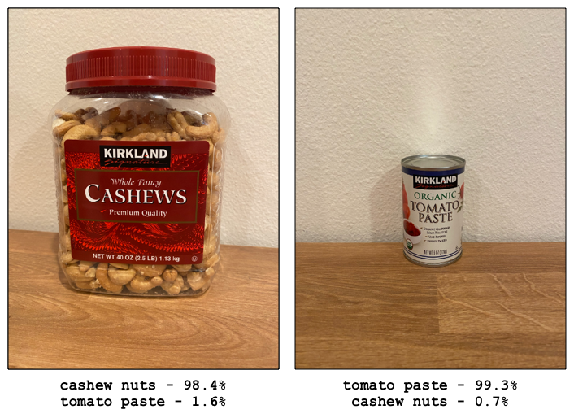

<!--
CO_OP_TRANSLATOR_METADATA:
{
  "original_hash": "8df310a42f902139a01417dacb1ffbef",
  "translation_date": "2025-08-28T00:57:32+00:00",
  "source_file": "5-retail/lessons/1-train-stock-detector/README.md",
  "language_code": "tl"
}
-->
# Mag-train ng Stock Detector

> Sketchnote ni [Nitya Narasimhan](https://github.com/nitya). I-click ang larawan para sa mas malaking bersyon.

Ang video na ito ay nagbibigay ng overview ng Object Detection gamit ang Azure Custom Vision service, isang serbisyong tatalakayin sa araling ito.

> 🎥 I-click ang larawan sa itaas upang panoorin ang video

## Pre-lecture quiz

[Pre-lecture quiz](https://black-meadow-040d15503.1.azurestaticapps.net/quiz/37)

## Panimula

Sa nakaraang proyekto, gumamit ka ng AI upang mag-train ng isang image classifier - isang model na kayang tukuyin kung ang isang larawan ay naglalaman ng isang bagay, tulad ng hinog o hilaw na prutas. Isa pang uri ng AI model na maaaring gamitin sa mga larawan ay ang object detection. Ang mga modelong ito ay hindi nagka-classify ng larawan gamit ang mga tag, sa halip ay sinasanay silang makilala ang mga bagay at mahanap ang mga ito sa mga larawan, hindi lamang natutukoy na naroroon ang bagay kundi pati kung saan ito matatagpuan sa larawan. Sa ganitong paraan, maaari kang magbilang ng mga bagay sa mga larawan.

Sa araling ito, matututunan mo ang tungkol sa object detection, kabilang kung paano ito magagamit sa retail. Matututunan mo rin kung paano mag-train ng object detector sa cloud.

Sa araling ito, tatalakayin natin ang:

* [Object detection](../../../../../5-retail/lessons/1-train-stock-detector)
* [Paggamit ng object detection sa retail](../../../../../5-retail/lessons/1-train-stock-detector)
* [Mag-train ng object detector](../../../../../5-retail/lessons/1-train-stock-detector)
* [Subukan ang iyong object detector](../../../../../5-retail/lessons/1-train-stock-detector)
* [I-retrain ang iyong object detector](../../../../../5-retail/lessons/1-train-stock-detector)

## Object detection

Ang object detection ay tumutukoy sa pagtukoy ng mga bagay sa mga larawan gamit ang AI. Hindi tulad ng image classifier na iyong na-train sa nakaraang proyekto, ang object detection ay hindi tungkol sa paghula ng pinakamahusay na tag para sa buong larawan, kundi sa paghahanap ng isa o higit pang mga bagay sa isang larawan.

### Object detection vs image classification

Ang image classification ay tungkol sa pag-classify ng buong larawan - ano ang mga posibilidad na ang buong larawan ay tumutugma sa bawat tag. Makakakuha ka ng mga posibilidad para sa bawat tag na ginamit upang i-train ang model.

Sa halimbawa sa itaas, dalawang larawan ang na-classify gamit ang isang model na na-train upang i-classify ang mga lalagyan ng cashew nuts o mga lata ng tomato paste. Ang unang larawan ay isang lalagyan ng cashew nuts, at may dalawang resulta mula sa image classifier:

| Tag            | Probability |
| -------------- | ----------: |
| `cashew nuts`  | 98.4%       |
| `tomato paste` | 1.6%        |

Ang pangalawang larawan ay isang lata ng tomato paste, at ang mga resulta ay:

| Tag            | Probability |
| -------------- | ----------: |
| `cashew nuts`  | 0.7%        |
| `tomato paste` | 99.3%       |

Maaari mong gamitin ang mga halagang ito gamit ang isang threshold percentage upang mahulaan kung ano ang nasa larawan. Ngunit paano kung ang isang larawan ay naglalaman ng maraming lata ng tomato paste, o parehong cashew nuts at tomato paste? Malamang na hindi nito maibibigay ang nais mong resulta. Dito pumapasok ang object detection.

Ang object detection ay tumutukoy sa pag-train ng isang model upang makilala ang mga bagay. Sa halip na bigyan ito ng mga larawan na naglalaman ng bagay at sabihing ang bawat larawan ay isa o ibang tag, itinuturo mo ang bahagi ng larawan na naglalaman ng partikular na bagay, at tinatag ito. Maaari kang mag-tag ng isang bagay sa isang larawan o marami. Sa ganitong paraan, natututo ang model kung ano ang hitsura ng mismong bagay, hindi lamang kung ano ang hitsura ng mga larawang naglalaman ng bagay.

Kapag ginamit mo ito upang mahulaan ang mga larawan, sa halip na makakuha ng listahan ng mga tag at porsyento, makakakuha ka ng listahan ng mga natukoy na bagay, kasama ang kanilang bounding box at ang posibilidad na ang bagay ay tumutugma sa nakatalagang tag.

> 🎓 *Bounding boxes* ay ang mga kahon sa paligid ng isang bagay.

Ang larawan sa itaas ay naglalaman ng parehong isang lalagyan ng cashew nuts at tatlong lata ng tomato paste. Natukoy ng object detector ang cashew nuts, na ibinabalik ang bounding box na naglalaman ng cashew nuts kasama ang porsyento ng posibilidad na ang bounding box ay naglalaman ng bagay, sa kasong ito 97.6%. Natukoy din ng object detector ang tatlong lata ng tomato paste, at nagbibigay ng tatlong magkakahiwalay na bounding box, isa para sa bawat natukoy na lata, at bawat isa ay may porsyento ng posibilidad na ang bounding box ay naglalaman ng lata ng tomato paste.

✅ Mag-isip ng ilang iba't ibang sitwasyon kung saan maaaring gamitin ang mga image-based AI models. Alin sa mga ito ang mangangailangan ng classification, at alin ang mangangailangan ng object detection?

### Paano gumagana ang object detection

Ang object detection ay gumagamit ng mga kumplikadong ML models. Ang mga modelong ito ay gumagana sa pamamagitan ng paghahati ng larawan sa maraming mga cell, pagkatapos ay sinusuri kung ang sentro ng bounding box ay ang sentro ng isang imahe na tumutugma sa isa sa mga larawang ginamit upang i-train ang model. Maaari mong isipin ito na parang nagpapatakbo ng isang image classifier sa iba't ibang bahagi ng larawan upang maghanap ng mga tugma.

> 💁 Ito ay isang labis na pinasimpleng paliwanag. Maraming mga pamamaraan para sa object detection, at maaari mong basahin ang higit pa tungkol dito sa [Object detection page sa Wikipedia](https://wikipedia.org/wiki/Object_detection).

Mayroong iba't ibang mga model na maaaring magsagawa ng object detection. Isa sa mga kilalang model ay ang [YOLO (You only look once)](https://pjreddie.com/darknet/yolo/), na napakabilis at kayang tukuyin ang 20 iba't ibang klase ng mga bagay, tulad ng tao, aso, bote, at kotse.

✅ Basahin ang tungkol sa YOLO model sa [pjreddie.com/darknet/yolo/](https://pjreddie.com/darknet/yolo/)

Ang mga object detection models ay maaaring i-retrain gamit ang transfer learning upang matukoy ang mga custom na bagay.

## Paggamit ng object detection sa retail

Ang object detection ay may maraming gamit sa retail. Ilan sa mga ito ay:

* **Pag-check at pagbibilang ng stock** - pagtukoy kung mababa na ang stock sa mga istante. Kung mababa na ang stock, maaaring magpadala ng mga notification sa mga tauhan o robot upang mag-restock ng mga istante.
* **Pagtukoy ng maskara** - sa mga tindahan na may mga polisiya sa maskara sa panahon ng mga pampublikong kalusugan, maaaring tukuyin ng object detection ang mga taong may suot na maskara at wala.
* **Automated billing** - pagtukoy ng mga item na kinuha mula sa mga istante sa mga automated na tindahan at pagsingil sa mga customer nang naaayon.
* **Pagtukoy ng panganib** - pagtukoy ng mga sirang bagay sa sahig, o mga natapong likido, at pag-alerto sa mga cleaning crew.

✅ Mag-research: Ano pa ang ibang mga gamit ng object detection sa retail?

## Mag-train ng object detector

Maaari kang mag-train ng object detector gamit ang Custom Vision, katulad ng kung paano ka nag-train ng isang image classifier.

### Gawain - gumawa ng object detector

1. Gumawa ng Resource Group para sa proyektong ito na tinatawag na `stock-detector`.

1. Gumawa ng libreng Custom Vision training resource, at isang libreng Custom Vision prediction resource sa `stock-detector` resource group. Pangalanan ang mga ito bilang `stock-detector-training` at `stock-detector-prediction`.

    > 💁 Maaari ka lamang magkaroon ng isang libreng training at prediction resource, kaya siguraduhing nalinis mo na ang iyong proyekto mula sa mga naunang aralin.

    > ⚠️ Maaari kang sumangguni sa [mga tagubilin para sa paggawa ng training at prediction resources mula sa proyekto 4, aralin 1 kung kinakailangan](../../../4-manufacturing/lessons/1-train-fruit-detector/README.md#task---create-a-cognitive-services-resource).

1. Buksan ang Custom Vision portal sa [CustomVision.ai](https://customvision.ai), at mag-sign in gamit ang Microsoft account na ginamit mo para sa iyong Azure account.

1. Sundin ang [Create a new Project section ng Build an object detector quickstart sa Microsoft docs](https://docs.microsoft.com/azure/cognitive-services/custom-vision-service/get-started-build-detector?WT.mc_id=academic-17441-jabenn#create-a-new-project) upang gumawa ng bagong Custom Vision project. Ang UI ay maaaring magbago kaya't ang mga dokumentong ito ang pinakanaaayon na reference.

    Pangalanan ang iyong proyekto bilang `stock-detector`.

    Kapag ginawa mo ang iyong proyekto, siguraduhing gamitin ang `stock-detector-training` resource na ginawa mo kanina. Gamitin ang *Object Detection* project type, at ang *Products on Shelves* domain.

    

    ✅ Ang products on shelves domain ay partikular na idinisenyo para sa pagtukoy ng stock sa mga istante ng tindahan. Basahin ang higit pa tungkol sa iba't ibang mga domain sa [Select a domain documentation sa Microsoft Docs](https://docs.microsoft.com/azure/cognitive-services/custom-vision-service/select-domain?WT.mc_id=academic-17441-jabenn#object-detection)

✅ Maglaan ng oras upang galugarin ang Custom Vision UI para sa iyong object detector.

### Gawain - i-train ang iyong object detector

Upang ma-train ang iyong model, kakailanganin mo ng set ng mga larawan na naglalaman ng mga bagay na nais mong tukuyin.

1. Magtipon ng mga larawan na naglalaman ng bagay na nais tukuyin. Kakailanganin mo ng hindi bababa sa 15 larawan na naglalaman ng bawat bagay na nais tukuyin mula sa iba't ibang anggulo at sa iba't ibang kondisyon ng ilaw, ngunit mas marami, mas mabuti. Ang object detector na ito ay gumagamit ng *Products on shelves* domain, kaya subukang ayusin ang mga bagay na parang nasa istante ng tindahan. Kakailanganin mo rin ng ilang mga larawan upang subukan ang model. Kung ikaw ay tumutukoy ng higit sa isang bagay, kakailanganin mo ng ilang mga testing images na naglalaman ng lahat ng mga bagay.

    > 💁 Ang mga larawan na may maraming iba't ibang bagay ay binibilang patungo sa 15 larawan minimum para sa lahat ng mga bagay sa larawan.

    Ang iyong mga larawan ay dapat nasa png o jpeg format, mas maliit sa 6MB. Kung ginawa mo ang mga ito gamit ang isang iPhone halimbawa, maaaring mataas ang resolution ng mga ito bilang HEIC images, kaya kailangang i-convert at posibleng paliitin. Mas marami ang mga larawan, mas mabuti, at dapat kang magkaroon ng magkatulad na bilang ng hinog at hilaw.

    Ang model ay idinisenyo para sa mga produkto sa mga istante, kaya subukang kunan ng larawan ang mga bagay sa mga istante.

    Maaari kang makahanap ng ilang mga halimbawa ng larawan na maaari mong gamitin sa [images](../../../../../5-retail/lessons/1-train-stock-detector/images) folder ng cashew nuts at tomato paste na maaari mong gamitin.

1. Sundin ang [Upload and tag images section ng Build an object detector quickstart sa Microsoft docs](https://docs.microsoft.com/azure/cognitive-services/custom-vision-service/get-started-build-detector?WT.mc_id=academic-17441-jabenn#upload-and-tag-images) upang i-upload ang iyong mga training images. Gumawa ng mga kaukulang tag depende sa mga uri ng bagay na nais mong tukuyin.

    

    Kapag gumuhit ka ng mga bounding box para sa mga bagay, panatilihing masikip ang mga ito sa paligid ng bagay. Maaaring tumagal ng ilang oras upang i-outline ang lahat ng mga larawan, ngunit ang tool ay magde-detect kung ano ang sa tingin nito ay ang mga bounding box, na nagpapabilis ng proseso.

    

    > 💁 Kung mayroon kang higit sa 15 larawan para sa bawat bagay, maaari kang mag-train pagkatapos ng 15 at gamitin ang **Suggested tags** feature. Gagamitin nito ang na-train na model upang tukuyin ang mga bagay sa hindi pa na-tag na larawan. Maaari mo nang kumpirmahin ang mga natukoy na bagay, o tanggihan at muling iguhit ang mga bounding box. Makakatipid ito ng *maraming* oras.

1. Sundin ang [Train the detector section ng Build an object detector quickstart sa Microsoft docs](https://docs.microsoft.com/azure/cognitive-services/custom-vision-service/get-started-build-detector?WT.mc_id=academic-17441-jabenn#train-the-detector) upang i-train ang object detector sa iyong mga na-tag na larawan.

    Bibigyan ka ng pagpipilian ng uri ng training. Piliin ang **Quick Training**.

Ang object detector ay magta-train. Aabutin ng ilang minuto upang makumpleto ang training.

## Subukan ang iyong object detector

Kapag na-train na ang iyong object detector, maaari mo itong subukan sa pamamagitan ng pagbibigay dito ng mga bagong larawan upang tukuyin ang mga bagay.

### Gawain - subukan ang iyong object detector

1. Gamitin ang **Quick Test** button upang i-upload ang mga testing images at tiyaking natukoy ang mga bagay. Gamitin ang mga testing images na ginawa mo kanina, hindi ang alinman sa mga larawang ginamit mo para sa training.

    

1. Subukan ang lahat ng testing images na mayroon ka at obserbahan ang mga posibilidad.

## I-retrain ang iyong object detector

Kapag sinubukan mo ang iyong object detector, maaaring hindi nito maibigay ang mga resulta na iyong inaasahan, tulad ng sa mga image classifiers sa nakaraang proyekto. Maaari mong pagbutihin ang iyong object detector sa pamamagitan ng pag-retrain nito gamit ang mga larawang mali ang resulta.

Sa tuwing gagawa ka ng prediction gamit ang quick test option, ang larawan at mga resulta ay naka-store. Maaari mong gamitin ang mga larawang ito upang i-retrain ang iyong model.

1. Gamitin ang **Predictions** tab upang hanapin ang mga larawang ginamit mo para sa testing.

1. Kumpirmahin ang anumang tamang detection, tanggalin ang mga maling detection at idagdag ang anumang nawawalang mga bagay.

1. I-retrain at muling subukan ang model.

---

## 🚀 Hamon

Ano ang mangyayari kung ginamit mo ang object detector sa mga magkamukhang item, tulad ng parehong brand ng mga lata ng tomato paste at chopped tomatoes?

Kung mayroon kang anumang magkamukhang item, subukan ito sa pamamagitan ng pagdaragdag ng mga larawan ng mga ito sa iyong object detector.

## Post-lecture quiz
[Post-lecture quiz](https://black-meadow-040d15503.1.azurestaticapps.net/quiz/38)

## Review at Pag-aaral sa Sarili

* Noong sinanay mo ang iyong object detector, makikita mo ang mga halaga para sa *Precision*, *Recall*, at *mAP* na nagre-rate sa modelong nalikha. Magbasa pa tungkol sa kung ano ang mga halagang ito gamit ang [Evaluate the detector section ng Build an object detector quickstart sa Microsoft docs](https://docs.microsoft.com/azure/cognitive-services/custom-vision-service/get-started-build-detector?WT.mc_id=academic-17441-jabenn#evaluate-the-detector)
* Magbasa pa tungkol sa object detection sa [Object detection page sa Wikipedia](https://wikipedia.org/wiki/Object_detection)

## Takdang Aralin

[Ikumpara ang mga domain](assignment.md)

---

**Paunawa**:  
Ang dokumentong ito ay isinalin gamit ang AI translation service na [Co-op Translator](https://github.com/Azure/co-op-translator). Bagama't sinisikap naming maging tumpak, tandaan na ang mga awtomatikong pagsasalin ay maaaring maglaman ng mga pagkakamali o hindi pagkakatugma. Ang orihinal na dokumento sa kanyang katutubong wika ang dapat ituring na opisyal na sanggunian. Para sa mahalagang impormasyon, inirerekomenda ang propesyonal na pagsasalin ng tao. Hindi kami mananagot sa anumang hindi pagkakaunawaan o maling interpretasyon na maaaring magmula sa paggamit ng pagsasaling ito.