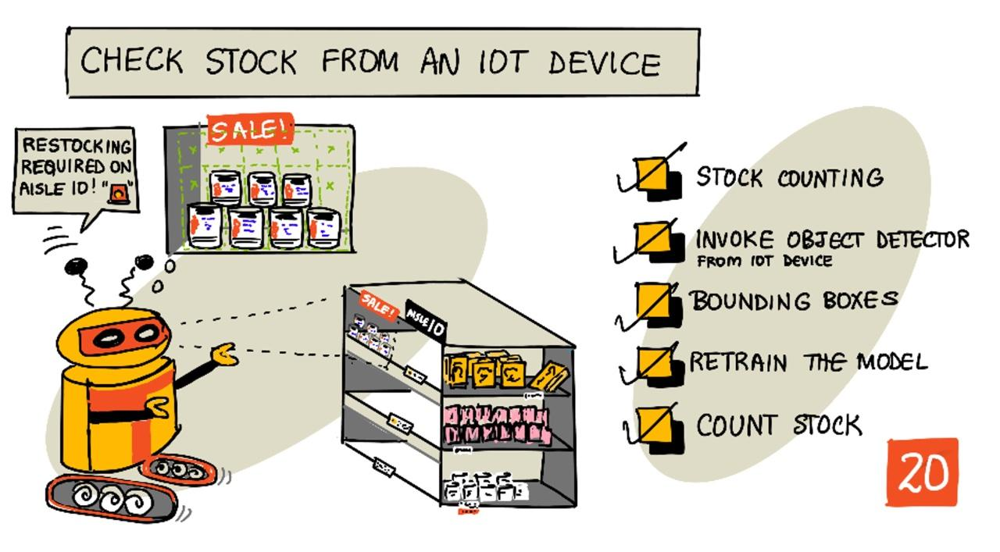
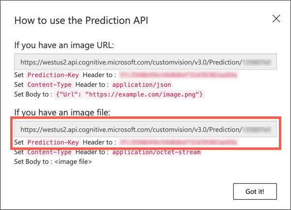

<!--
CO_OP_TRANSLATOR_METADATA:
{
  "original_hash": "1c9e5fa8b7be726c75a97232b1e41c97",
  "translation_date": "2025-08-27T20:42:18+00:00",
  "source_file": "5-retail/lessons/2-check-stock-device/README.md",
  "language_code": "tl"
}
-->
# Suriin ang stock gamit ang isang IoT device



> Sketchnote ni [Nitya Narasimhan](https://github.com/nitya). I-click ang imahe para sa mas malaking bersyon.

## Pre-lecture quiz

[Pre-lecture quiz](https://black-meadow-040d15503.1.azurestaticapps.net/quiz/39)

## Panimula

Sa nakaraang aralin, natutunan mo ang iba't ibang gamit ng object detection sa retail. Natutunan mo rin kung paano mag-train ng object detector upang makilala ang stock. Sa araling ito, matutunan mo kung paano gamitin ang iyong object detector mula sa iyong IoT device upang bilangin ang stock.

Sa araling ito, tatalakayin natin ang:

* [Pagbibilang ng stock](../../../../../5-retail/lessons/2-check-stock-device)
* [Pagtawag sa iyong object detector mula sa iyong IoT device](../../../../../5-retail/lessons/2-check-stock-device)
* [Bounding boxes](../../../../../5-retail/lessons/2-check-stock-device)
* [Pag-retrain ng modelo](../../../../../5-retail/lessons/2-check-stock-device)
* [Pagbibilang ng stock](../../../../../5-retail/lessons/2-check-stock-device)

> 🗑 Ito ang huling aralin sa proyektong ito, kaya pagkatapos makumpleto ang aralin at ang assignment, huwag kalimutang linisin ang iyong cloud services. Kakailanganin mo ang mga serbisyo upang makumpleto ang assignment, kaya siguraduhing tapusin muna ito.
>
> Sumangguni sa [ang gabay sa paglilinis ng iyong proyekto](../../../clean-up.md) kung kinakailangan para sa mga tagubilin kung paano ito gawin.

## Pagbibilang ng stock

Ang mga object detector ay maaaring gamitin para sa pag-check ng stock, alinman sa pagbibilang ng stock o pagtiyak na ang stock ay nasa tamang lugar. Ang mga IoT device na may mga camera ay maaaring i-deploy sa buong tindahan upang i-monitor ang stock, simula sa mga hot spots kung saan mahalaga ang muling paglalagay ng mga item, tulad ng mga lugar kung saan naka-stock ang mga item na may mataas na halaga ngunit kakaunti ang dami.

Halimbawa, kung ang isang camera ay nakatutok sa isang hanay ng mga istante na maaaring maglaman ng 8 lata ng tomato paste, at ang object detector ay nakakita lamang ng 7 lata, nangangahulugan ito na may nawawala at kailangang muling lagyan ng stock.


Sa imahe sa itaas, ang object detector ay nakakita ng 7 lata ng tomato paste sa isang istante na maaaring maglaman ng 8 lata. Hindi lamang maaaring magpadala ang IoT device ng abiso tungkol sa pangangailangan ng muling paglalagay ng stock, ngunit maaari rin itong magbigay ng indikasyon ng lokasyon ng nawawalang item, mahalagang impormasyon kung gumagamit ka ng mga robot para sa muling paglalagay ng stock sa mga istante.

> 💁 Depende sa tindahan at kasikatan ng item, maaaring hindi agad maglagay ng stock kung isa lamang ang nawawala. Kakailanganin mong bumuo ng isang algorithm na magpapasya kung kailan maglalagay ng stock batay sa iyong produkto, mga customer, at iba pang pamantayan.

✅ Sa anong iba pang mga sitwasyon maaaring pagsamahin ang object detection at mga robot?

Minsan, maling stock ang maaaring mapunta sa mga istante. Maaaring ito ay dahil sa pagkakamali ng tao sa muling paglalagay ng stock, o mga customer na nagbago ng isip sa pagbili at inilagay ang item sa unang bakanteng espasyo. Kapag ito ay isang non-perishable item tulad ng mga de-lata, ito ay isang abala lamang. Ngunit kung ito ay isang perishable item tulad ng frozen o chilled goods, maaaring hindi na ito maibenta dahil maaaring imposibleng matukoy kung gaano katagal ang item ay nasa labas ng freezer.

Ang object detection ay maaaring gamitin upang matukoy ang mga hindi inaasahang item, at mag-abiso sa tao o robot upang ibalik ang item sa tamang lokasyon sa lalong madaling panahon.


Sa imahe sa itaas, isang lata ng baby corn ang inilagay sa istante sa tabi ng tomato paste. Natukoy ito ng object detector, na nagpapahintulot sa IoT device na mag-abiso sa tao o robot upang ibalik ang lata sa tamang lokasyon nito.

## Pagtawag sa iyong object detector mula sa iyong IoT device

Ang object detector na na-train mo sa nakaraang aralin ay maaaring tawagan mula sa iyong IoT device.

### Gawain - i-publish ang isang iteration ng iyong object detector

Ang mga iteration ay na-publish mula sa Custom Vision portal.

1. Buksan ang Custom Vision portal sa [CustomVision.ai](https://customvision.ai) at mag-sign in kung hindi mo pa ito nabubuksan. Pagkatapos, buksan ang iyong `stock-detector` na proyekto.

1. Piliin ang **Performance** tab mula sa mga opsyon sa itaas.

1. Piliin ang pinakabagong iteration mula sa listahan ng *Iterations* sa gilid.

1. Piliin ang **Publish** button para sa iteration.

    

1. Sa *Publish Model* dialog, itakda ang *Prediction resource* sa `stock-detector-prediction` resource na ginawa mo sa nakaraang aralin. Iwanan ang pangalan bilang `Iteration2`, at piliin ang **Publish** button.

1. Kapag na-publish na, piliin ang **Prediction URL** button. Ipapakita nito ang mga detalye ng prediction API, at kakailanganin mo ang mga ito upang tawagan ang modelo mula sa iyong IoT device. Ang mas mababang seksyon ay may label na *If you have an image file*, at ito ang mga detalye na kailangan mo. Kopyahin ang URL na ipinapakita na magiging katulad ng:

    ```output
    https://<location>.api.cognitive.microsoft.com/customvision/v3.0/Prediction/<id>/detect/iterations/Iteration2/image
    ```

    Kung saan ang `<location>` ay ang lokasyon na ginamit mo noong nilikha ang iyong custom vision resource, at ang `<id>` ay isang mahabang ID na binubuo ng mga letra at numero.

    Kopyahin din ang *Prediction-Key* value. Ito ay isang secure na key na kailangang ipasa kapag tinawag ang modelo. Tanging ang mga application na nagpapasa ng key na ito ang pinapayagang gumamit ng modelo, ang iba pang mga application ay tinatanggihan.

    

✅ Kapag ang isang bagong iteration ay na-publish, magkakaroon ito ng ibang pangalan. Paano mo sa tingin mababago ang iteration na ginagamit ng isang IoT device?

### Gawain - tawagan ang iyong object detector mula sa iyong IoT device

Sundin ang kaukulang gabay sa ibaba upang gamitin ang object detector mula sa iyong IoT device:

* [Arduino - Wio Terminal](wio-terminal-object-detector.md)
* [Single-board computer - Raspberry Pi/Virtual device](single-board-computer-object-detector.md)

## Bounding boxes

Kapag ginamit mo ang object detector, hindi lamang ang mga natukoy na object na may kanilang mga tag at posibilidad ang makukuha mo, kundi pati na rin ang mga bounding box ng mga object. Ang mga ito ay tumutukoy kung saan natukoy ng object detector ang object na may ibinigay na posibilidad.

> 💁 Ang bounding box ay isang kahon na tumutukoy sa lugar na naglalaman ng natukoy na object, isang kahon na tumutukoy sa hangganan para sa object.

Ang mga resulta ng isang prediction sa **Predictions** tab sa Custom Vision ay may mga bounding box na iginuhit sa imahe na ipinadala para sa prediction.


Sa imahe sa itaas, 4 na lata ng tomato paste ang natukoy. Sa mga resulta, isang pulang parisukat ang inilagay para sa bawat object na natukoy sa imahe, na nagpapahiwatig ng bounding box para sa imahe.

✅ Buksan ang mga prediction sa Custom Vision at tingnan ang mga bounding box.

Ang mga bounding box ay tinutukoy gamit ang 4 na halaga - top, left, height, at width. Ang mga halagang ito ay nasa sukat na 0-1, na kumakatawan sa mga posisyon bilang porsyento ng laki ng imahe. Ang origin (ang 0,0 na posisyon) ay ang kaliwang itaas ng imahe, kaya ang top value ay ang distansya mula sa itaas, at ang ibaba ng bounding box ay ang top plus ang height.


Ang imahe sa itaas ay 600 pixels ang lapad at 800 pixels ang taas. Ang bounding box ay nagsisimula sa 320 pixels pababa, na nagbibigay ng top coordinate na 0.4 (800 x 0.4 = 320). Mula sa kaliwa, ang bounding box ay nagsisimula sa 240 pixels patawid, na nagbibigay ng left coordinate na 0.4 (600 x 0.4 = 240). Ang taas ng bounding box ay 240 pixels, na nagbibigay ng height value na 0.3 (800 x 0.3 = 240). Ang lapad ng bounding box ay 120 pixels, na nagbibigay ng width value na 0.2 (600 x 0.2 = 120).

| Coordinate | Value |
| ---------- | ----: |
| Top        | 0.4   |
| Left       | 0.4   |
| Height     | 0.3   |
| Width      | 0.2   |

Ang paggamit ng mga porsyento mula 0-1 ay nangangahulugan na kahit anong laki ng imahe ang i-scale, ang bounding box ay magsisimula sa 0.4 ng daan pababa at patawid, at may taas na 0.3 ng kabuuang taas at lapad na 0.2 ng kabuuang lapad.

Maaari mong gamitin ang mga bounding box na pinagsama sa mga posibilidad upang suriin kung gaano katumpak ang isang detection. Halimbawa, ang isang object detector ay maaaring makakita ng maraming object na nag-o-overlap, halimbawa ay nakakakita ng isang lata sa loob ng isa pa. Ang iyong code ay maaaring tumingin sa mga bounding box, maunawaan na ito ay imposible, at balewalain ang anumang mga object na may malaking overlap sa iba pang mga object.


Sa halimbawa sa itaas, isang bounding box ang nagpakita ng isang lata ng tomato paste na may posibilidad na 78.3%. Ang pangalawang bounding box ay bahagyang mas maliit, at nasa loob ng unang bounding box na may posibilidad na 64.3%. Ang iyong code ay maaaring suriin ang mga bounding box, makita na sila ay ganap na nag-o-overlap, at balewalain ang mas mababang posibilidad dahil imposibleng ang isang lata ay nasa loob ng isa pa.

✅ Makakaisip ka ba ng sitwasyon kung saan valid ang makakita ng isang object sa loob ng isa pa?

## Pag-retrain ng modelo

Tulad ng sa image classifier, maaari mong i-retrain ang iyong modelo gamit ang data na nakolekta ng iyong IoT device. Ang paggamit ng real-world data na ito ay titiyakin na ang iyong modelo ay gumagana nang maayos kapag ginamit mula sa iyong IoT device.

Hindi tulad ng sa image classifier, hindi mo maaaring i-tag lamang ang isang imahe. Sa halip, kailangan mong suriin ang bawat bounding box na natukoy ng modelo. Kung ang kahon ay nasa maling bagay, kailangan itong tanggalin; kung ito ay nasa maling lokasyon, kailangan itong ayusin.

### Gawain - i-retrain ang modelo

1. Siguraduhing nakakuha ka ng iba't ibang imahe gamit ang iyong IoT device.

1. Mula sa **Predictions** tab, piliin ang isang imahe. Makikita mo ang mga pulang kahon na nagpapahiwatig ng mga bounding box ng mga natukoy na object.

1. Suriin ang bawat bounding box. Piliin ito muna at makikita mo ang isang pop-up na nagpapakita ng tag. Gamitin ang mga handle sa mga sulok ng bounding box upang ayusin ang laki kung kinakailangan. Kung mali ang tag, tanggalin ito gamit ang **X** button at idagdag ang tamang tag. Kung ang bounding box ay hindi naglalaman ng object, tanggalin ito gamit ang trashcan button.

1. Isara ang editor kapag tapos na at ang imahe ay lilipat mula sa **Predictions** tab patungo sa **Training Images** tab. Ulitin ang proseso para sa lahat ng prediction.

1. Gamitin ang **Train** button upang muling i-train ang iyong modelo. Kapag ito ay na-train na, i-publish ang iteration at i-update ang iyong IoT device upang gamitin ang URL ng bagong iteration.

1. I-redeploy ang iyong code at subukan ang iyong IoT device.

## Pagbibilang ng stock

Gamit ang kombinasyon ng bilang ng mga natukoy na object at ang mga bounding box, maaari mong bilangin ang stock sa isang istante.

### Gawain - bilangin ang stock

Sundin ang kaukulang gabay sa ibaba upang bilangin ang stock gamit ang mga resulta mula sa object detector mula sa iyong IoT device:

* [Arduino - Wio Terminal](wio-terminal-count-stock.md)
* [Single-board computer - Raspberry Pi/Virtual device](single-board-computer-count-stock.md)

---

## 🚀 Hamon

Maaari mo bang matukoy ang maling stock? I-train ang iyong modelo sa maraming object, pagkatapos ay i-update ang iyong app upang mag-abiso sa iyo kung ang maling stock ay natukoy.

Maaaring palawakin pa ito at tukuyin ang stock na magkatabi sa parehong istante, at tingnan kung mayroong item na nailagay sa maling lugar sa pamamagitan ng pagtukoy ng mga limitasyon sa mga bounding box.

## Post-lecture quiz

[Post-lecture quiz](https://black-meadow-040d15503.1.azurestaticapps.net/quiz/40)

## Review at Pag-aaral sa Sarili

* Alamin ang higit pa tungkol sa kung paano mag-arkitekto ng isang end-to-end na sistema ng pagtukoy ng stock mula sa [Out of stock detection at the edge pattern guide on Microsoft Docs](https://docs.microsoft.com/hybrid/app-solutions/pattern-out-of-stock-at-edge?WT.mc_id=academic-17441-jabenn)
* Alamin ang iba pang paraan upang bumuo ng mga end-to-end retail solution na pinagsasama ang iba't ibang IoT at cloud services sa pamamagitan ng panonood ng [Behind the scenes of a retail solution - Hands On! video on YouTube](https://www.youtube.com/watch?v=m3Pc300x2Mw).

## Assignment

[Gamitin ang iyong object detector sa edge](assignment.md)

---

**Paunawa**:  
Ang dokumentong ito ay isinalin gamit ang AI translation service na [Co-op Translator](https://github.com/Azure/co-op-translator). Bagama't sinisikap naming maging tumpak, tandaan na ang mga awtomatikong pagsasalin ay maaaring maglaman ng mga pagkakamali o hindi pagkakatugma. Ang orihinal na dokumento sa kanyang katutubong wika ang dapat ituring na opisyal na sanggunian. Para sa mahalagang impormasyon, inirerekomenda ang propesyonal na pagsasalin ng tao. Hindi kami mananagot sa anumang hindi pagkakaunawaan o maling interpretasyon na maaaring magmula sa paggamit ng pagsasaling ito.