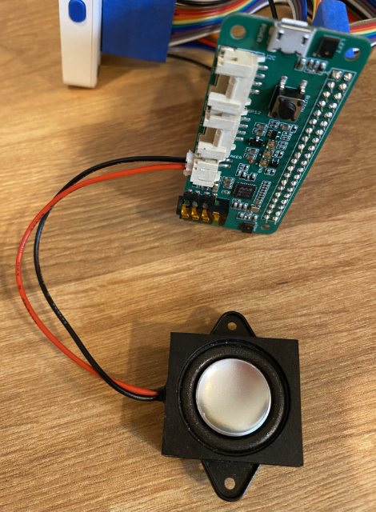

<!--
CO_OP_TRANSLATOR_METADATA:
{
  "original_hash": "93d352de36526b8990e41dd538100324",
  "translation_date": "2025-08-27T23:29:23+00:00",
  "source_file": "6-consumer/lessons/1-speech-recognition/wio-terminal-microphone.md",
  "language_code": "tl"
}
-->
# I-configure ang iyong mikropono at mga speaker - Wio Terminal

Sa bahaging ito ng aralin, magdadagdag ka ng mga speaker sa iyong Wio Terminal. Ang Wio Terminal ay mayroon nang built-in na mikropono, at maaari itong gamitin upang makuha ang boses.

## Kagamitan

Ang Wio Terminal ay mayroon nang built-in na mikropono, at maaari itong gamitin upang makuha ang audio para sa pagkilala ng boses.

Upang magdagdag ng speaker, maaari mong gamitin ang [ReSpeaker 2-Mics Pi Hat](https://www.seeedstudio.com/ReSpeaker-2-Mics-Pi-HAT.html). Isa itong panlabas na board na may kasamang 2 MEMS microphones, pati na rin ang konektor para sa speaker at headphone socket.

Kakailanganin mo ng headphones, isang speaker na may 3.5mm jack, o isang speaker na may JST connection tulad ng [Mono Enclosed Speaker - 2W 6 Ohm](https://www.seeedstudio.com/Mono-Enclosed-Speaker-2W-6-Ohm-p-2832.html).

Upang ikonekta ang ReSpeaker 2-Mics Pi Hat, kakailanganin mo ng 40 pin-to-pin (tinatawag ding male-to-male) jumper cables.

> 💁 Kung sanay ka sa pagsasolder, maaari mong gamitin ang [40 Pin Raspberry Pi Hat Adapter Board For Wio Terminal](https://www.seeedstudio.com/40-Pin-Raspberry-Pi-Hat-Adapter-Board-For-Wio-Terminal-p-4730.html) upang ikonekta ang ReSpeaker.

Kakailanganin mo rin ng SD card upang mag-download at mag-playback ng audio. Sinusuportahan lamang ng Wio Terminal ang mga SD Card na hanggang 16GB ang laki, at kailangang naka-format ang mga ito bilang FAT32 o exFAT.

### Gawain - ikonekta ang ReSpeaker Pi Hat

1. Kapag naka-off ang Wio Terminal, ikonekta ang ReSpeaker 2-Mics Pi Hat sa Wio Terminal gamit ang jumper leads at ang GPIO sockets sa likod ng Wio Terminal:

    Kailangang ikonekta ang mga pin sa ganitong paraan:

    

1. Iposisyon ang ReSpeaker at Wio Terminal na ang mga GPIO sockets ay nakaharap pataas, at nasa kaliwang bahagi.

1. Magsimula sa socket sa itaas na kaliwa ng GPIO socket sa ReSpeaker. Ikonekta ang isang pin-to-pin jumper cable mula sa itaas na kaliwang socket ng ReSpeaker papunta sa itaas na kaliwang socket ng Wio Terminal.

1. Ulitin ito pababa sa lahat ng GPIO sockets sa kaliwang bahagi. Siguraduhing maayos ang pagkakakabit ng mga pin.

    

    

    > 💁 Kung ang iyong jumper cables ay konektado sa ribbons, panatilihin silang magkasama - mas madali itong masigurado na maayos ang pagkakakonekta ng lahat ng cables.

1. Ulitin ang proseso gamit ang mga GPIO sockets sa kanang bahagi ng ReSpeaker at Wio Terminal. Kailangang dumaan ang mga cable na ito sa paligid ng mga cable na nakakonekta na.

    

    

    > 💁 Kung ang iyong jumper cables ay konektado sa ribbons, hatiin ang mga ito sa dalawang ribbons. Ipaikot ang isa sa bawat gilid ng mga umiiral nang cable.

    > 💁 Maaari kang gumamit ng sticky tape upang hawakan ang mga pin sa isang bloke upang maiwasang matanggal ang mga ito habang ikinakabit.

    > 

1. Kakailanganin mong magdagdag ng speaker.

    * Kung gumagamit ka ng speaker na may JST cable, ikonekta ito sa JST port sa ReSpeaker.

      

    * Kung gumagamit ka ng speaker na may 3.5mm jack, o headphones, isaksak ito sa 3.5mm jack socket.

      

### Gawain - i-set up ang SD card

1. Ikonekta ang SD Card sa iyong computer, gamit ang external reader kung wala kang SD Card slot.

1. I-format ang SD Card gamit ang angkop na tool sa iyong computer, siguraduhing gamitin ang FAT32 o exFAT file system.

1. Ipasok ang SD card sa SD Card slot sa kaliwang bahagi ng Wio Terminal, sa ibaba lamang ng power button. Siguraduhing maipasok ito nang buo at marinig ang pag-click - maaaring kailanganin mo ng manipis na tool o isa pang SD Card upang maitulak ito nang buo.

    

    > 💁 Upang alisin ang SD Card, kailangan mo itong itulak nang bahagya at ito ay lalabas. Kakailanganin mo ng manipis na tool tulad ng flat-head screwdriver o isa pang SD Card.

---

**Paunawa**:  
Ang dokumentong ito ay isinalin gamit ang AI translation service na [Co-op Translator](https://github.com/Azure/co-op-translator). Bagama't sinisikap naming maging tumpak, tandaan na ang mga awtomatikong pagsasalin ay maaaring maglaman ng mga pagkakamali o hindi pagkakatugma. Ang orihinal na dokumento sa kanyang katutubong wika ang dapat ituring na opisyal na sanggunian. Para sa mahalagang impormasyon, inirerekomenda ang propesyonal na pagsasalin ng tao. Hindi kami mananagot sa anumang hindi pagkakaunawaan o maling interpretasyon na dulot ng paggamit ng pagsasaling ito.