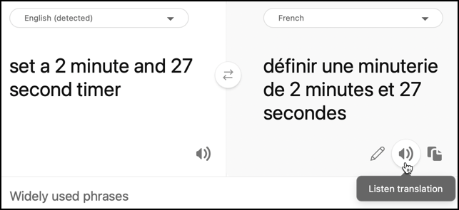

<!--
CO_OP_TRANSLATOR_METADATA:
{
  "original_hash": "d620a470d9dd8614d99824832978360a",
  "translation_date": "2025-08-27T23:02:38+00:00",
  "source_file": "6-consumer/lessons/4-multiple-language-support/virtual-device-translate-speech.md",
  "language_code": "tl"
}
-->
# Isalin ang pagsasalita - Virtual IoT Device

Sa bahaging ito ng aralin, magsusulat ka ng code upang isalin ang pagsasalita kapag nagko-convert sa text gamit ang speech service, pagkatapos ay isalin ang text gamit ang Translator service bago bumuo ng sagot na binibigkas.

## Gamitin ang speech service upang isalin ang pagsasalita

Ang speech service ay maaaring kumuha ng pagsasalita at hindi lamang i-convert ito sa text sa parehong wika, kundi pati na rin isalin ang output sa ibang mga wika.

### Gawain - gamitin ang speech service upang isalin ang pagsasalita

1. Buksan ang proyekto na `smart-timer` sa VS Code, at tiyaking naka-load ang virtual environment sa terminal.

1. Idagdag ang mga sumusunod na import statements sa ibaba ng mga umiiral na imports:

    ```python
    from azure.cognitiveservices import speech
    from azure.cognitiveservices.speech.translation import SpeechTranslationConfig, TranslationRecognizer
    import requests
    ```

    Ini-import nito ang mga klase na ginagamit upang isalin ang pagsasalita, at ang `requests` library na gagamitin upang gumawa ng tawag sa Translator service sa susunod na bahagi ng aralin.

1. Ang iyong smart timer ay magkakaroon ng 2 wika na nakatakda - ang wika ng server na ginamit upang sanayin ang LUIS (ang parehong wika ay ginagamit din upang bumuo ng mga mensahe para makipag-usap sa user), at ang wika na sinasalita ng user. I-update ang variable na `language` upang maging wika na gagamitin ng user, at magdagdag ng bagong variable na tinatawag na `server_language` para sa wika na ginamit upang sanayin ang LUIS:

    ```python
    language = '<user language>'
    server_language = '<server language>'
    ```

    Palitan ang `<user language>` ng pangalan ng locale para sa wika na iyong gagamitin, halimbawa `fr-FR` para sa French, o `zn-HK` para sa Cantonese.

    Palitan ang `<server language>` ng pangalan ng locale para sa wika na ginamit upang sanayin ang LUIS.

    Makakahanap ka ng listahan ng mga suportadong wika at kanilang mga pangalan ng locale sa [Language and voice support documentation on Microsoft docs](https://docs.microsoft.com/azure/cognitive-services/speech-service/language-support?WT.mc_id=academic-17441-jabenn#speech-to-text).

    > 💁 Kung hindi ka nagsasalita ng maraming wika, maaari kang gumamit ng serbisyo tulad ng [Bing Translate](https://www.bing.com/translator) o [Google Translate](https://translate.google.com) upang isalin mula sa iyong gustong wika patungo sa wika na iyong pinili. Ang mga serbisyong ito ay maaari ring magpatugtog ng audio ng isinaling text. Tandaan na ang speech recognizer ay maaaring balewalain ang ilang audio output mula sa iyong device, kaya maaaring kailanganin mong gumamit ng karagdagang device upang patugtugin ang isinaling text.
    >
    > Halimbawa, kung sinanay mo ang LUIS sa English, ngunit nais mong gamitin ang French bilang wika ng user, maaari mong isalin ang mga pangungusap tulad ng "set a 2 minute and 27 second timer" mula sa English patungo sa French gamit ang Bing Translate, pagkatapos ay gamitin ang **Listen translation** button upang magsalita ng isinalin na text sa iyong mikropono.
    >
    > 

1. Palitan ang mga deklarasyon ng `recognizer_config` at `recognizer` ng mga sumusunod:

    ```python
    translation_config = SpeechTranslationConfig(subscription=speech_api_key,
                                                 region=location,
                                                 speech_recognition_language=language,
                                                 target_languages=(language, server_language))
    
    recognizer = TranslationRecognizer(translation_config=translation_config)
    ```

    Gumagawa ito ng translation config upang kilalanin ang pagsasalita sa wika ng user, at lumikha ng mga pagsasalin sa wika ng user at server. Pagkatapos ay ginagamit ang config na ito upang lumikha ng translation recognizer - isang speech recognizer na maaaring isalin ang output ng speech recognition sa maraming wika.

    > 💁 Ang orihinal na wika ay kailangang tukuyin sa `target_languages`, kung hindi, wala kang makukuhang mga pagsasalin.

1. I-update ang function na `recognized`, palitan ang buong nilalaman ng function ng mga sumusunod:

    ```python
    if args.result.reason == speech.ResultReason.TranslatedSpeech:
        language_match = next(l for l in args.result.translations if server_language.lower().startswith(l.lower()))
        text = args.result.translations[language_match]
        if (len(text) > 0):
            print(f'Translated text: {text}')
    
            message = Message(json.dumps({ 'speech': text }))
            device_client.send_message(message)
    ```

    Ang code na ito ay nagche-check kung ang recognized event ay na-trigger dahil sa pagsasalin ng pagsasalita (ang event na ito ay maaaring ma-trigger sa ibang mga pagkakataon, tulad ng kapag ang pagsasalita ay kinilala ngunit hindi isinalin). Kung ang pagsasalita ay isinalin, hinahanap nito ang pagsasalin sa `args.result.translations` dictionary na tumutugma sa wika ng server.

    Ang `args.result.translations` dictionary ay naka-key sa bahagi ng wika ng setting ng locale, hindi ang buong setting. Halimbawa, kung humiling ka ng pagsasalin sa `fr-FR` para sa French, ang dictionary ay maglalaman ng entry para sa `fr`, hindi `fr-FR`.

    Ang isinaling text ay pagkatapos ay ipinapadala sa IoT Hub.

1. Patakbuhin ang code na ito upang subukan ang mga pagsasalin. Tiyaking tumatakbo ang iyong function app, at humiling ng timer sa wika ng user, alinman sa pamamagitan ng pagsasalita ng wika na iyon mismo, o gamit ang translation app.

    ```output
    (.venv) ➜  smart-timer python app.py
    Connecting
    Connected
    Translated text: Set a timer of 2 minutes and 27 seconds.
    ```

## Isalin ang text gamit ang translator service

Ang speech service ay hindi sumusuporta sa pagsasalin ng text pabalik sa pagsasalita, sa halip maaari mong gamitin ang Translator service upang isalin ang text. Ang serbisyong ito ay may REST API na maaari mong gamitin upang isalin ang text.

### Gawain - gamitin ang translator resource upang isalin ang text

1. Idagdag ang translator API key sa ibaba ng `speech_api_key`:

    ```python
    translator_api_key = '<key>'
    ```

    Palitan ang `<key>` ng API key para sa iyong translator service resource.

1. Sa itaas ng function na `say`, tukuyin ang function na `translate_text` na mag-i-translate ng text mula sa wika ng server patungo sa wika ng user:

    ```python
    def translate_text(text):
    ```

1. Sa loob ng function na ito, tukuyin ang URL at headers para sa REST API call:

    ```python
    url = f'https://api.cognitive.microsofttranslator.com/translate?api-version=3.0'

    headers = {
        'Ocp-Apim-Subscription-Key': translator_api_key,
        'Ocp-Apim-Subscription-Region': location,
        'Content-type': 'application/json'
    }
    ```

    Ang URL para sa API na ito ay hindi location specific, sa halip ang lokasyon ay ipinapasa bilang header. Ang API key ay direktang ginagamit, kaya hindi tulad ng speech service, walang pangangailangan na kumuha ng access token mula sa token issuer API.

1. Sa ibaba nito, tukuyin ang parameters at body para sa tawag:

    ```python
    params = {
        'from': server_language,
        'to': language
    }

    body = [{
        'text' : text
    }]
    ```

    Ang `params` ay tumutukoy sa mga parameter na ipapasa sa API call, na ipinapasa ang mula at patungo sa mga wika. Ang tawag na ito ay mag-i-translate ng text sa `from` na wika patungo sa `to` na wika.

    Ang `body` ay naglalaman ng text na isasalin. Ito ay isang array, dahil maraming mga bloke ng text ang maaaring isalin sa parehong tawag.

1. Gawin ang tawag sa REST API, at kunin ang response:

    ```python
    response = requests.post(url, headers=headers, params=params, json=body)
    ```

    Ang response na bumabalik ay isang JSON array, na may isang item na naglalaman ng mga pagsasalin. Ang item na ito ay may array para sa mga pagsasalin ng lahat ng mga item na ipinasa sa body.

    ```json
    [
        {
            "translations": [
                {
                    "text": "Chronométrant votre minuterie de 2 minutes 27 secondes.",
                    "to": "fr"
                }
            ]
        }
    ]
    ```

1. Ibalik ang `text` property mula sa unang pagsasalin mula sa unang item sa array:

    ```python
    return response.json()[0]['translations'][0]['text']
    ```

1. I-update ang function na `say` upang isalin ang text na sasabihin bago ang SSML ay mabuo:

    ```python
    print('Original:', text)
    text = translate_text(text)
    print('Translated:', text)
    ```

    Ang code na ito ay nagpi-print din ng orihinal at isinaling bersyon ng text sa console.

1. Patakbuhin ang iyong code. Tiyaking tumatakbo ang iyong function app, at humiling ng timer sa wika ng user, alinman sa pamamagitan ng pagsasalita ng wika na iyon mismo, o gamit ang translation app.

    ```output
    (.venv) ➜  smart-timer python app.py
    Connecting
    Connected
    Translated text: Set a timer of 2 minutes and 27 seconds.
    Original: 2 minute 27 second timer started.
    Translated: 2 minute 27 seconde minute a commencé.
    Original: Times up on your 2 minute 27 second timer.
    Translated: Chronométrant votre minuterie de 2 minutes 27 secondes.
    ```

    > 💁 Dahil sa iba't ibang paraan ng pagsasabi ng isang bagay sa iba't ibang wika, maaari kang makakuha ng mga pagsasalin na bahagyang naiiba sa mga halimbawa na ibinigay mo sa LUIS. Kung ganito ang kaso, magdagdag ng mas maraming halimbawa sa LUIS, muling sanayin, pagkatapos ay muling i-publish ang modelo.

> 💁 Makikita mo ang code na ito sa [code/virtual-iot-device](../../../../../6-consumer/lessons/4-multiple-language-support/code/virtual-iot-device) folder.

😀 Tagumpay ang iyong multilingual timer program!

---

**Paunawa**:  
Ang dokumentong ito ay isinalin gamit ang AI translation service na [Co-op Translator](https://github.com/Azure/co-op-translator). Bagama't sinisikap naming maging tumpak, tandaan na ang mga awtomatikong pagsasalin ay maaaring maglaman ng mga pagkakamali o hindi pagkakatugma. Ang orihinal na dokumento sa kanyang katutubong wika ang dapat ituring na opisyal na sanggunian. Para sa mahalagang impormasyon, inirerekomenda ang propesyonal na pagsasalin ng tao. Hindi kami mananagot sa anumang hindi pagkakaunawaan o maling interpretasyon na maaaring magmula sa paggamit ng pagsasaling ito.