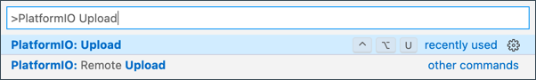

<!--
CO_OP_TRANSLATOR_METADATA:
{
  "original_hash": "a4f0c166010e31fd7b6ca20bc88dec6d",
  "translation_date": "2025-08-28T03:39:04+00:00",
  "source_file": "1-getting-started/lessons/1-introduction-to-iot/wio-terminal.md",
  "language_code": "tr"
}
-->
# Wio Terminal

[Seeed Studios'un Wio Terminal'i](https://www.seeedstudio.com/Wio-Terminal-p-4509.html), WiFi, bazı sensörler ve aktüatörler ile donatılmış, Arduino uyumlu bir mikrodenetleyicidir. Ayrıca, [Grove](https://www.seeedstudio.com/category/Grove-c-1003.html) adlı bir donanım ekosistemi kullanarak daha fazla sensör ve aktüatör eklemek için portlara sahiptir.


## Kurulum

Wio Terminal'inizi kullanmak için bilgisayarınıza bazı ücretsiz yazılımlar yüklemeniz gerekecek. Ayrıca, Wio Terminal'i WiFi'ye bağlamadan önce ürün yazılımını güncellemeniz gerekecek.

### Görev - Kurulum

Gerekli yazılımları yükleyin ve ürün yazılımını güncelleyin.

1. Visual Studio Code (VS Code) yükleyin. Bu, cihaz kodunuzu C/C++ dilinde yazmak için kullanacağınız editördür. VS Code'u yükleme talimatları için [VS Code belgelerine](https://code.visualstudio.com?WT.mc_id=academic-17441-jabenn) bakın.

    > 💁 Arduino geliştirme için popüler bir diğer IDE, [Arduino IDE](https://www.arduino.cc/en/software)'dir. Bu araca zaten aşinaysanız, VS Code ve PlatformIO yerine bunu kullanabilirsiniz. Ancak derslerde verilen talimatlar VS Code kullanımı üzerine olacaktır.

1. VS Code PlatformIO uzantısını yükleyin. Bu, C/C++ dilinde mikrodenetleyicileri programlamayı destekleyen bir VS Code uzantısıdır. Bu uzantıyı VS Code'a yükleme talimatları için [PlatformIO uzantı belgelerine](https://marketplace.visualstudio.com/items?WT.mc_id=academic-17441-jabenn&itemName=platformio.platformio-ide) bakın. Bu uzantı, C ve C++ kodlarıyla çalışmak için Microsoft C/C++ uzantısına bağlıdır ve PlatformIO'yu yüklediğinizde bu uzantı otomatik olarak yüklenir.

1. Wio Terminal'inizi bilgisayarınıza bağlayın. Wio Terminal'in alt kısmında bir USB-C portu bulunur ve bu portun bilgisayarınızdaki bir USB portuna bağlanması gerekir. Wio Terminal, bir USB-C - USB-A kablosu ile gelir. Ancak bilgisayarınızda yalnızca USB-C portları varsa, bir USB-C kablosu veya USB-A - USB-C adaptörüne ihtiyacınız olacaktır.

1. Wio Terminal'inizi kurmak ve ürün yazılımını güncellemek için [Wio Terminal Wiki WiFi Genel Bakış belgelerindeki](https://wiki.seeedstudio.com/Wio-Terminal-Network-Overview/) talimatları izleyin.

## Merhaba Dünya

Yeni bir programlama dili veya teknolojiyle çalışmaya başlarken, genellikle bir 'Merhaba Dünya' uygulaması oluşturulur. Bu, tüm araçların doğru şekilde yapılandırıldığını göstermek için `"Merhaba Dünya"` gibi bir metni çıktı olarak veren küçük bir uygulamadır.

Wio Terminal için 'Merhaba Dünya' uygulaması, Visual Studio Code'un PlatformIO ile birlikte mikrodenetleyici geliştirme için doğru şekilde kurulduğundan emin olmanızı sağlar.

### PlatformIO projesi oluşturun

İlk adım, Wio Terminal için yapılandırılmış bir PlatformIO projesi oluşturmaktır.

#### Görev - PlatformIO projesi oluşturun

PlatformIO projesini oluşturun.

1. Wio Terminal'i bilgisayarınıza bağlayın.

1. VS Code'u başlatın.

1. PlatformIO simgesi yan menü çubuğunda görünecektir:

    

    Bu menü öğesini seçin, ardından *PIO Home -> Open* seçeneğini seçin.

    

1. Hoş geldiniz ekranından **+ New Project** düğmesini seçin.

    

1. *Proje Sihirbazı*nda projeyi yapılandırın:

    1. Projenize `nightlight` adını verin.

    1. *Board* açılır menüsünden `WIO` yazın ve kartları filtreleyin, ardından *Seeeduino Wio Terminal* seçeneğini seçin.

    1. *Framework* olarak *Arduino* seçeneğini bırakın.

    1. *Use default location* kutusunu işaretli bırakın veya işaretini kaldırarak projeniz için bir konum seçin.

    1. **Finish** düğmesini seçin.

    

    PlatformIO, Wio Terminal için kod derlemek için gereken bileşenleri indirir ve projenizi oluşturur. Bu işlem birkaç dakika sürebilir.

### PlatformIO projesini inceleyin

VS Code gezgini, PlatformIO sihirbazı tarafından oluşturulan bir dizi dosya ve klasörü gösterecektir.

#### Klasörler

* `.pio` - Bu klasör, PlatformIO tarafından kullanılan geçici verileri içerir, örneğin kütüphaneler veya derlenmiş kod. Silinirse otomatik olarak yeniden oluşturulur ve projenizi GitHub gibi sitelerde paylaşırken kaynak kod kontrolüne eklemeniz gerekmez.
* `.vscode` - Bu klasör, PlatformIO ve VS Code tarafından kullanılan yapılandırmayı içerir. Silinirse otomatik olarak yeniden oluşturulur ve projenizi GitHub gibi sitelerde paylaşırken kaynak kod kontrolüne eklemeniz gerekmez.
* `include` - Bu klasör, kodunuza ek kütüphaneler eklerken ihtiyaç duyulan harici başlık dosyaları içindir. Bu derslerde bu klasörü kullanmayacaksınız.
* `lib` - Bu klasör, kodunuzdan çağırmak istediğiniz harici kütüphaneler içindir. Bu derslerde bu klasörü kullanmayacaksınız.
* `src` - Bu klasör, uygulamanızın ana kaynak kodunu içerir. Başlangıçta yalnızca bir dosya - `main.cpp` - içerir.
* `test` - Bu klasör, kodunuz için birim testlerini koyacağınız yerdir.

#### Dosyalar

* `main.cpp` - `src` klasöründeki bu dosya, uygulamanızın giriş noktasını içerir. Bu dosyayı açtığınızda aşağıdaki kodu içerir:

    ```cpp
    #include <Arduino.h>
    
    void setup() {
      // put your setup code here, to run once:
    }
    
    void loop() {
      // put your main code here, to run repeatedly:
    }
    ```

    Cihaz başlatıldığında, Arduino framework'ü `setup` fonksiyonunu bir kez çalıştırır, ardından cihaz kapatılana kadar `loop` fonksiyonunu tekrar tekrar çalıştırır.

* `.gitignore` - Bu dosya, kodunuzu Git kaynak kod kontrolüne eklerken (örneğin, bir GitHub deposuna yüklerken) göz ardı edilecek dosya ve dizinleri listeler.

* `platformio.ini` - Bu dosya, cihazınız ve uygulamanız için yapılandırmayı içerir. Bu dosyayı açtığınızda aşağıdaki kodu içerir:

    ```ini
    [env:seeed_wio_terminal]
    platform = atmelsam
    board = seeed_wio_terminal
    framework = arduino
    ```

    `[env:seeed_wio_terminal]` bölümü, Wio Terminal için yapılandırmayı içerir. Kodunuzun birden fazla kart için derlenebilmesi için birden fazla `env` bölümü ekleyebilirsiniz.

    Diğer değerler, proje sihirbazındaki yapılandırmayla eşleşir:

  * `platform = atmelsam`, Wio Terminal'in kullandığı donanımı tanımlar (ATSAMD51 tabanlı bir mikrodenetleyici).
  * `board = seeed_wio_terminal`, mikrodenetleyici kartının türünü tanımlar (Wio Terminal).
  * `framework = arduino`, bu projenin Arduino framework'ünü kullandığını tanımlar.

### Merhaba Dünya uygulamasını yazın

Artık Merhaba Dünya uygulamasını yazmaya hazırsınız.

#### Görev - Merhaba Dünya uygulamasını yazın

Merhaba Dünya uygulamasını yazın.

1. VS Code'da `main.cpp` dosyasını açın.

1. Kodu aşağıdakiyle değiştirin:

    ```cpp
    #include <Arduino.h>

    void setup()
    {
        Serial.begin(9600);

        while (!Serial)
            ; // Wait for Serial to be ready
    
        delay(1000);
    }
    
    void loop()
    {
        Serial.println("Hello World");
        delay(5000);
    }
    ```

    `setup` fonksiyonu, seri porta (bu durumda, Wio Terminal'in bilgisayarınıza bağlanmak için kullandığı USB portu) bir bağlantı başlatır. Parametre `9600`, [baud hızı](https://wikipedia.org/wiki/Symbol_rate) (veya Sembol hızı) olarak bilinir ve seri port üzerinden saniyede gönderilecek veri hızını tanımlar. Bu ayar, saniyede 9.600 bit (0 ve 1) veri gönderileceği anlamına gelir. Ardından seri portun hazır olmasını bekler.

    `loop` fonksiyonu, `Hello World!` satırını seri porta gönderir, böylece `Hello World!` karakterleri ve bir yeni satır karakteri gönderilir. Ardından 5.000 milisaniye veya 5 saniye uyur. `loop` sona erdikten sonra tekrar çalıştırılır ve cihaz açık olduğu sürece bu işlem tekrarlanır.

1. Wio Terminal'inizi yükleme moduna alın. Cihaza her yeni kod yüklediğinizde bunu yapmanız gerekecek:

    1. Güç anahtarını iki kez hızlıca aşağı çekin - her seferinde anahtar tekrar açık konuma dönecektir.

    1. USB portunun sağ tarafındaki mavi durum LED'ini kontrol edin. LED'in yanıp sönmesi gerekir.
    
    [](https://youtu.be/LeKU_7zLRrQ)
    
    Bunu nasıl yapacağınızı gösteren bir video için yukarıdaki görsele tıklayın.

1. Kodu derleyin ve Wio Terminal'e yükleyin.

    1. VS Code komut paletini açın.

    1. `PlatformIO Upload` yazın ve yükleme seçeneğini arayın, ardından *PlatformIO: Upload* seçeneğini seçin.

        

        PlatformIO, gerekirse kodu otomatik olarak derler ve ardından yükler.

    1. Kod derlenir ve Wio Terminal'e yüklenir.

        > 💁 macOS kullanıyorsanız, *DISK NOT EJECTED PROPERLY* (Disk Doğru Şekilde Çıkarılmadı) hakkında bir bildirim alabilirsiniz. Bunun nedeni, Wio Terminal'in flaşlama işleminin bir parçası olarak bir sürücü olarak bağlanması ve derlenmiş kod cihaza yazıldığında bağlantısının kesilmesidir. Bu bildirimi görmezden gelebilirsiniz.

    ⚠️ Yükleme portunun kullanılamadığına dair hatalar alırsanız, önce Wio Terminal'inizin bilgisayarınıza bağlı olduğundan, ekranın sol tarafındaki anahtar kullanılarak açık olduğundan ve yükleme moduna alındığından emin olun. Alt kısımdaki yeşil ışık yanmalı ve mavi ışık yanıp sönmelidir. Hala hata alıyorsanız, Wio Terminal'i yükleme moduna zorlamak için açma/kapama anahtarını tekrar hızlıca iki kez aşağı çekin ve yüklemeyi tekrar deneyin.

PlatformIO'nun, Wio Terminal'den USB kablosu üzerinden gönderilen verileri izleyebilen bir Seri Monitörü vardır. Bu, `Serial.println("Hello World");` komutuyla gönderilen verileri izlemenizi sağlar.

1. VS Code komut paletini açın.

1. `PlatformIO Serial` yazın ve Seri Monitör seçeneğini arayın, ardından *PlatformIO: Serial Monitor* seçeneğini seçin.

    

    Yeni bir terminal açılacak ve seri port üzerinden gönderilen veriler bu terminale akacaktır:

    ```output
    > Executing task: platformio device monitor <
    
    --- Available filters and text transformations: colorize, debug, default, direct, hexlify, log2file, nocontrol, printable, send_on_enter, time
    --- More details at http://bit.ly/pio-monitor-filters
    --- Miniterm on /dev/cu.usbmodem101  9600,8,N,1 ---
    --- Quit: Ctrl+C | Menu: Ctrl+T | Help: Ctrl+T followed by Ctrl+H ---
    Hello World
    Hello World
    ```

    `Hello World` her 5 saniyede bir seri monitöre yazdırılacaktır.

> 💁 Bu kodu [code/wio-terminal](../../../../../1-getting-started/lessons/1-introduction-to-iot/code/wio-terminal) klasöründe bulabilirsiniz.

😀 'Merhaba Dünya' programınız başarılı oldu!

---

**Feragatname**:  
Bu belge, AI çeviri hizmeti [Co-op Translator](https://github.com/Azure/co-op-translator) kullanılarak çevrilmiştir. Doğruluk için çaba göstersek de, otomatik çevirilerin hata veya yanlışlık içerebileceğini lütfen unutmayın. Belgenin orijinal dili, yetkili kaynak olarak kabul edilmelidir. Kritik bilgiler için profesyonel insan çevirisi önerilir. Bu çevirinin kullanımından kaynaklanan yanlış anlamalar veya yanlış yorumlamalardan sorumlu değiliz.