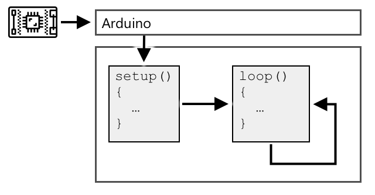

<!--
CO_OP_TRANSLATOR_METADATA:
{
  "original_hash": "9dd7f645ad1c6f20b72fee512987f772",
  "translation_date": "2025-08-28T03:26:00+00:00",
  "source_file": "1-getting-started/lessons/2-deeper-dive/README.md",
  "language_code": "tr"
}
-->
# IoT'ye Daha Derin Bir Bakış

> Sketchnote: [Nitya Narasimhan](https://github.com/nitya). Daha büyük bir versiyon için resme tıklayın.

Bu ders, [Microsoft Reactor](https://developer.microsoft.com/reactor/?WT.mc_id=academic-17441-jabenn) tarafından sunulan [Hello IoT serisi](https://youtube.com/playlist?list=PLmsFUfdnGr3xRts0TIwyaHyQuHaNQcb6-) kapsamında öğretilmiştir. Ders, 1 saatlik bir ders ve ardından dersin bazı bölümlerine daha derinlemesine bakış ve soruların yanıtlandığı 1 saatlik bir ofis saati olmak üzere iki video olarak sunulmuştur.

> 🎥 Videoları izlemek için yukarıdaki resimlere tıklayın

## Ders Öncesi Test

[Ders öncesi test](https://black-meadow-040d15503.1.azurestaticapps.net/quiz/3)

## Giriş

Bu ders, önceki derste ele alınan bazı kavramlara daha derinlemesine bir bakış sunar.

Bu derste ele alacağımız konular:

* [Bir IoT uygulamasının bileşenleri](../../../../../1-getting-started/lessons/2-deeper-dive)
* [Mikrokontrolcülere daha derinlemesine bakış](../../../../../1-getting-started/lessons/2-deeper-dive)
* [Tek kartlı bilgisayarlara daha derinlemesine bakış](../../../../../1-getting-started/lessons/2-deeper-dive)

## Bir IoT Uygulamasının Bileşenleri

Bir IoT uygulamasının iki bileşeni vardır: *İnternet* ve *şey*. Şimdi bu iki bileşene biraz daha detaylı bakalım.

### Şey

IoT'nin **Şey** kısmı, fiziksel dünyayla etkileşim kurabilen bir cihazı ifade eder. Bu cihazlar genellikle küçük, düşük fiyatlı bilgisayarlardır, düşük hızlarda çalışır ve düşük güç kullanır - örneğin, yalnızca birkaç yüz megahertz hızında çalışan ve bazen o kadar az güç tüketen basit mikrokontrolcüler (PC'deki gigabaytlar yerine kilobaytlar RAM ile) ki pillerle haftalar, aylar veya hatta yıllarca çalışabilirler.

Bu cihazlar fiziksel dünyayla etkileşim kurar; ya sensörler kullanarak çevrelerinden veri toplar ya da çıkışlar veya aktüatörler aracılığıyla fiziksel değişiklikler yapar. Bunun tipik bir örneği akıllı bir termostattır - bir sıcaklık sensörüne, bir dokunmatik ekran veya bir düğme gibi istenen sıcaklığı ayarlama yöntemine ve algılanan sıcaklık istenen aralığın dışındaysa açılabilen bir ısıtma veya soğutma sistemine bağlanma yeteneğine sahip bir cihaz. Sıcaklık sensörü odanın çok soğuk olduğunu algılar ve bir aktüatör ısıtmayı açar.

IoT cihazı olarak hareket edebilecek çok çeşitli şeyler vardır; bir şeyi algılayan özel donanımdan genel amaçlı cihazlara kadar, hatta akıllı telefonunuz bile! Bir akıllı telefon, çevresindeki dünyayı algılamak için sensörler ve dünyayla etkileşim kurmak için aktüatörler kullanabilir - örneğin, bir GPS sensörü kullanarak konumunuzu algılayabilir ve bir hoparlör kullanarak bir hedefe navigasyon talimatları verebilir.

✅ Çevrenizdeki sensörlerden veri okuyan ve bu verileri kullanarak kararlar alan diğer sistemleri düşünün. Bir örnek, bir fırının termostatı olabilir. Daha fazla örnek bulabilir misiniz?

### İnternet

IoT uygulamasının **İnternet** tarafı, IoT cihazının veri göndermek ve almak için bağlanabileceği uygulamaları, ayrıca IoT cihazından gelen verileri işleyebilecek ve IoT cihazının aktüatörlerine hangi taleplerin gönderileceğine karar vermeye yardımcı olabilecek diğer uygulamaları içerir.

Tipik bir kurulum, IoT cihazının bağlandığı bir tür bulut hizmetine sahip olmak ve bu bulut hizmetinin güvenlik gibi şeyleri, IoT cihazından gelen mesajları almayı ve cihaza mesajlar göndermeyi yönetmesidir. Bu bulut hizmeti daha sonra sensör verilerini işleyebilecek veya depolayabilecek diğer uygulamalara bağlanır ya da diğer sistemlerden gelen verilerle sensör verilerini kullanarak kararlar alır.

Cihazlar her zaman WiFi veya kablolu bağlantılar üzerinden doğrudan İnternet'e bağlanmaz. Bazı cihazlar, Bluetooth gibi teknolojiler üzerinden birbirleriyle konuşmak için ağ oluşturmayı kullanır ve bir İnternet bağlantısına sahip bir hub cihazı üzerinden bağlanır.

Akıllı termostat örneğinde, termostat ev WiFi'sini kullanarak bulutta çalışan bir bulut hizmetine bağlanır. Bu bulut hizmetine sıcaklık verilerini gönderir ve buradan bir tür veritabanına yazılır, böylece ev sahibi bir telefon uygulaması kullanarak mevcut ve geçmiş sıcaklıkları kontrol edebilir. Buluttaki başka bir hizmet, ev sahibinin istediği sıcaklığı bilir ve bulut hizmeti aracılığıyla IoT cihazına mesajlar göndererek ısıtma sistemini açıp kapatmasını söyler.

Daha akıllı bir versiyon, buluttaki AI'yi diğer IoT cihazlarına bağlı diğer sensörlerden gelen verilerle, örneğin hangi odaların kullanıldığını algılayan doluluk sensörleriyle, hava durumu ve hatta takviminiz gibi verilerle birleştirerek sıcaklığı akıllı bir şekilde ayarlamak için kararlar alabilir. Örneğin, takviminizden tatilde olduğunuzu okursa ısıtmanızı kapatabilir veya hangi odaları kullandığınıza bağlı olarak oda bazında ısıtmayı kapatabilir, zamanla daha doğru olmak için verilerden öğrenebilir.

✅ İnternet bağlantılı bir termostatı daha akıllı hale getirebilecek başka hangi veriler olabilir?

### Edge'de IoT

IoT'deki "I" harfi İnternet'i temsil etse de, bu cihazların İnternet'e bağlanması gerekmez. Bazı durumlarda, cihazlar yerel ağınızda çalışan ve verileri İnternet üzerinden bir çağrı yapmadan işleyebilen 'edge' cihazlara bağlanabilir. Bu, çok fazla veri olduğunda veya İnternet bağlantısı yavaş olduğunda daha hızlı olabilir, İnternet bağlantısının mümkün olmadığı durumlarda (örneğin bir gemide veya insani bir kriz sırasında bir afet bölgesinde) çevrimdışı çalışmanıza olanak tanır ve verilerinizi özel tutmanızı sağlar. Bazı cihazlar, bulut araçları kullanılarak oluşturulan işleme kodunu içerir ve bir karar vermek için İnternet bağlantısı kullanmadan verileri toplamak ve yanıt vermek için bunu yerel olarak çalıştırır.

Bunun bir örneği, Apple HomePod, Amazon Alexa veya Google Home gibi bir akıllı ev cihazıdır. Bu cihazlar, bulutta eğitilmiş AI modellerini kullanarak sesinizi dinler, ancak yerel olarak cihazda çalışır. Bu cihazlar, belirli bir kelime veya ifade söylendiğinde 'uyanır' ve yalnızca o zaman konuşmanızı işlemek için İnternet üzerinden gönderir. Cihaz, konuşmanızdaki bir duraklamayı algıladığında uygun bir noktada konuşmayı göndermeyi durdurur. Cihazı uyandıran kelimeyi söylemeden önce söyledikleriniz ve cihaz dinlemeyi durdurduktan sonra söyledikleriniz, cihaz sağlayıcısına İnternet üzerinden gönderilmez ve bu nedenle özel kalır.

✅ Gizliliğin önemli olduğu ve verilerin işlenmesinin bulutta değil edge'de yapılmasının daha iyi olacağı diğer senaryoları düşünün. Bir ipucu: Kameralar veya diğer görüntüleme cihazları olan IoT cihazlarını düşünün.

### IoT Güvenliği

Herhangi bir İnternet bağlantısında, güvenlik önemli bir husustur. Eski bir şaka, 'IoT'deki S harfi Güvenlik için' der - IoT'de 'S' harfi yoktur, bu da güvenli olmadığını ima eder.

IoT cihazları bir bulut hizmetine bağlanır ve bu nedenle yalnızca o bulut hizmeti kadar güvenlidir - eğer bulut hizmetiniz herhangi bir cihazın bağlanmasına izin veriyorsa, kötü niyetli veriler gönderilebilir veya virüs saldırıları gerçekleşebilir. Bu, IoT cihazlarının diğer cihazlarla etkileşim kurması ve kontrol etmesi nedeniyle çok gerçek dünya sonuçlarına yol açabilir. Örneğin, [Stuxnet solucanı](https://wikipedia.org/wiki/Stuxnet) santrifüjlerdeki vanaları manipüle ederek zarar vermiştir. Hackerlar ayrıca [zayıf güvenlikten yararlanarak bebek monitörlerine](https://www.npr.org/sections/thetwo-way/2018/06/05/617196788/s-c-mom-says-baby-monitor-was-hacked-experts-say-many-devices-are-vulnerable) ve diğer ev gözetim cihazlarına erişim sağlamıştır.

> 💁 Bazen IoT cihazları ve edge cihazları, verileri özel ve güvenli tutmak için tamamen İnternet'ten izole edilmiş bir ağda çalışır. Bu, [air-gapping](https://wikipedia.org/wiki/Air_gap_(networking)) olarak bilinir.

## Mikrokontrolcülere Daha Derinlemesine Bakış

Son derste mikrokontrolcülerden bahsetmiştik. Şimdi onlara daha derinlemesine bakalım.

### CPU

CPU, mikrokontrolcünün 'beyni'dir. Kodunuzu çalıştıran ve bağlı cihazlardan veri alıp gönderebilen işlemcidir. CPU'lar bir veya daha fazla çekirdek içerebilir - temelde kodunuzu çalıştırmak için birlikte çalışabilen bir veya daha fazla CPU.

CPU'lar, saniyede milyonlarca veya milyarlarca kez tikleyen bir saate dayanır. Her tik veya döngü, CPU'nun gerçekleştirebileceği eylemleri senkronize eder. Her tikte, CPU bir programdan bir talimatı çalıştırabilir, örneğin bir harici cihazdan veri almak veya matematiksel bir hesaplama yapmak. Bu düzenli döngü, bir sonraki talimat işlenmeden önce tüm eylemlerin tamamlanmasını sağlar.

Saat döngüsü ne kadar hızlı olursa, saniyede o kadar fazla talimat işlenebilir ve dolayısıyla CPU o kadar hızlı olur. CPU hızları, saniyede bir döngü veya saat tikini ifade eden standart bir birim olan [Hertz (Hz)](https://wikipedia.org/wiki/Hertz) cinsinden ölçülür.

> 🎓 CPU hızları genellikle MHz veya GHz olarak verilir. 1MHz, 1 milyon Hz, 1GHz, 1 milyar Hz'dir.

> 💁 CPU'lar programları [fetch-decode-execute döngüsü](https://wikipedia.org/wiki/Instruction_cycle) kullanarak çalıştırır. Her saat tikinde, CPU bellekteki bir sonraki talimatı alır, kodunu çözer ve ardından iki sayıyı toplamak gibi bir aritmetik mantık birimi (ALU) kullanarak çalıştırır. Bazı işlemler birden fazla tik gerektirir, bu nedenle bir sonraki döngü, talimat tamamlandıktan sonraki tikte çalışır.

Mikrokontrolcüler, masaüstü veya dizüstü bilgisayarlar ya da çoğu akıllı telefonlardan çok daha düşük saat hızlarına sahiptir. Örneğin, Wio Terminal'in CPU'su 120MHz veya saniyede 120.000.000 döngü hızında çalışır.

✅ Ortalama bir PC veya Mac, birden fazla çekirdeğe sahip ve birden fazla Gigahertz hızında çalışan bir CPU'ya sahiptir, yani saat tikleri saniyede milyarlarca kez gerçekleşir. Bilgisayarınızın saat hızını araştırın ve Wio Terminal'den kaç kat daha hızlı olduğunu karşılaştırın.

Her saat döngüsü güç çeker ve ısı üretir. Tikler ne kadar hızlı olursa, o kadar fazla güç tüketilir ve o kadar fazla ısı üretilir. PC'ler, ısıyı uzaklaştırmak için ısı alıcıları ve fanlara sahiptir, aksi takdirde birkaç saniye içinde aşırı ısınır ve kapanır. Mikrokontrolcüler genellikle bunlara sahip değildir çünkü çok daha soğuk çalışır ve dolayısıyla çok daha yavaş çalışır. PC'ler ana güç veya birkaç saatlik büyük pillerle çalışır, mikrokontrolcüler küçük pillerle günler, aylar veya hatta yıllarca çalışabilir. Mikrokontrolcüler ayrıca farklı hızlarda çalışan çekirdeklere sahip olabilir, CPU üzerindeki talep düşük olduğunda daha düşük hızlı düşük güç çekirdeklerine geçerek güç tüketimini azaltabilir.

> 💁 Bazı PC'ler ve Mac'ler, hızlı yüksek güçlü çekirdekler ve daha yavaş düşük güçlü çekirdeklerin aynı karışımını benimseyerek pil tasarrufu sağlamak için geçiş yapıyor. Örneğin, en son Apple dizüstü bilgisayarlardaki M1 çipi, pil ömrünü veya hızı optimize etmek için çalıştırılan göreve bağlı olarak 4 performans çekirdeği ve 4 verimlilik çekirdeği arasında geçiş yapabilir.

✅ Küçük bir araştırma yapın: CPU'lar hakkında [Wikipedia CPU makalesini](https://wikipedia.org/wiki/Central_processing_unit) okuyun.

#### Görev

Wio Terminal'i inceleyin.

Bu derslerde Wio Terminal kullanıyorsanız, CPU'yu bulmaya çalışın. [Wio Terminal ürün sayfasındaki](https://www.seeedstudio.com/Wio-Terminal-p-4509.html) *Donanım Genel Bakış* bölümünü bulun, iç kısımların bir resmini görün ve CPU'yu arka taraftaki şeffaf plastik pencereden bulmaya çalışın.

### Bellek

Mikrokontrolcüler genellikle iki tür belleğe sahiptir - program belleği ve rastgele erişim belleği (RAM).

Program belleği kalıcıdır, yani yazılan her şey cihazda güç olmadığında bile kalır. Bu bellek, program kodunuzu depolar.

RAM, programın çalışması için kullanılan bellektir ve programınız tarafından tahsis edilen değişkenleri ve çevre birimlerinden toplanan verileri içerir. RAM geçicidir, güç kesildiğinde içerik kaybolur ve programınız etkili bir şekilde sıfırlanır.
🎓 Program hafızası kodunuzu saklar ve güç olmadığında bile kalır.
🎓 RAM, programınızı çalıştırmak için kullanılır ve güç olmadığında sıfırlanır.

CPU gibi, bir mikrodenetleyicideki bellek, bir PC veya Mac'ten kat kat daha küçüktür. Tipik bir PC'de 8 Gigabayt (GB) RAM bulunabilir, yani 8.000.000.000 bayt, her bayt bir harf veya 0-255 arasında bir sayı depolayacak kadar alan sağlar. Bir mikrodenetleyicide ise yalnızca Kilobayt (KB) RAM bulunur; bir kilobayt 1.000 bayttır. Yukarıda bahsedilen Wio terminali 192KB RAM'e, yani 192.000 bayta sahiptir - bu, ortalama bir PC'den 40.000 kat daha azdır!

Aşağıdaki diyagram, 192KB ile 8GB arasındaki boyut farkını göstermektedir - merkezdeki küçük nokta 192KB'yi temsil eder.

Program depolama alanı da bir PC'den daha küçüktür. Tipik bir PC'de program depolama için 500GB'lık bir sabit disk bulunabilirken, bir mikrodenetleyicide yalnızca kilobayt veya birkaç megabayt (MB) depolama alanı bulunabilir (1MB, 1.000KB veya 1.000.000 bayttır). Wio terminali 4MB program depolama alanına sahiptir.

✅ Küçük bir araştırma yapın: Bu yazıyı okumak için kullandığınız bilgisayarın ne kadar RAM ve depolama alanı var? Bu, bir mikrodenetleyiciyle nasıl karşılaştırılır?

### Giriş/Çıkış

Mikrodenetleyiciler, sensörlerden veri okumak ve aktüatörlere kontrol sinyalleri göndermek için giriş ve çıkış (I/O) bağlantılarına ihtiyaç duyar. Genellikle bir dizi genel amaçlı giriş/çıkış (GPIO) pinleri içerirler. Bu pinler, yazılımda giriş (yani bir sinyal alırlar) veya çıkış (bir sinyal gönderirler) olarak yapılandırılabilir.

🧠⬅️ Giriş pinleri, sensörlerden değer okumak için kullanılır.

🧠➡️ Çıkış pinleri, aktüatörlere talimat göndermek için kullanılır.

✅ Bunu bir sonraki derste daha ayrıntılı öğreneceksiniz.

#### Görev

Wio Terminali araştırın.

Bu derslerde Wio Terminali kullanıyorsanız, GPIO pinlerini bulun. [Wio Terminal ürün sayfasının](https://www.seeedstudio.com/Wio-Terminal-p-4509.html) *Pinout diyagramı* bölümünü bulun ve hangi pinlerin ne olduğunu öğrenin. Wio Terminali, arkasına monte edebileceğiniz ve pin numaralarını gösteren bir çıkartma ile birlikte gelir, bunu henüz yapmadıysanız şimdi ekleyin.

### Fiziksel boyut

Mikrodenetleyiciler genellikle küçük boyutludur. En küçüklerinden biri olan [Freescale Kinetis KL03 MCU, bir golf topunun çukuruna sığacak kadar küçüktür](https://www.edn.com/tiny-arm-cortex-m0-based-mcu-shrinks-package/). Bir PC'deki CPU, 40mm x 40mm ölçülerinde olabilir ve bu, CPU'nun aşırı ısınmadan birkaç saniyeden fazla çalışabilmesini sağlamak için gereken soğutucular ve fanlar dahil değildir; bu, bir mikrodenetleyiciden çok daha büyüktür. Mikrodenetleyici, kasa, ekran ve bir dizi bağlantı ve bileşen içeren Wio terminali, çıplak bir Intel i9 CPU'dan çok daha büyük değildir ve soğutucu ve fan içeren CPU'dan çok daha küçüktür!

| Cihaz                           | Boyut                 |
| ------------------------------- | --------------------- |
| Freescale Kinetis KL03          | 1.6mm x 2mm x 1mm     |
| Wio terminali                   | 72mm x 57mm x 12mm    |
| Intel i9 CPU, Soğutucu ve fan   | 136mm x 145mm x 103mm |

### Çerçeveler ve işletim sistemleri

Düşük hız ve bellek boyutları nedeniyle mikrodenetleyiciler, masaüstü anlamında bir işletim sistemi (OS) çalıştırmazlar. Bilgisayarınızı çalıştıran işletim sistemi (Windows, Linux veya macOS), mikrodenetleyici için tamamen gereksiz olan görevleri çalıştırmak için çok fazla bellek ve işlem gücüne ihtiyaç duyar. Mikrodenetleyicilerin genellikle bir veya daha fazla çok spesifik görevi yerine getirmek üzere programlandığını unutmayın; genel amaçlı bir bilgisayar olan PC veya Mac ise bir kullanıcı arayüzünü desteklemek, müzik veya film oynatmak, belgeler veya kod yazmak, oyun oynamak veya İnternet'te gezinmek gibi görevleri yerine getirmek zorundadır.

Bir mikrodenetleyiciyi bir işletim sistemi olmadan programlamak için, mikrodenetleyicinin çalıştırabileceği şekilde kodunuzu oluşturmanıza olanak tanıyan ve çevre birimleriyle konuşabilen API'ler kullanan bazı araçlara ihtiyacınız vardır. Her mikrodenetleyici farklıdır, bu nedenle üreticiler genellikle standart çerçeveleri destekler, böylece kodunuzu oluşturmak ve bu çerçeveyi destekleyen herhangi bir mikrodenetleyicide çalıştırmak için standart bir 'tarif' izleyebilirsiniz.

Mikrodenetleyicileri bir işletim sistemi kullanarak programlayabilirsiniz - genellikle gerçek zamanlı işletim sistemi (RTOS) olarak adlandırılır, çünkü bunlar çevre birimlerine veri gönderip almayı gerçek zamanlı olarak yönetmek için tasarlanmıştır. Bu işletim sistemleri çok hafiftir ve aşağıdaki gibi özellikler sunar:

* Çoklu iş parçacığı, kodunuzun aynı anda birden fazla kod bloğunu çalıştırmasına olanak tanır; bu, birden fazla çekirdekte veya bir çekirdekte sırayla çalıştırılarak yapılabilir.
* İnternet üzerinden güvenli bir şekilde iletişim kurmak için ağ oluşturma.
* Ekranlı cihazlarda kullanıcı arayüzleri (UI) oluşturmak için grafiksel kullanıcı arayüzü (GUI) bileşenleri.

✅ Farklı RTOS'lar hakkında bilgi edinin: [Azure RTOS](https://azure.microsoft.com/services/rtos/?WT.mc_id=academic-17441-jabenn), [FreeRTOS](https://www.freertos.org), [Zephyr](https://www.zephyrproject.org)

#### Arduino

[Arduino](https://www.arduino.cc), özellikle öğrenciler, hobi meraklıları ve üreticiler arasında en popüler mikrodenetleyici çerçevesidir. Arduino, yazılım ve donanımı birleştiren açık kaynaklı bir elektronik platformdur. Arduino uyumlu kartları Arduino'nun kendisinden veya diğer üreticilerden satın alabilir, ardından Arduino çerçevesini kullanarak kod yazabilirsiniz.

Arduino kartları C veya C++ ile kodlanır. C/C++ kullanmak, kodunuzun çok küçük derlenmesini ve hızlı çalışmasını sağlar; bu, mikrodenetleyici gibi kısıtlı bir cihazda gereklidir. Bir Arduino uygulamasının çekirdeği, `setup` ve `loop` olmak üzere 2 işlev içeren bir taslak olarak adlandırılır. Kart başlatıldığında, Arduino çerçeve kodu önce `setup` işlevini bir kez çalıştırır, ardından `loop` işlevini tekrar tekrar çalıştırır ve güç kapatılana kadar sürekli olarak çalıştırır.

`setup` işlevine WiFi ve bulut hizmetlerine bağlanma veya giriş ve çıkış için pinleri başlatma gibi kurulum kodunuzu yazarsınız. Ardından `loop` işlevine sensörden veri okuma ve bu değeri buluta gönderme gibi işlem kodunuzu yazarsınız. Genellikle her döngüye bir gecikme eklersiniz; örneğin, sensör verilerinin yalnızca her 10 saniyede bir gönderilmesini istiyorsanız, döngünün sonunda 10 saniyelik bir gecikme ekleyerek mikrodenetleyicinin uyumasını, güç tasarrufu yapmasını ve ardından 10 saniye sonra döngüyü yeniden çalıştırmasını sağlarsınız.

✅ Bu program mimarisi *olay döngüsü* veya *mesaj döngüsü* olarak bilinir. Birçok uygulama bunu temel alır ve Windows, macOS veya Linux gibi işletim sistemlerinde çalışan çoğu masaüstü uygulaması için standarttır. `loop`, düğmeler gibi kullanıcı arayüzü bileşenlerinden veya klavye gibi cihazlardan gelen mesajları dinler ve bunlara yanıt verir. [Olay döngüsü hakkında bu makalede](https://wikipedia.org/wiki/Event_loop) daha fazla bilgi edinebilirsiniz.

Arduino, mikrodenetleyiciler ve I/O pinleriyle etkileşim için standart kütüphaneler sağlar ve farklı mikrodenetleyicilerde çalışmak için farklı uygulamalar sunar. Örneğin, [`delay` işlevi](https://www.arduino.cc/reference/en/language/functions/time/delay/) programı belirli bir süre duraklatır, [`digitalRead` işlevi](https://www.arduino.cc/reference/en/language/functions/digital-io/digitalread/) verilen pinden `HIGH` veya `LOW` değerini okur; bu, kodun çalıştırıldığı karttan bağımsızdır. Bu standart kütüphaneler, bir kart için yazılmış Arduino kodunun başka bir Arduino kartı için yeniden derlenip çalıştırılmasını sağlar; pinlerin aynı olması ve kartların aynı özellikleri desteklemesi koşuluyla.

Arduino projelerinize sensörler ve aktüatörler kullanmak veya bulut IoT hizmetlerine bağlanmak gibi ekstra özellikler eklemenizi sağlayan geniş bir üçüncü taraf Arduino kütüphane ekosistemi bulunmaktadır.

##### Görev

Wio Terminali araştırın.

Bu derslerde Wio Terminali kullanıyorsanız, önceki derste yazdığınız kodu yeniden okuyun. `setup` ve `loop` işlevlerini bulun. `loop` işlevinin tekrar tekrar çağrıldığını gözlemlemek için seri çıkışı izleyin. Seri porta yazmak için `setup` işlevine kod eklemeyi deneyin ve bu kodun her yeniden başlatıldığında yalnızca bir kez çağrıldığını gözlemleyin. Yan taraftaki güç anahtarıyla cihazınızı yeniden başlatmayı deneyin ve bu işlevin cihaz her yeniden başlatıldığında çağrıldığını gösterin.

## Tek kartlı bilgisayarlara daha derin bir bakış

Son derste tek kartlı bilgisayarları tanıttık. Şimdi bunlara daha derinlemesine bakalım.

### Raspberry Pi

[Raspberry Pi Vakfı](https://www.raspberrypi.org), özellikle okul düzeyinde bilgisayar bilimi eğitimini teşvik etmek amacıyla 2009 yılında Birleşik Krallık'ta kurulan bir hayır kurumudur. Bu misyonun bir parçası olarak Raspberry Pi adlı bir tek kartlı bilgisayar geliştirdiler. Raspberry Pi'ler şu anda 3 varyantta mevcuttur - tam boyutlu bir versiyon, daha küçük Pi Zero ve nihai IoT cihazınıza entegre edilebilecek bir hesaplama modülü.

Tam boyutlu Raspberry Pi'nin en son versiyonu Raspberry Pi 4B'dir. Bu cihazda 1.5GHz hızında çalışan dört çekirdekli (quad-core) bir CPU, 2, 4 veya 8GB RAM, gigabit ethernet, WiFi, 4k ekranları destekleyen 2 HDMI portu, bir ses ve kompozit video çıkış portu, USB portları (2 USB 2.0, 2 USB 3.0), 40 GPIO pini, bir Raspberry Pi kamera modülü için bir kamera konektörü ve bir SD kart yuvası bulunur. Tüm bunlar 88mm x 58mm x 19.5mm boyutlarında bir kart üzerinde ve 3A USB-C güç kaynağı ile çalışır. Bunlar, bir PC veya Mac'ten çok daha ucuz olan 35 ABD dolarından başlar.

> 💁 Ayrıca bir Pi400, klavyeye entegre edilmiş bir Pi4 içeren hepsi bir arada bir bilgisayar bulunmaktadır.

Pi Zero çok daha küçüktür ve daha az güç tüketir. Tek çekirdekli 1GHz CPU, 512MB RAM, WiFi (Zero W modelinde), tek bir HDMI portu, bir mikro-USB portu, 40 GPIO pini, bir Raspberry Pi kamera modülü için bir kamera konektörü ve bir SD kart yuvası bulunur. 65mm x 30mm x 5mm ölçülerindedir ve çok az güç tüketir. Zero 5 ABD dolarıdır, WiFi'li W versiyonu ise 10 ABD dolarıdır.

> 🎓 Her iki cihazdaki CPU'lar ARM işlemcilerdir; bunlar, çoğu PC ve Mac'te bulunan Intel/AMD x86 veya x64 işlemcilerden farklıdır. Bu işlemciler, bazı mikrodenetleyicilerde, neredeyse tüm cep telefonlarında, Microsoft Surface X'te ve yeni Apple Silicon tabanlı Apple Mac'lerde bulunan işlemcilere benzerdir.

Raspberry Pi'nin tüm varyantları, Raspberry Pi OS adlı Debian Linux'un bir versiyonunu çalıştırır. Bu, ekran gerektirmeyen 'headless' projeler için mükemmel olan bir masaüstü içermeyen lite versiyon veya web tarayıcı, ofis uygulamaları, kodlama araçları ve oyunlar içeren tam bir masaüstü ortamı içeren tam bir versiyon olarak mevcuttur. OS, Debian Linux'un bir versiyonu olduğundan, Debian'da çalışan ve Pi'nin içindeki ARM işlemci için oluşturulmuş herhangi bir uygulama veya aracı yükleyebilirsiniz.

#### Görev

Raspberry Pi'yi araştırın.

Bu derslerde Raspberry Pi kullanıyorsanız, kart üzerindeki farklı donanım bileşenleri hakkında bilgi edinin.

* Kullandığınız Pi'deki işlemci hakkında bilgi edinmek için [Raspberry Pi donanım belgeleri sayfasında](https://www.raspberrypi.org/documentation/hardware/raspberrypi/) işlemcilerle ilgili ayrıntıları bulabilirsiniz.
* GPIO pinlerini bulun. [Raspberry Pi GPIO belgelerinde](https://www.raspberrypi.org/documentation/hardware/raspberrypi/gpio/README.md) bunlar hakkında daha fazla bilgi edinin. Pi'nizdeki farklı pinleri tanımlamak için [GPIO Pin Kullanım kılavuzunu](https://www.raspberrypi.org/documentation/usage/gpio/README.md) kullanın.

### Tek kartlı bilgisayarları programlama

Tek kartlı bilgisayarlar, tam bir işletim sistemi çalıştıran tam bilgisayarlardır. Bu, mikrodenetleyicilerin Arduino gibi çerçevelerde kart desteğine bağlı olmasının aksine, bunları kodlamak için çok çeşitli programlama dilleri, çerçeveler ve araçlar kullanabileceğiniz anlamına gelir. Çoğu programlama dili, sensörlerden ve aktüatörlerden veri göndermek ve almak için GPIO pinlerine erişim sağlayan kütüphanelere sahiptir.

✅ Hangi programlama dillerini biliyorsunuz? Linux'ta destekleniyorlar mı?

Raspberry Pi'de IoT uygulamaları oluşturmak için en yaygın programlama dili Python'dur. Pi için tasarlanmış geniş bir donanım ekosistemi vardır ve bunların neredeyse tamamı, Python kütüphaneleri olarak kullanılabilecek ilgili kodu içerir. Bu ekosistemlerin bazıları 'şapka' olarak adlandırılır - çünkü Pi'nin üzerine bir şapka gibi oturur ve 40 GPIO pinine büyük bir soketle bağlanır. Bu şapkalar, ekranlar, sensörler, uzaktan kumandalı arabalar veya standartlaştırılmış kablolarla sensörleri bağlamanıza olanak tanıyan adaptörler gibi ek özellikler sağlar.
### Profesyonel IoT Dağıtımlarında Tek Kartlı Bilgisayarların Kullanımı

Tek kartlı bilgisayarlar, yalnızca geliştirici kitleri olarak değil, profesyonel IoT dağıtımları için de kullanılır. Donanımı kontrol etmek ve makine öğrenimi modellerini çalıştırmak gibi karmaşık görevleri yerine getirmek için güçlü bir yol sunabilirler. Örneğin, [Raspberry Pi 4 compute module](https://www.raspberrypi.org/blog/raspberry-pi-compute-module-4/), bir Raspberry Pi 4'ün tüm gücünü daha kompakt ve daha ucuz bir form faktöründe, çoğu port olmadan sunar ve özel donanımlara entegre edilmek üzere tasarlanmıştır.

---

## 🚀 Zorluk

Son dersteki zorluk, evinizde, okulunuzda veya iş yerinizde bulunan olabildiğince çok IoT cihazını listelemekti. Bu listedeki her cihaz için, bunların mikrodenetleyiciler, tek kartlı bilgisayarlar veya her ikisinin bir karışımı etrafında mı inşa edildiğini düşünüyor musunuz?

## Ders Sonrası Test

[Ders sonrası test](https://black-meadow-040d15503.1.azurestaticapps.net/quiz/4)

## Gözden Geçirme ve Kendi Kendine Çalışma

* Arduino platformu hakkında daha fazla bilgi edinmek için [Arduino başlangıç kılavuzunu](https://www.arduino.cc/en/Guide/Introduction) okuyun.
* Raspberry Pi'ler hakkında daha fazla bilgi edinmek için [Raspberry Pi 4'e giriş](https://www.raspberrypi.org/products/raspberry-pi-4-model-b/) yazısını okuyun.
* [Elektrik Mühendisliği Dergisi'ndeki "CPU'lar, MPU'lar, MCU'lar ve GPU'lar nedir?" makalesinde](https://www.eejournal.com/article/what-the-faq-are-cpus-mpus-mcus-and-gpus/) bazı kavramlar ve kısaltmalar hakkında daha fazla bilgi edinin.

✅ Bu kılavuzları, [donanım kılavuzundaki](../../../hardware.md) bağlantıları takip ederek gösterilen maliyetlerle birlikte kullanarak hangi donanım platformunu kullanmak istediğinize veya sanal bir cihaz kullanmayı tercih edip etmeyeceğinize karar verin.

## Ödev

[Mikrodenetleyiciler ve tek kartlı bilgisayarları karşılaştırın](assignment.md)

---

**Feragatname**:  
Bu belge, AI çeviri hizmeti [Co-op Translator](https://github.com/Azure/co-op-translator) kullanılarak çevrilmiştir. Doğruluk için çaba göstersek de, otomatik çevirilerin hata veya yanlışlıklar içerebileceğini lütfen unutmayın. Belgenin orijinal dili, yetkili kaynak olarak kabul edilmelidir. Kritik bilgiler için profesyonel insan çevirisi önerilir. Bu çevirinin kullanımından kaynaklanan yanlış anlamalar veya yanlış yorumlamalar için sorumluluk kabul etmiyoruz.