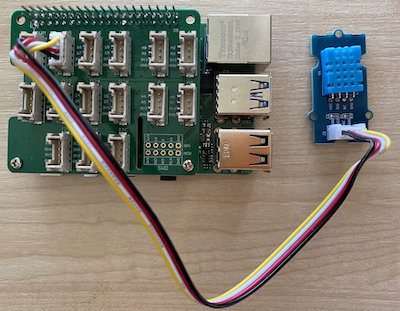

<!--
CO_OP_TRANSLATOR_METADATA:
{
  "original_hash": "7678f7c67b97ee52d5727496dcd7d346",
  "translation_date": "2025-08-28T04:09:41+00:00",
  "source_file": "2-farm/lessons/1-predict-plant-growth/pi-temp.md",
  "language_code": "tr"
}
-->
# Sıcaklık Ölçümü - Raspberry Pi

Bu dersin bu bölümünde, Raspberry Pi'ye bir sıcaklık sensörü ekleyeceksiniz.

## Donanım

Kullanacağınız sensör, [DHT11 nem ve sıcaklık sensörü](https://www.seeedstudio.com/Grove-Temperature-Humidity-Sensor-DHT11.html) olup, iki sensörü bir arada sunar. Bu sensör oldukça popülerdir ve ticari olarak temin edilebilen birçok sensör, sıcaklık, nem ve bazen atmosferik basıncı birleştirir. Sıcaklık sensörü bileşeni, negatif sıcaklık katsayısına (NTC) sahip bir termistördür; bu, sıcaklık arttıkça direncin azaldığı bir termistördür.

Bu bir dijital sensördür, bu nedenle sıcaklık ve nem verilerini içeren dijital bir sinyal oluşturmak için bir dahili ADC'ye sahiptir ve bu sinyali mikrodenetleyici okuyabilir.

### Sıcaklık sensörünü bağlayın

Grove sıcaklık sensörü Raspberry Pi'ye bağlanabilir.

#### Görev

Sıcaklık sensörünü bağlayın.


1. Grove kablosunun bir ucunu nem ve sıcaklık sensöründeki sokete takın. Kablo yalnızca tek bir yönde takılabilir.

1. Raspberry Pi kapalıyken, Grove kablosunun diğer ucunu Pi'ye bağlı Grove Base hat üzerindeki **D5** olarak işaretlenmiş dijital sokete bağlayın. Bu soket, GPIO pinlerinin yanındaki soket sırasının soldan ikinci soketidir.



## Sıcaklık sensörünü programlayın

Cihaz artık bağlı sıcaklık sensörünü kullanacak şekilde programlanabilir.

### Görev

Cihazı programlayın.

1. Pi'yi açın ve başlatılmasını bekleyin.

1. VS Code'u doğrudan Pi üzerinde veya Remote SSH uzantısı aracılığıyla bağlanarak başlatın.

    > ⚠️ Gerekirse [ders 1'deki VS Code kurulum ve başlatma talimatlarına](../../../1-getting-started/lessons/1-introduction-to-iot/pi.md) başvurabilirsiniz.

1. Terminalden, `pi` kullanıcısının ana dizininde `temperature-sensor` adında yeni bir klasör oluşturun. Bu klasörde `app.py` adında bir dosya oluşturun:

    ```sh
    mkdir temperature-sensor
    cd temperature-sensor
    touch app.py
    ```

1. Bu klasörü VS Code'da açın.

1. Sıcaklık ve nem sensörünü kullanmak için ek bir Pip paketi yüklenmelidir. VS Code'daki Terminal'den aşağıdaki komutu çalıştırarak bu Pip paketini Pi'ye yükleyin:

    ```sh
    pip3 install seeed-python-dht
    ```

1. Gerekli kütüphaneleri içe aktarmak için `app.py` dosyasına aşağıdaki kodu ekleyin:

    ```python
    import time
    from seeed_dht import DHT
    ```

    `from seeed_dht import DHT` ifadesi, `seeed_dht` modülünden bir Grove sıcaklık sensörüyle etkileşim kurmak için `DHT` sensör sınıfını içe aktarır.

1. Yukarıdaki kodun altına, sıcaklık sensörünü yöneten sınıfın bir örneğini oluşturmak için aşağıdaki kodu ekleyin:

    ```python
    sensor = DHT("11", 5)
    ```

    Bu, **D**ijital **H**em **T**emperature sensörünü yöneten `DHT` sınıfının bir örneğini tanımlar. İlk parametre, kullanılan sensörün *DHT11* sensörü olduğunu kodlara bildirir - kullandığınız kütüphane bu sensörün diğer varyantlarını da destekler. İkinci parametre, sensörün Grove base hat üzerindeki `D5` dijital portuna bağlı olduğunu kodlara bildirir.

    > ✅ Unutmayın, tüm soketlerin benzersiz pin numaraları vardır. Pinler 0, 2, 4 ve 6 analog pinlerdir; pinler 5, 16, 18, 22, 24 ve 26 dijital pinlerdir.

1. Yukarıdaki kodun altına, sıcaklık sensörü değerini sorgulamak ve konsola yazdırmak için sonsuz bir döngü ekleyin:

    ```python
    while True:
        _, temp = sensor.read()
        print(f'Temperature {temp}°C')
    ```

    `sensor.read()` çağrısı, nem ve sıcaklık değerlerinden oluşan bir tuple döndürür. Sadece sıcaklık değerine ihtiyacınız olduğundan, nem değeri göz ardı edilir. Ardından sıcaklık değeri konsola yazdırılır.

1. Döngünün sonuna, sıcaklık seviyelerinin sürekli olarak kontrol edilmesine gerek olmadığından, on saniyelik bir bekleme süresi ekleyin. Bekleme süresi, cihazın güç tüketimini azaltır.

    ```python
    time.sleep(10)
    ```

1. VS Code Terminal'den aşağıdaki komutu çalıştırarak Python uygulamanızı çalıştırın:

    ```sh
    python3 app.py
    ```

    Konsola sıcaklık değerlerinin çıktısını görmelisiniz. Sensörü ısıtmak için başparmağınızı üzerine bastırmak veya bir fan kullanmak gibi bir şey deneyerek değerlerin değiştiğini gözlemleyin:

    ```output
    pi@raspberrypi:~/temperature-sensor $ python3 app.py 
    Temperature 26°C
    Temperature 26°C
    Temperature 28°C
    Temperature 30°C
    Temperature 32°C
    ```

> 💁 Bu kodu [code-temperature/pi](../../../../../2-farm/lessons/1-predict-plant-growth/code-temperature/pi) klasöründe bulabilirsiniz.

😀 Sıcaklık sensörü programınız başarılı oldu!

---

**Feragatname**:  
Bu belge, AI çeviri hizmeti [Co-op Translator](https://github.com/Azure/co-op-translator) kullanılarak çevrilmiştir. Doğruluğu sağlamak için çaba göstersek de, otomatik çevirilerin hata veya yanlışlık içerebileceğini lütfen unutmayın. Belgenin orijinal dili, yetkili kaynak olarak kabul edilmelidir. Kritik bilgiler için profesyonel insan çevirisi önerilir. Bu çevirinin kullanımından kaynaklanan yanlış anlamalar veya yanlış yorumlamalar için sorumluluk kabul etmiyoruz.