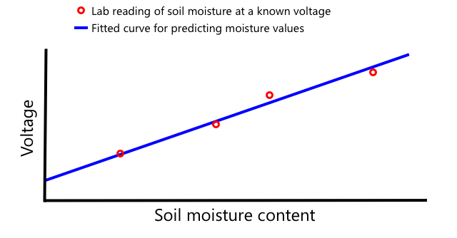

<!--
CO_OP_TRANSLATOR_METADATA:
{
  "original_hash": "4fb20273d299dc8d07a8f06c9cd0cdd9",
  "translation_date": "2025-08-28T03:55:04+00:00",
  "source_file": "2-farm/lessons/2-detect-soil-moisture/README.md",
  "language_code": "tr"
}
-->
C, Türkçe'de "I-kare-C" olarak telaffuz edilir, çoklu denetleyici ve çoklu çevre birimi protokolüdür. Bağlı herhangi bir cihaz, I²C veri yolu (veri transferi için kullanılan bir iletişim sistemi) üzerinden denetleyici veya çevre birimi olarak iletişim kurabilir. Veriler, her bir paketin hedef cihazın adresini içeren adreslenmiş paketler olarak gönderilir.

> 💁 Bu model eskiden "master/slave" (ana/bağımlı) olarak adlandırılıyordu, ancak bu terim kölelik ile olan çağrışımları nedeniyle terk ediliyor. [Açık Kaynak Donanım Derneği, denetleyici/çevre birimi terimlerini benimsemiştir](https://www.oshwa.org/a-resolution-to-redefine-spi-signal-names/), ancak eski terminolojiye hâlâ rastlayabilirsiniz.

Cihazlar, I²C veri yoluna bağlandıklarında kullanılan bir adrese sahiptir ve bu genellikle cihaz üzerinde sabit kodlanmıştır. Örneğin, Seeed'in her tür Grove sensörü aynı adrese sahiptir; tüm ışık sensörleri aynı adrese, tüm düğmeler ise ışık sensörlerinden farklı bir adrese sahiptir. Bazı cihazlar, jumper ayarlarını değiştirerek veya pinleri lehimleyerek adresi değiştirme yöntemlerine sahiptir.

I²C, 2 ana tel ve 2 güç teli olmak üzere toplam 4 telden oluşan bir veri yoluna sahiptir:

| Tel | Adı | Açıklama |
| ---- | --------- | ----------- |
| SDA | Seri Veri | Bu tel, cihazlar arasında veri göndermek için kullanılır. |
| SCL | Seri Saat | Bu tel, denetleyici tarafından ayarlanan bir hızda saat sinyali gönderir. |
| VCC | Ortak Gerilim Toplayıcı | Cihazlar için güç kaynağıdır. Bu tel, SDA ve SCL tellerine bağlanarak bir pull-up direnç üzerinden güç sağlar ve hiçbir cihaz denetleyici olmadığında sinyali kapatır. |
| GND | Toprak | Elektrik devresi için ortak bir toprak sağlar. |

Veri göndermek için bir cihaz, veri göndermeye hazır olduğunu göstermek için bir başlangıç durumu oluşturur. Bu cihaz daha sonra denetleyici olur. Denetleyici, iletişim kurmak istediği cihazın adresini ve veri okumak mı yoksa yazmak mı istediğini gönderir. Veri iletimi tamamlandıktan sonra, denetleyici bir bitiş durumu göndererek işlemin bittiğini belirtir. Bundan sonra başka bir cihaz denetleyici olabilir ve veri gönderip alabilir.

I2C'nin hız sınırları vardır ve 3 farklı modda sabit hızlarda çalışır. En hızlı mod, maksimum 3.4Mbps (megabit/saniye) hızına sahip olan Yüksek Hız modudur, ancak çok az cihaz bu hızı destekler. Örneğin, Raspberry Pi hızlı modda 400Kbps (kilobit/saniye) ile sınırlıdır. Standart mod ise 100Kbps hızında çalışır.

> 💁 Eğer IoT donanımı olarak bir Grove Base hat ile Raspberry Pi kullanıyorsanız, kart üzerinde I2C sensörleriyle iletişim kurmak için kullanabileceğiniz bir dizi I2C soketi görebilirsiniz. Analog Grove sensörleri de analog değerleri dijital veri olarak göndermek için bir ADC ile I2C kullanır, bu nedenle kullandığınız ışık sensörü analog bir pini simüle etti ve değer I2C üzerinden gönderildi çünkü Raspberry Pi yalnızca dijital pinleri destekler.

### Evrensel Asenkron Alıcı-Verici (UART)

UART, iki cihazın iletişim kurmasını sağlayan fiziksel devreleri içerir. Her cihazın 2 iletişim pini vardır - gönderme (Tx) ve alma (Rx). İlk cihazın Tx pini ikinci cihazın Rx pinine, ikinci cihazın Tx pini ise ilk cihazın Rx pinine bağlanır. Bu, verilerin her iki yönde gönderilmesini sağlar.

* Cihaz 1, Tx pininden veri gönderir, bu veri cihaz 2 tarafından Rx pininde alınır.
* Cihaz 1, Rx pininde cihaz 2'nin Tx pininden gönderdiği veriyi alır.

> 🎓 Veriler birer bit olarak gönderilir ve bu *seri* iletişim olarak bilinir. Çoğu işletim sistemi ve mikrodenetleyici, kodunuzun erişebileceği *seri portlar* yani seri veri gönderip alabilen bağlantılara sahiptir.

UART cihazlarının bir [baud hızı](https://wikipedia.org/wiki/Symbol_rate) (Sembol hızı olarak da bilinir) vardır, bu hız verilerin bit/saniye cinsinden gönderilip alınacağı hızdır. Yaygın bir baud hızı 9,600'dür, yani her saniye 9,600 bit (0 ve 1) veri gönderilir.

UART, başlangıç ve bitiş bitleri kullanır - yani bir bayt (8 bit) veri göndermeye başlamadan önce bir başlangıç biti gönderir, ardından 8 bit gönderildikten sonra bir bitiş biti gönderir.

UART hızı donanıma bağlıdır, ancak en hızlı uygulamalar bile 6.5 Mbps'yi (megabit/saniye veya saniyede gönderilen milyonlarca bit, 0 veya 1) aşmaz.

GPIO pinleri üzerinden UART kullanabilirsiniz - bir pini Tx, diğerini Rx olarak ayarlayabilir ve bunları başka bir cihaza bağlayabilirsiniz.

> 💁 Eğer IoT donanımı olarak bir Grove Base hat ile Raspberry Pi kullanıyorsanız, UART protokolünü kullanan sensörlerle iletişim kurmak için kart üzerinde bir UART soketi görebilirsiniz.

### Seri Çevresel Arayüz (SPI)

SPI, kısa mesafelerde iletişim kurmak için tasarlanmıştır, örneğin bir mikrodenetleyicinin flash bellek gibi bir depolama cihazıyla konuşması için. Bir kontrolcü/çevre modeli üzerine kuruludur ve tek bir kontrolcü (genellikle IoT cihazının işlemcisi) birden fazla çevre birimiyle etkileşim kurar. Kontrolcü, bir çevre birimini seçerek ve veri gönderip isteyerek her şeyi kontrol eder.

> 💁 I2C gibi, kontrolcü ve çevre terimleri yakın zamanda değişmiştir, bu nedenle hala eski terimleri görebilirsiniz.

SPI kontrolcüleri 3 tel kullanır ve her çevre birimi için 1 ekstra tel eklenir. Çevre birimleri 4 tel kullanır. Bu teller şunlardır:

| Tel | Adı | Açıklama |
| ---- | --------- | ----------- |
| COPI | Kontrolcü Çıkışı, Çevre Girişi | Bu tel, kontrolcüden çevre birimine veri göndermek içindir. |
| CIPO | Kontrolcü Girişi, Çevre Çıkışı | Bu tel, çevre biriminden kontrolcüye veri göndermek içindir. |
| SCLK | Seri Saat | Bu tel, kontrolcü tarafından ayarlanan bir hızda saat sinyali gönderir. |
| CS   | Çip Seçimi | Kontrolcünün birden fazla teli vardır, her çevre birimi için bir tel, ve her tel ilgili çevre birimin CS teline bağlanır. |

CS teli, COPI ve CIPO telleri üzerinden bir seferde bir çevre birimini etkinleştirmek için kullanılır. Kontrolcü, çevre birimini değiştirmesi gerektiğinde, şu anda etkin olan çevre birimine bağlı CS telini devre dışı bırakır, ardından bir sonraki iletişim kurmak istediği çevre birimine bağlı teli etkinleştirir.

SPI *tam çift yönlü*dür, yani kontrolcü COPI ve CIPO tellerini kullanarak aynı çevre biriminden aynı anda veri gönderebilir ve alabilir. SPI, cihazları senkronize tutmak için SCLK telinde bir saat sinyali kullanır, bu nedenle UART üzerinden doğrudan gönderim gibi başlangıç ve bitiş bitlerine ihtiyaç duymaz.

SPI için tanımlı hız sınırları yoktur, uygulamalar genellikle saniyede birden fazla megabayt veri iletebilir.

IoT geliştirici kitleri genellikle GPIO pinleri üzerinden SPI'yi destekler. Örneğin, Raspberry Pi'de SPI için GPIO pinleri 19, 21, 23, 24 ve 26'yı kullanabilirsiniz.

### Kablosuz

Bazı sensörler Bluetooth (özellikle Bluetooth Düşük Enerji veya BLE), LoRaWAN (bir **Lo**ng **Ra**nge düşük güç ağ protokolü) veya WiFi gibi standart kablosuz protokoller üzerinden iletişim kurabilir. Bu, fiziksel olarak bir IoT cihazına bağlı olmayan uzak sensörlere olanak tanır.

Bunun bir örneği ticari toprak nem sensörleridir. Bu sensörler bir tarladaki toprak nemini ölçer, ardından veriyi bir hub cihazına LoRaWAN üzerinden gönderir. Hub cihazı veriyi işler veya İnternet üzerinden gönderir. Bu, sensörün veriyi yöneten IoT cihazından uzakta olmasını sağlar, güç tüketimini azaltır ve büyük WiFi ağlarına veya uzun kablolara olan ihtiyacı ortadan kaldırır.

BLE, bilekte çalışan fitness takip cihazları gibi gelişmiş sensörler için popülerdir. Bu cihazlar birden fazla sensörü birleştirir ve sensör verilerini telefonunuz gibi bir IoT cihazına BLE üzerinden gönderir.

✅ Üzerinizde, evinizde veya okulunuzda herhangi bir Bluetooth sensörü var mı? Bunlar sıcaklık sensörleri, doluluk sensörleri, cihaz takip cihazları ve fitness cihazlarını içerebilir.

Ticari cihazların bağlanması için popüler bir yöntem Zigbee'dir. Zigbee, cihazlar arasında ağlar oluşturmak için WiFi kullanır. Her cihaz, mümkün olduğunca çok yakındaki cihaza bağlanır ve bir örümcek ağı gibi çok sayıda bağlantı oluşturur. Bir cihaz İnternet'e bir mesaj göndermek istediğinde, en yakın cihazlara gönderir, bu cihazlar mesajı diğer yakındaki cihazlara iletir ve bu şekilde devam eder, ta ki bir koordinatöre ulaşıp İnternet'e gönderilene kadar.

> 🐝 Zigbee adı, bal arılarının kovana döndükten sonra yaptığı sallanma dansına atıfta bulunur.

## Toprak nem seviyelerini ölçün

Bir toprak nem sensörü, bir IoT cihazı ve bir ev bitkisi veya yakındaki bir toprak parçası kullanarak toprak nem seviyesini ölçebilirsiniz.

### Görev - Toprak nemini ölçün

IoT cihazınızı kullanarak toprak nemini ölçmek için ilgili kılavuzu takip edin:

* [Arduino - Wio Terminal](wio-terminal-soil-moisture.md)
* [Tek kartlı bilgisayar - Raspberry Pi](pi-soil-moisture.md)
* [Tek kartlı bilgisayar - Sanal cihaz](virtual-device-soil-moisture.md)

## Sensör kalibrasyonu

Sensörler, direnç veya kapasitans gibi elektriksel özellikleri ölçmeye dayanır.

> 🎓 Direnç, ohm (Ω) cinsinden ölçülür ve bir şeyin içinden geçen elektrik akımına ne kadar karşı koyduğunu ifade eder. Bir malzemeye bir voltaj uygulandığında, içinden geçen akım miktarı malzemenin direncine bağlıdır. [Wikipedia'daki elektriksel direnç sayfasında](https://wikipedia.org/wiki/Electrical_resistance_and_conductance) daha fazla bilgi edinebilirsiniz.

> 🎓 Kapasitans, farad (F) cinsinden ölçülür ve bir bileşenin veya devrenin elektrik enerjisini toplama ve depolama yeteneğidir. Kapasitans hakkında daha fazla bilgi için [Wikipedia'daki kapasitans sayfasını](https://wikipedia.org/wiki/Capacitance) okuyabilirsiniz.

Bu ölçümler her zaman kullanışlı değildir - 22.5KΩ ölçümü veren bir sıcaklık sensörünü hayal edin! Bunun yerine, ölçülen değer, kalibre edilerek faydalı bir birime dönüştürülmelidir - yani ölçülen değerlerin ölçülen miktarla eşleştirilmesi, yeni ölçümlerin doğru birime dönüştürülmesini sağlar.

Bazı sensörler önceden kalibre edilmiş olarak gelir. Örneğin, önceki derste kullandığınız sıcaklık sensörü, °C cinsinden bir sıcaklık ölçümü döndürebilecek şekilde zaten kalibre edilmişti. Fabrikada üretilen ilk sensör, bilinen bir sıcaklık aralığına maruz bırakılır ve direnç ölçülür. Bu, Ω (direnç birimi) cinsinden ölçülen değeri °C'ye dönüştürebilen bir hesaplama oluşturmak için kullanılır.

> 💁 Direnci sıcaklıktan hesaplamak için kullanılan formül [Steinhart–Hart denklemi](https://wikipedia.org/wiki/Steinhart–Hart_equation) olarak adlandırılır.

### Toprak nem sensörü kalibrasyonu

Toprak nemi, gravimetrik veya hacimsel su içeriği kullanılarak ölçülür.

* Gravimetrik, birim ağırlıktaki topraktaki suyun ağırlığıdır ve kuru toprak başına kilogram su olarak ölçülür.
* Hacimsel, birim hacimdeki topraktaki suyun hacmidir ve kuru toprak başına metreküp su olarak ölçülür.

> 🇺🇸 Amerikalılar için, birimlerin tutarlılığı nedeniyle bunlar kilogram yerine pound veya metreküp yerine fit küp olarak ölçülebilir.

Toprak nem sensörleri elektriksel direnç veya kapasitansı ölçer - bu sadece toprak nemine değil, aynı zamanda toprak türüne de bağlıdır çünkü topraktaki bileşenler elektriksel özelliklerini değiştirebilir. İdeal olarak sensörler kalibre edilmelidir - yani sensörden alınan ölçümler daha bilimsel bir yaklaşımla bulunan ölçümlerle karşılaştırılmalıdır. Örneğin, bir laboratuvar belirli bir tarladan alınan örneklerle gravimetrik toprak nemini birkaç kez hesaplayabilir ve bu sayılar sensörü kalibre etmek için kullanılabilir, sensör ölçümünü gravimetrik toprak nemiyle eşleştirir.

Yukarıdaki grafik bir sensörün nasıl kalibre edileceğini gösterir. Voltaj, nemli ağırlığın kuru ağırlığa (önce nemli ölçüm, ardından fırında kurutulup kuru ölçüm) karşılaştırılarak ölçüldüğü bir laboratuvar tarafından ölçülen bir toprak örneği için yakalanır. Birkaç ölçüm alındıktan sonra, bu bir grafikte çizilir ve noktalara bir çizgi oturtulur. Bu çizgi, bir IoT cihazı tarafından alınan toprak nem sensörü ölçümlerini gerçek toprak nem ölçümlerine dönüştürmek için kullanılabilir.

💁 Dirençli toprak nem sensörleri için, voltaj toprak nemi arttıkça artar. Kapasitif toprak nem sensörleri için, voltaj toprak nemi arttıkça azalır, bu nedenle bu sensörlerin grafikleri yukarı değil aşağı doğru eğilir.

Yukarıdaki grafik, bir toprak nem sensöründen alınan bir voltaj ölçümünü gösterir ve grafikteki çizgiye kadar takip edilerek gerçek toprak nemi hesaplanabilir.

Bu yaklaşım, çiftçinin bir tarla için sadece birkaç laboratuvar ölçümü almasını sağlar, ardından IoT cihazlarını kullanarak toprak nemini ölçebilir - ölçüm alma süresini büyük ölçüde hızlandırır.

---

## 🚀 Zorluk

Dirençli ve kapasitif toprak nem sensörlerinin bir dizi farkı vardır. Bu farklar nelerdir ve çiftçinin kullanması için en iyi tür hangisidir (varsa)? Bu cevap gelişmekte olan ve gelişmiş ülkeler arasında değişir mi?

## Ders sonrası test

[Ders sonrası test](https://black-meadow-040d15503.1.azurestaticapps.net/quiz/12)

## Gözden Geçirme ve Kendi Kendine Çalışma

Sensörler ve aktüatörler tarafından kullanılan donanım ve protokoller hakkında bilgi edinin:

* [GPIO Wikipedia sayfası](https://wikipedia.org/wiki/General-purpose_input/output)
* [UART Wikipedia sayfası](https://wikipedia.org/wiki/Universal_asynchronous_receiver-transmitter)
* [SPI Wikipedia sayfası](https://wikipedia.org/wiki/Serial_Peripheral_Interface)
* [I2C Wikipedia sayfası](https://wikipedia.org/wiki/I²C)
* [Zigbee Wikipedia sayfası](https://wikipedia.org/wiki/Zigbee)

## Ödev

[Sensörünüzü kalibre edin](assignment.md)

---

**Feragatname**:  
Bu belge, AI çeviri hizmeti [Co-op Translator](https://github.com/Azure/co-op-translator) kullanılarak çevrilmiştir. Doğruluk için çaba göstersek de, otomatik çevirilerin hata veya yanlışlıklar içerebileceğini lütfen unutmayın. Belgenin orijinal dili, yetkili kaynak olarak kabul edilmelidir. Kritik bilgiler için profesyonel insan çevirisi önerilir. Bu çevirinin kullanımından kaynaklanan yanlış anlamalar veya yanlış yorumlamalar için sorumluluk kabul etmiyoruz.