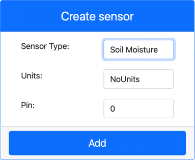

<!--
CO_OP_TRANSLATOR_METADATA:
{
  "original_hash": "2bf65f162bcebd35fbcba5fd245afac4",
  "translation_date": "2025-08-28T03:56:14+00:00",
  "source_file": "2-farm/lessons/2-detect-soil-moisture/virtual-device-soil-moisture.md",
  "language_code": "tr"
}
-->
# Toprak Nemini Ölç - Sanal IoT Donanımı

Bu dersin bu bölümünde, sanal IoT cihazınıza kapasitif bir toprak nem sensörü ekleyecek ve ondan değerler okuyacaksınız.

## Sanal Donanım

Sanal IoT cihazı, simüle edilmiş bir Grove kapasitif toprak nem sensörü kullanacaktır. Bu, fiziksel bir Grove kapasitif toprak nem sensörü ile bir Raspberry Pi kullanmaya benzer bir deneyim sağlar.

Fiziksel bir IoT cihazında, toprak nem sensörü, toprağın nemini, toprağın kapasitansını algılayarak ölçen kapasitif bir sensör olurdu. Toprağın nemi arttıkça, voltaj düşer.

Bu bir analog sensördür ve 1-1.023 arasında bir değer raporlamak için simüle edilmiş 10-bit bir ADC kullanır.

### Toprak nem sensörünü CounterFit'e ekleyin

Sanal bir toprak nem sensörü kullanmak için, bunu CounterFit uygulamasına eklemeniz gerekir.

#### Görev - Toprak nem sensörünü CounterFit'e ekleyin

Toprak nem sensörünü CounterFit uygulamasına ekleyin.

1. Bilgisayarınızda `soil-moisture-sensor` adlı bir klasörde `app.py` adlı tek bir dosya içeren yeni bir Python uygulaması oluşturun ve bir Python sanal ortamı oluşturup CounterFit pip paketlerini ekleyin.

    > ⚠️ Gerekirse [1. dersteki CounterFit Python projesi oluşturma ve ayarlama talimatlarına](../../../1-getting-started/lessons/1-introduction-to-iot/virtual-device.md) başvurabilirsiniz.

1. CounterFit web uygulamasının çalıştığından emin olun.

1. Bir toprak nem sensörü oluşturun:

    1. *Sensors* panelindeki *Create sensor* kutusunda, *Sensor type* açılır kutusundan *Soil Moisture* seçeneğini seçin.

    1. *Units* ayarını *NoUnits* olarak bırakın.

    1. *Pin* ayarının *0* olduğundan emin olun.

    1. Pin 0 üzerinde *Soil Moisture* sensörünü oluşturmak için **Add** düğmesine tıklayın.

    

    Toprak nem sensörü oluşturulacak ve sensörler listesinde görünecektir.

    

## Toprak nem sensörü uygulamasını programlayın

Toprak nem sensörü uygulaması artık CounterFit sensörlerini kullanarak programlanabilir.

### Görev - Toprak nem sensörü uygulamasını programlayın

Toprak nem sensörü uygulamasını programlayın.

1. `soil-moisture-sensor` uygulamasının VS Code'da açık olduğundan emin olun.

1. `app.py` dosyasını açın.

1. Uygulamayı CounterFit'e bağlamak için aşağıdaki kodu `app.py` dosyasının en üstüne ekleyin:

    ```python
    from counterfit_connection import CounterFitConnection
    CounterFitConnection.init('127.0.0.1', 5000)
    ```

1. Gerekli bazı kütüphaneleri içe aktarmak için aşağıdaki kodu `app.py` dosyasına ekleyin:

    ```python
    import time
    from counterfit_shims_grove.adc import ADC
    ```

    `import time` ifadesi, bu ödevde daha sonra kullanılacak olan `time` modülünü içe aktarır.

    `from counterfit_shims_grove.adc import ADC` ifadesi, CounterFit sensörüne bağlanabilen sanal bir analog-dijital çeviriciyle etkileşim kurmak için `ADC` sınıfını içe aktarır.

1. `ADC` sınıfının bir örneğini oluşturmak için aşağıdaki kodu ekleyin:

    ```python
    adc = ADC()
    ```

1. Pin 0'daki bu ADC'den okuma yapan ve sonucu konsola yazan sonsuz bir döngü ekleyin. Bu döngü, okumalar arasında 10 saniye bekleyebilir.

    ```python
    while True:
        soil_moisture = adc.read(0)
        print("Soil moisture:", soil_moisture)
    
        time.sleep(10)
    ```

1. CounterFit uygulamasından, uygulama tarafından okunacak toprak nem sensörünün değerini değiştirin. Bunu iki şekilde yapabilirsiniz:

    * Toprak nem sensörü için *Value* kutusuna bir sayı girin ve ardından **Set** düğmesine tıklayın. Girdiğiniz sayı, sensör tarafından döndürülen değer olacaktır.

    * *Random* kutusunu işaretleyin ve bir *Min* ve *Max* değeri girin, ardından **Set** düğmesine tıklayın. Sensör her okuma yaptığında, *Min* ve *Max* arasında rastgele bir sayı okuyacaktır.

1. Python uygulamasını çalıştırın. Toprak nem ölçümlerinin konsola yazıldığını göreceksiniz. Değeri değiştirmek için *Value* veya *Random* ayarlarını değiştirin.

    ```output
    (.venv) ➜ soil-moisture-sensor $ python app.py 
    Soil moisture: 615
    Soil moisture: 612
    Soil moisture: 498
    Soil moisture: 493
    Soil moisture: 490
    Soil Moisture: 388
    ```

> 💁 Bu kodu [code/virtual-device](../../../../../2-farm/lessons/2-detect-soil-moisture/code/virtual-device) klasöründe bulabilirsiniz.

😀 Toprak nem sensörü programınız başarıyla çalıştı!

---

**Feragatname**:  
Bu belge, AI çeviri hizmeti [Co-op Translator](https://github.com/Azure/co-op-translator) kullanılarak çevrilmiştir. Doğruluk için çaba göstersek de, otomatik çevirilerin hata veya yanlışlık içerebileceğini lütfen unutmayın. Belgenin orijinal dilindeki hali, yetkili kaynak olarak kabul edilmelidir. Kritik bilgiler için profesyonel insan çevirisi önerilir. Bu çevirinin kullanımından kaynaklanan yanlış anlamalar veya yanlış yorumlamalar için sorumluluk kabul etmiyoruz.