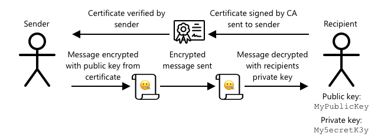

<!--
CO_OP_TRANSLATOR_METADATA:
{
  "original_hash": "81c437c568eee1b0dda1f04e88150d37",
  "translation_date": "2025-08-28T04:02:31+00:00",
  "source_file": "2-farm/lessons/6-keep-your-plant-secure/README.md",
  "language_code": "tr"
}
-->
# Bitkinizi Güvende Tutun


> Skeç notu: [Nitya Narasimhan](https://github.com/nitya). Daha büyük bir versiyon için resme tıklayın.

## Ders Öncesi Test

[Ders öncesi test](https://black-meadow-040d15503.1.azurestaticapps.net/quiz/19)

## Giriş

Son birkaç derste bir toprak izleme IoT cihazı oluşturup bunu buluta bağladınız. Peki ya rakip bir çiftçi için çalışan hackerlar IoT cihazlarınızın kontrolünü ele geçirirse? Ya sürekli yüksek toprak nemi ölçümleri gönderip bitkilerinizin hiç sulanmamasına neden olurlarsa? Ya da sulama sisteminizi sürekli açık tutarak bitkilerinizi aşırı sulamadan öldürüp size su faturası olarak küçük bir servete mal olurlarsa?

Bu derste IoT cihazlarını güvence altına almayı öğreneceksiniz. Ayrıca, bu proje için son ders olduğu için, bulut kaynaklarınızı temizlemeyi ve olası maliyetleri azaltmayı da öğreneceksiniz.

Bu derste şunları ele alacağız:

* [Neden IoT cihazlarını güvence altına almanız gerekiyor?](../../../../../2-farm/lessons/6-keep-your-plant-secure)
* [Kriptografi](../../../../../2-farm/lessons/6-keep-your-plant-secure)
* [IoT cihazlarınızı güvence altına alın](../../../../../2-farm/lessons/6-keep-your-plant-secure)
* [Bir X.509 sertifikası oluşturun ve kullanın](../../../../../2-farm/lessons/6-keep-your-plant-secure)

> 🗑 Bu proje için son ders olduğundan, bu dersi ve ödevi tamamladıktan sonra bulut hizmetlerinizi temizlemeyi unutmayın. Ödevi tamamlamak için bu hizmetlere ihtiyacınız olacak, bu yüzden önce ödevi tamamladığınızdan emin olun.
>
> Gerekirse [projenizi temizleme rehberine](../../../clean-up.md) başvurabilirsiniz.

## Neden IoT cihazlarını güvence altına almanız gerekiyor?

IoT güvenliği, yalnızca beklenen cihazların bulut IoT hizmetinize bağlanmasını ve telemetri göndermesini, yalnızca bulut hizmetinizin cihazlarınıza komut gönderebilmesini sağlamayı içerir. IoT verileri, tıbbi veya kişisel veriler gibi hassas bilgiler içerebilir, bu nedenle tüm uygulamanızın bu verilerin sızdırılmasını önlemek için güvenliği dikkate alması gerekir.

IoT uygulamanız güvenli değilse, bir dizi riskle karşı karşıya kalabilirsiniz:

* Sahte bir cihaz yanlış veri gönderebilir ve uygulamanızın yanlış tepki vermesine neden olabilir. Örneğin, sürekli yüksek toprak nemi ölçümleri göndererek sulama sisteminizin hiç çalışmamasına ve bitkilerinizin susuzluktan ölmesine neden olabilirler.
* Yetkisiz kullanıcılar, IoT cihazlarından kişisel veya iş açısından kritik verileri okuyabilir.
* Hackerlar, cihazı veya bağlı donanımı zarar verecek şekilde kontrol etmek için komutlar gönderebilir.
* IoT cihazına bağlanarak, hackerlar başka ağlara erişim sağlayabilir ve özel sistemlere ulaşabilir.
* Kötü niyetli kullanıcılar kişisel verilere erişebilir ve bu verileri şantaj için kullanabilir.

Bunlar gerçek dünya senaryolarıdır ve sürekli olarak meydana gelir. Daha önceki derslerde bazı örnekler verilmişti, ancak işte birkaç tane daha:

* 2018'de hackerlar, bir balık tankı termostatındaki açık bir WiFi erişim noktasını kullanarak bir casinonun ağına erişip veri çaldılar. [The Hacker News - Casino Gets Hacked Through Its Internet-Connected Fish Tank Thermometer](https://thehackernews.com/2018/04/iot-hacking-thermometer.html)
* 2016'da Mirai Botnet, bir internet servis sağlayıcısı olan Dyn'a hizmet reddi saldırısı başlattı ve internetin büyük bir kısmını çökertti. Bu botnet, DVR'lar ve kameralar gibi IoT cihazlarına varsayılan kullanıcı adları ve şifrelerle bağlanarak saldırıyı başlattı. [The Guardian - DDoS attack that disrupted internet was largest of its kind in history, experts say](https://www.theguardian.com/technology/2016/oct/26/ddos-attack-dyn-mirai-botnet)
* Spiral Toys, CloudPets bağlantılı oyuncaklarının kullanıcı veritabanını internet üzerinden herkese açık hale getirdi. [Troy Hunt - Data from connected CloudPets teddy bears leaked and ransomed, exposing kids' voice messages](https://www.troyhunt.com/data-from-connected-cloudpets-teddy-bears-leaked-and-ransomed-exposing-kids-voice-messages/).
* Strava, koşucuları etiketleyerek rotalarını gösterdi ve yabancıların nerede yaşadığınızı görmesine olanak tanıdı. [Kim Komndo - Fitness app could lead a stranger right to your home — change this setting](https://www.komando.com/security-privacy/strava-fitness-app-privacy/755349/).

✅ Bir araştırma yapın: IoT hackleri ve IoT verilerinin ihlalleriyle ilgili daha fazla örnek arayın, özellikle internet bağlantılı diş fırçaları veya tartılar gibi kişisel eşyalarla ilgili olanları. Bu hacklerin mağdurlar veya müşteriler üzerindeki etkilerini düşünün.

> 💁 Güvenlik çok geniş bir konudur ve bu ders yalnızca cihazınızı buluta bağlama ile ilgili bazı temel konulara değinecektir. Veri değişikliklerini izleme, cihazları doğrudan hackleme veya cihaz yapılandırmalarındaki değişiklikler gibi konular ele alınmayacaktır. IoT hackleme o kadar büyük bir tehdit ki, [Azure Defender for IoT](https://azure.microsoft.com/services/azure-defender-for-iot/?WT.mc_id=academic-17441-jabenn) gibi araçlar geliştirilmiştir. Bu araçlar, bilgisayarınızda bulunan antivirüs ve güvenlik araçlarına benzer, ancak küçük, düşük güçlü IoT cihazları için tasarlanmıştır.

## Kriptografi

Bir cihaz bir IoT hizmetine bağlandığında, kendini tanımlamak için bir kimlik kullanır. Sorun şu ki, bu kimlik kopyalanabilir - bir hacker, gerçek bir cihazla aynı kimliği kullanan ancak sahte veri gönderen kötü niyetli bir cihaz kurabilir.


Bunun çözümü, gönderilen verileri yalnızca cihaz ve bulut tarafından bilinen bir değer kullanarak şifrelenmiş bir formata dönüştürmektir. Bu işleme *şifreleme* denir ve verileri şifrelemek için kullanılan değere *şifreleme anahtarı* denir.


Bulut hizmeti, verileri *şifre çözme* adı verilen bir işlemle okunabilir bir formata dönüştürebilir. Bu işlem ya aynı şifreleme anahtarını ya da bir *şifre çözme anahtarını* kullanır. Şifrelenmiş mesaj anahtar tarafından çözülemezse, cihaz hacklenmiştir ve mesaj reddedilir.

Bu şifreleme ve şifre çözme tekniğine *kriptografi* denir.

### Erken Dönem Kriptografi

En eski kriptografi türleri, 3.500 yıl öncesine dayanan yerine koyma şifreleriydi. Yerine koyma şifreleri, bir harfi başka bir harfle değiştirmeyi içerir. Örneğin, [Sezar şifresi](https://wikipedia.org/wiki/Caesar_cipher), alfabeyi belirli bir miktar kaydırmayı içerir ve yalnızca şifreli mesajın göndericisi ve alıcısı kaç harf kaydırılacağını bilir.

[Vigenère şifresi](https://wikipedia.org/wiki/Vigenère_cipher) bunu bir adım ileri götürerek metni şifrelemek için kelimeler kullanır, böylece orijinal metindeki her harf farklı bir miktar kaydırılır.

Kriptografi, eski Mezopotamya'da bir çömlekçinin sır tarifini korumaktan, Hindistan'da gizli aşk notları yazmaya veya eski Mısır'da büyü formüllerini gizli tutmaya kadar geniş bir yelpazede kullanılmıştır.

### Modern Kriptografi

Modern kriptografi çok daha gelişmiştir ve erken yöntemlere göre kırılması daha zordur. Modern kriptografi, verileri şifrelemek için karmaşık matematik kullanır ve kaba kuvvet saldırılarını imkansız hale getirecek kadar çok olası anahtar içerir.

Kriptografi, güvenli iletişim için birçok farklı şekilde kullanılır. Eğer bu sayfayı GitHub'da okuyorsanız, web sitesi adresinin *HTTPS* ile başladığını fark edebilirsiniz, bu da tarayıcınız ile GitHub'ın web sunucuları arasındaki iletişimin şifrelenmiş olduğu anlamına gelir. Eğer biri tarayıcınız ile GitHub arasındaki internet trafiğini okuyabilseydi, verileri okuyamazdı çünkü şifrelenmiştir. Bilgisayarınız, sabit diskinizdeki tüm verileri bile şifreleyebilir, böylece biri çalsa bile şifreniz olmadan verilerinizi okuyamaz.

> 🎓 HTTPS, HyperText Transfer Protocol **Secure** anlamına gelir.

Ne yazık ki, her şey güvenli değildir. Bazı cihazların hiç güvenliği yoktur, bazıları kolayca kırılabilir anahtarlarla korunur veya bazen aynı türdeki tüm cihazlar aynı anahtarı kullanır. Çok kişisel IoT cihazlarının, WiFi veya Bluetooth üzerinden bağlanmak için aynı şifreye sahip olduğu durumlar olmuştur. Eğer kendi cihazınıza bağlanabiliyorsanız, başkasının cihazına da bağlanabilirsiniz. Bağlandıktan sonra çok özel verilere erişebilir veya cihazlarını kontrol edebilirsiniz.

> 💁 Modern kriptografinin karmaşıklığına ve şifre kırmanın milyarlarca yıl sürebileceği iddialarına rağmen, kuantum bilgisayarların yükselişi, bilinen tüm şifrelemelerin çok kısa bir sürede kırılma olasılığını ortaya çıkarmıştır!

### Simetrik ve Asimetrik Anahtarlar

Şifreleme iki türde gelir - simetrik ve asimetrik.

**Simetrik** şifreleme, verileri şifrelemek ve şifresini çözmek için aynı anahtarı kullanır. Hem gönderici hem de alıcı aynı anahtarı bilmelidir. Bu, en az güvenli türdür çünkü anahtar bir şekilde paylaşılmalıdır. Gönderici, alıcıya şifrelenmiş bir mesaj göndermek için önce anahtarı göndermek zorunda kalabilir.


Eğer anahtar aktarım sırasında çalınırsa veya gönderici ya da alıcı hacklenir ve anahtar bulunursa, şifreleme kırılabilir.


**Asimetrik** şifreleme, bir şifreleme anahtarı ve bir şifre çözme anahtarı olmak üzere 2 anahtar kullanır, bunlara genel/özel anahtar çifti denir. Genel anahtar mesajı şifrelemek için kullanılır ancak şifresini çözmek için kullanılamaz, özel anahtar ise mesajın şifresini çözmek için kullanılır ancak şifrelemek için kullanılamaz.


Alıcı, genel anahtarını paylaşır ve gönderici bunu mesajı şifrelemek için kullanır. Mesaj gönderildikten sonra, alıcı özel anahtarıyla şifresini çözer. Asimetrik şifreleme daha güvenlidir çünkü özel anahtar alıcı tarafından gizli tutulur ve asla paylaşılmaz. Genel anahtarı herkes alabilir çünkü yalnızca mesajları şifrelemek için kullanılabilir.

Simetrik şifreleme, asimetrik şifrelemeden daha hızlıdır, asimetrik ise daha güvenlidir. Bazı sistemler her ikisini birden kullanır - simetrik anahtarı şifrelemek ve paylaşmak için asimetrik şifreleme kullanır, ardından tüm verileri şifrelemek için simetrik anahtarı kullanır. Bu, gönderici ve alıcı arasında simetrik anahtarı paylaşmayı daha güvenli hale getirir ve verileri şifrelerken ve şifresini çözerken daha hızlıdır.

## IoT Cihazlarınızı Güvence Altına Alın

IoT cihazları, simetrik veya asimetrik şifreleme kullanılarak güvence altına alınabilir. Simetrik şifreleme daha kolaydır, ancak daha az güvenlidir.

### Simetrik Anahtarlar

IoT cihazınızı IoT Hub ile etkileşim kuracak şekilde ayarladığınızda, bir bağlantı dizesi kullandınız. Örnek bir bağlantı dizesi şu şekildedir:

```output
HostName=soil-moisture-sensor.azure-devices.net;DeviceId=soil-moisture-sensor;SharedAccessKey=Bhry+ind7kKEIDxubK61RiEHHRTrPl7HUow8cEm/mU0=
```

Bu bağlantı dizesi, noktalı virgüllerle ayrılmış üç bölümden oluşur ve her bölüm bir anahtar ve bir değerden oluşur:

| Anahtar | Değer | Açıklama |
| --- | ----- | ----------- |
| HostName | `soil-moisture-sensor.azure-devices.net` | IoT Hub'ın URL'si |
| DeviceId | `soil-moisture-sensor` | Cihazın benzersiz kimliği |
| SharedAccessKey | `Bhry+ind7kKEIDxubK61RiEHHRTrPl7HUow8cEm/mU0=` | Cihaz ve IoT Hub tarafından bilinen bir simetrik anahtar |

Bu bağlantı dizesinin son kısmı olan `SharedAccessKey`, cihaz ve IoT Hub tarafından bilinen simetrik anahtardır. Bu anahtar, cihazdan buluta veya buluttan cihaza asla gönderilmez. Bunun yerine, gönderilen veya alınan verileri şifrelemek için kullanılır.

✅ Bir deney yapın. IoT cihazınıza bağlanırken bağlantı dizesinin `SharedAccessKey` kısmını değiştirirseniz ne olacağını düşünüyorsunuz? Deneyin.

Cihaz ilk bağlanmaya çalıştığında, bir paylaşılan erişim imzası (SAS) belirteci gönderir. Bu belirteç, IoT Hub'ın URL'sini, erişim imzasının sona ereceği bir zaman damgasını (genellikle mevcut zamandan itibaren 1 gün) ve bir imzayı içerir. Bu imza, URL ve sona erme zamanının bağlantı dizesindeki paylaşılan erişim anahtarı ile şifrelenmiş halidir.

IoT Hub, bu imzayı paylaşılan erişim anahtarı ile çözer ve çözülen değer URL ve sona erme zamanı ile eşleşirse, cihazın bağlanmasına izin verir. Ayrıca, mevcut zamanın sona erme zamanından önce olduğunu doğrular, böylece kötü niyetli bir cihaz gerçek bir cihazın SAS belirtecini yakalayıp kullanamaz.

Bu, göndericinin doğru cihaz olduğunu doğrulamak için zarif bir yöntemdir. Hem şifrelenmiş hem de şifrelenmemiş bir formda bilinen bazı veriler göndererek, sunucu şifrelenmiş verileri çözdüğünde, sonucun gönderilen şifrelenmemiş sürümle eşleştiğinden emin olabilir. Eğer eşleşirse, bu, hem göndericinin hem de alıcının aynı simetrik şifreleme anahtarına sahip olduğu anlamına gelir.
💁 IoT cihazınızın bağlantı süresi dolduğu için doğru zamanı bilmesi gerekir, genellikle bir [NTP](https://wikipedia.org/wiki/Network_Time_Protocol) sunucusundan okunur. Zaman doğru değilse, bağlantı başarısız olur.
Bağlantı kurulduktan sonra, cihazdan IoT Hub'a veya IoT Hub'dan cihaza gönderilen tüm veriler paylaşılan erişim anahtarı ile şifrelenir.

✅ Sizce birden fazla cihaz aynı bağlantı dizesini paylaşırsa ne olur?

> 💁 Bu anahtarı kodda saklamak kötü bir güvenlik uygulamasıdır. Eğer bir hacker kaynak kodunuza erişirse, anahtarınızı ele geçirebilir. Ayrıca, kodu yayınlarken her cihaz için güncellenmiş bir anahtarla yeniden derleme yapmanız gerektiğinden bu daha zor hale gelir. Bu anahtarı bir donanım güvenlik modülünden yüklemek daha iyidir - IoT cihazında şifrelenmiş değerleri saklayan ve kodunuz tarafından okunabilen bir çip.
>
> IoT öğrenirken, daha önceki bir derste yaptığınız gibi, anahtarı koda koymak genellikle daha kolaydır, ancak bu anahtarın halka açık kaynak kodu kontrolüne eklenmediğinden emin olmalısınız.

Cihazların 2 anahtarı ve buna karşılık gelen 2 bağlantı dizesi vardır. Bu, anahtarları döndürmenize olanak tanır - yani, birinci anahtar tehlikeye girerse diğerine geçebilir ve birinci anahtarı yeniden oluşturabilirsiniz.

### X.509 sertifikaları

Asimetrik şifreleme kullanırken, bir genel/özel anahtar çifti ile genel anahtarınızı size veri göndermek isteyen herkese sağlamanız gerekir. Sorun şu ki, anahtarınızı alan kişi bunun gerçekten sizin genel anahtarınız olduğundan, başka birinin sizin gibi davranmadığından nasıl emin olabilir? Bir anahtar sağlamak yerine, bunun yerine genel anahtarınızı, güvenilir bir üçüncü taraf tarafından doğrulanmış bir sertifika içinde sağlayabilirsiniz. Bu sertifikaya X.509 sertifikası denir.

X.509 sertifikaları, genel/özel anahtar çiftinin genel anahtar kısmını içeren dijital belgelerdir. Genellikle [Sertifika otoriteleri](https://wikipedia.org/wiki/Certificate_authority) (CAs) adı verilen güvenilir kuruluşlardan biri tarafından verilir ve CA tarafından dijital olarak imzalanır, böylece anahtarın geçerli olduğu ve size ait olduğu belirtilir. Sertifikaya ve genel anahtarın sertifikada belirtilen kişiden geldiğine güvenirsiniz, çünkü CA'ya güvenirsiniz; tıpkı bir pasaporta veya ehliyete, onu veren ülkeye güvendiğiniz için güvenmeniz gibi. Sertifikalar ücretlidir, bu nedenle test amaçlı olarak kendiniz bir sertifika oluşturabilir ve bunu kendiniz imzalayabilirsiniz.

> 💁 Üretim sürümleri için asla kendi kendine imzalanmış bir sertifika kullanmamalısınız.

Bu sertifikalarda, genel anahtarın kimden geldiği, sertifikayı veren CA'nın detayları, ne kadar süreyle geçerli olduğu ve genel anahtarın kendisi gibi bir dizi alan bulunur. Bir sertifikayı kullanmadan önce, orijinal CA tarafından imzalandığını kontrol ederek doğrulamak iyi bir uygulamadır.

✅ Sertifikadaki alanların tam listesini [Microsoft'un X.509 Genel Anahtar Sertifikalarını Anlama eğitimi](https://docs.microsoft.com/azure/iot-hub/tutorial-x509-certificates?WT.mc_id=academic-17441-jabenn#certificate-fields) sayfasında okuyabilirsiniz.

X.509 sertifikaları kullanırken, hem gönderici hem de alıcı kendi genel ve özel anahtarlarına, ayrıca genel anahtarı içeren X.509 sertifikalarına sahip olacaktır. Daha sonra X.509 sertifikalarını bir şekilde değiş tokuş ederler, birbirlerinin genel anahtarlarını gönderilen verileri şifrelemek için ve kendi özel anahtarlarını alınan verileri çözmek için kullanırlar.



X.509 sertifikalarının büyük bir avantajı, cihazlar arasında paylaşılabilmeleridir. Bir sertifika oluşturabilir, bunu IoT Hub'a yükleyebilir ve tüm cihazlarınız için kullanabilirsiniz. Her cihazın, IoT Hub'dan aldığı mesajları çözmek için yalnızca özel anahtarı bilmesi yeterlidir.

Cihazınızın IoT Hub'a gönderdiği mesajları şifrelemek için kullandığı sertifika Microsoft tarafından yayınlanır. Bu, birçok Azure hizmetinin kullandığı aynı sertifikadır ve bazen SDK'lara yerleştirilmiştir.

> 💁 Unutmayın, bir genel anahtar tam olarak budur - genel. Azure genel anahtarı yalnızca Azure'a gönderilen verileri şifrelemek için kullanılabilir, çözmek için değil, bu nedenle her yerde paylaşılabilir, kaynak kodunda bile. Örneğin, [Azure IoT C SDK kaynak kodunda](https://github.com/Azure/azure-iot-sdk-c/blob/master/certs/certs.c) görebilirsiniz.

✅ X.509 sertifikalarıyla ilgili çok fazla teknik terim vardır. Karşılaşabileceğiniz bazı terimlerin tanımlarını [X.509 sertifika jargonuna dair basit bir rehber](https://techcommunity.microsoft.com/t5/internet-of-things/the-layman-s-guide-to-x-509-certificate-jargon/ba-p/2203540?WT.mc_id=academic-17441-jabenn) sayfasında okuyabilirsiniz.

## X.509 sertifikası oluşturma ve kullanma

Bir X.509 sertifikası oluşturma adımları şunlardır:

1. Bir genel/özel anahtar çifti oluşturun. Genel/özel anahtar çifti oluşturmak için en yaygın kullanılan algoritmalardan biri [Rivest–Shamir–Adleman](https://wikipedia.org/wiki/RSA_(cryptosystem))(RSA) olarak adlandırılır.

1. Genel anahtarı, ilgili verilerle birlikte imzalanması için bir CA'ya veya kendi kendine imzalama yoluyla gönderin.

Azure CLI, IoT Hub'da yeni bir cihaz kimliği oluşturmak ve otomatik olarak genel/özel anahtar çifti oluşturmak ve kendi kendine imzalanmış bir sertifika oluşturmak için komutlara sahiptir.

> 💁 Azure CLI kullanmak yerine adımları ayrıntılı olarak görmek isterseniz, [Microsoft IoT Hub belgelerindeki OpenSSL kullanarak kendi kendine imzalanmış sertifikalar oluşturma eğitimi](https://docs.microsoft.com/azure/iot-hub/tutorial-x509-self-sign?WT.mc_id=academic-17441-jabenn) sayfasında bulabilirsiniz.

### Görev - X.509 sertifikası kullanarak bir cihaz kimliği oluşturun

1. Yeni cihaz kimliğini kaydetmek, anahtarları ve sertifikaları otomatik olarak oluşturmak için aşağıdaki komutu çalıştırın:

    ```sh
    az iot hub device-identity create --device-id soil-moisture-sensor-x509 \
                                      --am x509_thumbprint \
                                      --output-dir . \
                                      --hub-name <hub_name>
    ```

    `<hub_name>` kısmını IoT Hub için kullandığınız adla değiştirin.

    Bu, önceki derste oluşturduğunuz cihaz kimliğinden ayırt etmek için `soil-moisture-sensor-x509` kimliğine sahip bir cihaz oluşturacaktır. Bu komut ayrıca mevcut dizinde 2 dosya oluşturacaktır:

    * `soil-moisture-sensor-x509-key.pem` - bu dosya cihazın özel anahtarını içerir.
    * `soil-moisture-sensor-x509-cert.pem` - bu cihaz için X.509 sertifika dosyasıdır.

    Bu dosyaları güvende tutun! Özel anahtar dosyası halka açık kaynak kodu kontrolüne eklenmemelidir.

### Görev - Cihaz kodunuzda X.509 sertifikasını kullanın

IoT cihazınızı X.509 sertifikası kullanarak buluta bağlamak için ilgili kılavuzu takip edin:

* [Arduino - Wio Terminal](wio-terminal-x509.md)
* [Tek kartlı bilgisayar - Raspberry Pi/Sanal IoT cihazı](single-board-computer-x509.md)

---

## 🚀 Zorluk

Kaynak Grupları ve IoT Hub'lar gibi Azure hizmetlerini oluşturmanın, yönetmenin ve silmenin birden fazla yolu vardır. Bunlardan biri, Azure hizmetlerinizi yönetmek için bir GUI sağlayan [Azure Portal](https://portal.azure.com?WT.mc_id=academic-17441-jabenn) adlı web tabanlı bir arayüzdür.

[portal.azure.com](https://portal.azure.com?WT.mc_id=academic-17441-jabenn) adresine gidin ve portalı inceleyin. Portalı kullanarak bir IoT Hub oluşturup silebilir misiniz?

**İpucu** - Portal üzerinden hizmet oluştururken, önceden bir Kaynak Grubu oluşturmanıza gerek yoktur, hizmeti oluştururken bir tane oluşturabilirsiniz. İşiniz bittiğinde sildiğinizden emin olun!

Azure Portal hakkında bol miktarda belge, eğitim ve kılavuz bulabilirsiniz: [Azure portal belgeleri](https://docs.microsoft.com/azure/azure-portal/?WT.mc_id=academic-17441-jabenn).

## Ders sonrası sınav

[Ders sonrası sınav](https://black-meadow-040d15503.1.azurestaticapps.net/quiz/20)

## İnceleme ve Kendi Kendine Çalışma

* [Wikipedia'daki Kriptografi Tarihi sayfasında](https://wikipedia.org/wiki/History_of_cryptography) kriptografinin tarihini okuyun.
* [Wikipedia'daki X.509 sayfasında](https://wikipedia.org/wiki/X.509) X.509 sertifikaları hakkında bilgi edinin.

## Ödev

[Yeni bir IoT cihazı oluşturun](assignment.md)

---

**Feragatname**:  
Bu belge, AI çeviri hizmeti [Co-op Translator](https://github.com/Azure/co-op-translator) kullanılarak çevrilmiştir. Doğruluğu sağlamak için çaba göstersek de, otomatik çevirilerin hata veya yanlışlık içerebileceğini lütfen unutmayın. Belgenin orijinal dili, yetkili kaynak olarak kabul edilmelidir. Kritik bilgiler için profesyonel insan çevirisi önerilir. Bu çevirinin kullanımından kaynaklanan yanlış anlamalar veya yanlış yorumlamalar için sorumluluk kabul etmiyoruz.