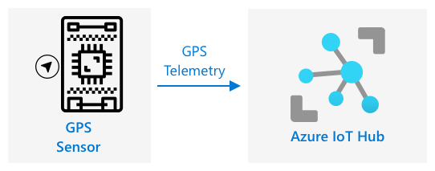

<!--
CO_OP_TRANSLATOR_METADATA:
{
  "original_hash": "e345843ccfeb7261d81500d19c64d476",
  "translation_date": "2025-08-28T03:22:39+00:00",
  "source_file": "3-transport/lessons/2-store-location-data/README.md",
  "language_code": "tr"
}
-->
# Mağaza Konum Verileri


> Sketchnote: [Nitya Narasimhan](https://github.com/nitya). Daha büyük bir versiyon için resme tıklayın.

## Ders Öncesi Test

[Ders öncesi test](https://black-meadow-040d15503.1.azurestaticapps.net/quiz/23)

## Giriş

Son derste, bir GPS sensörü kullanarak konum verilerini nasıl yakalayacağınızı öğrendiniz. Bu verileri, yiyecek yüklü bir kamyonun konumunu ve yolculuğunu görselleştirmek için kullanmak istiyorsanız, verilerin bir IoT hizmetine gönderilmesi ve ardından bir yerde depolanması gerekir.

Bu derste, IoT verilerini depolamanın farklı yollarını öğrenecek ve IoT hizmetinizden gelen verileri sunucusuz kod kullanarak nasıl depolayacağınızı keşfedeceksiniz.

Bu derste şunları ele alacağız:

* [Yapılandırılmış ve yapılandırılmamış veri](../../../../../3-transport/lessons/2-store-location-data)
* [GPS verilerini bir IoT Hub'a gönderme](../../../../../3-transport/lessons/2-store-location-data)
* [Sıcak, ılık ve soğuk yollar](../../../../../3-transport/lessons/2-store-location-data)
* [GPS olaylarını sunucusuz kod kullanarak işleme](../../../../../3-transport/lessons/2-store-location-data)
* [Azure Depolama Hesapları](../../../../../3-transport/lessons/2-store-location-data)
* [Sunucusuz kodunuzu depolamaya bağlama](../../../../../3-transport/lessons/2-store-location-data)

## Yapılandırılmış ve Yapılandırılmamış Veri

Bilgisayar sistemleri veriyle çalışır ve bu veriler farklı şekil ve boyutlarda olabilir. Tek bir sayıdan büyük metin miktarlarına, videolara ve görüntülere, IoT verilerine kadar çeşitlilik gösterebilir. Veriler genellikle iki kategoriye ayrılır: *yapılandırılmış* veri ve *yapılandırılmamış* veri.

* **Yapılandırılmış veri**, iyi tanımlanmış, katı bir yapıya sahip olan ve genellikle ilişkili veri tablolarına eşlenen veridir. Örneğin, bir kişinin adı, doğum tarihi ve adresi gibi bilgileri.

* **Yapılandırılmamış veri**, iyi tanımlanmış, katı bir yapıya sahip olmayan ve sık sık yapısını değiştirebilen veridir. Örneğin, yazılı belgeler veya elektronik tablolar gibi dokümanlar.

✅ Araştırma yapın: Yapılandırılmış ve yapılandırılmamış veriye başka hangi örnekleri verebilirsiniz?

> 💁 Ayrıca, yapılandırılmış ancak sabit veri tablolarına uymayan yarı yapılandırılmış veri de vardır.

IoT verileri genellikle yapılandırılmamış veri olarak kabul edilir.

Büyük bir ticari çiftlikteki araç filosuna IoT cihazları eklediğinizi hayal edin. Farklı araç türleri için farklı cihazlar kullanmak isteyebilirsiniz. Örneğin:

* Traktör gibi çiftlik araçları için doğru tarlalarda çalıştıklarından emin olmak için GPS verisi
* Depolara yiyecek taşıyan teslimat kamyonları için GPS verisi, hız ve ivme verisi, sürücünün güvenli bir şekilde sürdüğünden emin olmak için sürücü kimliği ve başlama/durma verisi
* Soğutmalı kamyonlar için yiyeceklerin çok sıcak veya soğuk olmamasını ve taşınırken bozulmamasını sağlamak için sıcaklık verisi

Bu veriler sürekli değişebilir. Örneğin, IoT cihazı bir kamyon kabinindeyse, gönderdiği veriler römork değiştikçe değişebilir; örneğin, yalnızca soğutmalı bir römork kullanıldığında sıcaklık verisi gönderir.

✅ Başka hangi IoT verileri yakalanabilir? Kamyonların taşıyabileceği yük türlerini ve bakım verilerini düşünün.

Bu veriler araçtan araca değişir, ancak hepsi işlenmek üzere aynı IoT hizmetine gönderilir. IoT hizmeti, bu yapılandırılmamış veriyi işleyebilmeli, farklı veri yapılarıyla çalışabilmeli ve veriyi aranabilir veya analiz edilebilir bir şekilde depolayabilmelidir.

### SQL ve NoSQL Depolama

Veritabanları, verileri depolamanıza ve sorgulamanıza olanak tanıyan hizmetlerdir. Veritabanları iki türde gelir: SQL ve NoSQL.

#### SQL Veritabanları

İlk veritabanları İlişkisel Veritabanı Yönetim Sistemleri (RDBMS) veya ilişkisel veritabanlarıydı. Bunlar, Structured Query Language (SQL) kullanılarak veri ekleme, kaldırma, güncelleme veya sorgulama işlemleri yapılan SQL veritabanları olarak bilinir. Bu veritabanları, bir elektronik tabloya benzer şekilde iyi tanımlanmış bir veri tabloları kümesinden oluşur. Her tablo, birden fazla adlandırılmış sütuna sahiptir. Veri eklediğinizde, tabloya bir satır ekler ve her sütuna değerler koyarsınız. Bu, veriyi çok katı bir yapıda tutar - sütunları boş bırakabilirsiniz, ancak yeni bir sütun eklemek isterseniz, bunu veritabanında yapmanız ve mevcut satırlar için değerler doldurmanız gerekir. Bu veritabanları ilişkiseldir - bir tablo başka bir tabloyla ilişki kurabilir.


Örneğin, bir kullanıcının kişisel bilgilerini bir tabloda depolarsanız, her kullanıcı için bir tür benzersiz iç ID'niz olur ve bu ID, kullanıcının adı ve adresi gibi bilgileri içeren bir tablodaki bir satırda kullanılır. Daha sonra bu kullanıcı hakkında başka ayrıntılar, örneğin satın alımları, başka bir tabloda depolamak isterseniz, yeni tablodaki bir sütun bu kullanıcının ID'si için ayrılır. Bir kullanıcıyı aradığınızda, bir tablodan kişisel bilgilerini ve başka bir tablodan satın alımlarını almak için ID'sini kullanabilirsiniz.

SQL veritabanları, yapılandırılmış verileri depolamak ve verilerin şemanıza uygun olmasını sağlamak için idealdir.

✅ Daha önce SQL kullanmadıysanız, [Wikipedia'daki SQL sayfasını](https://wikipedia.org/wiki/SQL) okuyarak bilgi edinin.

Bazı tanınmış SQL veritabanları Microsoft SQL Server, MySQL ve PostgreSQL'dir.

✅ Araştırma yapın: Bu SQL veritabanları ve özellikleri hakkında bilgi edinin.

#### NoSQL Veritabanları

NoSQL veritabanları, SQL veritabanlarının katı yapısına sahip olmadıkları için NoSQL olarak adlandırılır. Ayrıca, belgeleri depolayabildikleri için belge veritabanları olarak da bilinirler.

> 💁 Adlarına rağmen, bazı NoSQL veritabanları veriyi sorgulamak için SQL kullanılmasına izin verir.


NoSQL veritabanları, verilerin nasıl depolandığını sınırlayan önceden tanımlanmış bir şemaya sahip değildir; bunun yerine genellikle JSON belgeleri kullanarak herhangi bir yapılandırılmamış veri ekleyebilirsiniz. Bu belgeler, bilgisayarınızdaki dosyalara benzer şekilde klasörlere organize edilebilir. Her belge, diğer belgelerden farklı alanlara sahip olabilir - örneğin, çiftlik araçlarınızdan IoT verilerini depoluyorsanız, bazıları ivmeölçer ve hız verisi alanlarına sahip olabilir, diğerleri römorktaki sıcaklık için alanlara sahip olabilir. Dahili tartılarla donatılmış yeni bir kamyon türü eklemek isterseniz, IoT cihazınız bu yeni alanı ekleyebilir ve veritabanında herhangi bir değişiklik yapmadan depolanabilir.

Bazı tanınmış NoSQL veritabanları Azure CosmosDB, MongoDB ve CouchDB'dir.

✅ Araştırma yapın: Bu NoSQL veritabanları ve özellikleri hakkında bilgi edinin.

Bu derste, IoT verilerini depolamak için NoSQL depolama kullanacaksınız.

## GPS Verilerini Bir IoT Hub'a Gönderme

Son derste, IoT cihazınıza bağlı bir GPS sensöründen GPS verilerini yakaladınız. Bu IoT verilerini bulutta depolamak için bir IoT hizmetine göndermeniz gerekir. Yine, önceki projede kullandığınız aynı IoT bulut hizmeti olan Azure IoT Hub'ı kullanacaksınız.



### Görev - GPS Verilerini Bir IoT Hub'a Gönderme

1. Ücretsiz katmanı kullanarak yeni bir IoT Hub oluşturun.

    > ⚠️ Gerekirse [Proje 2, Ders 4'teki IoT Hub oluşturma talimatlarına](../../../2-farm/lessons/4-migrate-your-plant-to-the-cloud/README.md#create-an-iot-service-in-the-cloud) başvurabilirsiniz.

    Yeni bir Kaynak Grubu oluşturmayı unutmayın. Yeni Kaynak Grubuna `gps-sensor` adını verin ve yeni IoT Hub'a `gps-sensor` tabanlı benzersiz bir ad verin, örneğin `gps-sensor-<adınız>`.

    > 💁 Önceki projeden IoT Hub'ınız hâlâ varsa, yeniden kullanabilirsiniz. Diğer hizmetleri oluştururken bu IoT Hub'ın adını ve bulunduğu Kaynak Grubu adını kullanmayı unutmayın.

1. IoT Hub'a yeni bir cihaz ekleyin. Bu cihaza `gps-sensor` adını verin. Cihazın bağlantı dizesini alın.

1. Cihaz kodunuzu, GPS verilerini yeni IoT Hub'a cihaz bağlantı dizesini kullanarak gönderecek şekilde güncelleyin.

    > ⚠️ Gerekirse [Proje 2, Ders 4'teki cihazınızı IoT hizmetine bağlama talimatlarına](../../../2-farm/lessons/4-migrate-your-plant-to-the-cloud/README.md#connect-your-device-to-the-iot-service) başvurabilirsiniz.

1. GPS verilerini JSON formatında şu şekilde gönderin:

    ```json
    {
        "gps" :
        {
            "lat" : <latitude>,
            "lon" : <longitude>
        }
    }
    ```

1. Günlük mesaj kotanızı aşmamak için GPS verilerini her dakika gönderin.

Wio Terminal kullanıyorsanız, gerekli tüm kütüphaneleri eklemeyi ve zamanı bir NTP sunucusu kullanarak ayarlamayı unutmayın. Kodunuz ayrıca, GPS konumunu göndermeden önce seri porttan tüm verileri okuduğundan emin olmalıdır; önceki dersteki mevcut kodu kullanabilirsiniz. JSON belgesini oluşturmak için şu kodu kullanın:

```cpp
DynamicJsonDocument doc(1024);
doc["gps"]["lat"] = gps.location.lat();
doc["gps"]["lon"] = gps.location.lng();
```

Sanal IoT cihazı kullanıyorsanız, sanal bir ortam kullanarak gerekli tüm kütüphaneleri yüklemeyi unutmayın.

Hem Raspberry Pi hem de Sanal IoT cihazı için, önceki dersteki mevcut kodu kullanarak enlem ve boylam değerlerini alın ve ardından aşağıdaki kodla doğru JSON formatında gönderin:

```python
message_json = { "gps" : { "lat":lat, "lon":lon } }
print("Sending telemetry", message_json)
message = Message(json.dumps(message_json))
```

> 💁 Bu kodu [code/wio-terminal](../../../../../3-transport/lessons/2-store-location-data/code/wio-terminal), [code/pi](../../../../../3-transport/lessons/2-store-location-data/code/pi) veya [code/virtual-device](../../../../../3-transport/lessons/2-store-location-data/code/virtual-device) klasöründe bulabilirsiniz.

Cihaz kodunuzu çalıştırın ve `az iot hub monitor-events` CLI komutunu kullanarak IoT Hub'a mesajların aktığını doğrulayın.

## Sıcak, Ilık ve Soğuk Yollar

Bir IoT cihazından buluta akan veri her zaman gerçek zamanlı olarak işlenmez. Bazı veriler gerçek zamanlı işleme gerektirirken, diğer veriler kısa bir süre sonra işlenebilir ve bazı veriler çok daha sonra işlenebilir. Verilerin farklı zamanlarda işlenmek üzere farklı hizmetlere akışı, sıcak, ılık ve soğuk yollar olarak adlandırılır.

### Sıcak Yol

Sıcak yol, gerçek zamanlı veya gerçek zamana yakın işlenmesi gereken verileri ifade eder. Sıcak yol verilerini, bir aracın bir depoya yaklaştığı veya soğutmalı bir kamyondaki sıcaklığın çok yüksek olduğu gibi uyarılar için kullanabilirsiniz.

Sıcak yol verilerini kullanmak için kodunuz, bulut hizmetleriniz tarafından alınan olaylara hemen yanıt verir.

### Ilık Yol

Ilık yol, alındıktan kısa bir süre sonra işlenebilecek verileri ifade eder; örneğin, raporlama veya kısa vadeli analizler için. Ilık yol verilerini, önceki gün toplanan verileri kullanarak araç kilometre raporları için kullanabilirsiniz.

Ilık yol verileri, bulut hizmeti tarafından alındıktan sonra hızlı bir şekilde erişilebilecek bir tür depolama alanında saklanır.

### Soğuk Yol

Soğuk yol, uzun vadeli depolama için tasarlanmış, gerektiğinde işlenebilecek tarihi verileri ifade eder. Örneğin, yıllık araç kilometre raporları almak veya yakıt maliyetlerini azaltmak için en uygun rotayı bulmak üzere rotalar üzerinde analiz yapmak için soğuk yolu kullanabilirsiniz.

Soğuk yol verileri, büyük miktarda değişmeyen veriyi depolamak ve hızlı bir şekilde sorgulamak için tasarlanmış veri ambarlarında saklanır. Bulut uygulamanızda, verileri ılık yol depolamasından veri ambarına taşımak için her gün, hafta veya ay düzenli olarak çalışan bir işiniz olur.

✅ Bu derslerde şimdiye kadar topladığınız verileri düşünün. Bu veriler sıcak, ılık veya soğuk yol verisi mi?

## GPS Olaylarını Sunucusuz Kod Kullanarak İşleme

Veriler IoT Hub'a akmaya başladığında, Event-Hub uyumlu uç noktaya yayınlanan olayları dinlemek için sunucusuz kod yazabilirsiniz. Bu, ılık yol olarak adlandırılır - bu veriler depolanacak ve bir sonraki derste yolculuk raporlaması için kullanılacaktır.


### Görev - GPS Olaylarını Sunucusuz Kod Kullanarak İşleme

1. Azure Functions CLI kullanarak bir Azure Functions uygulaması oluşturun. Python çalışma zamanını kullanın ve bunu `gps-trigger` adlı bir klasörde oluşturun; Functions App proje adı için aynı adı kullanın. Bunun için bir sanal ortam oluşturduğunuzdan emin olun.
> ⚠️ Azure Functions Projesi oluşturma talimatlarına ihtiyaç duyarsanız, [proje 2, ders 5'ten](../../../2-farm/lessons/5-migrate-application-to-the-cloud/README.md#create-a-serverless-application) başvurabilirsiniz.
1. IoT Hub'un Event Hub uyumlu uç noktasını kullanan bir IoT Hub olay tetikleyicisi ekleyin.

    > ⚠️ Gerekirse [proje 2, ders 5'teki IoT Hub olay tetikleyicisi oluşturma talimatlarına](../../../2-farm/lessons/5-migrate-application-to-the-cloud/README.md#create-an-iot-hub-event-trigger) başvurabilirsiniz.

1. Event Hub uyumlu uç nokta bağlantı dizesini `local.settings.json` dosyasına ekleyin ve bu giriş için anahtarı `function.json` dosyasında kullanın.

1. Yerel depolama emülatörü olarak Azurite uygulamasını kullanın.

1. GPS cihazınızdan gelen olayları aldığından emin olmak için işlev uygulamanızı çalıştırın. IoT cihazınızın da çalıştığından ve GPS verilerini gönderdiğinden emin olun.

    ```output
    Python EventHub trigger processed an event: {"gps": {"lat": 47.73481, "lon": -122.25701}}
    ```

## Azure Depolama Hesapları


Azure Depolama Hesapları, verileri farklı şekillerde depolayabilen genel amaçlı bir depolama hizmetidir. Verileri bloblar, kuyruklar, tablolar veya dosyalar olarak ve aynı anda depolayabilirsiniz.

### Blob depolama

*Blob* kelimesi, ikili büyük nesneler anlamına gelir, ancak yapılandırılmamış herhangi bir veri için kullanılan bir terim haline gelmiştir. IoT verilerini içeren JSON belgelerinden görüntü ve film dosyalarına kadar herhangi bir veriyi blob depolamada saklayabilirsiniz. Blob depolama, ilişkisel bir veritabanındaki tablolara benzer şekilde, verilerinizi saklayabileceğiniz adlandırılmış kaplar olan *konteynerler* kavramına sahiptir. Bu konteynerler, blobları saklamak için bir veya daha fazla klasöre sahip olabilir ve her klasör, bilgisayarınızın sabit diskindeki dosyaların saklanmasına benzer şekilde başka klasörler içerebilir.

Bu derste IoT verilerini saklamak için blob depolamayı kullanacaksınız.

✅ Araştırma yapın: [Azure Blob Depolama](https://docs.microsoft.com/azure/storage/blobs/storage-blobs-overview?WT.mc_id=academic-17441-jabenn) hakkında bilgi edinin.

### Tablo depolama

Tablo depolama, yarı yapılandırılmış verileri saklamanıza olanak tanır. Tablo depolama aslında bir NoSQL veritabanıdır, bu nedenle önceden tanımlanmış bir tablo setine ihtiyaç duymaz, ancak bir veya daha fazla tabloda, her satırı tanımlamak için benzersiz anahtarlarla veri saklamak üzere tasarlanmıştır.

✅ Araştırma yapın: [Azure Tablo Depolama](https://docs.microsoft.com/azure/storage/tables/table-storage-overview?WT.mc_id=academic-17441-jabenn) hakkında bilgi edinin.

### Kuyruk depolama

Kuyruk depolama, bir kuyruğa 64KB boyutuna kadar mesajlar saklamanıza olanak tanır. Mesajları kuyruğun sonuna ekleyebilir ve önünden okuyabilirsiniz. Kuyruklar, depolama alanı olduğu sürece mesajları süresiz olarak saklar, bu nedenle mesajların uzun vadeli saklanmasına olanak tanır ve gerektiğinde okunabilir. Örneğin, GPS verilerini işlemek için aylık bir iş çalıştırmak istiyorsanız, bir ay boyunca her gün kuyruğa ekleyebilir ve ardından ay sonunda kuyruğun tüm mesajlarını işleyebilirsiniz.

✅ Araştırma yapın: [Azure Kuyruk Depolama](https://docs.microsoft.com/azure/storage/queues/storage-queues-introduction?WT.mc_id=academic-17441-jabenn) hakkında bilgi edinin.

### Dosya depolama

Dosya depolama, bulutta dosya depolamadır ve herhangi bir uygulama veya cihaz, endüstri standardı protokoller kullanarak bağlanabilir. Dosyaları dosya depolamaya yazabilir, ardından PC'nizde veya Mac'inizde bir sürücü olarak bağlayabilirsiniz.

✅ Araştırma yapın: [Azure Dosya Depolama](https://docs.microsoft.com/azure/storage/files/storage-files-introduction?WT.mc_id=academic-17441-jabenn) hakkında bilgi edinin.

## Sunucusuz kodunuzu depolamaya bağlayın

Artık işlev uygulamanızın, IoT Hub'dan gelen mesajları blob depolamada saklamak için blob depolamaya bağlanması gerekiyor. Bunu yapmanın 2 yolu vardır:

* İşlev kodunun içinde, blob depolamaya bağlanmak için blob depolama Python SDK'sını kullanın ve verileri blob olarak yazın.
* İşlevin dönüş değerini blob depolamaya bağlamak ve blobun otomatik olarak kaydedilmesini sağlamak için bir çıkış işlevi bağlaması kullanın.

Bu derste, blob depolamayla nasıl etkileşimde bulunacağınızı görmek için Python SDK'sını kullanacaksınız.


Veriler, aşağıdaki formatta bir JSON blobu olarak kaydedilecektir:

```json
{
    "device_id": <device_id>,
    "timestamp" : <time>,
    "gps" :
    {
        "lat" : <latitude>,
        "lon" : <longitude>
    }
}
```

### Görev - sunucusuz kodunuzu depolamaya bağlayın

1. Bir Azure Depolama hesabı oluşturun. Buna `gps<adınız>` gibi bir ad verin.

    > ⚠️ Gerekirse [proje 2, ders 5'teki depolama hesabı oluşturma talimatlarına](../../../2-farm/lessons/5-migrate-application-to-the-cloud/README.md#task---create-the-cloud-resources) başvurabilirsiniz.

    Önceki projeden bir depolama hesabınız varsa, bunu yeniden kullanabilirsiniz.

    > 💁 Bu depolama hesabını, bu derste daha sonra Azure Functions uygulamanızı dağıtmak için kullanabileceksiniz.

1. Depolama hesabı için bağlantı dizesini almak üzere aşağıdaki komutu çalıştırın:

    ```sh
    az storage account show-connection-string --output table \
                                              --name <storage_name>
    ```

    `<storage_name>` yerine bir önceki adımda oluşturduğunuz depolama hesabının adını yazın.

1. Depolama hesabı bağlantı dizesi için `local.settings.json` dosyasına yeni bir giriş ekleyin ve buna `STORAGE_CONNECTION_STRING` adını verin.

1. Azure depolama Pip paketlerini yüklemek için `requirements.txt` dosyasına aşağıdakileri ekleyin:

    ```sh
    azure-storage-blob
    ```

    Bu dosyadaki paketleri sanal ortamınıza yükleyin.

    > Bir hata alırsanız, sanal ortamınızdaki Pip sürümünü aşağıdaki komutla en son sürüme yükseltin ve tekrar deneyin:
    >
    > ```sh
    > pip install --upgrade pip
    > ```

1. `iot-hub-trigger` için `__init__.py` dosyasına aşağıdaki import ifadelerini ekleyin:

    ```python
    import json
    import os
    import uuid
    from azure.storage.blob import BlobServiceClient, PublicAccess
    ```

    `json` sistem modülü JSON okumak ve yazmak için, `os` sistem modülü bağlantı dizesini okumak için, `uuid` sistem modülü GPS okuması için benzersiz bir kimlik oluşturmak için kullanılacaktır.

    `azure.storage.blob` paketi, blob depolama ile çalışmak için Python SDK'sını içerir.

1. `main` yönteminden önce aşağıdaki yardımcı işlevi ekleyin:

    ```python
    def get_or_create_container(name):
        connection_str = os.environ['STORAGE_CONNECTION_STRING']
        blob_service_client = BlobServiceClient.from_connection_string(connection_str)
    
        for container in blob_service_client.list_containers():
            if container.name == name:
                return blob_service_client.get_container_client(container.name)
        
        return blob_service_client.create_container(name, public_access=PublicAccess.Container)
    ```

    Python blob SDK'sı, mevcut değilse bir konteyner oluşturmak için bir yardımcı yöntem içermez. Bu kod, bağlantı dizesini `local.settings.json` dosyasından (veya buluta dağıtıldığında Uygulama Ayarlarından) yükler, ardından blob depolama hesabıyla etkileşimde bulunmak için bundan bir `BlobServiceClient` sınıfı oluşturur. Daha sonra blob depolama hesabındaki tüm konteynerleri döngüye alır ve sağlanan adla bir konteyner arar - eğer bulursa, blobları oluşturmak için konteynerle etkileşimde bulunabilen bir `ContainerClient` sınıfı döndürür. Eğer bulamazsa, konteyner oluşturulur ve yeni konteyner için istemci döndürülür.

    Yeni konteyner oluşturulduğunda, konteynerdeki blobları sorgulamak için genel erişim sağlanır. Bu, bir sonraki derste GPS verilerini bir harita üzerinde görselleştirmek için kullanılacaktır.

1. Toprak nemi ile olduğu gibi, bu kodla her olayı saklamak istiyoruz, bu yüzden `main` fonksiyonundaki `for event in events:` döngüsünün içine, `logging` ifadesinin altına aşağıdaki kodu ekleyin:

    ```python
    device_id = event.iothub_metadata['connection-device-id']
    blob_name = f'{device_id}/{str(uuid.uuid1())}.json'
    ```

    Bu kod, olay meta verilerinden cihaz kimliğini alır ve ardından bunu bir blob adı oluşturmak için kullanır. Bloblar klasörlerde saklanabilir ve cihaz kimliği klasör adı olarak kullanılacaktır, böylece her cihazın tüm GPS olayları bir klasörde olacaktır. Blob adı, bu klasör, ardından bir belge adı, ileri eğik çizgilerle ayrılmıştır, bu da Linux ve macOS yollarına benzer (Windows'a da benzer, ancak Windows ters eğik çizgiler kullanır). Belge adı, Python `uuid` modülü kullanılarak oluşturulan benzersiz bir kimliktir ve dosya türü `json`dur.

    Örneğin, `gps-sensor` cihaz kimliği için blob adı `gps-sensor/a9487ac2-b9cf-11eb-b5cd-1e00621e3648.json` olabilir.

1. Bunun altına aşağıdaki kodu ekleyin:

    ```python
    container_client = get_or_create_container('gps-data')
    blob = container_client.get_blob_client(blob_name)
    ```

    Bu kod, `get_or_create_container` yardımcı sınıfını kullanarak konteyner istemcisini alır ve ardından blob adı kullanarak bir blob istemci nesnesi alır. Bu blob istemcileri mevcut bloblara veya bu durumda olduğu gibi yeni bloblara atıfta bulunabilir.

1. Bunun altına aşağıdaki kodu ekleyin:

    ```python
    event_body = json.loads(event.get_body().decode('utf-8'))
    blob_body = {
        'device_id' : device_id,
        'timestamp' : event.iothub_metadata['enqueuedtime'],
        'gps': event_body['gps']
    }
    ```

    Bu, blob depolamaya yazılacak blobun gövdesini oluşturur. Bu, cihaz kimliğini, telemetri IoT Hub'a gönderildiği zamanı ve telemetri verilerinden GPS koordinatlarını içeren bir JSON belgesidir.

    > 💁 Mesajın gönderildiği zamanı almak için mesajın sıraya alınma zamanını kullanmak, mevcut zamanı kullanmaktan daha önemlidir. Mesaj, Functions App çalışmıyorsa bir süre hub'da bekliyor olabilir.

1. Bunun altına aşağıdaki kodu ekleyin:

    ```python
    logging.info(f'Writing blob to {blob_name} - {blob_body}')
    blob.upload_blob(json.dumps(blob_body).encode('utf-8'))
    ```

    Bu kod, bir blobun yazılmak üzere olduğunu ve ayrıntılarını kaydeder, ardından blob gövdesini yeni blobun içeriği olarak yükler.

1. Functions uygulamasını çalıştırın. Çıktıda tüm GPS olayları için blobların yazıldığını göreceksiniz:

    ```output
    [2021-05-21T01:31:14.325Z] Python EventHub trigger processed an event: {"gps": {"lat": 47.73092, "lon": -122.26206}}
    ...
    [2021-05-21T01:31:14.351Z] Writing blob to gps-sensor/4b6089fe-ba8d-11eb-bc7b-1e00621e3648.json - {'device_id': 'gps-sensor', 'timestamp': '2021-05-21T00:57:53.878Z', 'gps': {'lat': 47.73092, 'lon': -122.26206}}
    ```

    > 💁 IoT Hub olay monitörünü aynı anda çalıştırmadığınızdan emin olun.

> 💁 Bu kodu [code/functions](../../../../../3-transport/lessons/2-store-location-data/code/functions) klasöründe bulabilirsiniz.

### Görev - yüklenen blobları doğrulayın

1. Oluşturulan blobları görüntülemek için [Azure Storage Explorer](https://azure.microsoft.com/features/storage-explorer/?WT.mc_id=academic-17441-jabenn) adlı ücretsiz bir aracı veya CLI'yı kullanabilirsiniz.

    1. CLI'yı kullanmak için önce bir hesap anahtarına ihtiyacınız olacak. Bu anahtarı almak için aşağıdaki komutu çalıştırın:

        ```sh
        az storage account keys list --output table \
                                     --account-name <storage_name>
        ```

        `<storage_name>` yerine depolama hesabının adını yazın.

        `key1` değerini kopyalayın.

    1. Konteynerdeki blobları listelemek için aşağıdaki komutu çalıştırın:

        ```sh
        az storage blob list --container-name gps-data \
                             --output table \
                             --account-name <storage_name> \
                             --account-key <key1>
        ```

        `<storage_name>` yerine depolama hesabının adını ve `<key1>` yerine bir önceki adımda kopyaladığınız `key1` değerini yazın.

        Bu, konteynerdeki tüm blobları listeleyecektir:

        ```output
        Name                                                  Blob Type    Blob Tier    Length    Content Type              Last Modified              Snapshot
        ----------------------------------------------------  -----------  -----------  --------  ------------------------  -------------------------  ----------
        gps-sensor/1810d55e-b9cf-11eb-9f5b-1e00621e3648.json  BlockBlob    Hot          45        application/octet-stream  2021-05-21T00:54:27+00:00
        gps-sensor/18293e46-b9cf-11eb-9f5b-1e00621e3648.json  BlockBlob    Hot          45        application/octet-stream  2021-05-21T00:54:28+00:00
        gps-sensor/1844549c-b9cf-11eb-9f5b-1e00621e3648.json  BlockBlob    Hot          45        application/octet-stream  2021-05-21T00:54:28+00:00
        gps-sensor/1894d714-b9cf-11eb-9f5b-1e00621e3648.json  BlockBlob    Hot          45        application/octet-stream  2021-05-21T00:54:28+00:00
        ```

    1. Bloblardan birini indirmek için aşağıdaki komutu çalıştırın:

        ```sh
        az storage blob download --container-name gps-data \
                                 --account-name <storage_name> \
                                 --account-key <key1> \
                                 --name <blob_name> \
                                 --file <file_name>
        ```

        `<storage_name>` yerine depolama hesabının adını, `<key1>` yerine daha önce kopyaladığınız `key1` değerini yazın.

        `<blob_name>` yerine, bir önceki adımın çıktısındaki `Name` sütunundan tam adı, klasör adı dahil yazın. `<file_name>` yerine, blobu kaydetmek için yerel bir dosya adı yazın.

    İndirildikten sonra JSON dosyasını VS Code'da açabilirsiniz ve blobun GPS konum detaylarını içerdiğini göreceksiniz:

    ```json
    {"device_id": "gps-sensor", "timestamp": "2021-05-21T00:57:53.878Z", "gps": {"lat": 47.73092, "lon": -122.26206}}
    ```

### Görev - Functions uygulamanızı buluta dağıtın

Artık Functions uygulamanız çalışıyor, bunu buluta dağıtabilirsiniz.

1. Daha önce oluşturduğunuz depolama hesabını kullanarak yeni bir Azure Functions uygulaması oluşturun. Buna `gps-sensor-` gibi bir ad verin ve sonuna rastgele kelimeler veya adınız gibi benzersiz bir tanımlayıcı ekleyin.

    > ⚠️ Gerekirse [proje 2, ders 5'teki Functions uygulaması oluşturma talimatlarına](../../../2-farm/lessons/5-migrate-application-to-the-cloud/README.md#task---create-the-cloud-resources) başvurabilirsiniz.

1. `IOT_HUB_CONNECTION_STRING` ve `STORAGE_CONNECTION_STRING` değerlerini Uygulama Ayarlarına yükleyin.

    > ⚠️ Gerekirse [proje 2, ders 5'teki Uygulama Ayarlarını yükleme talimatlarına](../../../2-farm/lessons/5-migrate-application-to-the-cloud/README.md#task---upload-your-application-settings) başvurabilirsiniz.

1. Yerel Functions uygulamanızı buluta dağıtın.
> ⚠️ Gerekirse [proje 2, ders 5'teki Functions uygulamanızı dağıtma talimatlarına](../../../2-farm/lessons/5-migrate-application-to-the-cloud/README.md#task---deploy-your-functions-app-to-the-cloud) başvurabilirsiniz.
## 🚀 Zorluk

GPS verileri mükemmel derecede doğru değildir ve tespit edilen konumlar birkaç metre, hatta daha fazla sapma gösterebilir, özellikle tünellerde ve yüksek binaların bulunduğu bölgelerde.

Uydu navigasyonu bunu nasıl aşabilir? Konumunuzu daha iyi tahmin etmek için sat-nav'ınızın sahip olduğu hangi veriler kullanılabilir?

## Ders Sonrası Test

[Ders sonrası test](https://black-meadow-040d15503.1.azurestaticapps.net/quiz/24)

## Gözden Geçirme ve Kendi Kendine Çalışma

* Yapılandırılmış veri hakkında [Wikipedia'daki Veri modeli sayfasını](https://wikipedia.org/wiki/Data_model) okuyun.
* Yarı yapılandırılmış veri hakkında [Wikipedia'daki Yarı yapılandırılmış veri sayfasını](https://wikipedia.org/wiki/Semi-structured_data) okuyun.
* Yapılandırılmamış veri hakkında [Wikipedia'daki Yapılandırılmamış veri sayfasını](https://wikipedia.org/wiki/Unstructured_data) okuyun.
* Azure Depolama ve farklı depolama türleri hakkında daha fazla bilgi için [Azure Depolama belgelerini](https://docs.microsoft.com/azure/storage/?WT.mc_id=academic-17441-jabenn) okuyun.

## Ödev

[Fonksiyon bağlamalarını araştırın](assignment.md)

---

**Feragatname**:  
Bu belge, AI çeviri hizmeti [Co-op Translator](https://github.com/Azure/co-op-translator) kullanılarak çevrilmiştir. Doğruluk için çaba göstersek de, otomatik çevirilerin hata veya yanlışlık içerebileceğini lütfen unutmayın. Belgenin orijinal dili, yetkili kaynak olarak kabul edilmelidir. Kritik bilgiler için profesyonel insan çevirisi önerilir. Bu çevirinin kullanımından kaynaklanan yanlış anlamalar veya yanlış yorumlamalar için sorumluluk kabul etmiyoruz.