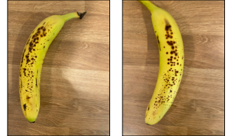

<!--
CO_OP_TRANSLATOR_METADATA:
{
  "original_hash": "f5e63c916d2dd97d58be12aaf76bd9f1",
  "translation_date": "2025-08-28T02:37:14+00:00",
  "source_file": "4-manufacturing/lessons/1-train-fruit-detector/README.md",
  "language_code": "tr"
}
-->
# Meyve Kalite Dedektörü Eğitimi


> Sketchnote: [Nitya Narasimhan](https://github.com/nitya). Daha büyük bir versiyon için resme tıklayın.

Bu video, bu derste ele alınacak olan Azure Custom Vision hizmetine genel bir bakış sunar.

[](https://www.youtube.com/watch?v=TETcDLJlWR4)

> 🎥 Videoyu izlemek için yukarıdaki resme tıklayın

## Ders Öncesi Test

[Ders öncesi test](https://black-meadow-040d15503.1.azurestaticapps.net/quiz/29)

## Giriş

Son yıllarda Yapay Zeka (AI) ve Makine Öğrenimi (ML) alanındaki gelişmeler, günümüz geliştiricilerine geniş bir yelpazede yetenekler sunuyor. ML modelleri, olgunlaşmamış meyveler gibi farklı şeyleri görüntülerde tanıyacak şekilde eğitilebilir ve bu, IoT cihazlarında, hasat sırasında veya fabrikalarda ve depolarda işleme sırasında ürünleri ayırmaya yardımcı olmak için kullanılabilir.

Bu derste, görüntü sınıflandırmayı öğreneceksiniz - ML modellerini kullanarak farklı şeylerin görüntülerini ayırt etmeyi. İyi meyve ile kötü meyveyi, yani olgunlaşmamış, fazla olgunlaşmış, çürük veya ezilmiş meyveleri ayırt etmek için bir görüntü sınıflandırıcıyı nasıl eğiteceğinizi öğreneceksiniz.

Bu derste şunları ele alacağız:

* [AI ve ML kullanarak gıda ayırma](../../../../../4-manufacturing/lessons/1-train-fruit-detector)
* [Makine Öğrenimi ile görüntü sınıflandırma](../../../../../4-manufacturing/lessons/1-train-fruit-detector)
* [Bir görüntü sınıflandırıcı eğitme](../../../../../4-manufacturing/lessons/1-train-fruit-detector)
* [Görüntü sınıflandırıcınızı test etme](../../../../../4-manufacturing/lessons/1-train-fruit-detector)
* [Görüntü sınıflandırıcınızı yeniden eğitme](../../../../../4-manufacturing/lessons/1-train-fruit-detector)

## AI ve ML Kullanarak Gıda Ayırma

Dünya nüfusunu beslemek zordur, özellikle de herkes için uygun fiyatlı gıda sağlamak açısından. En büyük maliyetlerden biri iş gücüdür, bu nedenle çiftçiler giderek artan bir şekilde otomasyon ve IoT gibi araçlara yöneliyorlar. Elle hasat yapmak emek yoğun (ve genellikle yorucu) bir iştir ve özellikle zengin ülkelerde makinelerle değiştirilmektedir. Ancak makinelerle hasat yapmanın maliyet tasarrufu sağlasa da bir dezavantajı vardır - hasat sırasında gıdaları ayırma yeteneği.

Tüm mahsuller eşit şekilde olgunlaşmaz. Örneğin, domatesler çoğunluğu hasat için hazır olduğunda hala dalında yeşil meyveler bulundurabilir. Bu meyveleri erken hasat etmek israf olsa da, çiftçi için her şeyi makinelerle hasat etmek ve olgunlaşmamış ürünleri daha sonra atmak daha ucuz ve kolaydır.

✅ Çevrenizdeki çiftliklerde, bahçenizde veya mağazalarda yetişen farklı meyve veya sebzelere bir göz atın. Hepsi aynı olgunlukta mı, yoksa bir çeşitlilik görüyor musunuz?

Otomatik hasatın yükselişi, ürünlerin ayıklanmasını hasattan fabrikaya taşıdı. Gıdalar uzun konveyör bantlarında ilerlerken, ekipler ürünleri inceleyip kalite standartlarına uymayanları ayırırdı. Makineler sayesinde hasat daha ucuz hale geldi, ancak gıdaları elle ayırmanın hala bir maliyeti vardı.


Bir sonraki evrim, ayırma işlemini makinelerle yapmak oldu; bu makineler ya hasat makinesine entegre edildi ya da işleme tesislerinde kullanıldı. Bu makinelerin ilk nesli, renkleri algılamak için optik sensörler kullanarak, yeşil domatesleri kollar veya hava püskürtücüleriyle bir atık kutusuna itip, kırmızı domateslerin konveyör bantlarında yoluna devam etmesini sağladı.

Bu videoda, domatesler bir konveyör bandından diğerine düşerken, yeşil domatesler algılanır ve kollarla bir kutuya fırlatılır.

✅ Bu optik sensörlerin bir fabrikada veya tarlada doğru çalışması için hangi koşullara ihtiyaç duyulacağını düşünün.

Bu ayırma makinelerinin en son evrimi, AI ve ML'den yararlanarak, yalnızca yeşil domatesler ile kırmızı domatesler gibi belirgin renk farklarını değil, aynı zamanda hastalık veya ezikliği gösterebilecek daha ince görünüm farklılıklarını da ayırt edebilen modeller kullanır.

## Makine Öğrenimi ile Görüntü Sınıflandırma

Geleneksel programlama, verileri alıp bir algoritma uygulayarak çıktı elde ettiğiniz bir yöntemdir. Örneğin, bir önceki projede GPS koordinatlarını ve bir coğrafi çiti alıp, Azure Maps tarafından sağlanan bir algoritmayı uygulayarak, noktanın çitin içinde mi yoksa dışında mı olduğunu belirleyen bir sonuç elde ettiniz. Daha fazla veri girdiniz, daha fazla çıktı aldınız.


Makine öğrenimi bu süreci tersine çevirir - veriler ve bilinen çıktılarla başlarsınız ve makine öğrenimi algoritması verilerden öğrenir. Daha sonra bu eğitilmiş algoritmayı, yani bir *makine öğrenimi modeli* veya *modeli* alabilir, yeni verilerle besleyebilir ve yeni çıktılar elde edebilirsiniz.

> 🎓 Makine öğrenimi algoritmasının verilerden öğrenme sürecine *eğitim* denir. Girdiler ve bilinen çıktılar *eğitim verileri* olarak adlandırılır.

Örneğin, bir modele milyonlarca olgunlaşmamış muz fotoğrafını giriş eğitim verisi olarak verebilir, eğitim çıktısını `olgunlaşmamış` olarak ayarlayabilir ve milyonlarca olgun muz fotoğrafını eğitim verisi olarak verip çıktıyı `olgun` olarak ayarlayabilirsiniz. ML algoritması bu verilere dayanarak bir model oluşturur. Daha sonra bu modele yeni bir muz fotoğrafı verirsiniz ve model, yeni fotoğrafın olgun mu yoksa olgunlaşmamış mı olduğunu tahmin eder.

> 🎓 ML modellerinin sonuçlarına *tahminler* denir.


ML modelleri ikili bir cevap vermez, bunun yerine olasılıklar sunar. Örneğin, bir model bir muz fotoğrafı alabilir ve `olgun` için %99.7, `olgunlaşmamış` için %0.3 tahmininde bulunabilir. Kodunuz en iyi tahmini seçer ve muzun olgun olduğunu belirler.

Bu tür görüntüleri algılamak için kullanılan ML modeline *görüntü sınıflandırıcı* denir - etiketlenmiş görüntüler alır ve bu etiketlere dayanarak yeni görüntüleri sınıflandırır.

> 💁 Bu bir basitleştirmedir ve etiketlenmiş çıktılara ihtiyaç duymayan, denetimsiz öğrenme gibi başka model eğitme yöntemleri de vardır. ML hakkında daha fazla bilgi edinmek isterseniz, [Makine Öğrenimi için Başlangıç, 24 derslik bir müfredat](https://aka.ms/ML-beginners) kaynağına göz atabilirsiniz.

## Bir Görüntü Sınıflandırıcı Eğitme

Başarılı bir görüntü sınıflandırıcı eğitmek için milyonlarca görüntüye ihtiyacınız vardır. Ancak, milyonlarca veya milyarlarca farklı görüntü üzerinde eğitilmiş bir görüntü sınıflandırıcıya sahip olduğunuzda, bunu yeniden kullanabilir ve az sayıda görüntüyle yeniden eğiterek harika sonuçlar elde edebilirsiniz. Bu sürece *transfer öğrenimi* denir.

> 🎓 Transfer öğrenimi, mevcut bir ML modelinden öğrenilen bilgilerin, yeni verilere dayalı olarak yeni bir modele aktarılmasıdır.

Bir görüntü sınıflandırıcı geniş bir yelpazede görüntüler için eğitildiğinde, şekilleri, renkleri ve desenleri tanımada oldukça iyi hale gelir. Transfer öğrenimi, modelin görüntü parçalarını tanımada öğrendiklerini almasına ve yeni görüntüleri tanımak için kullanmasına olanak tanır.


Bunu, çocukların şekil kitaplarına benzetebilirsiniz; bir yarım daire, bir dikdörtgen ve bir üçgeni tanıyabildiğinizde, bunların bir tekne mi yoksa bir kedi mi olduğunu şekillerin düzenine göre anlayabilirsiniz. Görüntü sınıflandırıcı şekilleri tanıyabilir ve transfer öğrenimi, hangi kombinasyonun bir tekne veya kedi - ya da olgun bir muz - oluşturduğunu öğretir.

Bu işlemi yapmanıza yardımcı olabilecek çok çeşitli araçlar vardır, bunlar arasında modelinizi eğitmenize ve ardından web API'leri aracılığıyla kullanmanıza olanak tanıyan bulut tabanlı hizmetler de bulunur.

> 💁 Bu modelleri eğitmek çok fazla bilgisayar gücü gerektirir, genellikle Grafik İşleme Birimleri (GPU'lar) aracılığıyla. Xbox'ınızdaki oyunları harika gösteren aynı özel donanım, makine öğrenimi modellerini eğitmek için de kullanılabilir. Bulut kullanarak, bu modelleri eğitmek için yalnızca ihtiyacınız olan süre boyunca güçlü GPU'lara sahip bilgisayarları kiralayabilirsiniz.

## Custom Vision

Custom Vision, görüntü sınıflandırıcıları eğitmek için bulut tabanlı bir araçtır. Sadece az sayıda görüntü kullanarak bir sınıflandırıcı eğitmenize olanak tanır. Görüntüleri bir web portalı, web API veya SDK aracılığıyla yükleyebilir ve her görüntüye o görüntünün sınıflandırmasını belirten bir *etiket* verebilirsiniz. Daha sonra modeli eğitip, performansını test edebilirsiniz. Modelden memnun kaldığınızda, web API veya SDK aracılığıyla erişilebilecek sürümlerini yayınlayabilirsiniz.


> 💁 Custom Vision modeli, her sınıflandırma için sadece 5 görüntüyle eğitilebilir, ancak daha fazla görüntü daha iyidir. En az 30 görüntüyle daha iyi sonuçlar elde edebilirsiniz.

Custom Vision, Microsoft'un Cognitive Services adı verilen bir dizi AI aracının bir parçasıdır. Bu araçlar, ya hiç eğitim gerektirmeyen ya da az miktarda eğitimle kullanılabilen AI araçlarıdır. Bunlar arasında konuşma tanıma ve çeviri, dil anlama ve görüntü analizi bulunur. Azure'da ücretsiz bir katman olarak sunulurlar.

> 💁 Ücretsiz katman, bir model oluşturmak, eğitmek ve ardından geliştirme çalışmaları için kullanmak için fazlasıyla yeterlidir. Ücretsiz katmanın sınırlarını [Microsoft dokümanlarındaki Custom Vision Limits and Quotas sayfasında](https://docs.microsoft.com/azure/cognitive-services/custom-vision-service/limits-and-quotas?WT.mc_id=academic-17441-jabenn) okuyabilirsiniz.

### Görev - Cognitive Services Kaynağı Oluşturma

Custom Vision'ı kullanmak için önce Azure CLI kullanarak Azure'da iki cognitive services kaynağı oluşturmanız gerekir: biri Custom Vision eğitimi için, diğeri Custom Vision tahmini için.

1. Bu proje için `fruit-quality-detector` adında bir Kaynak Grubu oluşturun.

1. Aşağıdaki komutu kullanarak ücretsiz bir Custom Vision eğitim kaynağı oluşturun:

    ```sh
    az cognitiveservices account create --name fruit-quality-detector-training \
                                        --resource-group fruit-quality-detector \
                                        --kind CustomVision.Training \
                                        --sku F0 \
                                        --yes \
                                        --location <location>
    ```

    `<location>` kısmını Kaynak Grubu oluştururken kullandığınız konumla değiştirin.

    Bu, Kaynak Grubunuzda bir Custom Vision eğitim kaynağı oluşturacaktır. Bu kaynak `fruit-quality-detector-training` olarak adlandırılacak ve ücretsiz katman olan `F0` SKU'sunu kullanacaktır. `--yes` seçeneği, cognitive services kullanım şartlarını kabul ettiğiniz anlamına gelir.

> 💁 Zaten herhangi bir Cognitive Services için ücretsiz bir hesabınız varsa, `S0` SKU'sunu kullanabilirsiniz.

1. Aşağıdaki komutu kullanarak ücretsiz bir Custom Vision tahmin kaynağı oluşturun:

    ```sh
    az cognitiveservices account create --name fruit-quality-detector-prediction \
                                        --resource-group fruit-quality-detector \
                                        --kind CustomVision.Prediction \
                                        --sku F0 \
                                        --yes \
                                        --location <location>
    ```

    `<location>` kısmını Kaynak Grubu oluştururken kullandığınız konumla değiştirin.

    Bu, Kaynak Grubunuzda bir Custom Vision tahmin kaynağı oluşturacaktır. Bu kaynak `fruit-quality-detector-prediction` olarak adlandırılacak ve ücretsiz katman olan `F0` SKU'sunu kullanacaktır. `--yes` seçeneği, cognitive services kullanım şartlarını kabul ettiğiniz anlamına gelir.

### Görev - Görüntü Sınıflandırıcı Projesi Oluşturma

1. [CustomVision.ai](https://customvision.ai) adresindeki Custom Vision portalını açın ve Azure hesabınızla kullandığınız Microsoft hesabıyla oturum açın.

1. Microsoft dokümanlarındaki [bir sınıflandırıcı oluşturma hızlı başlangıcının yeni bir proje oluşturma bölümünü](https://docs.microsoft.com/azure/cognitive-services/custom-vision-service/getting-started-build-a-classifier?WT.mc_id=academic-17441-jabenn#create-a-new-project) takip ederek yeni bir Custom Vision projesi oluşturun. Kullanıcı arayüzü değişebilir, bu nedenle bu dokümanlar her zaman en güncel referans olacaktır.

    Projenizi `fruit-quality-detector` olarak adlandırın.

    Projenizi oluştururken, daha önce oluşturduğunuz `fruit-quality-detector-training` kaynağını kullandığınızdan emin olun. *Sınıflandırma* proje türünü, *Çoklu sınıf* sınıflandırma türünü ve *Gıda* alanını seçin.

    

✅ Görüntü sınıflandırıcınız için Custom Vision kullanıcı arayüzünü keşfetmek için biraz zaman ayırın.

### Görev - Görüntü Sınıflandırıcı Projenizi Eğitme

Bir görüntü sınıflandırıcıyı eğitmek için, hem iyi hem de kötü kalitede meyvelerin, örneğin olgun ve fazla olgun bir muzun, birden fazla fotoğrafına ihtiyacınız olacak. Bu görüntüleri iyi ve kötü olarak etiketleyerek sınıflandırıcıyı eğitebilirsiniz.
💁 Bu sınıflandırıcılar, herhangi bir şeyin görüntülerini sınıflandırabilir, bu yüzden farklı kalitede meyveleriniz yoksa, iki farklı türde meyve veya kedi ve köpek kullanabilirsiniz!
Her bir resimde yalnızca meyve olmalı, ya arka planlar tutarlı olmalı ya da çok çeşitli arka planlar kullanılmalı. Arka planda olgun veya olgunlaşmamış meyveye özgü bir şey olmamasına dikkat edin.

> 💁 Her bir etiket için sınıflandırılan şeyle ilgisi olmayan belirli arka planlar veya öğeler olmaması önemlidir, aksi takdirde sınıflandırıcı yalnızca arka plana göre sınıflandırabilir. Örneğin, cilt kanseri için bir sınıflandırıcı normal ve kanserli benler üzerinde eğitilmişti ve kanserli olanların hepsinde boyutlarını ölçmek için cetveller vardı. Sonuçta sınıflandırıcının, resimlerdeki cetvelleri neredeyse %100 doğrulukla tanımladığı, ancak kanserli benleri tanımlamadığı ortaya çıktı.

Görüntü sınıflandırıcılar çok düşük çözünürlükte çalışır. Örneğin, Custom Vision eğitim ve tahmin görüntülerini 10240x10240 boyutuna kadar alabilir, ancak modeli 227x227 boyutundaki görüntülerle eğitir ve çalıştırır. Daha büyük görüntüler bu boyuta küçültülür, bu nedenle sınıflandırdığınız şeyin görüntünün büyük bir kısmını kapladığından emin olun, aksi takdirde sınıflandırıcı tarafından kullanılan daha küçük görüntüde çok küçük kalabilir.

1. Sınıflandırıcınız için resimler toplayın. Sınıflandırıcıyı eğitmek için her etiket için en az 5 resme ihtiyacınız olacak, ancak ne kadar çok olursa o kadar iyi. Ayrıca sınıflandırıcıyı test etmek için birkaç ek resme ihtiyacınız olacak. Bu resimlerin hepsi aynı şeyin farklı görüntüleri olmalı. Örneğin:

    * 2 olgun muz kullanarak, her birinin birkaç farklı açıdan en az 7 resmini (5 eğitim, 2 test için) çekin, ancak ideal olarak daha fazla çekin.

        

    * Aynı işlemi 2 olgunlaşmamış muz için tekrarlayın.

    En az 10 eğitim görüntünüz olmalı, en az 5 olgun ve 5 olgunlaşmamış, ve 4 test görüntüsü, 2 olgun, 2 olgunlaşmamış. Görüntüleriniz png veya jpeg formatında, 6MB'den küçük olmalı. Örneğin bir iPhone ile oluşturulmuşlarsa, yüksek çözünürlüklü HEIC görüntüler olabilirler, bu nedenle dönüştürülmeleri ve muhtemelen küçültülmeleri gerekebilir. Ne kadar çok görüntü olursa o kadar iyi olur ve olgun ve olgunlaşmamış görüntü sayısı benzer olmalıdır.

    Eğer hem olgun hem de olgunlaşmamış meyveye sahip değilseniz, farklı meyveler veya elinizde bulunan herhangi iki nesneyi kullanabilirsiniz. Ayrıca olgun ve olgunlaşmamış muzların örnek görüntülerini [images](../../../../../4-manufacturing/lessons/1-train-fruit-detector/images) klasöründe bulabilirsiniz.

1. [Microsoft dokümanlarındaki sınıflandırıcı oluşturma hızlı başlangıç rehberinin görüntüleri yükleme ve etiketleme bölümünü](https://docs.microsoft.com/azure/cognitive-services/custom-vision-service/getting-started-build-a-classifier?WT.mc_id=academic-17441-jabenn#upload-and-tag-images) takip ederek eğitim görüntülerinizi yükleyin. Olgun meyveleri `ripe`, olgunlaşmamış meyveleri `unripe` olarak etiketleyin.

    

1. [Microsoft dokümanlarındaki sınıflandırıcıyı eğitme bölümünü](https://docs.microsoft.com/azure/cognitive-services/custom-vision-service/getting-started-build-a-classifier?WT.mc_id=academic-17441-jabenn#train-the-classifier) takip ederek yüklediğiniz görüntüler üzerinde görüntü sınıflandırıcısını eğitin.

    Size bir eğitim türü seçme seçeneği sunulacak. **Hızlı Eğitim** seçeneğini seçin.

Sınıflandırıcı daha sonra eğitilecek. Eğitimin tamamlanması birkaç dakika sürecektir.

> 🍌 Eğer sınıflandırıcı eğitilirken meyvenizi yemeye karar verirseniz, önce test için yeterli görüntüye sahip olduğunuzdan emin olun!

## Görüntü sınıflandırıcınızı test edin

Sınıflandırıcınız eğitildikten sonra, ona sınıflandırması için yeni bir görüntü vererek test edebilirsiniz.

### Görev - görüntü sınıflandırıcınızı test edin

1. [Microsoft dokümanlarındaki modelinizi test etme dokümantasyonunu](https://docs.microsoft.com/azure/cognitive-services/custom-vision-service/test-your-model?WT.mc_id=academic-17441-jabenn#test-your-model) takip ederek görüntü sınıflandırıcınızı test edin. Daha önce oluşturduğunuz test görüntülerini kullanın, eğitim için kullandığınız görüntüleri değil.

    

1. Erişebildiğiniz tüm test görüntülerini deneyin ve olasılıkları gözlemleyin.

## Görüntü sınıflandırıcınızı yeniden eğitin

Sınıflandırıcınızı test ettiğinizde, beklediğiniz sonuçları vermeyebilir. Görüntü sınıflandırıcılar, bir görüntüde ne olduğunu anlamak yerine, bir görüntünün belirli özelliklerinin belirli bir etikete uyduğunu gösteren olasılıklara dayanarak tahminler yapar. Görüntüde ne olduğunu anlamaz - bir muzun ne olduğunu bilmez veya bir muzu bir tekneden ayıran şeyin ne olduğunu anlamaz. Yanlış sonuçlar verdiği görüntülerle sınıflandırıcınızı yeniden eğiterek iyileştirebilirsiniz.

Hızlı test seçeneğini kullanarak her tahmin yaptığınızda, görüntü ve sonuçlar kaydedilir. Bu görüntüleri modelinizi yeniden eğitmek için kullanabilirsiniz.

### Görev - görüntü sınıflandırıcınızı yeniden eğitin

1. [Microsoft dokümanlarındaki tahmin edilen görüntüyü eğitim için kullanma dokümantasyonunu](https://docs.microsoft.com/azure/cognitive-services/custom-vision-service/test-your-model?WT.mc_id=academic-17441-jabenn#use-the-predicted-image-for-training) takip ederek modelinizi yeniden eğitin, her görüntü için doğru etiketi kullanarak.

1. Modeliniz yeniden eğitildikten sonra, yeni görüntüler üzerinde test yapın.

---

## 🚀 Meydan Okuma

Muzlar üzerinde eğitilmiş bir modelle bir çilek resmi, şişme bir muz, muz kostümü giymiş bir kişi veya Simpsons'tan biri gibi sarı bir çizgi film karakteri kullanırsanız ne olacağını düşünüyorsunuz?

Deneyin ve tahminlerin ne olduğunu görün. Denemek için [Bing Görsel arama](https://www.bing.com/images/trending) kullanarak görüntüler bulabilirsiniz.

## Ders sonrası sınav

[Ders sonrası sınav](https://black-meadow-040d15503.1.azurestaticapps.net/quiz/30)

## Gözden Geçirme ve Kendi Kendine Çalışma

* Sınıflandırıcınızı eğittiğinizde, oluşturulan modeli derecelendiren *Precision*, *Recall* ve *AP* değerlerini görmüş olmalısınız. Bu değerlerin ne olduğunu [Microsoft dokümanlarındaki sınıflandırıcıyı değerlendirme bölümünü](https://docs.microsoft.com/azure/cognitive-services/custom-vision-service/getting-started-build-a-classifier?WT.mc_id=academic-17441-jabenn#evaluate-the-classifier) kullanarak okuyun.
* Sınıflandırıcınızı nasıl iyileştireceğinizi [Microsoft dokümanlarındaki Custom Vision modelinizi iyileştirme rehberinden](https://docs.microsoft.com/azure/cognitive-services/custom-vision-service/getting-started-improving-your-classifier?WT.mc_id=academic-17441-jabenn) okuyun.

## Ödev

[Birden fazla meyve ve sebze için sınıflandırıcınızı eğitin](assignment.md)

---

**Feragatname**:  
Bu belge, AI çeviri hizmeti [Co-op Translator](https://github.com/Azure/co-op-translator) kullanılarak çevrilmiştir. Doğruluk için çaba göstersek de, otomatik çevirilerin hata veya yanlışlık içerebileceğini lütfen unutmayın. Belgenin orijinal dili, yetkili kaynak olarak kabul edilmelidir. Kritik bilgiler için profesyonel insan çevirisi önerilir. Bu çevirinin kullanımından kaynaklanan yanlış anlamalar veya yanlış yorumlamalar için sorumluluk kabul etmiyoruz.