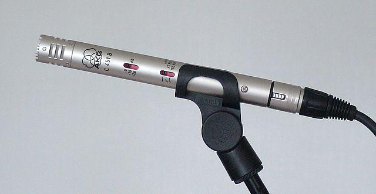

<!--
CO_OP_TRANSLATOR_METADATA:
{
  "original_hash": "6d6aa1be033625d201a190fc9c5cbfb4",
  "translation_date": "2025-08-28T03:01:07+00:00",
  "source_file": "6-consumer/lessons/1-speech-recognition/README.md",
  "language_code": "tr"
}
-->
# IoT Cihazıyla Konuşmayı Tanıma


> Sketchnote: [Nitya Narasimhan](https://github.com/nitya). Daha büyük bir versiyon için görsele tıklayın.

Bu video, bu derste ele alınacak olan Azure konuşma hizmetine genel bir bakış sunar:

[](https://www.youtube.com/watch?v=iW0Fw0l3mrA)

> 🎥 Videoyu izlemek için yukarıdaki görsele tıklayın

## Ders Öncesi Test

[Ders öncesi test](https://black-meadow-040d15503.1.azurestaticapps.net/quiz/41)

## Giriş

'Alexa, 12 dakikalık bir zamanlayıcı ayarla'

'Alexa, zamanlayıcı durumu'

'Alexa, buharda brokoli için 8 dakikalık bir zamanlayıcı ayarla'

Akıllı cihazlar giderek daha yaygın hale geliyor. Sadece HomePod, Echo ve Google Home gibi akıllı hoparlörler olarak değil, aynı zamanda telefonlarımıza, saatlerimize ve hatta ışık armatürlerimize ve termostatlarımıza entegre ediliyorlar.

> 💁 Evimde sesli asistanı olan en az 19 cihaz var ve bu sadece bildiklerim!

Sesli kontrol, sınırlı hareket kabiliyetine sahip kişilerin cihazlarla etkileşim kurmasını kolaylaştırarak erişilebilirliği artırır. Bu, kolları olmadan doğmak gibi kalıcı bir engelden, kırık kollar gibi geçici engellere veya ellerinizin alışveriş torbaları ya da küçük çocuklarla dolu olmasına kadar değişebilir. Evlerimizi ellerimiz yerine sesimizle kontrol edebilmek, erişim dünyasının kapılarını açar. Bir bebek bezi değiştirirken ve yaramaz bir çocuğu idare ederken 'Hey Siri, garaj kapımı kapat' diye bağırmak, hayatı küçük ama etkili bir şekilde kolaylaştırabilir.

Sesli asistanların en popüler kullanım alanlarından biri zamanlayıcı ayarlamaktır, özellikle de mutfak zamanlayıcıları. Sadece sesinizle birden fazla zamanlayıcı ayarlayabilmek mutfakta büyük bir kolaylık sağlar - hamur yoğurmayı, çorba karıştırmayı bırakmanıza ya da ellerinizi temizlemenize gerek kalmaz.

Bu derste, IoT cihazlarına ses tanıma özelliği eklemeyi öğreneceksiniz. Mikrofonları birer sensör olarak kullanmayı, bir IoT cihazına bağlı mikrofondan ses yakalamayı ve duyulanları metne dönüştürmek için yapay zekayı nasıl kullanacağınızı öğreneceksiniz. Projenin geri kalanında, birden fazla dilde sesle zamanlayıcı ayarlayabilen akıllı bir mutfak zamanlayıcısı oluşturacaksınız.

Bu derste şunları ele alacağız:

* [Mikrofonlar](../../../../../6-consumer/lessons/1-speech-recognition)
* [IoT cihazınızdan ses yakalama](../../../../../6-consumer/lessons/1-speech-recognition)
* [Konuşmadan metne](../../../../../6-consumer/lessons/1-speech-recognition)
* [Konuşmayı metne dönüştürme](../../../../../6-consumer/lessons/1-speech-recognition)

## Mikrofonlar

Mikrofonlar, ses dalgalarını elektrik sinyallerine dönüştüren analog sensörlerdir. Havadaki titreşimler, mikrofondaki bileşenlerin çok küçük miktarlarda hareket etmesine neden olur ve bu da elektrik sinyallerinde küçük değişikliklere yol açar. Bu değişiklikler daha sonra elektriksel bir çıkış üretmek için yükseltilir.

### Mikrofon Türleri

Mikrofonlar çeşitli türlerde gelir:

* Dinamik - Dinamik mikrofonlarda, bir tel bobinin içinde hareket eden bir diyaframa bağlı bir mıknatıs bulunur ve bu, bir elektrik akımı oluşturur. Bu, çoğu hoparlörün tam tersidir; hoparlörler, bir tel bobininde bir mıknatısı hareket ettirmek için elektrik akımı kullanır ve bir diyaframı hareket ettirerek ses oluşturur. Bu, hoparlörlerin dinamik mikrofonlar olarak kullanılabileceği ve dinamik mikrofonların hoparlör olarak kullanılabileceği anlamına gelir. Örneğin, bir kullanıcının ya dinlediği ya da konuştuğu, ancak her ikisini birden yapmadığı interkom gibi cihazlarda, bir cihaz hem hoparlör hem de mikrofon olarak işlev görebilir.

    Dinamik mikrofonların çalışması için güce ihtiyaç yoktur, elektrik sinyali tamamen mikrofon tarafından üretilir.

    

* Şerit - Şerit mikrofonlar, dinamik mikrofonlara benzer, ancak bir diyafram yerine metal bir şerit kullanır. Bu şerit, bir manyetik alan içinde hareket ederek bir elektrik akımı üretir. Dinamik mikrofonlar gibi, şerit mikrofonların çalışması için güce ihtiyaç yoktur.

    

* Kondansatör - Kondansatör mikrofonlarda ince bir metal diyafram ve sabit bir metal arka plaka bulunur. Her ikisine de elektrik uygulanır ve diyafram titreştikçe plakalar arasındaki statik yük değişerek bir sinyal oluşturur. Kondansatör mikrofonların çalışması için güce ihtiyaç vardır - buna *Phantom power* denir.

    

* MEMS - Mikroelektromekanik sistem mikrofonları veya MEMS, bir çip üzerindeki mikrofonlardır. Silikon bir çip üzerine kazınmış bir basınca duyarlı diyaframa sahiptirler ve bir kondansatör mikrofonuna benzer şekilde çalışırlar. Bu mikrofonlar çok küçük olabilir ve devrelere entegre edilebilir.

    

    Yukarıdaki görselde, **LEFT** olarak etiketlenmiş çip bir MEMS mikrofondur ve bir milimetreden daha küçük bir diyaframa sahiptir.

✅ Araştırma yapın: Çevrenizde hangi mikrofonlar var - bilgisayarınızda, telefonunuzda, kulaklığınızda veya diğer cihazlarda? Bunlar hangi tür mikrofonlar?

### Dijital Ses

Ses, çok ince ayrıntılı bilgileri taşıyan bir analog sinyaldir. Bu sinyali dijitale dönüştürmek için, sesin saniyede binlerce kez örneklenmesi gerekir.

> 🎓 Örnekleme, ses sinyalini belirli bir anda temsil eden dijital bir değere dönüştürmektir.


Dijital ses, Darbe Kod Modülasyonu (Pulse Code Modulation - PCM) kullanılarak örneklenir. PCM, sinyalin voltajını okuyup, bu voltaja en yakın ayrık değeri tanımlı bir boyut kullanarak seçmeyi içerir.

> 💁 PCM'yi, darbe genişlik modülasyonunun (PWM) sensör versiyonu olarak düşünebilirsiniz (PWM, [başlangıç projesinin 3. dersinde](../../../1-getting-started/lessons/3-sensors-and-actuators/README.md#pulse-width-modulation) ele alınmıştı). PCM, analog bir sinyali dijitale dönüştürmeyi içerirken, PWM dijital bir sinyali analoğa dönüştürmeyi içerir.

Örneğin, çoğu müzik akış hizmeti 16-bit veya 24-bit ses sunar. Bu, voltajı 16-bitlik bir tam sayı veya 24-bitlik bir tam sayıya sığacak bir değere dönüştürdükleri anlamına gelir. 16-bit ses, değeri -32,768 ile 32,767 arasında bir sayıya sığdırır, 24-bit ise −8,388,608 ile 8,388,607 arasında bir değere sığdırır. Bit sayısı arttıkça, örnekleme kulağımızın duyduğuna daha yakın olur.

> 💁 8-bit ses hakkında duymuş olabilirsiniz, genellikle LoFi olarak adlandırılır. Bu, yalnızca 8-bit kullanılarak örneklenen sestir, yani -128 ile 127 arasında. İlk bilgisayar sesleri, donanım sınırlamaları nedeniyle 8-bit ile sınırlıydı, bu nedenle retro oyunlarda sıkça görülür.

Bu örnekler, saniyede binlerce kez alınır ve KHz (saniyede binlerce okuma) cinsinden ölçülen iyi tanımlanmış örnekleme hızları kullanılır. Çoğu müzik akış hizmeti, ses için 48KHz kullanır, ancak bazı 'kayıpsız' sesler 96KHz veya hatta 192KHz'e kadar çıkar. Örnekleme hızı ne kadar yüksekse, ses orijinaline o kadar yakın olur, ancak bir noktaya kadar. İnsanların 48KHz'in üzerindeki farkı anlayıp anlayamayacağı konusunda tartışmalar vardır.

✅ Araştırma yapın: Bir müzik akış hizmeti kullanıyorsanız, hangi örnekleme hızını ve boyutunu kullanıyor? CD kullanıyorsanız, CD sesinin örnekleme hızı ve boyutu nedir?

Birçok farklı ses veri formatı vardır. Muhtemelen mp3 dosyalarını duymuşsunuzdur - kalite kaybı olmadan sıkıştırılmış ses verisi. Sıkıştırılmamış ses genellikle bir WAV dosyası olarak saklanır - bu, 44 baytlık başlık bilgisi ve ardından ham ses verisi içeren bir dosyadır. Başlık, örnekleme hızı (örneğin 16000 için 16KHz), örnekleme boyutu (16 için 16-bit) ve kanal sayısı gibi bilgileri içerir. Başlıktan sonra, WAV dosyası ham ses verilerini içerir.

> 🎓 Kanallar, sesi oluşturan farklı ses akışlarının sayısını ifade eder. Örneğin, sol ve sağ için stereo ses, 2 kanal olurdu. Ev sinema sistemi için 7.1 surround ses, 8 kanal olurdu.

### Ses Verisi Boyutu

Ses verisi nispeten büyüktür. Örneğin, sıkıştırılmamış 16-bit sesi 16KHz'de yakalamak (konuşmadan metne modeli için yeterince iyi bir oran), her saniye için 32KB veri alır:

* 16-bit, örnek başına 2 bayt anlamına gelir (1 bayt 8 bittir).
* 16KHz, saniyede 16.000 örnek anlamına gelir.
* 16.000 x 2 bayt = 32.000 bayt/saniye.

Bu küçük bir veri miktarı gibi görünebilir, ancak sınırlı belleğe sahip bir mikrodenetleyici kullanıyorsanız, bu çok olabilir. Örneğin, Wio Terminal'in 192KB belleği vardır ve bu, program kodunu ve değişkenleri depolamak için gereklidir. Program kodunuz çok küçük olsa bile, 5 saniyeden fazla ses yakalayamazsınız.

Mikrodenetleyiciler, SD kartlar veya flash bellek gibi ek depolama alanlarına erişebilir. Ses yakalayan bir IoT cihazı oluştururken, yalnızca ek depolama alanına sahip olduğunuzdan değil, aynı zamanda kodunuzun mikrofondan yakalanan sesi doğrudan bu depolamaya yazdığından ve buluta gönderirken depolamadan web isteğine aktardığından emin olmanız gerekir. Bu şekilde, tüm ses verilerini aynı anda bellekte tutmaya çalışarak belleğin tükenmesini önleyebilirsiniz.

## IoT Cihazınızdan Ses Yakalama

IoT cihazınız, ses yakalamak için bir mikrofona bağlanabilir ve metne dönüştürülmeye hazır hale getirilebilir. Ayrıca, ses çıkışı için hoparlörlere bağlanabilir. İlerleyen derslerde bu, sesli geri bildirim sağlamak için kullanılacaktır, ancak mikrofonu test etmek için hoparlörleri şimdi kurmak faydalı olacaktır.

### Görev - Mikrofonunuzu ve Hoparlörlerinizi Yapılandırın

IoT cihazınız için mikrofon ve hoparlörleri yapılandırmak üzere ilgili kılavuzu takip edin:

* [Arduino - Wio Terminal](wio-terminal-microphone.md)
* [Tek kartlı bilgisayar - Raspberry Pi](pi-microphone.md)
* [Tek kartlı bilgisayar - Sanal cihaz](virtual-device-microphone.md)

### Görev - Ses Yakalama

IoT cihazınızda ses yakalamak için ilgili kılavuzu takip edin:

* [Arduino - Wio Terminal](wio-terminal-audio.md)
* [Tek kartlı bilgisayar - Raspberry Pi](pi-audio.md)
* [Tek kartlı bilgisayar - Sanal cihaz](virtual-device-audio.md)

## Konuşmadan Metne

Konuşmadan metne, ya da konuşma tanıma, bir ses sinyalindeki kelimeleri yapay zeka kullanarak metne dönüştürmeyi içerir.

### Konuşma Tanıma Modelleri

Konuşmayı metne dönüştürmek için, ses sinyalinden alınan örnekler gruplandırılır ve bir Tekrarlayan Sinir Ağı (Recurrent Neural Network - RNN) tabanlı bir makine öğrenimi modeline beslenir. Bu, önceki verileri kullanarak gelen veriler hakkında karar verebilen bir tür makine öğrenimi modelidir. Örneğin, RNN bir ses örneği bloğunu 'Hel' sesi olarak algılayabilir ve bir diğerini 'lo' sesi olarak algıladığında, bunu önceki sesle birleştirip 'Hello'nun geçerli bir kelime olduğunu bulabilir ve sonucu buna göre seçebilir.

ML modelleri her zaman aynı boyutta veri kabul eder. Daha önceki bir derste oluşturduğunuz görüntü sınıflandırıcı, görüntüleri sabit bir boyuta yeniden boyutlandırır ve işlerdi. Konuşma modelleri için de aynı durum geçerlidir; sabit boyutlu ses parçalarını işlemeleri gerekir. Konuşma modelleri, birden fazla tahminin çıktısını birleştirebilmelidir, böylece 'Hi' ve 'Highway' ya da 'flock' ve 'floccinaucinihilipilification' gibi kelimeleri ayırt edebilirler.

Konuşma modelleri ayrıca bağlamı anlayacak kadar gelişmiştir ve işlenen daha fazla sesle algıladıkları kelimeleri düzeltebilirler. Örneğin, "Mağazalara gittim ve iki muz ve bir elma da aldım" dediğinizde, üç kelime aynı şekilde telaffuz edilir ancak farklı yazılır - to, two ve too. Konuşma modelleri, bağlamı anlayabilir ve kelimenin uygun yazımını kullanabilir.
💁 Bazı konuşma hizmetleri, fabrikalar gibi gürültülü ortamlarda veya kimyasal isimler gibi sektöre özgü kelimelerle daha iyi çalışmaları için özelleştirme yapılmasına olanak tanır. Bu özelleştirmeler, örnek ses ve bir transkripsiyon sağlanarak eğitilir ve transfer öğrenimi kullanılarak çalışır; tıpkı önceki bir derste yalnızca birkaç görüntü kullanarak bir görüntü sınıflandırıcıyı eğittiğiniz gibi.
### Gizlilik

Tüketici IoT cihazlarında konuşmayı metne dönüştürme kullanıldığında, gizlilik son derece önemlidir. Bu cihazlar sürekli olarak ses dinler, bu yüzden bir tüketici olarak söylediğiniz her şeyin buluta gönderilip metne dönüştürülmesini istemezsiniz. Bu sadece çok fazla internet bant genişliği kullanmakla kalmaz, aynı zamanda büyük gizlilik sorunlarına yol açar, özellikle bazı akıllı cihaz üreticilerinin [modellerini geliştirmek için oluşturulan metne karşı sesleri rastgele seçip insanlar tarafından doğrulamasına izin verdiği durumlarda](https://www.theverge.com/2019/4/10/18305378/amazon-alexa-ai-voice-assistant-annotation-listen-private-recordings).

Akıllı cihazınızın yalnızca siz onu kullanırken sesi işlemek için buluta göndermesini istersiniz, evinizde duyduğu sesleri değil; bu sesler özel toplantılar veya samimi etkileşimler içerebilir. Çoğu akıllı cihazın çalışma şekli bir *uyandırma kelimesi* ile olur, "Alexa", "Hey Siri" veya "OK Google" gibi bir anahtar ifade cihazın 'uyanmasını' ve konuşmanızda bir duraklama algılayana kadar söylediklerinizi dinlemesini sağlar, bu da cihazla konuşmayı bitirdiğinizi gösterir.

> 🎓 Uyandırma kelimesi algılama, *Anahtar kelime tespiti* veya *Anahtar kelime tanıma* olarak da adlandırılır.

Bu uyandırma kelimeleri cihazda algılanır, bulutta değil. Bu akıllı cihazlar, uyandırma kelimesini dinleyen ve algılandığında sesi tanıma için buluta göndermeye başlayan küçük AI modellerine sahiptir. Bu modeller çok özelleşmiştir ve sadece uyandırma kelimesini dinler.

> 💁 Bazı teknoloji şirketleri cihazlarına daha fazla gizlilik ekliyor ve konuşmayı metne dönüştürme işlemini cihaz üzerinde gerçekleştiriyor. Apple, 2021 iOS ve macOS güncellemelerinin bir parçası olarak konuşmayı metne dönüştürme işlemini cihaz üzerinde destekleyeceğini ve birçok isteği bulutu kullanmadan işleyebileceğini duyurdu. Bu, cihazlarında ML modellerini çalıştırabilecek güçlü işlemciler bulunması sayesinde mümkün oluyor.

✅ Sizce buluta gönderilen seslerin saklanmasının gizlilik ve etik sonuçları nelerdir? Bu sesler saklanmalı mı, saklanacaksa nasıl? Kayıtların kolluk kuvvetleri tarafından kullanılması, gizlilik kaybı karşısında iyi bir takas mı?

Uyandırma kelimesi algılama genellikle TinyML olarak bilinen bir teknik kullanır, bu da ML modellerini mikrodenetleyicilerde çalışabilecek hale dönüştürmektir. Bu modeller küçük boyutludur ve çalıştırmak için çok az güç tüketir.

Bir uyandırma kelimesi modeli eğitme ve kullanma karmaşıklığından kaçınmak için, bu derste inşa ettiğiniz akıllı zamanlayıcı konuşma tanımayı açmak için bir düğme kullanacaktır.

> 💁 Wio Terminal veya Raspberry Pi üzerinde çalıştırmak için bir uyandırma kelimesi algılama modeli oluşturmayı denemek isterseniz, Edge Impulse'un [sesinize yanıt verme eğitimine](https://docs.edgeimpulse.com/docs/responding-to-your-voice) göz atabilirsiniz. Bunu bilgisayarınızda yapmak isterseniz, Microsoft Docs'taki [Özel Anahtar Kelime hızlı başlangıç rehberine](https://docs.microsoft.com/azure/cognitive-services/speech-service/keyword-recognition-overview?WT.mc_id=academic-17441-jabenn) göz atabilirsiniz.

## Konuşmayı Metne Dönüştürme


Daha önceki bir projede görüntü sınıflandırmada olduğu gibi, konuşmayı bir ses dosyası olarak alıp metne dönüştürebilen önceden oluşturulmuş AI hizmetleri vardır. Bu hizmetlerden biri, uygulamalarınızda kullanabileceğiniz önceden oluşturulmuş AI hizmetleri olan Cognitive Services'ın bir parçası olan Konuşma Hizmeti'dir.

### Görev - konuşma AI kaynağını yapılandırma

1. Bu proje için `smart-timer` adlı bir Kaynak Grubu oluşturun.

1. Ücretsiz bir konuşma kaynağı oluşturmak için aşağıdaki komutu kullanın:

    ```sh
    az cognitiveservices account create --name smart-timer \
                                        --resource-group smart-timer \
                                        --kind SpeechServices \
                                        --sku F0 \
                                        --yes \
                                        --location <location>
    ```

    `<location>` ifadesini Kaynak Grubu oluştururken kullandığınız konumla değiştirin.

1. Kodunuzdan konuşma kaynağına erişmek için bir API anahtarına ihtiyacınız olacak. Anahtarı almak için aşağıdaki komutu çalıştırın:

    ```sh
    az cognitiveservices account keys list --name smart-timer \
                                           --resource-group smart-timer \
                                           --output table
    ```

    Anahtarlardan birinin bir kopyasını alın.

### Görev - konuşmayı metne dönüştürme

IoT cihazınızda konuşmayı metne dönüştürmek için ilgili rehberi takip edin:

* [Arduino - Wio Terminal](wio-terminal-speech-to-text.md)
* [Tek kartlı bilgisayar - Raspberry Pi](pi-speech-to-text.md)
* [Tek kartlı bilgisayar - Sanal cihaz](virtual-device-speech-to-text.md)

---

## 🚀 Zorluk

Konuşma tanıma uzun zamandır var ve sürekli olarak gelişiyor. Mevcut yetenekleri araştırın ve bunların zaman içinde nasıl evrildiğini, makine transkripsiyonlarının insanlara kıyasla ne kadar doğru olduğunu karşılaştırın.

Konuşma tanımanın geleceği hakkında ne düşünüyorsunuz?

## Ders Sonrası Test

[Ders sonrası test](https://black-meadow-040d15503.1.azurestaticapps.net/quiz/42)

## Gözden Geçirme ve Kendi Kendine Çalışma

* Farklı mikrofon türleri ve nasıl çalıştıkları hakkında bilgi edinmek için [Musician's HQ'daki dinamik ve kondansatör mikrofonlar arasındaki farklar makalesini](https://musicianshq.com/whats-the-difference-between-dynamic-and-condenser-microphones/) okuyun.
* Microsoft Docs'taki [konuşma hizmeti belgelerinde](https://docs.microsoft.com/azure/cognitive-services/speech-service/?WT.mc_id=academic-17441-jabenn) Cognitive Services konuşma hizmeti hakkında daha fazla bilgi edinin.
* Microsoft Docs'taki [anahtar kelime tanıma belgelerinde](https://docs.microsoft.com/azure/cognitive-services/speech-service/keyword-recognition-overview?WT.mc_id=academic-17441-jabenn) anahtar kelime tespiti hakkında bilgi edinin.

## Ödev

[](assignment.md)

---

**Feragatname**:  
Bu belge, AI çeviri hizmeti [Co-op Translator](https://github.com/Azure/co-op-translator) kullanılarak çevrilmiştir. Doğruluk için çaba göstersek de, otomatik çevirilerin hata veya yanlışlıklar içerebileceğini lütfen unutmayın. Belgenin orijinal dili, yetkili kaynak olarak kabul edilmelidir. Kritik bilgiler için profesyonel insan çevirisi önerilir. Bu çevirinin kullanımından kaynaklanan yanlış anlamalar veya yanlış yorumlamalar için sorumluluk kabul etmiyoruz.