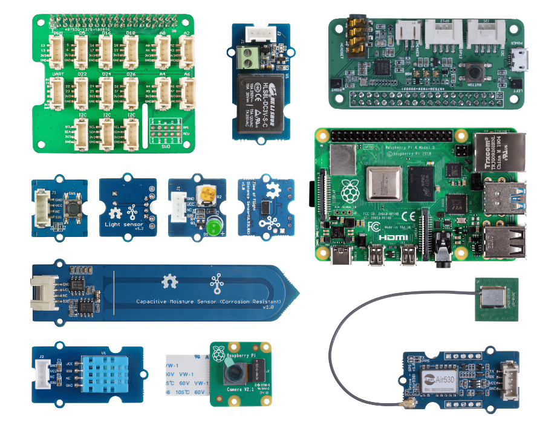

<!--
CO_OP_TRANSLATOR_METADATA:
{
  "original_hash": "3dce18fab38adf93ff30b8c221b1eec5",
  "translation_date": "2025-08-28T02:33:11+00:00",
  "source_file": "hardware.md",
  "language_code": "tr"
}
-->
# Donanım

IoT'deki **T**, **Nesneler** anlamına gelir ve çevremizdeki dünyayla etkileşimde bulunan cihazları ifade eder. Her proje, öğrenciler ve hobi meraklıları için erişilebilir olan gerçek dünya donanımına dayanmaktadır. Kişisel tercihlere, programlama dili bilgisine veya tercihlerine, öğrenme hedeflerine ve erişilebilirliğe bağlı olarak kullanabileceğimiz iki IoT donanım seçeneğimiz var. Ayrıca, donanıma erişimi olmayanlar veya satın almadan önce daha fazla bilgi edinmek isteyenler için bir 'sanal donanım' versiyonu da sağladık.

> 💁 Ödevleri tamamlamak için herhangi bir IoT donanımı satın almanıza gerek yok. Her şeyi sanal IoT donanımı kullanarak yapabilirsiniz.

Fiziksel donanım seçenekleri Arduino veya Raspberry Pi'dir. Her platformun kendine özgü avantajları ve dezavantajları vardır ve bunlar ilk derslerden birinde ele alınır. Henüz bir donanım platformu seçmediyseniz, hangi donanım platformunu öğrenmekle ilgilendiğinize karar vermek için [ilk projenin ikinci dersini](./1-getting-started/lessons/2-deeper-dive/README.md) inceleyebilirsiniz.

Belirli donanım, derslerin ve ödevlerin karmaşıklığını azaltmak için seçilmiştir. Diğer donanımlar çalışabilir olsa da, ek donanım olmadan cihazınızda tüm ödevlerin destekleneceğini garanti edemeyiz. Örneğin, birçok Arduino cihazında bulut bağlantısı için gerekli olan WiFi bulunmaz - Wio terminali, WiFi'nin yerleşik olması nedeniyle seçilmiştir.

Ayrıca, toprak veya bir saksı bitkisi ve meyve veya sebze gibi birkaç teknik olmayan öğeye ihtiyacınız olacak.

## Kitleri Satın Alın

Seeed Studios, tüm donanımı kolayca satın alınabilir kitler olarak sunma konusunda çok nazik davrandı:

### Arduino - Wio Terminal

**[Seeed ve Microsoft ile Başlangıç için IoT - Wio Terminal Başlangıç Kiti](https://www.seeedstudio.com/IoT-for-beginners-with-Seeed-and-Microsoft-Wio-Terminal-Starter-Kit-p-5006.html)**

### Raspberry Pi

**[Seeed ve Microsoft ile Başlangıç için IoT - Raspberry Pi 4 Başlangıç Kiti](https://www.seeedstudio.com/IoT-for-beginners-with-Seeed-and-Microsoft-Raspberry-Pi-Starter-Kit-p-5004.html)**

## Arduino

Arduino için tüm cihaz kodu C++ dilinde yazılmıştır. Tüm ödevleri tamamlamak için aşağıdakilere ihtiyacınız olacak:

### Arduino donanımı

* [Wio Terminal](https://www.seeedstudio.com/Wio-Terminal-p-4509.html)
* *Opsiyonel* - USB-C kablosu veya USB-A'dan USB-C'ye adaptör. Wio terminalinde bir USB-C portu bulunur ve USB-C'den USB-A'ya bir kablo ile gelir. Bilgisayarınızda veya Mac'inizde yalnızca USB-C portları varsa, bir USB-C kablosuna veya USB-A'dan USB-C'ye adaptöre ihtiyacınız olacak.

### Arduino'ya özgü sensörler ve aktüatörler

Bunlar, Wio terminal Arduino cihazını kullanmaya özgüdür ve Raspberry Pi kullanımı için geçerli değildir.

* [ArduCam Mini 2MP Plus - OV2640](https://www.arducam.com/product/arducam-2mp-spi-camera-b0067-arduino/)
* [ReSpeaker 2-Mics Pi HAT](https://www.seeedstudio.com/ReSpeaker-2-Mics-Pi-HAT.html)
* [Breadboard Jumper Kabloları](https://www.seeedstudio.com/Breadboard-Jumper-Wire-Pack-241mm-200mm-160mm-117m-p-234.html)
* Kulaklık veya 3.5mm jaklı başka bir hoparlör, ya da JST hoparlör gibi:
  * [Mono Kapalı Hoparlör - 2W 6 Ohm](https://www.seeedstudio.com/Mono-Enclosed-Speaker-2W-6-Ohm-p-2832.html)
* 16GB veya daha az kapasiteli microSD Kart, bilgisayarınızda dahili bir SD kart okuyucu yoksa bir bağlayıcı ile birlikte. **NOT** - Wio Terminal yalnızca 16GB'a kadar SD kartları destekler, daha yüksek kapasiteleri desteklemez.

## Raspberry Pi

Raspberry Pi için tüm cihaz kodu Python dilinde yazılmıştır. Tüm ödevleri tamamlamak için aşağıdakilere ihtiyacınız olacak:

### Raspberry Pi donanımı

* [Raspberry Pi](https://www.raspberrypi.org/products/raspberry-pi-4-model-b/)
  > 💁 Bu derslerdeki ödevlerle Pi 2B ve üzeri versiyonlar çalışmalıdır. VS Code'u doğrudan Pi üzerinde çalıştırmayı planlıyorsanız, 2GB veya daha fazla RAM'e sahip bir Pi 4 gereklidir. Pi'ye uzaktan erişecekseniz, herhangi bir Pi 2B ve üzeri versiyon çalışacaktır.
* microSD Kart (Raspberry Pi kitleri microSD Kart ile birlikte gelebilir), bilgisayarınızda dahili bir SD kart okuyucu yoksa bir bağlayıcı ile birlikte.
* USB güç kaynağı (Raspberry Pi 4 kitleri güç kaynağı ile birlikte gelebilir). Raspberry Pi 4 kullanıyorsanız USB-C güç kaynağına, önceki cihazlar için ise micro-USB güç kaynağına ihtiyacınız var.

### Raspberry Pi'ye özgü sensörler ve aktüatörler

Bunlar, Raspberry Pi kullanmaya özgüdür ve Arduino cihazı için geçerli değildir.

* [Grove Pi tabanlı hat](https://www.seeedstudio.com/Grove-Base-Hat-for-Raspberry-Pi.html)
* [Raspberry Pi Kamera modülü](https://www.raspberrypi.org/products/camera-module-v2/)
* Mikrofon ve hoparlör:

  Aşağıdakilerden birini (veya eşdeğerini) kullanabilirsiniz:
  * Herhangi bir USB mikrofon ve USB hoparlör, veya 3.5mm jak kablosu olan bir hoparlör, ya da Raspberry Pi bir monitör veya TV ile hoparlörlere bağlıysa HDMI ses çıkışı
  * Dahili mikrofonlu herhangi bir USB kulaklık
  * [ReSpeaker 2-Mics Pi HAT](https://www.seeedstudio.com/ReSpeaker-2-Mics-Pi-HAT.html) ile
    * Kulaklık veya 3.5mm jaklı başka bir hoparlör, ya da JST hoparlör gibi:
    * [Mono Kapalı Hoparlör - 2W 6 Ohm](https://www.seeedstudio.com/Mono-Enclosed-Speaker-2W-6-Ohm-p-2832.html)
  * [USB Speakerphone](https://www.amazon.com/USB-Speakerphone-Conference-Business-Microphones/dp/B07Q3D7F8S/ref=sr_1_1?dchild=1&keywords=m0&qid=1614647389&sr=8-1)
* [Grove Işık sensörü](https://www.seeedstudio.com/Grove-Light-Sensor-v1-2-LS06-S-phototransistor.html)
* [Grove düğme](https://www.seeedstudio.com/Grove-Button.html)

## Sensörler ve aktüatörler

Gerekli sensörlerin ve aktüatörlerin çoğu hem Arduino hem de Raspberry Pi öğrenme yollarında kullanılır:

* [Grove LED](https://www.seeedstudio.com/Grove-LED-Pack-p-4364.html) x 2
* [Grove nem ve sıcaklık sensörü](https://www.seeedstudio.com/Grove-Temperature-Humidity-Sensor-DHT11.html)
* [Grove kapasitif toprak nem sensörü](https://www.seeedstudio.com/Grove-Capacitive-Moisture-Sensor-Corrosion-Resistant.html)
* [Grove röle](https://www.seeedstudio.com/Grove-Relay.html)
* [Grove GPS (Air530)](https://www.seeedstudio.com/Grove-GPS-Air530-p-4584.html)
* [Grove Uçuş Mesafesi Sensörü](https://www.seeedstudio.com/Grove-Time-of-Flight-Distance-Sensor-VL53L0X.html)

## Opsiyonel donanım

Otomatik sulama dersleri bir röle kullanarak çalışır. İsteğe bağlı olarak, bu röleyi aşağıdaki donanımları kullanarak USB ile çalışan bir su pompasına bağlayabilirsiniz.

* [6V su pompası](https://www.seeedstudio.com/6V-Mini-Water-Pump-p-1945.html)
* [USB terminali](https://www.adafruit.com/product/3628)
* Silikon borular
* Kırmızı ve siyah kablolar
* Küçük düz tornavida

## Sanal donanım

Sanal donanım yolu, Python'da uygulanmış sensörler ve aktüatörler için simülatörler sağlayacaktır. Donanım erişiminize bağlı olarak, bunu normal geliştirme cihazınızda (örneğin Mac, PC) çalıştırabilir veya Raspberry Pi üzerinde çalıştırarak yalnızca sahip olmadığınız donanımı simüle edebilirsiniz. Örneğin, Raspberry Pi kameranız varsa ancak Grove sensörleriniz yoksa, sanal cihaz kodunu Pi'nizde çalıştırabilir ve Grove sensörlerini simüle edebilir, ancak fiziksel kamerayı kullanabilirsiniz.

Sanal donanım, [CounterFit projesini](https://github.com/CounterFit-IoT/CounterFit) kullanacaktır.

Bu dersleri tamamlamak için bir web kamerası, mikrofon ve hoparlör veya kulaklık gibi bir ses çıkışına ihtiyacınız olacak. Bunlar dahili veya harici olabilir ve işletim sisteminizle çalışacak şekilde yapılandırılmalı ve tüm uygulamalar tarafından kullanılabilir olmalıdır.

---

**Feragatname**:  
Bu belge, AI çeviri hizmeti [Co-op Translator](https://github.com/Azure/co-op-translator) kullanılarak çevrilmiştir. Doğruluk için çaba göstersek de, otomatik çevirilerin hata veya yanlışlık içerebileceğini lütfen unutmayın. Belgenin orijinal dili, yetkili kaynak olarak kabul edilmelidir. Kritik bilgiler için profesyonel insan çevirisi önerilir. Bu çevirinin kullanımından kaynaklanan yanlış anlamalar veya yanlış yorumlamalardan sorumlu değiliz.