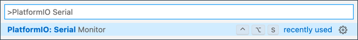

<!--
CO_OP_TRANSLATOR_METADATA:
{
  "original_hash": "a4f0c166010e31fd7b6ca20bc88dec6d",
  "translation_date": "2025-08-24T23:38:36+00:00",
  "source_file": "1-getting-started/lessons/1-introduction-to-iot/wio-terminal.md",
  "language_code": "tw"
}
-->
# Wio Terminal

[Seeed Studios 的 Wio Terminal](https://www.seeedstudio.com/Wio-Terminal-p-4509.html) 是一款兼容 Arduino 的微控制器，內建 WiFi 以及一些感測器和執行器，並且可以透過名為 [Grove](https://www.seeedstudio.com/category/Grove-c-1003.html) 的硬體生態系統添加更多感測器和執行器。


## 設置

要使用 Wio Terminal，您需要在電腦上安裝一些免費軟體。此外，在連接 WiFi 之前，您需要更新 Wio Terminal 的韌體。

### 任務 - 設置

安裝所需的軟體並更新韌體。

1. 安裝 Visual Studio Code (VS Code)。這是您將用來編寫 C/C++ 裝置程式碼的編輯器。請參考 [VS Code 文件](https://code.visualstudio.com?WT.mc_id=academic-17441-jabenn) 了解如何安裝 VS Code。

    > 💁 另一個流行的 Arduino 開發 IDE 是 [Arduino IDE](https://www.arduino.cc/en/software)。如果您已熟悉此工具，則可以使用它代替 VS Code 和 PlatformIO，但課程將基於使用 VS Code 的指導。

1. 安裝 VS Code 的 PlatformIO 擴展。這是 VS Code 的一個擴展，支持用 C/C++ 編程微控制器。請參考 [PlatformIO 擴展文件](https://marketplace.visualstudio.com/items?WT.mc_id=academic-17441-jabenn&itemName=platformio.platformio-ide) 了解如何在 VS Code 中安裝此擴展。此擴展依賴於 Microsoft C/C++ 擴展來處理 C 和 C++ 程式碼，安裝 PlatformIO 時會自動安裝 C/C++ 擴展。

1. 將 Wio Terminal 連接到您的電腦。Wio Terminal 底部有一個 USB-C 端口，需要連接到電腦上的 USB 端口。Wio Terminal 附帶 USB-C 至 USB-A 線纜，但如果您的電腦只有 USB-C 端口，則需要 USB-C 線纜或 USB-A 至 USB-C 轉接器。

1. 按照 [Wio Terminal Wiki WiFi 概述文件](https://wiki.seeedstudio.com/Wio-Terminal-Network-Overview/) 中的指導設置 Wio Terminal 並更新韌體。

## Hello World

在開始學習新的程式語言或技術時，通常會創建一個 "Hello World" 應用程式——一個小型應用程式，輸出類似 `"Hello World"` 的文字，以確認所有工具已正確配置。

Wio Terminal 的 Hello World 應用程式將確保您已正確安裝 Visual Studio Code 並使用 PlatformIO 設置微控制器開發環境。

### 創建 PlatformIO 專案

第一步是使用 PlatformIO 創建一個新的專案，並配置為 Wio Terminal。

#### 任務 - 創建 PlatformIO 專案

創建 PlatformIO 專案。

1. 將 Wio Terminal 連接到您的電腦

1. 啟動 VS Code

1. PlatformIO 圖標將顯示在側邊菜單欄：

    

    選擇此菜單項，然後選擇 *PIO Home -> Open*

    

1. 在歡迎畫面中，選擇 **+ New Project** 按鈕

    

1. 在 *Project Wizard* 中配置專案：

    1. 將專案命名為 `nightlight`

    1. 在 *Board* 下拉選單中輸入 `WIO` 以篩選板子，並選擇 *Seeeduino Wio Terminal*

    1. 保持 *Framework* 為 *Arduino*

    1. 可以保持 *Use default location* 勾選，或者取消勾選並選擇專案位置

    1. 選擇 **Finish** 按鈕

    

    PlatformIO 將下載所需的組件以編譯 Wio Terminal 的程式碼並創建您的專案。這可能需要幾分鐘。

### 探索 PlatformIO 專案

VS Code 的資源管理器將顯示由 PlatformIO 向導創建的多個檔案和資料夾。

#### 資料夾

* `.pio` - 此資料夾包含 PlatformIO 所需的臨時數據，例如庫或編譯的程式碼。如果刪除，它會自動重新創建，並且如果您在 GitHub 等網站上分享專案，無需將其添加到源代碼控制中。
* `.vscode` - 此資料夾包含 PlatformIO 和 VS Code 使用的配置。如果刪除，它會自動重新創建，並且如果您在 GitHub 等網站上分享專案，無需將其添加到源代碼控制中。
* `include` - 此資料夾用於添加額外庫時需要的外部標頭檔案。在這些課程中，您不會使用此資料夾。
* `lib` - 此資料夾用於您希望從程式碼中調用的外部庫。在這些課程中，您不會使用此資料夾。
* `src` - 此資料夾包含應用程式的主要源代碼。最初，它將包含一個檔案 - `main.cpp`。
* `test` - 此資料夾是您放置程式碼單元測試的地方。

#### 檔案

* `main.cpp` - 此檔案位於 `src` 資料夾中，包含應用程式的入口點。打開此檔案，您將看到以下程式碼：

    ```cpp
    #include <Arduino.h>
    
    void setup() {
      // put your setup code here, to run once:
    }
    
    void loop() {
      // put your main code here, to run repeatedly:
    }
    ```

    當裝置啟動時，Arduino 框架將執行一次 `setup` 函數，然後重複執行 `loop` 函數，直到裝置關閉。

* `.gitignore` - 此檔案列出了在將程式碼添加到 git 源代碼控制時需要忽略的檔案和資料夾，例如上傳到 GitHub 的存儲庫。

* `platformio.ini` - 此檔案包含裝置和應用程式的配置。打開此檔案，您將看到以下程式碼：

    ```ini
    [env:seeed_wio_terminal]
    platform = atmelsam
    board = seeed_wio_terminal
    framework = arduino
    ```

    `[env:seeed_wio_terminal]` 部分包含 Wio Terminal 的配置。您可以有多個 `env` 部分，以便程式碼可以為多個板子編譯。

    其他值與專案向導中的配置匹配：

  * `platform = atmelsam` 定義 Wio Terminal 使用的硬體（基於 ATSAMD51 的微控制器）
  * `board = seeed_wio_terminal` 定義微控制器板的類型（Wio Terminal）
  * `framework = arduino` 定義此專案使用 Arduino 框架。

### 編寫 Hello World 應用程式

現在您可以開始編寫 Hello World 應用程式。

#### 任務 - 編寫 Hello World 應用程式

編寫 Hello World 應用程式。

1. 在 VS Code 中打開 `main.cpp` 檔案

1. 將程式碼更改為以下內容：

    ```cpp
    #include <Arduino.h>

    void setup()
    {
        Serial.begin(9600);

        while (!Serial)
            ; // Wait for Serial to be ready
    
        delay(1000);
    }
    
    void loop()
    {
        Serial.println("Hello World");
        delay(5000);
    }
    ```

    `setup` 函數初始化與串口的連接——在此情況下，是用於連接 Wio Terminal 到電腦的 USB 端口。參數 `9600` 是 [波特率](https://wikipedia.org/wiki/Symbol_rate)（也稱為符號率），即通過串口每秒傳輸的數據速度（以位為單位）。此設置表示每秒傳輸 9,600 位（0 和 1）的數據。然後它等待串口準備好。

    `loop` 函數將行 `Hello World!` 發送到串口，因此會發送 `Hello World!` 的字符以及一個換行符。然後它休眠 5,000 毫秒或 5 秒。`loop` 結束後，會再次執行，並且如此反覆執行，直到微控制器關閉。

1. 將 Wio Terminal 設置為上傳模式。每次上傳新程式碼到裝置時，您都需要執行此操作：

    1. 快速向下拉動電源開關兩次——每次都會彈回到開啟位置。

    1. 檢查 USB 端口右側的藍色狀態 LED。它應該在閃爍。

    [](https://youtu.be/LeKU_7zLRrQ)

    點擊上方圖片觀看操作影片。

1. 編譯並上傳程式碼到 Wio Terminal

    1. 打開 VS Code 命令面板

    1. 輸入 `PlatformIO Upload` 搜索上傳選項，並選擇 *PlatformIO: Upload*

        

        如果需要，PlatformIO 會在上傳之前自動編譯程式碼。

    1. 程式碼將被編譯並上傳到 Wio Terminal

        > 💁 如果您使用 macOS，可能會出現 *DISK NOT EJECTED PROPERLY* 的通知。這是因為 Wio Terminal 在閃存過程中會被掛載為磁碟，並在編譯程式碼寫入裝置時斷開連接。您可以忽略此通知。

    ⚠️ 如果出現上傳端口不可用的錯誤，首先確保 Wio Terminal 已連接到您的電腦，並通過屏幕左側的開關打開，並設置為上傳模式。底部的綠燈應該亮著，藍燈應該在閃爍。如果仍然出現錯誤，請再次快速向下拉動開關兩次，強制 Wio Terminal 進入上傳模式，然後重試上傳。

PlatformIO 有一個串口監視器，可以監視通過 USB 線纜從 Wio Terminal 發送的數據。這使您可以監視由 `Serial.println("Hello World");` 命令發送的數據。

1. 打開 VS Code 命令面板

1. 輸入 `PlatformIO Serial` 搜索串口監視器選項，並選擇 *PlatformIO: Serial Monitor*

    

    一個新的終端將打開，通過串口發送的數據將流入此終端：

    ```output
    > Executing task: platformio device monitor <
    
    --- Available filters and text transformations: colorize, debug, default, direct, hexlify, log2file, nocontrol, printable, send_on_enter, time
    --- More details at http://bit.ly/pio-monitor-filters
    --- Miniterm on /dev/cu.usbmodem101  9600,8,N,1 ---
    --- Quit: Ctrl+C | Menu: Ctrl+T | Help: Ctrl+T followed by Ctrl+H ---
    Hello World
    Hello World
    ```

    `Hello World` 每隔 5 秒會打印到串口監視器。

> 💁 您可以在 [code/wio-terminal](../../../../../1-getting-started/lessons/1-introduction-to-iot/code/wio-terminal) 資料夾中找到此程式碼。

😀 您的 'Hello World' 程式成功了！

**免責聲明**：  
本文件使用 AI 翻譯服務 [Co-op Translator](https://github.com/Azure/co-op-translator) 進行翻譯。雖然我們致力於提供準確的翻譯，但請注意，自動翻譯可能包含錯誤或不準確之處。原始文件的母語版本應被視為權威來源。對於關鍵資訊，建議尋求專業人工翻譯。我們對因使用此翻譯而引起的任何誤解或錯誤解釋不承擔責任。