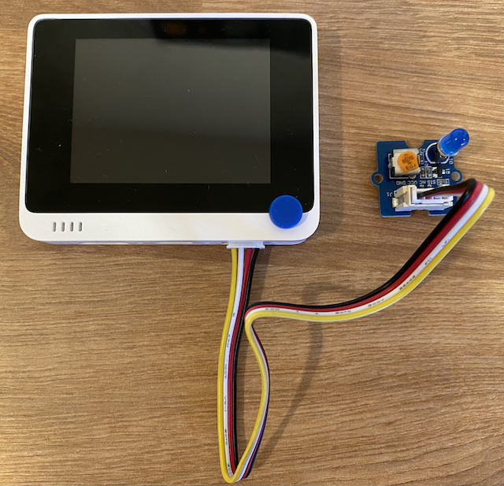

<!--
CO_OP_TRANSLATOR_METADATA:
{
  "original_hash": "db44083b4dc6fb06eac83c4f16448940",
  "translation_date": "2025-08-24T23:21:47+00:00",
  "source_file": "1-getting-started/lessons/3-sensors-and-actuators/wio-terminal-actuator.md",
  "language_code": "tw"
}
-->
# 建造夜燈 - Wio Terminal

在本課程中，您將為 Wio Terminal 添加一個 LED，並使用它來製作夜燈。

## 硬體

夜燈現在需要一個執行器。

執行器是一個 **LED**，即[發光二極管](https://wikipedia.org/wiki/Light-emitting_diode)，當電流通過時會發光。這是一個數位執行器，具有兩種狀態：開啟和關閉。傳送值 1 會開啟 LED，傳送值 0 則會關閉 LED。這是一個外部 Grove 執行器，需要連接到 Wio Terminal。

夜燈邏輯的偽代碼如下：

```output
Check the light level.
If the light is less than 300
    Turn the LED on
Otherwise
    Turn the LED off
```

### 連接 LED

Grove LED 是一個模組，包含多種 LED，您可以選擇喜歡的顏色。

#### 任務 - 連接 LED

連接 LED。


1. 選擇您喜歡的 LED，並將其腳插入 LED 模組上的兩個孔中。

    LED 是發光二極管，而二極管是一種只能單向導電的電子元件。這意味著 LED 必須以正確的方向連接，否則無法工作。

    LED 的一隻腳是正極引腳，另一隻是負極引腳。LED 並非完全圓形，其中一側稍微平坦一些。稍微平坦的一側是負極引腳。當您將 LED 連接到模組時，請確保圓形一側的引腳連接到模組外側標記為 **+** 的插座，而平坦一側的引腳連接到模組中間較近的插座。

1. LED 模組有一個旋轉按鈕，可以用來調節亮度。使用小型十字螺絲刀將其逆時針旋轉到最亮。

1. 將 Grove 電纜的一端插入 LED 模組上的插座。電纜只能以一種方向插入。

1. 在 Wio Terminal 未連接到電腦或其他電源的情況下，將 Grove 電纜的另一端連接到 Wio Terminal 屏幕右側的 Grove 插座。這是距離電源按鈕最遠的插座。

    > 💁 右側的 Grove 插座可用於類比或數位感測器和執行器。左側插座僅用於 I2C 和數位感測器及執行器。



## 程式設計夜燈

現在可以使用內建的光感測器和 Grove LED 來程式設計夜燈。

### 任務 - 程式設計夜燈

程式設計夜燈。

1. 在 VS Code 中打開您在本作業前一部分中建立的夜燈專案。

1. 在 `setup` 函數的底部添加以下一行：

    ```cpp
    pinMode(D0, OUTPUT);
    ```

    這一行配置了用於通過 Grove 端口與 LED 通訊的引腳。

    `D0` 引腳是右側 Grove 插座的數位引腳。此引腳被設置為 `OUTPUT`，表示它連接到執行器，並且數據將被寫入該引腳。

1. 在 `loop` 函數中的 `delay` 之前立即添加以下程式碼：

    ```cpp
    if (light < 300)
    {
        digitalWrite(D0, HIGH);
    }
    else
    {
        digitalWrite(D0, LOW);
    }
    ```

    此程式碼檢查 `light` 值。如果該值小於 300，則向 `D0` 數位引腳傳送 `HIGH` 值。此 `HIGH` 值為 1，開啟 LED。如果光線值大於或等於 300，則向引腳傳送 `LOW` 值 0，關閉 LED。

    > 💁 當向執行器傳送數位值時，LOW 值為 0v，HIGH 值為設備的最大電壓。對於 Wio Terminal，HIGH 電壓為 3.3V。

1. 將 Wio Terminal 重新連接到您的電腦，並像之前一樣上傳新程式碼。

1. 連接 Serial Monitor。光線值將輸出到終端。

    ```output
    > Executing task: platformio device monitor <

    --- Available filters and text transformations: colorize, debug, default, direct, hexlify, log2file, nocontrol, printable, send_on_enter, time
    --- More details at http://bit.ly/pio-monitor-filters
    --- Miniterm on /dev/cu.usbmodem101  9600,8,N,1 ---
    --- Quit: Ctrl+C | Menu: Ctrl+T | Help: Ctrl+T followed by Ctrl+H ---
    Light value: 4
    Light value: 5
    Light value: 4
    Light value: 158
    Light value: 343
    Light value: 348
    Light value: 344
    ```

1. 遮住並移開光感測器。注意當光線值小於或等於 300 時，LED 會亮起；當光線值大於 300 時，LED 會熄滅。


> 💁 您可以在 [code-actuator/wio-terminal](../../../../../1-getting-started/lessons/3-sensors-and-actuators/code-actuator/wio-terminal) 資料夾中找到此程式碼。

😀 您的夜燈程式成功了！

**免責聲明**：  
本文件使用 AI 翻譯服務 [Co-op Translator](https://github.com/Azure/co-op-translator) 進行翻譯。我們致力於提供準確的翻譯，但請注意，自動翻譯可能包含錯誤或不準確之處。應以原文文件作為權威來源。對於關鍵資訊，建議尋求專業人工翻譯。我們對因使用此翻譯而引起的任何誤解或錯誤解釋概不負責。