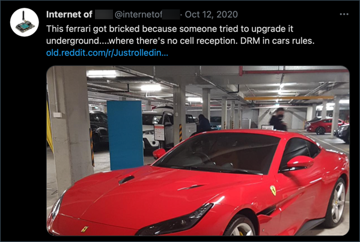

<!--
CO_OP_TRANSLATOR_METADATA:
{
  "original_hash": "71b5040e0b3472f1c0949c9b55f224c0",
  "translation_date": "2025-08-24T23:02:27+00:00",
  "source_file": "1-getting-started/lessons/4-connect-internet/README.md",
  "language_code": "tw"
}
-->
# 將您的設備連接到互聯網


> 手繪筆記由 [Nitya Narasimhan](https://github.com/nitya) 提供。點擊圖片查看更大版本。

本課程是 [Microsoft Reactor](https://developer.microsoft.com/reactor/?WT.mc_id=academic-17441-jabenn) 的 [Hello IoT 系列](https://youtube.com/playlist?list=PLmsFUfdnGr3xRts0TIwyaHyQuHaNQcb6-) 的一部分。課程分為兩個視頻進行教學——一個1小時的課程和一個1小時的辦公時間，深入探討課程的部分內容並回答問題。

[](https://youtu.be/O4dd172mZhs)

[](https://youtu.be/j-cVCzRDE2Q)

> 🎥 點擊上方圖片觀看視頻

## 課前測驗

[課前測驗](https://black-meadow-040d15503.1.azurestaticapps.net/quiz/7)

## 簡介

IoT 中的 **I** 代表 **Internet**（互聯網）——雲端連接和服務使 IoT 設備的許多功能成為可能，從收集連接到設備的傳感器的測量數據，到發送消息控制執行器。IoT 設備通常使用標準通信協議連接到單一的雲端 IoT 服務，而該服務則連接到您的 IoT 應用的其他部分，例如 AI 服務，用於根據數據做出智能決策，或網頁應用，用於控制或報告。

> 🎓 從傳感器收集並發送到雲端的數據稱為遙測數據。

IoT 設備可以接收來自雲端的消息。這些消息通常包含命令——即指示執行某些操作的指令，無論是內部操作（例如重啟或更新固件），還是使用執行器（例如打開燈光）。

本課程介紹了 IoT 設備用於連接雲端的一些通信協議，以及它們可能發送或接收的數據類型。您還將親自操作，為您的夜燈添加互聯網控制，將 LED 控制邏輯移至本地運行的“服務器”代碼。

在本課程中，我們將涵蓋：

* [通信協議](../../../../../1-getting-started/lessons/4-connect-internet)
* [消息隊列遙測傳輸（MQTT）](../../../../../1-getting-started/lessons/4-connect-internet)
* [遙測數據](../../../../../1-getting-started/lessons/4-connect-internet)
* [命令](../../../../../1-getting-started/lessons/4-connect-internet)

## 通信協議

IoT 設備用於與互聯網通信的流行通信協議有很多。最流行的是基於某種代理的發布/訂閱消息。IoT 設備連接到代理並發布遙測數據並訂閱命令。雲端服務也連接到代理，訂閱所有遙測消息並發布命令，無論是針對特定設備，還是針對設備組。


MQTT 是 IoT 設備最流行的通信協議，本課程將涵蓋它。其他協議包括 AMQP 和 HTTP/HTTPS。

## 消息隊列遙測傳輸（MQTT）

[MQTT](http://mqtt.org) 是一種輕量級的開放標準消息協議，可在設備之間傳遞消息。它於1999年設計用於監控石油管道，15年後由 IBM 作為開放標準發布。

MQTT 有一個單一的代理和多個客戶端。所有客戶端都連接到代理，代理根據需要將消息路由到相關客戶端。消息是通過命名主題進行路由，而不是直接發送到個別客戶端。客戶端可以發布到某個主題，任何訂閱該主題的客戶端都會接收到消息。


✅ 做些研究。如果您有大量 IoT 設備，如何確保您的 MQTT 代理能夠處理所有消息？

### 將您的 IoT 設備連接到 MQTT

為您的夜燈添加互聯網控制的第一步是將其連接到 MQTT 代理。

#### 任務

將您的設備連接到 MQTT 代理。

在本課程的這部分，您將把 IoT 夜燈連接到互聯網，以便遠程控制它。在本課程的後續部分，您的 IoT 設備將通過 MQTT 向公共 MQTT 代理發送光線水平的遙測消息，該消息將由您編寫的一些服務器代碼接收。此代碼將檢查光線水平並向設備發送命令消息，指示其打開或關閉 LED。

這種設置的實際應用場景可能是從多個光線傳感器收集數據後再決定是否打開燈光，例如在有大量燈光的地方，如體育場。這樣可以避免僅因一個傳感器被雲層或鳥遮擋而打開燈光，而其他傳感器檢測到足夠的光線。

✅ 還有哪些情況需要在發送命令之前評估多個傳感器的數據？

為了避免在本次作業中設置 MQTT 代理的複雜性，您可以使用運行 [Eclipse Mosquitto](https://www.mosquitto.org) 的公共測試服務器，這是一個開源的 MQTT 代理。此測試代理可在 [test.mosquitto.org](https://test.mosquitto.org) 上公開使用，且不需要設置帳戶，是測試 MQTT 客戶端和服務器的絕佳工具。

> 💁 此測試代理是公開且不安全的。任何人都可能在監聽您發布的內容，因此不應用於需要保密的數據。


按照以下相關步驟將您的設備連接到 MQTT 代理：

* [Arduino - Wio Terminal](wio-terminal-mqtt.md)
* [單板計算機 - Raspberry Pi/虛擬 IoT 設備](single-board-computer-mqtt.md)

### 深入了解 MQTT

主題可以有層次結構，客戶端可以使用通配符訂閱層次結構中的不同級別。例如，您可以將溫度遙測消息發送到 `/telemetry/temperature` 主題，將濕度消息發送到 `/telemetry/humidity` 主題，然後在您的雲端應用中訂閱 `/telemetry/*` 主題以接收溫度和濕度的遙測消息。

消息可以設置服務質量（QoS），以確定消息接收的保證程度。

* 最多一次 - 消息僅發送一次，客戶端和代理不採取額外步驟確認交付（即發送後不再關注）。
* 至少一次 - 發送方多次重試消息，直到收到確認（即確認交付）。
* 僅一次 - 發送方和接收方進行兩級握手，以確保僅接收到一份消息（即保證交付）。

✅ 哪些情況可能需要保證交付的消息，而不是發送後不再關注的消息？

雖然名稱中有“消息隊列”（MQTT 的首字母縮寫），但它實際上並不支持消息隊列。這意味著如果客戶端斷開連接，然後重新連接，它不會接收到斷開期間發送的消息，除非這些消息已通過 QoS 過程開始處理。消息可以設置保留標誌。如果設置了此標誌，MQTT 代理將存儲在該主題上發送的最後一條消息，並將其發送給後來訂閱該主題的任何客戶端。這樣，客戶端將始終獲得最新消息。

MQTT 還支持保持連接功能，在消息之間的長時間間隔期間檢查連接是否仍然有效。

> 🦟 [Eclipse Foundation 的 Mosquitto](https://mosquitto.org) 提供了一個免費的 MQTT 代理，您可以自行運行以實驗 MQTT，還有一個公共 MQTT 代理可供您測試代碼，托管於 [test.mosquitto.org](https://test.mosquitto.org)。

MQTT 連接可以是公開和開放的，也可以通過用戶名和密碼或證書進行加密和安全保護。

> 💁 MQTT 通過 TCP/IP 進行通信，與 HTTP 使用相同的底層網絡協議，但使用不同的端口。您還可以通過 Websockets 使用 MQTT 與在瀏覽器中運行的網頁應用通信，或者在防火牆或其他網絡規則阻止標準 MQTT 連接的情況下使用。

## 遙測數據

遙測一詞源於希臘語，意為遠程測量。遙測是從傳感器收集數據並將其發送到雲端的行為。

> 💁 最早的遙測設備之一於1874年在法國發明，通過物理電線將蒙特布朗的即時天氣和積雪深度數據發送到巴黎。當時尚未有無線技術。

讓我們回顧一下課程1中的智能溫控器示例。


溫控器具有溫度傳感器以收集遙測數據。它很可能內置一個溫度傳感器，並可能通過無線協議（如 [藍牙低功耗](https://wikipedia.org/wiki/Bluetooth_Low_Energy) (BLE)）連接到多個外部溫度傳感器。

它可能發送的遙測數據示例如下：

| 名稱 | 值 | 描述 |
| ---- | ----- | ----------- |
| `thermostat_temperature` | 18°C | 由溫控器內置溫度傳感器測量的溫度 |
| `livingroom_temperature` | 19°C | 由遠程溫度傳感器測量的溫度，該傳感器被命名為 `livingroom` 以標識其所在房間 |
| `bedroom_temperature` | 21°C | 由遠程溫度傳感器測量的溫度，該傳感器被命名為 `bedroom` 以標識其所在房間 |

雲端服務可以使用這些遙測數據來決定發送哪些命令以控制加熱。

### 從您的 IoT 設備發送遙測數據

為您的夜燈添加互聯網控制的下一步是將光線水平的遙測數據發送到 MQTT 代理的遙測主題。

#### 任務 - 從您的 IoT 設備發送遙測數據

將光線水平的遙測數據發送到 MQTT 代理。

數據以 JSON 編碼——JSON 是 JavaScript Object Notation 的縮寫，是一種使用鍵/值對以文本形式編碼數據的標準。

✅ 如果您之前未接觸過 JSON，可以在 [JSON.org 文檔](https://www.json.org/) 中了解更多。

按照以下相關步驟從您的設備向 MQTT 代理發送遙測數據：

* [Arduino - Wio Terminal](wio-terminal-telemetry.md)
* [單板計算機 - Raspberry Pi/虛擬 IoT 設備](single-board-computer-telemetry.md)

### 從 MQTT 代理接收遙測數據

如果沒有接收端，發送遙測數據就毫無意義。光線水平的遙測數據需要有接收端來處理數據。該“服務器”代碼是您將部署到雲端服務的一部分，用於更大的 IoT 應用，但在這裡，您將在本地計算機上運行此代碼（或者如果您直接在 Raspberry Pi 上編碼，則在 Pi 上運行）。服務器代碼由一個 Python 應用組成，該應用通過 MQTT 接收光線水平的遙測消息。在本課程的後續部分，您將使其回復一條命令消息，指示 LED 打開或關閉。

✅ 做些研究：如果沒有接收端，MQTT 消息會發生什麼？

#### 安裝 Python 和 VS Code

如果您本地尚未安裝 Python 和 VS Code，您需要安裝它們以編寫服務器代碼。如果您使用虛擬 IoT 設備，或者在 Raspberry Pi 上工作，則可以跳過此步驟，因為您應該已經安裝並配置了它們。

##### 任務 - 安裝 Python 和 VS Code

安裝 Python 和 VS Code。

1. 安裝 Python。請參考 [Python 下載頁面](https://www.python.org/downloads/) 以獲取安裝最新版本 Python 的說明。

1. 安裝 Visual Studio Code (VS Code)。這是您將用來用 Python 編寫虛擬設備代碼的編輯器。請參考 [VS Code 文檔](https://code.visualstudio.com?WT.mc_id=academic-17441-jabenn) 以獲取安裝 VS Code 的說明。
💁 您可以自由選擇任何您喜歡的 Python IDE 或編輯器來完成這些課程，但課程中的指導將基於使用 VS Code。
1. 安裝 VS Code 的 Pylance 擴充套件。這是一個為 VS Code 提供 Python 語言支援的擴充套件。請參考 [Pylance 擴充套件文件](https://marketplace.visualstudio.com/items?WT.mc_id=academic-17441-jabenn&itemName=ms-python.vscode-pylance) 以了解如何在 VS Code 中安裝此擴充套件。

#### 配置 Python 虛擬環境

Python 的一個強大功能是能夠安裝 [pip 套件](https://pypi.org)——這些是由其他人撰寫並發布到網路上的程式碼套件。你可以使用一個指令將 pip 套件安裝到你的電腦上，然後在程式碼中使用該套件。接下來你將使用 pip 安裝一個用於 MQTT 通訊的套件。

預設情況下，當你安裝一個套件時，它會在你的電腦上全域可用，這可能會導致套件版本的問題，例如某個應用程式依賴於某個版本的套件，而當你為另一個應用程式安裝新版本時可能會導致問題。為了解決這個問題，你可以使用 [Python 虛擬環境](https://docs.python.org/3/library/venv.html)，它本質上是 Python 的一個副本，存放在一個專用的資料夾中，當你安裝 pip 套件時，它們只會安裝到該資料夾中。

##### 任務 - 配置 Python 虛擬環境

配置 Python 虛擬環境並安裝 MQTT 的 pip 套件。

1. 從你的終端或命令列，在你選擇的位置執行以下指令以建立並進入一個新目錄：

    ```sh
    mkdir nightlight-server
    cd nightlight-server
    ```

1. 現在執行以下指令，在 `.venv` 資料夾中建立虛擬環境：

    ```sh
    python3 -m venv .venv
    ```

    > 💁 你需要明確呼叫 `python3` 來建立虛擬環境，以防你的系統同時安裝了 Python 2 和 Python 3（最新版本）。如果安裝了 Python 2，呼叫 `python` 可能會使用 Python 2 而不是 Python 3。

1. 啟動虛擬環境：

    * 在 Windows 上：
        * 如果你使用的是命令提示字元，或透過 Windows Terminal 使用命令提示字元，執行：

            ```cmd
            .venv\Scripts\activate.bat
            ```

        * 如果你使用的是 PowerShell，執行：

            ```powershell
            .\.venv\Scripts\Activate.ps1
            ```

    * 在 macOS 或 Linux 上，執行：

        ```cmd
        source ./.venv/bin/activate
        ```

    > 💁 這些指令應該在你執行建立虛擬環境的指令的同一位置執行。你永遠不需要進入 `.venv` 資料夾，應該始終在建立虛擬環境的資料夾中執行啟動指令以及任何安裝套件或執行程式碼的指令。

1. 啟動虛擬環境後，預設的 `python` 指令將執行用於建立虛擬環境的 Python 版本。執行以下指令以檢查版本：

    ```sh
    python --version
    ```

    輸出將類似於以下內容：

    ```output
    (.venv) ➜  nightlight-server python --version
    Python 3.9.1
    ```

    > 💁 你的 Python 版本可能不同——只要是 3.6 或更高版本即可。如果不是，請刪除此資料夾，安裝更新版本的 Python，然後重試。

1. 執行以下指令以安裝 [Paho-MQTT](https://pypi.org/project/paho-mqtt/) 的 pip 套件，這是一個流行的 MQTT 庫。

    ```sh
    pip install paho-mqtt
    ```

    此 pip 套件僅會安裝在虛擬環境中，且在虛擬環境外部不可用。

#### 撰寫伺服器程式碼

現在可以使用 Python 撰寫伺服器程式碼。

##### 任務 - 撰寫伺服器程式碼

撰寫伺服器程式碼。

1. 從你的終端或命令列，在虛擬環境中執行以下指令以建立名為 `app.py` 的 Python 檔案：

    * 在 Windows 上執行：

        ```cmd
        type nul > app.py
        ```

    * 在 macOS 或 Linux 上執行：

        ```cmd
        touch app.py
        ```

1. 在 VS Code 中開啟當前資料夾：

    ```sh
    code .
    ```

1. 當 VS Code 啟動時，它將啟動 Python 虛擬環境。這會顯示在底部狀態列中：

    

1. 如果 VS Code Terminal 在 VS Code 啟動時已經在運行，它將不會啟動虛擬環境。最簡單的方式是使用 **Kill the active terminal instance** 按鈕關閉終端：

    

1. 通過選擇 *Terminal -> New Terminal* 或按下 `` CTRL+` `` 啟動新的 VS Code Terminal。新的終端將載入虛擬環境，啟動指令會顯示在終端中。虛擬環境的名稱（`.venv`）也會顯示在提示符中：

    ```output
    ➜  nightlight-server source .venv/bin/activate
    (.venv) ➜  nightlight 
    ```

1. 從 VS Code 的檔案瀏覽器中開啟 `app.py` 檔案，並加入以下程式碼：

    ```python
    import json
    import time
    
    import paho.mqtt.client as mqtt
    
    id = '<ID>'
    
    client_telemetry_topic = id + '/telemetry'
    client_name = id + 'nightlight_server'
    
    mqtt_client = mqtt.Client(client_name)
    mqtt_client.connect('test.mosquitto.org')
    
    mqtt_client.loop_start()
    
    def handle_telemetry(client, userdata, message):
        payload = json.loads(message.payload.decode())
        print("Message received:", payload)
    
    mqtt_client.subscribe(client_telemetry_topic)
    mqtt_client.on_message = handle_telemetry
    
    while True:
        time.sleep(2)
    ```

    將第 6 行的 `<ID>` 替換為你在建立裝置程式碼時使用的唯一 ID。

    ⚠️ 這 **必須** 是你在裝置上使用的相同 ID，否則伺服器程式碼將無法訂閱或發布到正確的主題。

    此程式碼建立了一個具有唯一名稱的 MQTT 客戶端，並連接到 *test.mosquitto.org* broker。接著它啟動了一個處理循環，該循環在背景執行緒中運行，監聽任何已訂閱主題的訊息。

    客戶端隨後訂閱了 telemetry 主題的訊息，並定義了一個函數，當接收到訊息時會被呼叫。當接收到 telemetry 訊息時，`handle_telemetry` 函數會被呼叫，並將接收到的訊息打印到控制台。

    最後，一個無限循環保持應用程式運行。MQTT 客戶端在背景執行緒中監聽訊息，並在主應用程式運行期間始終保持運行。

1. 從 VS Code 的終端執行以下指令以運行你的 Python 應用程式：

    ```sh
    python app.py
    ```

    應用程式將開始監聽來自 IoT 裝置的訊息。

1. 確保你的裝置正在運行並發送 telemetry 訊息。調整你的實體或虛擬裝置檢測的光線水平。接收到的訊息將打印到終端。

    ```output
    (.venv) ➜  nightlight-server python app.py
    Message received: {'light': 0}
    Message received: {'light': 400}
    ```

    nightlight 虛擬環境中的 app.py 檔案必須在運行，nightlight-server 虛擬環境中的 app.py 檔案才能接收到發送的訊息。

> 💁 你可以在 [code-server/server](../../../../../1-getting-started/lessons/4-connect-internet/code-server/server) 資料夾中找到此程式碼。

### 應該多久發送一次 telemetry？

關於 telemetry 的一個重要考量是應該多久測量並發送一次數據？答案是——視情況而定。如果頻繁測量，你可以更快地對測量變化做出反應，但這會消耗更多電力、更多頻寬、生成更多數據，並需要更多雲端資源來處理。你需要測量得足夠頻繁，但不能過於頻繁。

對於溫控器，每隔幾分鐘測量一次可能已經足夠，因為溫度不會頻繁變化。如果一天只測量一次，可能會導致在陽光明媚的白天因夜間溫度而加熱房屋；而如果每秒測量一次，則會生成數千個不必要的重複溫度測量，這會影響使用者的網速和頻寬（對於有限頻寬計劃的使用者來說是個問題），消耗更多電力，這對於像遠端感測器這樣的電池供電裝置可能是個問題，並增加提供者雲端計算資源的處理和存儲成本。

如果你在工廠中監控某台機器的數據，而該機器如果故障可能會造成災難性損害和數百萬美元的收入損失，那麼可能需要每秒多次測量。浪費頻寬總比錯過顯示機器需要停止並修理的 telemetry 更好。

> 💁 在這種情況下，你可能需要考慮使用邊緣裝置來先處理 telemetry，以減少對網路的依賴。

### 連線中斷

網路連線可能不穩定，停機是常見的情況。在這種情況下，IoT 裝置應該怎麼做——丟失數據，還是存儲數據直到連線恢復？答案同樣是視情況而定。

對於溫控器，數據可能可以丟失，因為一旦有新的溫度測量，舊的數據就不再重要。加熱系統不會在意 20 分鐘前的溫度是 20.5°C，如果現在的溫度是 19°C，那麼當前的溫度才是決定加熱是否開啟的關鍵。

對於機器，你可能需要保留數據，特別是如果這些數據用於趨勢分析。有些機器學習模型可以通過查看一段時間內的數據（例如過去一小時）來檢測數據流中的異常，並識別異常數據。這通常用於預測性維護，尋找可能即將發生故障的跡象，以便在故障發生前進行修理或更換。你可能希望機器的每一個 telemetry 都被發送，以便進行異常檢測，因此一旦 IoT 裝置重新連線，它將發送網路中斷期間生成的所有 telemetry。

IoT 裝置設計者還應考慮 IoT 裝置在網路中斷或因位置導致信號丟失時是否仍能使用。一個智慧溫控器應該能在無法將 telemetry 發送到雲端的情況下做出有限的決策來控制加熱。

[](https://twitter.com/internetofshit/status/1315736960082808832)

為了讓 MQTT 處理連線中斷，裝置和伺服器程式碼需要負責確保訊息的傳遞，例如要求所有發送的訊息都需要在回覆主題上收到回覆訊息，如果沒有收到回覆，則手動排隊以便稍後重播。

## 指令

指令是由雲端發送到裝置的訊息，指示它執行某些操作。大多數情況下，這涉及通過致動器提供某種輸出，但也可以是對裝置本身的指令，例如重新啟動或收集額外的 telemetry 並將其作為指令的回應返回。


溫控器可以接收到來自雲端的指令以開啟加熱。根據所有感測器的 telemetry 數據，如果雲端服務決定加熱應該開啟，它就會發送相關指令。

### 向 MQTT broker 發送指令

我們的網路控制夜燈的下一步是讓伺服器程式碼根據感測到的光線水平向 IoT 裝置發送指令以控制燈光。

1. 在 VS Code 中開啟伺服器程式碼

1. 在 `client_telemetry_topic` 宣告之後加入以下一行，定義要發送指令的主題：

    ```python
    server_command_topic = id + '/commands'
    ```

1. 在 `handle_telemetry` 函數的結尾加入以下程式碼：

    ```python
    command = { 'led_on' : payload['light'] < 300 }
    print("Sending message:", command)
    
    client.publish(server_command_topic, json.dumps(command))
    ```

    這會向指令主題發送一個 JSON 訊息，其中 `led_on` 的值根據光線是否小於 300 設定為 true 或 false。如果光線小於 300，則發送 true 以指示裝置開啟 LED。

1. 如之前一樣運行程式碼

1. 調整你的實體或虛擬裝置檢測的光線水平。接收到的訊息和發送的指令將顯示在終端中：

    ```output
    (.venv) ➜  nightlight-server python app.py
    Message received: {'light': 0}
    Sending message: {'led_on': True}
    Message received: {'light': 400}
    Sending message: {'led_on': False}
    ```

> 💁 telemetry 和指令分別在單一主題上發送。這意味著來自多個裝置的 telemetry 將出現在同一 telemetry 主題上，發送給多個裝置的指令將出現在同一指令主題上。如果你希望向特定裝置發送指令，可以使用多個主題，命名為唯一的裝置 ID，例如 `/commands/device1`、`/commands/device2`。這樣裝置可以只監聽針對該裝置的訊息。

> 💁 你可以在 [code-commands/server](../../../../../1-getting-started/lessons/4-connect-internet/code-commands/server) 資料夾中找到此程式碼。

### 在 IoT 裝置上處理指令

現在伺服器已經開始發送指令，你可以在 IoT 裝置上加入程式碼來處理指令並控制 LED。

按照以下相關步驟從 MQTT broker 監聽指令：

* [Arduino - Wio Terminal](wio-terminal-commands.md)
* [單板電腦 - Raspberry Pi/虛擬 IoT 裝置](single-board-computer-commands.md)

一旦程式碼撰寫完成並運行，嘗試改變光線水平。觀察伺服器和裝置的輸出，並在改變光線水平時觀察 LED。

### 連線中斷

如果雲端服務需要向離線的 IoT 裝置發送指令，應該怎麼做？答案同樣是視情況而定。

如果最新指令覆蓋了早期的指令，那麼早期的指令可能可以忽略。如果雲端服務發送了一個開啟加熱的指令，然後發送了一個關閉加熱的指令，那麼開啟指令可以忽略且不需要重新發送。

如果指令需要按順序處理，例如移動機器手臂向上，然後關閉抓手，那麼它們需要在連線恢復後按順序發送。

✅ 裝置或伺服器程式碼如何確保指令始終按順序通過 MQTT 發送並處理？

---

## 🚀 挑戰

在過去三節課的挑戰是列出你家中、學校或工作場所中所有的 IoT 裝置，並判斷它們是基於微控制器還是單板電腦，或者是兩者的混合，並思考它們使用了哪些感測器和致動器。
對於這些設備，思考它們可能正在發送或接收什麼消息。它們發送了哪些遙測數據？它們可能接收到哪些消息或命令？你認為它們的安全性如何？

## 課後測驗

[課後測驗](https://black-meadow-040d15503.1.azurestaticapps.net/quiz/8)

## 回顧與自學

在 [MQTT 維基百科頁面](https://wikipedia.org/wiki/MQTT)上閱讀更多關於 MQTT 的內容。

嘗試使用 [Mosquitto](https://www.mosquitto.org) 自行運行一個 MQTT broker，並從你的 IoT 設備和伺服器代碼連接到它。

> 💁 提示 - Mosquitto 預設不允許匿名連接（即無需使用者名稱和密碼進行連接），也不允許來自運行它的電腦外部的連接。
> 你可以使用 [`mosquitto.conf` 配置文件](https://www.mosquitto.org/man/mosquitto-conf-5.html)進行修正，內容如下：
>
> ```sh
> listener 1883 0.0.0.0
> allow_anonymous true
> ```

## 作業

[比較和對比 MQTT 與其他通信協議](assignment.md)

**免責聲明**：  
本文件使用 AI 翻譯服務 [Co-op Translator](https://github.com/Azure/co-op-translator) 進行翻譯。我們致力於提供準確的翻譯，但請注意，自動翻譯可能包含錯誤或不準確之處。應以原始語言的文件作為權威來源。對於關鍵資訊，建議尋求專業人工翻譯。我們對於因使用本翻譯而引起的任何誤解或錯誤解釋概不負責。