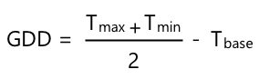

<!--
CO_OP_TRANSLATOR_METADATA:
{
  "original_hash": "d105b44deae539165855c976dcdeca99",
  "translation_date": "2025-08-24T21:58:06+00:00",
  "source_file": "2-farm/lessons/1-predict-plant-growth/README.md",
  "language_code": "tw"
}
-->
# 使用物聯網預測植物生長


> 手繪筆記由 [Nitya Narasimhan](https://github.com/nitya) 提供。點擊圖片查看更大版本。

## 課前測驗

[課前測驗](https://black-meadow-040d15503.1.azurestaticapps.net/quiz/9)

## 簡介

植物需要某些條件才能生長——水、二氧化碳、養分、光和熱。在本課程中，您將學習如何通過測量空氣溫度來計算植物的生長和成熟速度。

本課程將涵蓋以下內容：

* [數位農業](../../../../../2-farm/lessons/1-predict-plant-growth)
* [為什麼溫度對農業很重要？](../../../../../2-farm/lessons/1-predict-plant-growth)
* [測量環境溫度](../../../../../2-farm/lessons/1-predict-plant-growth)
* [生長度日 (GDD)](../../../../../2-farm/lessons/1-predict-plant-growth)
* [使用溫度感測器數據計算 GDD](../../../../../2-farm/lessons/1-predict-plant-growth)

## 數位農業

數位農業正在改變我們的耕作方式，通過工具來收集、存儲和分析農業數據。我們目前正處於世界經濟論壇所描述的“第四次工業革命”時期，而數位農業的興起被稱為“第四次農業革命”或“農業 4.0”。

> 🎓 數位農業這個術語還包括整個“農業價值鏈”，即從農場到餐桌的整個過程。這包括在食品運輸和加工過程中追蹤產品質量、倉儲和電子商務系統，甚至是拖拉機租賃應用程式！

這些變化使農民能夠提高產量，減少化肥和農藥的使用，並更有效地利用水資源。雖然這些技術主要用於富裕國家，但感測器和其他設備的價格正在逐漸下降，使其在發展中國家也變得更加可及。

數位農業支持的一些技術包括：

* **溫度測量** - 測量溫度可以幫助農民預測植物的生長和成熟。
* **自動灌溉** - 測量土壤濕度，並在土壤過於乾燥時啟動灌溉系統，而不是使用定時灌溉。定時灌溉可能導致在炎熱乾燥的天氣下灌溉不足，或在下雨時灌溉過多。通過僅在土壤需要時進行灌溉，農民可以優化用水。
* **害蟲控制** - 農民可以使用安裝在自動機器人或無人機上的攝像頭檢查害蟲，然後僅在需要的地方施用農藥，從而減少農藥的使用量並減少農藥流入當地水源的風險。

✅ 做一些研究。還有哪些技術可以用來提高農業產量？

> 🎓 “精準農業”這個術語用於描述基於每塊田地甚至田地的一部分進行觀察、測量和響應的農業方式。這包括測量水分、養分和害蟲水平，並準確地作出反應，例如僅對田地的一小部分進行灌溉。

## 為什麼溫度對農業很重要？

在學習植物時，大多數學生都會學到水、光、二氧化碳和養分的重要性。植物還需要溫暖才能生長——這就是為什麼植物會在春天隨著氣溫升高而開花，為什麼雪花蓮或水仙花會因短暫的暖和天氣而提早發芽，以及為什麼溫室和暖房能夠促進植物生長。

> 🎓 暖房和溫室的功能相似，但有一個重要的區別。暖房是人工加熱的，能讓農民更精確地控制溫度；而溫室依賴陽光提供熱量，通常只能通過窗戶或其他開口來釋放熱量。

植物有一個基礎溫度、最佳溫度和最高溫度，這些都基於每日的平均溫度。

* **基礎溫度** - 這是植物生長所需的最低每日平均溫度。
* **最佳溫度** - 這是植物生長最快的最佳每日平均溫度。
* **最高溫度** - 這是植物能夠承受的最高溫度。超過這個溫度，植物會停止生長以節約水分並保持存活。

> 💁 這些是平均溫度，包含日間和夜間的平均值。植物還需要日夜不同的溫度，以幫助它們更有效地進行光合作用並在夜間節省能量。

每種植物的基礎、最佳和最高溫度值都不同。這就是為什麼有些植物適合在熱帶國家生長，而有些則適合在寒冷地區。

✅ 做一些研究。對於您花園、學校或當地公園中的植物，看看是否能找到它們的基礎溫度。


上圖顯示了一個生長速率與溫度的關係圖。在基礎溫度以下，植物不會生長。生長速率隨著溫度升高而增加，直到達到最佳溫度，然後在達到峰值後下降。在最高溫度時，生長停止。

這個圖表的形狀因植物種類而異。有些植物在超過最佳溫度後下降得更快，有些則從基礎溫度到最佳溫度的增長較慢。

> 💁 農民要想獲得最佳生長效果，需要了解植物的三個溫度值以及它們的圖表形狀。

如果農民能控制溫度，例如在商業暖房中，他們就可以為植物進行最佳化。例如，商業暖房中種植的番茄通常會將白天的溫度設置為約 25°C，夜間設置為約 20°C，以實現最快的生長速度。

> 🍅 結合這些溫度與人工光源、化肥和受控的二氧化碳水平，商業種植者可以全年種植和收穫。

## 測量環境溫度

溫度感測器可以與物聯網設備一起使用來測量環境溫度。

### 任務 - 測量溫度

按照相關指南，使用您的物聯網設備監測溫度：

* [Arduino - Wio Terminal](wio-terminal-temp.md)
* [單板電腦 - Raspberry Pi](pi-temp.md)
* [單板電腦 - 虛擬設備](virtual-device-temp.md)

## 生長度日

生長度日（也稱為生長度單位）是一種基於溫度來衡量植物生長的方法。假設植物有足夠的水分、養分和二氧化碳，溫度決定了生長速率。

生長度日（GDD）是每天的平均溫度（以攝氏為單位）超過植物基礎溫度的部分。每種植物需要一定數量的 GDD 才能生長、開花或結果並成熟。每天的 GDD 越多，植物生長得越快。

> 🇺🇸 對於美國人來說，生長度日也可以用華氏溫度計算。5 GDD（攝氏）相當於 9 GDD（華氏）。

完整的 GDD 計算公式有點複雜，但有一個簡化的公式通常可以作為良好的近似值：



* **GDD** - 這是生長度日的數值
* **T max** - 這是每日的最高溫度（攝氏）
* **T min** - 這是每日的最低溫度（攝氏）
* **T base** - 這是植物的基礎溫度（攝氏）

> 💁 有些變體會處理 T max 超過 30°C 或 T min 低於 T base 的情況，但我們暫時忽略這些。

### 範例 - 玉米 🌽

根據品種不同，玉米（或稱為玉蜀黍）需要 800 到 2,700 GDD 才能成熟，其基礎溫度為 10°C。

在基礎溫度以上的第一天，測得以下溫度：

| 測量項目 | 溫度 °C |
| :------- | :-----: |
| 最高溫度 | 16      |
| 最低溫度 | 12      |

將這些數值代入公式：

* T max = 16
* T min = 12
* T base = 10

計算結果為：


玉米在這一天獲得了 4 GDD。假設一種需要 800 GDD 才能成熟的玉米品種，還需要 796 GDD 才能達到成熟。

✅ 做一些研究。對於您花園、學校或當地公園中的植物，看看是否能找到它們達到成熟或結果所需的 GDD 數值。

## 使用溫度感測器數據計算 GDD

植物的生長並不是固定在某個日期——例如，您無法種下一顆種子並確定它會在 100 天後準確結果。相反，作為農民，您可以大致了解植物需要多長時間才能生長，然後每天檢查作物是否準備好。

這對於大型農場來說是一個巨大的勞動挑戰，並且農民可能會錯過意外提前成熟的作物。通過測量溫度，農民可以計算植物獲得的 GDD，從而只需在接近預期成熟時進行檢查。

通過使用物聯網設備收集溫度數據，農民可以在植物接近成熟時自動收到通知。一個典型的架構是讓物聯網設備測量溫度，然後使用類似 MQTT 的技術通過互聯網發佈這些遙測數據。伺服器代碼會監聽這些數據並將其保存到某個地方，例如數據庫。這樣，數據可以稍後進行分析，例如每晚計算當天的 GDD，累計每種作物的 GDD，並在植物接近成熟時發出警報。


伺服器代碼還可以補充數據，添加額外的信息。例如，物聯網設備可以發佈一個標識符來指示是哪個設備，伺服器代碼可以使用這個標識符查找設備的位置以及它正在監測的作物。它還可以添加基本數據，例如當前時間，因為某些物聯網設備沒有必要的硬體來準確跟蹤時間，或者需要額外的代碼通過互聯網讀取當前時間。

✅ 您認為為什麼不同的田地可能會有不同的溫度？

### 任務 - 發佈溫度信息

按照相關指南，使用您的物聯網設備通過 MQTT 發佈溫度數據，以便稍後進行分析：

* [Arduino - Wio Terminal](wio-terminal-temp-publish.md)
* [單板電腦 - Raspberry Pi/虛擬物聯網設備](single-board-computer-temp-publish.md)

### 任務 - 捕獲並存儲溫度信息

一旦物聯網設備開始發佈遙測數據，就可以編寫伺服器代碼來訂閱這些數據並存儲它們。伺服器代碼將數據保存為逗號分隔值 (CSV) 文件，而不是保存到數據庫中。CSV 文件以文本形式存儲數據，每行為一條記錄，每個值用逗號分隔。這是一種方便、可讀性高且支持良好的文件存儲方式。

CSV 文件將有兩列——*日期* 和 *溫度*。*日期* 列設置為伺服器接收到消息的當前日期和時間，*溫度* 來自遙測消息。

1. 重複第 4 課中的步驟，創建伺服器代碼以訂閱遙測數據。您不需要添加發佈命令的代碼。

    這些步驟包括：

    * 配置並啟動 Python 虛擬環境

    * 安裝 paho-mqtt pip 套件

    * 編寫代碼以監聽發佈在遙測主題上的 MQTT 消息

      > ⚠️ 如果需要，您可以參考[第 4 課中創建 Python 應用程式以接收遙測數據的說明](../../../1-getting-started/lessons/4-connect-internet/README.md#receive-telemetry-from-the-mqtt-broker)。

    將此專案的文件夾命名為 `temperature-sensor-server`。

1. 確保 `client_name` 反映此專案：

    ```cpp
    client_name = id + 'temperature_sensor_server'
    ```

1. 在文件頂部的現有導入語句下方添加以下導入：

    ```python
    from os import path
    import csv
    from datetime import datetime
    ```

    這將導入用於讀取文件的庫、與 CSV 文件交互的庫以及處理日期和時間的庫。

1. 在 `handle_telemetry` 函數之前添加以下代碼：

    ```python
    temperature_file_name = 'temperature.csv'
    fieldnames = ['date', 'temperature']
    
    if not path.exists(temperature_file_name):
        with open(temperature_file_name, mode='w') as csv_file:
            writer = csv.DictWriter(csv_file, fieldnames=fieldnames)
            writer.writeheader()
    ```

    此代碼聲明了一些常量，用於指定要寫入的文件名稱以及 CSV 文件的列標題名稱。CSV 文件的第一行通常包含用逗號分隔的列標題。

    然後，代碼檢查 CSV 文件是否已存在。如果不存在，則創建該文件，並在第一行寫入列標題。

1. 在 `handle_telemetry` 函數的末尾添加以下代碼：

    ```python
    with open(temperature_file_name, mode='a') as temperature_file:        
        temperature_writer = csv.DictWriter(temperature_file, fieldnames=fieldnames)
        temperature_writer.writerow({'date' : datetime.now().astimezone().replace(microsecond=0).isoformat(), 'temperature' : payload['temperature']})
    ```
此程式碼會開啟 CSV 檔案，然後在檔案末尾新增一行資料。該行資料包含以人類可讀格式顯示的當前日期和時間，接著是從 IoT 裝置接收到的溫度數據。資料以 [ISO 8601 格式](https://wikipedia.org/wiki/ISO_8601) 儲存，包含時區資訊，但不包含微秒。

1. 像之前一樣執行此程式，確保您的 IoT 裝置正在傳送數據。一個名為 `temperature.csv` 的 CSV 檔案將會在相同的資料夾中建立。打開檔案後，您會看到日期/時間和溫度測量值：

    ```output
    date,temperature
    2021-04-19T17:21:36-07:00,25
    2021-04-19T17:31:36-07:00,24
    2021-04-19T17:41:36-07:00,25
    ```

1. 執行此程式一段時間以收集數據。理想情況下，您應該執行一整天以收集足夠的數據來進行 GDD 計算。

    
> 💁 如果您使用的是虛擬 IoT 裝置，請勾選隨機選項並設定一個範圍，以避免每次返回的溫度值都相同。
     

    > 💁 如果您想執行一整天，請確保執行伺服器程式的電腦不會進入睡眠模式，可以透過更改電源設定，或執行類似 [這個保持系統活躍的 Python 腳本](https://github.com/jaqsparow/keep-system-active) 來實現。
    
> 💁 您可以在 [code-server/temperature-sensor-server](../../../../../2-farm/lessons/1-predict-plant-growth/code-server/temperature-sensor-server) 資料夾中找到此程式碼。

### 任務 - 使用儲存的數據計算 GDD

一旦伺服器捕獲了溫度數據，就可以計算植物的 GDD。

手動執行的步驟如下：

1. 找到植物的基準溫度。例如，草莓的基準溫度是 10°C。

1. 從 `temperature.csv` 中找到當天的最高和最低溫度。

1. 使用之前提供的 GDD 計算公式來計算 GDD。

例如，如果當天的最高溫度是 25°C，最低溫度是 12°C：


* 25 + 12 = 37
* 37 / 2 = 18.5
* 18.5 - 10 = 8.5

因此，草莓獲得了 **8.5** GDD。草莓需要大約 250 GDD 才能結果，所以還需要一段時間。

---

## 🚀 挑戰

植物的生長不僅需要熱量。還需要哪些其他條件？

針對這些條件，找出是否有感測器可以測量它們。有沒有執行器可以控制這些條件？您會如何組合一個或多個 IoT 裝置來優化植物的生長？

## 課後測驗

[課後測驗](https://black-meadow-040d15503.1.azurestaticapps.net/quiz/10)

## 回顧與自學

* 在 [數位農業維基百科頁面](https://wikipedia.org/wiki/Digital_agriculture) 閱讀更多關於數位農業的資訊。同時也可以在 [精準農業維基百科頁面](https://wikipedia.org/wiki/Precision_agriculture) 閱讀更多關於精準農業的內容。
* 完整的生長度日計算比這裡提供的簡化公式更為複雜。閱讀更多關於更複雜的公式以及如何處理低於基準溫度的情況，請參考 [生長度日維基百科頁面](https://wikipedia.org/wiki/Growing_degree-day)。
* 如果我們仍然使用相同的耕作方法，未來可能會面臨糧食短缺的問題。了解更多關於高科技農業技術，請觀看這段 [未來高科技農場的 YouTube 影片](https://www.youtube.com/watch?v=KIEOuKD9KX8)。

## 作業

[使用 Jupyter Notebook 視覺化 GDD 數據](assignment.md)

**免責聲明**：  
本文件使用 AI 翻譯服務 [Co-op Translator](https://github.com/Azure/co-op-translator) 進行翻譯。我們致力於提供準確的翻譯，但請注意，自動翻譯可能包含錯誤或不準確之處。應以原文文件作為權威來源。對於關鍵資訊，建議尋求專業人工翻譯。我們對因使用此翻譯而引起的任何誤解或誤讀概不負責。