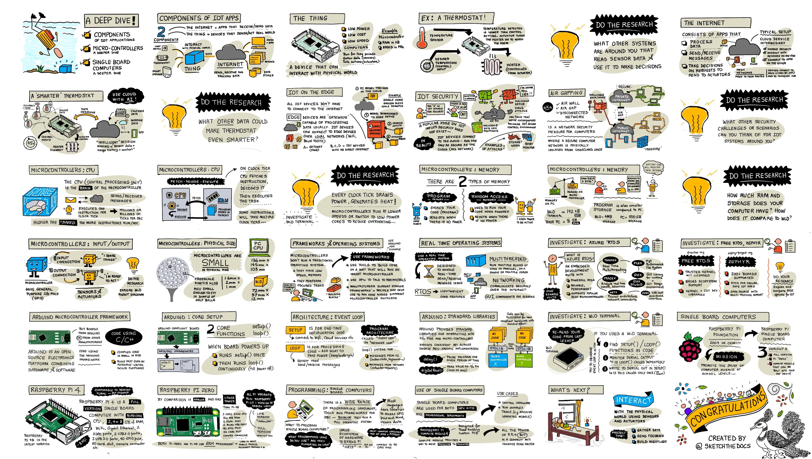

<!--
CO_OP_TRANSLATOR_METADATA:
{
  "original_hash": "9dd7f645ad1c6f20b72fee512987f772",
  "translation_date": "2025-08-28T17:01:46+00:00",
  "source_file": "1-getting-started/lessons/2-deeper-dive/README.md",
  "language_code": "uk"
}
-->
# Глибше занурення в IoT

> Скетчноут від [Nitya Narasimhan](https://github.com/nitya). Натисніть на зображення, щоб побачити його у більшому розмірі.

Цей урок був проведений у рамках серії [Hello IoT](https://youtube.com/playlist?list=PLmsFUfdnGr3xRts0TIwyaHyQuHaNQcb6-) від [Microsoft Reactor](https://developer.microsoft.com/reactor/?WT.mc_id=academic-17441-jabenn). Урок складався з двох відео: годинного заняття та годинної сесії запитань і відповідей, де детальніше розглядалися окремі частини уроку.

> 🎥 Натисніть на зображення вище, щоб переглянути відео

## Тест перед лекцією

[Тест перед лекцією](https://black-meadow-040d15503.1.azurestaticapps.net/quiz/3)

## Вступ

Цей урок глибше розглядає деякі концепції, які були висвітлені у попередньому уроці.

У цьому уроці ми розглянемо:

* [Компоненти IoT-додатка](../../../../../1-getting-started/lessons/2-deeper-dive)
* [Глибше занурення в мікроконтролери](../../../../../1-getting-started/lessons/2-deeper-dive)
* [Глибше занурення в одноплатні комп’ютери](../../../../../1-getting-started/lessons/2-deeper-dive)

## Компоненти IoT-додатка

IoT-додаток складається з двох компонентів: *Інтернету* та *речі*. Давайте розглянемо ці два компоненти детальніше.

### Річ

**Річ** у IoT стосується пристрою, який може взаємодіяти з фізичним світом. Зазвичай це невеликі, недорогі комп’ютери, які працюють на низьких швидкостях і споживають мало енергії — наприклад, прості мікроконтролери з кількома кілобайтами оперативної пам’яті (на відміну від гігабайтів у ПК), які працюють лише на кількох сотнях мегагерц (на відміну від гігагерц у ПК), але споживають настільки мало енергії, що можуть працювати тижнями, місяцями або навіть роками на батарейках.

Ці пристрої взаємодіють із фізичним світом, використовуючи датчики для збору даних із навколишнього середовища або керуючи виходами чи актуаторами для здійснення фізичних змін. Типовий приклад — це розумний термостат: пристрій, який має датчик температури, засіб для встановлення бажаної температури, наприклад, циферблат або сенсорний екран, і з’єднання з системою опалення або охолодження, яку можна ввімкнути, якщо виявлена температура виходить за межі бажаного діапазону. Датчик температури визначає, що в кімнаті занадто холодно, і актуатор вмикає опалення.

Існує величезний спектр пристроїв, які можуть діяти як IoT-пристрої: від спеціалізованого обладнання, що вимірює лише один параметр, до універсальних пристроїв, навіть вашого смартфона! Смартфон може використовувати датчики для виявлення навколишнього середовища та актуатори для взаємодії зі світом — наприклад, використовуючи GPS для визначення вашого місцезнаходження та динамік для надання інструкцій з навігації до пункту призначення.

✅ Подумайте про інші системи навколо вас, які зчитують дані з датчика та використовують їх для прийняття рішень. Одним із прикладів може бути термостат у духовці. Чи можете ви знайти більше?

### Інтернет

**Інтернет** у IoT-додатку складається з додатків, до яких IoT-пристрій може підключатися для надсилання та отримання даних, а також інших додатків, які можуть обробляти ці дані та допомагати приймати рішення щодо запитів, які потрібно надіслати актуаторам IoT-пристроїв.

Типовою конфігурацією є використання хмарного сервісу, до якого підключається IoT-пристрій. Цей хмарний сервіс обробляє такі аспекти, як безпека, отримання повідомлень від IoT-пристрою та надсилання повідомлень назад до пристрою. Хмарний сервіс також може підключатися до інших додатків, які обробляють або зберігають дані з датчиків, або використовують ці дані разом із даними з інших систем для прийняття рішень.

Пристрої не завжди підключаються безпосередньо до Інтернету через WiFi або дротові з’єднання. Деякі пристрої використовують mesh-мережі для зв’язку між собою за допомогою таких технологій, як Bluetooth, підключаючись через хаб, який має з’єднання з Інтернетом.

У прикладі з розумним термостатом термостат підключається через домашній WiFi до хмарного сервісу. Він надсилає дані про температуру до цього сервісу, де вони записуються до бази даних, що дозволяє власнику будинку перевіряти поточну та минулу температуру через додаток на телефоні. Інший сервіс у хмарі знає, яку температуру бажає власник, і надсилає повідомлення назад до IoT-пристрою через хмарний сервіс, щоб повідомити систему опалення про необхідність увімкнення або вимкнення.

Ще розумніша версія може використовувати штучний інтелект у хмарі разом із даними з інших датчиків, підключених до інших IoT-пристроїв, таких як датчики присутності, які визначають, які кімнати використовуються, а також дані про погоду чи ваш календар, щоб приймати рішення про налаштування температури більш розумним способом. Наприклад, вона може вимкнути опалення, якщо з вашого календаря видно, що ви у відпустці, або вимикати опалення в окремих кімнатах залежно від того, які кімнати ви використовуєте, навчаючись на даних, щоб ставати дедалі точнішою з часом.

✅ Які ще дані могли б допомогти зробити Інтернет-підключений термостат розумнішим?

### IoT на краю

Хоча літера "I" в IoT означає Інтернет, ці пристрої не завжди повинні підключатися до Інтернету. У деяких випадках пристрої можуть підключатися до "крайових" пристроїв — шлюзів, які працюють у вашій локальній мережі, що дозволяє обробляти дані без необхідності звертатися до Інтернету. Це може бути швидше, якщо у вас багато даних або повільне Інтернет-з’єднання, дозволяє працювати офлайн там, де Інтернет-з’єднання неможливе, наприклад, на кораблі або в зоні гуманітарної кризи, і дозволяє зберігати дані приватними. Деякі пристрої містять код обробки, створений за допомогою хмарних інструментів, і виконують його локально для збору та обробки даних без використання Інтернету для прийняття рішень.

Одним із прикладів є розумні домашні пристрої, такі як Apple HomePod, Amazon Alexa або Google Home, які слухають ваш голос за допомогою моделей штучного інтелекту, навчених у хмарі, але виконують їх локально на пристрої. Ці пристрої "прокидаються", коли вимовляється певне слово або фраза, і лише тоді надсилають вашу мову через Інтернет для обробки. Пристрій припиняє надсилати мову, коли виявляє паузу у вашій промові. Усе, що ви говорите до активації пристрою, і все, що ви говорите після того, як пристрій припинив слухати, не надсилається через Інтернет постачальнику пристрою, і тому залишається приватним.

✅ Подумайте про інші сценарії, де важлива конфіденційність, тому обробка даних краще здійснюється на краю, а не в хмарі. Підказка: подумайте про IoT-пристрої з камерами або іншими пристроями для зображення.

### Безпека IoT

З будь-яким Інтернет-з’єднанням безпека є важливим аспектом. Існує стара жартівлива фраза: "S у IoT означає Security" — у IoT немає "S", що натякає на відсутність безпеки.

IoT-пристрої підключаються до хмарного сервісу, і тому вони настільки ж безпечні, наскільки безпечний цей хмарний сервіс. Якщо ваш хмарний сервіс дозволяє підключатися будь-якому пристрою, можуть надсилатися шкідливі дані або відбуватися вірусні атаки. Це може мати дуже реальні наслідки, оскільки IoT-пристрої взаємодіють і контролюють інші пристрої. Наприклад, [черв’як Stuxnet](https://wikipedia.org/wiki/Stuxnet) маніпулював клапанами в центрифугах, щоб пошкодити їх. Хакери також скористалися [поганою безпекою для доступу до дитячих моніторів](https://www.npr.org/sections/thetwo-way/2018/06/05/617196788/s-c-mom-says-baby-monitor-was-hacked-experts-say-many-devices-are-vulnerable) та інших домашніх пристроїв спостереження.

> 💁 Іноді IoT-пристрої та крайові пристрої працюють у мережі, повністю ізольованій від Інтернету, щоб зберігати дані приватними та безпечними. Це називається [повітряним зазором](https://wikipedia.org/wiki/Air_gap_(networking)).

## Глибше занурення в мікроконтролери

У попередньому уроці ми ознайомилися з мікроконтролерами. Тепер розглянемо їх детальніше.

### ЦП

ЦП — це "мозок" мікроконтролера. Це процесор, який виконує ваш код і може надсилати дані на підключені пристрої та отримувати їх. ЦП може мати одне або більше ядер — по суті, це кілька процесорів, які можуть працювати разом для виконання вашого коду.

ЦП працюють завдяки годиннику, який "тикає" мільйони або мільярди разів на секунду. Кожен "тик" або цикл синхронізує дії, які може виконати ЦП. З кожним тиком ЦП може виконувати інструкцію з програми, наприклад, отримувати дані з зовнішнього пристрою або виконувати математичний розрахунок. Цей регулярний цикл дозволяє завершити всі дії до обробки наступної інструкції.

Чим швидший цикл годинника, тим більше інструкцій можна обробити за секунду, а отже, тим швидший ЦП. Швидкість ЦП вимірюється в [Герцах (Гц)](https://wikipedia.org/wiki/Hertz), стандартній одиниці, де 1 Гц означає один цикл або тик годинника за секунду.

> 🎓 Швидкість ЦП часто вказується в МГц або ГГц. 1 МГц — це 1 мільйон Гц, 1 ГГц — це 1 мільярд Гц.

> 💁 ЦП виконують програми, використовуючи [цикл отримання-декодування-виконання](https://wikipedia.org/wiki/Instruction_cycle). За кожен тик годинника ЦП отримує наступну інструкцію з пам’яті, декодує її, а потім виконує, наприклад, використовуючи арифметико-логічний пристрій (ALU) для додавання двох чисел. Деякі виконання займають кілька тиків, тому наступний цикл починається після завершення інструкції.

Мікроконтролери мають значно нижчі швидкості годинника, ніж настільні або портативні комп’ютери, або навіть більшість смартфонів. Наприклад, Wio Terminal має ЦП, який працює на частоті 120 МГц або 120 000 000 циклів за секунду.

✅ Середній ПК або Mac має ЦП із кількома ядрами, що працюють на частоті кількох гігагерц, тобто годинник "тикає" мільярди разів на секунду. Дослідіть швидкість годинника вашого комп’ютера та порівняйте, наскільки він швидший за Wio Terminal.

Кожен цикл годинника споживає енергію та генерує тепло. Чим швидші тики, тим більше енергії споживається і більше тепла виділяється. ПК мають радіатори та вентилятори для відведення тепла, без яких вони перегрілися б і вимкнулися за кілька секунд. Мікроконтролери часто не мають ні того, ні іншого, оскільки працюють набагато прохолодніше і, відповідно, повільніше. ПК працюють від мережі або великих батарей протягом кількох годин, мікроконтролери можуть працювати днями, місяцями або навіть роками від невеликих батарей. Мікроконтролери також можуть мати ядра, що працюють на різних швидкостях, перемикаючись на повільніші ядра з низьким енергоспоживанням, коли навантаження на ЦП низьке, щоб зменшити споживання енергії.

> 💁 Деякі ПК і Mac також використовують комбінацію швидких високопродуктивних ядер і повільніших ядер з низьким енергоспоживанням, перемикаючись між ними для економії батареї. Наприклад, чип M1 у новітніх ноутбуках Apple може перемикатися між 4 продуктивними ядрами та 4 ефективними ядрами, щоб оптимізувати час автономної роботи або швидкість залежно від виконуваного завдання.

✅ Проведіть невелике дослідження: прочитайте про ЦП у [статті Wikipedia про центральний процесор](https://wikipedia.org/wiki/Central_processing_unit).

#### Завдання

Дослідіть Wio Terminal.

Якщо ви використовуєте Wio Terminal для цих уроків, спробуйте знайти ЦП. Знайдіть розділ *Огляд обладнання* на [сторінці продукту Wio Terminal](https://www.seeedstudio.com/Wio-Terminal-p-4509.html), щоб побач
🎓 Програмна пам'ять зберігає ваш код і залишається навіть без живлення.
🎓 ОЗП використовується для запуску вашої програми і скидається, коли немає живлення

Як і у випадку з ЦП, пам'ять на мікроконтролері значно менша, ніж на ПК чи Mac. Типовий ПК може мати 8 гігабайт (GB) оперативної пам'яті, або 8,000,000,000 байтів, де кожен байт має достатньо місця для зберігання однієї літери або числа від 0 до 255. Мікроконтролер матиме лише кілька кілобайтів (KB) оперативної пам'яті, де кілобайт дорівнює 1,000 байтів. Наприклад, Wio Terminal, згаданий вище, має 192KB оперативної пам'яті, або 192,000 байтів — це більш ніж у 40,000 разів менше, ніж середній ПК!

На діаграмі нижче показано відносну різницю в розмірах між 192KB і 8GB — маленька точка в центрі представляє 192KB.

Місце для зберігання програм також менше, ніж на ПК. Типовий ПК може мати жорсткий диск на 500GB для зберігання програм, тоді як мікроконтролер може мати лише кілька кілобайтів або, можливо, кілька мегабайтів (MB) пам'яті (1MB дорівнює 1,000KB, або 1,000,000 байтів). Wio Terminal має 4MB пам'яті для зберігання програм.

✅ Проведіть невелике дослідження: Скільки оперативної пам'яті та місця для зберігання має комп'ютер, який ви використовуєте для читання цього тексту? Як це порівнюється з мікроконтролером?

### Вхід/Вихід

Мікроконтролери потребують з'єднань для введення та виведення (I/O), щоб зчитувати дані з датчиків і надсилати сигнали управління до виконавчих механізмів. Зазвичай вони містять кілька універсальних контактів введення/виведення (GPIO). Ці контакти можна налаштувати в програмному забезпеченні як вхідні (тобто вони отримують сигнал) або вихідні (вони надсилають сигнал).

🧠⬅️ Вхідні контакти використовуються для зчитування значень з датчиків

🧠➡️ Вихідні контакти надсилають інструкції до виконавчих механізмів

✅ Ви дізнаєтеся більше про це в наступному уроці.

#### Завдання

Дослідіть Wio Terminal.

Якщо ви використовуєте Wio Terminal для цих уроків, знайдіть контакти GPIO. Знайдіть розділ *Pinout diagram* на [сторінці продукту Wio Terminal](https://www.seeedstudio.com/Wio-Terminal-p-4509.html), щоб дізнатися, які контакти відповідають за що. Wio Terminal постачається з наклейкою, яку можна прикріпити на задню частину пристрою з номерами контактів, тому додайте її зараз, якщо ще не зробили цього.

### Фізичний розмір

Мікроконтролери зазвичай мають невеликий розмір, найменший з них, [Freescale Kinetis KL03 MCU, достатньо малий, щоб поміститися в заглиблення для м'яча для гольфу](https://www.edn.com/tiny-arm-cortex-m0-based-mcu-shrinks-package/). Лише ЦП у ПК може мати розмір 40мм x 40мм, і це без урахування радіаторів і вентиляторів, необхідних для забезпечення роботи ЦП більше кількох секунд без перегріву, що значно більше, ніж повний мікроконтролер. Набір для розробників Wio Terminal з мікроконтролером, корпусом, екраном і рядом з'єднань і компонентів не набагато більший за голий Intel i9 CPU і значно менший за ЦП з радіатором і вентилятором!

| Пристрій                          | Розмір                  |
| --------------------------------- | ----------------------- |
| Freescale Kinetis KL03            | 1.6мм x 2мм x 1мм       |
| Wio Terminal                      | 72мм x 57мм x 12мм      |
| Intel i9 CPU, радіатор і вентилятор | 136мм x 145мм x 103мм   |

### Фреймворки та операційні системи

Через низьку швидкість і обсяг пам'яті мікроконтролери не запускають операційну систему (OS) у звичному для настільних комп'ютерів сенсі. Операційна система, яка забезпечує роботу вашого комп'ютера (Windows, Linux або macOS), потребує багато пам'яті та обчислювальної потужності для виконання завдань, які абсолютно непотрібні для мікроконтролера. Пам'ятайте, що мікроконтролери зазвичай програмуються для виконання одного або кількох дуже специфічних завдань, на відміну від універсального комп'ютера, такого як ПК чи Mac, який повинен підтримувати інтерфейс користувача, відтворювати музику чи фільми, надавати інструменти для написання документів чи коду, запускати ігри або переглядати Інтернет.

Для програмування мікроконтролера без ОС вам потрібні інструменти, які дозволяють створювати ваш код таким чином, щоб мікроконтролер міг його виконувати, використовуючи API для взаємодії з периферійними пристроями. Кожен мікроконтролер відрізняється, тому виробники зазвичай підтримують стандартні фреймворки, які дозволяють дотримуватися стандартного "рецепту" для створення вашого коду, щоб він міг працювати на будь-якому мікроконтролері, який підтримує цей фреймворк.

Ви можете програмувати мікроконтролери з ОС — часто це називається операційною системою реального часу (RTOS), оскільки вони розроблені для обробки передачі даних до і від периферійних пристроїв у реальному часі. Ці операційні системи дуже легкі й забезпечують такі функції, як:

* Мультипотоковість, що дозволяє вашому коду виконувати більше одного блоку коду одночасно, або на кількох ядрах, або по черзі на одному ядрі
* Мережеві функції для безпечного спілкування через Інтернет
* Компоненти графічного інтерфейсу користувача (GUI) для створення інтерфейсів користувача (UI) на пристроях із екранами.

✅ Ознайомтеся з різними RTOS: [Azure RTOS](https://azure.microsoft.com/services/rtos/?WT.mc_id=academic-17441-jabenn), [FreeRTOS](https://www.freertos.org), [Zephyr](https://www.zephyrproject.org)

#### Arduino

[Arduino](https://www.arduino.cc) — це, мабуть, найпопулярніший фреймворк для мікроконтролерів, особливо серед студентів, ентузіастів і творців. Arduino — це платформа електроніки з відкритим кодом, яка об'єднує програмне забезпечення та апаратне забезпечення. Ви можете купити плати, сумісні з Arduino, у самих Arduino або у інших виробників, а потім програмувати їх за допомогою фреймворку Arduino.

Плати Arduino програмуються на C або C++. Використання C/C++ дозволяє вашому коду бути дуже компактним і швидким, що необхідно для пристрою з обмеженими ресурсами, такого як мікроконтролер. Основна частина програми Arduino називається скетчем і є кодом на C/C++ з двома функціями — `setup` і `loop`. Коли плата запускається, код фреймворку Arduino виконує функцію `setup` один раз, а потім виконує функцію `loop` знову і знову, безперервно, поки живлення не буде вимкнено.

У функції `setup` ви пишете код для налаштування, наприклад, підключення до WiFi і хмарних сервісів або ініціалізації контактів для введення і виведення. У функції `loop` ви пишете код для обробки, наприклад, зчитування даних з датчика і надсилання значення до хмари. Зазвичай ви додаєте затримку в кожному циклі, наприклад, якщо ви хочете, щоб дані датчика надсилалися кожні 10 секунд, ви додаєте затримку на 10 секунд в кінці циклу, щоб мікроконтролер міг спати, економлячи енергію, а потім виконувати цикл знову через 10 секунд.

✅ Ця архітектура програми відома як *цикл подій* або *цикл повідомлень*. Багато програм використовують це під капотом, і це стандарт для більшості настільних програм, які працюють на ОС, таких як Windows, macOS або Linux. Функція `loop` слухає повідомлення від компонентів інтерфейсу користувача, таких як кнопки, або пристроїв, таких як клавіатура, і реагує на них. Ви можете дізнатися більше в [статті про цикл подій](https://wikipedia.org/wiki/Event_loop).

Arduino надає стандартні бібліотеки для взаємодії з мікроконтролерами і контактами введення/виведення, з різними реалізаціями під капотом для роботи на різних мікроконтролерах. Наприклад, функція [`delay`](https://www.arduino.cc/reference/en/language/functions/time/delay/) призупиняє програму на заданий період часу, функція [`digitalRead`](https://www.arduino.cc/reference/en/language/functions/digital-io/digitalread/) зчитує значення `HIGH` або `LOW` з заданого контакту, незалежно від того, на якій платі виконується код. Ці стандартні бібліотеки означають, що код Arduino, написаний для однієї плати, може бути перекомпільований для будь-якої іншої плати Arduino і буде працювати, за умови, що контакти однакові і плати підтримують ті ж функції.

Існує велика екосистема сторонніх бібліотек Arduino, які дозволяють додавати додаткові функції до ваших проектів Arduino, наприклад, використання датчиків і виконавчих механізмів або підключення до хмарних IoT-сервісів.

##### Завдання

Дослідіть Wio Terminal.

Якщо ви використовуєте Wio Terminal для цих уроків, перечитайте код, який ви написали в попередньому уроці. Знайдіть функції `setup` і `loop`. Слідкуйте за серійним виводом для функції `loop`, яка викликається повторно. Спробуйте додати код до функції `setup`, щоб записати дані до серійного порту, і спостерігайте, що цей код викликається лише один раз кожного разу, коли ви перезавантажуєте пристрій. Спробуйте перезавантажити ваш пристрій за допомогою перемикача живлення на боці, щоб показати, що цей код викликається кожного разу, коли пристрій перезавантажується.

## Глибше занурення в одноплатні комп'ютери

У попередньому уроці ми познайомилися з одноплатними комп'ютерами. Тепер давайте розглянемо їх детальніше.

### Raspberry Pi

[Raspberry Pi Foundation](https://www.raspberrypi.org) — це благодійна організація з Великобританії, заснована у 2009 році для сприяння вивченню комп'ютерних наук, особливо на шкільному рівні. У рамках цієї місії вони розробили одноплатний комп'ютер під назвою Raspberry Pi. Raspberry Pi наразі доступні в 3 варіантах — повнорозмірна версія, менша Pi Zero, і модуль для обчислень, який можна вбудувати у ваш фінальний IoT-пристрій.

Остання ітерація повнорозмірного Raspberry Pi — це Raspberry Pi 4B. Він має чотириядерний (4 ядра) ЦП з частотою 1.5GHz, 2, 4 або 8GB оперативної пам'яті, гігабітний Ethernet, WiFi, 2 порти HDMI з підтримкою 4k екранів, аудіо- та композитний відеовихід, USB-порти (2 USB 2.0, 2 USB 3.0), 40 контактів GPIO, роз'єм для камери Raspberry Pi, і слот для SD-карт. Усе це на платі розміром 88мм x 58мм x 19.5мм, яка живиться від USB-C адаптера потужністю 3A. Ціни починаються від 35 доларів США, що значно дешевше, ніж ПК чи Mac.

> 💁 Існує також Pi400 — комп'ютер "все в одному" з Pi4, вбудованим у клавіатуру.

Pi Zero значно менший і має нижчу потужність. Він оснащений одноядерним ЦП з частотою 1GHz, 512MB оперативної пам'яті, WiFi (у моделі Zero W), одним портом HDMI, одним портом micro-USB, 40 контактами GPIO, роз'ємом для камери Raspberry Pi, і слотом для SD-карт. Його розміри становлять 65мм x 30мм x 5мм, і він споживає дуже мало енергії. Ціна Zero — 5 доларів США, а версія W з WiFi — 10 доларів США.

> 🎓 ЦП в обох цих моделях — це процесори ARM, на відміну від процесорів Intel/AMD x86 або x64, які ви знайдете в більшості ПК і Mac. Вони схожі на процесори, які використовуються в деяких мікроконтролерах, а також майже у всіх мобільних телефонах, Microsoft Surface X і нових Apple Mac на базі Apple Silicon.

Усі варіанти Raspberry Pi працюють на версії Debian Linux під назвою Raspberry Pi OS. Вона доступна у легкій версії без робочого столу, що ідеально підходить для "безголових" проектів, де екран не потрібен, або у повній версії з повноцінним робочим столом, веб-браузером, офісними додатками, інструментами для програмування і іграми. Оскільки ОС є версією Debian Linux, ви можете встановити будь-який додаток або інструмент, який працює на Debian і побудований для ARM-процесора всередині Pi.

#### Завдання

Дослідіть Raspberry Pi.

Якщо ви використовуєте Raspberry Pi для цих уроків, ознайомтеся з різними апаратними компонентами на платі.

* Ви можете знайти деталі про процесори, які використовуються на [сторінці документації про апаратне забезпечення Raspberry Pi](https://www.raspberrypi.org/documentation/hardware/raspberrypi/). Ознайомтеся з процесором, який використовується в Pi, який ви використовуєте.
* Знайдіть контакти GPIO. Дізнайтеся більше про них на [сторінці документації про GPIO Raspberry Pi](https://www.raspberrypi.org/documentation/hardware/raspberrypi/gpio/README.md). Використовуйте [посібник з використання контактів GPIO](https://www.raspberrypi.org/documentation/usage/gpio/README.md), щоб визначити різні контакти на вашому Pi.

### Програмування одноплатних комп'ютерів

Одноплатні комп'ютери — це повноцінні комп'ютери, які працюють на повноцінній ОС. Це означає, що існує широкий спектр мов програмування, фреймворків і інструментів, які ви можете використовувати для їх програмування, на відміну від мікроконтролерів, які залежать від підтримки плати у фреймворках, таких як Arduino. Більшість мов програмування мають бібліотеки, які можуть отримувати доступ до контактів GPIO
### Використання одноплатних комп'ютерів у професійних IoT-рішеннях

Одноплатні комп'ютери використовуються для професійних IoT-рішень, а не лише як набори для розробників. Вони можуть бути потужним інструментом для управління апаратним забезпеченням і виконання складних завдань, таких як запуск моделей машинного навчання. Наприклад, існує [модуль Raspberry Pi 4 compute](https://www.raspberrypi.org/blog/raspberry-pi-compute-module-4/), який забезпечує всю потужність Raspberry Pi 4, але в компактному та дешевшому форм-факторі без більшості портів, розроблений для встановлення в спеціальне обладнання.

---

## 🚀 Виклик

Завдання в останньому уроці полягало в тому, щоб перелічити якомога більше IoT-пристроїв, які є у вашому домі, школі чи на робочому місці. Для кожного пристрою в цьому списку подумайте, чи вони побудовані на основі мікроконтролерів, одноплатних комп'ютерів або навіть їх комбінації.

## Тест після лекції

[Тест після лекції](https://black-meadow-040d15503.1.azurestaticapps.net/quiz/4)

## Огляд і самостійне навчання

* Прочитайте [посібник з початку роботи з Arduino](https://www.arduino.cc/en/Guide/Introduction), щоб краще зрозуміти платформу Arduino.
* Ознайомтеся з [вступом до Raspberry Pi 4](https://www.raspberrypi.org/products/raspberry-pi-4-model-b/), щоб дізнатися більше про Raspberry Pi.
* Дізнайтеся більше про деякі концепції та абревіатури у статті [Що таке CPU, MPU, MCU та GPU у журналі Electrical Engineering Journal](https://www.eejournal.com/article/what-the-faq-are-cpus-mpus-mcus-and-gpus/).

✅ Використовуйте ці посібники разом із вартістю, показаною за посиланнями в [посібнику з апаратного забезпечення](../../../hardware.md), щоб вирішити, яку апаратну платформу ви хочете використовувати, або чи краще скористатися віртуальним пристроєм.

## Завдання

[Порівняйте та протиставте мікроконтролери та одноплатні комп'ютери](assignment.md)

---

**Відмова від відповідальності**:  
Цей документ був перекладений за допомогою сервісу автоматичного перекладу [Co-op Translator](https://github.com/Azure/co-op-translator). Хоча ми прагнемо до точності, будь ласка, майте на увазі, що автоматичні переклади можуть містити помилки або неточності. Оригінальний документ на його рідній мові слід вважати авторитетним джерелом. Для критичної інформації рекомендується професійний людський переклад. Ми не несемо відповідальності за будь-які непорозуміння або неправильні тлумачення, що виникають внаслідок використання цього перекладу.