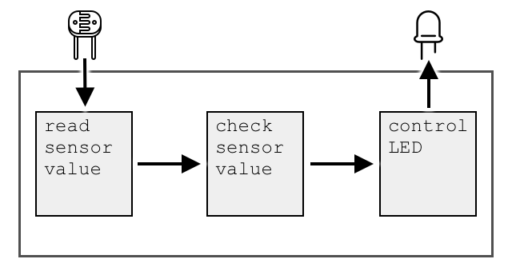

<!--
CO_OP_TRANSLATOR_METADATA:
{
  "original_hash": "e9ee00eb5fc55922a73762acc542166b",
  "translation_date": "2025-08-28T17:22:07+00:00",
  "source_file": "1-getting-started/lessons/3-sensors-and-actuators/README.md",
  "language_code": "uk"
}
-->
# Взаємодія з фізичним світом за допомогою сенсорів і актуаторів


> Скетчноут від [Нітії Нарасімхан](https://github.com/nitya). Натисніть на зображення, щоб побачити його у більшому розмірі.

Цей урок був частиною серії [Hello IoT](https://youtube.com/playlist?list=PLmsFUfdnGr3xRts0TIwyaHyQuHaNQcb6-) від [Microsoft Reactor](https://developer.microsoft.com/reactor/?WT.mc_id=academic-17441-jabenn). Урок складався з двох відео: годинного заняття та годинної сесії запитань і відповідей, де детальніше розглядалися окремі частини уроку.

[](https://youtu.be/Lqalu1v6aF4)

[](https://youtu.be/qR3ekcMlLWA)

> 🎥 Натисніть на зображення вище, щоб переглянути відео

## Передлекційна вікторина

[Передлекційна вікторина](https://black-meadow-040d15503.1.azurestaticapps.net/quiz/5)

## Вступ

Цей урок знайомить із двома важливими поняттями для вашого IoT-пристрою — сенсорами та актуаторами. Ви також зможете попрацювати з ними на практиці, додавши до свого IoT-проєкту датчик освітленості, а потім LED-лампу, яка керується рівнем освітлення, фактично створюючи нічник.

На цьому уроці ми розглянемо:

* [Що таке сенсори?](../../../../../1-getting-started/lessons/3-sensors-and-actuators)
* [Як використовувати сенсор](../../../../../1-getting-started/lessons/3-sensors-and-actuators)
* [Типи сенсорів](../../../../../1-getting-started/lessons/3-sensors-and-actuators)
* [Що таке актуатори?](../../../../../1-getting-started/lessons/3-sensors-and-actuators)
* [Як використовувати актуатор](../../../../../1-getting-started/lessons/3-sensors-and-actuators)
* [Типи актуаторів](../../../../../1-getting-started/lessons/3-sensors-and-actuators)

## Що таке сенсори?

Сенсори — це апаратні пристрої, які сприймають фізичний світ, тобто вимірюють одну або кілька властивостей навколишнього середовища та передають інформацію на IoT-пристрій. Сенсори охоплюють величезний спектр пристроїв, оскільки існує безліч речей, які можна виміряти — від природних властивостей, таких як температура повітря, до фізичних взаємодій, таких як рух.

Деякі поширені сенсори:

* Датчики температури — вимірюють температуру повітря або об'єкта, в якому вони знаходяться. Для хобістів і розробників ці сенсори часто поєднуються з датчиками тиску та вологості в одному пристрої.
* Кнопки — визначають, коли їх натискають.
* Датчики освітленості — виявляють рівень світла, можуть бути налаштовані на певні кольори, ультрафіолетове світло, інфрачервоне світло або загальне видиме світло.
* Камери — створюють візуальне уявлення світу, роблячи фотографії або транслюючи відео.
* Акселерометри — визначають рух у кількох напрямках.
* Мікрофони — виявляють звук, як загальний рівень шуму, так і спрямований звук.

✅ Проведіть дослідження. Які сенсори є у вашому телефоні?

Усі сенсори мають одну спільну рису — вони перетворюють те, що сприймають, на електричний сигнал, який може бути інтерпретований IoT-пристроєм. Як цей сигнал інтерпретується, залежить від сенсора, а також від протоколу зв'язку, який використовується для передачі даних на IoT-пристрій.

## Як використовувати сенсор

Скористайтеся відповідним посібником нижче, щоб додати сенсор до вашого IoT-пристрою:

* [Arduino - Wio Terminal](wio-terminal-sensor.md)
* [Одноплатний комп'ютер - Raspberry Pi](pi-sensor.md)
* [Одноплатний комп'ютер - Віртуальний пристрій](virtual-device-sensor.md)

## Типи сенсорів

Сенсори бувають аналоговими або цифровими.

### Аналогові сенсори

Деякі з найпростіших сенсорів є аналоговими. Ці сенсори отримують напругу від IoT-пристрою, компоненти сенсора змінюють цю напругу, і напруга, що повертається від сенсора, вимірюється для отримання значення сенсора.

> 🎓 Напруга — це міра того, наскільки сильно електрика "штовхається" з одного місця в інше, наприклад, від позитивного полюса батареї до негативного. Наприклад, стандартна батарейка AA має напругу 1,5 В (В — символ вольт) і може "штовхати" електрику з силою 1,5 В від свого позитивного полюса до негативного. Різні електричні пристрої потребують різної напруги для роботи. Наприклад, LED може світитися при напрузі 2-3 В, але лампа розжарювання потужністю 100 Вт потребує 240 В. Більше про напругу можна прочитати на [сторінці Вікіпедії про напругу](https://wikipedia.org/wiki/Voltage).

Одним із прикладів є потенціометр. Це ручка, яку можна обертати між двома положеннями, і сенсор вимірює це обертання.


IoT-пристрій надсилає електричний сигнал на потенціометр із певною напругою, наприклад, 5 В (5 вольт). Коли потенціометр налаштований, він змінює напругу, яка виходить з іншого боку. Уявіть, що у вас є потенціометр, позначений як ручка, яка обертається від 0 до [11](https://wikipedia.org/wiki/Up_to_eleven), наприклад, як регулятор гучності на підсилювачі. Коли потенціометр знаходиться у повністю вимкненому положенні (0), вихідна напруга становить 0 В. Коли він у повністю ввімкненому положенні (11), вихідна напруга становить 5 В.

> 🎓 Це спрощене пояснення. Більше про потенціометри та змінні резистори можна прочитати на [сторінці Вікіпедії про потенціометри](https://wikipedia.org/wiki/Potentiometer).

Напруга, яка виходить із сенсора, зчитується IoT-пристроєм, і пристрій може реагувати на неї. Залежно від сенсора, ця напруга може бути довільним значенням або відповідати стандартній одиниці. Наприклад, аналоговий датчик температури на основі [термістора](https://wikipedia.org/wiki/Thermistor) змінює свій опір залежно від температури. Вихідна напруга може бути перетворена на температуру в Кельвінах, а відповідно й у °C або °F, за допомогою обчислень у коді.

✅ Як ви думаєте, що станеться, якщо сенсор поверне напругу, вищу за ту, що була надіслана (наприклад, від зовнішнього джерела живлення)? ⛔️ НЕ тестуйте це.

#### Перетворення аналогового сигналу в цифровий

IoT-пристрої є цифровими — вони не можуть працювати з аналоговими значеннями, лише з 0 і 1. Це означає, що значення аналогових сенсорів потрібно перетворити на цифровий сигнал перед обробкою. Багато IoT-пристроїв мають аналого-цифрові перетворювачі (ADC), які перетворюють аналогові входи на цифрові представлення їх значень. Сенсори також можуть працювати з ADC через з'єднувальну плату. Наприклад, у системі Seeed Grove з Raspberry Pi аналогові сенсори підключаються до певних портів на "шапці", яка встановлюється на Pi і підключається до його GPIO-пінів. Ця "шапка" має ADC для перетворення напруги на цифровий сигнал, який можна передати через GPIO-піни Pi.

Уявіть, що у вас є аналоговий датчик освітленості, підключений до IoT-пристрою, який працює на 3,3 В, і повертає значення 1 В. Ці 1 В нічого не означають у цифровому світі, тому їх потрібно перетворити. Напруга буде перетворена на аналогове значення за шкалою, яка залежить від пристрою та сенсора. Наприклад, датчик освітленості Seeed Grove видає значення від 0 до 1023. Для цього сенсора, що працює на 3,3 В, вихід 1 В буде відповідати значенню 300. IoT-пристрій не може працювати з 300 як аналоговим значенням, тому це значення буде перетворено на `0000000100101100`, двійкове представлення числа 300, за допомогою "шапки" Grove. Потім це значення буде оброблено IoT-пристроєм.

✅ Якщо ви не знаєте, що таке двійкова система числення, проведіть невелике дослідження, щоб дізнатися, як числа представляються за допомогою 0 і 1. [Вступний урок BBC Bitesize про двійкову систему числення](https://www.bbc.co.uk/bitesize/guides/zwsbwmn/revision/1) — чудове місце для початку.

З точки зору програмування, усе це зазвичай обробляється бібліотеками, які постачаються разом із сенсорами, тому вам не потрібно самостійно займатися цим перетворенням. Для датчика освітленості Grove ви б використали бібліотеку Python і викликали властивість `light`, або використали бібліотеку Arduino і викликали `analogRead`, щоб отримати значення 300.

### Цифрові сенсори

Цифрові сенсори, як і аналогові, виявляють навколишній світ за допомогою змін електричної напруги. Різниця полягає в тому, що вони видають цифровий сигнал, або вимірюючи лише два стани, або використовуючи вбудований ADC. Цифрові сенсори стають дедалі популярнішими, щоб уникнути необхідності використання ADC у з'єднувальній платі або самому IoT-пристрої.

Найпростіший цифровий сенсор — це кнопка або перемикач. Це сенсор із двома станами: увімкнено або вимкнено.


Піни IoT-пристроїв, такі як GPIO-піни, можуть безпосередньо вимірювати цей сигнал як 0 або 1. Якщо напруга, що надсилається, збігається з напругою, що повертається, значення, яке зчитується, дорівнює 1, інакше значення дорівнює 0. Немає необхідності перетворювати сигнал, він може бути лише 1 або 0.

> 💁 Напруги ніколи не є точними, особливо тому, що компоненти сенсора мають певний опір, тому зазвичай є допустиме відхилення. Наприклад, GPIO-піни Raspberry Pi працюють на 3,3 В і зчитують сигнал вище 1,8 В як 1, а нижче 1,8 В як 0.

* 3,3 В подається на кнопку. Кнопка вимкнена, тому вихідна напруга становить 0 В, значення дорівнює 0.
* 3,3 В подається на кнопку. Кнопка ввімкнена, тому вихідна напруга становить 3,3 В, значення дорівнює 1.

Більш складні цифрові сенсори зчитують аналогові значення, а потім перетворюють їх за допомогою вбудованих ADC на цифрові сигнали. Наприклад, цифровий датчик температури все ще використовує термопару так само, як і аналоговий сенсор, і все ще вимірює зміну напруги, спричинену опором термопари при поточній температурі. Замість того, щоб повертати аналогове значення і покладатися на пристрій або з'єднувальну плату для перетворення на цифровий сигнал, вбудований у сенсор ADC перетворює значення і надсилає його у вигляді серії 0 і 1 на IoT-пристрій. Ці 0 і 1 надсилаються так само, як цифровий сигнал для кнопки, де 1 — це повна напруга, а 0 — це 0 В.


Передача цифрових даних дозволяє сенсорам ставати складнішими і передавати більш детальні дані, навіть зашифровані дані для безпечних сенсорів. Одним із прикладів є камера. Це сенсор, який захоплює зображення і передає його у вигляді цифрових даних, що містять це зображення, зазвичай у стиснутому форматі, наприклад JPEG, для зчитування IoT-пристроєм. Вона також може транслювати відео, захоплюючи зображення і передаючи або повне зображення кадр за кадром, або стиснутий відеопотік.

## Що таке актуатори?

Актуатори — це протилежність сенсорів. Вони перетворюють електричний сигнал від вашого IoT-пристрою на взаємодію з фізичним світом, наприклад, випромінювання світла чи звуку або рух двигуна.

Деякі поширені актуатори:

* LED — випромінюють світло, коли ввімкнені.
* Динамік — випромінює звук залежно від сигналу, що надсилається, від простого дзижчання до відтворення музики.
* Кроковий двигун — перетворює сигнал на певний кут обертання, наприклад, повертає ручку на 90°.
* Реле — це перемикачі, які можна ввімкнути або вимкнути за допомогою електричного сигналу. Вони дозволяють невеликій напрузі від IoT-пристрою вмикати більші напруги.
* Екрани — це складніші актуатори, які відображають інформацію на багатосегментному дисплеї. Екрани варіюються від простих LED-дисплеїв до високоякісних відеомоніторів.

✅ Проведіть дослідження. Які актуатори є у вашому телефоні?

## Як використовувати актуатор

Скористайтеся відповідним посібником нижче, щоб додати актуатор до вашого IoT-пристрою, керований сенсором, для створення IoT-нічника. Він збиратиме дані про рівень освітленості від датчика освітленості та використовуватиме актуатор у вигляді LED-лампи для випромінювання світла, коли рівень освітленості занадто низький.



* [Arduino - Wio Terminal](wio-terminal-actuator.md)
* [Одноплатний комп'ютер - Raspberry Pi](pi-actuator.md)
* [Одноплатний комп'ютер -


Як і у випадку з датчиками, реальний IoT-пристрій працює з цифровими сигналами, а не аналоговими. Це означає, що для передачі аналогового сигналу IoT-пристрій потребує цифро-аналогового перетворювача (DAC), який може бути вбудований безпосередньо в пристрій або розташований на платі з'єднання. Цей перетворювач змінює 0 і 1 з IoT-пристрою на аналогову напругу, яку може використовувати виконавчий механізм.

✅ Як ви думаєте, що станеться, якщо IoT-пристрій передасть напругу, вищу за ту, яку може витримати виконавчий механізм?  
⛔️ НЕ тестуйте це.

#### Широтно-імпульсна модуляція

Ще одним варіантом перетворення цифрових сигналів IoT-пристрою на аналоговий сигнал є широтно-імпульсна модуляція (PWM). Це передбачає передачу великої кількості коротких цифрових імпульсів, які діють як аналоговий сигнал.

Наприклад, ви можете використовувати PWM для контролю швидкості двигуна.

Уявіть, що ви керуєте двигуном із живленням 5В. Ви надсилаєте короткий імпульс до двигуна, перемикаючи напругу на високу (5В) на дві соті секунди (0,02с). За цей час двигун може зробити одну десяту оберту, або 36°. Потім сигнал паузує на дві соті секунди (0,02с), передаючи низький сигнал (0В). Кожен цикл увімкнення та вимкнення триває 0,04с. Цикл повторюється.


Це означає, що за одну секунду ви маєте 25 імпульсів 5В тривалістю 0,02с, які обертають двигун, кожен із яких супроводжується паузою 0,02с із 0В, коли двигун не обертається. Кожен імпульс обертає двигун на одну десяту оберту, тобто двигун завершує 2,5 оберти за секунду. Ви використали цифровий сигнал для обертання двигуна зі швидкістю 2,5 обертів за секунду, або 150 [обертів за хвилину](https://wikipedia.org/wiki/Revolutions_per_minute) (нестандартна одиниця вимірювання швидкості обертання).

```output
25 pulses per second x 0.1 rotations per pulse = 2.5 rotations per second
2.5 rotations per second x 60 seconds in a minute = 150rpm
```

> 🎓 Коли сигнал PWM увімкнений половину часу, а вимкнений половину часу, це називається [циклом роботи 50%](https://wikipedia.org/wiki/Duty_cycle). Цикли роботи вимірюються як відсоток часу, коли сигнал перебуває у стані увімкнення порівняно зі станом вимкнення.


Ви можете змінити швидкість двигуна, змінюючи розмір імпульсів. Наприклад, із тим самим двигуном ви можете залишити той самий час циклу 0,04с, скоротивши імпульс увімкнення до 0,01с, а імпульс вимкнення збільшивши до 0,03с. Ви маєте ту саму кількість імпульсів за секунду (25), але кожен імпульс увімкнення вдвічі коротший. Імпульс половинної довжини обертає двигун лише на одну двадцяту оберту, і при 25 імпульсах за секунду двигун завершить 1,25 оберту за секунду або 75 об/хв. Змінюючи швидкість імпульсів цифрового сигналу, ви вдвічі зменшили швидкість аналогового двигуна.

```output
25 pulses per second x 0.05 rotations per pulse = 1.25 rotations per second
1.25 rotations per second x 60 seconds in a minute = 75rpm
```

✅ Як би ви забезпечили плавне обертання двигуна, особливо на низьких швидкостях? Чи використовували б ви невелику кількість довгих імпульсів із тривалими паузами або багато дуже коротких імпульсів із короткими паузами?

> 💁 Деякі датчики також використовують PWM для перетворення аналогових сигналів на цифрові.

> 🎓 Ви можете дізнатися більше про широтно-імпульсну модуляцію на [сторінці широтно-імпульсної модуляції у Вікіпедії](https://wikipedia.org/wiki/Pulse-width_modulation).

### Цифрові виконавчі механізми

Цифрові виконавчі механізми, як і цифрові датчики, мають два стани, які контролюються високою або низькою напругою, або мають вбудований DAC, який може перетворювати цифровий сигнал на аналоговий.

Простий цифровий виконавчий механізм — це світлодіод (LED). Коли пристрій надсилає цифровий сигнал 1, передається висока напруга, яка запалює світлодіод. Коли надсилається цифровий сигнал 0, напруга падає до 0В, і світлодіод вимикається.


✅ Які ще прості виконавчі механізми з двома станами ви можете придумати? Один із прикладів — соленоїд, який є електромагнітом, що може активуватися для виконання таких дій, як переміщення засувки дверей для блокування/розблокування дверей.

Більш складні цифрові виконавчі механізми, такі як екрани, потребують передачі цифрових даних у певних форматах. Зазвичай вони постачаються з бібліотеками, які спрощують передачу правильних даних для їх контролю.

---

## 🚀 Завдання

Завдання в останніх двох уроках полягало в тому, щоб перелічити якомога більше IoT-пристроїв, які є у вашому домі, школі чи на робочому місці, і визначити, чи вони побудовані на мікроконтролерах, одноплатних комп'ютерах або навіть на їхній суміші.

Для кожного пристрою, який ви перелічили, які датчики та виконавчі механізми до них підключені? Яка мета кожного датчика та виконавчого механізму, підключеного до цих пристроїв?

## Тест після лекції

[Тест після лекції](https://black-meadow-040d15503.1.azurestaticapps.net/quiz/6)

## Огляд і самостійне навчання

* Ознайомтеся з електрикою та схемами на [ThingLearn](http://thinglearn.jenlooper.com/curriculum/).  
* Прочитайте про різні типи датчиків температури у [довіднику датчиків температури Seeed Studios](https://www.seeedstudio.com/blog/2019/10/14/temperature-sensors-for-arduino-projects/).  
* Прочитайте про світлодіоди на [сторінці світлодіодів у Вікіпедії](https://wikipedia.org/wiki/Light-emitting_diode).  

## Завдання

[Дослідження датчиків і виконавчих механізмів](assignment.md)  

---

**Відмова від відповідальності**:  
Цей документ був перекладений за допомогою сервісу автоматичного перекладу [Co-op Translator](https://github.com/Azure/co-op-translator). Хоча ми прагнемо до точності, будь ласка, майте на увазі, що автоматичні переклади можуть містити помилки або неточності. Оригінальний документ на його рідній мові слід вважати авторитетним джерелом. Для критичної інформації рекомендується професійний людський переклад. Ми не несемо відповідальності за будь-які непорозуміння або неправильні тлумачення, що виникають внаслідок використання цього перекладу.