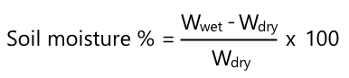

<!--
CO_OP_TRANSLATOR_METADATA:
{
  "original_hash": "506d21b544d5de47406c89ad496a21cd",
  "translation_date": "2025-08-28T17:46:16+00:00",
  "source_file": "2-farm/lessons/2-detect-soil-moisture/assignment.md",
  "language_code": "uk"
}
-->
# Калібруйте свій сенсор

## Інструкції

У цьому уроці ви зібрали показники датчика вологості ґрунту, виміряні у значеннях від 0 до 1023. Щоб перетворити ці значення на фактичні показники вологості ґрунту, потрібно відкалібрувати сенсор. Це можна зробити, взявши показники зразків ґрунту, а потім розрахувавши гравіметричний вміст вологи в ґрунті з цих зразків.

Вам потрібно повторити ці кроки кілька разів, щоб отримати необхідні показники, кожного разу з різним рівнем вологості ґрунту.

1. Зробіть вимірювання вологості ґрунту за допомогою датчика вологості ґрунту. Запишіть це значення.

1. Візьміть зразок ґрунту та зважте його. Запишіть цю вагу.

1. Висушіть ґрунт — найкращий спосіб це зробити в теплому духовому шафі при температурі 110°C (230°F) протягом кількох годин. Ви також можете висушити його на сонці або залишити в теплому, сухому місці, поки ґрунт повністю не висохне. Він має стати порошкоподібним і розсипчастим.

    > 💁 У лабораторії для отримання найточніших результатів ґрунт сушать у духовці протягом 48-72 годин. Якщо у вашій школі є сушильні шафи, спробуйте використати їх для тривалішого сушіння. Чим довше сушіння, тим сухіший зразок і точніші результати.

1. Знову зважте ґрунт.

    > 🔥 Якщо ви сушили його в духовці, переконайтеся, що він спочатку охолов!

Гравіметрична вологість ґрунту розраховується за формулою:

* W  
- вага вологого ґрунту  
* W  
- вага сухого ґрунту  

Наприклад, у вас є зразок ґрунту, який важить 212 г у вологому стані та 197 г у сухому.

* W = 212 г  
* W = 197 г  
* 212 - 197 = 15  
* 15 / 197 = 0.076  
* 0.076 * 100 = 7.6%  

У цьому прикладі гравіметрична вологість ґрунту становить 7.6%.

Коли у вас будуть показники щонайменше для 3 зразків, побудуйте графік залежності вологості ґрунту (%) від показників датчика вологості ґрунту та додайте лінію, яка найкраще відповідає точкам. Потім ви зможете використовувати цей графік для розрахунку гравіметричної вологості ґрунту за заданим показником датчика, зчитуючи значення з лінії.

## Рубрика

| Критерії | Відмінно | Задовільно | Потребує покращення |
| -------- | -------- | ---------- | ------------------- |
| Збір даних для калібрування | Зібрано щонайменше 3 зразки для калібрування | Зібрано щонайменше 2 зразки для калібрування | Зібрано щонайменше 1 зразок для калібрування |
| Виконання каліброваного вимірювання | Успішно побудовано графік калібрування, зроблено вимірювання з датчика та перетворено його на гравіметричну вологість ґрунту | Успішно побудовано графік калібрування | Не вдалося побудувати графік |

---

**Відмова від відповідальності**:  
Цей документ був перекладений за допомогою сервісу автоматичного перекладу [Co-op Translator](https://github.com/Azure/co-op-translator). Хоча ми прагнемо до точності, будь ласка, майте на увазі, що автоматичні переклади можуть містити помилки або неточності. Оригінальний документ на його рідній мові слід вважати авторитетним джерелом. Для критичної інформації рекомендується професійний людський переклад. Ми не несемо відповідальності за будь-які непорозуміння або неправильні тлумачення, що виникають внаслідок використання цього перекладу.