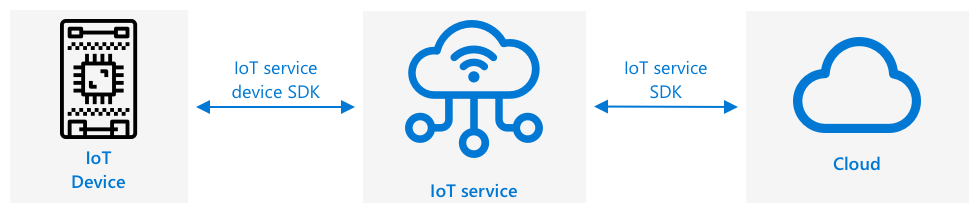

<!--
CO_OP_TRANSLATOR_METADATA:
{
  "original_hash": "4d8e7a066d75b625e7a979c14157041d",
  "translation_date": "2025-08-28T17:59:49+00:00",
  "source_file": "2-farm/lessons/4-migrate-your-plant-to-the-cloud/README.md",
  "language_code": "uk"
}
-->
# Перенесіть вашу рослину в хмару


> Скетчноут від [Nitya Narasimhan](https://github.com/nitya). Натисніть на зображення для збільшення.

Цей урок був проведений у рамках [IoT для початківців: Проект 2 - Цифрове сільське господарство](https://youtube.com/playlist?list=PLmsFUfdnGr3yCutmcVg6eAUEfsGiFXgcx) від [Microsoft Reactor](https://developer.microsoft.com/reactor/?WT.mc_id=academic-17441-jabenn).

[](https://youtu.be/bNxjopXkhvk)

## Тест перед лекцією

[Тест перед лекцією](https://black-meadow-040d15503.1.azurestaticapps.net/quiz/15)

## Вступ

У попередньому уроці ви дізналися, як підключити вашу рослину до брокера MQTT і керувати реле за допомогою серверного коду, який працює локально. Це є основою для створення автоматизованої системи поливу, яка може використовуватися як для окремих рослин вдома, так і для комерційних ферм.

IoT-пристрій спілкувався з публічним брокером MQTT, щоб продемонструвати принципи роботи, але це не найнадійніший або безпечний спосіб. У цьому уроці ви дізнаєтеся про хмару та IoT-можливості, які надають публічні хмарні сервіси. Ви також навчитеся переносити вашу рослину з публічного брокера MQTT до одного з цих хмарних сервісів.

У цьому уроці ми розглянемо:

* [Що таке хмара?](../../../../../2-farm/lessons/4-migrate-your-plant-to-the-cloud)
* [Створення хмарної підписки](../../../../../2-farm/lessons/4-migrate-your-plant-to-the-cloud)
* [Хмарні IoT-сервіси](../../../../../2-farm/lessons/4-migrate-your-plant-to-the-cloud)
* [Створення IoT-сервісу в хмарі](../../../../../2-farm/lessons/4-migrate-your-plant-to-the-cloud)
* [Спілкування з IoT Hub](../../../../../2-farm/lessons/4-migrate-your-plant-to-the-cloud)
* [Підключення вашого пристрою до IoT-сервісу](../../../../../2-farm/lessons/4-migrate-your-plant-to-the-cloud)

## Що таке хмара?

До появи хмари, коли компанія хотіла надавати послуги своїм співробітникам (наприклад, бази даних або зберігання файлів) чи громадськості (наприклад, вебсайти), вона створювала та управляла власним дата-центром. Це могло бути від кімнати з невеликою кількістю комп'ютерів до будівлі з багатьма комп'ютерами. Компанія управляла всім, включаючи:

* Купівлю комп'ютерів
* Обслуговування обладнання
* Електропостачання та охолодження
* Мережеве з'єднання
* Безпеку, включаючи захист будівлі та програмного забезпечення на комп'ютерах
* Встановлення та оновлення програмного забезпечення

Це могло бути дуже дорогим, вимагати широкого спектру кваліфікованих співробітників і бути дуже повільним у зміні, коли це необхідно. Наприклад, якщо онлайн-магазин планував зайнятий святковий сезон, йому потрібно було планувати закупівлю обладнання, його налаштування та встановлення програмного забезпечення за кілька місяців до цього. Після закінчення святкового сезону та зниження продажів вони залишалися з комп'ютерами, які вони оплатили, але які простоювали до наступного сезону.

✅ Як ви думаєте, чи дозволило б це компаніям швидко реагувати? Якщо онлайн-магазин одягу раптово став популярним через те, що знаменитість була помічена в їхньому одязі, чи змогли б вони швидко збільшити обчислювальну потужність для підтримки раптового напливу замовлень?

### Комп'ютер іншої людини

Хмара часто жартівливо називається "комп'ютером іншої людини". Початкова ідея була простою — замість того, щоб купувати комп'ютери, ви орендуєте комп'ютер іншої людини. Хтось інший, постачальник хмарних обчислень, управляє величезними дата-центрами. Вони відповідають за купівлю та встановлення обладнання, управління електропостачанням та охолодженням, мережеве з'єднання, безпеку будівлі, оновлення обладнання та програмного забезпечення — все. Як клієнт, ви орендуєте необхідні комп'ютери, орендуючи більше, коли попит зростає, і зменшуючи кількість орендованих комп'ютерів, коли попит падає. Ці хмарні дата-центри розташовані по всьому світу.


Ці дата-центри можуть займати площу в кілька квадратних кілометрів. Зображення вище були зроблені кілька років тому в хмарному дата-центрі Microsoft і показують початковий розмір, а також плановане розширення. Очищена для розширення площа становить понад 5 квадратних кілометрів.

> 💁 Ці дата-центри потребують такої великої кількості електроенергії, що деякі мають власні електростанції. Завдяки своїм розмірам і рівню інвестицій від постачальників хмарних послуг вони зазвичай дуже екологічно чисті. Вони більш ефективні, ніж велика кількість невеликих дата-центрів, працюють переважно на відновлюваній енергії, а постачальники хмарних послуг активно працюють над зменшенням відходів, скороченням використання води та відновленням лісів, вирубаних для будівництва дата-центрів. Ви можете дізнатися більше про те, як один із постачальників хмарних послуг працює над стійкістю на [сайті стійкості Azure](https://azure.microsoft.com/global-infrastructure/sustainability/?WT.mc_id=academic-17441-jabenn).

✅ Проведіть дослідження: Ознайомтеся з основними хмарними сервісами, такими як [Azure від Microsoft](https://azure.microsoft.com/?WT.mc_id=academic-17441-jabenn) або [GCP від Google](https://cloud.google.com). Скільки дата-центрів вони мають і де вони розташовані у світі?

Використання хмари дозволяє компаніям знижувати витрати та зосереджуватися на тому, що вони роблять найкраще, залишаючи експертизу хмарних обчислень у руках постачальника. Компанії більше не потрібно орендувати або купувати простір у дата-центрі, платити різним постачальникам за підключення та електроенергію або наймати експертів. Натомість вони можуть платити один щомісячний рахунок постачальнику хмарних послуг, щоб усе було вирішено.

Постачальник хмарних послуг може використовувати економію масштабу для зниження витрат, купуючи комп'ютери оптом за нижчими цінами, інвестуючи в інструменти для зменшення робочого навантаження на обслуговування, навіть проектуючи та створюючи власне обладнання для покращення хмарних послуг.

### Microsoft Azure

Azure — це хмарна платформа для розробників від Microsoft, і саме її ви будете використовувати для цих уроків. Відео нижче дає короткий огляд Azure:

[](https://www.microsoft.com/videoplayer/embed/RE4Ibng?WT.mc_id=academic-17441-jabenn)

## Створення хмарної підписки

Щоб використовувати сервіси в хмарі, вам потрібно зареєструватися для отримання підписки у постачальника хмарних послуг. У цьому уроці ви будете реєструватися для отримання підписки Microsoft Azure. Якщо у вас вже є підписка Azure, ви можете пропустити це завдання. Деталі підписки, описані тут, актуальні на момент написання, але можуть змінитися.

> 💁 Якщо ви отримуєте доступ до цих уроків через вашу школу, можливо, у вас вже є доступна підписка Azure. Перевірте у вашого викладача.

Існує два різних типи безкоштовної підписки Azure, які ви можете отримати:

* **Azure для студентів** — це підписка, розроблена для студентів віком від 18 років. Вам не потрібна кредитна картка для реєстрації, і ви використовуєте свою шкільну електронну адресу для підтвердження, що ви є студентом. Під час реєстрації ви отримуєте $100 для витрат на хмарні ресурси, а також безкоштовні сервіси, включаючи безкоштовну версію IoT-сервісу. Це триває 12 місяців, і ви можете поновлювати її щороку, поки залишаєтеся студентом.

* **Безкоштовна підписка Azure** — це підписка для всіх, хто не є студентом. Вам потрібна кредитна картка для реєстрації, але ваша картка не буде списана, це лише для підтвердження, що ви реальна людина, а не бот. Ви отримуєте $200 кредиту для використання протягом перших 30 днів на будь-який сервіс, а також безкоштовні рівні сервісів Azure. Після того, як ваш кредит буде використаний, ваша картка не буде списана, якщо ви не перейдете на підписку з оплатою за використання.

> 💁 Microsoft також пропонує підписку Azure для студентів Starter для студентів молодше 18 років, але на момент написання вона не підтримує IoT-сервіси.

### Завдання — зареєструйтеся для безкоштовної хмарної підписки

Якщо ви студент віком від 18 років, ви можете зареєструватися для отримання підписки Azure для студентів. Вам потрібно буде підтвердити це за допомогою шкільної електронної адреси. Ви можете зробити це двома способами:

* Зареєструйтеся для отримання пакету розробника GitHub для студентів на [education.github.com/pack](https://education.github.com/pack). Це дає вам доступ до ряду інструментів та пропозицій, включаючи GitHub та Microsoft Azure. Після реєстрації для пакету розробника ви можете активувати пропозицію Azure для студентів.

* Зареєструйтеся безпосередньо для отримання облікового запису Azure для студентів на [azure.microsoft.com/free/students](https://azure.microsoft.com/free/students/?WT.mc_id=academic-17441-jabenn).

> ⚠️ Якщо ваша шкільна електронна адреса не розпізнається, створіть [запит у цьому репозиторії](https://github.com/Microsoft/IoT-For-Beginners/issues), і ми перевіримо, чи можна її додати до списку дозволених для Azure для студентів.

Якщо ви не є студентом або у вас немає дійсної шкільної електронної адреси, ви можете зареєструватися для отримання безкоштовної підписки Azure.

* Зареєструйтеся для отримання безкоштовної підписки Azure на [azure.microsoft.com/free](https://azure.microsoft.com/free/?WT.mc_id=academic-17441-jabenn)

## Хмарні IoT-сервіси

Публічний тестовий брокер MQTT, який ви використовували, є чудовим інструментом для навчання, але має ряд недоліків для використання в комерційних умовах:

* Надійність — це безкоштовний сервіс без гарантій, який може бути вимкнений у будь-який момент
* Безпека — він є публічним, тому будь-хто може слухати вашу телеметрію або надсилати команди для управління вашим обладнанням
* Продуктивність — він призначений лише для кількох тестових повідомлень, тому не впорається з великою кількістю повідомлень
* Виявлення — немає способу дізнатися, які пристрої підключені

IoT-сервіси в хмарі вирішують ці проблеми. Вони підтримуються великими постачальниками хмарних послуг, які інвестують значні кошти в надійність і готові вирішувати будь-які проблеми, які можуть виникнути. Вони мають вбудовану безпеку, щоб запобігти хакерам читати ваші дані або надсилати шкідливі команди. Вони також мають високу продуктивність, здатні обробляти мільйони повідомлень щодня, використовуючи хмару для масштабування за потреби.

> 💁 Хоча за ці переваги потрібно платити щомісячну плату, більшість постачальників хмарних послуг пропонують безкоштовну версію свого IoT-сервісу з обмеженою кількістю повідомлень на день або пристроїв, які можуть підключатися. Ця безкоштовна версія зазвичай більш ніж достатня для розробника, щоб ознайомитися з сервісом. У цьому уроці ви будете використовувати безкоштовну версію.

IoT-пристрої підключаються до хмарного сервісу або за допомогою SDK пристрою (бібліотеки, яка надає код для роботи з функціями сервісу), або безпосередньо через протокол зв'язку, такий як MQTT або HTTP. SDK пристрою зазвичай є найпростішим шляхом, оскільки він автоматично обробляє все, наприклад, які теми публікувати або підписуватися, і як обробляти безпеку.



Ваш пристрій потім спілкується з іншими частинами вашого додатку через цей сервіс — схоже на те, як ви надсилали телеметрію та отримували команди через MQTT. Це зазвичай здійснюється за допомогою SDK сервісу або подібної бібліотеки. Повідомлення надходять від вашого пристрою до сервісу, де інші компоненти вашого додатку можуть їх читати, а потім повідомлення можуть надсилатися назад до вашого пристрою.


Ці сервіси реалізують безпеку, знаючи про всі пристрої, які можуть підключатися та надсилати дані, або шляхом попередньої реєстрації пристроїв у сервісі, або шляхом надання пристроям секретних ключів або сертифікатів, які вони можуть використовувати для реєстрації в сервісі під час першого підключення. Невідомі пристрої не можуть підключитися — якщо вони спробують, сервіс відхиляє підключення та ігнорує повідомлення, які вони надсилають.

✅ Проведіть дослідження: Який недолік має відкритий IoT-сервіс, до якого може підключитися будь-який пристрій або код? Чи можете ви знайти конкретні приклади, коли хакери скористалися цим?
💁 Сервіси IoT також реалізують додаткові можливості, а хмарні провайдери мають додаткові сервіси та застосунки, які можна підключити до сервісу. Наприклад, якщо ви хочете зберігати всі телеметричні повідомлення, які надсилають усі пристрої, у базі даних, зазвичай достатньо кількох кліків у інструменті конфігурації хмарного провайдера, щоб підключити сервіс до бази даних і передати дані.
## Створення IoT-сервісу в хмарі

Тепер, коли у вас є підписка на Azure, ви можете зареєструватися для використання IoT-сервісу. IoT-сервіс від Microsoft називається Azure IoT Hub.


Відео нижче надає короткий огляд Azure IoT Hub:

[](https://www.youtube.com/watch?v=smuZaZZXKsU)

> 🎥 Натисніть на зображення вище, щоб переглянути відео

✅ Знайдіть час, щоб провести невелике дослідження та прочитати огляд IoT Hub у [документації Microsoft IoT Hub](https://docs.microsoft.com/azure/iot-hub/about-iot-hub?WT.mc_id=academic-17441-jabenn).

Хмарні сервіси, доступні в Azure, можна налаштовувати через веб-портал або за допомогою інтерфейсу командного рядка (CLI). Для цього завдання ви будете використовувати CLI.

### Завдання - встановлення Azure CLI

Щоб використовувати Azure CLI, спочатку його потрібно встановити на вашому ПК або Mac.

1. Дотримуйтесь інструкцій у [документації Azure CLI](https://docs.microsoft.com/cli/azure/install-azure-cli?WT.mc_id=academic-17441-jabenn), щоб встановити CLI.

1. Azure CLI підтримує низку розширень, які додають можливості для керування широким спектром сервісів Azure. Встановіть розширення IoT, виконавши наступну команду у вашому командному рядку або терміналі:

    ```sh
    az extension add --name azure-iot
    ```

1. У вашому командному рядку або терміналі виконайте наступну команду, щоб увійти до вашої підписки Azure через Azure CLI.

    ```sh
    az login
    ```

    У вашому браузері відкриється веб-сторінка. Увійдіть, використовуючи обліковий запис, який ви використовували для реєстрації підписки Azure. Після входу ви можете закрити вкладку браузера.

1. Якщо у вас є кілька підписок Azure, наприклад, надана школою та ваша власна підписка Azure for Students, вам потрібно буде вибрати ту, яку ви хочете використовувати. Виконайте наступну команду, щоб переглянути всі доступні підписки:

    ```sh
    az account list --output table
    ```

    У виведенні ви побачите назву кожної підписки разом із її `SubscriptionId`.

    ```output
    ➜  ~ az account list --output table
    Name                    CloudName    SubscriptionId                        State    IsDefault
    ----------------------  -----------  ------------------------------------  -------  -----------
    School-subscription     AzureCloud   cb30cde9-814a-42f0-a111-754cb788e4e1  Enabled  True
    Azure for Students      AzureCloud   fa51c31b-162c-4599-add6-781def2e1fbf  Enabled  False
    ```

    Щоб вибрати підписку, яку ви хочете використовувати, виконайте наступну команду:

    ```sh
    az account set --subscription <SubscriptionId>
    ```

    Замініть `<SubscriptionId>` на Id підписки, яку ви хочете використовувати. Після виконання цієї команди повторно виконайте команду для перегляду облікових записів. Ви побачите, що в колонці `IsDefault` буде позначено `True` для підписки, яку ви щойно встановили.

### Завдання - створення групи ресурсів

Сервіси Azure, такі як екземпляри IoT Hub, віртуальні машини, бази даних або сервіси штучного інтелекту, називаються **ресурсами**. Кожен ресурс має бути розміщений у **групі ресурсів**, яка є логічним об'єднанням одного або кількох ресурсів.

> 💁 Використання груп ресурсів дозволяє керувати кількома сервісами одночасно. Наприклад, після завершення всіх уроків цього проєкту ви можете видалити групу ресурсів, і всі ресурси в ній будуть автоматично видалені.

1. У світі є кілька дата-центрів Azure, розділених на регіони. Коли ви створюєте ресурс або групу ресурсів Azure, вам потрібно вказати, де ви хочете їх створити. Виконайте наступну команду, щоб отримати список локацій:

    ```sh
    az account list-locations --output table
    ```

    Ви побачите список локацій. Цей список буде довгим.

    > 💁 На момент написання цього тексту доступно 65 локацій для розгортання.

    ```output
        ➜  ~ az account list-locations --output table
    DisplayName               Name                 RegionalDisplayName
    ------------------------  -------------------  -------------------------------------
    East US                   eastus               (US) East US
    East US 2                 eastus2              (US) East US 2
    South Central US          southcentralus       (US) South Central US
    ...
    ```

    Занотуйте значення з колонки `Name` для регіону, який знаходиться найближче до вас. Ви можете знайти регіони на карті на сторінці [Azure geographies](https://azure.microsoft.com/global-infrastructure/geographies/?WT.mc_id=academic-17441-jabenn).

1. Виконайте наступну команду, щоб створити групу ресурсів під назвою `soil-moisture-sensor`. Імена груп ресурсів мають бути унікальними у вашій підписці.

    ```sh
    az group create --name soil-moisture-sensor \
                    --location <location>
    ```

    Замініть `<location>` на локацію, яку ви вибрали на попередньому кроці.

### Завдання - створення IoT Hub

Тепер ви можете створити ресурс IoT Hub у вашій групі ресурсів.

1. Використовуйте наступну команду, щоб створити ресурс IoT Hub:

    ```sh
    az iot hub create --resource-group soil-moisture-sensor \
                      --sku F1 \
                      --partition-count 2 \
                      --name <hub_name>
    ```

    Замініть `<hub_name>` на ім'я для вашого хабу. Це ім'я має бути унікальним у глобальному масштабі — тобто жоден інший IoT Hub, створений кимось іншим, не може мати таке ж ім'я. Це ім'я використовується в URL-адресі, яка вказує на хаб, тому воно має бути унікальним. Використовуйте щось на кшталт `soil-moisture-sensor-` і додайте унікальний ідентифікатор наприкінці, наприклад, кілька випадкових слів або ваше ім'я.

    Опція `--sku F1` вказує на використання безкоштовного тарифного плану. Безкоштовний план підтримує 8,000 повідомлень на день разом із більшістю функцій платних тарифів.

    > 🎓 Різні рівні цін на сервіси Azure називаються тарифними планами. Кожен план має різну вартість і пропонує різні функції або обсяги даних.

    > 💁 Якщо ви хочете дізнатися більше про ціни, ви можете ознайомитися з [керівництвом з ціноутворення Azure IoT Hub](https://azure.microsoft.com/pricing/details/iot-hub/?WT.mc_id=academic-17441-jabenn).

    Опція `--partition-count 2` визначає, скільки потоків даних підтримує IoT Hub. Більше розділів зменшує блокування даних, коли кілька пристроїв читають і записують дані з IoT Hub. Розділи виходять за рамки цих уроків, але це значення потрібно встановити для створення безкоштовного IoT Hub.

    > 💁 Ви можете мати лише один безкоштовний IoT Hub на підписку.

IoT Hub буде створено. Це може зайняти хвилину або більше.

## Зв'язок із IoT Hub

У попередньому уроці ви використовували MQTT і надсилали повідомлення на різні теми, кожна з яких мала різне призначення. Замість надсилання повідомлень через різні теми, IoT Hub має кілька визначених способів для пристрою спілкуватися з хабом або для хабу спілкуватися з пристроєм.

> 💁 Під капотом цей зв'язок між IoT Hub і вашим пристроєм може використовувати MQTT, HTTPS або AMQP.

* Повідомлення від пристрою до хмари (D2C) — це повідомлення, які надсилаються від пристрою до IoT Hub, наприклад, телеметрія. Їх можна зчитувати з IoT Hub вашим програмним кодом.

    > 🎓 Під капотом IoT Hub використовує сервіс Azure під назвою [Event Hubs](https://docs.microsoft.com/azure/event-hubs/?WT.mc_id=academic-17441-jabenn). Коли ви пишете код для зчитування повідомлень, надісланих до хабу, їх часто називають подіями.

* Повідомлення від хмари до пристрою (C2D) — це повідомлення, які надсилаються програмним кодом через IoT Hub до IoT-пристрою.

* Запити на прямі методи — це повідомлення, які надсилаються програмним кодом через IoT Hub до IoT-пристрою, щоб попросити пристрій виконати певну дію, наприклад, керувати виконавчим механізмом. Ці повідомлення вимагають відповіді, щоб ваш програмний код міг визначити, чи було їх успішно оброблено.

* Цифрові двійники пристроїв — це JSON-документи, які синхронізуються між пристроєм і IoT Hub і використовуються для зберігання налаштувань або інших властивостей, які або повідомляються пристроєм, або мають бути встановлені на пристрої (відомі як бажані) через IoT Hub.

IoT Hub може зберігати повідомлення та запити на прямі методи протягом налаштованого періоду часу (за замовчуванням один день), тому якщо пристрій або програмний код втрачає з'єднання, він все ще може отримати повідомлення, надіслані під час його відключення, після повторного підключення. Цифрові двійники пристроїв зберігаються постійно в IoT Hub, тому в будь-який момент пристрій може підключитися знову та отримати останній цифровий двійник.

✅ Проведіть дослідження: Прочитайте більше про ці типи повідомлень у [керівництві з комунікації від пристрою до хмари](https://docs.microsoft.com/azure/iot-hub/iot-hub-devguide-d2c-guidance?WT.mc_id=academic-17441-jabenn) та [керівництві з комунікації від хмари до пристрою](https://docs.microsoft.com/azure/iot-hub/iot-hub-devguide-c2d-guidance?WT.mc_id=academic-17441-jabenn) у документації IoT Hub.

## Підключення вашого пристрою до IoT-сервісу

Після створення хабу ваш IoT-пристрій може підключитися до нього. Тільки зареєстровані пристрої можуть підключатися до сервісу, тому вам потрібно буде спочатку зареєструвати ваш пристрій. Під час реєстрації ви отримаєте рядок підключення, який пристрій може використовувати для підключення. Цей рядок підключення є специфічним для пристрою і містить інформацію про IoT Hub, пристрій та секретний ключ, який дозволяє цьому пристрою підключатися.

> 🎓 Рядок підключення — це загальний термін для тексту, який містить деталі підключення. Вони використовуються для підключення до IoT Hub, баз даних та багатьох інших сервісів. Зазвичай вони складаються з ідентифікатора сервісу, наприклад, URL-адреси, та інформації про безпеку, такої як секретний ключ. Вони передаються SDK для підключення до сервісу.

> ⚠️ Рядки підключення слід зберігати в безпеці! Безпека буде розглянута детальніше в майбутньому уроці.

### Завдання - реєстрація вашого IoT-пристрою

IoT-пристрій можна зареєструвати в IoT Hub за допомогою Azure CLI.

1. Виконайте наступну команду, щоб зареєструвати пристрій:

    ```sh
    az iot hub device-identity create --device-id soil-moisture-sensor \
                                      --hub-name <hub_name>
    ```

    Замініть `<hub_name>` на ім'я, яке ви використовували для вашого IoT Hub.

    Це створить пристрій з ідентифікатором `soil-moisture-sensor`.

1. Коли ваш IoT-пристрій підключається до IoT Hub за допомогою SDK, він повинен використовувати рядок підключення, який містить URL хабу разом із секретним ключем. Виконайте наступну команду, щоб отримати рядок підключення:

    ```sh
    az iot hub device-identity connection-string show --device-id soil-moisture-sensor \
                                                      --output table \
                                                      --hub-name <hub_name>
    ```

    Замініть `<hub_name>` на ім'я, яке ви використовували для вашого IoT Hub.

1. Збережіть рядок підключення, який буде показано у виведенні, оскільки він знадобиться вам пізніше.

### Завдання - підключення вашого IoT-пристрою до хмари

Пройдіть відповідний посібник, щоб підключити ваш IoT-пристрій до хмари:

* [Arduino - Wio Terminal](wio-terminal-connect-hub.md)
* [Одноплатний комп'ютер - Raspberry Pi/віртуальний IoT-пристрій](single-board-computer-connect-hub.md)

### Завдання - моніторинг подій

Поки що ви не будете оновлювати ваш серверний код. Натомість ви можете використовувати Azure CLI для моніторингу подій від вашого IoT-пристрою.

1. Переконайтеся, що ваш IoT-пристрій працює та надсилає телеметричні значення вологості ґрунту.

1. Виконайте наступну команду у вашому командному рядку або терміналі, щоб моніторити повідомлення, надіслані до вашого IoT Hub:

    ```sh
    az iot hub monitor-events --hub-name <hub_name>
    ```

    Замініть `<hub_name>` на ім'я, яке ви використовували для вашого IoT Hub.

    Ви побачите повідомлення, які з'являються у виведенні консолі, коли вони надсилаються вашим IoT-пристроєм.

    ```output
    Starting event monitor, use ctrl-c to stop...
    {
        "event": {
            "origin": "soil-moisture-sensor",
            "module": "",
            "interface": "",
            "component": "",
            "payload": "{\"soil_moisture\": 376}"
        }
    },
    {
        "event": {
            "origin": "soil-moisture-sensor",
            "module": "",
            "interface": "",
            "component": "",
            "payload": "{\"soil_moisture\": 381}"
        }
    }
    ```

    Вміст `payload` відповідатиме повідомленню, надісланому вашим IoT-пристроєм.

    > На момент написання цього тексту розширення `az iot` не повністю працює на пристроях Apple Silicon. Якщо ви використовуєте пристрій Apple Silicon, вам потрібно буде моніторити повідомлення іншим способом, наприклад, використовуючи [Azure IoT Tools для Visual Studio Code](https://docs.microsoft.com/en-us/azure/iot-hub/iot-hub-vscode-iot-toolkit-cloud-device-messaging).

1. Ці повідомлення мають низку властивостей, які додаються до них автоматично, наприклад, часову мітку, коли вони були надіслані. Ці властивості називаються *анотаціями*. Щоб переглянути всі анотації повідомлення, використовуйте наступну команду:

    ```sh
    az iot hub monitor-events --properties anno --hub-name <hub_name>
    ```

    Замініть `<hub_name>` на ім'я, яке ви використовували для вашого IoT Hub.

    Ви побачите повідомлення, які з'являються у виведенні консолі, коли вони надсилаються вашим IoT-пристроєм.

    ```output
    Starting event monitor, use ctrl-c to stop...
    {
        "event": {
            "origin": "soil-moisture-sensor",
            "module": "",
            "interface": "",
            "component": "",
            "properties": {},
            "annotations": {
                "iothub-connection-device-id": "soil-moisture-sensor",
                "iothub-connection-auth-method": "{\"scope\":\"device\",\"type\":\"sas\",\"issuer\":\"iothub\",\"acceptingIpFilterRule\":null}",
                "iothub-connection-auth-generation-id": "637553997165220462",
                "iothub-enqueuedtime": 1619976150288,
                "iothub-message-source": "Telemetry",
                "x-opt-sequence-number": 1379,
                "x-opt-offset": "550576",
                "x-opt-enqueued-time": 1619976150277
            },
            "payload": "{\"soil_moisture\": 381}"
        }
    }
    ```

    Часові значення в анотаціях представлені у форматі [UNIX time](https://wikipedia.org/wiki/Unix_time), що означає кількість секунд з півночі 1 січня 1970 року.

    Вийдіть із монітора подій, коли закінчите.

### Завдання - керування вашим IoT-пристроєм

Ви також можете використовувати Azure CLI для виклику прямих методів на вашому IoT-пристрої.

1. Виконайте наступну команду у вашому командному рядку або терміналі, щоб викликати метод `relay_on` на IoT-пристрої:

    ```sh
    az iot hub invoke-device-method --device-id soil-moisture-sensor \
                                    --method-name relay_on \
                                    --method-payload '{}' \
                                    --hub-name <hub_name>
    ```

    Замініть `
<hub_name>
` з назвою, яку ви використовували для вашого IoT Hub.

    Це надсилає запит на прямий метод для методу, зазначеного в `method-name`. Прямі методи можуть приймати дані у вигляді payload для методу, і це можна вказати в параметрі `method-payload` у форматі JSON.

    Ви побачите, як реле увімкнеться, а також відповідний вихідний сигнал від вашого IoT пристрою:

    ```output
    Direct method received -  relay_on
    ```

1. Повторіть попередній крок, але встановіть `--method-name` на `relay_off`. Ви побачите, як реле вимкнеться, а також відповідний вихідний сигнал від IoT пристрою.

---

## 🚀 Виклик

Безкоштовний рівень IoT Hub дозволяє надсилати 8,000 повідомлень на день. Код, який ви написали, надсилає телеметричні повідомлення кожні 10 секунд. Скільки повідомлень на день буде надсилатися, якщо одне повідомлення надсилається кожні 10 секунд?

Подумайте, як часто потрібно надсилати вимірювання вологості ґрунту? Як можна змінити ваш код, щоб залишатися в межах безкоштовного рівня, перевіряючи так часто, як потрібно, але не надто часто? А що, якщо ви захочете додати другий пристрій?

## Тест після лекції

[Тест після лекції](https://black-meadow-040d15503.1.azurestaticapps.net/quiz/16)

## Огляд та самостійне навчання

SDK для IoT Hub є відкритим для Arduino та Python. У репозиторіях коду на GitHub є багато прикладів, які показують, як працювати з різними функціями IoT Hub.

* Якщо ви використовуєте Wio Terminal, перегляньте [Arduino приклади на GitHub](https://github.com/Azure/azure-iot-pal-arduino/tree/master/pal/samples)
* Якщо ви використовуєте Raspberry Pi або віртуальний пристрій, перегляньте [Python приклади на GitHub](https://github.com/Azure/azure-iot-sdk-python/tree/master/azure-iot-hub/samples)

## Завдання

[Дізнайтеся про хмарні сервіси](assignment.md)

---

**Відмова від відповідальності**:  
Цей документ був перекладений за допомогою сервісу автоматичного перекладу [Co-op Translator](https://github.com/Azure/co-op-translator). Хоча ми прагнемо до точності, звертаємо вашу увагу, що автоматичні переклади можуть містити помилки або неточності. Оригінальний документ на його рідній мові слід вважати авторитетним джерелом. Для критичної інформації рекомендується професійний людський переклад. Ми не несемо відповідальності за будь-які непорозуміння або неправильні тлумачення, що виникли внаслідок використання цього перекладу.