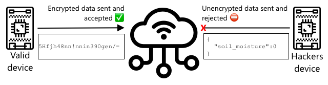

<!--
CO_OP_TRANSLATOR_METADATA:
{
  "original_hash": "81c437c568eee1b0dda1f04e88150d37",
  "translation_date": "2025-08-28T17:54:24+00:00",
  "source_file": "2-farm/lessons/6-keep-your-plant-secure/README.md",
  "language_code": "uk"
}
-->
# Захистіть свою рослину


> Скетчнот від [Nitya Narasimhan](https://github.com/nitya). Натисніть на зображення для збільшення.

## Тест перед лекцією

[Тест перед лекцією](https://black-meadow-040d15503.1.azurestaticapps.net/quiz/19)

## Вступ

У попередніх уроках ви створили IoT-пристрій для моніторингу ґрунту та підключили його до хмари. Але що, якщо хакери, які працюють на конкурента-фермера, захоплять контроль над вашими IoT-пристроями? Що, якщо вони надсилатимуть високі показники вологості ґрунту, щоб ваші рослини ніколи не поливалися, або включать систему поливу на постійний режим, що призведе до загибелі рослин через надмірне зволоження та значних витрат на воду?

У цьому уроці ви дізнаєтеся, як захистити IoT-пристрої. Оскільки це останній урок цього проєкту, ви також навчитеся очищати хмарні ресурси, щоб зменшити потенційні витрати.

У цьому уроці ми розглянемо:

* [Чому потрібно захищати IoT-пристрої?](../../../../../2-farm/lessons/6-keep-your-plant-secure)
* [Криптографія](../../../../../2-farm/lessons/6-keep-your-plant-secure)
* [Захист ваших IoT-пристроїв](../../../../../2-farm/lessons/6-keep-your-plant-secure)
* [Генерація та використання сертифіката X.509](../../../../../2-farm/lessons/6-keep-your-plant-secure)

> 🗑 Це останній урок у цьому проєкті, тому після завершення уроку та завдання не забудьте очистити ваші хмарні сервіси. Вам знадобляться ці сервіси для виконання завдання, тому спочатку переконайтеся, що завдання виконано.
>
> За потреби зверніться до [посібника з очищення проєкту](../../../clean-up.md) для отримання інструкцій.

## Чому потрібно захищати IoT-пристрої?

Безпека IoT передбачає забезпечення того, щоб лише очікувані пристрої могли підключатися до вашого хмарного IoT-сервісу та надсилати телеметрію, а також щоб лише ваш хмарний сервіс міг надсилати команди вашим пристроям. Дані IoT також можуть бути особистими, включаючи медичну або інтимну інформацію, тому вся ваша програма повинна враховувати безпеку, щоб запобігти витоку цих даних.

Якщо ваша IoT-програма не захищена, існує низка ризиків:

* Фальшивий пристрій може надсилати некоректні дані, змушуючи вашу програму реагувати неправильно. Наприклад, вони можуть надсилати постійно високі показники вологості ґрунту, через що ваша система зрошення ніколи не включатиметься, і ваші рослини загинуть від нестачі води.
* Неавторизовані користувачі можуть читати дані з IoT-пристроїв, включаючи особисту або критично важливу для бізнесу інформацію.
* Хакери можуть надсилати команди для управління пристроєм у спосіб, який може пошкодити пристрій або підключене обладнання.
* Підключившись до IoT-пристрою, хакери можуть використовувати його для доступу до додаткових мереж, отримуючи доступ до приватних систем.
* Зловмисники можуть отримати доступ до особистих даних і використовувати їх для шантажу.

Це реальні сценарії, які трапляються постійно. Деякі приклади були наведені в попередніх уроках, але ось ще кілька:

* У 2018 році хакери використали відкриту точку доступу WiFi на термостаті акваріума, щоб отримати доступ до мережі казино та викрасти дані. [The Hacker News - Casino Gets Hacked Through Its Internet-Connected Fish Tank Thermometer](https://thehackernews.com/2018/04/iot-hacking-thermometer.html)
* У 2016 році ботнет Mirai запустив атаку відмови в обслуговуванні проти Dyn, постачальника інтернет-послуг, що призвело до збоїв у роботі значної частини Інтернету. Цей ботнет використовував шкідливе програмне забезпечення для підключення до IoT-пристроїв, таких як DVR і камери, які використовували стандартні імена користувачів і паролі, і звідти запускав атаку. [The Guardian - DDoS attack that disrupted internet was largest of its kind in history, experts say](https://www.theguardian.com/technology/2016/oct/26/ddos-attack-dyn-mirai-botnet)
* Spiral Toys мали базу даних користувачів своїх підключених іграшок CloudPets, яка була доступна в Інтернеті. [Troy Hunt - Data from connected CloudPets teddy bears leaked and ransomed, exposing kids' voice messages](https://www.troyhunt.com/data-from-connected-cloudpets-teddy-bears-leaked-and-ransomed-exposing-kids-voice-messages/).
* Strava позначала бігунів, яких ви обганяли, і показувала їх маршрути, дозволяючи незнайомцям фактично бачити, де ви живете. [Kim Komndo - Fitness app could lead a stranger right to your home — change this setting](https://www.komando.com/security-privacy/strava-fitness-app-privacy/755349/).

✅ Проведіть дослідження: знайдіть більше прикладів зламів IoT та витоків даних IoT, особливо з особистими предметами, такими як підключені до Інтернету зубні щітки або ваги. Подумайте про вплив цих зламів на жертв або клієнтів.

> 💁 Безпека — це величезна тема, і цей урок торкнеться лише деяких основних аспектів, пов’язаних із підключенням вашого пристрою до хмари. Інші теми, які не будуть розглянуті, включають моніторинг змін даних під час передачі, злам пристроїв безпосередньо або зміни конфігурацій пристроїв. Злам IoT є настільки серйозною загрозою, що були розроблені інструменти, такі як [Azure Defender for IoT](https://azure.microsoft.com/services/azure-defender-for-iot/?WT.mc_id=academic-17441-jabenn). Ці інструменти схожі на антивірусні та засоби безпеки, які можуть бути на вашому комп’ютері, але розроблені для невеликих, малопотужних IoT-пристроїв.

## Криптографія

Коли пристрій підключається до IoT-сервісу, він використовує ідентифікатор для ідентифікації. Проблема полягає в тому, що цей ідентифікатор можна клонувати — хакер може налаштувати зловмисний пристрій, який використовує той самий ідентифікатор, що й реальний пристрій, але надсилає фальшиві дані.


Рішенням є перетворення даних, що надсилаються, у зашифрований формат, використовуючи певне значення, відоме лише пристрою та хмарі. Цей процес називається *шифруванням*, а значення, яке використовується для шифрування даних, називається *ключем шифрування*.



Хмарний сервіс може перетворити дані назад у читабельний формат, використовуючи процес, який називається *дешифруванням*, використовуючи той самий ключ шифрування або *ключ дешифрування*. Якщо зашифроване повідомлення не може бути дешифроване ключем, пристрій зламано, і повідомлення відхиляється.

Техніка шифрування та дешифрування називається *криптографією*.

### Рання криптографія

Найдавніші види криптографії — це шифри заміни, які датуються 3500 роками тому. Шифри заміни передбачають заміну однієї літери іншою. Наприклад, [шифр Цезаря](https://wikipedia.org/wiki/Caesar_cipher) передбачає зміщення алфавіту на певну кількість, причому лише відправник зашифрованого повідомлення та передбачуваний одержувач знають, на скільки літер змістити.

[Шифр Віженера](https://wikipedia.org/wiki/Vigenère_cipher) пішов далі, використовуючи слова для шифрування тексту, так що кожна літера в оригінальному тексті зміщувалася на різну кількість, а не завжди на однакову кількість літер.

Криптографія використовувалася для широкого спектра цілей, таких як захист рецепту глазурі гончара в стародавній Месопотамії, написання секретних любовних записок в Індії або збереження в таємниці магічних заклинань у стародавньому Єгипті.

### Сучасна криптографія

Сучасна криптографія набагато складніша, що робить її важчою для злому, ніж ранні методи. Сучасна криптографія використовує складну математику для шифрування даних із занадто великою кількістю можливих ключів, щоб зробити атаки методом перебору можливими.

Криптографія використовується багатьма способами для забезпечення безпечного зв’язку. Якщо ви читаєте цю сторінку на GitHub, ви можете помітити, що адреса веб-сайту починається з *HTTPS*, що означає, що зв’язок між вашим браузером і веб-серверами GitHub зашифрований. Якщо хтось зможе прочитати інтернет-трафік між вашим браузером і GitHub, він не зможе прочитати дані, оскільки вони зашифровані. Ваш комп’ютер може навіть зашифрувати всі дані на вашому жорсткому диску, щоб якщо хтось його вкраде, він не зміг прочитати жодних ваших даних без вашого пароля.

> 🎓 HTTPS означає HyperText Transfer Protocol **Secure**

На жаль, не все є безпечним. Деякі пристрої не мають захисту, інші захищені ключами, які легко зламати, або іноді навіть усі пристрої одного типу використовують один і той самий ключ. Були випадки, коли дуже особисті IoT-пристрої мали однаковий пароль для підключення до них через WiFi або Bluetooth. Якщо ви можете підключитися до свого пристрою, ви можете підключитися до чужого. Після підключення ви можете отримати доступ до дуже приватних даних або контролювати їхній пристрій.

> 💁 Незважаючи на складність сучасної криптографії та твердження, що злам шифрування може зайняти мільярди років, розвиток квантових обчислень призвів до можливості зламати все відоме шифрування за дуже короткий час!

### Симетричні та асиметричні ключі

Шифрування буває двох типів — симетричне та асиметричне.

**Симетричне** шифрування використовує один і той самий ключ для шифрування та дешифрування даних. І відправник, і одержувач повинні знати один і той самий ключ. Це найменш безпечний тип, оскільки ключ потрібно якось передати. Щоб відправник міг надіслати зашифроване повідомлення одержувачу, відправник спочатку може надіслати одержувачу ключ.


Якщо ключ буде викрадений під час передачі або відправник чи одержувач будуть зламані, і ключ буде знайдено, шифрування можна зламати.


**Асиметричне** шифрування використовує 2 ключі — ключ шифрування та ключ дешифрування, які називаються парою відкритого/приватного ключів. Відкритий ключ використовується для шифрування повідомлення, але не може бути використаний для його дешифрування, приватний ключ використовується для дешифрування повідомлення, але не може бути використаний для його шифрування.


Одержувач ділиться своїм відкритим ключем, і відправник використовує його для шифрування повідомлення. Після надсилання повідомлення одержувач дешифрує його за допомогою свого приватного ключа. Асиметричне шифрування є більш безпечним, оскільки приватний ключ залишається приватним для одержувача і ніколи не передається. Відкритий ключ може бути доступний будь-кому, оскільки його можна використовувати лише для шифрування повідомлень.

Симетричне шифрування швидше, ніж асиметричне, асиметричне є більш безпечним. Деякі системи використовують обидва — використовуючи асиметричне шифрування для шифрування та передачі симетричного ключа, а потім використовуючи симетричний ключ для шифрування всіх даних. Це робить передачу симетричного ключа між відправником і одержувачем більш безпечною, а шифрування та дешифрування даних — швидшим.

## Захист ваших IoT-пристроїв

IoT-пристрої можна захистити за допомогою симетричного або асиметричного шифрування. Симетричне шифрування є простішим, але менш безпечним.

### Симетричні ключі

Коли ви налаштовували свій IoT-пристрій для взаємодії з IoT Hub, ви використовували рядок підключення. Приклад рядка підключення:

```output
HostName=soil-moisture-sensor.azure-devices.net;DeviceId=soil-moisture-sensor;SharedAccessKey=Bhry+ind7kKEIDxubK61RiEHHRTrPl7HUow8cEm/mU0=
```

Цей рядок підключення складається з трьох частин, розділених крапкою з комою, причому кожна частина є ключем і значенням:

| Ключ | Значення | Опис |
| --- | ----- | ----------- |
| HostName | `soil-moisture-sensor.azure-devices.net` | URL IoT Hub |
| DeviceId | `soil-moisture-sensor` | Унікальний ідентифікатор пристрою |
| SharedAccessKey | `Bhry+ind7kKEIDxubK61RiEHHRTrPl7HUow8cEm/mU0=` | Симетричний ключ, відомий пристрою та IoT Hub |

Остання частина цього рядка підключення, `SharedAccessKey`, є симетричним ключем, відомим як пристрою, так і IoT Hub. Цей ключ ніколи не надсилається від пристрою до хмари або від хмари до пристрою. Натомість він використовується для шифрування даних, які надсилаються або отримуються.

✅ Проведіть експеримент. Як ви думаєте, що станеться, якщо змінити частину `SharedAccessKey` у рядку підключення під час підключення вашого IoT-пристрою? Спробуйте це.

Коли пристрій вперше намагається підключитися, він надсилає токен спільного доступу (SAS), що складається з URL IoT Hub, позначки часу, коли токен спільного доступу закінчиться (зазвичай через 1 день від поточного часу), і підпису. Цей підпис складається з URL і часу закінчення терміну дії, зашифрованих за допомогою ключа спіль
💁 Через обмежений час дії ваш пристрій IoT повинен знати точний час, який зазвичай отримується з сервера [NTP](https://wikipedia.org/wiki/Network_Time_Protocol). Якщо час неточний, з'єднання не вдасться встановити.
Після підключення всі дані, які надсилаються до IoT Hub з пристрою або до пристрою з IoT Hub, будуть зашифровані за допомогою спільного ключа доступу.

✅ Як ви думаєте, що станеться, якщо кілька пристроїв використовуватимуть один і той самий рядок підключення?

> 💁 Зберігати цей ключ у коді — це погана практика безпеки. Якщо хакер отримає ваш вихідний код, він зможе отримати ваш ключ. Це також ускладнює випуск коду, оскільки вам доведеться перекомпілювати його з оновленим ключем для кожного пристрою. Краще завантажувати цей ключ із апаратного модуля безпеки — чіпа на IoT-пристрої, який зберігає зашифровані значення, доступні для вашого коду.
>
> Під час навчання IoT часто простіше вставити ключ у код, як ви робили в попередньому уроці, але ви повинні переконатися, що цей ключ не потрапить у публічний контроль версій вихідного коду.

Пристрої мають 2 ключі та 2 відповідні рядки підключення. Це дозволяє обертати ключі — тобто перемикатися з одного ключа на інший, якщо перший буде скомпрометований, і згенерувати перший ключ заново.

### X.509 сертифікати

Коли ви використовуєте асиметричне шифрування з парою відкритого/закритого ключів, вам потрібно надати ваш відкритий ключ усім, хто хоче надіслати вам дані. Проблема полягає в тому, як отримувач вашого ключа може бути впевнений, що це дійсно ваш відкритий ключ, а не хтось інший, хто видає себе за вас? Замість надання ключа, ви можете надати ваш відкритий ключ у сертифікаті, який був перевірений довіреною третьою стороною, що називається X.509 сертифікатом.

X.509 сертифікати — це цифрові документи, які містять відкритий ключ із пари відкритого/закритого ключів. Зазвичай вони видаються однією з довірених організацій, які називаються [Центри сертифікації](https://wikipedia.org/wiki/Certificate_authority) (CA), і цифрово підписуються CA, щоб підтвердити, що ключ є дійсним і належить вам. Ви довіряєте сертифікату і тому, що відкритий ключ належить тому, хто зазначений у сертифікаті, тому що ви довіряєте CA, так само як ви довіряєте паспорту або водійському посвідченню, тому що довіряєте країні, яка його видала. Сертифікати коштують грошей, тому ви також можете "самопідписати" — тобто створити сертифікат самостійно, підписаний вами, для тестових цілей.

> 💁 Ви ніколи не повинні використовувати самопідписаний сертифікат для випуску в продакшн.

Ці сертифікати мають ряд полів, включаючи інформацію про те, від кого відкритий ключ, деталі CA, який його видав, термін дії сертифіката та сам відкритий ключ. Перед використанням сертифіката рекомендується перевірити його, переконавшись, що він був підписаний оригінальним CA.

✅ Ви можете ознайомитися з повним списком полів у сертифікаті в [Microsoft Understanding X.509 Public Key Certificates tutorial](https://docs.microsoft.com/azure/iot-hub/tutorial-x509-certificates?WT.mc_id=academic-17441-jabenn#certificate-fields)

При використанні X.509 сертифікатів і відправник, і отримувач матимуть свої власні відкриті та закриті ключі, а також X.509 сертифікати, які містять відкритий ключ. Вони обмінюються X.509 сертифікатами, використовуючи відкриті ключі один одного для шифрування даних, які вони надсилають, і свої власні закриті ключі для розшифрування даних, які вони отримують.


Однією з великих переваг використання X.509 сертифікатів є те, що їх можна використовувати між пристроями. Ви можете створити один сертифікат, завантажити його в IoT Hub і використовувати для всіх ваших пристроїв. Кожен пристрій просто повинен знати закритий ключ, щоб розшифрувати повідомлення, які він отримує від IoT Hub.

Сертифікат, який використовується вашим пристроєм для шифрування повідомлень, які він надсилає до IoT Hub, публікується Microsoft. Це той самий сертифікат, який використовують багато служб Azure, і він іноді вбудований у SDK.

> 💁 Пам’ятайте, відкритий ключ — це просто відкритий ключ. Відкритий ключ Azure можна використовувати лише для шифрування даних, які надсилаються до Azure, а не для їх розшифрування, тому його можна поширювати всюди, включаючи вихідний код. Наприклад, ви можете побачити його в [Azure IoT C SDK source code](https://github.com/Azure/azure-iot-sdk-c/blob/master/certs/certs.c).

✅ У X.509 сертифікатах багато термінів. Ви можете ознайомитися з визначеннями деяких термінів, які можуть зустрітися, у [The layman’s guide to X.509 certificate jargon](https://techcommunity.microsoft.com/t5/internet-of-things/the-layman-s-guide-to-x-509-certificate-jargon/ba-p/2203540?WT.mc_id=academic-17441-jabenn)

## Генерація та використання X.509 сертифіката

Кроки для генерації X.509 сертифіката:

1. Створіть пару відкритого/закритого ключів. Один із найпоширеніших алгоритмів для генерації пари відкритого/закритого ключів називається [Rivest–Shamir–Adleman](https://wikipedia.org/wiki/RSA_(cryptosystem))(RSA).

1. Надішліть відкритий ключ із пов’язаними даними для підпису, або через CA, або через самопідпис.

Azure CLI має команди для створення нової ідентичності пристрою в IoT Hub і автоматичного створення пари відкритого/закритого ключів та самопідписаного сертифіката.

> 💁 Якщо ви хочете побачити детальні кроки, замість використання Azure CLI, ви можете знайти їх у [Using OpenSSL to create self-signed certificates tutorial in the Microsoft IoT Hub documentation](https://docs.microsoft.com/azure/iot-hub/tutorial-x509-self-sign?WT.mc_id=academic-17441-jabenn)

### Завдання - створити ідентичність пристрою за допомогою X.509 сертифіката

1. Виконайте наступну команду, щоб зареєструвати нову ідентичність пристрою, автоматично створивши ключі та сертифікати:

    ```sh
    az iot hub device-identity create --device-id soil-moisture-sensor-x509 \
                                      --am x509_thumbprint \
                                      --output-dir . \
                                      --hub-name <hub_name>
    ```

    Замініть `<hub_name>` на ім’я, яке ви використовували для вашого IoT Hub.

    Це створить пристрій з ідентифікатором `soil-moisture-sensor-x509`, щоб відрізнити його від ідентичності пристрою, створеної в попередньому уроці. Ця команда також створить 2 файли в поточному каталозі:

    * `soil-moisture-sensor-x509-key.pem` - цей файл містить закритий ключ для пристрою.
    * `soil-moisture-sensor-x509-cert.pem` - це файл X.509 сертифіката для пристрою.

    Зберігайте ці файли в безпеці! Файл із закритим ключем не повинен потрапити в публічний контроль версій вихідного коду.

### Завдання - використати X.509 сертифікат у коді вашого пристрою

Пройдіть відповідний посібник, щоб підключити ваш IoT-пристрій до хмари за допомогою X.509 сертифіката:

* [Arduino - Wio Terminal](wio-terminal-x509.md)
* [Одноплатний комп’ютер - Raspberry Pi/Віртуальний IoT пристрій](single-board-computer-x509.md)

---

## 🚀 Виклик

Існує кілька способів створення, управління та видалення служб Azure, таких як Resource Groups та IoT Hubs. Один із способів — [Azure Portal](https://portal.azure.com?WT.mc_id=academic-17441-jabenn) — веб-інтерфейс, який надає вам GUI для управління вашими службами Azure.

Перейдіть на [portal.azure.com](https://portal.azure.com?WT.mc_id=academic-17441-jabenn) і досліджуйте портал. Спробуйте створити IoT Hub за допомогою порталу, а потім видалити його.

**Підказка** - при створенні служб через портал вам не потрібно створювати Resource Group заздалегідь, її можна створити під час створення служби. Переконайтеся, що ви видалили її, коли закінчите!

Ви можете знайти багато документації, навчальних посібників та керівництв щодо Azure Portal у [Azure portal documentation](https://docs.microsoft.com/azure/azure-portal/?WT.mc_id=academic-17441-jabenn).

## Післялекційний тест

[Післялекційний тест](https://black-meadow-040d15503.1.azurestaticapps.net/quiz/20)

## Огляд та самостійне навчання

* Ознайомтеся з історією криптографії на [History of cryptography page on Wikipedia](https://wikipedia.org/wiki/History_of_cryptography).
* Ознайомтеся з X.509 сертифікатами на [X.509 page on Wikipedia](https://wikipedia.org/wiki/X.509).

## Завдання

[Створіть новий IoT пристрій](assignment.md)

---

**Відмова від відповідальності**:  
Цей документ був перекладений за допомогою сервісу автоматичного перекладу [Co-op Translator](https://github.com/Azure/co-op-translator). Хоча ми прагнемо до точності, будь ласка, майте на увазі, що автоматичні переклади можуть містити помилки або неточності. Оригінальний документ на його рідній мові слід вважати авторитетним джерелом. Для критичної інформації рекомендується професійний людський переклад. Ми не несемо відповідальності за будь-які непорозуміння або неправильні тлумачення, що виникають внаслідок використання цього перекладу.