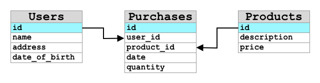

<!--
CO_OP_TRANSLATOR_METADATA:
{
  "original_hash": "e345843ccfeb7261d81500d19c64d476",
  "translation_date": "2025-08-28T16:57:59+00:00",
  "source_file": "3-transport/lessons/2-store-location-data/README.md",
  "language_code": "uk"
}
-->
# Зберігання даних про місцезнаходження


> Скетчнот від [Nitya Narasimhan](https://github.com/nitya). Натисніть на зображення, щоб переглянути його у більшому розмірі.

## Тест перед лекцією

[Тест перед лекцією](https://black-meadow-040d15503.1.azurestaticapps.net/quiz/23)

## Вступ

На попередньому уроці ви дізналися, як використовувати GPS-сенсор для збору даних про місцезнаходження. Щоб використовувати ці дані для візуалізації місцезнаходження вантажівки з продуктами та її маршруту, їх потрібно відправити до IoT-сервісу в хмарі, а потім десь зберегти.

На цьому уроці ви дізнаєтеся про різні способи зберігання IoT-даних і навчитеся зберігати дані з вашого IoT-сервісу за допомогою безсерверного коду.

На цьому уроці ми розглянемо:

* [Структуровані та неструктуровані дані](../../../../../3-transport/lessons/2-store-location-data)
* [Відправка GPS-даних до IoT Hub](../../../../../3-transport/lessons/2-store-location-data)
* [Гарячі, теплі та холодні шляхи](../../../../../3-transport/lessons/2-store-location-data)
* [Обробка GPS-подій за допомогою безсерверного коду](../../../../../3-transport/lessons/2-store-location-data)
* [Облікові записи Azure Storage](../../../../../3-transport/lessons/2-store-location-data)
* [Підключення безсерверного коду до сховища](../../../../../3-transport/lessons/2-store-location-data)

## Структуровані та неструктуровані дані

Комп'ютерні системи працюють із даними, які можуть мати різні форми та розміри. Вони можуть варіюватися від окремих чисел до великих обсягів тексту, відео, зображень і IoT-даних. Зазвичай дані поділяються на дві категорії — *структуровані* та *неструктуровані*.

* **Структуровані дані** — це дані з чітко визначеною, жорсткою структурою, яка не змінюється, і зазвичай відповідає таблицям даних із взаємозв'язками. Наприклад, це можуть бути дані про людину, включаючи її ім'я, дату народження та адресу.

* **Неструктуровані дані** — це дані без чітко визначеної, жорсткої структури, які можуть часто змінювати свою структуру. Наприклад, це можуть бути документи, такі як текстові файли або електронні таблиці.

✅ Проведіть дослідження: Чи можете ви придумати інші приклади структурованих і неструктурованих даних?

> 💁 Існують також напівструктуровані дані, які мають структуру, але не вписуються у фіксовані таблиці даних.

IoT-дані зазвичай вважаються неструктурованими.

Уявіть, що ви додаєте IoT-пристрої до парку транспортних засобів великої комерційної ферми. Ви можете використовувати різні пристрої для різних типів транспортних засобів. Наприклад:

* Для сільськогосподарських машин, таких як трактори, вам потрібні GPS-дані, щоб переконатися, що вони працюють на правильних полях.
* Для вантажівок, які перевозять продукти на склади, вам потрібні GPS-дані, а також дані про швидкість і прискорення, щоб переконатися, що водій їде безпечно, а також дані про ідентифікацію водія та початок/зупинку руху, щоб забезпечити дотримання місцевих законів про робочі години.
* Для рефрижераторних вантажівок вам також потрібні дані про температуру, щоб переконатися, що продукти не перегріваються або не замерзають під час транспортування.

Ці дані можуть постійно змінюватися. Наприклад, якщо IoT-пристрій знаходиться в кабіні вантажівки, то дані, які він надсилає, можуть змінюватися залежно від причепа, наприклад, надсилати дані про температуру лише тоді, коли використовується рефрижераторний причіп.

✅ Які ще IoT-дані можуть бути зібрані? Подумайте про типи вантажів, які можуть перевозити вантажівки, а також про дані технічного обслуговування.

Ці дані відрізняються від транспортного засобу до транспортного засобу, але всі вони надсилаються до одного IoT-сервісу для обробки. IoT-сервіс повинен мати можливість обробляти ці неструктуровані дані, зберігаючи їх у такий спосіб, щоб їх можна було шукати або аналізувати, але при цьому працювати з різними структурами цих даних.

### Зберігання SQL та NoSQL

Бази даних — це сервіси, які дозволяють зберігати та запитувати дані. Бази даних бувають двох типів — SQL та NoSQL.

#### SQL-бази даних

Перші бази даних були системами управління реляційними базами даних (RDBMS), або реляційними базами даних. Їх також називають SQL-базами даних через мову структурованих запитів (SQL), яка використовується для взаємодії з ними для додавання, видалення, оновлення або запиту даних. Ці бази даних складаються зі схеми — чітко визначеного набору таблиць даних, схожих на електронну таблицю. Кожна таблиця має кілька іменованих стовпців. Коли ви додаєте дані, ви додаєте рядок до таблиці, вставляючи значення в кожен зі стовпців. Це забезпечує дуже жорстку структуру даних — хоча ви можете залишати стовпці порожніми, якщо ви хочете додати новий стовпець, вам потрібно зробити це в базі даних, заповнивши значення для існуючих рядків. Ці бази даних є реляційними — одна таблиця може мати зв'язок з іншою.



Наприклад, якщо ви зберігаєте особисті дані користувачів у таблиці, у вас буде якийсь внутрішній унікальний ID для кожного користувача, який використовується в рядку таблиці, що містить ім'я та адресу користувача. Якщо ви хочете зберігати інші дані про цього користувача, наприклад, його покупки, в іншій таблиці, у вас буде один стовпець у новій таблиці для ID цього користувача. Коли ви шукаєте користувача, ви можете використовувати його ID, щоб отримати його особисті дані з однієї таблиці та його покупки з іншої.

SQL-бази даних ідеально підходять для зберігання структурованих даних і для випадків, коли ви хочете забезпечити відповідність даних вашій схемі.

✅ Якщо ви раніше не використовували SQL, знайдіть час, щоб ознайомитися з ним на [сторінці SQL у Вікіпедії](https://wikipedia.org/wiki/SQL).

Деякі відомі SQL-бази даних — це Microsoft SQL Server, MySQL і PostgreSQL.

✅ Проведіть дослідження: Ознайомтеся з деякими з цих SQL-баз даних та їх можливостями.

#### NoSQL-бази даних

NoSQL-бази даних називаються NoSQL, тому що вони не мають такої ж жорсткої структури, як SQL-бази даних. Їх також називають документними базами даних, оскільки вони можуть зберігати неструктуровані дані, такі як документи.

> 💁 Незважаючи на свою назву, деякі NoSQL-бази даних дозволяють використовувати SQL для запитів до даних.


NoSQL-бази даних не мають заздалегідь визначеної схеми, яка обмежує спосіб зберігання даних. Ви можете вставляти будь-які неструктуровані дані, зазвичай у вигляді JSON-документів. Ці документи можуть бути організовані в папки, подібно до файлів на вашому комп'ютері. Кожен документ може мати різні поля порівняно з іншими документами. Наприклад, якщо ви зберігаєте IoT-дані з ваших сільськогосподарських транспортних засобів, деякі з них можуть мати поля для даних акселерометра та швидкості, інші — поля для температури в причепі. Якщо ви додаєте новий тип вантажівки, наприклад, з вбудованими вагами для відстеження ваги перевезеного вантажу, ваш IoT-пристрій може додати це нове поле, і воно може бути збережене без будь-яких змін у базі даних.

Деякі відомі NoSQL-бази даних — це Azure CosmosDB, MongoDB і CouchDB.

✅ Проведіть дослідження: Ознайомтеся з деякими з цих NoSQL-баз даних та їх можливостями.

На цьому уроці ви будете використовувати NoSQL-сховище для зберігання IoT-даних.

## Відправка GPS-даних до IoT Hub

На попередньому уроці ви отримували GPS-дані з GPS-сенсора, підключеного до вашого IoT-пристрою. Щоб зберігати ці IoT-дані в хмарі, їх потрібно відправити до IoT-сервісу. Знову ж таки, ви будете використовувати Azure IoT Hub, той самий хмарний IoT-сервіс, який ви використовували в попередньому проєкті.


### Завдання — відправка GPS-даних до IoT Hub

1. Створіть новий IoT Hub, використовуючи безкоштовний тарифний план.

    > ⚠️ Ви можете звернутися до [інструкцій зі створення IoT Hub з проєкту 2, уроку 4](../../../2-farm/lessons/4-migrate-your-plant-to-the-cloud/README.md#create-an-iot-service-in-the-cloud), якщо це необхідно.

    Не забудьте створити нову групу ресурсів. Назвіть нову групу ресурсів `gps-sensor`, а новий IoT Hub — унікальним ім'ям на основі `gps-sensor`, наприклад, `gps-sensor-<ваше ім'я>`.

    > 💁 Якщо у вас все ще є ваш IoT Hub з попереднього проєкту, ви можете повторно використовувати його. Не забудьте використовувати ім'я цього IoT Hub і групи ресурсів, у якій він знаходиться, під час створення інших сервісів.

1. Додайте новий пристрій до IoT Hub. Назвіть цей пристрій `gps-sensor`. Отримайте рядок підключення для пристрою.

1. Оновіть код вашого пристрою, щоб відправляти GPS-дані до нового IoT Hub, використовуючи рядок підключення пристрою з попереднього кроку.

    > ⚠️ Ви можете звернутися до [інструкцій із підключення вашого пристрою до IoT з проєкту 2, уроку 4](../../../2-farm/lessons/4-migrate-your-plant-to-the-cloud/README.md#connect-your-device-to-the-iot-service), якщо це необхідно.

1. Коли ви відправляєте GPS-дані, робіть це у форматі JSON наступного вигляду:

    ```json
    {
        "gps" :
        {
            "lat" : <latitude>,
            "lon" : <longitude>
        }
    }
    ```

1. Відправляйте GPS-дані кожну хвилину, щоб не перевищити ваш денний ліміт повідомлень.

Якщо ви використовуєте Wio Terminal, не забудьте додати всі необхідні бібліотеки та встановити час за допомогою NTP-сервера. Ваш код також повинен переконатися, що він зчитав усі дані з послідовного порту перед відправкою GPS-координат, використовуючи існуючий код з попереднього уроку. Використовуйте наступний код для створення JSON-документа:

```cpp
DynamicJsonDocument doc(1024);
doc["gps"]["lat"] = gps.location.lat();
doc["gps"]["lon"] = gps.location.lng();
```

Якщо ви використовуєте віртуальний IoT-пристрій, не забудьте встановити всі необхідні бібліотеки, використовуючи віртуальне середовище.

Для Raspberry Pi та віртуального IoT-пристрою використовуйте існуючий код з попереднього уроку, щоб отримати значення широти та довготи, а потім відправте їх у правильному форматі JSON за допомогою наступного коду:

```python
message_json = { "gps" : { "lat":lat, "lon":lon } }
print("Sending telemetry", message_json)
message = Message(json.dumps(message_json))
```

> 💁 Ви можете знайти цей код у папках [code/wio-terminal](../../../../../3-transport/lessons/2-store-location-data/code/wio-terminal), [code/pi](../../../../../3-transport/lessons/2-store-location-data/code/pi) або [code/virtual-device](../../../../../3-transport/lessons/2-store-location-data/code/virtual-device).

Запустіть код вашого пристрою та переконайтеся, що повідомлення надходять до IoT Hub, використовуючи команду CLI `az iot hub monitor-events`.

## Гарячі, теплі та холодні шляхи

Дані, що надходять від IoT-пристрою до хмари, не завжди обробляються в реальному часі. Деякі дані потребують обробки в реальному часі, інші можуть бути оброблені трохи пізніше, а ще інші — значно пізніше. Потік даних до різних сервісів, які обробляють дані в різний час, називається гарячими, теплими та холодними шляхами.

### Гарячий шлях

Гарячий шлях стосується даних, які потрібно обробляти в реальному часі або майже в реальному часі. Ви б використовували гарячі дані для сповіщень, наприклад, коли транспортний засіб наближається до складу або коли температура в рефрижераторній вантажівці занадто висока.

Щоб використовувати гарячі дані, ваш код повинен реагувати на події, як тільки вони надходять до ваших хмарних сервісів.

### Теплий шлях

Теплий шлях стосується даних, які можуть бути оброблені через короткий час після отримання, наприклад, для звітів або короткострокової аналітики. Ви б використовували теплі дані для щоденних звітів про пробіг транспортних засобів, використовуючи дані, зібрані попереднього дня.

Теплі дані зберігаються після отримання хмарним сервісом у якомусь сховищі, до якого можна швидко отримати доступ.

### Холодний шлях

Холодний шлях стосується історичних даних, які зберігаються довгостроково для обробки за потреби. Наприклад, ви могли б використовувати холодний шлях для отримання річних звітів про пробіг транспортних засобів або для аналізу маршрутів з метою пошуку найбільш оптимального маршруту для зменшення витрат на паливо.

Холодні дані зберігаються в сховищах даних — базах даних, призначених для зберігання великих обсягів даних, які ніколи не змінюються і можуть бути швидко та легко запитані. Зазвичай у вашому хмарному додатку є регулярне завдання, яке запускається в певний час кожного дня, тижня або місяця для переміщення даних із теплого сховища до сховища даних.

✅ Подумайте про дані, які ви зібрали на цих уроках. Це гарячі, теплі чи холодні дані?

## Обробка GPS-подій за допомогою безсерверного коду

Коли дані надходять до вашого IoT Hub, ви можете написати безсерверний код, який буде слухати події, опубліковані на сумісній з Event Hub кінцевій точці. Це теплий шлях — ці дані будуть збережені та використані на наступному уроці для створення звітів про маршрут.


### Зав
> ⚠️ Ви можете звернутися до [інструкцій зі створення проекту Azure Functions з проекту 2, уроку 5](../../../2-farm/lessons/5-migrate-application-to-the-cloud/README.md#create-a-serverless-application), якщо це необхідно.
1. Додайте тригер події IoT Hub, який використовує сумісну кінцеву точку Event Hub IoT Hub.

    > ⚠️ Ви можете звернутися до [інструкцій зі створення тригера події IoT Hub з проєкту 2, уроку 5](../../../2-farm/lessons/5-migrate-application-to-the-cloud/README.md#create-an-iot-hub-event-trigger), якщо це необхідно.

1. Встановіть рядок підключення сумісної кінцевої точки Event Hub у файлі `local.settings.json` і використовуйте ключ для цього запису у файлі `function.json`.

1. Використовуйте додаток Azurite як емулятор локального сховища.

1. Запустіть ваш додаток функцій, щоб переконатися, що він отримує події від вашого GPS-пристрою. Переконайтеся, що ваш IoT-пристрій також працює і надсилає GPS-дані.

    ```output
    Python EventHub trigger processed an event: {"gps": {"lat": 47.73481, "lon": -122.25701}}
    ```

## Облікові записи сховища Azure


Облікові записи сховища Azure — це універсальна служба зберігання даних, яка може зберігати дані різними способами. Ви можете зберігати дані як блоби, у чергах, у таблицях або як файли, і все це одночасно.

### Зберігання блобів

Слово *Blob* означає великі двійкові об'єкти, але стало терміном для будь-яких неструктурованих даних. Ви можете зберігати будь-які дані у сховищі блобів, від JSON-документів, що містять дані IoT, до зображень і відеофайлів. Сховище блобів має концепцію *контейнерів*, названих "відрами", у яких можна зберігати дані, схожі на таблиці в реляційній базі даних. Ці контейнери можуть мати одну або кілька папок для зберігання блобів, і кожна папка може містити інші папки, схожі на те, як файли зберігаються на жорсткому диску вашого комп'ютера.

У цьому уроці ви будете використовувати сховище блобів для зберігання даних IoT.

✅ Проведіть дослідження: Ознайомтеся з [Azure Blob Storage](https://docs.microsoft.com/azure/storage/blobs/storage-blobs-overview?WT.mc_id=academic-17441-jabenn)

### Зберігання таблиць

Зберігання таблиць дозволяє зберігати напівструктуровані дані. Зберігання таблиць фактично є NoSQL базою даних, тому не вимагає попередньо визначеного набору таблиць, але призначене для зберігання даних в одній або кількох таблицях з унікальними ключами для визначення кожного рядка.

✅ Проведіть дослідження: Ознайомтеся з [Azure Table Storage](https://docs.microsoft.com/azure/storage/tables/table-storage-overview?WT.mc_id=academic-17441-jabenn)

### Зберігання черг

Зберігання черг дозволяє зберігати повідомлення розміром до 64 КБ у черзі. Ви можете додавати повідомлення в кінець черги і читати їх з початку. Черги зберігають повідомлення необмежений час, поки є місце для зберігання, що дозволяє зберігати повідомлення довгостроково, а потім читати їх, коли це необхідно. Наприклад, якщо ви хочете запускати щомісячну задачу для обробки GPS-даних, ви можете додавати їх у чергу щодня протягом місяця, а потім наприкінці місяця обробити всі повідомлення з черги.

✅ Проведіть дослідження: Ознайомтеся з [Azure Queue Storage](https://docs.microsoft.com/azure/storage/queues/storage-queues-introduction?WT.mc_id=academic-17441-jabenn)

### Зберігання файлів

Зберігання файлів — це зберігання файлів у хмарі, і будь-які додатки або пристрої можуть підключатися за допомогою стандартних галузевих протоколів. Ви можете записувати файли у сховище файлів, а потім монтувати його як диск на вашому ПК або Mac.

✅ Проведіть дослідження: Ознайомтеся з [Azure File Storage](https://docs.microsoft.com/azure/storage/files/storage-files-introduction?WT.mc_id=academic-17441-jabenn)

## Підключіть ваш безсерверний код до сховища

Ваш додаток функцій тепер має підключитися до сховища блобів, щоб зберігати повідомлення з IoT Hub. Є два способи зробити це:

* У коді функції підключитися до сховища блобів за допомогою Python SDK для блобів і записати дані як блоби.
* Використовувати прив'язку вихідної функції, щоб прив'язати значення, яке повертає функція, до сховища блобів і автоматично зберегти блоб.

У цьому уроці ви будете використовувати Python SDK, щоб побачити, як взаємодіяти зі сховищем блобів.


Дані будуть збережені як JSON-блоб у наступному форматі:

```json
{
    "device_id": <device_id>,
    "timestamp" : <time>,
    "gps" :
    {
        "lat" : <latitude>,
        "lon" : <longitude>
    }
}
```

### Завдання - підключіть ваш безсерверний код до сховища

1. Створіть обліковий запис сховища Azure. Назвіть його щось на кшталт `gps<ваше ім'я>`.

    > ⚠️ Ви можете звернутися до [інструкцій зі створення облікового запису сховища з проєкту 2, уроку 5](../../../2-farm/lessons/5-migrate-application-to-the-cloud/README.md#task---create-the-cloud-resources), якщо це необхідно.

    Якщо у вас все ще є обліковий запис сховища з попереднього проєкту, ви можете повторно використовувати його.

    > 💁 Ви зможете використовувати той самий обліковий запис сховища для розгортання вашого додатка Azure Functions пізніше в цьому уроці.

1. Запустіть наступну команду, щоб отримати рядок підключення для облікового запису сховища:

    ```sh
    az storage account show-connection-string --output table \
                                              --name <storage_name>
    ```

    Замініть `<storage_name>` на назву облікового запису сховища, який ви створили на попередньому кроці.

1. Додайте новий запис у файл `local.settings.json` для рядка підключення вашого облікового запису сховища, використовуючи значення з попереднього кроку. Назвіть його `STORAGE_CONNECTION_STRING`.

1. Додайте наступне до файлу `requirements.txt`, щоб встановити пакети Pip для сховища Azure:

    ```sh
    azure-storage-blob
    ```

    Встановіть пакети з цього файлу у вашому віртуальному середовищі.

    > Якщо ви отримуєте помилку, оновіть вашу версію Pip у віртуальному середовищі до останньої версії за допомогою наступної команди, а потім спробуйте знову:
    >
    > ```sh
    > pip install --upgrade pip
    > ```

1. У файлі `__init__.py` для `iot-hub-trigger` додайте наступні імпортовані модулі:

    ```python
    import json
    import os
    import uuid
    from azure.storage.blob import BlobServiceClient, PublicAccess
    ```

    Модуль `json` системи буде використовуватися для читання і запису JSON, модуль `os` системи буде використовуватися для читання рядка підключення, модуль `uuid` системи буде використовуватися для генерації унікального ідентифікатора для GPS-зчитування.

    Пакет `azure.storage.blob` містить Python SDK для роботи зі сховищем блобів.

1. Перед методом `main` додайте наступну допоміжну функцію:

    ```python
    def get_or_create_container(name):
        connection_str = os.environ['STORAGE_CONNECTION_STRING']
        blob_service_client = BlobServiceClient.from_connection_string(connection_str)
    
        for container in blob_service_client.list_containers():
            if container.name == name:
                return blob_service_client.get_container_client(container.name)
        
        return blob_service_client.create_container(name, public_access=PublicAccess.Container)
    ```

    Python SDK для блобів не має допоміжного методу для створення контейнера, якщо він не існує. Цей код завантажить рядок підключення з файлу `local.settings.json` (або з налаштувань додатка після розгортання в хмарі), потім створить клас `BlobServiceClient` для взаємодії з обліковим записом сховища блобів. Він потім перебирає всі контейнери для облікового запису сховища блобів, шукаючи той, який має надане ім'я - якщо він знайде його, то поверне клас `ContainerClient`, який може взаємодіяти з контейнером для створення блобів. Якщо він не знайде його, то контейнер буде створений, і клієнт для нового контейнера буде повернений.

    Коли новий контейнер створюється, надається публічний доступ для запиту блобів у контейнері. Це буде використано в наступному уроці для візуалізації GPS-даних на карті.

1. На відміну від вологості ґрунту, у цьому коді ми хочемо зберігати кожну подію, тому додайте наступний код всередині циклу `for event in events:` у функції `main`, нижче заяви `logging`:

    ```python
    device_id = event.iothub_metadata['connection-device-id']
    blob_name = f'{device_id}/{str(uuid.uuid1())}.json'
    ```

    Цей код отримує ідентифікатор пристрою з метаданих події, а потім використовує його для створення імені блоба. Блоби можуть бути збережені в папках, і ідентифікатор пристрою буде використаний для назви папки, тому кожен пристрій матиме всі свої GPS-події в одній папці. Ім'я блоба — це ця папка, за якою слідує назва документа, розділена косими рисками, схожими на шляхи Linux і macOS (схожі також на Windows, але Windows використовує зворотні риски). Назва документа — це унікальний ідентифікатор, створений за допомогою модуля Python `uuid`, з типом файлу `json`.

    Наприклад, для ідентифікатора пристрою `gps-sensor` ім'я блоба може бути `gps-sensor/a9487ac2-b9cf-11eb-b5cd-1e00621e3648.json`.

1. Додайте наступний код нижче цього:

    ```python
    container_client = get_or_create_container('gps-data')
    blob = container_client.get_blob_client(blob_name)
    ```

    Цей код отримує клієнт контейнера за допомогою допоміжного класу `get_or_create_container`, а потім отримує об'єкт клієнта блоба за допомогою імені блоба. Ці клієнти блобів можуть стосуватися існуючих блобів або, як у цьому випадку, нових блобів.

1. Додайте наступний код після цього:

    ```python
    event_body = json.loads(event.get_body().decode('utf-8'))
    blob_body = {
        'device_id' : device_id,
        'timestamp' : event.iothub_metadata['enqueuedtime'],
        'gps': event_body['gps']
    }
    ```

    Це створює тіло блоба, яке буде записано у сховище блобів. Це JSON-документ, що містить ідентифікатор пристрою, час, коли телеметрія була надіслана до IoT Hub, і GPS-координати з телеметрії.

    > 💁 Важливо використовувати час, коли повідомлення було поставлено в чергу, а не поточний час, щоб отримати час, коли повідомлення було надіслано. Воно може залишатися в хабі деякий час, перш ніж бути отриманим, якщо додаток функцій не працює.

1. Додайте наступне нижче цього коду:

    ```python
    logging.info(f'Writing blob to {blob_name} - {blob_body}')
    blob.upload_blob(json.dumps(blob_body).encode('utf-8'))
    ```

    Цей код реєструє, що блоб збирається бути записаним з його деталями, а потім завантажує тіло блоба як вміст нового блоба.

1. Запустіть додаток функцій. Ви побачите, як блоби записуються для всіх GPS-подій у вихідних даних:

    ```output
    [2021-05-21T01:31:14.325Z] Python EventHub trigger processed an event: {"gps": {"lat": 47.73092, "lon": -122.26206}}
    ...
    [2021-05-21T01:31:14.351Z] Writing blob to gps-sensor/4b6089fe-ba8d-11eb-bc7b-1e00621e3648.json - {'device_id': 'gps-sensor', 'timestamp': '2021-05-21T00:57:53.878Z', 'gps': {'lat': 47.73092, 'lon': -122.26206}}
    ```

    > 💁 Переконайтеся, що ви не запускаєте монітор подій IoT Hub одночасно.

> 💁 Ви можете знайти цей код у папці [code/functions](../../../../../3-transport/lessons/2-store-location-data/code/functions).

### Завдання - перевірте завантажені блоби

1. Щоб переглянути створені блоби, ви можете використовувати [Azure Storage Explorer](https://azure.microsoft.com/features/storage-explorer/?WT.mc_id=academic-17441-jabenn), безкоштовний інструмент, який дозволяє переглядати і керувати вашими обліковими записами сховища, або через CLI.

    1. Щоб використовувати CLI, спочатку вам знадобиться ключ облікового запису. Запустіть наступну команду, щоб отримати цей ключ:

        ```sh
        az storage account keys list --output table \
                                     --account-name <storage_name>
        ```

        Замініть `<storage_name>` на назву облікового запису сховища.

        Скопіюйте значення `key1`.

    1. Запустіть наступну команду, щоб перелічити блоби в контейнері:

        ```sh
        az storage blob list --container-name gps-data \
                             --output table \
                             --account-name <storage_name> \
                             --account-key <key1>
        ```

        Замініть `<storage_name>` на назву облікового запису сховища, а `<key1>` на значення `key1`, яке ви скопіювали на попередньому кроці.

        Це перелічить всі блоби в контейнері:

        ```output
        Name                                                  Blob Type    Blob Tier    Length    Content Type              Last Modified              Snapshot
        ----------------------------------------------------  -----------  -----------  --------  ------------------------  -------------------------  ----------
        gps-sensor/1810d55e-b9cf-11eb-9f5b-1e00621e3648.json  BlockBlob    Hot          45        application/octet-stream  2021-05-21T00:54:27+00:00
        gps-sensor/18293e46-b9cf-11eb-9f5b-1e00621e3648.json  BlockBlob    Hot          45        application/octet-stream  2021-05-21T00:54:28+00:00
        gps-sensor/1844549c-b9cf-11eb-9f5b-1e00621e3648.json  BlockBlob    Hot          45        application/octet-stream  2021-05-21T00:54:28+00:00
        gps-sensor/1894d714-b9cf-11eb-9f5b-1e00621e3648.json  BlockBlob    Hot          45        application/octet-stream  2021-05-21T00:54:28+00:00
        ```

    1. Завантажте один із блобів за допомогою наступної команди:

        ```sh
        az storage blob download --container-name gps-data \
                                 --account-name <storage_name> \
                                 --account-key <key1> \
                                 --name <blob_name> \
                                 --file <file_name>
        ```

        Замініть `<storage_name>` на назву облікового запису сховища, а `<key1>` на значення `key1`, яке ви скопіювали на попередньому кроці.

        Замініть `<blob_name>` на повне ім'я з колонки `Name` вихідних даних попереднього кроку, включаючи назву папки. Замініть `<file_name>` на назву локального файлу для збереження блоба.

    Після завантаження ви можете відкрити JSON-файл у VS Code, і ви побачите блоб, що містить деталі GPS-локації:

    ```json
    {"device_id": "gps-sensor", "timestamp": "2021-05-21T00:57:53.878Z", "gps": {"lat": 47.73092, "lon": -122.26206}}
    ```

### Завдання - розгорніть ваш додаток функцій у хмару

Тепер, коли ваш додаток функцій працює, ви можете розгорнути його у хмару.

1. Створіть новий додаток Azure Functions, використовуючи обліковий запис сховища, який ви створили раніше. Назвіть його щось на кшталт `gps-sensor-` і додайте унікальний ідентифікатор в кінці, наприклад, кілька випадкових слів або ваше ім'я.

    > ⚠️ Ви можете звернутися до [інструкцій зі створення додатка Functions з проєкту 2, уроку 5](../../../2-farm/lessons/5-migrate-application-to-the-cloud/README.md#task---create-the-cloud-resources), якщо це необхідно.

1. Завантажте значення `IOT_HUB_CONNECTION_STRING` і `STORAGE_CONNECTION_STRING` у налаштування додатка.

    > ⚠️ Ви можете звернутися до [інструкцій зі завантаження налаштувань додатка з проєкту 2, уроку 5](../../../2-farm/lessons/5-migrate-application-to-the-cloud/README.md#task---upload-your-application-settings), якщо це необхідно.

1. Розгорніть ваш локальний додаток Functions у хмару.
> ⚠️ Ви можете звернутися до [інструкцій щодо розгортання вашого додатка Functions з проєкту 2, уроку 5](../../../2-farm/lessons/5-migrate-application-to-the-cloud/README.md#task---deploy-your-functions-app-to-the-cloud), якщо це необхідно.
## 🚀 Виклик

Дані GPS не завжди є абсолютно точними, і визначені місця можуть відхилятися на кілька метрів або навіть більше, особливо в тунелях та районах із високими будівлями.

Подумайте, як супутникова навігація може подолати цю проблему? Які дані має ваша навігаційна система, що дозволяють їй робити точніші прогнози вашого місцезнаходження?

## Тест після лекції

[Тест після лекції](https://black-meadow-040d15503.1.azurestaticapps.net/quiz/24)

## Огляд і самостійне навчання

* Прочитайте про структуровані дані на [сторінці про модель даних у Вікіпедії](https://wikipedia.org/wiki/Data_model)
* Прочитайте про напівструктуровані дані на [сторінці про напівструктуровані дані у Вікіпедії](https://wikipedia.org/wiki/Semi-structured_data)
* Прочитайте про неструктуровані дані на [сторінці про неструктуровані дані у Вікіпедії](https://wikipedia.org/wiki/Unstructured_data)
* Дізнайтеся більше про Azure Storage та різні типи зберігання даних у [документації Azure Storage](https://docs.microsoft.com/azure/storage/?WT.mc_id=academic-17441-jabenn)

## Завдання

[Дослідіть прив’язки функцій](assignment.md)

---

**Відмова від відповідальності**:  
Цей документ був перекладений за допомогою сервісу автоматичного перекладу [Co-op Translator](https://github.com/Azure/co-op-translator). Хоча ми прагнемо до точності, будь ласка, майте на увазі, що автоматичні переклади можуть містити помилки або неточності. Оригінальний документ на його рідній мові слід вважати авторитетним джерелом. Для критично важливої інформації рекомендується професійний людський переклад. Ми не несемо відповідальності за будь-які непорозуміння або неправильні тлумачення, що виникають внаслідок використання цього перекладу.