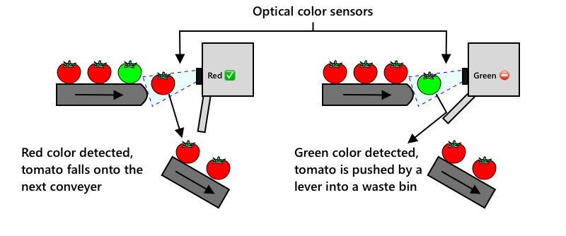

<!--
CO_OP_TRANSLATOR_METADATA:
{
  "original_hash": "f5e63c916d2dd97d58be12aaf76bd9f1",
  "translation_date": "2025-08-28T15:45:56+00:00",
  "source_file": "4-manufacturing/lessons/1-train-fruit-detector/README.md",
  "language_code": "uk"
}
-->
# Навчання детектора якості фруктів


> Скетчнот від [Nitya Narasimhan](https://github.com/nitya). Натисніть на зображення, щоб побачити його у більшому розмірі.

Це відео дає огляд сервісу Azure Custom Vision, який буде розглянуто в цьому уроці.

[](https://www.youtube.com/watch?v=TETcDLJlWR4)

> 🎥 Натисніть на зображення вище, щоб переглянути відео

## Тест перед лекцією

[Тест перед лекцією](https://black-meadow-040d15503.1.azurestaticapps.net/quiz/29)

## Вступ

Останній розвиток штучного інтелекту (AI) та машинного навчання (ML) надає сучасним розробникам широкий спектр можливостей. Моделі ML можуть бути навчені розпізнавати різні об'єкти на зображеннях, включаючи недозрілі фрукти, що може бути використано в IoT-пристроях для сортування продукції під час збору врожаю або обробки на фабриках чи складах.

У цьому уроці ви дізнаєтеся про класифікацію зображень — використання моделей ML для розрізнення зображень різних об'єктів. Ви навчитеся тренувати класифікатор зображень для розрізнення між якісними та неякісними фруктами: недозрілими, перезрілими, пошкодженими чи гнилими.

У цьому уроці ми розглянемо:

* [Використання AI та ML для сортування їжі](../../../../../4-manufacturing/lessons/1-train-fruit-detector)
* [Класифікація зображень за допомогою машинного навчання](../../../../../4-manufacturing/lessons/1-train-fruit-detector)
* [Навчання класифікатора зображень](../../../../../4-manufacturing/lessons/1-train-fruit-detector)
* [Тестування вашого класифікатора зображень](../../../../../4-manufacturing/lessons/1-train-fruit-detector)
* [Перенавчання вашого класифікатора зображень](../../../../../4-manufacturing/lessons/1-train-fruit-detector)

## Використання AI та ML для сортування їжі

Годування світового населення є складним завданням, особливо за ціною, яка робить їжу доступною для всіх. Однією з найбільших витрат є праця, тому фермери все частіше звертаються до автоматизації та інструментів, таких як IoT, щоб зменшити витрати на робочу силу. Збір врожаю вручну є трудомістким (і часто виснажливим), і його замінюють машини, особливо в багатших країнах. Незважаючи на економію витрат завдяки використанню машин для збору врожаю, є недолік — здатність сортувати їжу під час збору.

Не всі культури дозрівають рівномірно. Наприклад, на томатах можуть залишатися зелені плоди на лозі, коли більшість уже готова до збору. Хоча збирати їх зарано — це марнотратство, фермеру дешевше і простіше зібрати все за допомогою машин і потім позбутися недозрілої продукції.

✅ Подивіться на різні фрукти чи овочі, які ростуть поблизу вас на фермах, у вашому саду чи в магазинах. Чи всі вони однаково дозрілі, чи ви бачите різницю?

Зростання автоматизованого збору врожаю перенесло сортування продукції з поля на фабрику. Їжа транспортувалася на довгих конвеєрних стрічках, де команди людей перебирали продукцію, видаляючи все, що не відповідало необхідним стандартам якості. Збір врожаю став дешевшим завдяки машинам, але все ще залишалися витрати на ручне сортування їжі.



Наступною еволюцією стало використання машин для сортування, які вбудовувалися в комбайн або використовувалися на переробних заводах. Перше покоління таких машин використовувало оптичні сенсори для виявлення кольорів, керуючи механізмами, які скидали зелені томати в сміттєвий контейнер за допомогою важелів або потоків повітря, залишаючи червоні томати на конвеєрній стрічці.

У цьому відео, коли томати падають з одного конвеєра на інший, зелені томати виявляються і скидаються в контейнер за допомогою важелів.

✅ Які умови потрібні у фабриці чи на полі, щоб ці оптичні сенсори працювали правильно?

Останні еволюції цих машин для сортування використовують AI та ML, застосовуючи моделі, навчені розрізняти якісну продукцію від неякісної не лише за очевидними відмінностями в кольорі, такими як зелені томати проти червоних, але й за більш тонкими відмінностями у зовнішньому вигляді, які можуть вказувати на хвороби чи пошкодження.

## Класифікація зображень за допомогою машинного навчання

Традиційне програмування передбачає, що ви берете дані, застосовуєте до них алгоритм і отримуєте результат. Наприклад, у попередньому проєкті ви брали GPS-координати та геозону, застосовували алгоритм, наданий Azure Maps, і отримували результат, чи знаходиться точка всередині геозони чи поза нею. Ви вводите більше даних — отримуєте більше результатів.


Машинне навчання перевертає цей процес — ви починаєте з даних і відомих результатів, і алгоритм машинного навчання навчається на цих даних. Потім ви можете взяти цей навчений алгоритм, який називається *моделлю машинного навчання* або *моделлю*, і вводити нові дані, щоб отримувати нові результати.

> 🎓 Процес навчання алгоритму машинного навчання на даних називається *тренуванням*. Вхідні дані та відомі результати називаються *тренувальними даними*.

Наприклад, ви можете надати моделі мільйони зображень недозрілих бананів як вхідні тренувальні дані з результатом `недозрілий`, і мільйони зображень дозрілих бананів з результатом `дозрілий`. Алгоритм ML створить модель на основі цих даних. Потім ви надаєте цій моделі нове зображення банана, і вона передбачає, чи є банан дозрілим чи недозрілим.

> 🎓 Результати моделей ML називаються *передбаченнями*.


Моделі ML не дають бінарної відповіді, натомість вони дають ймовірності. Наприклад, модель може отримати зображення банана і передбачити `дозрілий` з ймовірністю 99.7% і `недозрілий` з ймовірністю 0.3%. Ваш код потім вибере найкраще передбачення і вирішить, що банан дозрілий.

Модель ML, яка використовується для виявлення зображень, як у цьому прикладі, називається *класифікатором зображень* — вона отримує зображення з мітками і класифікує нові зображення на основі цих міток.

> 💁 Це спрощене пояснення, і є багато інших способів навчання моделей, які не завжди потребують міток, наприклад, неконтрольоване навчання. Якщо ви хочете дізнатися більше про ML, ознайомтеся з [ML для початківців, 24-урочним курсом з машинного навчання](https://aka.ms/ML-beginners).

## Навчання класифікатора зображень

Щоб успішно навчити класифікатор зображень, вам потрібні мільйони зображень. Як виявляється, якщо у вас вже є класифікатор зображень, навчений на мільйонах або мільярдах різноманітних зображень, ви можете повторно використовувати його і перенавчити, використовуючи невеликий набір зображень, отримуючи чудові результати завдяки процесу, який називається *перенос навчання*.

> 🎓 Перенос навчання — це процес, коли ви переносите знання з існуючої моделі ML на нову модель на основі нових даних.

Коли класифікатор зображень навчений на широкому спектрі зображень, його внутрішні механізми добре розпізнають форми, кольори та візерунки. Перенос навчання дозволяє моделі використовувати ці знання для розпізнавання нових зображень.


Це можна уявити як дитячі книжки з формами, де, навчившись розпізнавати півколо, прямокутник і трикутник, ви можете розпізнати вітрильник або кота залежно від конфігурації цих форм. Класифікатор зображень розпізнає форми, а перенос навчання навчає його, яка комбінація створює човен або кота — або дозрілий банан.

Існує широкий спектр інструментів, які можуть допомогти вам у цьому, включаючи хмарні сервіси, які дозволяють навчати вашу модель, а потім використовувати її через веб-API.

> 💁 Навчання цих моделей потребує великої обчислювальної потужності, зазвичай через графічні процесори (GPU). Те саме спеціалізоване обладнання, яке робить ігри на вашій Xbox вражаючими, також може використовуватися для навчання моделей машинного навчання. Використовуючи хмару, ви можете орендувати час на потужних комп'ютерах з GPU для навчання цих моделей, отримуючи доступ до необхідної обчислювальної потужності лише на час, коли вона вам потрібна.

## Custom Vision

Custom Vision — це хмарний інструмент для навчання класифікаторів зображень. Він дозволяє навчати класифікатор, використовуючи лише невелику кількість зображень. Ви можете завантажувати зображення через веб-портал, веб-API або SDK, додаючи до кожного зображення *тег*, який вказує на класифікацію цього зображення. Потім ви навчаєте модель і тестуєте її, щоб побачити, наскільки добре вона працює. Коли ви задоволені моделлю, ви можете публікувати її версії, які можна використовувати через веб-API або SDK.


> 💁 Ви можете навчити модель Custom Vision, використовуючи лише 5 зображень на класифікацію, але більше — краще. Ви отримаєте кращі результати, якщо використаєте щонайменше 30 зображень.

Custom Vision є частиною ряду AI-інструментів від Microsoft під назвою Cognitive Services. Це AI-інструменти, які можна використовувати або без навчання, або з невеликою кількістю навчання. Вони включають розпізнавання та переклад мови, розуміння тексту та аналіз зображень. Вони доступні з безкоштовним тарифом як сервіси в Azure.

> 💁 Безкоштовний тариф цілком достатній для створення моделі, її навчання та використання для розробки. Ви можете дізнатися про обмеження безкоштовного тарифу на [сторінці обмежень і квот Custom Vision у документації Microsoft](https://docs.microsoft.com/azure/cognitive-services/custom-vision-service/limits-and-quotas?WT.mc_id=academic-17441-jabenn).

### Завдання — створення ресурсу Cognitive Services

Щоб використовувати Custom Vision, спочатку потрібно створити два ресурси Cognitive Services в Azure за допомогою Azure CLI: один для навчання Custom Vision і один для прогнозування Custom Vision.

1. Створіть групу ресурсів для цього проєкту під назвою `fruit-quality-detector`.

1. Використовуйте наступну команду, щоб створити безкоштовний ресурс для навчання Custom Vision:

    ```sh
    az cognitiveservices account create --name fruit-quality-detector-training \
                                        --resource-group fruit-quality-detector \
                                        --kind CustomVision.Training \
                                        --sku F0 \
                                        --yes \
                                        --location <location>
    ```

    Замініть `<location>` на місце, яке ви використовували під час створення групи ресурсів.

    Це створить ресурс для навчання Custom Vision у вашій групі ресурсів. Він буде називатися `fruit-quality-detector-training` і використовуватиме SKU `F0`, що є безкоштовним тарифом. Опція `--yes` означає, що ви погоджуєтеся з умовами використання Cognitive Services.

> 💁 Використовуйте SKU `S0`, якщо у вас вже є безкоштовний обліковий запис, який використовує будь-який із Cognitive Services.

1. Використовуйте наступну команду, щоб створити безкоштовний ресурс для прогнозування Custom Vision:

    ```sh
    az cognitiveservices account create --name fruit-quality-detector-prediction \
                                        --resource-group fruit-quality-detector \
                                        --kind CustomVision.Prediction \
                                        --sku F0 \
                                        --yes \
                                        --location <location>
    ```

    Замініть `<location>` на місце, яке ви використовували під час створення групи ресурсів.

    Це створить ресурс для прогнозування Custom Vision у вашій групі ресурсів. Він буде називатися `fruit-quality-detector-prediction` і використовуватиме SKU `F0`, що є безкоштовним тарифом. Опція `--yes` означає, що ви погоджуєтеся з умовами використання Cognitive Services.

### Завдання — створення проєкту класифікатора зображень

1. Запустіть портал Custom Vision за адресою [CustomVision.ai](https://customvision.ai) і увійдіть за допомогою облікового запису Microsoft, який ви використовували для свого облікового запису Azure.

1. Дотримуйтесь [розділу створення нового проєкту у швидкому старті класифікатора в документації Microsoft](https://docs.microsoft.com/azure/cognitive-services/custom-vision-service/getting-started-build-a-classifier?WT.mc_id=academic-17441-jabenn#create-a-new-project), щоб створити новий проєкт Custom Vision. Інтерфейс користувача може змінюватися, і ця документація завжди є найактуальнішим джерелом.

    Назвіть ваш проєкт `fruit-quality-detector`.

    Під час створення проєкту переконайтеся, що ви використовуєте ресурс `fruit-quality-detector-training`, створений раніше. Використовуйте тип проєкту *Classification*, тип класифікації *Multiclass* і домен *Food*.

    

✅ Приділіть трохи часу, щоб дослідити інтерфейс користувача Custom Vision для вашого класифікатора зображень.

### Завдання — навчання вашого проєкту класифікатора зображень

Щоб навчити класифікатор зображень, вам знадобляться кілька зображень фруктів, як якісних, так і неякісних, щоб позначити їх як хороші чи погані, наприклад, дозрілий і перезрілий банан.
💁 Ці класифікатори можуть класифікувати зображення будь-чого, тому якщо у вас немає фруктів різної якості, ви можете використати два різні види фруктів або котів і собак!
Ідеально, кожна фотографія повинна містити лише фрукт, з однаковим фоном або різноманітними фонами. Переконайтеся, що на фоні немає нічого, що може вказувати на стиглість чи нестиглість фрукту.

> 💁 Важливо, щоб на фоні не було специфічних елементів або предметів, які не стосуються класифікації кожного тегу, інакше класифікатор може просто класифікувати на основі фону. Наприклад, був класифікатор для раку шкіри, який навчався на родимках — як нормальних, так і злоякісних. Усі злоякісні родимки мали поруч лінійки для вимірювання розміру. Виявилося, що класифікатор майже на 100% точно визначав лінійки на фотографіях, а не злоякісні родимки.

Класифікатори зображень працюють на дуже низькій роздільній здатності. Наприклад, Custom Vision може приймати навчальні та прогнозовані зображення до 10240x10240, але навчає та запускає модель на зображеннях розміром 227x227. Великі зображення зменшуються до цього розміру, тому переконайтеся, що об'єкт, який ви класифікуєте, займає значну частину зображення, інакше він може бути занадто малим у зменшеному зображенні, яке використовується класифікатором.

1. Зберіть фотографії для вашого класифікатора. Вам знадобиться щонайменше 5 фотографій для кожного тегу, щоб навчити класифікатор, але чим більше, тим краще. Вам також знадобиться кілька додаткових зображень для тестування класифікатора. Ці зображення повинні бути різними фотографіями одного й того ж об'єкта. Наприклад:

    * Використовуючи 2 стиглі банани, зробіть кілька фотографій кожного з різних ракурсів, зробивши щонайменше 7 фотографій (5 для навчання, 2 для тестування), але бажано більше.

        

    * Повторіть той самий процес, використовуючи 2 нестиглі банани.

    У вас повинно бути щонайменше 10 навчальних зображень, щонайменше 5 стиглих і 5 нестиглих, а також 4 тестових зображення — 2 стиглих, 2 нестиглих. Ваші зображення повинні бути у форматі png або jpeg, розміром менше 6MB. Якщо ви створюєте їх, наприклад, за допомогою iPhone, вони можуть бути високоякісними зображеннями HEIC, тому їх потрібно буде конвертувати і, можливо, зменшити. Чим більше зображень, тим краще, і у вас повинна бути схожа кількість стиглих і нестиглих.

    Якщо у вас немає як стиглих, так і нестиглих фруктів, ви можете використовувати різні фрукти або будь-які два доступні вам об'єкти. Ви також можете знайти приклади зображень у папці [images](../../../../../4-manufacturing/lessons/1-train-fruit-detector/images) стиглих і нестиглих бананів, які можна використати.

1. Дотримуйтесь [розділу завантаження та тегування зображень у швидкому старті створення класифікатора на Microsoft Docs](https://docs.microsoft.com/azure/cognitive-services/custom-vision-service/getting-started-build-a-classifier?WT.mc_id=academic-17441-jabenn#upload-and-tag-images), щоб завантажити ваші навчальні зображення. Позначте стиглі фрукти як `ripe`, а нестиглі як `unripe`.

    

1. Дотримуйтесь [розділу навчання класифікатора у швидкому старті створення класифікатора на Microsoft Docs](https://docs.microsoft.com/azure/cognitive-services/custom-vision-service/getting-started-build-a-classifier?WT.mc_id=academic-17441-jabenn#train-the-classifier), щоб навчити класифікатор зображень на ваших завантажених зображеннях.

    Вам буде запропоновано вибір типу навчання. Виберіть **Швидке навчання**.

Класифікатор почне навчання. Це займе кілька хвилин.

> 🍌 Якщо ви вирішите з'їсти ваші фрукти, поки класифікатор навчається, переконайтеся, що у вас достатньо зображень для тестування!

## Тестування вашого класифікатора зображень

Після того, як ваш класифікатор навчиться, ви можете протестувати його, надавши нове зображення для класифікації.

### Завдання - протестуйте ваш класифікатор зображень

1. Дотримуйтесь [документації тестування вашої моделі на Microsoft Docs](https://docs.microsoft.com/azure/cognitive-services/custom-vision-service/test-your-model?WT.mc_id=academic-17441-jabenn#test-your-model), щоб протестувати ваш класифікатор зображень. Використовуйте тестові зображення, які ви створили раніше, а не ті, які використовувалися для навчання.

    

1. Спробуйте всі тестові зображення, які у вас є, і спостерігайте за ймовірностями.

## Перенавчання вашого класифікатора зображень

Коли ви тестуєте ваш класифікатор, він може не давати очікуваних результатів. Класифікатори зображень використовують машинне навчання для прогнозування того, що знаходиться на зображенні, на основі ймовірностей, що певні особливості зображення відповідають певному тегу. Він не розуміє, що знаходиться на зображенні — він не знає, що таке банан або що робить банан бананом, а не човном. Ви можете покращити ваш класифікатор, перенавчивши його на зображеннях, які він визначає неправильно.

Кожного разу, коли ви робите прогноз за допомогою опції швидкого тестування, зображення та результати зберігаються. Ви можете використати ці зображення для перенавчання вашої моделі.

### Завдання - перенавчіть ваш класифікатор зображень

1. Дотримуйтесь [документації використання передбаченого зображення для навчання на Microsoft Docs](https://docs.microsoft.com/azure/cognitive-services/custom-vision-service/test-your-model?WT.mc_id=academic-17441-jabenn#use-the-predicted-image-for-training), щоб перенавчити вашу модель, використовуючи правильний тег для кожного зображення.

1. Після того, як ваша модель буде перенавчена, протестуйте її на нових зображеннях.

---

## 🚀 Виклик

Як ви думаєте, що станеться, якщо використати фотографію полуниці з моделлю, навченою на бананах, або фотографію надувного банана, або людину в костюмі банана, або навіть жовтого мультяшного персонажа, як когось із Сімпсонів?

Спробуйте це і подивіться, які будуть прогнози. Ви можете знайти зображення для тестування за допомогою [пошуку зображень Bing](https://www.bing.com/images/trending).

## Тест після лекції

[Тест після лекції](https://black-meadow-040d15503.1.azurestaticapps.net/quiz/30)

## Огляд і самостійне навчання

* Коли ви навчали ваш класифікатор, ви бачили значення *Precision*, *Recall* і *AP*, які оцінюють створену модель. Ознайомтеся з тим, що означають ці значення, використовуючи [розділ оцінки класифікатора у швидкому старті створення класифікатора на Microsoft Docs](https://docs.microsoft.com/azure/cognitive-services/custom-vision-service/getting-started-build-a-classifier?WT.mc_id=academic-17441-jabenn#evaluate-the-classifier)
* Ознайомтеся з тим, як покращити ваш класифікатор, використовуючи [розділ покращення вашої моделі Custom Vision на Microsoft Docs](https://docs.microsoft.com/azure/cognitive-services/custom-vision-service/getting-started-improving-your-classifier?WT.mc_id=academic-17441-jabenn)

## Завдання

[Навчіть ваш класифікатор для кількох фруктів і овочів](assignment.md)

---

**Відмова від відповідальності**:  
Цей документ було перекладено за допомогою сервісу автоматичного перекладу [Co-op Translator](https://github.com/Azure/co-op-translator). Хоча ми прагнемо до точності, звертаємо вашу увагу, що автоматичні переклади можуть містити помилки або неточності. Оригінальний документ на його рідній мові слід вважати авторитетним джерелом. Для критичної інформації рекомендується професійний людський переклад. Ми не несемо відповідальності за будь-які непорозуміння або неправильні тлумачення, що виникли внаслідок використання цього перекладу.