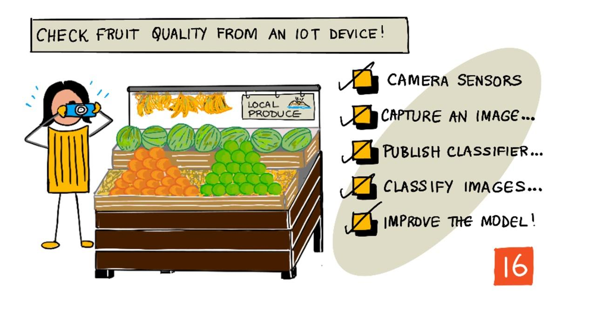

<!--
CO_OP_TRANSLATOR_METADATA:
{
  "original_hash": "557f4ee96b752e0651d2e6e74aa6bd14",
  "translation_date": "2025-08-28T16:04:40+00:00",
  "source_file": "4-manufacturing/lessons/2-check-fruit-from-device/README.md",
  "language_code": "uk"
}
-->
# Перевірка якості фруктів за допомогою IoT-пристрою



> Скетчнот від [Nitya Narasimhan](https://github.com/nitya). Натисніть на зображення для збільшення.

## Тест перед лекцією

[Тест перед лекцією](https://black-meadow-040d15503.1.azurestaticapps.net/quiz/31)

## Вступ

У попередньому уроці ви дізналися про класифікатори зображень і як навчати їх для визначення якісних і неякісних фруктів. Щоб використовувати цей класифікатор зображень у додатку IoT, вам потрібно мати можливість захоплювати зображення за допомогою камери і надсилати його в хмару для класифікації.

У цьому уроці ви дізнаєтеся про сенсори камер і як використовувати їх із IoT-пристроєм для захоплення зображень. Ви також навчитеся викликати класифікатор зображень із вашого IoT-пристрою.

У цьому уроці ми розглянемо:

* [Сенсори камер](../../../../../4-manufacturing/lessons/2-check-fruit-from-device)
* [Захоплення зображення за допомогою IoT-пристрою](../../../../../4-manufacturing/lessons/2-check-fruit-from-device)
* [Публікація класифікатора зображень](../../../../../4-manufacturing/lessons/2-check-fruit-from-device)
* [Класифікація зображень із вашого IoT-пристрою](../../../../../4-manufacturing/lessons/2-check-fruit-from-device)
* [Покращення моделі](../../../../../4-manufacturing/lessons/2-check-fruit-from-device)

## Сенсори камер

Сенсори камер, як випливає з назви, — це камери, які можна підключити до вашого IoT-пристрою. Вони можуть робити статичні знімки або записувати потокове відео. Деякі повертають необроблені дані зображення, інші стискають дані в файл зображення, наприклад JPEG або PNG. Зазвичай камери, які працюють із IoT-пристроями, набагато менші та мають нижчу роздільну здатність, ніж ті, до яких ви звикли, але можна знайти камери високої роздільної здатності, які можуть конкурувати з найкращими телефонами. Ви можете отримати різноманітні змінні об'єктиви, багатокамерні установки, інфрачервоні тепловізори або ультрафіолетові камери.


Більшість сенсорів камер використовують сенсори зображення, де кожен піксель є фотодіодом. Об'єктив фокусує зображення на сенсорі, і тисячі або мільйони фотодіодів фіксують світло, що падає на кожен із них, і записують це як дані пікселів.

> 💁 Об'єктиви перевертають зображення, а сенсор камери повертає його у правильну орієнтацію. Те ж саме відбувається у ваших очах — те, що ви бачите, спочатку фіксується догори дригом на задній частині вашого ока, а мозок виправляє це.

> 🎓 Сенсор зображення відомий як сенсор активних пікселів (APS), а найпопулярніший тип APS — це сенсор на основі комплементарного метал-оксидного напівпровідника, або CMOS. Ви могли чути термін CMOS-сенсор, який використовується для сенсорів камер.

Сенсори камер є цифровими сенсорами, які передають дані зображення у цифровому вигляді, зазвичай за допомогою бібліотеки, яка забезпечує комунікацію. Камери підключаються за допомогою протоколів, таких як SPI, щоб дозволити їм передавати великі обсяги даних — зображення значно більші за окремі числа, отримані від сенсора, наприклад, температурного сенсора.

✅ Які обмеження щодо розміру зображення існують для IoT-пристроїв? Подумайте про обмеження, особливо для апаратного забезпечення мікроконтролерів.

## Захоплення зображення за допомогою IoT-пристрою

Ви можете використовувати ваш IoT-пристрій для захоплення зображення, яке буде класифіковане.

### Завдання - захоплення зображення за допомогою IoT-пристрою

Виконайте відповідний посібник для захоплення зображення за допомогою вашого IoT-пристрою:

* [Arduino - Wio Terminal](wio-terminal-camera.md)
* [Одноплатний комп'ютер - Raspberry Pi](pi-camera.md)
* [Одноплатний комп'ютер - Віртуальний пристрій](virtual-device-camera.md)

## Публікація класифікатора зображень

Ви навчали ваш класифікатор зображень у попередньому уроці. Перед тим як використовувати його з вашого IoT-пристрою, вам потрібно опублікувати модель.

### Ітерації моделі

Коли ваша модель навчалася у попередньому уроці, ви могли помітити, що вкладка **Performance** показує ітерації збоку. Коли ви вперше навчали модель, ви бачили *Iteration 1* у процесі навчання. Коли ви покращували модель за допомогою зображень для прогнозування, ви бачили *Iteration 2* у процесі навчання.

Кожного разу, коли ви навчаєте модель, створюється нова ітерація. Це спосіб відстежувати різні версії вашої моделі, навчені на різних наборах даних. Коли ви робите **Quick Test**, є випадаючий список, який дозволяє вибрати ітерацію, щоб порівняти результати між кількома ітераціями.

Коли ви задоволені ітерацією, ви можете опублікувати її, щоб зробити доступною для використання зовнішніми додатками. Таким чином, ви можете мати опубліковану версію, яка використовується вашими пристроями, а потім працювати над новою версією через кілька ітерацій, а потім опублікувати її, коли будете задоволені.

### Завдання - публікація ітерації

Ітерації публікуються через портал Custom Vision.

1. Запустіть портал Custom Vision на [CustomVision.ai](https://customvision.ai) і увійдіть, якщо ви ще не відкрили його. Потім відкрийте ваш проект `fruit-quality-detector`.

1. Виберіть вкладку **Performance** з опцій у верхній частині.

1. Виберіть останню ітерацію зі списку *Iterations* збоку.

1. Натисніть кнопку **Publish** для ітерації.

    

1. У діалоговому вікні *Publish Model* встановіть *Prediction resource* на ресурс `fruit-quality-detector-prediction`, який ви створили у попередньому уроці. Залиште назву як `Iteration2` і натисніть кнопку **Publish**.

1. Після публікації натисніть кнопку **Prediction URL**. Це покаже деталі API прогнозування, які вам знадобляться для виклику моделі з вашого IoT-пристрою. Нижня секція позначена *If you have an image file*, і це ті деталі, які вам потрібні. Скопіюйте URL, який виглядає приблизно так:

    ```output
    https://<location>.api.cognitive.microsoft.com/customvision/v3.0/Prediction/<id>/classify/iterations/Iteration2/image
    ```

    Де `<location>` — це місце, яке ви використовували при створенні вашого ресурсу Custom Vision, а `<id>` — це довгий ідентифікатор, що складається з літер і цифр.

    Також скопіюйте значення *Prediction-Key*. Це захищений ключ, який потрібно передати при виклику моделі. Тільки додатки, які передають цей ключ, можуть використовувати модель, всі інші додатки будуть відхилені.

    

✅ Коли нова ітерація опублікована, вона матиме іншу назву. Як ви думаєте, як можна змінити ітерацію, яку використовує IoT-пристрій?

## Класифікація зображень із вашого IoT-пристрою

Тепер ви можете використовувати ці дані для підключення, щоб викликати класифікатор зображень із вашого IoT-пристрою.

### Завдання - класифікація зображень із вашого IoT-пристрою

Виконайте відповідний посібник для класифікації зображень за допомогою вашого IoT-пристрою:

* [Arduino - Wio Terminal](wio-terminal-classify-image.md)
* [Одноплатний комп'ютер - Raspberry Pi/Віртуальний IoT-пристрій](single-board-computer-classify-image.md)

## Покращення моделі

Можливо, ви помітите, що результати, які ви отримуєте при використанні камери, підключеної до вашого IoT-пристрою, не відповідають вашим очікуванням. Прогнози не завжди такі точні, як при використанні зображень, завантажених із вашого комп'ютера. Це тому, що модель була навчена на інших даних, ніж ті, які використовуються для прогнозів.

Щоб отримати найкращі результати для класифікатора зображень, потрібно навчати модель на зображеннях, які максимально схожі на ті, що використовуються для прогнозів. Наприклад, якщо ви використовували камеру телефону для захоплення зображень для навчання, якість зображення, чіткість і кольори будуть відрізнятися від камери, підключеної до IoT-пристрою.


На зображенні вище банан зліва був сфотографований за допомогою камери Raspberry Pi, а справа — за допомогою iPhone у тому ж місці. Є помітна різниця в якості — зображення з iPhone чіткіше, з яскравішими кольорами і більшим контрастом.

✅ Що ще може спричинити неправильні прогнози для зображень, захоплених вашим IoT-пристроєм? Подумайте про середовище, в якому може використовуватися IoT-пристрій, які фактори можуть впливати на захоплення зображення?

Щоб покращити модель, ви можете перенавчити її, використовуючи зображення, захоплені з IoT-пристрою.

### Завдання - покращення моделі

1. Класифікуйте кілька зображень як стиглих, так і нестиглих фруктів за допомогою вашого IoT-пристрою.

1. У порталі Custom Vision перенавчіть модель, використовуючи зображення на вкладці *Predictions*.

    > ⚠️ Ви можете звернутися до [інструкцій з перенавчання класифікатора у уроці 1, якщо потрібно](../1-train-fruit-detector/README.md#retrain-your-image-classifier).

1. Якщо ваші зображення сильно відрізняються від оригінальних, використаних для навчання, ви можете видалити всі оригінальні зображення, вибравши їх на вкладці *Training Images* і натиснувши кнопку **Delete**. Щоб вибрати зображення, наведіть курсор на нього, і з'явиться галочка, натисніть на неї, щоб вибрати або скасувати вибір зображення.

1. Навчіть нову ітерацію моделі і опублікуйте її, використовуючи наведені вище кроки.

1. Оновіть URL-адресу кінцевої точки у вашому коді і перезапустіть додаток.

1. Повторюйте ці кроки, поки не будете задоволені результатами прогнозів.

---

## 🚀 Виклик

Наскільки роздільна здатність зображення або освітлення впливають на прогноз?

Спробуйте змінити роздільну здатність зображень у коді вашого пристрою і подивіться, чи вплине це на якість зображень. Також спробуйте змінити освітлення.

Якби ви створювали пристрій для продажу фермам або фабрикам, як би ви забезпечили його стабільні результати весь час?

## Тест після лекції

[Тест після лекції](https://black-meadow-040d15503.1.azurestaticapps.net/quiz/32)

## Огляд і самостійне навчання

Ви навчали вашу модель Custom Vision через портал. Це залежить від наявності зображень — у реальному світі ви можете не мати навчальних даних, які відповідають тому, що захоплює камера вашого пристрою. Ви можете обійти це, навчаючи модель безпосередньо з вашого пристрою за допомогою API навчання, щоб навчати модель, використовуючи зображення, захоплені вашим IoT-пристроєм.

* Ознайомтеся з API навчання у [швидкому старті використання SDK Custom Vision](https://docs.microsoft.com/azure/cognitive-services/custom-vision-service/quickstarts/image-classification?WT.mc_id=academic-17441-jabenn&tabs=visual-studio&pivots=programming-language-python)

## Завдання

[Реагування на результати класифікації](assignment.md)

---

**Відмова від відповідальності**:  
Цей документ був перекладений за допомогою сервісу автоматичного перекладу [Co-op Translator](https://github.com/Azure/co-op-translator). Хоча ми прагнемо до точності, будь ласка, майте на увазі, що автоматичні переклади можуть містити помилки або неточності. Оригінальний документ на його рідній мові слід вважати авторитетним джерелом. Для критичної інформації рекомендується професійний людський переклад. Ми не несемо відповідальності за будь-які непорозуміння або неправильні тлумачення, що виникають внаслідок використання цього перекладу.